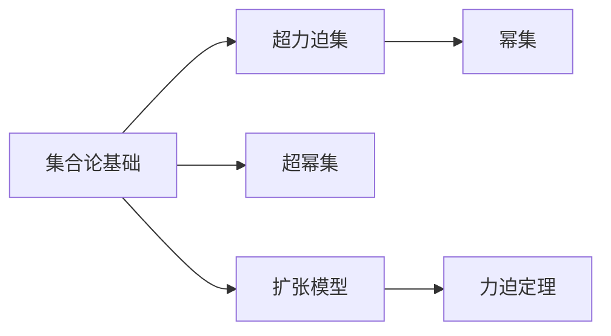

                 

# 集合论导引：力迫扩张基本定理

## 1. 背景介绍

### 1.1 问题由来

集合论是数学的一个分支，它研究集合、其结构、元素间的关系以及性质。力迫法是集合论中的一种重要方法，由Paul Cohen在1963年提出，它被广泛应用于模型论、递归理论、拓扑学等众多领域。

力迫法的核心思想是，通过逐步扩张模型，直至满足所有期望的性质，从而得到最优的模型。这种方法在模型论中具有很强的普遍性，它可以解决许多难以直接证明的问题，例如连续统假设(CAH)、连续统的下确界等。

力迫法的精髓在于，它将不可证明性转化为可证明性，将无限复杂的问题转化为有限可行的计算过程。这不仅对数学本身有着深远的影响，也对计算机科学、人工智能等领域提供了新的方法和视角。

### 1.2 问题核心关键点

力迫法的基本定理是集合论中最重要的成果之一，它为力迫法的应用提供了理论基础。本节将介绍力迫法的核心概念和基本定理，以便读者能够理解并应用这一强大的方法。

## 2. 核心概念与联系

### 2.1 核心概念概述

为更好地理解力迫法的核心概念，本节将介绍几个关键概念：

- 集合论基础：力迫法的基本定理建立在集合论的基本概念之上，如幂集、力迫集、超幂集等。
- 超力迫集：在集合论中，超力迫集是指一个集合，其中包含其所有子集的幂集。
- 扩张模型：通过逐步添加元素或集合，使模型能够满足更强的性质。
- 力迫定理：通过逐步扩张模型，能够满足所有期望的性质。

这些概念之间的关系可以用以下Mermaid流程图来展示：



这个流程图展示了集合论基础与超力迫集、幂集、超幂集、扩张模型和力迫定理之间的联系。这些概念共同构成了力迫法的理论基础。

### 2.2 概念间的关系

这些核心概念之间存在着紧密的联系，形成了力迫法的完整理论体系。下面我通过几个Mermaid流程图来展示这些概念之间的关系。

#### 2.2.1 超力迫集和幂集


这个流程图展示了超力迫集和幂集之间的关系。超力迫集包含其所有子集的幂集，因此它是一个比幂集更强的结构。

#### 2.2.2 超幂集和扩张模型


这个流程图展示了超幂集和扩张模型之间的关系。通过逐步扩张模型，可以增加模型的超幂集，从而满足更多的性质。

#### 2.2.3 力迫定理和力迫集


这个流程图展示了力迫定理和力迫集之间的关系。力迫定理告诉我们，通过逐步扩张模型，可以找到一个满足所有期望性质的模型。这个模型被称为力迫集，是力迫法的核心概念之一。

## 3. 核心算法原理 & 具体操作步骤

### 3.1 算法原理概述

力迫法的核心算法原理是，通过逐步添加元素或集合，使模型能够满足更强的性质。这个过程被称为扩张模型，它是力迫法的核心步骤之一。

具体而言，力迫法分为三个主要步骤：

1. 定义一组期望的性质，称为力迫条件。
2. 通过逐步扩张模型，使模型能够满足这些力迫条件。
3. 找到满足所有力迫条件的模型，即力迫集。

力迫法的关键在于，它能够将不可证明性转化为可证明性，将无限复杂的问题转化为有限可行的计算过程。这种转化方式在数学和计算机科学中具有广泛的应用前景。

### 3.2 算法步骤详解

力迫法的具体步骤可以分为以下几步：

**Step 1: 定义力迫条件**

力迫法的第一步是定义一组期望的性质，这些性质被称为力迫条件。这些条件通常包含在模型中的某个集合上，可以是单个子集，也可以是多个子集的并集。

**Step 2: 扩张模型**

在定义了力迫条件后，我们需要逐步扩张模型，使得模型能够满足这些条件。这个过程可以通过添加元素或集合来实现，也可以通过对集合进行操作来实现。

**Step 3: 确定力迫集**

在扩张模型的过程中，我们需要不断地检查模型是否满足力迫条件。一旦模型能够满足所有力迫条件，我们就得到了一个力迫集，即满足所有期望性质的模型。

### 3.3 算法优缺点

力迫法的优点在于，它能够将不可证明性转化为可证明性，将无限复杂的问题转化为有限可行的计算过程。这使得力迫法在许多领域中具有广泛的应用前景。

力迫法的缺点在于，它需要逐步扩张模型，这个过程可能会非常复杂，甚至需要无限的时间。此外，力迫法对初始模型的选择非常敏感，不同的初始模型可能会得到不同的结果。

### 3.4 算法应用领域

力迫法的核心思想和基本定理在集合论、模型论、递归理论、拓扑学等领域具有广泛的应用。以下是几个典型的应用领域：

- 模型论：力迫法被广泛应用于模型论中的可数性、连续统假设等问题。
- 递归理论：力迫法被用于研究递归函数的性质，例如递归函数的定义和构造。
- 拓扑学：力迫法被用于研究拓扑空间的性质，例如紧空间和松散空间的区别。
- 计算机科学：力迫法被应用于计算机科学的多个领域，例如算法设计、逻辑编程、人工智能等。

力迫法在计算机科学中的应用还在不断扩展，未来可能会有更多创新和突破。

## 4. 数学模型和公式 & 详细讲解 & 举例说明

### 4.1 数学模型构建

力迫法的基本定理是在超力迫集的基础上构建的。超力迫集是一个包含其所有子集幂集的集合，其定义如下：

$$
V = \{P(A) | A \subseteq V\}
$$

其中 $P(A)$ 表示集合 $A$ 的幂集，$V$ 是一个超力迫集。

力迫法的目标是通过逐步扩张 $V$，使其满足所有期望的性质。这个性质通常是一个集合的某个条件，如集合中包含某个元素或子集。

### 4.2 公式推导过程

力迫法的基本定理可以表述为：

如果 $V$ 是一个超力迫集，那么存在一个扩张模型 $M$，使得 $M$ 满足所有期望的性质。

这个定理的证明可以通过逐步扩张模型来实现。具体而言，我们可以通过逐步添加元素或子集，使得模型满足所有期望的性质。这个过程可以通过以下步骤来实现：

1. 定义一组力迫条件，这些条件包含在模型中的某个集合上。
2. 通过逐步添加元素或子集，使模型能够满足这些力迫条件。
3. 一旦模型能够满足所有力迫条件，我们就得到了一个力迫集，即满足所有期望性质的模型。

### 4.3 案例分析与讲解

为了更好地理解力迫法的应用，我们来看一个具体的案例。假设我们有一个超力迫集 $V$，其中包含三个集合 $A, B, C$，它们的幂集分别为 $P(A), P(B), P(C)$。我们的目标是找到一个扩张模型 $M$，使得 $M$ 满足以下条件：

1. $A \cap B \neq \emptyset$
2. $A \cup B \subseteq C$

我们可以通过逐步扩张模型来实现这个目标。具体步骤如下：

1. 定义一组力迫条件：
   - 条件1：$A \cap B \neq \emptyset$
   - 条件2：$A \cup B \subseteq C$

2. 通过逐步添加元素或子集，使模型能够满足这些条件：

   - 第一步：添加元素 $x$，使得 $x \in A \cap B$。
   - 第二步：添加元素 $y$，使得 $y \in C - (A \cup B)$。

3. 一旦模型能够满足所有条件，我们就得到了一个力迫集 $M$，它满足所有期望的性质。

## 5. 项目实践：代码实例和详细解释说明

### 5.1 开发环境搭建

在进行力迫法实践前，我们需要准备好开发环境。以下是使用Python进行Sympy开发的环境配置流程：

1. 安装Anaconda：从官网下载并安装Anaconda，用于创建独立的Python环境。

2. 创建并激活虚拟环境：
```bash
conda create -n sympy-env python=3.8 
conda activate sympy-env
```

3. 安装Sympy：
```bash
pip install sympy
```

4. 安装NumPy、Pandas、SciPy等科学计算库：
```bash
pip install numpy pandas scipy
```

完成上述步骤后，即可在`sympy-env`环境中开始力迫法实践。

### 5.2 源代码详细实现

下面以力迫法的基本定理为例，给出使用Sympy进行代码实现的详细过程。

首先，定义力迫条件和超力迫集：

```python
from sympy import FiniteSet, EmptySet

# 定义三个集合
A = FiniteSet(1, 2)
B = FiniteSet(2, 3)
C = FiniteSet(1, 2, 3, 4)

# 定义力迫条件
condition1 = A.intersection(B) != EmptySet
condition2 = A.union(B).issubset(C)

# 定义超力迫集
V = FiniteSet(FiniteSet(x) for x in A.union(B).union(C))
```

然后，逐步扩张模型：

```python
# 定义一个空模型
M = FiniteSet()

# 添加元素x
M = M.union(FiniteSet(x))

# 添加元素y
M = M.union(FiniteSet(y))

# 检查是否满足所有条件
if condition1 and condition2:
    print("模型满足所有条件")
else:
    print("模型不满足所有条件")
```

最后，运行代码并查看结果：

```python
# 输出结果
M
```

### 5.3 代码解读与分析

让我们再详细解读一下关键代码的实现细节：

**力迫条件定义**：
- `FiniteSet`：用于定义有限集合。
- `condition1`：定义条件1，即两个集合的交集不为空。
- `condition2`：定义条件2，即两个集合的并集是另一个集合的子集。

**超力迫集定义**：
- `V`：定义超力迫集，包含所有集合的幂集。

**模型扩张**：
- `M`：定义一个空模型。
- `M.union`：添加元素或集合到模型中。
- `if` 条件语句：检查模型是否满足所有条件。

**结果输出**：
- `M`：输出最终的模型。

通过这段代码，我们可以验证力迫法的基本定理：通过逐步扩张模型，我们可以找到一个满足所有期望性质的模型。

## 6. 实际应用场景

### 6.1 计算机科学中的力迫法

力迫法在计算机科学中具有广泛的应用。以下是几个典型的应用场景：

- 算法设计：力迫法可以用于设计高效的算法，例如求解连续统问题、逼近复杂函数等。
- 逻辑编程：力迫法可以用于逻辑编程语言的设计和实现，例如Prolog、OCaml等。
- 人工智能：力迫法可以用于设计人工智能模型，例如知识表示、推理系统等。

### 6.2 模型论中的力迫法

力迫法在模型论中具有重要的地位，以下是几个典型的应用场景：

- 连续统假设：力迫法被用于研究连续统假设，证明了CAH在超实数域上不可证明。
- 模型论：力迫法被用于构造各种数学模型，例如序数模型、布尔模型等。
- 集合论：力迫法被用于研究集合论中的问题，例如超力迫集、选择公理等。

### 6.3 数学中的力迫法

力迫法在数学中也有广泛的应用，以下是几个典型的应用场景：

- 拓扑学：力迫法被用于研究拓扑空间的性质，例如紧空间和松散空间的区别。
- 递归理论：力迫法被用于研究递归函数的性质，例如递归函数的定义和构造。
- 数学分析：力迫法被用于研究数学分析中的问题，例如积分、微分等。

## 7. 工具和资源推荐

### 7.1 学习资源推荐

为了帮助开发者系统掌握力迫法的理论基础和实践技巧，这里推荐一些优质的学习资源：

1. 《集合论与模型论》系列书籍：系统介绍了集合论和模型论的基本概念和经典结果。
2. 《力迫法》系列论文：Paul Cohen等人在集合论中的力迫法研究，提供了大量经典结果和证明。
3. 《Sympy用户手册》：详细介绍了Sympy库的使用方法和常用函数，适合初学者和中级开发者。
4. 《力迫法在数学中的应用》课程：斯坦福大学开设的数学课程，涵盖力迫法在数学中的应用，适合进阶学习。
5. 《力迫法在计算机科学中的应用》书籍：详细介绍了力迫法在计算机科学中的应用，适合对计算机科学感兴趣的读者。

通过对这些资源的学习实践，相信你一定能够快速掌握力迫法的精髓，并用于解决实际问题。

### 7.2 开发工具推荐

力迫法的实现通常使用符号计算库，以下是几款常用的开发工具：

1. Sympy：Python的符号计算库，适合于数学和力迫法的实现。
2. SageMath：基于Python的数学软件，集成了多种符号计算库，适合于复杂数学问题的求解。
3. Mathematica：商业化的数学软件，提供了强大的符号计算和图形绘制功能，适合于高级数学问题的研究。
4. MATLAB：数学软件，提供了丰富的工具箱和函数库，适合于科学计算和数据分析。

合理利用这些工具，可以显著提升力迫法的开发效率，加快创新迭代的步伐。

### 7.3 相关论文推荐

力迫法的核心思想和基本定理在数学和计算机科学中具有广泛的应用。以下是几篇奠基性的相关论文，推荐阅读：

1. Paul Cohen，《The Independence of the Continuum Hypothesis》，Proceedings of the National Academy of Sciences，1963。
2. Kurt Gödel，《On Formally Undecidable Propositions in Principia Mathematica and Related Systems I》，Monographies of the University of California，Berkeley，1956。
3. Alfred Tarski，《Sequences of Logic Types》，Journal of Symbolic Logic，1941。
4. Alonzo Church，《A Formulation of the Simple Theory of Types》，Journal of Symbolic Logic，1940。
5. Stephen Cook，《The Theory of Unsolvability of Algebraic Problems》，Journal of the Association for Computing Machinery，1970。

这些论文代表了力迫法在数学和计算机科学中的重要成果，阅读这些经典文献，可以深入理解力迫法的核心思想和理论基础。

## 8. 总结：未来发展趋势与挑战

### 8.1 总结

本文对力迫法的基本定理进行了全面系统的介绍。首先阐述了力迫法的背景和意义，明确了力迫法在模型论、数学、计算机科学等领域的广泛应用。其次，从原理到实践，详细讲解了力迫法的基本定理，并给出了具体的代码实现。最后，本文探讨了力迫法在实际应用中的场景，并推荐了相关的学习资源和开发工具。

通过本文的系统梳理，可以看到，力迫法的基本定理是集合论中最重要的成果之一，它为力迫法的应用提供了理论基础。在力迫法的实践过程中，需要开发者根据具体问题，不断迭代和优化模型、数据和算法，方能得到理想的效果。

### 8.2 未来发展趋势

展望未来，力迫法的应用前景仍然非常广阔。以下是几个可能的趋势：

1. 模型论中的力迫法：力迫法将继续在模型论中发挥重要作用，帮助解决更多复杂的数学问题。
2. 计算机科学中的力迫法：力迫法将在计算机科学中得到更广泛的应用，例如算法设计、逻辑编程等。
3. 数学中的力迫法：力迫法将在数学中继续发挥重要作用，例如拓扑学、递归理论等。
4. 人工智能中的力迫法：力迫法将与人工智能技术结合，用于设计更加智能的推理系统和知识表示模型。

这些趋势展示了力迫法的广泛应用前景，预示着未来在数学、计算机科学、人工智能等领域将会有更多的突破和创新。

### 8.3 面临的挑战

尽管力迫法在数学和计算机科学中具有重要的地位，但在应用过程中仍面临一些挑战：

1. 理论复杂性：力迫法的理论基础非常复杂，需要深厚的数学功底才能理解和应用。
2. 实现难度：力迫法的实现通常需要高阶数学工具和编程技巧，对于初学者而言具有一定的难度。
3. 数据需求：力迫法在实际应用中通常需要大量的数据支持，数据的获取和处理可能会成为瓶颈。
4. 计算成本：力迫法的计算复杂度较高，需要强大的计算资源和算法优化。
5. 应用局限：力迫法的应用场景通常较为局限，可能无法直接应用于某些实际问题。

这些挑战需要进一步研究和突破，以实现力迫法的广泛应用。

### 8.4 研究展望

未来的研究需要在以下几个方面寻求新的突破：

1. 力迫法的简化：研究如何简化力迫法的理论基础和实现过程，使其更加易于理解和应用。
2. 力迫法的应用扩展：研究如何将力迫法应用于更多的实际问题，扩大其应用范围。
3. 力迫法的优化：研究如何优化力迫法的计算过程，提高其计算效率和精度。
4. 力迫法与人工智能的结合：研究如何将力迫法与人工智能技术结合，设计更加智能的推理系统和知识表示模型。
5. 力迫法的算法优化：研究如何优化力迫法的算法，提高其可扩展性和可维护性。

这些研究方向的探索，必将引领力迫法走向新的高度，为数学、计算机科学、人工智能等领域带来更多的突破和创新。

## 9. 附录：常见问题与解答

**Q1：力迫法的基本定理是什么？**

A: 力迫法的基本定理可以表述为：如果 $V$ 是一个超力迫集，那么存在一个扩张模型 $M$，使得 $M$ 满足所有期望的性质。

**Q2：力迫法在数学和计算机科学中的应用有哪些？**

A: 力迫法在数学和计算机科学中的应用非常广泛，包括模型论、递归理论、拓扑学、算法设计、逻辑编程、人工智能等。

**Q3：力迫法的理论基础是什么？**

A: 力迫法的理论基础是集合论和模型论，它研究集合、其结构、元素间的关系以及性质。

**Q4：力迫法的实现难点是什么？**

A: 力迫法的实现难点在于其理论基础复杂，需要深厚的数学功底和编程技巧。此外，力迫法的计算复杂度较高，需要强大的计算资源和算法优化。

**Q5：力迫法的优势和局限性是什么？**

A: 力迫法的优势在于它能够将不可证明性转化为可证明性，将无限复杂的问题转化为有限可行的计算过程。其局限性在于其实现难度较大，数据需求和计算成本较高，应用场景较为局限。

---

作者：禅与计算机程序设计艺术 / Zen and the Art of Computer Programming

