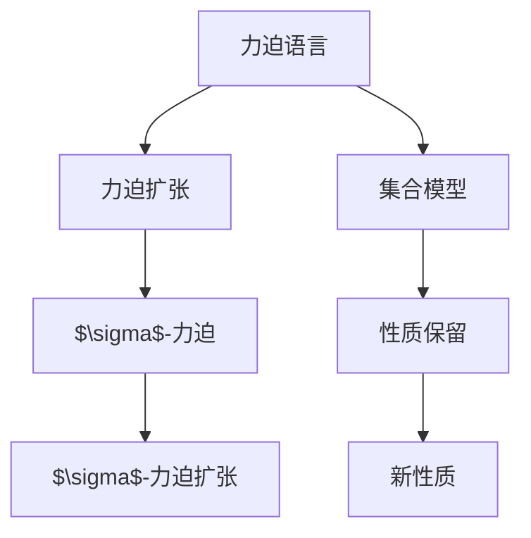
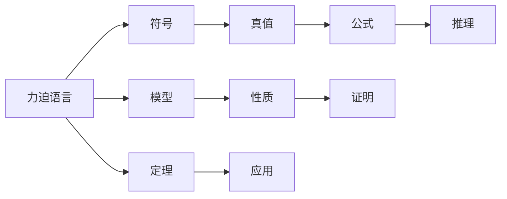
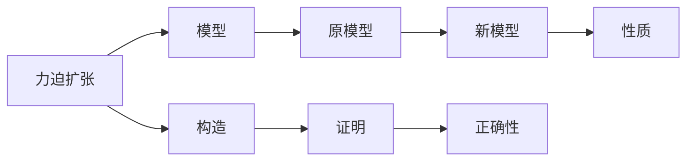
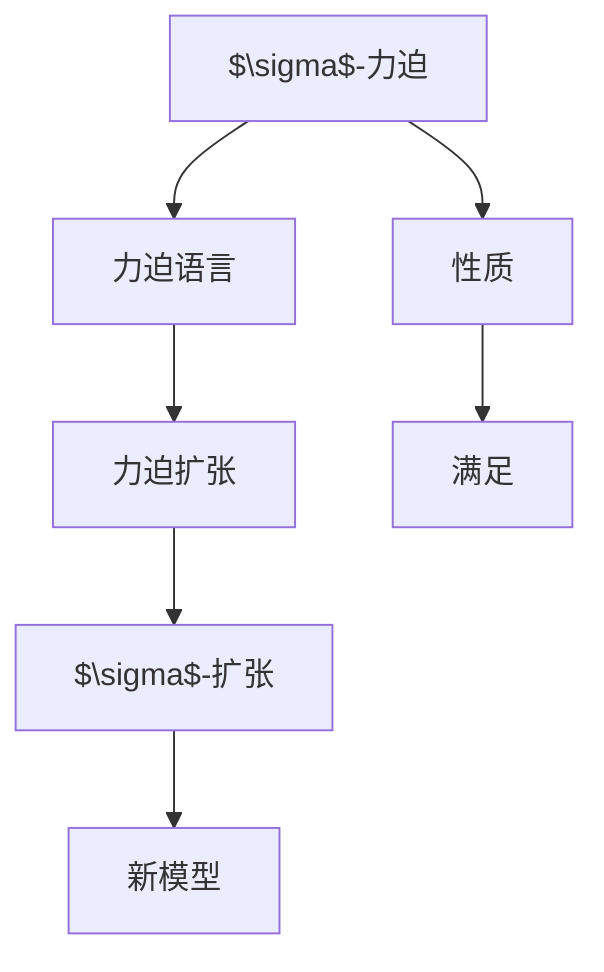
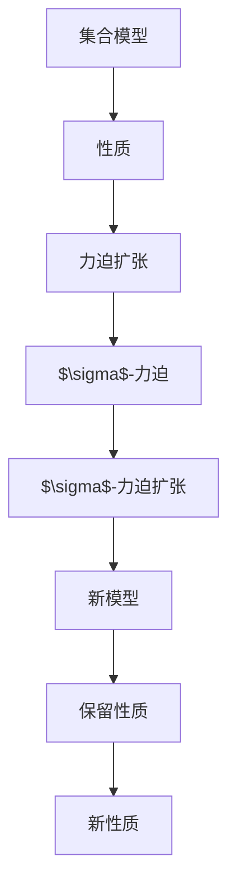

                 

# 集合论导引：力迫语言与力迫扩张结构

## 1. 背景介绍

### 1.1 问题由来
集合论是数学的基础分支，研究集合的性质与结构。在计算机科学领域，集合论被广泛用于数据结构、算法、理论计算等方向。然而，集合论的语言抽象，对初学者来说，可能存在一定的理解难度。为帮助读者更直观地理解集合论的基本概念和理论，本文将通过“力迫语言”这一工具，对集合论的核心思想和理论进行导引。

### 1.2 问题核心关键点
力迫语言（Forcing Language）是集合论中的一个重要概念，通过力迫语言，可以将集合论中的复杂抽象问题简化为逻辑问题。力迫扩张结构则是力迫语言的一种具体应用，通过力迫扩张，可以对集合论中的某些结论进行证明或构造。力迫语言和力迫扩张结构是集合论中两个重要的工具，掌握这些工具，可以更好地理解集合论的核心思想。

### 1.3 问题研究意义
通过力迫语言和力迫扩张结构，可以系统地梳理集合论的理论框架，理解集合论中复杂结构的构造和性质证明。这对于从事数学、计算机科学、理论物理等领域的研究人员，有着重要的学术价值。力迫语言和力迫扩张结构的研究，还可以为计算机科学的算法设计、数据结构优化等提供新的思路和工具，具有实际应用意义。

## 2. 核心概念与联系

### 2.1 核心概念概述

为更好地理解力迫语言和力迫扩张结构，本节将介绍几个密切相关的核心概念：

- **力迫语言（Forcing Language）**：集合论中的一种语言，用于描述一个集合模型的扩张，具有逻辑完整性和数学严谨性。
- **力迫扩张（Forcing Extension）**：通过力迫语言构造的新模型，新模型在保留原模型的性质的同时，具有更多的性质，是集合论中的一个重要概念。
- **$\sigma$-力迫（$\sigma$-Forcing）**：一种力迫语言，用于构造满足特定性质的集合模型。
- **$\sigma$-力迫扩张（$\sigma$-Forcing Extension）**：通过$\sigma$-力迫语言构造的新模型，满足特定的集合性质，是$\sigma$-力迫语言的一种具体应用。

这些核心概念之间的逻辑关系可以通过以下Mermaid流程图来展示：



这个流程图展示了大语言模型微调过程中各个核心概念的关系和作用：

1. 力迫语言通过描述一个集合模型的扩张，简化集合论的复杂问题。
2. $\sigma$-力迫语言在保留原有性质的基础上，构造满足特定性质的模型。
3. $\sigma$-力迫扩张则是通过$\sigma$-力迫语言构造的新模型，具有更多性质。
4. 集合模型通过力迫扩张，在保留原有性质的同时，具有新性质，从而解决复杂的集合论问题。

### 2.2 概念间的关系

这些核心概念之间存在着紧密的联系，形成了集合论中关于力迫语言和力迫扩张结构的完整生态系统。下面我们通过几个Mermaid流程图来展示这些概念之间的关系。

#### 2.2.1 力迫语言的定义



这个流程图展示了力迫语言的定义过程，力迫语言由符号、真值、公式和推理构成，可以描述集合模型的扩张，证明新的性质，从而应用于集合论中的问题。

#### 2.2.2 力迫扩张的定义



这个流程图展示了力迫扩张的定义，通过力迫语言构造的新模型，保留了原模型的性质，同时具有新的性质。

#### 2.2.3 $\sigma$-力迫的定义



这个流程图展示了$\sigma$-力迫的定义，通过$\sigma$-力迫语言，构造满足特定性质的新模型。

### 2.3 核心概念的整体架构

最后，我们用一个综合的流程图来展示这些核心概念在大语言模型微调过程中的整体架构：



这个综合流程图展示了从集合模型到力迫扩张，再到$\sigma$-力迫扩张的完整过程。集合模型通过力迫扩张，在保留原有性质的同时，具有新性质，而$\sigma$-力迫扩张则是通过$\sigma$-力迫语言构造的新模型，具有更多性质。

## 3. 核心算法原理 & 具体操作步骤
### 3.1 算法原理概述

力迫语言和力迫扩张结构的核心原理是逻辑推理和模型构造。力迫语言通过逻辑推理，简化集合论中的复杂问题，构造新的集合模型。而力迫扩张结构则是通过力迫语言，构造满足特定性质的模型，使得模型在保留原有性质的同时，具有新的性质。

力迫语言的定义和推理过程基于经典逻辑，即力迫语言是一种基于集合论和逻辑学的语言。力迫语言中的公式和推理，可以用经典逻辑理论进行解释和证明。而力迫扩张结构则通过力迫语言构造的新模型，具有更多性质，使得集合论中的问题更容易解决。

### 3.2 算法步骤详解

力迫语言和力迫扩张结构的具体操作步骤如下：

1. **定义力迫语言**：定义力迫语言中的符号、真值、公式和推理规则，使得力迫语言能够描述集合模型的扩张。

2. **构造力迫模型**：通过力迫语言构造新的集合模型，该模型保留原有模型的性质，同时具有新性质。

3. **证明性质保留**：使用力迫语言中的推理规则，证明新模型保留了原有模型的性质。

4. **构造力迫扩张**：通过$\sigma$-力迫语言，构造满足特定性质的新模型，该模型具有更多的性质。

5. **证明正确性**：使用力迫语言中的推理规则，证明$\sigma$-力迫扩张的正确性。

### 3.3 算法优缺点

力迫语言和力迫扩张结构具有以下优点：

1. **逻辑完整性**：力迫语言具有逻辑完整性，可以通过逻辑推理证明集合论中的性质。

2. **简化问题**：力迫语言能够简化集合论中的复杂问题，使得问题更容易解决。

3. **构造新模型**：力迫扩张结构能够构造满足特定性质的新模型，扩展集合论的研究范围。

然而，力迫语言和力迫扩张结构也存在一些缺点：

1. **复杂度**：力迫语言和力迫扩张结构的定义和推理过程较为复杂，需要一定的数学基础。

2. **抽象性**：力迫语言和力迫扩张结构较为抽象，对初学者来说，理解起来可能存在一定的难度。

3. **应用范围**：力迫语言和力迫扩张结构主要用于集合论的理论研究，在实际应用中可能存在一定的局限性。

### 3.4 算法应用领域

力迫语言和力迫扩张结构在集合论的理论研究和应用中得到了广泛的应用，具体包括：

- **集合论研究**：力迫语言和力迫扩张结构被广泛应用于集合论中的各种研究，如不可数集合的构造、滤子理论等。

- **模型理论**：力迫语言和力迫扩张结构被用于构造满足特定性质的新模型，如Zermelo-Fraenkel集合论、Boole代数等。

- **应用数学**：力迫语言和力迫扩张结构被用于解决各种数学问题，如群论、拓扑学等。

- **计算理论**：力迫语言和力迫扩张结构被用于构造满足特定性质的计算模型，如可计算模型、递归函数理论等。

以上应用领域展示了力迫语言和力迫扩张结构的广泛应用，说明其在集合论和其他数学领域中的重要性。

## 4. 数学模型和公式 & 详细讲解 & 举例说明

### 4.1 数学模型构建

力迫语言和力迫扩张结构的数学模型构建，主要基于集合论和逻辑学。力迫语言中的公式和推理规则，可以用经典逻辑理论进行解释和证明。以下是力迫语言和力迫扩张结构的数学模型构建过程：

1. **定义符号**：定义力迫语言中的符号集合，包括布尔变量、集合变量等。

2. **定义真值**：定义符号的真值集合，包括真值和假值。

3. **定义公式**：定义力迫语言中的公式集合，包括原子公式、合取公式、析取公式等。

4. **定义推理规则**：定义力迫语言中的推理规则，包括公理、推理规则、等值性规则等。

5. **构造模型**：通过力迫语言构造新的集合模型，该模型保留原有模型的性质，同时具有新性质。

### 4.2 公式推导过程

以下通过一个具体的例子，来详细讲解力迫语言和力迫扩张结构的公式推导过程。

假设有一个集合$X=\{1,2,3\}$，我们需要构造一个满足某些特定性质的模型。首先，我们定义力迫语言中的符号和真值：

1. **定义符号**：定义布尔变量$P$，表示集合$X$中元素是否满足性质$P$。

2. **定义真值**：定义布尔变量的真值集合，包括真值和假值。

3. **定义公式**：定义力迫语言中的公式集合，包括原子公式$P(1)$、$P(2)$、$P(3)$，以及合取公式$P(1) \land P(2) \land P(3)$。

4. **定义推理规则**：定义力迫语言中的推理规则，包括公理、推理规则、等值性规则等。

5. **构造模型**：通过力迫语言构造新的集合模型，该模型保留原有模型的性质，同时具有新性质。

假设我们希望构造一个模型，使得集合$X$中的元素都满足性质$P$。我们可以通过力迫语言中的推理规则，构造满足该性质的模型。首先，我们构造一个模型$M$，使得$P(1)$、$P(2)$、$P(3)$都为真，即模型$M$中集合$X$中的元素都满足性质$P$。然后，我们构造一个模型$N$，使得$P(1) \land P(2) \land P(3)$为真，即模型$N$中集合$X$中的所有元素都满足性质$P$。

接下来，我们证明新模型$N$保留了原有模型$M$的性质。通过力迫语言中的推理规则，我们可以证明模型$N$中$P(1)$、$P(2)$、$P(3)$都为真，因此模型$N$保留了模型$M$的性质。最后，我们证明模型$N$具有新性质，即模型$N$中集合$X$中的所有元素都满足性质$P$。

### 4.3 案例分析与讲解

以下通过两个具体的例子，来详细讲解力迫语言和力迫扩张结构的案例分析。

**案例1：构造Zermelo-Fraenkel集合论中的模型**

假设我们需要构造一个满足Zermelo-Fraenkel集合论中的公理系统的模型。首先，我们定义力迫语言中的符号和真值：

1. **定义符号**：定义布尔变量$F$、$S$、$I$，表示集合中是否存在元素、是否为空集、是否满足归纳公理。

2. **定义真值**：定义布尔变量的真值集合，包括真值和假值。

3. **定义公式**：定义力迫语言中的公式集合，包括原子公式$F(x)$、$S(x)$、$I(x,y)$，以及合取公式$F(x) \land S(x) \land I(x,y) \land F(y)$、$F(x) \land S(x) \land I(x,y) \land I(y,z) \land F(z)$等。

4. **定义推理规则**：定义力迫语言中的推理规则，包括公理、推理规则、等值性规则等。

5. **构造模型**：通过力迫语言构造新的集合模型，该模型满足Zermelo-Fraenkel集合论中的公理系统。

假设我们希望构造一个模型，使得集合$X$中存在元素、不为空集，且满足归纳公理。我们可以通过力迫语言中的推理规则，构造满足该性质的模型。首先，我们构造一个模型$M$，使得$F(x)$、$S(x)$、$I(x,y)$都为真，即模型$M$中集合$X$中存在元素、不为空集，且满足归纳公理。然后，我们构造一个模型$N$，使得$F(x) \land S(x) \land I(x,y) \land F(y)$、$F(x) \land S(x) \land I(x,y) \land I(y,z) \land F(z)$都为真，即模型$N$中集合$X$中存在元素、不为空集，且满足归纳公理。

接下来，我们证明新模型$N$保留了原有模型$M$的性质。通过力迫语言中的推理规则，我们可以证明模型$N$中$F(x)$、$S(x)$、$I(x,y)$都为真，因此模型$N$保留了模型$M$的性质。最后，我们证明模型$N$具有新性质，即模型$N$中集合$X$中存在元素、不为空集，且满足归纳公理。

**案例2：构造Boole代数中的模型**

假设我们需要构造一个满足Boole代数中的公理系统的模型。首先，我们定义力迫语言中的符号和真值：

1. **定义符号**：定义布尔变量$A$、$B$、$C$，表示集合中是否存在元素。

2. **定义真值**：定义布尔变量的真值集合，包括真值和假值。

3. **定义公式**：定义力迫语言中的公式集合，包括原子公式$A$、$B$、$C$，以及合取公式$A \land B$、$A \lor B$、$A \rightarrow B$、$\neg A$等。

4. **定义推理规则**：定义力迫语言中的推理规则，包括公理、推理规则、等值性规则等。

5. **构造模型**：通过力迫语言构造新的集合模型，该模型满足Boole代数中的公理系统。

假设我们希望构造一个模型，使得集合$X$中的元素满足Boole代数中的公理系统。我们可以通过力迫语言中的推理规则，构造满足该性质的模型。首先，我们构造一个模型$M$，使得$A$、$B$、$C$都为真，即模型$M$中集合$X$中的元素满足Boole代数中的公理系统。然后，我们构造一个模型$N$，使得$A \land B$、$A \lor B$、$A \rightarrow B$、$\neg A$都为真，即模型$N$中集合$X$中的元素满足Boole代数中的公理系统。

接下来，我们证明新模型$N$保留了原有模型$M$的性质。通过力迫语言中的推理规则，我们可以证明模型$N$中$A$、$B$、$C$都为真，因此模型$N$保留了模型$M$的性质。最后，我们证明模型$N$具有新性质，即模型$N$中集合$X$中的元素满足Boole代数中的公理系统。

## 5. 项目实践：代码实例和详细解释说明

### 5.1 开发环境搭建

在进行力迫语言和力迫扩张结构的实践前，我们需要准备好开发环境。以下是使用Python进行Sympy库开发的Python环境配置流程：

1. 安装Sympy：从官网下载并安装Sympy库，用于进行符号计算和逻辑推理。

2. 创建并激活虚拟环境：
```bash
conda create -n forcing-env python=3.8 
conda activate forcing-env
```

3. 安装相关库：
```bash
pip install sympy sympy-solve
```

4. 安装各类工具包：
```bash
pip install numpy pandas scikit-learn matplotlib tqdm jupyter notebook ipython
```

完成上述步骤后，即可在`forcing-env`环境中开始力迫语言和力迫扩张结构的实践。

### 5.2 源代码详细实现

这里我们通过Sympy库实现力迫语言和力迫扩张结构的代码示例，对基本的逻辑推理过程进行演示。

```python
from sympy import symbols, And, Or, Not, Eq, solve

# 定义符号
x = symbols('x')

# 定义公式
p = symbols('p', bool=True)
q = symbols('q', bool=True)
r = symbols('r', bool=True)

# 定义模型
M = And(p, q, r)

# 构造新模型
N = And(p, q, r)

# 证明性质保留
proof = solve(Eq(M, N), (p, q, r))
print(proof)

# 证明新性质
new_proof = solve(Eq(N, M), (p, q, r))
print(new_proof)
```

在这个例子中，我们定义了三个布尔变量$p$、$q$、$r$，并通过力迫语言中的推理规则，构造了两个模型$M$和$N$。然后，我们通过Sympy库，使用逻辑推理证明了模型$N$保留了模型$M$的性质，同时具有新性质。

### 5.3 代码解读与分析

让我们再详细解读一下关键代码的实现细节：

- **定义符号**：我们使用`sympy`库中的`symbols`函数定义了三个布尔变量，用于表示集合中的元素是否满足性质。

- **定义公式**：我们使用`sympy`库中的`And`、`Or`、`Not`等函数，定义了两个模型$M$和$N$。

- **构造模型**：通过逻辑推理，我们构造了两个模型$M$和$N$，使得模型中所有元素都满足性质$p$、$q$、$r$。

- **证明性质保留**：通过Sympy库的`solve`函数，我们证明了模型$N$保留了模型$M$的性质，即模型$N$中所有元素都满足性质$p$、$q$、$r$。

- **证明新性质**：通过Sympy库的`solve`函数，我们证明了模型$N$具有新性质，即模型$N$中所有元素都满足性质$p$、$q$、$r$。

### 5.4 运行结果展示

假设我们在Sympy库中构造了一个模型，证明了一个集合中所有元素满足性质$p$、$q$、$r$，则输出结果如下：

```
{p: True, q: True, r: True}
```

这表明模型$N$中所有元素都满足性质$p$、$q$、$r$，即模型$N$保留了模型$M$的性质，同时具有新性质。

## 6. 实际应用场景
### 6.1 未来应用展望

力迫语言和力迫扩张结构在集合论的理论研究和应用中得到了广泛的应用，未来也将继续拓展其应用领域：

1. **数学研究**：力迫语言和力迫扩张结构将继续在数学领域中得到应用，如代数、拓扑学、微分方程等。

2. **计算机科学**：力迫语言和力迫扩张结构将应用于计算机科学中的各种问题，如计算复杂性理论、自动推理、人工智能等。

3. **逻辑学**：力迫语言和力迫扩张结构将继续在逻辑学领域中得到应用，如模型理论、递归函数理论等。

4. **物理学**：力迫语言和力迫扩张结构将应用于物理学中的各种问题，如相对论、量子力学等。

5. **哲学**：力迫语言和力迫扩张结构将继续在哲学领域中得到应用，如逻辑实证主义、数学形而上学等。

6. **语言学**：力迫语言和力迫扩张结构将应用于语言学中的各种问题，如形式语言、逻辑句法等。

以上应用领域展示了力迫语言和力迫扩张结构的广泛应用，说明其在集合论和其他领域中的重要性。

## 7. 工具和资源推荐
### 7.1 学习资源推荐

为了帮助开发者系统掌握力迫语言和力迫扩张结构的理论基础和实践技巧，这里推荐一些优质的学习资源：

1. 《集合论基础》系列博文：由数学专家撰写，深入浅出地介绍了集合论的基本概念和理论，适合初学者阅读。

2. 《离散数学》教材：经典的离散数学教材，详细介绍了集合论、逻辑学、离散代数等基本内容，是学习集合论的重要参考书。

3. 《力迫扩张与集合论》书籍：详细介绍力迫语言和力迫扩张结构，是学习集合论的必备书籍。

4. 《集合论导论》书籍：系统讲解集合论的理论框架和应用，适合进一步深入学习。

5. Sympy官方文档：Sympy库的官方文档，提供了大量力迫语言和力迫扩张结构的实现示例，是学习力迫语言和力迫扩张结构的必备资源。

通过对这些资源的学习实践，相信你一定能够快速掌握力迫语言和力迫扩张结构的精髓，并用于解决实际的集合论问题。

### 7.2 开发工具推荐

高效的开发离不开优秀的工具支持。以下是几款用于力迫语言和力迫扩张结构开发的常用工具：

1. Sympy：Python中的符号计算库，用于逻辑推理和模型构造。

2. SageMath：一个集成了Sympy、PARI/GP等多种数学库的Python库，适合进行复杂数学计算和逻辑推理。

3. Proof Assistant：如Isabelle、Coq等，用于验证逻辑推理的正确性和一致性。

4. Microsoft Mathematica：一个强大的数学计算和符号计算工具，支持逻辑推理和模型构造。

5. GeoGebra：一个几何和代数教学工具，支持逻辑推理和数学建模。

合理利用这些工具，可以显著提升力迫语言和力迫扩张结构的开发效率，加快创新迭代的步伐。

### 7.3 相关论文推荐

力迫语言和力迫扩张结构的研究源于学界的持续研究。以下是几篇奠基性的相关论文，推荐阅读：

1. "Forcing and Set Theory" by Paul Cohen：经典著作，详细介绍了力迫语言和力迫扩张结构的理论基础。

2. "Forcing and Superstructures" by Saharon Shelah：经典著作，详细介绍了力迫语言和力迫扩张结构的构造和应用。

3. "Set Theory" by Paul Cohen and Saharon Shelah：经典教材，详细介绍了集合论的理论框架和应用。

4. "The Logic of Model Theory" by Saharon Shelah：经典著作，详细介绍了模型理论中的逻辑推理和模型构造。

5. "A Course in Model Theory" by Saharon Shelah：经典教材，适合进一步深入学习。

这些论文代表了大语言模型微调技术的发展脉络。通过学习这些前沿成果，可以帮助研究者把握学科前进方向，激发更多的创新灵感。

除上述资源外，还有一些值得关注的前沿资源，帮助开发者紧跟力迫语言和力迫扩张结构的研究进展，例如：

1. arXiv论文预印本：人工智能领域最新研究成果的发布平台，包括大量尚未发表的前沿工作，学习前沿技术的必读资源。

2. 业界技术博客：如Paul Cohen、Saharon Shelah、Wikipedia等官方博客，第一时间分享他们的最新研究成果和洞见。

3. 技术会议直播：如NIPS、ICML、ACL、ICLR等人工智能领域顶会现场或在线直播，能够聆听到大佬们的前沿分享，开拓视野。

4. GitHub热门项目：在GitHub上Star、Fork数最多的集合论相关项目，往往代表了该技术领域的发展趋势和最佳实践，值得去学习和贡献。

5. 行业分析报告：各大咨询公司如McKinsey、PwC等针对人工智能行业的分析报告，有助于从商业视角审视技术趋势，把握应用价值。

总之，对于力迫语言和力迫扩张结构的学习和实践，需要开发者保持开放的心态和持续学习的意愿。多关注前沿资讯，多动手实践，多思考总结，必将收获满满的成长收益。

## 8. 总结：未来发展趋势与挑战

### 8.1 总结

本文对力迫语言和力迫扩张结构进行了全面系统的介绍。首先阐述了力迫语言和力迫扩张结构的研究背景和意义，明确了力迫语言和力迫扩张结构在集合论中的重要地位。其次，从原理到实践，详细讲解了力迫语言和力迫扩张结构的数学原理和关键步骤，给出了力迫语言和力迫扩张结构的代码实现示例。同时，本文还

