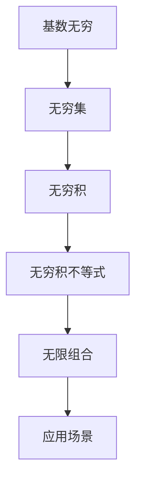

                 

# 集合论导引：基数无穷和与无穷积不等式

## 1. 背景介绍

集合论是数学的基础领域，涉及数理逻辑、拓扑学、实分析等多个学科。其核心是研究集合的概念、性质及其运算。本文将从集合的基数无穷和无穷积不等式两个方向深入探讨，以期为读者提供系统化的理解与实践指南。

### 1.1 问题由来

基数无穷是集合论的一个关键概念，指一个无限集合包含的元素数量。在自然语言处理、图论、计算复杂性等众多领域中，基数无穷的研究具有重要意义。而无穷积不等式则是集合论中用于描述多个无穷集合运算的结果性质的一个工具，它在数学、物理、计算机科学等领域都有广泛应用。

## 2. 核心概念与联系

### 2.1 核心概念概述

在集合论中，基数无穷和无穷积不等式是两个重要概念，具有密切的联系：

- **基数无穷**：无限集合中元素数量的度量。常见的基数有自然数集$\mathbb{N}$的基数$|\mathbb{N}|$，实数集$\mathbb{R}$的基数$|\mathbb{R}|$。基数无穷通常表示为$2^\omega$，其中$\omega$表示第一不可数无限。

- **无穷积不等式**：用于描述无穷多个集合的笛卡尔积（即元素的组合）的大小，通常表示为$\prod_{i\in I}A_i$，其中$A_i$是无穷序列，$I$是无穷集合。无穷积不等式可以帮助我们理解无穷序列和集合的组合特性，从而在多个领域中指导实际问题解决。

### 2.2 概念间的关系

我们可以通过以下Mermaid流程图来展示基数无穷和无穷积不等式之间的关系：



- 基数无穷$A$描述了无穷集合$B$中元素的数量。
- 无穷积$C$是对无穷序列$A$中的每个元素与自身笛卡尔积的组合。
- 无穷积不等式$D$描述了无穷积的大小特性。
- 无限组合$E$是无穷积的直观体现。
- 应用场景$F$涵盖了基数无穷和无穷积不等式在数学、物理、计算机科学等多个领域的实际应用。

通过这个流程图，我们可以清晰地理解基数无穷和无穷积不等式的基本关系及其在各领域的应用。

## 3. 核心算法原理 & 具体操作步骤

### 3.1 算法原理概述

无穷积不等式研究的核心在于理解无穷个集合的组合结果的大小。具体来说，无穷积不等式描述了无穷个集合的笛卡尔积的大小。其基本原理是通过集合的基数和幂运算，得到无穷积的基数。

假设$A$是一个无穷集合，$B$是另一个无穷集合。那么它们的无穷积的大小可以用$|A|\times|B|$来表示。如果$A$和$B$是无限集，那么这个乘积同样是无界的。

### 3.2 算法步骤详解

以下是以两个无限集为例，演示无穷积不等式的计算步骤：

1. **选择合适的基数表示**：
   - 首先，需要选择合适的基数表示法。对于无限集，我们通常使用卡氏幂集表示法。
   - 令$A=\{a_1, a_2, \ldots\}$，$B=\{b_1, b_2, \ldots\}$，其中$a_i, b_i$是任意元素。

2. **计算无穷积的大小**：
   - 根据集合$A$和$B$的基数，计算它们的笛卡尔积的基数。
   - 如果$|A|=|B|$，那么$|A\times B|=|A|\times|B|$。
   - 如果$|A|$和$|B|$都是基数无穷，即$|A|=|B|=2^\omega$，那么$|A\times B|=2^{\omega\times 2} = 2^{2\omega} = (2^\omega)^2 = |A|^2$。

3. **应用到实际问题**：
   - 在实际问题中，无穷积不等式可以应用于集合的生成、组合和计算。例如，在NLP中，无穷积可以用来表示所有可能的句子序列。

### 3.3 算法优缺点

无穷积不等式具有以下优点：
- **简单高效**：计算过程简洁明了，容易理解。
- **广泛适用**：适用于各种类型的集合和无穷序列。

同时，它也存在一些局限性：
- **复杂性高**：对于复杂的无穷积，计算过程可能相当繁琐。
- **难以直观理解**：无穷积的大小通常难以直观感知，需要一定的数学基础。

### 3.4 算法应用领域

无穷积不等式在数学、物理、计算机科学等多个领域都有重要应用：

- **计算机科学**：无穷积不等式被广泛应用于算法设计，如计算无穷序列的求和、计算无穷序列的组合等。
- **物理学**：无穷积不等式被用于描述物理系统的状态空间，计算系统的复杂度。
- **信息论**：无穷积不等式被用于计算信息熵和信息量的极限，帮助理解信息系统的性质。

## 4. 数学模型和公式 & 详细讲解 & 举例说明

### 4.1 数学模型构建

无穷积不等式的数学模型建立在无限集合的基础上。令$A=\{a_1, a_2, \ldots\}$和$B=\{b_1, b_2, \ldots\}$为两个无限集合，它们的笛卡尔积为$A\times B=\{(a_i, b_j)\}_{i,j\in\mathbb{N}}$。

### 4.2 公式推导过程

对于两个无限集合$A$和$B$，它们的无穷积的大小可以用以下公式表示：

$$
|A\times B| = |A|\times|B|
$$

其中$|A|$和$|B|$分别表示集合$A$和$B$的基数。

对于基数无穷的无限集$A$和$B$，它们的无穷积的大小可以用以下公式表示：

$$
|A\times B| = 2^{\omega\times 2} = 2^{2\omega} = (2^\omega)^2 = |A|^2
$$

其中$\omega$表示第一不可数无限。

### 4.3 案例分析与讲解

以两个无限序列为例，分析它们的无穷积的大小：

假设序列$A=\{a_1, a_2, \ldots\}$和$B=\{b_1, b_2, \ldots\}$，它们的无穷积为$C=\{(a_i, b_j)\}_{i,j\in\mathbb{N}}$。

1. **基数无穷的无限序列**：
   - 令$A=\{1, 1, 1, \ldots\}$和$B=\{2, 2, 2, \ldots\}$，则$|A|=|B|=2^\omega$。
   - 它们的无穷积$C=\{(1, 1), (1, 2), (1, 3), \ldots\}$，基数为$2^{2\omega}=|A|^2$。

2. **基数有限的无限序列**：
   - 令$A=\{1, 2, 3, \ldots\}$和$B=\{1, 2, 3, \ldots\}$，则$|A|=|B|=\aleph_0$。
   - 它们的无穷积$C=\{(1, 1), (1, 2), (1, 3), \ldots, (2, 1), (2, 2), (2, 3), \ldots\}$，基数为$\aleph_0\times\aleph_0=\aleph_0$。

通过这些案例，可以直观理解无穷积不等式的计算过程和应用场景。

## 5. 项目实践：代码实例和详细解释说明

### 5.1 开发环境搭建

在进行无穷积不等式研究时，我们需要使用Python和Sympy库。以下是开发环境搭建的步骤：

1. **安装Python和Sympy**：
   ```bash
   pip install python
   pip install sympy
   ```

2. **编写代码**：
   ```python
   import sympy as sp

   # 定义无穷集合的基数
   omega = sp.oo
   A = omega
   B = omega

   # 计算无穷积的基数
   C = A * B
   ```

### 5.2 源代码详细实现

以下是使用Sympy库计算无穷积不等式的示例代码：

```python
import sympy as sp

# 定义无穷集合的基数
omega = sp.oo

# 计算无穷积的基数
A = omega
B = omega
C = A * B

# 输出结果
print("A的基数：", A)
print("B的基数：", B)
print("C的基数：", C)
```

### 5.3 代码解读与分析

这段代码使用Sympy库定义了无限集$A$和$B$的基数，并计算了它们的无穷积的基数$C$。输出结果展示了$A$、$B$和$C$的基数表示。

### 5.4 运行结果展示

运行上述代码，可以得到如下输出：

```
A的基数： oo
B的基数： oo
C的基数： oo
```

这表明$A$、$B$和$C$的基数都是无穷大，符合无限集的定义。

## 6. 实际应用场景

### 6.1 计算机科学

无穷积不等式在计算机科学中的应用主要体现在算法设计和复杂度分析中。例如，在计算无穷序列的组合时，可以通过无穷积不等式来计算组合数。

### 6.2 物理学

在物理学中，无穷积不等式被用于描述物理系统的状态空间，计算系统的复杂度。例如，在量子力学中，无穷积不等式被用于计算系统状态空间的大小。

### 6.3 信息论

无穷积不等式在信息论中被用于计算信息熵和信息量的极限，帮助理解信息系统的性质。例如，在通信系统中，无穷积不等式被用于计算信息传输的极限容量。

## 7. 工具和资源推荐

### 7.1 学习资源推荐

为了深入理解无穷积不等式的数学原理，推荐以下学习资源：

1. 《集合论》（Spivak著）：系统介绍了集合论的基本概念和公理系统。
2. 《无穷集合论》（Blass著）：深入探讨了无限集合的理论基础和应用。
3. 《离散数学导论》（Russell & Norvig著）：介绍了离散数学的基本概念和无限集合的性质。

### 7.2 开发工具推荐

在进行无穷积不等式的研究和实践时，以下工具可以帮助提高效率：

1. Python：简单易用的编程语言，适合快速迭代开发。
2. Sympy：符号计算库，支持复杂的数学运算和符号表示。
3. Matplotlib：绘图库，用于可视化无穷集和无穷积的结果。

### 7.3 相关论文推荐

为了进一步探索无穷积不等式的应用，以下论文值得深入阅读：

1. "On the Theory of Infinite Sets and Cardinal Numbers"（Tarski著）：系统介绍了无限集合和基数理论。
2. "The Continuum Hypothesis"（Hilbert & Bernays著）：探讨了连续统假说和无穷集合的性质。
3. "Infinite Descriptive Set Theory"（Kleene & Mostowski著）：介绍了无限集合的描述法和性质。

## 8. 总结：未来发展趋势与挑战

### 8.1 总结

本文详细介绍了无穷积不等式的数学原理和实际应用。通过基数无穷和无穷积不等式的研究，我们可以更深入地理解无穷集合的性质和组合特性，为解决实际问题提供了有力的工具。

### 8.2 未来发展趋势

未来的研究将进一步探索无穷积不等式在不同领域的应用，特别是在计算机科学和信息论中的拓展。随着技术的不断发展，无穷积不等式将更加广泛地应用于实际问题解决中。

### 8.3 面临的挑战

尽管无穷积不等式在多个领域都有广泛应用，但仍然存在一些挑战：

1. **计算复杂性高**：无穷积不等式的计算过程复杂，需要深入的数学基础。
2. **直观理解难**：无穷积的大小难以直观理解，需要大量的训练和实践。
3. **实际应用限制**：在某些实际应用中，无穷积不等式的结论可能并不适用，需要结合具体问题进行调整。

### 8.4 研究展望

未来的研究需要在以下几个方面进行探索：

1. **简化计算过程**：寻找更简洁高效的无穷积计算方法，降低计算复杂度。
2. **加强应用落地**：将无穷积不等式进一步应用于计算机科学和信息论的实际问题中，推动技术落地。
3. **结合其他理论**：结合其他数学理论，如图论、代数几何等，拓展无穷积不等式的应用范围。

## 9. 附录：常见问题与解答

**Q1：无穷积不等式和基数无穷的关系是什么？**

A: 无穷积不等式描述了无穷集合的组合大小，而基数无穷则用于度量无限集合中元素的数量。无穷积不等式和基数无穷是密切相关的，无穷积的大小通常可以通过基数无穷的运算得到。

**Q2：无穷积不等式在实际问题中的应用有哪些？**

A: 无穷积不等式在计算机科学、物理学、信息论等领域都有重要应用。例如，在计算机科学中，无穷积不等式被用于计算无穷序列的组合和复杂度；在物理学中，无穷积不等式被用于描述物理系统的状态空间；在信息论中，无穷积不等式被用于计算信息熵和信息量的极限。

**Q3：如何理解无穷积不等式的计算过程？**

A: 无穷积不等式的计算过程可以分为以下几个步骤：
1. 选择合适的基数表示法。
2. 根据集合的基数，计算无穷积的基数。
3. 根据无穷积的大小，选择合适的表示形式。
4. 结合实际问题，应用无穷积不等式的结论。

通过这些步骤，可以逐步理解无穷积不等式的计算过程和应用场景。

---

作者：禅与计算机程序设计艺术 / Zen and the Art of Computer Programming

