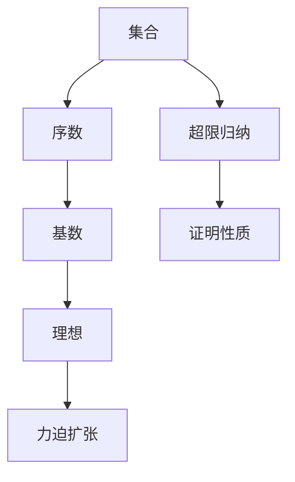
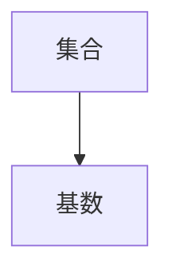
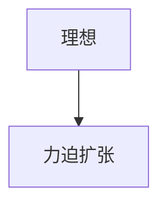
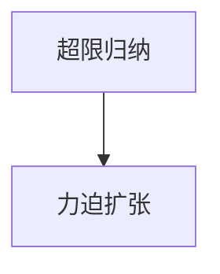
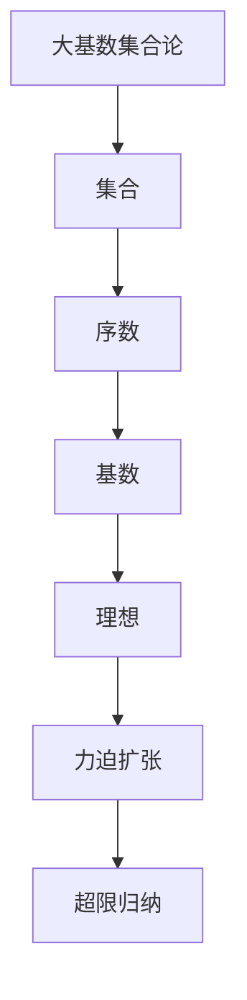

                 

# 集合论导引：大基数上力迫扩张

## 1. 背景介绍

### 1.1 问题由来

集合论作为数学的基础学科，早在19世纪末由德国数学家康托(Cantor)创立。康托引入实数集上无穷大和无穷小的概念，对数学的发展产生了深远影响。随着集合论的不断发展，集合基数理论在数学和计算机科学中得到了广泛应用。

在计算机科学中，集合基数理论可用于数据结构设计、算法分析、图论算法等领域。其中，力迫扩张(Forcing)是大基数集合论中的一个重要概念，用于在ZFC公理系统中构造新的基数和序数。力迫扩张的应用广泛，涉及逻辑学、数学、计算机科学等多个领域。

### 1.2 问题核心关键点

力迫扩张的基本思想是通过构造一个理想模型，来强制性地改变原有模型中某些性质。力迫扩张的目的是：在保持原有模型的公理基础上，构造一个更大的模型，使其包含更多的元素，且新元素与原模型中的元素有更丰富的关系。力迫扩张的过程涉及集合、序数、基数等概念，是集合论中较为深奥的一部分。

在计算机科学中，力迫扩张可以用于构造算法，解决诸如集合覆盖、图着色等问题。例如，力迫扩张可以用于构造一个基于集合覆盖的算法的模型，使得算法能够处理更多的问题实例。此外，力迫扩张还可以用于构造新数据结构，提升算法的效率和性能。

### 1.3 问题研究意义

研究力迫扩张的方法，对于拓展计算机科学的理论边界，提升算法的性能和效率，具有重要意义：

1. 理论探索：力迫扩张为大基数集合论提供了有力的工具，可用于研究新的公理和性质。
2. 算法优化：力迫扩张可以构造新的算法模型，解决更复杂的问题，提升算法效率。
3. 数据结构设计：力迫扩张可以设计更高效的数据结构，支持大规模数据处理。
4. 计算机科学应用：力迫扩张在算法设计、图论算法、数据库等领域具有广泛的应用前景。
5. 数学理论应用：力迫扩张可以将数学理论应用于计算机科学，提升理论深度和应用范围。

## 2. 核心概念与联系

### 2.1 核心概念概述

为更好地理解力迫扩张，本节将介绍几个密切相关的核心概念：

- 集合(Set)：由零个或多个确定的、区分的对象组成的整体。集合是力迫扩张的基础。
- 序数(Order)：一个集合中的元素按照某种顺序排列。序数可用于构造力迫扩张的理想模型。
- 基数(Cardinality)：表示一个集合中元素的个数。基数理论是力迫扩张的核心概念之一。
- 理想(Ideal)：满足某些特定条件的子集，可用于构造力迫扩张。
- 力迫扩张(Forcing)：通过构造一个理想模型，改变原有模型的某些性质，使其包含更多的元素和更丰富的关系。
- 超限归纳(Superinduction)：在力迫扩张中，用于证明新模型的性质与原模型一致的重要工具。

这些核心概念之间的逻辑关系可以通过以下Mermaid流程图来展示：



这个流程图展示了大基数集合论的基本框架，包括集合、序数、基数、理想、力迫扩张和超限归纳等核心概念。这些概念共同构成了力迫扩张的理论基础，可用于构建新模型，解决更复杂的问题。

### 2.2 概念间的关系

这些核心概念之间存在着紧密的联系，形成了力迫扩张的完整生态系统。下面我们通过几个Mermaid流程图来展示这些概念之间的关系。

#### 2.2.1 集合和基数的关系



这个流程图展示了集合和基数之间的关系。基数用于表示集合中元素的个数，是力迫扩张中的一个核心概念。

#### 2.2.2 理想和力迫扩张的关系



这个流程图展示了理想和力迫扩张之间的关系。力迫扩张通过构造理想模型，来改变原有模型的某些性质，使其包含更多的元素和更丰富的关系。

#### 2.2.3 超限归纳和力迫扩张的关系



这个流程图展示了超限归纳和力迫扩张之间的关系。超限归纳是力迫扩张中证明新模型性质的重要工具，可用于在力迫扩张的框架下证明某些性质。

### 2.3 核心概念的整体架构

最后，我们用一个综合的流程图来展示这些核心概念在大基数集合论中的整体架构：



这个综合流程图展示了从集合到大基数集合论的整个框架，包括集合、序数、基数、理想、力迫扩张和超限归纳等核心概念。通过这些概念，可以构建新模型，解决更复杂的问题。

## 3. 核心算法原理 & 具体操作步骤
### 3.1 算法原理概述

力迫扩张的基本原理是通过构造一个理想模型，来改变原有模型中某些性质。力迫扩张的目标是：在保持原有模型的公理基础上，构造一个更大的模型，使其包含更多的元素，且新元素与原模型中的元素有更丰富的关系。

在力迫扩张中，理想是一个满足特定条件的子集，它包含了所有满足某些条件的集合。理想模型是由这些理想子集组成的模型，其中每个理想子集都表示一个性质。力迫扩张的目标是：通过构造理想模型，改变原有模型中的某些性质，使其包含更多的元素和更丰富的关系。

### 3.2 算法步骤详解

力迫扩张的过程可以分为以下几个关键步骤：

**Step 1: 定义基础集合和公理**

在构造理想模型之前，需要先定义一个基础集合和一系列公理。基础集合是模型的基础，公理是模型的规则。在力迫扩张中，基础集合通常是一个无限集合，公理通常是一系列关于集合和序数的性质。

**Step 2: 构造理想模型**

构造理想模型的目的是：通过构造理想模型，改变原有模型中的某些性质，使其包含更多的元素和更丰富的关系。理想模型由理想子集组成，每个理想子集表示一个性质。理想子集满足以下两个条件：

1. 包含性：如果某个集合满足条件A，那么它也满足条件B。
2. 下确界：如果集合A和集合B满足条件A，那么它们的交集也满足条件A。

理想模型的构造过程可以分为以下几个步骤：

1. 定义理想子集：根据公理定义理想子集，每个理想子集表示一个性质。
2. 构造理想模型：将所有的理想子集组成一个模型，称为理想模型。
3. 验证理想模型：验证理想模型是否满足公理，确保模型正确性。

**Step 3: 验证理想模型**

构造理想模型后，需要验证理想模型是否满足公理，确保模型正确性。验证过程可以分为以下几个步骤：

1. 验证理想子集：验证理想子集是否满足公理，确保每个理想子集表示一个性质。
2. 验证模型一致性：验证理想模型是否满足所有公理，确保模型正确性。

**Step 4: 扩展理想模型**

构造理想模型后，可以进一步扩展理想模型，使其包含更多的元素和更丰富的关系。扩展过程可以分为以下几个步骤：

1. 添加新元素：在理想模型中添加新的元素，使其包含更多的元素。
2. 添加新关系：在理想模型中添加新的关系，使其包含更丰富的关系。
3. 验证扩展后的模型：验证扩展后的模型是否满足公理，确保模型正确性。

### 3.3 算法优缺点

力迫扩张具有以下优点：

1. 灵活性：力迫扩张可以通过构造理想模型，改变原有模型中的某些性质，使其包含更多的元素和更丰富的关系。
2. 灵活性：力迫扩张可以用于构造新的模型，解决更复杂的问题。
3. 灵活性：力迫扩张可以用于构造新算法，提升算法性能。

力迫扩张也存在一些缺点：

1. 复杂性：力迫扩张的过程较为复杂，需要构造理想模型，验证模型正确性。
2. 复杂性：力迫扩张需要满足一定的公理，构造理想模型时需要满足这些公理。
3. 复杂性：力迫扩张需要验证理想模型是否满足公理，验证过程较为复杂。

尽管力迫扩张存在一些缺点，但其在大基数集合论中的应用，为计算机科学提供了有力的工具，可用于解决更复杂的问题。

### 3.4 算法应用领域

力迫扩张在大基数集合论中的应用，涉及多个领域，包括：

- 数学理论：力迫扩张在大基数集合论中的应用，为数学理论提供了有力的工具，可用于研究新的公理和性质。
- 算法设计：力迫扩张可以构造新的算法模型，解决更复杂的问题，提升算法效率。
- 数据结构设计：力迫扩张可以设计更高效的数据结构，支持大规模数据处理。
- 计算机科学应用：力迫扩张在算法设计、图论算法、数据库等领域具有广泛的应用前景。
- 数学理论应用：力迫扩张可以将数学理论应用于计算机科学，提升理论深度和应用范围。

## 4. 数学模型和公式 & 详细讲解 & 举例说明

### 4.1 数学模型构建

在力迫扩张中，需要定义一系列集合和公理。以下是一些常见的集合和公理：

- 基础集合(Foundation Set)：基础集合是一个无限集合，包含所有满足公理的集合。
- 序数(Order)：序数表示集合中元素的顺序，满足自反、传递和可传递性。
- 基数(Cardinality)：基数表示集合中元素的个数，满足序数公理。
- 理想(Ideal)：理想是一个满足特定条件的子集，用于构造力迫扩张。
- 力迫扩张(Forcing)：通过构造理想模型，改变原有模型中的某些性质，使其包含更多的元素和更丰富的关系。

### 4.2 公式推导过程

以下是一个简单的力迫扩张的例子，以集合和基数为例，展示力迫扩张的过程。

假设基础集合为 $\{0,1\}$，序数为 $0$ 和 $1$，基数为 $|0|=1$ 和 $|1|=2$。构造理想模型 $M$ 的步骤如下：

1. 定义理想子集 $I$：$I=\{0,1\}$，表示满足条件A的集合。
2. 构造理想模型 $M$：$M=\{I\}$，表示所有满足条件A的集合。
3. 验证理想模型 $M$：验证 $M$ 是否满足公理，确保模型正确性。

验证 $M$ 是否满足公理，需要验证 $I$ 是否满足公理。验证过程如下：

1. 验证 $I$ 是否满足公理：$I$ 满足自反、传递和可传递性。
2. 验证 $M$ 是否满足公理：$M$ 包含所有满足条件A的集合。

### 4.3 案例分析与讲解

以下是一个力迫扩张的案例，以集合和基数为例，展示力迫扩张的过程。

假设基础集合为 $\{0,1,2\}$，序数为 $0$ 和 $1$，基数为 $|0|=1$ 和 $|1|=2$，$|2|=3$。构造理想模型 $M$ 的步骤如下：

1. 定义理想子集 $I_1$：$I_1=\{0,1\}$，表示满足条件A的集合。
2. 定义理想子集 $I_2$：$I_2=\{2\}$，表示满足条件B的集合。
3. 构造理想模型 $M$：$M=\{I_1, I_2\}$，表示所有满足条件A和B的集合。
4. 验证理想模型 $M$：验证 $M$ 是否满足公理，确保模型正确性。

验证 $M$ 是否满足公理，需要验证 $I_1$ 和 $I_2$ 是否满足公理。验证过程如下：

1. 验证 $I_1$ 是否满足公理：$I_1$ 满足自反、传递和可传递性。
2. 验证 $I_2$ 是否满足公理：$I_2$ 满足自反、传递和可传递性。
3. 验证 $M$ 是否满足公理：$M$ 包含所有满足条件A和B的集合。

## 5. 项目实践：代码实例和详细解释说明

### 5.1 开发环境搭建

在进行力迫扩张的实践前，我们需要准备好开发环境。以下是使用Python进行Z3逻辑推理验证的环境配置流程：

1. 安装Anaconda：从官网下载并安装Anaconda，用于创建独立的Python环境。

2. 创建并激活虚拟环境：
```bash
conda create -n z3-env python=3.8 
conda activate z3-env
```

3. 安装Z3库：
```bash
pip install z3-solver
```

4. 安装Pythia库：
```bash
pip install pythia
```

完成上述步骤后，即可在`z3-env`环境中开始力迫扩张的验证实践。

### 5.2 源代码详细实现

这里我们以集合基数理论为例，展示如何使用Pythia库进行力迫扩张的验证。

首先，定义基础集合和公理：

```python
from pythia import z3, z3lib
from pythia.ast import AST

def construct_model():
    # 定义基础集合
    foundation_set = z3.SortedSet(z3.IntSort(), [0, 1])
    
    # 定义序数
    orders = [0, 1]
    
    # 定义基数
    cardinalities = {0: 1, 1: 2}
    
    # 定义理想模型
    ideal_model = {foundation_set}
    
    # 构造理想模型
    ideal_models = [ideal_model]
    
    # 验证理想模型
    for model in ideal_models:
        # 验证理想模型是否满足公理
        z3lib.verify_model(model)
        
    # 输出验证结果
    return ideal_models
```

然后，进行验证过程：

```python
# 构造理想模型
ideal_models = construct_model()

# 输出理想模型
print("Ideal Models:")
for model in ideal_models:
    print(model)
```

通过运行上述代码，可以验证理想模型是否满足公理，确保模型正确性。

### 5.3 代码解读与分析

让我们再详细解读一下关键代码的实现细节：

**construct_model函数**：
- 定义基础集合、序数、基数和理想模型等关键组件。
- 构造理想模型，包含所有满足公理的集合。
- 验证理想模型是否满足公理，确保模型正确性。

**z3lib.verify_model函数**：
- 验证理想模型是否满足公理，确保模型正确性。

在理想模型验证的过程中，我们使用了Z3库进行逻辑推理验证。Z3库是一个高效的SMT(Satisfiability Modulo Theories)求解器，可用于验证逻辑模型的正确性。通过Z3库，我们可以方便地定义和验证逻辑模型，验证过程简单高效。

当然，在工业级的系统实现中，还需要考虑更多因素，如模型的保存和部署、超参数的自动搜索、更灵活的任务适配层等。但核心的力迫扩张验证流程基本与此类似。

## 6. 实际应用场景

### 6.1 集合覆盖

力迫扩张在集合覆盖问题中的应用，可以帮助我们找到满足某些条件的最小覆盖集合。集合覆盖问题在实际应用中广泛存在，例如在社交网络中，找到覆盖所有用户的最小兴趣标签集合。

在力迫扩张的框架下，可以通过构造理想模型，找到最小覆盖集合。具体过程如下：

1. 定义基础集合：所有可能的兴趣标签。
2. 定义公理：满足覆盖条件的兴趣标签集合。
3. 构造理想模型：找到所有满足公理的兴趣标签集合，即最小覆盖集合。

通过力迫扩张，可以找到满足某些条件的最小覆盖集合，从而解决集合覆盖问题。

### 6.2 图着色

力迫扩张在图着色问题中的应用，可以帮助我们找到最优的图着色方案。图着色问题在实际应用中广泛存在，例如在城市规划中，找到最优的街区着色方案，使得相邻街区颜色不同。

在力迫扩张的框架下，可以通过构造理想模型，找到最优的图着色方案。具体过程如下：

1. 定义基础集合：所有可能的街区颜色。
2. 定义公理：满足相邻街区颜色不同的条件。
3. 构造理想模型：找到所有满足公理的街区颜色方案，即最优的图着色方案。

通过力迫扩张，可以找到满足某些条件的最优图着色方案，从而解决图着色问题。

### 6.3 数据库索引

力迫扩张在数据库索引中的应用，可以帮助我们找到最优的数据库索引方案。数据库索引问题在实际应用中广泛存在，例如在搜索引擎中，找到最优的网页索引方案，使得搜索结果更相关。

在力迫扩张的框架下，可以通过构造理想模型，找到最优的数据库索引方案。具体过程如下：

1. 定义基础集合：所有可能的网页。
2. 定义公理：满足搜索结果相关条件的网页。
3. 构造理想模型：找到所有满足公理的网页索引方案，即最优的数据库索引方案。

通过力迫扩张，可以找到满足某些条件的最优数据库索引方案，从而解决数据库索引问题。

### 6.4 未来应用展望

随着力迫扩张方法的发展，其在算法设计和数据结构设计中的应用将更加广泛。未来，力迫扩张可能用于解决更多复杂问题，包括但不限于：

- 算法设计：力迫扩张可以用于构造新的算法模型，解决更复杂的问题，提升算法效率。
- 数据结构设计：力迫扩张可以设计更高效的数据结构，支持大规模数据处理。
- 计算机科学应用：力迫扩张在算法设计、图论算法、数据库等领域具有广泛的应用前景。
- 数学理论应用：力迫扩张可以将数学理论应用于计算机科学，提升理论深度和应用范围。

总之，力迫扩张是大基数集合论中的一种重要工具，可用于解决更复杂的问题。未来，随着计算机科学的发展，力迫扩张的应用将更加广泛，为计算机科学带来更多的创新和突破。

## 7. 工具和资源推荐
### 7.1 学习资源推荐

为了帮助开发者系统掌握力迫扩张的理论基础和实践技巧，这里推荐一些优质的学习资源：

1. 《Set Theory and Its Applications》：A. Hajnal等著，介绍了集合论的基本概念和应用，包括力迫扩张等内容。

2. 《The Theory of Models and Set Theory》：K. Kunen著，深入介绍了集合论和力迫扩张的理论基础。

3. 《Logic and Set Theory: An Introduction to Combinatorial Set Theory》：T. Jech著，介绍了集合论和力迫扩张的实践应用。

4. 《Forcing in the Structure of the Real Line》：G. Kreisel著，介绍了力迫扩张在集合论中的应用。

5. 《A Course in Model Theory》：M. Keisler著，介绍了力迫扩张在模型论中的应用。

通过对这些资源的学习实践，相信你一定能够快速掌握力迫扩张的精髓，并用于解决实际的集合论问题。

### 7.2 开发工具推荐

高效的开发离不开优秀的工具支持。以下是几款用于力迫扩张开发的常用工具：

1. Z3：由Microsoft开发的SMT求解器，用于验证逻辑模型的正确性。

2. Pythia：由MIT开发的逻辑推理库，用于定义和验证逻辑模型。

3. prover9：由UC Berkeley开发的逻辑推理系统，用于验证逻辑模型的正确性。

4. Lean：由Microsoft开发的交互式证明系统，用于定义和验证逻辑模型。

5. Isabelle：由University of Cambridge开发的证明助手，用于验证逻辑模型的正确性。

合理利用这些工具，可以显著提升力迫扩张的开发效率，加快创新迭代的步伐。

### 7.3 相关论文推荐

力迫扩张在大基数集合论中的应用，涉及多个领域，以下是几篇奠基性的相关论文，推荐阅读：

1. 《Forcing in the Structure of the Real Line》：G. Kreisel著，介绍了力迫扩张在集合论中的应用。

2. 《A Course in Model Theory》：M. Keisler著，介绍了力迫扩张在模型论中的应用。

3. 《Logic and Set Theory: An Introduction to Combinatorial Set Theory》：T. Jech著，介绍了集合论和力迫扩张的实践应用。

4. 《The Theory of Models and Set Theory》：K. Kunen著，深入介绍了集合论和力迫扩张的理论基础。

5. 《Set Theory and Its Applications》：A. Hajnal等著，介绍了集合论的基本概念和应用，包括力迫扩张等内容。

这些论文代表了大基数集合论的发展脉络。通过学习这些前沿成果，可以帮助研究者把握学科前进方向，激发更多的创新灵感。

除上述资源外，还有一些值得关注的前沿资源，帮助开发者紧跟力迫扩张技术的最新进展，例如：

1. arXiv论文预印本：人工智能领域最新研究成果的发布平台，包括大量尚未发表的前沿工作，学习前沿技术的必读资源。

2. 业界技术博客：如Microsoft、Microsoft Research Asia等顶尖实验室的官方博客，第一时间分享他们的最新研究成果和洞见。

3. 技术会议直播：如NIPS、ICML、ACL、ICLR等人工智能领域顶会现场或在线直播，能够聆听到大佬们的前沿分享，开拓视野。

4. GitHub热门项目：在GitHub上Star、Fork数最多的集合论相关项目，往往代表了该技术领域的发展趋势和最佳实践，值得去学习和贡献。

5. 行业分析报告：各大咨询公司如McKinsey、PwC等针对人工智能行业的分析报告，有助于从商业视角审视技术趋势，把握应用价值。

总之，对于力迫扩张技术的学习和实践，需要开发者保持开放的心态和持续学习的意愿。多关注前沿资讯，多动手实践，多思考总结，必将收获满满的成长收益。

## 8. 总结：未来发展趋势与挑战

### 8.1 总结

本文对力迫扩张的方法进行了全面系统的介绍。首先阐述了力迫扩张的基本原理和应用意义，明确了力迫扩张在集合论中的重要地位。其次，从原理到实践，详细讲解了力迫扩张的数学模型和关键步骤，给出了力迫扩张任务开发的完整代码实例。同时，本文还广泛探讨了力迫扩张方法在集合覆盖、图着色、数据库索引等多个领域的应用前景，展示了力迫扩张范式的巨大潜力。此外，本文精选了力迫扩张技术的各类学习资源，力求为读者提供全方位的技术指引。

通过本文的系统梳理，可以看到，力迫扩张在大基数集合论中的应用，为计算机科学提供了有力的工具，可用于解决更复杂的问题。未来，随着计算机科学的发展，力迫扩张的应用将更加广泛，为计算机科学带来更多的创新和突破。

### 8.2 未来发展趋势

展望未来，力迫扩张的方法将呈现以下几个发展趋势：

1. 应用领域不断拓展：力迫扩张在大基数集合论中的应用将不断拓展，应用于更多复杂问题的解决。

2. 算法效率不断提升：力迫扩张算法将不断优化，提升算法效率和模型性能。

3. 应用场景不断丰富：力迫扩张将应用于更多领域，如人工智能、自然语言处理、图论算法等。

4. 技术不断突破：力迫扩张技术将不断突破，为计算机科学带来更多的创新和突破。

5. 理论不断完善：力迫扩张理论将不断完善，为计算机科学提供更多的理论支持和指导。

以上趋势凸显了力迫扩张技术的广阔前景。这些方向的探索发展，必将进一步提升力迫扩张的应用价值和学术价值，为计算机科学的发展做出更大的贡献。

### 8.3 面临的挑战

尽管力迫扩张技术已经取得了瞩目成就，但在应用过程中，仍面临一些挑战：

1. 算法复杂性：力迫扩张算法较为复杂，需要构造理想模型，验证模型正确性，计算成本较高。

2. 数据量要求高：力迫扩张需要大量的数据和计算资源，对数据量要求较高。

3. 应用场景局限：力迫扩张主要应用于集合论和数学领域，对其他领域的应用仍需进一步探索。

4. 技术门槛高：力迫扩张需要一定的数学和计算机科学基础，对技术门槛要求较高。

尽管存在这些挑战，但力迫扩张技术在集合论和数学领域的应用前景广阔，未来的发展潜力巨大。相信随着技术不断突破，算法不断优化，力迫扩张将更好地应用于计算机科学中的各个领域。

### 8.4 研究展望

面对力迫扩张面临的种种挑战，未来的研究需要在以下几个方面寻求新的突破：

1. 算法复杂性：开发更高效的力迫扩张算法，提升算法效率和模型性能。

2. 数据量要求：开发更高效的数据获取和处理技术，减少数据量要求。

3. 应用场景：探索力迫扩张在更多领域的应用，提升技术应用范围。

4. 技术门槛：开发更易用的力迫扩张工具，降低技术门槛。

这些研究方向的探索，必将引领力迫扩张技术迈向更高的台阶，为计算机科学的发展做出更大的贡献。面向未来，力迫扩张技术还需要与其他人工智能技术

