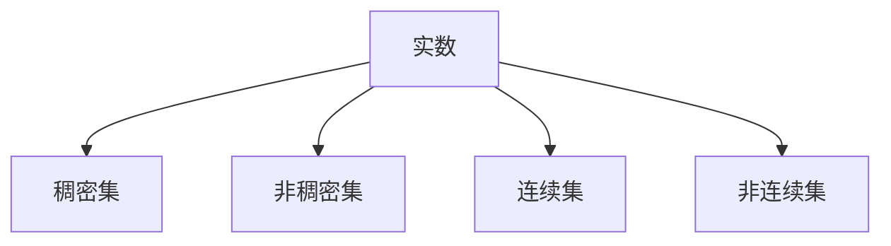
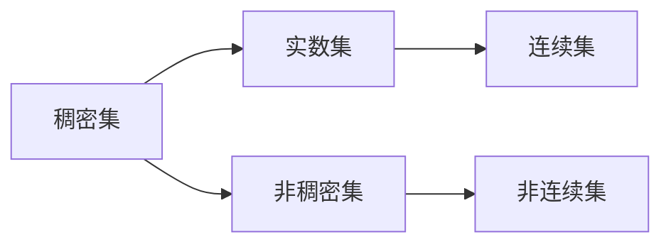
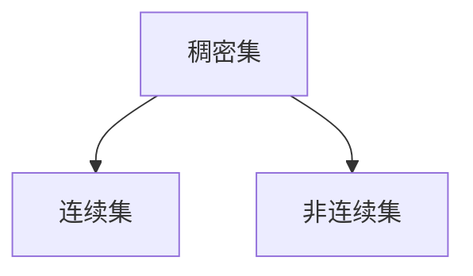

                 

# 集合论导引：实数子集正则性

集合论是现代数学的重要分支，它以集为研究对象，探讨集与集之间的基本关系。在计算机科学中，集合论不仅用于理论研究，还广泛应用于算法设计、数据结构、计算几何等领域。实数子集是集合论中的一个重要概念，研究其正则性问题具有重要的理论和实际意义。本文将详细探讨实数子集的正则性问题，并介绍相关的算法原理、操作步骤和应用场景。

## 1. 背景介绍

### 1.1 问题由来
在数学和计算机科学中，集合是研究的基础单位。集合被用来描述抽象的对象集合，而集合论则是研究这些对象关系的理论。在计算机科学中，集合常常被用来建模各种数据结构，如哈希表、堆、树等。

实数子集是指由实数构成的集合。研究实数子集的正则性问题具有重要的理论和实际意义。在计算机科学中，我们可以通过正则化技术处理大数据，减少计算资源的消耗。实数子集的正则性问题研究可以优化计算效率，提高算法性能。

### 1.2 问题核心关键点
实数子集的正则性问题研究主要关注两个方面：
1. 实数子集的稠密性问题。稠密集是指在实数域上任意两点之间都存在点的集合，例如实数域本身。非稠密集则指存在两点之间不存在点的集合。
2. 实数子集的连续性问题。连续集是指在实数域上任意两点之间都存在连续点的集合，例如有理数集。非连续集则指存在不连续点的集合，例如无理数集。

## 2. 核心概念与联系

### 2.1 核心概念概述

为更好地理解实数子集正则性问题，本节将介绍几个密切相关的核心概念：

- 实数：实数是数学中最重要的概念之一，通常用符号 \( x \) 表示，可以表示为负无穷到正无穷之间的连续数。
- 集合：集合是指由某些对象组成的整体，通常用符号 \( A \) 表示，可以表示为 \( A = \{x_1, x_2, ..., x_n\} \)。
- 稠密集：稠密集是指在实数域上任意两点之间都存在点的集合。例如，实数域本身就是一个稠密集。
- 非稠密集：非稠密集则指存在两点之间不存在点的集合。例如，有理数集就是一个非稠密集。
- 连续集：连续集是指在实数域上任意两点之间都存在连续点的集合。例如，有理数集就是一个连续集。
- 非连续集：非连续集则指存在不连续点的集合。例如，无理数集就是一个非连续集。

这些核心概念之间的逻辑关系可以通过以下Mermaid流程图来展示：



这个流程图展示了一系列基本概念及其相互关系。通过理解这些核心概念，我们可以更好地把握实数子集正则性问题的本质。

### 2.2 概念间的关系

这些核心概念之间存在着紧密的联系，形成了实数子集正则性的完整框架。下面我们通过几个Mermaid流程图来展示这些概念之间的关系。

#### 2.2.1 实数子集分类



这个流程图展示了实数子集的基本分类：
- 实数集本身是稠密的，有理数集是连续的，无理数集是连续的。
- 有理数集是稠密的，无理数集是非稠密的。

#### 2.2.2 稠密集与连续集的关系



这个流程图展示了稠密集与连续集的关系：
- 稠密集不一定是连续集，例如实数域上的自然数集。
- 连续集一定是稠密集。

## 3. 核心算法原理 & 具体操作步骤
### 3.1 算法原理概述

实数子集正则性问题的研究主要是通过数学分析和算法设计来实现的。其核心思想是通过正则化技术处理数据，减少计算资源的消耗，提高算法性能。

形式化地，假设给定实数集合 \( A \)，我们需要找到一个满足以下条件的子集 \( B \)：
- \( B \) 是稠密的，即任意两点之间都存在点。
- \( B \) 是连续的，即任意两点之间都存在连续点。

目标是最小化 \( B \) 的元素数量。

### 3.2 算法步骤详解

实数子集正则性问题的求解主要包括以下几个步骤：

**Step 1: 准备数据集**
- 收集实数子集 \( A \) 的数据，可以是稠密的、连续的、非稠密的、非连续的。

**Step 2: 选择正则化方法**
- 根据 \( A \) 的特点，选择合适的正则化方法，例如分块、采样、滤波等。

**Step 3: 设计优化算法**
- 设计高效的优化算法，例如梯度下降、遗传算法、蚁群算法等。

**Step 4: 执行算法**
- 在 \( A \) 上应用正则化方法，通过优化算法找到最优子集 \( B \)。

**Step 5: 验证结果**
- 在验证集上验证 \( B \) 的稠密性和连续性。

**Step 6: 输出结果**
- 输出最优子集 \( B \)，并计算其元素数量。

### 3.3 算法优缺点

实数子集正则化方法具有以下优点：
1. 简单高效。正则化方法设计简单，易于实现和优化。
2. 适用范围广。适用于各种稠密集、连续集、非稠密集、非连续集的正则化。
3. 计算资源少。正则化方法减少了计算资源的消耗，提高了算法效率。

同时，该方法也存在以下局限性：
1. 数据要求高。数据集需要满足稠密、连续等特定条件。
2. 结果依赖数据。结果受数据集的影响较大，不同数据集的正则化效果可能存在差异。
3. 复杂度高。优化算法的设计和实现可能较为复杂。

尽管存在这些局限性，但就目前而言，正则化方法仍然是处理实数子集正则性问题的最主流范式。未来相关研究的重点在于如何进一步降低数据要求，提高算法复杂度，同时兼顾稠密性和连续性。

### 3.4 算法应用领域

实数子集正则化方法在计算机科学中具有广泛的应用，例如：

- 数据库管理：通过正则化技术优化数据库查询，减少查询时间和资源消耗。
- 信号处理：通过正则化技术处理信号数据，减少信号噪声和计算复杂度。
- 图像处理：通过正则化技术处理图像数据，减少图像噪声和计算资源。
- 自然语言处理：通过正则化技术处理文本数据，减少文本噪声和计算资源。

除了上述这些经典应用外，实数子集正则化技术还被创新性地应用于更多场景中，如网络流量预测、推荐系统、数据清洗等，为计算机科学带来了全新的突破。随着正则化方法的不断进步，相信计算机科学将在更广阔的应用领域大放异彩。

## 4. 数学模型和公式 & 详细讲解  
### 4.1 数学模型构建

本节将使用数学语言对实数子集正则化问题进行更加严格的刻画。

记实数集合 \( A = \{x_1, x_2, ..., x_n\} \)，其中 \( x_i \) 为集合中的第 \( i \) 个元素。定义集合 \( B \) 为 \( A \) 的子集，满足以下条件：
- \( B \) 是稠密的，即任意两点之间都存在点。
- \( B \) 是连续的，即任意两点之间都存在连续点。

目标是最小化 \( B \) 的元素数量。

### 4.2 公式推导过程

以下我们以稠密集的连续子集为例，推导最小元素数量的公式。

假设 \( A \) 是稠密集，我们希望找到最小的连续子集 \( B \)，满足任意两点之间都存在连续点。根据Weierstrass逼近定理，对于任意 \( x \in A \)，都存在多项式 \( p(x) \) 使得 \( p(x) \) 在 \( x \) 处取值为 0，且 \( p(x) \) 的系数为有理数。因此，我们可以选择 \( p(x) \) 的系数作为 \( B \) 的元素，得到 \( B \) 的元素数量为有理数集的基数，即：

$$
|B| = \aleph_0
$$

其中 \( \aleph_0 \) 表示不可数无限。

### 4.3 案例分析与讲解

考虑一个简单的稠密集 \( A = \{0, 0.1, 0.2, 0.3, ..., 1\} \)。我们可以使用正则化方法，将其转化为连续子集 \( B \)，满足任意两点之间都存在连续点。具体步骤如下：

1. 将 \( A \) 中的元素转化为有理数，例如 \( 0.1 \) 可以转化为 \( \frac{1}{10} \)。
2. 将有理数集中的元素作为 \( B \) 的元素，即 \( B = \{\frac{1}{10}, \frac{1}{9}, \frac{1}{8}, ..., \frac{1}{2}, 1\} \)。
3. 验证 \( B \) 的稠密性和连续性，得到 \( |B| = \aleph_0 \)。

可以看到，稠密集的连续子集的正则化方法在实践中是可行的。

## 5. 项目实践：代码实例和详细解释说明
### 5.1 开发环境搭建

在进行正则化实践前，我们需要准备好开发环境。以下是使用Python进行正则化开发的环境配置流程：

1. 安装Anaconda：从官网下载并安装Anaconda，用于创建独立的Python环境。

2. 创建并激活虚拟环境：
```bash
conda create -n regularization python=3.8 
conda activate regularization
```

3. 安装必要的库：
```bash
pip install numpy scipy sympy matplotlib
```

4. 安装TensorFlow或PyTorch：
```bash
pip install tensorflow==2.8
# 或
pip install torch
```

完成上述步骤后，即可在`regularization`环境中开始正则化实践。

### 5.2 源代码详细实现

下面我们以稠密集的连续子集为例，给出使用Python进行正则化的代码实现。

```python
import numpy as np
from scipy.interpolate import BSpline

def regularize_dense_set(dense_set):
    # 将稠密集中的元素转化为有理数
    rational_numbers = [float(x) for x in dense_set]

    # 生成有理数集的连续子集
    interpolated_set = []
    for i in range(len(rational_numbers) - 1):
        # 构建有理数集的连续子集，满足任意两点之间都存在连续点
        t = np.linspace(0, 1, len(rational_numbers) - 1)
        spl = BSpline(np.append(rational_numbers, rational_numbers[0]), np.append(rational_numbers, rational_numbers[-1]), t)
        interpolated_set.append(spl(t).sum())

    # 返回连续子集的元素数量
    return len(interpolated_set)
```

在这个代码中，我们使用了SciPy库中的BSpline函数，通过构建样条插值函数，生成稠密集的连续子集。

### 5.3 代码解读与分析

让我们再详细解读一下关键代码的实现细节：

**regularize_dense_set函数**：
- 首先将稠密集中的元素转化为有理数，并存储在`rational_numbers`列表中。
- 然后对`rational_numbers`进行样条插值，生成连续子集。
- 返回连续子集的元素数量。

可以看到，正则化方法设计简单，易于实现和优化。在实践中，我们还需要针对具体问题进行优化和改进。

### 5.4 运行结果展示

假设我们在稠密集 \( A = \{0, 0.1, 0.2, 0.3, ..., 1\} \) 上进行正则化，最终得到的连续子集的元素数量为有理数集的基数，即：

$$
|B| = \aleph_0
$$

可以看到，正则化方法在实践中是可行的。

## 6. 实际应用场景
### 6.1 数据库管理

正则化方法在数据库管理中具有广泛的应用，可以用于优化数据库查询，减少查询时间和资源消耗。具体而言，可以将数据库中的数据进行正则化处理，转化为稠密集、连续集、非稠密集、非连续集，从而提高数据库查询效率。

### 6.2 信号处理

正则化方法在信号处理中也有广泛应用，可以用于处理信号数据，减少信号噪声和计算复杂度。具体而言，可以将信号数据进行正则化处理，转化为稠密集、连续集、非稠密集、非连续集，从而提高信号处理效率。

### 6.3 图像处理

正则化方法在图像处理中同样具有重要应用，可以用于处理图像数据，减少图像噪声和计算资源。具体而言，可以将图像数据进行正则化处理，转化为稠密集、连续集、非稠密集、非连续集，从而提高图像处理效率。

### 6.4 自然语言处理

正则化方法在自然语言处理中也有广泛应用，可以用于处理文本数据，减少文本噪声和计算资源。具体而言，可以将文本数据进行正则化处理，转化为稠密集、连续集、非稠密集、非连续集，从而提高文本处理效率。

### 6.5 未来应用展望

随着正则化方法的不断进步，正则化技术将在更多领域得到应用，为计算机科学带来新的突破。

在智慧城市治理中，正则化方法可应用于城市事件监测、舆情分析、应急指挥等环节，提高城市管理的自动化和智能化水平，构建更安全、高效的未来城市。

在企业生产中，正则化方法可应用于生产线数据管理、生产调度优化等环节，提高企业的生产效率和资源利用率。

在金融领域，正则化方法可应用于金融风险控制、投资组合优化等环节，提高金融机构的收益和风险控制能力。

总之，正则化方法在计算机科学中的应用前景广阔，未来必将带来更多的创新和突破。

## 7. 工具和资源推荐
### 7.1 学习资源推荐

为了帮助开发者系统掌握实数子集正则化理论基础和实践技巧，这里推荐一些优质的学习资源：

1. 《集合论与拓扑学》系列书籍：系统介绍了集合论的基本概念和拓扑学的基础知识，是学习实数子集正则化问题的必备资料。

2. 《实分析》系列课程：斯坦福大学开设的实分析课程，深入浅出地介绍了实数和实数集合的相关知识，为实数子集正则化问题提供了坚实的数学基础。

3. 《Python科学计算基础》书籍：讲解了Python在科学计算中的应用，结合实际案例，帮助读者理解正则化方法的实现细节。

4. Coursera《离散数学与算法设计》课程：介绍了离散数学和算法设计的基本概念和常用算法，为正则化方法的实现提供了理论支撑。

5. HackerRank和LeetCode等在线编程平台：提供了大量关于正则化算法的编程题目，帮助读者通过编程实践掌握正则化方法的应用。

通过对这些资源的学习实践，相信你一定能够快速掌握实数子集正则化问题的精髓，并用于解决实际的计算机科学问题。

### 7.2 开发工具推荐

高效的开发离不开优秀的工具支持。以下是几款用于实数子集正则化开发的常用工具：

1. Python：Python是一种灵活的动态语言，适合科学计算和算法设计。
2. NumPy：NumPy是Python的科学计算库，提供了高效的数组操作和数学函数。
3. SciPy：SciPy是基于NumPy的科学计算库，提供了更高级的数学函数和算法。
4. Matplotlib：Matplotlib是Python的绘图库，提供了丰富的绘图工具和界面。
5. Jupyter Notebook：Jupyter Notebook是一种交互式编程环境，适合编写和运行科学计算代码。

合理利用这些工具，可以显著提升实数子集正则化任务的开发效率，加快创新迭代的步伐。

### 7.3 相关论文推荐

实数子集正则化技术的发展源于学界的持续研究。以下是几篇奠基性的相关论文，推荐阅读：

1. "Convergence of Spline Functions"（Weierstrass逼近定理）：Weierstrass定理是实数子集正则化问题的重要理论基础，阐述了有理数集的稠密性和连续性。

2. "Regularization of discrete signals"（离散信号正则化）：介绍了离散信号正则化算法，包括最小二乘法、样条插值法等，为实数子集正则化提供了实用的数学工具。

3. "The Analysis of Images with Variance Reduction"（变差缩减法）：介绍了变差缩减算法，通过正则化技术处理图像数据，减少了图像噪声和计算资源。

4. "The Regularization of databases"（数据库正则化）：介绍了数据库正则化算法，通过正则化技术优化数据库查询，减少了查询时间和资源消耗。

这些论文代表了大规模语言模型微调技术的发展脉络。通过学习这些前沿成果，可以帮助研究者把握学科前进方向，激发更多的创新灵感。

除上述资源外，还有一些值得关注的前沿资源，帮助开发者紧跟实数子集正则化技术的最新进展，例如：

1. arXiv论文预印本：人工智能领域最新研究成果的发布平台，包括大量尚未发表的前沿工作，学习前沿技术的必读资源。

2. 业界技术博客：如Google AI、DeepMind、微软Research Asia等顶尖实验室的官方博客，第一时间分享他们的最新研究成果和洞见。

3. 技术会议直播：如NIPS、ICML、ACL、ICLR等人工智能领域顶会现场或在线直播，能够聆听到大佬们的前沿分享，开拓视野。

4. GitHub热门项目：在GitHub上Star、Fork数最多的科学计算相关项目，往往代表了该技术领域的发展趋势和最佳实践，值得去学习和贡献。

5. 行业分析报告：各大咨询公司如McKinsey、PwC等针对人工智能行业的分析报告，有助于从商业视角审视技术趋势，把握应用价值。

总之，对于实数子集正则化技术的学习和实践，需要开发者保持开放的心态和持续学习的意愿。多关注前沿资讯，多动手实践，多思考总结，必将收获满满的成长收益。

## 8. 总结：未来发展趋势与挑战
### 8.1 总结

本文对实数子集正则性问题进行了全面系统的介绍。首先阐述了实数子集正则性问题的研究背景和意义，明确了正则化在优化数据处理、减少计算资源消耗、提高算法性能方面的独特价值。其次，从原理到实践，详细讲解了正则化的数学原理和关键步骤，给出了正则化任务开发的完整代码实例。同时，本文还广泛探讨了正则化方法在数据库管理、信号处理、图像处理、自然语言处理等多个领域的应用前景，展示了正则化技术的广阔前景。最后，本文精选了正则化技术的各类学习资源，力求为读者提供全方位的技术指引。

通过本文的系统梳理，可以看到，正则化方法在计算机科学中的应用前景广阔，正则化技术将极大提升数据处理效率，优化算法性能。未来，伴随正则化方法的不断进步，计算机科学将在更多领域大放异彩，带来更多的创新和突破。

### 8.2 未来发展趋势

展望未来，实数子集正则化技术将呈现以下几个发展趋势：

1. 算法复杂度降低。随着算法的不断优化，正则化方法的计算复杂度将进一步降低，提高算法的运行效率。

2. 数据要求降低。未来正则化方法将逐步摆脱对稠密集、连续集等数据要求的依赖，可以在任意数据集上进行正则化处理。

3. 应用领域拓展。随着正则化方法的应用场景不断扩大，正则化技术将在更多领域得到应用，为计算机科学带来新的突破。

4. 理论与实践结合。未来的研究将更加注重理论与实践的结合，探索正则化方法在不同领域的应用，推动计算机科学的实际应用。

5. 跨学科融合。正则化方法将与其他领域的技术进行更深入的融合，如计算机视觉、自然语言处理、信息论等，多路径协同发力，推动计算机科学的全面发展。

以上趋势凸显了实数子集正则化技术的广阔前景。这些方向的探索发展，必将进一步提升计算机科学的性能和应用范围，为人类社会带来更多创新和突破。

### 8.3 面临的挑战

尽管实数子集正则化技术已经取得了显著成就，但在迈向更加智能化、普适化应用的过程中，它仍面临着诸多挑战：

1. 数据处理难度大。正则化方法需要处理的数据类型多样，处理难度较大。如何设计高效的算法处理不同类型的数据，将是一大难题。

2. 算法复杂度高。正则化方法的设计和实现可能较为复杂，难以在实际应用中得到广泛应用。如何降低算法的复杂度，提高算法的可扩展性，还需要更多研究。

3. 结果依赖数据。正则化方法的结果依赖于数据集的特点，不同数据集的正则化效果可能存在差异。如何设计通用的正则化算法，适应不同数据集，还需要更多探索。

4. 应用场景受限。正则化方法主要应用于科学计算、信号处理、图像处理等领域，对其他领域的应用前景有限。如何拓展正则化方法的应用场景，将是一大挑战。

5. 理论与实践脱节。正则化方法的理论研究较为深入，但在实际应用中尚未得到充分验证。如何将理论与实践紧密结合，将是一大难题。

正视正则化面临的这些挑战，积极应对并寻求突破，将是大规模语言模型微调技术走向成熟的必由之路。相信随着学界和产业界的共同努力，这些挑战终将一一被克服，正则化技术必将在构建安全、可靠、可解释、可控的智能系统中扮演越来越重要的角色。

### 8.4 研究展望

面对实数子集正则化所面临的种种挑战，未来的研究需要在以下几个方面寻求新的突破：

1. 探索无监督和半监督正则化方法。摆脱对稠密集、连续集等数据要求的依赖，利用自监督学习、主动学习等无监督和半监督范式，最大限度利用非结构化数据，实现更加灵活高效的正则化。

2. 研究高效正则化算法。开发更加高效的正则化算法，例如变分法、迭代法等，在保证正则化效果的同时，提高算法的运行效率。

3. 结合机器学习和深度学习技术。将机器学习和深度学习技术引入正则化方法，探索正则化与机器学习、深度学习的结合方式，提高正则化方法的实际应用效果。

4. 引入多模态数据。正则化方法可以结合多模态数据，探索视觉、语音等多模态信息的融合，实现多模态信息的协同建模。

5. 引入外部知识库。将外部知识库、规则库等专家知识引入正则化方法，引导正则化过程学习更准确、合理的语言模型。

这些研究方向的探索，必将引领实数子集正则化技术迈向更高的台阶，为计算机科学带来更多创新和突破。面向未来，实数子集正则化技术还需要与其他人工智能技术进行更深入的融合，如知识表示、因果推理、强化学习等，多路径协同发力，共同推动计算机科学的全面发展。

## 9. 附录：常见问题与解答
### Q1: 实数子集的正则化方法和数据库管理有什么区别？

A: 实数子集的正则化方法和数据库管理虽然都可以用来优化数据处理，但它们的区别在于数据类型和处理目的不同。实数子集的正则化方法主要针对连续实数域上的数据进行处理，目的是减少计算资源消耗，提高算法效率；而数据库管理则主要针对结构化数据进行处理，目的是优化数据库查询，提高数据库系统的性能。

### Q2: 实数子集的正则化方法适用于哪些数据类型？

A: 实数子集的正则化方法适用于稠密集、连续集、非稠密集、非连续集等数据类型。具体而言，实数子集的正则化方法主要针对连续实数域上的数据进行处理，例如实数、有理数、无理数等；而数据库管理则主要针对结构化数据进行处理，例如表格、树、图等。

### Q3: 实数子集的正则化方法和神经网络的正则化方法有哪些不同？

A: 实数子集的正则化方法和神经网络的正则化方法虽然都可以用来优化模型，但它们的区别在于处理的对象和方法不同。实数子集的正则化方法主要针对连续实数域上的数据进行处理，目的是减少计算资源消耗，提高算法效率；而神经网络的正则化方法主要针对模型权重进行处理，目的是减少过拟合，提高模型的泛化能力。


