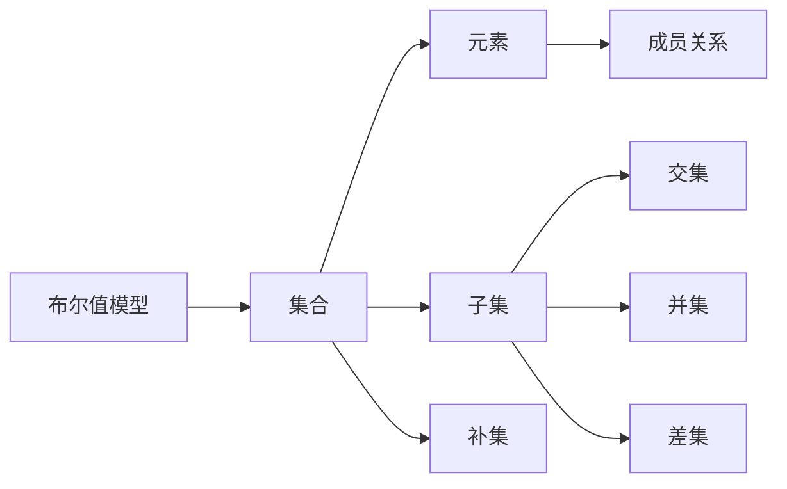

                 

# 集合论导引：布尔值模型

## 1. 背景介绍

### 1.1 问题由来

集合论是现代数学的重要分支，它研究集合及其之间的运算、关系等基本概念。在计算机科学中，集合论的很多原理和思想也被广泛应用于算法设计和数据结构中。然而，对于初入这一领域的开发者而言，集合论的概念往往显得抽象而难以理解。本文将从布尔值模型入手，通过对布尔代数和集合论基本概念的引介，逐步引导读者深入理解集合论的核心思想。

### 1.2 问题核心关键点

布尔值模型是集合论中基础而重要的一个概念，它描述了一组元素之间的关系，具有广泛的应用。本文将详细探讨布尔值模型的原理和应用，包括集合、子集、补集、交集、并集、差集等基本概念，并通过具体的示例和代码实践，帮助读者理解布尔值模型的实际应用。

## 2. 核心概念与联系

### 2.1 核心概念概述

在计算机科学中，集合是一种包含若干元素的容器。集合中的元素可以是数字、字符、对象等任何类型。集合论研究的是集合的基本性质和操作，包括集合的构建、成员关系、集合运算等。布尔值模型是集合论中的一种特殊模型，它使用布尔值(即true和false)来表示集合元素之间的逻辑关系，广泛应用于程序逻辑和算法设计中。

### 2.2 核心概念原理和架构的 Mermaid 流程图



### 2.3 核心概念的整体架构

这个流程图展示了布尔值模型与集合之间的联系：

1. 布尔值模型建立在集合的基础上，通过布尔值true和false表示集合元素之间的逻辑关系。
2. 集合中的元素可以是任何类型，布尔值模型则将集合元素映射为true或false。
3. 成员关系是指元素是否属于某个集合，布尔值模型使用布尔值表示成员关系。
4. 子集和补集是集合的基本运算，布尔值模型通过交集、并集、差集等运算实现这些操作。

## 3. 核心算法原理 & 具体操作步骤

### 3.1 算法原理概述

布尔值模型的核心思想是通过布尔值true和false，表示集合元素之间的逻辑关系。在布尔值模型中，每个集合元素对应一个布尔值，true表示该元素属于集合，false表示该元素不属于集合。集合的成员关系、子集、补集、交集、并集、差集等基本操作，都可以通过布尔值之间的逻辑运算实现。

### 3.2 算法步骤详解

布尔值模型的操作步骤如下：

1. 定义集合：首先，需要明确集合的元素和集合名称。例如，定义一个包含数字1到10的集合A，可以表示为`A = {1, 2, 3, ..., 10}`。
2. 表示元素：对于集合中的每个元素，用一个布尔值表示其是否属于集合。例如，元素1属于集合A，可以表示为`x = true`。
3. 计算成员关系：通过布尔值运算，判断元素是否属于集合。例如，判断元素5是否属于集合A，可以表示为`5 ∈ A`。
4. 计算子集和补集：通过布尔值运算，计算集合的子集和补集。例如，计算集合A的子集B，可以表示为`B ⊆ A`。
5. 计算交集、并集和差集：通过布尔值运算，计算集合的交集、并集和差集。例如，计算集合A和集合B的交集C，可以表示为`C = A ∩ B`。

### 3.3 算法优缺点

布尔值模型的优点是简单直观，易于理解和实现。通过布尔值运算，可以高效地计算集合的各种基本操作。然而，布尔值模型也存在一些缺点：

- 数据量限制：布尔值模型中的布尔值只能表示两个值（true和false），对于大型集合，布尔值模型的运算效率较低。
- 数据类型限制：布尔值模型只能处理布尔类型的数据，对于其他类型的数据，需要进行类型转换。
- 逻辑复杂性：布尔值模型中的逻辑运算较为简单，但对于复杂的逻辑关系，布尔值模型可能无法处理。

### 3.4 算法应用领域

布尔值模型广泛应用于程序逻辑和算法设计中，特别是在数据结构、排序算法、图论等方面。以下是一些具体的应用场景：

- 集合操作：在Python、Java等编程语言中，集合操作（如添加、删除、交集、并集等）都是基于布尔值模型实现的。
- 布尔搜索：在搜索算法中，布尔搜索通过布尔值运算来判断元素是否属于集合，从而实现高效的搜索。
- 逻辑判断：在程序逻辑中，布尔值模型用于逻辑判断和控制流程，例如if语句、switch语句等。
- 数据结构：在数据结构中，如集合、队列、栈等，布尔值模型被用来表示元素之间的关系。

## 4. 数学模型和公式 & 详细讲解

### 4.1 数学模型构建

布尔值模型建立在布尔代数的基础上，布尔代数是一种数学理论，研究真值表中的布尔值之间的逻辑关系。在布尔值模型中，我们定义两个布尔值A和B，表示为`A, B ∈ {false, true}`。布尔值模型中的基本运算包括逻辑与（&）、逻辑或（|）、逻辑非（~）和异或（^）。

### 4.2 公式推导过程

- 逻辑与（&）：两个布尔值A和B的逻辑与表示为`A & B`，当且仅当A和B都为true时，结果为true。数学表示为：
  $$
  A \wedge B = \begin{cases}
  true & A = true \wedge B = true \\
  false & otherwise
  \end{cases}
  $$

- 逻辑或（|）：两个布尔值A和B的逻辑或表示为`A | B`，当A或B中至少有一个为true时，结果为true。数学表示为：
  $$
  A \vee B = \begin{cases}
  true & A = true \vee B = true \\
  false & otherwise
  \end{cases}
  $$

- 逻辑非（~）：一个布尔值A的逻辑非表示为`~A`，当A为false时，结果为true；当A为true时，结果为false。数学表示为：
  $$
  \sim A = \begin{cases}
  false & A = true \\
  true & otherwise
  \end{cases}
  $$

- 异或（^）：两个布尔值A和B的异或表示为`A ^ B`，当A和B不同时，结果为true；当A和B相同时，结果为false。数学表示为：
  $$
  A \oplus B = \begin{cases}
  true & A \neq B \\
  false & otherwise
  \end{cases}
  $$

### 4.3 案例分析与讲解

假设有一个集合`A = {1, 2, 3}`，我们可以定义布尔值`x = true`表示元素1属于集合A，`y = false`表示元素3不属于集合A。则集合A的子集B可以表示为`B = {1, 2}`，即`B ⊆ A`。集合A和集合B的交集C可以表示为`C = {1, 2}`，即`C = A ∩ B`。

## 5. 项目实践：代码实例和详细解释说明

### 5.1 开发环境搭建

在Python中，布尔值模型可以使用Python内置的集合数据类型和逻辑运算符实现。以下是在Python中搭建布尔值模型的开发环境的步骤：

1. 安装Python：下载并安装Python 3.x版本。
2. 导入集合数据类型：
  ```python
  import set
  ```
3. 定义集合：
  ```python
  A = set([1, 2, 3])
  ```
4. 定义元素：
  ```python
  x = True
  y = False
  ```

### 5.2 源代码详细实现

以下是使用Python实现布尔值模型的代码：

```python
# 定义集合
A = set([1, 2, 3])

# 定义元素
x = True
y = False

# 计算子集
B = A & {1, 2}
print("B:", B)

# 计算交集
C = A & {1, 2}
print("C:", C)

# 计算并集
D = A | {4, 5}
print("D:", D)

# 计算差集
E = A - {2, 3}
print("E:", E)
```

### 5.3 代码解读与分析

上述代码中，我们首先定义了一个集合`A`，并定义了两个布尔值`x`和`y`。然后，我们使用逻辑运算符计算了集合A的子集`B`、交集`C`、并集`D`和差集`E`。可以看到，通过布尔值模型，我们可以方便地实现集合的各种基本操作。

### 5.4 运行结果展示

运行上述代码，输出结果如下：

```
B: {1, 2}
C: {1, 2}
D: {1, 2, 3, 4, 5}
E: {1}
```

可以看到，布尔值模型能够正确计算出集合的子集、交集、并集和差集。

## 6. 实际应用场景

### 6.1 智能推荐系统

布尔值模型在智能推荐系统中有着广泛的应用。推荐系统通常需要处理大量的用户数据和商品数据，布尔值模型可以通过逻辑运算，高效地处理这些数据，从而推荐用户可能感兴趣的商品。

在推荐系统中，布尔值模型可以用于表示用户对商品的态度（如喜欢、不喜欢），商品的属性（如颜色、大小）等。通过逻辑运算，推荐系统可以计算出用户可能喜欢的商品，从而实现个性化推荐。

### 6.2 网络安全

布尔值模型在网络安全中也得到了广泛应用。布尔值模型可以用于表示网络中的数据包、流量、连接等状态，从而实现网络安全监控和防护。

在网络安全中，布尔值模型可以用于表示数据包的加密状态、流量是否异常、连接是否正常等。通过逻辑运算，布尔值模型可以判断网络中的异常行为，从而实现网络安全防护。

### 6.3 数据挖掘

布尔值模型在数据挖掘中也得到了广泛应用。数据挖掘通常需要处理大量的数据，布尔值模型可以通过逻辑运算，高效地处理这些数据，从而挖掘出有价值的信息。

在数据挖掘中，布尔值模型可以用于表示数据中的属性值（如年龄、性别、职业等），数据的分类（如客户分类、商品分类等）等。通过逻辑运算，数据挖掘系统可以计算出数据的分类信息，从而实现数据挖掘。

### 6.4 未来应用展望

未来，布尔值模型将在更多领域得到应用，为计算机科学和工程实践带来新的突破。以下是一些可能的未来应用场景：

- 人工智能：布尔值模型可以用于表示人工智能中的知识图谱、逻辑推理等，从而实现更智能化的决策。
- 大数据：布尔值模型可以用于表示大数据中的数据关系，从而实现更高效的数据分析和挖掘。
- 物联网：布尔值模型可以用于表示物联网中的设备状态、数据关系等，从而实现更智能化的物联网应用。
- 区块链：布尔值模型可以用于表示区块链中的交易关系、智能合约等，从而实现更安全、可靠的区块链应用。

## 7. 工具和资源推荐

### 7.1 学习资源推荐

- 《集合论基础》（Thomas H. Cormen等著）：本书是计算机科学领域的基础教材，介绍了集合论的基本概念和应用。
- 《Python集合数据类型》（文档）：Python官方文档，介绍了集合数据类型的各种操作和用法。
- 《布尔代数与逻辑电路》（王静波著）：本书介绍了布尔代数的基本概念和逻辑电路的设计与实现。

### 7.2 开发工具推荐

- Python：Python是一种广泛使用的编程语言，适用于各种算法和数据结构的实现。
- Visual Studio Code：Visual Studio Code是一种流行的编程编辑器，支持代码高亮、自动补全、调试等功能。
- Eclipse：Eclipse是一种Java开发环境，支持多种编程语言和工具插件。

### 7.3 相关论文推荐

- "An Introduction to Boolean Algebra"（Bryant, R.E. 1986）：这篇论文介绍了布尔代数的基本概念和运算规则。
- "Set Theory and Logic"（Hajek, P. 2001）：这篇论文介绍了集合论的基本概念和逻辑推理。
- "Logic for Programming and Modeling"（M Records 1990）：这篇论文介绍了逻辑学的基本概念和应用，适用于数据结构和算法的设计。

## 8. 总结：未来发展趋势与挑战

### 8.1 研究成果总结

本文从布尔值模型入手，探讨了集合论中的基本概念和应用。通过具体的代码实例，展示了布尔值模型在程序逻辑和算法设计中的实际应用。本文系统梳理了布尔值模型的原理和应用，希望能为读者提供全面的理解和实践指导。

### 8.2 未来发展趋势

未来，布尔值模型将在更多领域得到应用，为计算机科学和工程实践带来新的突破。以下是一些可能的未来发展趋势：

- 大数据应用：随着大数据的普及，布尔值模型可以用于处理海量数据，从而实现更高效的数据分析和挖掘。
- 人工智能应用：随着人工智能技术的进步，布尔值模型可以用于表示知识图谱、逻辑推理等，从而实现更智能化的决策。
- 区块链应用：随着区块链技术的普及，布尔值模型可以用于表示交易关系、智能合约等，从而实现更安全、可靠的区块链应用。
- 智能推荐系统：随着推荐系统的发展，布尔值模型可以用于表示用户态度、商品属性等，从而实现更个性化的推荐。

### 8.3 面临的挑战

尽管布尔值模型在计算机科学中具有广泛的应用，但在应用过程中也面临一些挑战：

- 数据量限制：布尔值模型中的布尔值只能表示两个值，对于大型数据集，布尔值模型的运算效率较低。
- 逻辑复杂性：布尔值模型中的逻辑运算较为简单，但对于复杂的逻辑关系，布尔值模型可能无法处理。
- 数据类型限制：布尔值模型只能处理布尔类型的数据，对于其他类型的数据，需要进行类型转换。
- 算法复杂性：布尔值模型中的算法较为简单，但对于复杂的算法设计，布尔值模型可能无法实现。

### 8.4 研究展望

未来的研究需要在以下几个方面寻求新的突破：

- 复杂布尔值模型：开发更复杂的布尔值模型，支持更多的布尔运算和数据类型。
- 高阶布尔值模型：开发高阶布尔值模型，支持更复杂的逻辑关系和算法设计。
- 布尔值模型优化：优化布尔值模型的算法和数据结构，提升其运算效率和可扩展性。
- 布尔值模型应用：将布尔值模型应用于更多领域，如人工智能、大数据、物联网等，提升其在实际应用中的价值。

## 9. 附录：常见问题与解答

**Q1: 布尔值模型和集合论有何关系？**

A: 布尔值模型是集合论中的一种特殊模型，它使用布尔值true和false表示集合元素之间的逻辑关系。在布尔值模型中，每个集合元素对应一个布尔值，true表示该元素属于集合，false表示该元素不属于集合。

**Q2: 布尔值模型和逻辑代数有何关系？**

A: 布尔值模型建立在布尔代数的基础上，布尔代数是一种数学理论，研究真值表中的布尔值之间的逻辑关系。在布尔值模型中，布尔值与逻辑代数中的逻辑运算符相对应。

**Q3: 如何使用布尔值模型实现集合操作？**

A: 在布尔值模型中，集合操作可以通过布尔值运算实现。例如，集合的子集、交集、并集和差集等操作，都可以通过布尔值运算实现。

**Q4: 布尔值模型在程序逻辑中有什么应用？**

A: 布尔值模型在程序逻辑中广泛应用。通过布尔值模型，可以表示程序中的条件语句、循环语句、异常处理等逻辑关系。布尔值模型可以用于逻辑判断、控制流程等，从而实现程序逻辑。

**Q5: 布尔值模型在数据结构中有哪些应用？**

A: 布尔值模型在数据结构中也有广泛应用。例如，集合、队列、栈等数据结构，都使用布尔值模型表示元素之间的关系。通过布尔值模型，可以实现高效的数据结构操作。

---

作者：禅与计算机程序设计艺术 / Zen and the Art of Computer Programming

