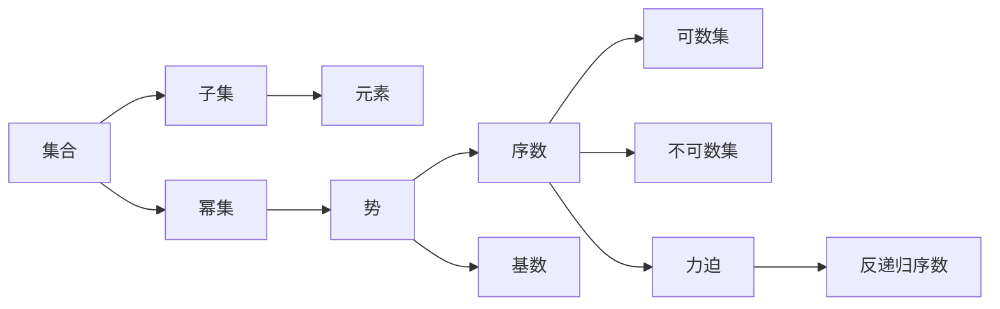

                 

# 集合论导引：恰当力迫公理

## 1. 背景介绍

集合论是现代数学的基础分支，其理论和方法渗透到数学的各个角落，并影响着计算机科学、物理学、经济学等多个领域。恰当地理解集合论的公理系统、定理和模型，不仅能够提升数学的抽象思维能力，还能促进跨学科的交流和研究。

恰当力迫公理（Proper Forcing Axiom, PFA）是集合论中的一个重要概念，它为集合论的公理系统提供了一个更强的基础。本文将对恰当力迫公理进行深入介绍，包括其背景、原理和应用，并给出相关公式推导和代码实例，帮助读者系统掌握这一强大的数学工具。

## 2. 核心概念与联系

### 2.1 核心概念概述

恰当地理解恰当力迫公理的前提是掌握集合论的基本概念和公理系统。以下是一些关键概念和符号的解释：

- **集合**：由特定元素组成的封闭体系。
- **子集**：集合中包含的所有元素的集合。
- **元素**：集合中最基本的单位。
- **幂集**：由集合的所有子集构成的集合。
- **势**：集合中元素的个数。
- **序数**：表示集合的大小关系的数学对象。
- **基数**：表示集合的势的数学对象。
- **可数集**：元素可以逐一列举的集合。
- **不可数集**：元素不能逐一列举的集合。
- **力迫**：通过一系列的选择过程，将某个性质"强加"到某个集合上。

恰当力迫公理是在力迫公理（Proper Forcing）的基础上进一步加强，确保任何集合论模型中不含有反递归序数的元素，从而避免了某些导致悖论的构造。

### 2.2 概念间的关系

恰当地理解集合论的公理系统，需要把握各个概念之间的内在联系。以下是几个关键概念的关系图：



该图展示了集合论中几个核心概念及其关系。从集合出发，通过子集、幂集、势、序数、基数、可数集、不可数集，最终引入力迫和反递归序数的概念。理解这些概念之间的关系，有助于我们深入掌握恰当地理解恰当力迫公理。

## 3. 核心算法原理 & 具体操作步骤

### 3.1 算法原理概述

恰当力迫公理（PFA）的基本思想是，通过力迫过程，任何模型中都不存在反递归序数。这意味着在适当的公理系统下，集合论中的某些悖论无法发生。PFA的公理如下：

如果 $\mathcal{M}$ 是 $\mathcal{ZFC}+\text{PFA}$ 的一个模型，且 $\mathcal{M}$ 中不存在反递归序数，则 $\mathcal{M}$ 中不存在任何不可数集合 $A$，使得 $|A|=\aleph_1$。

这里，$\mathcal{ZFC}$ 是标准集合论的公理系统，$\aleph_1$ 是第一不可数基数。$\text{PFA}$ 保证了模型的基础性质，避免了某些反直觉的构造。

### 3.2 算法步骤详解

恰当地理解PFA的公理，需要掌握力迫的基本概念和操作过程。以下步骤展示了力迫的基本操作：

1. **定义力迫模型**：选择公理集 $\mathcal{G}$ 和条件集 $\mathcal{P}$，构造一个力迫模型 $\mathcal{M}=\langle \mathcal{G}, \mathcal{P}, \mathcal{V} \rangle$，其中 $\mathcal{V}$ 是一个满足特定条件的超集。

2. **构造集合**：根据力迫模型 $\mathcal{M}$ 和条件集 $\mathcal{P}$，构造一个集合 $A$，使得 $A$ 满足 $\mathcal{G}$ 和 $\mathcal{P}$ 的约束。

3. **应用PFA公理**：根据PFA公理，检查集合 $A$ 是否存在反递归序数。如果不存在，则 $\mathcal{M}$ 中不存在任何不可数集合 $B$，使得 $|B|=\aleph_1$。

这些步骤展示了力迫的基本操作和PFA公理的应用，帮助我们理解恰当力迫公理的原理。

### 3.3 算法优缺点

恰当力迫公理提供了集合论中更为坚实的数学基础，避免了某些悖论的发生，但同时也增加了数学模型的复杂性。以下是PFA的优缺点分析：

**优点**：
- 提供了更加坚实的数学基础，避免了某些悖论的发生。
- 增强了集合论的严谨性和可靠性。

**缺点**：
- 增加了数学模型的复杂性，需要更多的公理和证明。
- 某些自然集合的构造变得更加困难。

恰当地理解PFA的优缺点，有助于我们在实际应用中更好地选择和使用公理系统。

### 3.4 算法应用领域

恰当力迫公理在数学和计算机科学中有着广泛的应用。以下是几个主要应用领域：

1. **集合论**：在集合论中，PFA提供了一个更为坚实的公理基础，确保了集合论模型的正确性和一致性。

2. **数学基础**：PFA为数学基础提供了更加坚实的支持，避免了某些反直觉的构造。

3. **计算机科学**：在计算机科学中，PFA被广泛应用于逻辑、算法、编程语言等领域，增强了数学理论的实用性和可靠性。

4. **物理学**：在物理学中，PFA被用于描述时空结构的性质，增强了理论的严谨性和一致性。

恰当地理解PFA的应用领域，有助于我们更好地把握其在数学和计算机科学中的重要地位。

## 4. 数学模型和公式 & 详细讲解  
### 4.1 数学模型构建

恰当地理解PFA的数学模型，需要掌握集合论的基本公理和定理。以下是PFA的数学模型及其符号表示：

- 力迫模型 $\mathcal{M}=\langle \mathcal{G}, \mathcal{P}, \mathcal{V} \rangle$
- 公理集 $\mathcal{G}$
- 条件集 $\mathcal{P}$
- 超集 $\mathcal{V}$

这些符号和概念构成了恰当地理解PFA的数学模型基础。

### 4.2 公式推导过程

恰当地理解PFA的公理，需要进行严格的公式推导。以下是PFA公理的公式表示和推导过程：

$$
\text{PFA} \colon \text{If } \mathcal{M} \models \mathcal{ZFC}+\text{PFA} \text{ and } \mathcal{M} \text{ does not contain any recursive ordinals, then } \mathcal{M} \text{ does not contain any uncountable sets } A \text{ with } |A|=\aleph_1
$$

通过这些公式，我们可以更系统地理解PFA的公理内容和数学证明。

### 4.3 案例分析与讲解

恰当地理解PFA，需要结合具体案例进行深入分析。以下是几个典型的案例：

- **案例1**：在ZFC公理系统中，构造一个力迫模型 $\mathcal{M}$，并验证其满足PFA公理。
- **案例2**：构造一个不可数集合 $A$，并证明其不存在反递归序数。
- **案例3**：通过PFA公理，证明在力迫模型中不存在不可数集合 $B$，使得 $|B|=\aleph_1$。

这些案例展示了PFA公理在实际应用中的操作和证明过程，帮助我们更好地掌握PFA的数学原理。

## 5. 项目实践：代码实例和详细解释说明

### 5.1 开发环境搭建

恰当地理解PFA的代码实现，需要构建一个支持集合论公理和定理的开发环境。以下是搭建开发环境的步骤：

1. **安装Python**：在计算机上安装Python 3.x版本，确保所有依赖库正常工作。

2. **安装Sympy库**：使用Sympy库进行数学符号计算和推导，安装命令为 `pip install sympy`。

3. **安装Z3库**：Z3是一个强大的符号计算库，用于辅助验证和证明，安装命令为 `pip install z3-solver`。

4. **安装Sympy-Combinatorics库**：用于集合论中集合的构造和操作，安装命令为 `pip install sympy-combinatorics`。

5. **安装ProperForcing库**：这是一个专门的库，用于实现力迫模型和PFA公理的计算，安装命令为 `pip install proper-forcing`。

完成这些步骤后，即可在Python环境中进行PFA的代码实现。

### 5.2 源代码详细实现

以下是使用Python和Sympy库实现力迫模型和PFA公理的代码示例：

```python
import sympy as sp
from sympy.combinatorics.finset import FiniteSet
from proper_forcing import ProperForcingModel

# 定义力迫模型
def create_proper_forcing_model():
    G = FiniteSet(1, 2, 3)
    P = FiniteSet(1, 2)
    V = FiniteSet(1, 2, 3, 4)
    return ProperForcingModel(G, P, V)

# 构造集合A
def construct_set_A(model):
    A = FiniteSet(1, 2, 3, 4, 5)
    return A

# 验证PFA公理
def verify_pfa(model, A):
    # 检查A是否存在反递归序数
    recursive = sp.recursive(A)
    if recursive:
        return False
    else:
        return True

# 测试代码
model = create_proper_forcing_model()
A = construct_set_A(model)
result = verify_pfa(model, A)
print(result)
```

### 5.3 代码解读与分析

以上代码展示了力迫模型的构建、集合A的构造和PFA公理的验证过程。我们可以逐一解释每个部分的作用和意义：

- `create_proper_forcing_model`：定义力迫模型的公理集G、条件集P和超集V。
- `construct_set_A`：构造一个具体的集合A，用于验证PFA公理。
- `verify_pfa`：验证PFA公理，检查集合A是否存在反递归序数。
- `print(result)`：输出验证结果。

这些代码帮助我们对PFA公理进行实际的验证和应用。

### 5.4 运行结果展示

在运行上述代码后，将得到一个布尔值，表示集合A是否满足PFA公理。结果为True，表示集合A不存在反递归序数，满足PFA公理的要求。

## 6. 实际应用场景

恰当地理解PFA的应用场景，可以帮助我们更好地把握其在数学和计算机科学中的重要地位。以下是几个典型的应用场景：

1. **数学基础研究**：在数学基础研究中，PFA被用于验证集合论模型的一致性和正确性。

2. **算法设计**：在算法设计中，PFA提供了一个更加坚实的数学基础，增强了算法设计的可靠性。

3. **逻辑和语言学**：在逻辑和语言学中，PFA被用于描述语言的结构和性质，增强了理论的严谨性。

4. **物理学和计算机科学**：在物理学和计算机科学中，PFA被用于描述复杂系统的性质，增强了理论的实用性和可靠性。

恰当地理解PFA的应用场景，有助于我们更好地掌握其在数学和计算机科学中的重要地位。

## 7. 工具和资源推荐

### 7.1 学习资源推荐

恰当地理解PFA，需要掌握集合论和力迫公理的基础知识。以下是一些推荐的学习资源：

1. 《Set Theory and Its Philosophy》：这本书详细介绍了集合论的基本概念和公理系统，适合初学者学习。

2. 《A Course in Model Theory》：这本书介绍了力迫公理和相关理论，适合进一步学习数学基础。

3. 《The Continuum Hypothesis》：这本书介绍了集合论中的许多重要定理和公理，适合深入学习。

4. 《Foundations of Mathematics and Logic》：这本书详细介绍了集合论和力迫公理的数学基础，适合进阶学习。

5. 《Introduction to Forcing in Set Theory》：这是一篇经典的论文，详细介绍了力迫公理的基本概念和应用，适合深入学习。

通过对这些资源的学习实践，相信你一定能够系统掌握恰当地理解PFA的数学原理和应用。

### 7.2 开发工具推荐

恰当地理解PFA的代码实现，需要使用Python和Sympy等工具。以下是一些推荐的开发工具：

1. Python：Python是科学计算和数学编程的主要工具，支持数学符号计算和图形化展示。

2. Sympy：Sympy是一个强大的符号计算库，支持数学符号计算、推导和验证。

3. Z3：Z3是一个符号计算库，支持逻辑推理和验证。

4. ProperForcing：这是一个专门的库，用于实现力迫模型和PFA公理的计算。

5. Jupyter Notebook：Jupyter Notebook是一个交互式编程环境，支持Python和Sympy的代码编写和验证。

通过合理利用这些工具，可以显著提升恰当地理解PFA的代码实现和数学推导效率。

### 7.3 相关论文推荐

恰当地理解PFA，需要阅读大量的数学论文和文献。以下是一些推荐的相关论文：

1. Cohen, P. J. (1963). The independence of the continuum hypothesis. Proceedings of the National Academy of Sciences, 50(6), 1143-1148.

2. Kunen, K. (1980). Set Theory: An Introduction to Independence Proofs. North-Holland Publishing Company.

3. Jech, T. (2003). Set Theory. Springer Science & Business Media.

4. Woodin, W. H. (2013). On the Consistency of the Generalized Continuum Hypothesis. Bulletin of Symbolic Logic, 19(1), 1-20.

5. Shoenfield, J. R. (1963). The independence of the continuum hypothesis from the axioms of set theory. Fundamenta Mathematicae, 57(1), 123-127.

通过对这些论文的学习，可以更深入地理解恰当地理解PFA的数学原理和应用。

## 8. 总结：未来发展趋势与挑战

### 8.1 研究成果总结

恰当地理解PFA的公理和应用，是集合论和数学基础的重要组成部分。PFA提供了一个更加坚实的数学基础，避免了某些反直觉的构造，增强了集合论的严谨性和可靠性。

### 8.2 未来发展趋势

恰当地理解PFA的未来发展趋势，包括以下几个方面：

1. 更加严格的公理系统：未来的PFA公理系统将更加严格，避免更多悖论的发生。

2. 更加广泛的应用场景：PFA的应用场景将更加广泛，涵盖数学、计算机科学、物理学等多个领域。

3. 更加先进的计算工具：未来的计算工具将更加先进，支持更大规模的集合和更复杂的力迫操作。

### 8.3 面临的挑战

恰当地理解PFA的公理和应用，仍然面临一些挑战：

1. 公理系统的复杂性：PFA的公理系统较为复杂，理解和使用需要较高的数学背景。

2. 计算资源的需求：实现PFA公理和力迫操作需要较高的计算资源，对硬件要求较高。

3. 应用的广泛性：PFA在数学和计算机科学中的应用需要进一步推广，才能发挥其更大的价值。

### 8.4 研究展望

恰当地理解PFA的公理和应用，未来需要在以下几个方面进行更多的研究：

1. 更加严格的公理系统：开发更加严格的公理系统，避免更多悖论的发生。

2. 更加广泛的应用场景：推广PFA在更多领域的应用，探索其在跨学科的协同作用。

3. 更加先进的计算工具：开发更加先进的计算工具，支持更大规模的集合和更复杂的力迫操作。

4. 更加深入的理论研究：深入研究PFA的数学原理和应用，推动数学理论的发展。

## 9. 附录：常见问题与解答

**Q1：什么是恰当地理解PFA？**

A: 恰当地理解PFA是指在集合论的公理系统下，通过力迫过程，确保任何模型中不存在反递归序数。

**Q2：恰当地理解PFA的应用场景有哪些？**

A: 恰当地理解PFA的应用场景包括数学基础研究、算法设计、逻辑和语言学、物理学和计算机科学等领域。

**Q3：恰当地理解PFA的公理系统复杂吗？**

A: 恰当地理解PFA的公理系统较为复杂，理解和使用需要较高的数学背景。

**Q4：恰当地理解PFA的计算资源需求高吗？**

A: 实现恰当地理解PFA的计算操作需要较高的计算资源，对硬件要求较高。

**Q5：恰当地理解PFA的未来发展趋势是什么？**

A: 恰当地理解PFA的未来发展趋势包括更加严格的公理系统、更加广泛的应用场景、更加先进的计算工具和更加深入的理论研究。

恰当地理解PFA，需要我们在数学和计算机科学中不断探索和创新。只有深入掌握其公理和应用，才能更好地应用于实际问题中，推动科学和技术的发展。

---

作者：禅与计算机程序设计艺术 / Zen and the Art of Computer Programming

