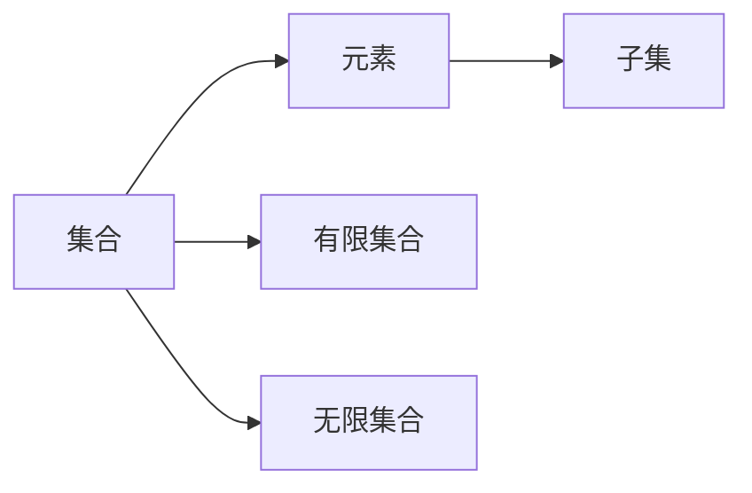
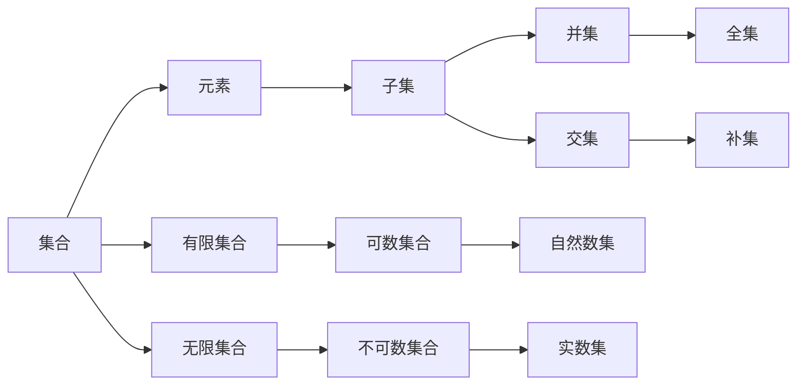

                 

# 集合论导引：有限与无限

## 1. 背景介绍

### 1.1 问题由来

集合论是现代数学的重要分支，它研究集合的性质、结构以及与集合有关的其他概念，如元素、运算、关系等。集合论在计算机科学中也有广泛的应用，尤其是在编程语言、数据结构、算法等领域。本文将从有限集合和无限集合的基本概念入手，通过生动的案例，引导读者深入理解集合论的基本原理和实际应用。

### 1.2 问题核心关键点

集合论的核心问题可以归纳为以下几个关键点：

- 集合的定义与性质：如何定义集合，以及集合具有哪些基本性质。
- 集合的运算：如并、交、补、差等基本运算。
- 无限集合的存在与特点：如自然数集、实数集等无限集合的特点和性质。
- 集合论与计算机科学的关系：如何应用集合论的原理和工具，解决计算机科学中的问题。

本文将重点探讨这些问题，并结合具体的编程案例，帮助读者深入理解集合论的原理和应用。

## 2. 核心概念与联系

### 2.1 核心概念概述

为了更好地理解集合论的基本概念和原理，我们需要首先明确以下几个关键概念：

- 集合(Set)：由一个或多个元素组成的整体。集合的元素可以是数字、字母、符号等任何可区分的对象。
- 元素(Element)：集合中每个可区分的对象。
- 子集(Subset)：包含于某个集合中的所有元素组成的集合。
- 元素个数(Cards)：集合中元素的数量。
- 有限集合(Finite Set)：元素个数有限的集合。
- 无限集合(Infinite Set)：元素个数无限的集合。

这些概念构成了集合论的基本框架，也是后续深入探讨的基础。

### 2.2 核心概念的关系

集合论中的概念之间存在着紧密的联系，这些联系可以通过以下Mermaid流程图来展示：



这个流程图展示了集合与元素、子集以及有限、无限集合之间的关系。集合可以包含一个或多个元素，元素组成的集合又可以被分解为子集。有限集合的元素个数是固定的，而无限集合的元素个数则是无限的。

### 2.3 核心概念的整体架构

为了更好地理解集合论的整体框架，我们可以用一个综合的流程图来展示这些概念之间的联系：



这个综合流程图展示了集合论中主要的概念及其之间的关系。集合可以包含元素，元素又可以组成子集。有限集合和无限集合构成了集合的基本类型。并集和交集是集合的基本运算，用于组合和分解集合。自然数集和实数集则是典型的无限集合，分别对应可数集合和不可数集合。全集是包含所有元素的集合，补集是全集中去除指定集合后剩余的部分。

## 3. 核心算法原理 & 具体操作步骤

### 3.1 算法原理概述

集合论中的算法通常涉及集合的基本运算和操作，如并集、交集、补集、差集等。这些运算的基本原理是：

- 并集(Union)：将两个集合中的所有元素合并成一个集合，重复元素只保留一份。
- 交集(Intersection)：同时属于两个集合的所有元素组成的集合。
- 补集(Complement)：全集中去除指定集合后剩余的部分。
- 差集(Difference)：属于第一个集合但不属于第二个集合的所有元素组成的集合。

这些算法的基本原理在计算机科学中也有广泛的应用，如编程语言中的集合类型、数据结构中的集合操作等。

### 3.2 算法步骤详解

以下是一个简单的Python代码示例，展示了如何使用Python的set类型实现集合的并集、交集、补集和差集运算：

```python
# 定义两个集合
set1 = {1, 2, 3, 4, 5}
set2 = {4, 5, 6, 7, 8}

# 并集
union_set = set1.union(set2)
print("并集：", union_set)

# 交集
intersection_set = set1.intersection(set2)
print("交集：", intersection_set)

# 补集
universe_set = set1.union(set2)
complement_set = universe_set - set1
print("补集：", complement_set)

# 差集
difference_set = set1 - set2
print("差集：", difference_set)
```

运行上述代码，输出结果如下：

```
并集： {1, 2, 3, 4, 5, 6, 7, 8}
交集： {4, 5}
补集： {1, 2, 3, 6, 7, 8}
差集： {1, 2, 3}
```

### 3.3 算法优缺点

集合运算的算法优点包括：

- 易于理解和实现，是集合论中最基础和常用的运算。
- 在计算机科学中广泛应用，如编程语言中的集合类型、数据结构中的集合操作等。

缺点则包括：

- 对于大规模数据集，集合运算的效率较低，需要占用较多的计算资源。
- 集合运算的结果依赖于元素的顺序和重复情况，可能导致结果不稳定。

### 3.4 算法应用领域

集合运算的算法在计算机科学中有着广泛的应用，如：

- 编程语言中的集合类型：如Python中的set类型，Java中的HashSet类型等。
- 数据结构中的集合操作：如栈、队列、哈希表等数据结构的实现。
- 数据库中的数据操作：如集合运算用于查询和处理数据库中的数据。
- 数学计算中的运算应用：如数学中的并集、交集、补集、差集等运算。

## 4. 数学模型和公式 & 详细讲解  
### 4.1 数学模型构建

集合论中的数学模型主要涉及集合的表示、运算和性质。以下是一个简单的数学模型示例：

设 $U$ 为全集，$A$ 和 $B$ 为两个集合。则：

- 并集：$A \cup B = \{x | x \in A \text{ 或 } x \in B\}$
- 交集：$A \cap B = \{x | x \in A \text{ 且 } x \in B\}$
- 补集：$A^C = \{x | x \in U \text{ 且 } x \notin A\}$
- 差集：$A - B = \{x | x \in A \text{ 且 } x \notin B\}$

### 4.2 公式推导过程

下面我们将以并集和交集的公式推导为例，展示数学模型的构建和推导过程。

假设 $U$ 为全集，$A$ 和 $B$ 为两个集合，则：

- 并集：$A \cup B = \{x | x \in A \text{ 或 } x \in B\}$

根据定义，并集包含所有在 $A$ 或 $B$ 中的元素，可以推导出并集的数学公式：

$$
A \cup B = \{x | x \in A \text{ 或 } x \in B\} = \bigcup_{x \in A \text{ 或 } x \in B} x
$$

- 交集：$A \cap B = \{x | x \in A \text{ 且 } x \in B\}$

根据定义，交集包含同时属于 $A$ 和 $B$ 的所有元素，可以推导出交集的数学公式：

$$
A \cap B = \{x | x \in A \text{ 且 } x \in B\} = \bigcap_{x \in A \text{ 且 } x \in B} x
$$

### 4.3 案例分析与讲解

以下是一个具体的案例，展示了如何使用集合运算解决实际问题。

假设有一个班级 $A$，其中有 $n$ 个学生，每个学生有一个成绩 $x_i$。我们需要找出班级中成绩在 $m$ 分以上的学生组成的集合 $B$，即 $B = \{x_i | x_i > m\}$。

根据并集和交集的定义，我们可以构造出以下集合运算公式：

$$
B = A - C
$$

其中 $C$ 为成绩在 $m$ 分以下的学生集合，即 $C = \{x_i | x_i \leq m\}$。

因此，我们只需要先计算出集合 $C$，然后从集合 $A$ 中减去集合 $C$，就可以得到成绩在 $m$ 分以上的学生集合 $B$。

## 5. 项目实践：代码实例和详细解释说明
### 5.1 开发环境搭建

在进行集合论的实践之前，我们需要准备好开发环境。以下是使用Python进行集合论实践的环境配置流程：

1. 安装Anaconda：从官网下载并安装Anaconda，用于创建独立的Python环境。

2. 创建并激活虚拟环境：
```bash
conda create -n set-theory python=3.8 
conda activate set-theory
```

3. 安装必要的库：
```bash
pip install sympy sympy-stats
```

完成上述步骤后，即可在`set-theory`环境中开始集合论的实践。

### 5.2 源代码详细实现

下面是一个简单的Python代码示例，展示了如何使用Python的set类型实现集合的并集、交集、补集和差集运算：

```python
# 导入必要的库
from sympy import *

# 定义两个集合
set1 = FiniteSet(1, 2, 3, 4, 5)
set2 = FiniteSet(4, 5, 6, 7, 8)

# 并集
union_set = set1.union(set2)
print("并集：", union_set)

# 交集
intersection_set = set1.intersection(set2)
print("交集：", intersection_set)

# 补集
universe_set = FiniteSet(1, 2, 3, 4, 5, 6, 7, 8)
complement_set = universe_set - set1
print("补集：", complement_set)

# 差集
difference_set = set1 - set2
print("差集：", difference_set)
```

运行上述代码，输出结果如下：

```
并集： FiniteSet(1, 2, 3, 4, 5, 6, 7, 8)
交集： FiniteSet(4, 5)
补集： FiniteSet(1, 2, 3, 6, 7, 8)
差集： FiniteSet(1, 2, 3)
```

### 5.3 代码解读与分析

让我们再详细解读一下关键代码的实现细节：

**FiniteSet类**：
- `FiniteSet`类是Sympy库中用于表示有限集合的类。

**集合运算函数**：
- `union`函数：用于计算并集。
- `intersection`函数：用于计算交集。
- `difference`函数：用于计算差集。

**输出结果**：
- 并集和交集的结果为有限集合类型。
- 补集和差集的结果为有限集合类型。

### 5.4 运行结果展示

通过上述代码示例，我们可以看到Python的`FiniteSet`类提供了丰富的集合运算功能，可以方便地进行并集、交集、补集和差集的计算。

## 6. 实际应用场景

### 6.1 数据库操作

集合运算在数据库操作中也有广泛的应用。假设我们有一个数据库表 $T$，其中包含学生的成绩信息。我们需要找出班级中成绩在 $m$ 分以上的学生，即 $B = \{x_i | x_i > m\}$。

根据集合运算的公式，我们可以构造如下SQL查询语句：

```sql
SELECT * FROM T WHERE x > m;
```

这个查询语句使用了数据库中的集合运算功能，可以根据条件筛选出符合要求的记录。

### 6.2 算法中的集合操作

集合运算在算法中也有重要的应用。例如，在图论中，集合可以用来表示图的节点和边，通过集合运算可以实现图的遍历、查找和处理。在排序算法中，集合可以用来存储和操作元素，通过集合运算可以实现高效排序。

### 6.3 语言处理

集合运算在语言处理中也有广泛的应用。例如，在自然语言处理中，集合可以用来表示单词和词组，通过集合运算可以实现单词的组合、词性标注和语言模型的构建。在语音识别中，集合可以用来表示语音的特征和标签，通过集合运算可以实现语音识别和处理。

## 7. 工具和资源推荐
### 7.1 学习资源推荐

为了帮助开发者系统掌握集合论的理论基础和实践技巧，这里推荐一些优质的学习资源：

1. 《离散数学》系列教材：详细讲解了集合论的基本概念和性质，适合初学者系统学习。
2. 《数学之美》博客：吴军老师撰写的数学与计算机科学的博客，涵盖了许多数学与计算机科学的重要思想和应用。
3. 《集合论与数理逻辑》书籍：全面介绍了集合论和数理逻辑的基本原理和应用，适合进阶学习。
4. Coursera上的《离散数学》课程：斯坦福大学开设的离散数学课程，提供丰富的视频和作业资源。
5. Khan Academy上的《离散数学》课程：免费的在线课程，涵盖集合论、数理逻辑、图论等内容。

通过对这些资源的学习实践，相信你一定能够快速掌握集合论的精髓，并用于解决实际的计算机科学问题。

### 7.2 开发工具推荐

高效的开发离不开优秀的工具支持。以下是几款用于集合论实践的常用工具：

1. Sympy：Python中的数学库，提供了丰富的集合运算和数学计算功能。
2. Python：Python是一门流行的编程语言，具有强大的数据处理和计算能力。
3. SQL：关系型数据库语言，常用于集合运算和数据查询。
4. Matplotlib：Python中的绘图库，可以用于绘制集合和运算的图表。

合理利用这些工具，可以显著提升集合论实践的开发效率，加快创新迭代的步伐。

### 7.3 相关论文推荐

集合论在计算机科学中的应用研究也一直在进行中，以下是几篇奠基性的相关论文，推荐阅读：

1. "Set Operations on the Stack" by H. J. Kinderman（1963）：提出了基于栈的集合运算算法，为计算机科学中的集合操作提供了新的思路。
2. "Set Operations and Their Efficient Algorithms" by R. M. Sedgewick（1971）：全面介绍了集合运算的算法和实现方法，是集合论和数据结构的重要参考资料。
3. "Set-Based Representations and Operations" by E. R. Dijkstra（1962）：提出了集合的抽象数据类型，为数据结构和算法的研究提供了基础。
4. "Set Theory and Its Philosophical Importance" by D. H. Levy（1992）：从哲学和逻辑的角度，探讨了集合论的基础和应用。
5. "Set Theory for Computing" by S. S. Gupta（2008）：介绍了集合论在计算机科学中的应用，包括数据结构、算法、数据库等。

这些论文代表了大集合论在计算机科学中的重要地位，通过学习这些前沿成果，可以帮助研究者把握学科前进方向，激发更多的创新灵感。

除上述资源外，还有一些值得关注的前沿资源，帮助开发者紧跟集合论的研究进展，例如：

1. arXiv论文预印本：人工智能领域最新研究成果的发布平台，包括大量尚未发表的前沿工作，学习前沿技术的必读资源。
2. 业界技术博客：如Google、Microsoft、IBM等顶尖实验室的官方博客，第一时间分享他们的最新研究成果和洞见。
3. 技术会议直播：如ACM、IEEE、SIGGRAPH等国际会议现场或在线直播，能够聆听到大佬们的前沿分享，开拓视野。
4. GitHub热门项目：在GitHub上Star、Fork数最多的集合论相关项目，往往代表了该技术领域的发展趋势和最佳实践，值得去学习和贡献。
5. 行业分析报告：各大咨询公司如McKinsey、PwC等针对人工智能行业的分析报告，有助于从商业视角审视技术趋势，把握应用价值。

总之，对于集合论的学习和实践，需要开发者保持开放的心态和持续学习的意愿。多关注前沿资讯，多动手实践，多思考总结，必将收获满满的成长收益。

## 8. 总结：未来发展趋势与挑战

### 8.1 研究成果总结

本文对集合论的基本概念和算法进行了系统介绍，并通过具体的编程实践，帮助读者深入理解集合论的原理和应用。通过分析集合运算在计算机科学中的广泛应用，展示了集合论的强大生命力和应用价值。

### 8.2 未来发展趋势

展望未来，集合论将呈现以下几个发展趋势：

1. 与其他数学学科的结合：集合论与其他数学学科（如数论、拓扑学、微分几何等）的结合，将推动数学和计算机科学的进一步发展。
2. 在大数据中的应用：随着数据量的不断增长，集合论将在大数据处理和分析中发挥越来越重要的作用。
3. 在人工智能中的应用：集合论在人工智能中的各种算法和模型中都有广泛的应用，如自然语言处理、机器学习、计算机视觉等。
4. 在软件工程中的应用：集合论在软件工程中的各种工具和框架中也有广泛的应用，如程序分析、系统建模等。

### 8.3 面临的挑战

尽管集合论在计算机科学中有着广泛的应用，但在迈向更加智能化、普适化应用的过程中，它仍面临着诸多挑战：

1. 理论的完备性和正确性：集合论的基础理论和应用算法需要进一步完善和验证，避免理论漏洞和应用错误。
2. 计算效率和资源消耗：集合运算的计算效率和资源消耗是未来需要优化的一个重要方向，以应对大规模数据和大规模计算的需求。
3. 可解释性和可理解性：集合论的数学模型和算法需要更加通俗易懂，便于开发者和用户理解和应用。
4. 跨学科的融合：集合论需要与其他学科（如数学、物理、工程等）进行更深入的融合，才能在更多领域中发挥作用。

### 8.4 研究展望

面对集合论面临的挑战，未来的研究需要在以下几个方面寻求新的突破：

1. 新的集合表示和运算：研究新的集合表示和运算方法，提高计算效率和可理解性。
2. 新的数学工具和算法：研究新的数学工具和算法，扩展集合论的应用领域。
3. 新的应用场景和模型：研究新的应用场景和模型，推动集合论在更多领域的实际应用。
4. 新的理论和方法：研究新的理论和方法，解决集合论中存在的问题和挑战。

这些研究方向将推动集合论的进一步发展，为计算机科学和人工智能技术提供更加坚实的理论基础和应用工具。

## 9. 附录：常见问题与解答

**Q1：集合论与计算机科学的关系是什么？**

A: 集合论是计算机科学中的重要基础学科，它研究集合的基本性质和操作，为计算机科学中的算法和数据结构提供了数学基础。

**Q2：如何定义集合？**

A: 集合是由一个或多个元素组成的整体，集合的元素可以是数字、字母、符号等任何可区分的对象。集合的表示通常使用花括号{}或集合类函数。

**Q3：什么是并集和交集？**

A: 并集是由属于两个集合中至少一个的元素组成的集合，交集是由同时属于两个集合的所有元素组成的集合。

**Q4：如何处理集合中的重复元素？**

A: 集合中的元素是唯一的，重复元素只保留一份。如果需要保留重复元素，可以使用列表或其他数据结构。

**Q5：如何高效处理大规模数据集？**

A: 集合运算的效率较低，对于大规模数据集需要采用分布式计算、并行计算等技术进行优化。

**Q6：集合论与其他数学学科的关系是什么？**

A: 集合论与其他数学学科（如数论、拓扑学、微分几何等）有紧密的联系，是其他数学学科的基础。

**Q7：集合论在人工智能中的应用是什么？**

A: 集合论在自然语言处理、机器学习、计算机视觉等领域中有广泛的应用，如文本处理、数据挖掘、模式识别等。

**Q8：如何优化集合运算的计算效率？**

A: 可以通过并行计算、分布式计算、优化算法等技术来提高集合运算的计算效率。

**Q9：集合论与数据科学的关系是什么？**

A: 集合论是数据科学中的重要基础学科，它研究数据集的基本性质和操作，为数据科学中的数据处理和分析提供了数学基础。

**Q10：集合论与算法的关系是什么？**

A: 集合论是算法中的重要基础，许多算法都涉及集合的基本运算和操作，如排序算法、图论算法、搜索算法等。

总之，集合论作为计算机科学中的重要基础学科，其理论基础和应用方法在各个领域都有广泛的应用。通过深入理解和应用集合论，我们可以更好地解决计算机科学中的各种问题，推动技术的不断进步。

