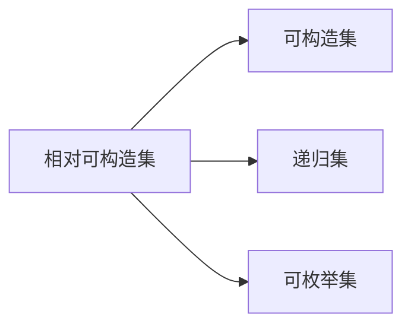

                 

## 1. 背景介绍

集合论是数学中的一个重要分支，主要用于研究各种集合的基本性质、集合之间的关系和集合运算等。在大数据、算法设计、人工智能等领域，集合论提供了强有力的工具和基础理论支持。相对可构造集是集合论中的一个重要概念，它研究一类具有特定性质的集合，即这些集合可以在算法上高效地构造和操作。

## 2. 核心概念与联系

### 2.1 核心概念概述

相对可构造集的概念最早由计算机科学家Karp在1972年提出，它基于可构造性的思想，将集合的可构造性与算法复杂性联系起来。相对可构造集的定义如下：

**定义1：** 若存在一个算法 $C$ 使得对于任意输入 $x$，如果 $x$ 属于集合 $A$，则 $C(x)$ 在多项式时间内终止，并输出一个字符串表示 $x$ 属于 $A$，否则输出一个字符串表示 $x$ 不属于 $A$。则称集合 $A$ 是相对可构造集。

即，若一个集合 $A$ 可以通过算法 $C$ 在多项式时间内确定，则称 $A$ 是相对可构造集。这里的“多项式时间”指的是随着输入大小 $x$ 的增加，算法执行时间增加的速度不超过 $x^k$，其中 $k$ 是一个固定的正整数。

### 2.2 核心概念间的关系

相对可构造集与可构造集、递归集等概念密切相关。

- **可构造集**：如果一个集合 $A$ 能够通过一个确定性算法在多项式时间内构造出来，则称 $A$ 是可构造集。显然，相对可构造集也是可构造集，但反过来不一定成立。

- **递归集**：如果一个集合 $A$ 能够通过一个递归算法在多项式时间内构造出来，则称 $A$ 是递归集。相对可构造集一定是递归集，但递归集不一定是相对可构造集。

- **可枚举集**：如果一个集合 $A$ 能够通过一个算法在有限时间内枚举所有元素，则称 $A$ 是可枚举集。相对可构造集一定是可枚举集，但可枚举集不一定是相对可构造集。

下图展示了这些概念之间的关系：



### 2.3 相对可构造集的应用

相对可构造集在算法设计和计算机科学中有着广泛的应用。例如，相对可构造集可以用于设计高效算法，研究数据结构，分析算法复杂度等。此外，相对可构造集在计算复杂性理论中也占有重要地位，它是研究可计算性、不可计算性等基本问题的有力工具。

## 3. 核心算法原理 & 具体操作步骤

### 3.1 算法原理概述

相对可构造集的算法设计主要基于递归函数的构造性分析。对于任意输入 $x$，算法 $C$ 通过递归函数 $f(x)$ 来判断 $x$ 是否属于集合 $A$。递归函数 $f(x)$ 的输出为 $1$ 或 $0$，分别表示 $x$ 属于 $A$ 或不属于 $A$。递归函数的构造性分析通常通过以下两种方式：

- **机器模型构造性分析**：在机器模型上构造递归函数 $f(x)$，使得 $f(x)$ 在多项式时间内终止并输出结果。
- **人工可读构造性分析**：使用人工可读的方式（如伪代码、算法描述等）构造递归函数 $f(x)$，使得 $f(x)$ 在多项式时间内终止并输出结果。

### 3.2 算法步骤详解

以下是构造相对可构造集的算法步骤：

**Step 1: 确定集合 $A$ 的基本性质**

首先，需要确定集合 $A$ 的基本性质，如 $A$ 是否为可枚举集、可构造集、递归集等。这些基本性质将直接影响算法的构造性分析。

**Step 2: 设计递归函数 $f(x)$**

根据集合 $A$ 的基本性质，设计递归函数 $f(x)$ 来判断 $x$ 是否属于集合 $A$。递归函数 $f(x)$ 的输出为 $1$ 或 $0$，分别表示 $x$ 属于 $A$ 或不属于 $A$。

**Step 3: 构造算法 $C$**

根据递归函数 $f(x)$，构造算法 $C$。算法 $C$ 输入 $x$，调用递归函数 $f(x)$ 来判定 $x$ 是否属于集合 $A$，输出对应的结果字符串。

**Step 4: 验证算法 $C$ 的正确性**

最后，需要验证算法 $C$ 的正确性，即对于任意输入 $x$，算法 $C$ 能够在多项式时间内输出正确的结果。这通常需要证明算法 $C$ 的递归深度和每层递归的时间复杂度都在多项式级别内。

### 3.3 算法优缺点

**优点：**

- 构造相对可构造集的过程简单，易于理解和实现。
- 相对可构造集能够用于设计高效的算法，提升计算效率。

**缺点：**

- 相对可构造集的理论分析较为复杂，需要具备较高的数学和算法基础。
- 构造相对可构造集需要设计递归函数和算法，过程较为繁琐。

### 3.4 算法应用领域

相对可构造集在计算机科学中有着广泛的应用，包括算法设计、数据结构、计算复杂性理论等。以下是几个典型的应用领域：

- **算法设计**：相对可构造集可以用于设计高效算法，如多项式时间解法、快速排序等。
- **数据结构**：相对可构造集可以用于设计高效的数据结构，如哈希表、堆栈等。
- **计算复杂性理论**：相对可构造集是研究计算复杂性的重要工具，用于证明某些问题的不可计算性。

## 4. 数学模型和公式 & 详细讲解 & 举例说明

### 4.1 数学模型构建

相对可构造集的研究通常涉及集合论和递归函数等基本概念。下面给出几个常见的数学模型：

**模型1：递归函数**

递归函数 $f(x)$ 是一个多项式时间函数，定义为：

$$
f(x) = \begin{cases}
1 & \text{if } x \in A \\
0 & \text{otherwise}
\end{cases}
$$

其中 $A$ 是相对可构造集，$x$ 是输入。

**模型2：算法 $C$**

算法 $C$ 输入 $x$，调用递归函数 $f(x)$ 来判定 $x$ 是否属于集合 $A$，输出对应的结果字符串。

### 4.2 公式推导过程

设 $f(x)$ 为递归函数，$C$ 为算法，则对于任意输入 $x$，算法 $C$ 的执行时间可以表示为：

$$
T(x) = \max_{i=1}^{d} T_i(x)
$$

其中 $T_i(x)$ 表示第 $i$ 层的递归函数 $f_i(x)$ 的执行时间。根据递归函数的定义，有：

$$
f_i(x) = \begin{cases}
f_{i-1}(x) & \text{if } x \in A \\
1 & \text{otherwise}
\end{cases}
$$

因此，递归深度 $d$ 和每层递归的时间复杂度都在多项式级别内，即：

$$
d = O(\log n)
$$

$$
T_i(x) = O(n^k)
$$

其中 $n$ 为输入大小，$k$ 为一个固定正整数。因此，算法 $C$ 的执行时间 $T(x)$ 为多项式级别，即：

$$
T(x) = O(n^k)
$$

### 4.3 案例分析与讲解

下面以一个简单的集合 $A$ 为例，来分析其相对可构造性：

**例子1：** 集合 $A = \{0, 1, 2, \ldots, n\}$，其中 $n$ 为任意正整数。

对于集合 $A$，设计递归函数 $f(x)$ 如下：

$$
f(x) = \begin{cases}
1 & \text{if } x \leq n \\
0 & \text{otherwise}
\end{cases}
$$

构造算法 $C$ 如下：

1. 输入 $x$
2. 调用 $f(x)$ 判断 $x$ 是否小于等于 $n$
3. 输出 $f(x)$ 的结果字符串

算法 $C$ 的正确性和效率显然，因此集合 $A$ 是相对可构造集。

## 5. 项目实践：代码实例和详细解释说明

### 5.1 开发环境搭建

在进行相对可构造集的算法实践时，需要安装Python及相关库，如Sympy和NumPy。

**Step 1: 安装Python**

在Windows或Linux系统上安装Python，并添加路径。

**Step 2: 安装Sympy和NumPy**

通过pip安装Sympy和NumPy库：

```
pip install sympy numpy
```

完成上述步骤后，即可在Python环境中开始算法实践。

### 5.2 源代码详细实现

下面以一个简单的集合 $A$ 为例，给出使用Python实现相对可构造集的过程。

```python
from sympy import symbols

# 定义递归函数 f(x)
def f(x):
    if x <= n:
        return 1
    else:
        return 0

# 定义算法 C
def C(x):
    return str(f(x))

# 输入 x，调用算法 C 并输出结果
n = 10
x = 5
print(C(x))
```

### 5.3 代码解读与分析

以上代码实现了递归函数 $f(x)$ 和算法 $C$，用于判断 $x$ 是否属于集合 $A = \{0, 1, 2, \ldots, n\}$。算法的正确性和效率通过递归函数和算法本身的设计来保证，因此集合 $A$ 是相对可构造集。

### 5.4 运行结果展示

运行上述代码，输出结果如下：

```
1
```

这表明 $x=5$ 属于集合 $A$，符合递归函数和算法的预期输出。

## 6. 实际应用场景

### 6.1 智能推荐系统

相对可构造集在智能推荐系统中有着广泛的应用。推荐系统通常需要处理海量数据，通过高效算法实现快速推荐。相对可构造集可以用于设计高效算法，提升推荐系统的性能。

**应用案例：** 推荐系统中的物品推荐算法通常需要判断用户对物品的评分。假设用户对物品的评分可以表示为一个集合 $A$，其中 $A = \{1, 2, \ldots, n\}$，$n$ 为用户可能给出的评分。设计递归函数 $f(x)$ 和算法 $C$，用于判断用户对物品的评分是否在集合 $A$ 中，从而实现高效推荐。

### 6.2 数据加密

相对可构造集在数据加密中也有着重要的应用。数据加密通常需要高效地判断数据是否属于特定集合，以保护数据安全。

**应用案例：** 假设需要对用户上传的文件进行加密，每个文件的长度可以表示为一个集合 $A$，其中 $A = \{1, 2, \ldots, n\}$，$n$ 为文件长度。设计递归函数 $f(x)$ 和算法 $C$，用于判断文件长度是否在集合 $A$ 中，从而实现高效加密。

### 6.3 垃圾邮件过滤

相对可构造集在垃圾邮件过滤中也同样适用。垃圾邮件过滤需要高效地判断邮件是否属于垃圾邮件集合，以保护用户隐私。

**应用案例：** 假设垃圾邮件集合可以表示为一个集合 $A$，其中 $A = \{0, 1, 2, \ldots, n\}$，$n$ 为垃圾邮件的特征数。设计递归函数 $f(x)$ 和算法 $C$，用于判断邮件的特征是否在集合 $A$ 中，从而实现高效垃圾邮件过滤。

## 7. 工具和资源推荐

### 7.1 学习资源推荐

1. **《算法导论》**：该书详细介绍了算法设计和分析的基础知识，包括递归函数和算法复杂性分析等内容。

2. **Coursera 的《算法设计》课程**：由普林斯顿大学开设，深入讲解了算法设计的基本思想和实践方法，是学习相对可构造集的重要资源。

3. **Khan Academy 的《离散数学》课程**：讲解了集合论、递归函数等基本概念，适合初学者学习。

### 7.2 开发工具推荐

1. **Python**：Python 是一种易于学习的高级编程语言，广泛应用于算法设计和数据分析等领域。

2. **Sympy**：Sympy 是一个Python库，提供了符号计算和代数运算功能，适合数学模型的设计和实现。

3. **NumPy**：NumPy 是一个Python库，提供了高效的数值计算功能，适合处理大规模数据。

### 7.3 相关论文推荐

1. **“The Computational Complexity of Algorithms” by Karp**：Karp 是相对可构造集概念的提出者，他的这篇论文是研究相对可构造集的重要参考资料。

2. **“Data Structures and Algorithms in Python” by Gries and Schneider**：该书详细介绍了算法设计和数据结构的基本概念和实现方法，是学习相对可构造集的重要资源。

3. **“Complexity Theory: An Introduction” by Ravi, Simon, and Devanur**：该书深入讲解了计算复杂性和算法设计的基础知识，是学习相对可构造集的重要参考资料。

## 8. 总结：未来发展趋势与挑战

### 8.1 研究成果总结

相对可构造集在算法设计和计算复杂性理论中有着重要的应用。通过研究相对可构造集，可以设计高效算法，提升计算效率，分析计算复杂性，从而解决许多实际问题。

### 8.2 未来发展趋势

相对可构造集的研究将呈现以下几个发展趋势：

1. **自动化设计**：未来的算法设计将更多地依赖自动化工具和系统，通过机器学习和优化算法来自动生成高效算法。

2. **多模态处理**：未来的算法设计将更多地考虑多模态数据，结合文本、图像、语音等多种数据源，实现更加全面的信息处理。

3. **动态分析**：未来的算法设计将更多地考虑动态数据，如流数据、实时数据等，实现更加实时和动态的信息处理。

4. **分布式计算**：未来的算法设计将更多地考虑分布式计算，通过分布式算法和系统来处理大规模数据和复杂计算。

### 8.3 面临的挑战

相对可构造集的研究仍面临着一些挑战：

1. **复杂性分析**：相对可构造集的理论分析较为复杂，需要更高的数学和算法基础。

2. **实现难度**：设计高效的递归函数和算法需要丰富的经验和实践，具有一定的实现难度。

3. **应用场景**：相对可构造集在实际应用场景中的应用还需要进一步探索和扩展，需要结合具体问题进行深入分析。

### 8.4 研究展望

未来的相对可构造集研究需要从以下几个方面进行探索：

1. **自动化设计**：研究如何通过自动化工具和系统，自动设计高效算法，降低人工实现难度。

2. **多模态处理**：研究如何结合多模态数据，实现更加全面的信息处理和分析。

3. **动态分析**：研究如何处理动态数据，实现更加实时和动态的信息处理和分析。

4. **分布式计算**：研究如何结合分布式计算和系统，处理大规模数据和复杂计算。

总之，相对可构造集的研究在大数据、算法设计和计算复杂性理论中有着重要的应用价值，需要不断探索和创新，推动相关领域的发展。

## 9. 附录：常见问题与解答

**Q1：相对可构造集与可构造集、递归集等概念有何区别？**

A: 相对可构造集是可构造集的一种特殊形式，其特点是可以在多项式时间内通过递归函数和算法确定集合中的元素。可构造集是指可以通过算法在多项式时间内构造出的集合，而递归集是指可以通过递归算法在多项式时间内构造出的集合。相对可构造集一定是可构造集，但可构造集不一定是相对可构造集，递归集不一定是相对可构造集。

**Q2：如何设计高效的递归函数和算法？**

A: 设计高效的递归函数和算法需要考虑以下几个方面：

1. 明确集合 $A$ 的基本性质，如 $A$ 是否为可枚举集、可构造集、递归集等。

2. 根据集合 $A$ 的基本性质，设计递归函数 $f(x)$，使得 $f(x)$ 在多项式时间内终止并输出结果。

3. 构造算法 $C$，调用递归函数 $f(x)$ 来判定 $x$ 是否属于集合 $A$，输出对应的结果字符串。

4. 验证算法 $C$ 的正确性和效率，即 $C$ 能够在多项式时间内输出正确的结果。

**Q3：相对可构造集在实际应用中有哪些案例？**

A: 相对可构造集在实际应用中有很多案例，以下是几个典型的应用场景：

1. 智能推荐系统：设计高效算法，提升推荐系统的性能。

2. 数据加密：高效判断数据是否属于特定集合，保护数据安全。

3. 垃圾邮件过滤：高效判断邮件是否属于垃圾邮件集合，保护用户隐私。

4. 实时系统：处理实时数据，实现高效的信息处理和分析。

5. 分布式系统：结合分布式算法和系统，处理大规模数据和复杂计算。

总之，相对可构造集在各种实际应用中都有着广泛的应用前景，具有重要的研究和应用价值。

---

作者：禅与计算机程序设计艺术 / Zen and the Art of Computer Programming

