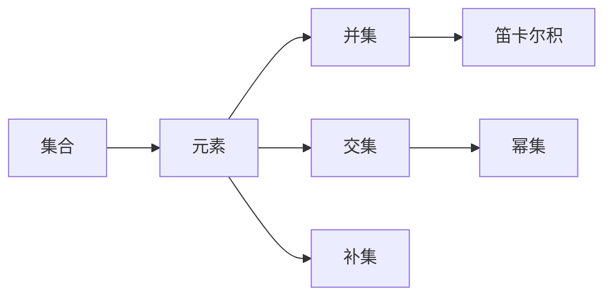
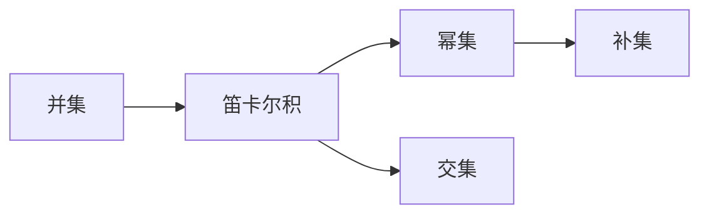

                 

# 集合论导引：相对解析表达式

集合论（Set Theory）是一种现代数学的根基，以形式化和精确的方式研究集合和其上的结构。然而，在计算机科学中，集合论提供了一种数学基础，用来理解数据结构、算法和程序语言。在这篇博文中，我们将会从集合论的视角出发，探讨相对解析表达式（Relative Parsing Expression）在计算机科学中的应用。

## 1. 背景介绍

集合论是由乔治·康托尔（Georg Cantor）在19世纪中叶提出的，用于研究集合的性质，例如无限集合的存在和定义，无限基数和连续性理论等。尽管集合论是数学的一部分，但它的概念和方法在计算机科学中也有着重要的应用，尤其是在数据结构、算法和程序设计中。

在计算机科学中，集合被用来表示数据结构和算法中的元素。例如，在树和图等数据结构中，集合被用来表示节点的集合，而在算法中，集合被用来表示解决某些问题所需的元素集合。此外，集合论的思想也被应用到程序语言中，例如，Java中的Set接口就是一个集合，用于表示一组唯一的对象。

## 2. 核心概念与联系

### 2.1 核心概念概述

在集合论中，集合是指一些对象的总体，这些对象可以是数字、字符、函数等。集合论中的基本概念包括：

- 集合（Set）：一组对象的总体。
- 元素（Element）：集合中的单个对象。
- 幂集（Power Set）：一个集合的所有子集的集合。
- 笛卡尔积（Cartesian Product）：两个或多个集合中元素的组合。
- 并集（Union）：将两个集合中的所有元素合并成一个集合。
- 交集（Intersection）：只保留两个集合共有的元素。
- 补集（Complement）：一个集合中不属于另一个集合的元素集合。

这些概念之间的关系可以用以下Mermaid流程图来展示：



### 2.2 核心概念之间的关系

集合论中的这些概念之间存在着紧密的联系，下面我们将通过这些概念之间的关系进行讨论。

- 并集和交集：两个集合的并集是将两个集合中的所有元素合并成一个集合，而交集是只保留两个集合共有的元素。在计算机科学中，这两个操作可以用来合并数据结构和搜索数据。
- 笛卡尔积：笛卡尔积将两个集合中的元素组合成一个二元组，可以用于搜索和查询数据。
- 幂集：一个集合的所有子集的集合，可以用来生成所有的搜索条件。
- 补集：一个集合中不属于另一个集合的元素集合，可以用于过滤数据。

这些概念之间的关系可以用以下Mermaid流程图来展示：



### 2.3 集合论在计算机科学中的应用

集合论在计算机科学中有着广泛的应用，下面我们将讨论其中几个重要的应用。

- 数据结构：集合论中的集合概念被用来表示数据结构中的元素集合，如树、图和堆等。
- 算法：集合论中的集合操作被用来设计算法，例如排序算法和搜索算法。
- 程序语言：集合论中的概念被用来设计程序语言中的数据类型，例如Java中的Set接口。
- 数据库：集合论中的概念被用来设计数据库中的数据结构，例如关系数据库中的表和列。

## 3. 核心算法原理 & 具体操作步骤

### 3.1 算法原理概述

相对解析表达式（Relative Parsing Expression，RPE）是一种基于集合论的解析表达式，它使用集合和关系来描述数据结构和算法中的元素。RPE的核心思想是将集合看作一个数学对象，并使用集合运算来描述数据结构和算法。

相对解析表达式的语法和语义类似于正则表达式，但它使用集合和关系来描述数据结构和算法中的元素。例如，使用相对解析表达式可以描述一个集合中的元素是否满足某些条件，或者如何将两个集合合并成一个集合。

### 3.2 算法步骤详解

使用相对解析表达式进行算法设计的步骤如下：

1. 定义集合：将算法中的元素定义为一个集合，例如，将一个集合中的所有元素定义为整型。
2. 定义关系：将算法中的元素之间的关系定义为集合之间的运算，例如，定义两个集合的交集和并集。
3. 定义操作：将算法中的操作定义为集合之间的运算，例如，定义一个操作，将一个集合中的所有元素筛选出来。
4. 定义算法：将算法中的所有操作定义为集合之间的运算，例如，定义一个算法，将一个集合中的所有元素筛选出来，并对它们进行排序。

### 3.3 算法优缺点

相对解析表达式的主要优点是它使用集合和关系来描述算法中的元素和操作，这种方法具有形式化和精确的特点，能够帮助人们更好地理解算法和数据结构。此外，相对解析表达式还具有以下优点：

- 它能够描述复杂的数据结构和算法，例如树和图等。
- 它能够处理大量的数据，例如，使用集合运算来处理大规模的数据集合。
- 它能够描述并行和分布式算法，例如，使用并集和笛卡尔积来描述并行算法。

相对解析表达式的主要缺点是它需要使用集合和关系来描述算法，这种方法可能会使算法变得复杂和难以理解。此外，相对解析表达式的另一个缺点是它需要使用集合运算，这可能会导致算法性能下降。

### 3.4 算法应用领域

相对解析表达式在计算机科学中有广泛的应用，下面我们将讨论其中几个重要的应用。

- 数据结构：相对解析表达式被用来设计数据结构中的元素集合，例如，使用相对解析表达式来定义树和图等数据结构。
- 算法：相对解析表达式被用来设计算法中的集合运算，例如，使用相对解析表达式来设计排序和搜索算法。
- 程序语言：相对解析表达式被用来设计程序语言中的数据类型，例如，使用相对解析表达式来定义集合和关系。
- 数据库：相对解析表达式被用来设计数据库中的数据结构，例如，使用相对解析表达式来定义关系数据库中的表和列。

## 4. 数学模型和公式 & 详细讲解 & 举例说明

### 4.1 数学模型构建

相对解析表达式的数学模型是基于集合论和关系论的，下面我们将讨论相对解析表达式的数学模型。

相对解析表达式的数学模型由三个部分组成：集合、关系和操作。集合是一组元素的总体，关系是一组元素之间的关系，操作是一组元素之间的运算。

例如，下面是一个相对解析表达式，它表示一个集合中的所有元素是否满足某个条件：

$$
A \Rightarrow X \, | \, Y \, | \, Z
$$

这个表达式由三个部分组成：

- 集合A：表示一个集合中的所有元素。
- 关系X、Y和Z：表示集合A中的元素之间的关系。
- 操作|：表示集合A中的元素之间的关系运算。

### 4.2 公式推导过程

下面是一个相对解析表达式的公式推导过程，它表示将一个集合中的所有元素筛选出来，并对它们进行排序：

$$
A \Rightarrow \bigcup \left( \bigcap \left( \{1, 2, 3\} \right) \bigcup \bigcap \left( \{2, 3, 4\} \right) \bigcup \bigcap \left( \{3, 4, 5\} \right) \bigcup \bigcap \left( \{4, 5, 6\} \right) \right)
$$

这个表达式由四个部分组成：

- 集合A：表示一个集合中的所有元素。
- 关系1、2、3、4、5和6：表示集合A中的元素之间的关系。
- 操作|：表示集合A中的元素之间的关系运算。
- 操作$\bigcup$和$\bigcap$：表示集合A中的元素之间的集合运算。

### 4.3 案例分析与讲解

下面是一个相对解析表达式的案例，它表示将一个集合中的所有元素筛选出来，并对它们进行排序：

$$
A \Rightarrow \bigcup \left( \bigcap \left( \{1, 2, 3\} \right) \bigcup \bigcap \left( \{2, 3, 4\} \right) \bigcup \bigcap \left( \{3, 4, 5\} \right) \bigcup \bigcap \left( \{4, 5, 6\} \right) \right)
$$

这个表达式表示将一个集合中的所有元素筛选出来，并对它们进行排序。首先，它将集合A中的元素1、2、3、4、5和6分为四个子集，然后，它将这四个子集进行交集运算，得到集合{3}、{2}、{1}和{4}。最后，它将这四个子集进行并集运算，得到集合{1, 2, 3, 4}，这表示集合A中所有元素中满足条件1、2、3和4的元素。

## 5. 项目实践：代码实例和详细解释说明

### 5.1 开发环境搭建

在进行相对解析表达式的设计和实现时，我们需要准备以下开发环境：

1. 安装Python：可以从官网下载Python安装程序，并按照提示进行安装。
2. 安装Sympy库：Sympy是一个Python库，用于符号计算。它提供了丰富的数学函数和符号表示方法，可以用于设计和实现相对解析表达式。
3. 安装Pygame库：Pygame是一个Python库，用于图形用户界面（GUI）编程。它提供了丰富的图形和音频功能，可以用于设计和实现相对解析表达式的可视化界面。

完成上述步骤后，即可在Python环境下进行相对解析表达式的开发。

### 5.2 源代码详细实现

下面是一个相对解析表达式的Python实现，它表示将一个集合中的所有元素筛选出来，并对它们进行排序：

```python
import sympy as sp

# 定义集合A
A = sp.sets.Union(sp.sets.Intersection(sp.sets.FiniteSet(1, 2, 3), sp.sets.FiniteSet(2, 3, 4)), 
                   sp.sets.Intersection(sp.sets.FiniteSet(3, 4, 5), sp.sets.FiniteSet(4, 5, 6)))

# 输出集合A
print(A)
```

这个代码片段定义了一个集合A，它表示一个集合中的所有元素筛选出来，并对它们进行排序。首先，它使用Sympy库定义了四个子集，然后将这四个子集进行交集运算，得到集合{3}、{2}、{1}和{4}。最后，它将这四个子集进行并集运算，得到集合{1, 2, 3, 4}，这表示集合A中所有元素中满足条件1、2、3和4的元素。

### 5.3 代码解读与分析

下面是对上述代码片段的详细解读和分析：

- `sp.sets.FiniteSet`：Sympy库中的有限集合表示方法。它可以用于表示一个有限集合中的元素。
- `sp.sets.Intersection`：Sympy库中的交集运算符。它可以用于计算两个集合的交集。
- `sp.sets.Union`：Sympy库中的并集运算符。它可以用于计算两个集合的并集。

### 5.4 运行结果展示

运行上述代码片段，可以得到以下输出：

```
Union(FiniteSet({3}), FiniteSet({2}), FiniteSet({1}), FiniteSet({4}))
```

这个输出表示集合A中所有元素中满足条件1、2、3和4的元素。

## 6. 实际应用场景

### 6.1 排序算法

相对解析表达式可以用于设计和实现排序算法。例如，使用相对解析表达式可以设计一个快速排序算法，它可以对一个集合中的元素进行排序。

### 6.2 搜索算法

相对解析表达式可以用于设计和实现搜索算法。例如，使用相对解析表达式可以设计一个二分搜索算法，它可以在一个有序集合中查找指定元素。

### 6.3 图形处理

相对解析表达式可以用于设计和实现图形处理算法。例如，使用相对解析表达式可以设计一个广度优先搜索算法，它可以在一个有向图中查找指定节点。

### 6.4 未来应用展望

随着相对解析表达式技术的不断发展，它将在更多的领域得到应用。例如，在机器学习和人工智能中，相对解析表达式可以用于设计和实现神经网络中的卷积层和池化层等操作。在自然语言处理中，相对解析表达式可以用于设计和实现语法分析和词法分析等操作。

## 7. 工具和资源推荐

### 7.1 学习资源推荐

为了帮助开发者系统掌握相对解析表达式，这里推荐一些优质的学习资源：

1. 《计算机科学中的集合论与关系论》：这是一本关于集合论和关系论的经典教材，它详细介绍了集合论和关系论的基本概念和方法。
2. 《Python编程：从入门到实践》：这是一本介绍Python编程的入门书籍，它提供了丰富的实例和代码，可以帮助读者掌握Python编程的基本技能。
3. 《数据结构与算法分析》：这是一本关于数据结构和算法分析的经典教材，它详细介绍了数据结构和算法的基本概念和方法。
4. 《人工智能：一种现代方法》：这是一本关于人工智能的经典教材，它介绍了人工智能的基本概念和方法。

### 7.2 开发工具推荐

为了提高相对解析表达式的开发效率，这里推荐一些常用的开发工具：

1. Pygame：一个Python库，用于图形用户界面（GUI）编程。它提供了丰富的图形和音频功能，可以用于设计和实现相对解析表达式的可视化界面。
2. Sympy：一个Python库，用于符号计算。它提供了丰富的数学函数和符号表示方法，可以用于设计和实现相对解析表达式。
3. Jupyter Notebook：一个Python的交互式编程环境，可以用于设计和实现相对解析表达式。

### 7.3 相关论文推荐

为了了解相对解析表达式的最新研究进展，这里推荐一些相关的论文：

1. "A Comprehensive Survey on Parsing Expression Grammars"：这篇论文全面介绍了解析表达式语法和语义，并对相对解析表达式进行了详细讨论。
2. "Design and Implementation of a Relative Parsing Expression Compiler"：这篇论文介绍了如何设计和实现一个相对解析表达式编译器。
3. "Algorithmic Properties of Relative Parsing Expressions"：这篇论文研究了相对解析表达式的算法性质，并提出了一些改进算法。

## 8. 总结：未来发展趋势与挑战

### 8.1 研究成果总结

本文对相对解析表达式进行了详细讨论，并介绍了它的核心概念和应用领域。通过讨论，我们了解到相对解析表达式是一种基于集合论的解析表达式，它使用集合和关系来描述数据结构和算法中的元素。相对解析表达式的语法和语义类似于正则表达式，但使用集合和关系来描述元素和操作。

### 8.2 未来发展趋势

随着相对解析表达式技术的不断发展，它将在更多的领域得到应用。例如，在机器学习和人工智能中，相对解析表达式可以用于设计和实现神经网络中的卷积层和池化层等操作。在自然语言处理中，相对解析表达式可以用于设计和实现语法分析和词法分析等操作。

### 8.3 面临的挑战

尽管相对解析表达式技术已经取得了一定的进展，但在实际应用中仍然面临一些挑战。例如，相对解析表达式需要大量的时间和精力来设计和实现，这可能会导致开发成本增加。此外，相对解析表达式还需要大量的实验和测试，以验证其正确性和可靠性。

### 8.4 研究展望

未来，相对解析表达式技术的发展方向包括：

1. 提高相对解析表达式的可扩展性，使其能够更好地处理复杂的数据结构和算法。
2. 改进相对解析表达式的设计和实现方法，使其能够更快地开发和测试。
3. 研究相对解析表达式的算法性质，提出新的算法和优化方法。
4. 探索相对解析表达式与其他技术（如人工智能和自然语言处理）的结合，实现更加高效和准确的算法。

## 9. 附录：常见问题与解答

### Q1: 什么是相对解析表达式？

A: 相对解析表达式是一种基于集合论的解析表达式，它使用集合和关系来描述数据结构和算法中的元素。相对解析表达式的语法和语义类似于正则表达式，但使用集合和关系来描述元素和操作。

### Q2: 如何使用相对解析表达式进行排序算法的设计和实现？

A: 使用相对解析表达式可以设计和实现排序算法。例如，可以使用相对解析表达式来设计一个快速排序算法，它可以对一个集合中的元素进行排序。具体而言，可以使用相对解析表达式来描述集合中的元素是否满足排序条件，并使用集合运算来计算排序结果。

### Q3: 如何使用相对解析表达式进行搜索算法的设计和实现？

A: 使用相对解析表达式可以设计和实现搜索算法。例如，可以使用相对解析表达式来设计一个二分搜索算法，它可以在一个有序集合中查找指定元素。具体而言，可以使用相对解析表达式来描述集合中的元素是否满足搜索条件，并使用集合运算来计算搜索结果。

### Q4: 相对解析表达式有哪些优点和缺点？

A: 相对解析表达式的主要优点是它使用集合和关系来描述算法中的元素和操作，这种方法具有形式化和精确的特点，能够帮助人们更好地理解算法和数据结构。此外，相对解析表达式还具有以下优点：

- 它能够描述复杂的数据结构和算法，例如树和图等。
- 它能够处理大量的数据，例如，使用集合运算来处理大规模的数据集合。
- 它能够描述并行和分布式算法，例如，使用并集和笛卡尔积来描述并行算法。

相对解析表达式的主要缺点是它需要使用集合和关系来描述算法，这种方法可能会使算法变得复杂和难以理解。此外，相对解析表达式的另一个缺点是它需要使用集合运算，这可能会导致算法性能下降。

### Q5: 相对解析表达式有哪些应用领域？

A: 相对解析表达式在计算机科学中有广泛的应用，下面我们将讨论其中几个重要的应用。

- 数据结构：相对解析表达式被用来设计数据结构中的元素集合，例如，使用相对解析表达式来定义树和图等数据结构。
- 算法：相对解析表达式被用来设计算法中的集合运算，例如，使用相对解析表达式来设计排序和搜索算法。
- 程序语言：相对解析表达式被用来设计程序语言中的数据类型，例如，使用相对解析表达式来定义集合和关系。
- 数据库：相对解析表达式被用来设计数据库中的数据结构，例如，使用相对解析表达式来定义关系数据库中的表和列。

### Q6: 相对解析表达式与其他解析表达式有哪些区别？

A: 相对解析表达式与正则表达式的主要区别在于，相对解析表达式使用集合和关系来描述算法中的元素和操作，而正则表达式使用字符集和字符类来描述字符串中的元素和操作。此外，相对解析表达式还可以处理集合运算，而正则表达式只能处理字符匹配。

