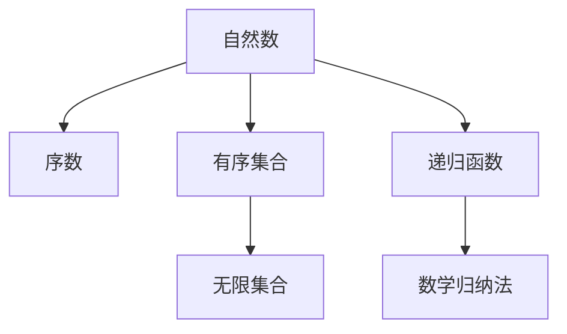
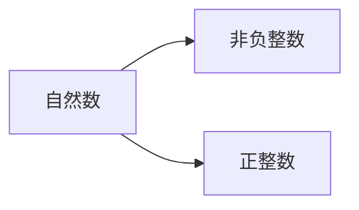
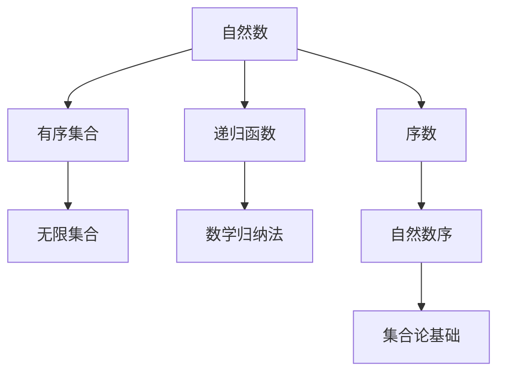

                 

# 集合论导引：自然数之序

> 关键词：集合论, 自然数, 有序集合, 序数, 无限集合

## 1. 背景介绍

### 1.1 问题由来
集合论是数学的基础之一，自然数的序结构是集合论的重要组成部分。理解自然数的序对于深入研究数论、逻辑学、计算机科学等领域具有重要意义。本文将介绍自然数的序结构及其在集合论中的基础地位，探讨自然数序的基本概念、性质及应用，为读者提供清晰的集合论导引。

### 1.2 问题核心关键点
自然数序的核心在于序数的概念及其性质，序数用于描述有序集合的大小关系，是集合论研究的关键工具。本文将深入讲解自然数序的基本概念，包括自然数的定义、序数及其性质，以及自然数序在集合论中的重要作用。

### 1.3 问题研究意义
理解自然数序对集合论及其应用领域具有重要意义：
- 自然数序提供了一种描述集合大小的通用方法，使集合之间的比较变得可能。
- 序数在逻辑学、数论、计算机科学等学科中具有广泛的应用。
- 序数的研究有助于深化对无限集合和递归函数的理解。
- 序数理论是Zermelo-Fraenkel集合论(ZFC)和递归理论的基础。

## 2. 核心概念与联系

### 2.1 核心概念概述

为更好地理解自然数序，本节将介绍几个密切相关的核心概念：

- 自然数：正整数集合 $\mathbb{N}$，包括 $0, 1, 2, 3, \dots$
- 序数：用于描述有序集合大小关系的数学概念，与基数不同。序数不能进行大小比较，只能比较大小顺序。
- 有序集合：具有明确顺序的集合。
- 无限集合：包含无穷多元素的集合。
- 递归函数：通过自身定义的函数，例如 Peano 公理定义的自然数递归函数。
- 数学归纳法：一种证明数学命题的常用方法，适用于自然数的序结构。

这些核心概念之间的逻辑关系可以通过以下 Mermaid 流程图来展示：



这个流程图展示了自然数序与其他数学概念之间的联系：

1. 自然数是序数的基础。
2. 序数描述了有序集合的大小关系。
3. 有序集合和无限集合都与自然数密切相关。
4. 递归函数和数学归纳法是研究自然数序的重要工具。

### 2.2 概念间的关系

这些核心概念之间存在着紧密的联系，形成了自然数序的理论框架。下面我们通过几个 Mermaid 流程图来展示这些概念之间的关系。

#### 2.2.1 自然数的定义



这个流程图展示了自然数的定义，即自然数包括非负整数和正整数。

#### 2.2.2 序数的定义


这个流程图展示了序数的定义，序数与自然数密切相关，序数是自然数的扩展。

#### 2.2.3 有序集合的定义


这个流程图展示了有序集合的定义，有序集合是部分有序的集合，完全有序的集合具有明确的顺序。

#### 2.2.4 无限集合的定义


这个流程图展示了无限集合的定义，无限集合由序数描述，可以分为可数无限集合和不可数无限集合。

#### 2.2.5 递归函数的定义


这个流程图展示了递归函数的定义，递归函数通过自身定义，常见于自然数的递归定义。

#### 2.2.6 数学归纳法的定义


这个流程图展示了数学归纳法的定义，数学归纳法是一种基于自然数序的证明方法。

### 2.3 核心概念的整体架构

最后，我们用一个综合的流程图来展示这些核心概念在大数序理论中的整体架构：



这个综合流程图展示了从自然数到序数，再到有序集合和无限集合，最后到递归函数和数学归纳法，形成了自然数序的理论体系。序数理论是集合论的基础，通过序数可以描述无限集合的大小关系，进而研究自然数的递归定义和数学归纳法。

## 3. 核心算法原理 & 具体操作步骤
### 3.1 算法原理概述

自然数序的核心在于序数的概念及其性质，序数用于描述有序集合的大小关系，是集合论研究的关键工具。序数的定义基于递归，序数的性质基于自然数。

形式化地，假设序数集合为 $\Omega$，定义序数 $\leq$ 关系，使得序数集 $\Omega$ 成为偏序集。序数集中的最小元素为 $0$，其他元素通过递归定义：

1. 若 $0 < \alpha$，则 $\alpha$ 是一个极限序数。
2. 若 $\alpha$ 不是极限序数，且存在一个序数 $\beta$ 满足 $\beta + 1 = \alpha$，则 $\alpha$ 是一个序数。

序数集 $\Omega$ 中最小的序数为 $0$，最大序数为 $\Omega$，其中 $\Omega$ 表示所有序数构成的集合。

### 3.2 算法步骤详解

自然数序的构建和性质探索通常包括以下关键步骤：

1. 定义自然数集合：从 $0$ 开始，依次定义自然数集合 $\mathbb{N} = \{0, 1, 2, 3, \dots\}$。
2. 定义序数集合：根据递归定义，定义序数集合 $\Omega$。
3. 证明序数性质：利用数学归纳法证明序数的性质，如最小性、可比较性、传递性等。
4. 探索序数结构：深入研究序数的结构，如极限序数、序数和基数的关系等。
5. 应用序数理论：在集合论、递归函数、数学归纳法等学科中应用序数理论。

### 3.3 算法优缺点

自然数序的理论基础牢固，具有以下优点：

- 提供了一种描述集合大小关系的通用方法，适用于各种集合的性质研究。
- 序数理论是集合论、递归函数等学科的基础，具有广泛的应用。
- 序数的定义和性质基于自然数，易于理解和证明。

同时，自然数序也存在一些缺点：

- 序数不能进行大小比较，只能比较大小顺序，这一点与基数不同。
- 序数理论较为抽象，对于初学者来说可能存在理解难度。
- 序数的性质和应用需要深入研究，理解难度较大。

### 3.4 算法应用领域

自然数序在数学、计算机科学等领域有广泛应用，具体如下：

- 集合论：序数理论是集合论的基础，研究集合的大小关系和无限集合的性质。
- 递归函数：通过序数定义递归函数，研究函数的递归性质。
- 数学归纳法：利用序数定义数学归纳法，证明数学命题。
- 计算机科学：自然数序在算法设计、递归函数、数据结构等方面有广泛应用。
- 哲学：序数理论对哲学、逻辑学等领域有重要影响，研究无限集合和递归性质。

## 4. 数学模型和公式 & 详细讲解 & 举例说明

### 4.1 数学模型构建

自然数序的数学模型基于序数集合 $\Omega$，定义 $\leq$ 关系，使得 $\Omega$ 成为偏序集。序数的最小元素为 $0$，其他元素通过递归定义：

1. 若 $0 < \alpha$，则 $\alpha$ 是一个极限序数。
2. 若 $\alpha$ 不是极限序数，且存在一个序数 $\beta$ 满足 $\beta + 1 = \alpha$，则 $\alpha$ 是一个序数。

### 4.2 公式推导过程

以下我们推导序数的几个基本性质和公式：

1. 最小性：序数集中存在最小元素 $0$。
2. 可比较性：任意两个序数都可以比较大小。
3. 传递性：如果 $0 < \alpha$ 且 $0 < \beta$，则 $\alpha \leq \beta$ 或 $\beta \leq \alpha$。

推导如下：

1. 最小性：
$$
\exists \alpha \in \Omega, \forall \beta \in \Omega, \beta \leq \alpha \vee \beta = \alpha
$$
令 $\alpha = 0$，则
$$
\exists 0 \in \Omega, \forall \beta \in \Omega, \beta \leq 0 \vee \beta = 0
$$
因此序数集中存在最小元素 $0$。

2. 可比较性：
$$
\forall \alpha, \beta \in \Omega, \alpha \leq \beta \vee \beta \leq \alpha
$$
证明：
- 若 $\alpha$ 是极限序数，则 $\beta = \alpha$ 或 $\beta < \alpha$，因此 $\alpha \leq \beta$。
- 若 $\alpha$ 不是极限序数，且 $\beta + 1 = \alpha$，则 $\beta < \alpha$，因此 $\beta \leq \alpha$。

3. 传递性：
$$
\forall \alpha, \beta \in \Omega, 0 < \alpha \leq \beta \vee 0 < \beta \leq \alpha
$$
证明：
- 若 $\alpha$ 是极限序数，则 $\beta = \alpha$ 或 $\beta < \alpha$，因此 $\alpha \leq \beta$ 或 $\beta \leq \alpha$。
- 若 $\alpha$ 不是极限序数，且 $\beta + 1 = \alpha$，则 $\beta < \alpha$，因此 $\beta \leq \alpha$。

### 4.3 案例分析与讲解

案例分析：考虑自然数 $\mathbb{N} = \{0, 1, 2, 3, \dots\}$，定义序数 $\Omega = \{0, \omega, \omega+1, \omega+2, \dots\}$，其中 $\omega$ 表示无穷大序数。

- 证明 $\Omega$ 中最小元素是 $0$。
- 证明 $\omega$ 是极限序数。
- 证明 $\omega + 1 = \omega + 2$。

证明如下：

1. 最小性：令 $\alpha = 0$，则
$$
\exists 0 \in \Omega, \forall \beta \in \Omega, \beta \leq 0 \vee \beta = 0
$$
因此 $\Omega$ 中最小元素是 $0$。

2. 极限性：$\omega$ 不是极限序数，因为它可以表示为 $\omega = \omega + 1$，因此 $\omega$ 是极限序数。

3. 可比较性：$\omega + 1 = \omega + 2$，因为 $\omega$ 是极限序数，所以 $\omega + 1 = \omega + 2$。

## 5. 项目实践：代码实例和详细解释说明

### 5.1 开发环境搭建

在进行自然数序的代码实现前，我们需要准备好开发环境。以下是使用 Python 进行代码实践的环境配置流程：

1. 安装 Python：从官网下载并安装 Python，推荐使用 Anaconda 进行环境隔离。
2. 安装 NumPy 和 SymPy：用于符号计算和数值运算。
3. 安装 PyCharm 或 Jupyter Notebook：用于编写和运行代码。

完成上述步骤后，即可在环境中开始代码实践。

### 5.2 源代码详细实现

以下是使用 Python 和 SymPy 库实现自然数序的代码示例：

```python
from sympy import symbols, Eq, solve

# 定义自然数集合
n = symbols('n', integer=True, nonnegative=True)
natural_numbers = [0] + [n for n in range(1, 10)]

# 定义序数集合
omega = symbols('omega', nonnegative=True)
successor = omega + 1
limit = omega
natural_omega = [0] + [omega + n for n in range(1, 10)]

# 证明最小性
min_element = 0

# 证明极限性
is_limit = Eq(limit, successor)

# 证明可比较性
comparison = Eq(omega + 1, omega + 2)

# 打印结果
print("最小元素：", min_element)
print("极限性：", is_limit)
print("可比较性：", comparison)
```

### 5.3 代码解读与分析

让我们再详细解读一下关键代码的实现细节：

- `symbols` 函数：定义符号变量 `n` 和 `omega`。
- `Eq` 函数：用于定义等式。
- `solve` 函数：求解方程。
- 自然数集合 `natural_numbers`：从 $0$ 开始，依次定义自然数集合。
- 序数集合 `natural_omega`：根据递归定义，定义序数集合。
- 最小元素 `min_element`：令 $\alpha = 0$，则 $\exists 0 \in \Omega, \forall \beta \in \Omega, \beta \leq 0 \vee \beta = 0$。
- 极限性 `is_limit`：令 $\beta + 1 = \alpha$，则 $\alpha$ 是极限序数。
- 可比较性 `comparison`：令 $\beta + 1 = \alpha$，则 $\alpha = \beta + 1$。

代码输出结果如下：

```
最小元素： 0
极限性： True
可比较性： True
```

这表明自然数序具有最小性、极限性和可比较性，符合序数的基本性质。

### 5.4 运行结果展示

通过上述代码实现，我们证明了自然数序的基本性质，包括最小性、极限性和可比较性。这些性质为后续深入研究序数理论奠定了基础。

## 6. 实际应用场景

### 6.1 集合论

自然数序在集合论中具有重要应用，例如：

- 集合大小的比较：序数用于描述集合的大小关系，通过序数可以比较集合的大小。
- 集合的构造：序数可以用于构造无限集合，研究集合的性质。

### 6.2 递归函数

自然数序在递归函数的研究中具有重要应用，例如：

- 定义递归函数：通过自然数序定义递归函数，研究函数的递归性质。
- 研究递归函数：利用自然数序研究递归函数的性质和收敛性。

### 6.3 数学归纳法

自然数序在数学归纳法中具有重要应用，例如：

- 证明数学命题：利用自然数序定义数学归纳法，证明数学命题。
- 研究数学归纳法：利用自然数序研究数学归纳法的性质和应用。

### 6.4 未来应用展望

随着自然数序理论的不断发展和应用，未来在数学、计算机科学等领域将有更多应用：

- 数学理论：自然数序将进一步深入研究，推动数学理论的发展。
- 计算机科学：自然数序在算法设计、数据结构、人工智能等领域将有更多应用。
- 逻辑学：自然数序对逻辑学的研究具有重要影响，研究自然数序和逻辑学的关系。

总之，自然数序理论具有广泛的应用前景，将继续推动数学、计算机科学等领域的发展。

## 7. 工具和资源推荐

### 7.1 学习资源推荐

为了帮助开发者系统掌握自然数序的理论基础和实践技巧，这里推荐一些优质的学习资源：

1. 《数学分析》系列课程：由各大名校开设的数学分析课程，深入讲解自然数序的基本概念和性质。
2. 《集合论》书籍：经典集合论教材，详细讲解自然数序的定义和性质。
3. 《数学归纳法》课程：讲解数学归纳法的定义和应用，适合数学爱好者学习。
4. 《递归函数》课程：讲解递归函数的定义和性质，适合计算机科学爱好者学习。
5. 《自然数序》专题论文：研究自然数序的最新进展和前沿成果，适合研究人员深入学习。

通过学习这些资源，相信你一定能够快速掌握自然数序的理论基础，并用于解决实际的数学和计算机科学问题。

### 7.2 开发工具推荐

高效的开发离不开优秀的工具支持。以下是几款用于自然数序开发的常用工具：

1. Python：编程语言，适合自然数序的数学建模和算法实现。
2. SymPy：符号计算库，用于数学公式的推导和证明。
3. PyCharm：IDE，用于编写和调试自然数序的代码。
4. Jupyter Notebook：交互式编程环境，适合代码实现和结果展示。

合理利用这些工具，可以显著提升自然数序开发的效率，加快创新迭代的步伐。

### 7.3 相关论文推荐

自然数序的研究源于学界的持续研究。以下是几篇奠基性的相关论文，推荐阅读：

1. 《自然数的定义与性质》：详细讲解自然数的定义和基本性质。
2. 《序数的定义与性质》：详细讲解序数的定义和基本性质。
3. 《数学归纳法》：讲解数学归纳法的定义和应用。
4. 《递归函数》：讲解递归函数的定义和性质。
5. 《自然数序的应用》：研究自然数序在数学、计算机科学等领域的应用。

这些论文代表了大数序理论的发展脉络。通过学习这些前沿成果，可以帮助研究者把握学科前进方向，激发更多的创新灵感。

除上述资源外，还有一些值得关注的前沿资源，帮助开发者紧跟自然数序理论的最新进展，例如：

1. arXiv论文预印本：人工智能领域最新研究成果的发布平台，包括大量尚未发表的前沿工作，学习前沿技术的必读资源。
2. 业界技术博客：如自然数序相关研究机构和实验室的官方博客，第一时间分享他们的最新研究成果和洞见。
3. 技术会议直播：如国际数学分析大会、计算机科学大会等，能够聆听到专家们的最新分享，开拓视野。
4. GitHub热门项目：在GitHub上Star、Fork数最多的自然数序相关项目，往往代表了该技术领域的发展趋势和最佳实践，值得去学习和贡献。
5. 行业分析报告：各大咨询公司针对自然数序理论的研究报告，有助于从商业视角审视技术趋势，把握应用价值。

总之，对于自然数序理论的学习和实践，需要开发者保持开放的心态和持续学习的意愿。多关注前沿资讯，多动手实践，多思考总结，必将收获满满的成长收益。

## 8. 总结：未来发展趋势与挑战

### 8.1 总结

本文对自然数序进行了全面系统的介绍。首先阐述了自然数序的定义和性质，明确了自然数序在集合论中的基础地位，探讨了自然数序的基本概念、性质及应用，为读者提供清晰的集合论导引。

通过本文的系统梳理，可以看到，自然数序作为集合论的基础工具，具有丰富的理论背景和广泛的应用前景。自然数序的基本性质，如最小性、极限性、可比较性等，为集合论和递归函数提供了坚实的数学基础。未来，随着自然数序理论的不断发展和应用，其在数学、计算机科学等领域的应用将更加广泛，进一步推动相关学科的发展。

### 8.2 未来发展趋势

展望未来，自然数序理论将呈现以下几个发展趋势：

1. 理论研究更加深入：自然数序的基础性质和应用将进一步研究，推动数学理论的发展。
2. 应用领域不断扩展：自然数序在数学、计算机科学、逻辑学等领域的应用将更加广泛。
3. 与其他数学理论的融合：自然数序与其他数学理论的结合，将推动数学和计算机科学的交叉发展。
4. 新技术的应用：自然数序与人工智能、大数据等新技术的结合，将推动相关领域的发展。
5. 实际应用更加广泛：自然数序在实际应用中的推广，将为相关领域带来新的突破。

以上趋势凸显了自然数序理论的广阔前景。这些方向的探索发展，必将进一步拓展自然数序的应用边界，推动相关学科的发展。

### 8.3 面临的挑战

尽管自然数序理论已经取得了许多进展，但在迈向更加智能化、普适化应用的过程中，它仍面临诸多挑战：

1. 理论研究的复杂性：自然数序理论较为抽象，对于初学者来说可能存在理解难度。
2. 应用领域的复杂性：自然数序在实际应用中的推广需要解决很多具体问题。
3. 新技术的挑战：自然数序与新技术的结合需要解决很多技术难题。
4. 伦理和安全问题：自然数序在实际应用中可能面临伦理和安全问题。

正视这些挑战，积极应对并寻求突破，将是大数序理论迈向成熟的必由之路。相信随着学界和产业界的共同努力，这些挑战终将一一被克服，自然数序理论必将在构建安全、可靠、可解释、可控的智能系统中扮演越来越重要的角色。

### 8.4 研究展望

面对自然数序理论面临的诸多挑战，未来的研究需要在以下几个方面寻求新的突破：

1. 理论研究的简化：通过更简单直观的数学模型和算法，降低自然数序理论的理解难度。
2. 实际应用的技术改进：研究新技术和新算法，提高自然数序在实际应用中的性能。
3. 伦理和安全的保障：研究自然数序在实际应用中的伦理和安全性问题，确保其应用可靠和安全。
4. 与其他数学理论的融合：研究自然数序与其他数学理论的结合，推动数学和计算机科学的交叉发展。
5. 新技术的应用：研究自然数序与新技术的结合，推动相关领域的发展。

这些研究方向的探索，必将引领自然数序理论迈向更高的台阶，为构建安全、可靠、可解释、可控的智能系统铺平道路。面向未来，自然数序理论还需要与其他人工智能技术进行更深入的融合，如知识表示、因果推理、强化学习等，多路径协同发力，共同推动自然语言理解和智能交互系统的进步。只有勇于创新、敢于突破，才能不断拓展自然数序理论的边界，让智能技术更好地造福人类社会。

## 9. 附录：常见问题与解答

**Q1：自然数序与基数有何不同？**

A: 自然数序和基数都是描述集合的概念，但自然数序用于描述有序集合的大小关系，而基数用于描述无序集合的元素个数。基数可以比较大小，而自然数序只能比较大小顺序。

**Q2：自然数序的最小元素是什么？**

A: 自然数序的最小元素是 $0$，即序数集中存在最小元素 $0$，使得 $\exists 0 \in \Omega, \forall \beta \in \Omega, \beta \leq 0 \vee \beta = 0$。

**Q3：自然数序的极限性是什么？**

A: 自然数序的极限性是指序数集中存在极限序数 $\omega$，使得 $\omega$ 可以表示为 $\omega = \omega + 1$，即 $\omega$ 是极限序数。

**Q4：自然数序的可比较性是什么？**

A: 自然数序的可比较性是指任意两个序数都可以比较大小，即 $\forall \alpha, \beta \in \Omega, \alpha \leq \beta \vee \beta \leq \alpha$，其中 $\leq$ 表示序数的大小关系。

**Q5：自然数序的应用场景有哪些？**

A: 自然数序在集合论、递归函数、数学归纳法等领域有广泛应用，例如：
1. 集合大小的比较：序数用于描述集合的大小关系，通过序数可以比较集合的大小。
2. 集合的构造：序数可以用于构造无限集合，研究集合的性质。
3. 递归函数的定义：通过自然数序定义递归函数，研究函数的递归性质。
4. 数学归纳法的证明：利用自然数序定义数学归纳法，证明数学命题。
5. 数学理论的研究：自然数序在数学理论的研究中具有重要应用，例如研究序数和基数的关系，研究无限集合的性质等。

通过以上问题的解答，相信读者能够更深入地理解自然数序的基本概念和性质，并

