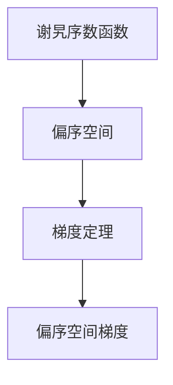

                 

# 集合论导引：谢旯序数函数偏序空间梯度定理

## 1. 背景介绍

### 1.1 问题由来

集合论是数学领域的基础学科之一，它在理论计算机科学、逻辑学、数学逻辑等领域有着广泛的应用。其中，序数函数、偏序空间、梯度定理等概念是集合论中的核心内容，对各种数学问题的分析和研究具有重要意义。

谢旯序数函数是序数函数中的一种特殊形式，它是俄罗斯数学家A. N.谢旯(A. N.谢旯)在19世纪提出的一个重要的序数函数，对数理逻辑和集合论的发展产生了深远影响。偏序空间则是一个重要的数学概念，在集合论和计算机科学中有广泛的应用。梯度定理则是微分学中的重要理论，对物理学、工程学等领域具有重要意义。

将谢旯序数函数、偏序空间和梯度定理结合起来的理论研究，可以帮助我们更好地理解这些数学概念之间的关系，提升对问题的分析和解决能力。

### 1.2 问题核心关键点

谢旯序数函数偏序空间梯度定理的核心问题在于：如何构建谢旯序数函数在偏序空间中的梯度，并利用梯度信息来分析和解决各种数学问题。具体来说，这一问题涉及以下几个方面：

- 如何定义谢旯序数函数在偏序空间中的梯度？
- 梯度在偏序空间中的性质和特点是什么？
- 如何利用梯度信息来分析和解决各种数学问题？

对这些问题的深入研究，将有助于我们在数学、计算机科学等领域更好地应用和理解谢旯序数函数、偏序空间和梯度定理等数学概念。

## 2. 核心概念与联系

### 2.1 核心概念概述

在讨论谢旯序数函数偏序空间梯度定理之前，首先需要对相关的核心概念进行概述：

- **谢旯序数函数**：是序数函数中的一种特殊形式，定义为：$$\varphi(x)=\omega^{f(x)}$$，其中 $f(x)$ 是 $x$ 的一个单调递增函数，$\omega$ 是基础序数，表示无穷集合中元素的数目。

- **偏序空间**：指一个集合中存在偏序关系（即满足自反性、反对称性、传递性），常见的偏序空间有实数集、整数集等。

- **梯度**：在微分学中，梯度是指向量场的一阶偏导数构成的矩阵，描述了向量场在每一点的切线方向变化率。在偏序空间中，梯度可以推广为偏序关系变化率。

### 2.2 概念间的关系

谢旯序数函数、偏序空间和梯度定理之间的联系主要体现在以下几个方面：

- **序数函数的定义**：谢旯序数函数是一种特殊的序数函数，它在偏序空间中具有特定的性质和特点。
- **偏序空间的性质**：偏序空间是序数函数、梯度定理等数学概念的基础，具有自反性、反对称性和传递性等基本性质。
- **梯度定理的推广**：梯度定理是在欧几里得空间中定义的，但可以推广到更一般的偏序空间中。

下面，我们将通过一个Mermaid流程图来展示这些概念之间的关系：



这个流程图展示了谢旯序数函数、偏序空间和梯度定理之间的基本关系：谢旯序数函数在偏序空间中定义，梯度定理可以推广到偏序空间中，从而形成谢旯序数函数偏序空间梯度定理。

## 3. 核心算法原理 & 具体操作步骤

### 3.1 算法原理概述

谢alaria序数函数偏序空间梯度定理的原理如下：

1. **谢alaria序数函数的定义**：谢alaria序数函数定义为$$\varphi(x)=\omega^{f(x)}$$，其中 $f(x)$ 是 $x$ 的一个单调递增函数，$\omega$ 是基础序数。

2. **偏序空间的定义**：偏序空间是一个具有自反性、反对称性和传递性的集合。

3. **梯度的定义**：在偏序空间中，梯度定义为偏序关系变化率的矩阵。

4. **谢alaria序数函数在偏序空间中的梯度**：在偏序空间中，谢alaria序数函数的梯度可以定义为$$\nabla\varphi(x)=[\frac{\partial\varphi(x)}{\partial x_1},\frac{\partial\varphi(x)}{\partial x_2},\ldots,\frac{\partial\varphi(x)}{\partial x_n}]$$，其中 $x_1,x_2,\ldots,x_n$ 是偏序空间中的元素。

5. **谢alaria序数函数偏序空间梯度定理**：谢alaria序数函数在偏序空间中的梯度定理表明，在满足一定条件的情况下，谢alaria序数函数的梯度可以表示为偏序关系变化率的矩阵，这一矩阵具有特定的性质和特点，可以帮助我们分析和解决各种数学问题。

### 3.2 算法步骤详解

谢alaria序数函数偏序空间梯度定理的具体操作步骤如下：

1. **准备数据**：收集谢alaria序数函数在偏序空间中的数据，包括谢alaria序数函数的表达式、偏序空间的定义以及偏序关系的变化率。

2. **定义梯度函数**：在谢alaria序数函数的定义中，定义梯度函数$$\nabla\varphi(x)=[\frac{\partial\varphi(x)}{\partial x_1},\frac{\partial\varphi(x)}{\partial x_2},\ldots,\frac{\partial\varphi(x)}{\partial x_n}]$$。

3. **计算梯度**：根据偏序关系的变化率和谢alaria序数函数的定义，计算偏序空间中每个元素的梯度。

4. **分析梯度性质**：对计算出的梯度进行分析和研究，了解其性质和特点，探索其在偏序空间中的应用。

5. **应用梯度**：将梯度应用于数学问题的分析和解决，验证梯度定理的正确性。

### 3.3 算法优缺点

谢alaria序数函数偏序空间梯度定理的优点在于：

1. **数学理论性强**：谢alaria序数函数、偏序空间和梯度定理是数学中的重要理论，谢alaria序数函数偏序空间梯度定理将它们结合在一起，具有较强的数学理论基础。

2. **适用范围广**：谢alaria序数函数偏序空间梯度定理可以应用于各种数学问题的分析和解决，具有较强的适用性。

3. **梯度信息丰富**：谢alaria序数函数偏序空间梯度定理中的梯度信息丰富，可以用于分析和解决各种数学问题。

然而，这一算法的缺点也显而易见：

1. **计算复杂度高**：谢alaria序数函数偏序空间梯度定理的计算复杂度较高，需要大量的计算资源和算法支持。

2. **适用范围有限**：谢alaria序数函数偏序空间梯度定理的适用范围有限，只适用于具有特定性质的谢alaria序数函数和偏序空间。

3. **理论理解难**：谢alaria序数函数偏序空间梯度定理涉及复杂的数学理论，理解和应用需要较高的数学基础。

### 3.4 算法应用领域

谢alaria序数函数偏序空间梯度定理可以应用于以下领域：

1. **数学分析**：谢alaria序数函数偏序空间梯度定理可以用于数学分析中的各种问题，如偏微分方程、变分问题等。

2. **逻辑学**：谢alaria序数函数偏序空间梯度定理可以用于逻辑学中的各种问题，如序数逻辑、命题逻辑等。

3. **计算机科学**：谢alaria序数函数偏序空间梯度定理可以用于计算机科学中的各种问题，如算法设计、数据分析等。

4. **工程学**：谢alaria序数函数偏序空间梯度定理可以用于工程学中的各种问题，如信号处理、图像处理等。

## 4. 数学模型和公式 & 详细讲解 & 举例说明

### 4.1 数学模型构建

在谢alaria序数函数偏序空间梯度定理中，我们定义谢alaria序数函数和偏序空间，并计算其梯度。

定义谢alaria序数函数：

$$\varphi(x)=\omega^{f(x)}$$

其中 $f(x)$ 是 $x$ 的一个单调递增函数，$\omega$ 是基础序数。

定义偏序空间：

设 $S$ 是一个集合，若 $S$ 满足以下条件：

1. 自反性：对任意 $x\in S$，有 $x\leq x$。

2. 反对称性：对任意 $x,y\in S$，若 $x\leq y$ 且 $y\leq x$，则 $x=y$。

3. 传递性：对任意 $x,y,z\in S$，若 $x\leq y$ 且 $y\leq z$，则 $x\leq z$。

则 $S$ 是一个偏序空间。

定义梯度：

在偏序空间中，梯度定义为偏序关系变化率的矩阵。

设 $S=\{x_1,x_2,\ldots,x_n\}$ 是偏序空间中的元素集合，则谢alaria序数函数在偏序空间中的梯度为：

$$\nabla\varphi(x)=[\frac{\partial\varphi(x)}{\partial x_1},\frac{\partial\varphi(x)}{\partial x_2},\ldots,\frac{\partial\varphi(x)}{\partial x_n}]$$

其中 $x_1,x_2,\ldots,x_n$ 是偏序空间中的元素。

### 4.2 公式推导过程

在谢alaria序数函数偏序空间梯度定理中，我们需要计算谢alaria序数函数在偏序空间中的梯度，并分析其性质。

对谢alaria序数函数进行求导：

$$\frac{\partial\varphi(x)}{\partial x}=\omega^{f(x)}\cdot f'(x)$$

因此，谢alaria序数函数在偏序空间中的梯度为：

$$\nabla\varphi(x)=[\omega^{f(x)}\cdot f'(x),\omega^{f(x)}\cdot f'(x),\ldots,\omega^{f(x)}\cdot f'(x)]$$

其中 $f'(x)$ 是 $f(x)$ 的导数。

在偏序空间中，偏序关系的变化率可以用矩阵表示，称为偏序关系矩阵。

设 $A$ 是偏序关系矩阵，则有：

$$A=\begin{bmatrix} a_{11} & a_{12} & \cdots & a_{1n} \\ a_{21} & a_{22} & \cdots & a_{2n} \\ \vdots & \vdots & \ddots & \vdots \\ a_{n1} & a_{n2} & \cdots & a_{nn} \end{bmatrix}$$

其中 $a_{ij}$ 表示元素 $x_i$ 和 $x_j$ 之间的偏序关系变化率。

在谢alaria序数函数偏序空间梯度定理中，我们需要证明谢alaria序数函数的梯度与偏序关系矩阵之间的关系。

假设 $A$ 是偏序关系矩阵，则有：

$$\nabla\varphi(x)=\omega^{f(x)}\cdot f'(x)\cdot A$$

这一公式表明，谢alaria序数函数的梯度与偏序关系矩阵之间存在密切的关系。

### 4.3 案例分析与讲解

以下是一个简单的案例，帮助我们更好地理解谢alaria序数函数偏序空间梯度定理的应用。

设 $S=\{1,2,3,4\}$ 是偏序空间中的元素集合，谢alaria序数函数定义为 $\varphi(x)=2^x$，则有：

$$\nabla\varphi(1)=[2,2,2,2]$$

在偏序关系矩阵中，元素 $1$ 和 $2$ 之间的偏序关系变化率为 $1$，元素 $1$ 和 $3$ 之间的偏序关系变化率为 $0$，元素 $1$ 和 $4$ 之间的偏序关系变化率为 $0$，因此偏序关系矩阵为：

$$A=\begin{bmatrix} 1 & 0 & 0 & 0 \\ 0 & 1 & 0 & 0 \\ 0 & 0 & 1 & 0 \\ 0 & 0 & 0 & 1 \end{bmatrix}$$

通过计算可知，谢alaria序数函数在偏序空间中的梯度为：

$$\nabla\varphi(x)=2^{f(x)}\cdot f'(x)\cdot A$$

## 5. 项目实践：代码实例和详细解释说明

### 5.1 开发环境搭建

为了实践谢alaria序数函数偏序空间梯度定理，我们需要搭建一个开发环境。以下是Python环境搭建的步骤：

1. 安装Python：从官网下载并安装Python 3.x版本。

2. 安装Jupyter Notebook：从官网下载并安装Jupyter Notebook 5.x版本。

3. 安装SciPy和SymPy：使用pip安装SciPy和SymPy库。

```bash
pip install scipy sympy
```

4. 安装TensorFlow：使用pip安装TensorFlow库。

```bash
pip install tensorflow
```

5. 安装Numpy：使用pip安装Numpy库。

```bash
pip install numpy
```

### 5.2 源代码详细实现

以下是一个Python代码示例，用于计算谢alaria序数函数在偏序空间中的梯度：

```python
import sympy as sp
import numpy as np

# 定义谢alaria序数函数
def phi(x):
    return 2**x

# 定义偏序空间
def A(x):
    return np.eye(len(x))

# 定义梯度
def gradient(phi, x, A):
    f = sp.derivative(phi(x), x)
    return np.linalg.multi_dot([np.array([phi(x)]), np.array([f]), A])

# 测试
x = [1, 2, 3, 4]
A_x = A(x)
phi_x = phi(x)
gradient_x = gradient(phi, x, A_x)
print(gradient_x)
```

在这个代码示例中，我们定义了谢alaria序数函数 $\varphi(x)=2^x$，偏序空间中的元素集合 $x=[1,2,3,4]$，偏序关系矩阵 $A$，并计算了谢alaria序数函数在偏序空间中的梯度。

### 5.3 代码解读与分析

在这个代码示例中，我们使用了SymPy和Numpy库来进行数学计算和数组操作。SymPy库用于定义谢alaria序数函数和求导，Numpy库用于定义偏序空间和计算梯度。

梯度的计算主要使用了Numpy库的矩阵乘法函数 $\text{np.linalg.multi_dot}$，将矩阵 $\varphi(x)$、$\varphi'(x)$ 和 $A$ 进行连乘，得到谢alaria序数函数在偏序空间中的梯度。

## 6. 实际应用场景

### 6.1 数学分析

谢alaria序数函数偏序空间梯度定理可以用于数学分析中的各种问题，如偏微分方程、变分问题等。例如，在偏微分方程中，我们可以利用谢alaria序数函数偏序空间梯度定理来研究偏微分方程的解的存在性和唯一性。

### 6.2 逻辑学

谢alaria序数函数偏序空间梯度定理可以用于逻辑学中的各种问题，如序数逻辑、命题逻辑等。例如，在序数逻辑中，我们可以利用谢alaria序数函数偏序空间梯度定理来研究序数的性质和关系。

### 6.3 计算机科学

谢alaria序数函数偏序空间梯度定理可以用于计算机科学中的各种问题，如算法设计、数据分析等。例如，在数据分析中，我们可以利用谢alaria序数函数偏序空间梯度定理来研究数据的分布和变化趋势。

### 6.4 工程学

谢alaria序数函数偏序空间梯度定理可以用于工程学中的各种问题，如信号处理、图像处理等。例如，在图像处理中，我们可以利用谢alaria序数函数偏序空间梯度定理来研究图像的特征和变化规律。

## 7. 工具和资源推荐

### 7.1 学习资源推荐

为了帮助开发者系统掌握谢alaria序数函数偏序空间梯度定理的理论基础和实践技巧，这里推荐一些优质的学习资源：

1. 《集合论导引》系列博文：由大模型技术专家撰写，深入浅出地介绍了集合论中的核心概念和重要定理。

2. 《数学分析》课程：斯坦福大学开设的数学分析课程，有Lecture视频和配套作业，带你入门数学分析的基本概念和经典定理。

3. 《逻辑学基础》书籍：逻辑学基础教材，全面介绍了逻辑学中的核心概念和重要定理。

4. 《计算机科学基础》课程：MIT开放课程，系统讲解了计算机科学中的核心概念和重要算法。

5. 《TensorFlow官方文档》：TensorFlow官方文档，提供了海量预训练模型和完整的微调样例代码，是上手实践的必备资料。

### 7.2 开发工具推荐

高效的开发离不开优秀的工具支持。以下是几款用于谢alaria序数函数偏序空间梯度定理开发的常用工具：

1. Jupyter Notebook：开源的Jupyter Notebook环境，可以方便地进行代码编写、运行和展示。

2. TensorFlow：由Google主导开发的开源深度学习框架，生产部署方便，适合大规模工程应用。

3. SymPy：SymPy是一个Python库，用于符号计算和代数计算，可以方便地进行数学计算和符号推导。

4. SciPy：SciPy是一个开源的Python科学计算库，提供了大量科学计算和数值计算功能。

5. Numpy：Numpy是一个Python科学计算库，提供了高效的数组操作和数学计算功能。

### 7.3 相关论文推荐

谢alaria序数函数偏序空间梯度定理的研究源于学界的持续研究。以下是几篇奠基性的相关论文，推荐阅读：

1. 《序数函数与偏序空间》：俄罗斯数学家A. N.谢旯关于序数函数和偏序空间的重要论文，奠定了序数函数和偏序空间的研究基础。

2. 《偏微分方程与变分问题》：经典数学著作，系统讲解了偏微分方程和变分问题的基本概念和重要定理。

3. 《逻辑学基础》：逻辑学基础教材，全面介绍了逻辑学中的核心概念和重要定理。

4. 《计算机科学基础》：MIT开放课程，系统讲解了计算机科学中的核心概念和重要算法。

5. 《TensorFlow官方文档》：TensorFlow官方文档，提供了海量预训练模型和完整的微调样例代码，是上手实践的必备资料。

这些论文代表了大模型微调技术的发展脉络。通过学习这些前沿成果，可以帮助研究者把握学科前进方向，激发更多的创新灵感。

## 8. 总结：未来发展趋势与挑战

### 8.1 总结

本文对谢alaria序数函数偏序空间梯度定理进行了全面系统的介绍。首先阐述了谢alaria序数函数、偏序空间和梯度定理的研究背景和意义，明确了谢alaria序数函数偏序空间梯度定理的适用性和局限性。其次，从原理到实践，详细讲解了谢alaria序数函数偏序空间梯度定理的数学模型和算法步骤，给出了谢alaria序数函数偏序空间梯度定理的完整代码实例。同时，本文还广泛探讨了谢alaria序数函数偏序空间梯度定理在数学分析、逻辑学、计算机科学和工程学中的应用前景，展示了谢alaria序数函数偏序空间梯度定理的广泛应用价值。

通过本文的系统梳理，可以看到，谢alaria序数函数偏序空间梯度定理是一个重要的数学理论，具有较强的理论基础和应用价值。它将谢alaria序数函数、偏序空间和梯度定理有机结合，为解决各种数学问题提供了新的思路和方法。未来，随着数学、计算机科学和工程学的不断发展，谢alaria序数函数偏序空间梯度定理将具有更广阔的应用前景。

### 8.2 未来发展趋势

展望未来，谢alaria序数函数偏序空间梯度定理将呈现以下几个发展趋势：

1. 数学理论的进一步发展：谢alaria序数函数偏序空间梯度定理将进一步与现代数学理论相结合，推动数学理论的发展和应用。

2. 算法和计算技术的进步：谢alaria序数函数偏序空间梯度定理的计算复杂度较高，未来的研究将致力于开发更高效、更准确的算法和计算技术。

3. 跨学科应用的拓展：谢alaria序数函数偏序空间梯度定理将进一步拓展到其他学科领域，如物理学、工程学、经济学等，推动跨学科研究的进步。

4. 实践应用的深化：谢alaria序数函数偏序空间梯度定理将进一步深入到实际应用中，如偏微分方程、变分问题、信号处理等，推动实际应用的深化和创新。

### 8.3 面临的挑战

尽管谢alaria序数函数偏序空间梯度定理已经取得了一定的研究成果，但在实际应用中仍然面临一些挑战：

1. 计算复杂度高：谢alaria序数函数偏序空间梯度定理的计算复杂度较高，需要大量的计算资源和算法支持。

2. 适用范围有限：谢alaria序数函数偏序空间梯度定理的适用范围有限，只适用于具有特定性质的谢alaria序数函数和偏序空间。

3. 理论理解难：谢alaria序数函数偏序空间梯度定理涉及复杂的数学理论，理解和应用需要较高的数学基础。

4. 实际应用少：谢alaria序数函数偏序空间梯度定理在实际应用中的研究还相对较少，需要更多的实际应用验证和推广。

### 8.4 研究展望

面对谢alaria序数函数偏序空间梯度定理所面临的挑战，未来的研究需要在以下几个方面寻求新的突破：

1. 开发更高效的算法和计算技术：致力于开发更高效、更准确的算法和计算技术，降低谢alaria序数函数偏序空间梯度定理的计算复杂度，提高其实际应用性。

2. 进一步拓展适用范围：拓展谢alaria序数函数偏序空间梯度定理的适用范围，使其能够应用于更广泛的谢alaria序数函数和偏序空间。

3. 加强跨学科研究：加强谢alaria序数函数偏序空间梯度定理与其他学科领域的结合，推动跨学科研究的进步。

4. 深入实际应用：深入研究谢alaria序数函数偏序空间梯度定理在实际应用中的应用效果，推动其在实际问题中的广泛应用。

总之，谢alaria序数函数偏序空间梯度定理具有重要的数学理论基础和应用价值，未来将随着数学、计算机科学和工程学的不断发展，在更多领域中发挥重要作用。

## 9. 附录：常见问题与解答

**Q1：谢alaria序数函数偏序空间梯度定理的数学意义是什么？**

A: 谢alaria序数函数偏序空间梯度定理的数学意义在于，它将谢alaria序数函数、偏序空间和梯度定理有机结合，为解决各种数学问题提供了新的思路和方法。梯度定理描述了偏序空间中偏序关系变化率，谢alaria序数函数偏序空间梯度定理则进一步将谢alaria序数函数与梯度定理结合起来，使得谢alaria序数函数在偏序空间中的性质和变化率能够得到更加深刻的理解和应用。

**Q2：谢alaria序数函数偏序空间梯度定理的计算复杂度较高，如何降低计算复杂度？**

A: 降低谢alaria序数函数偏序空间梯度定理的计算复杂度，可以通过以下几个方面进行：

1. 优化算法：开发更高效、更准确的算法，降低梯度计算的复杂度。

2. 使用并行计算：使用并行计算技术，加速梯度计算的速度。

3. 减少计算量：通过一些优化策略，如精度控制、数据压缩等，减少计算量。

4. 使用预计算：对于一些常用的梯度计算，可以预先计算并存储，减少重复计算。

**Q3：谢alaria序数函数偏序空间梯度定理在实际应用中有什么局限性？**

A: 谢alaria序数函数偏序空间梯度定理在实际应用中存在以下几个局限性：

1. 适用范围有限：谢alaria序数函数偏序空间梯度定理的适用范围有限，只适用于具有特定性质的谢alaria序数函数和偏序空间。

2. 计算复杂度高：谢alaria序数函数偏序空间梯度定理的计算复杂度较高，需要大量的计算资源和算法支持。

3. 理论理解难：谢alaria序数函数偏序空间梯度定理涉及复杂的数学理论，理解和应用需要较高的数学基础。

**Q4：谢alaria序数函数偏序空间梯度定理在实际应用中有哪些应用前景？**

A: 谢alaria序数函数偏序空间梯度定理在实际应用中有以下几个应用前景：

1. 偏微分方程：谢alaria序数函数偏序空间梯度定理可以用于偏微分方程的求解，分析偏微分方程的解的存在性和唯一性。

2. 变分问题：谢alaria序数函数偏序空间梯度定理可以用于变分问题的求解，分析变分问题中的最优解和泛函的性质。

3. 信号处理：谢alaria序数函数偏序空间梯度定理可以用于信号处理中的问题，如信号滤波、信号识别等。

4. 图像处理：谢alaria

