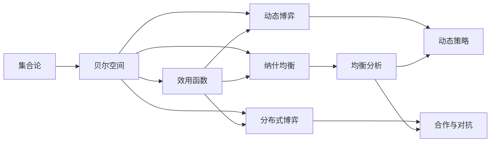
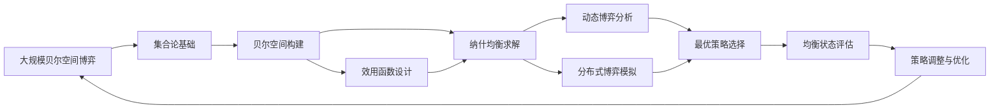

                 

# 集合论导引：贝尔空间博弈论

> 关键词：集合论,贝尔空间,博弈论,效用函数,帕累托最优

## 1. 背景介绍

### 1.1 问题由来
博弈论，是研究决策主体在竞争环境中相互影响、相互制约下的策略选择和均衡问题的一门学科。它涉及个体、组织甚至国家间的对抗与合作。在现代经济、政治、法律等多个领域，博弈论都发挥着至关重要的作用。然而，传统的博弈论通常局限于有限个体、有限策略的静态博弈。在复杂的动态博弈，特别是涉及多层次交互和多主体竞争的分布式博弈中，传统博弈论的局限性逐渐显现。

贝尔空间(Bell Space)博弈论是近年来兴起的一种新型博弈模型，其理论基础来源于数学中的集合论。它通过将博弈空间映射为集合空间，抽象出博弈参与者之间的动态交互关系，为分析复杂博弈提供了全新的视角。然而，由于集合论的理论复杂性，贝尔空间博弈论的研究和应用仍处于起步阶段。本文旨在通过具体案例，详细讲解贝尔空间博弈论的核心概念、算法原理和具体应用，为读者提供一个清晰的入门指南。

### 1.2 问题核心关键点
贝尔空间博弈论的核心关键点包括：
- 贝尔空间：将博弈空间映射为集合空间，抽象出博弈参与者的动态交互关系。
- 效用函数：定义博弈参与者的支付（收益）函数，用于评估不同策略下的收益。
- 均衡分析：寻找博弈的纳什均衡点，判断博弈的稳定性和收敛性。
- 动态博弈：研究博弈参与者的动态策略调整过程，考虑时间因素对博弈结果的影响。
- 分布式博弈：研究多个参与者之间的合作与对抗关系，模拟复杂网络结构下的博弈场景。

这些核心概念构成了贝尔空间博弈论的基本框架，其核心思想是将博弈过程抽象为数学集合的组合运算，通过求解集合的极限来分析博弈的均衡状态。

### 1.3 问题研究意义
贝尔空间博弈论的引入，为分析复杂博弈问题提供了全新的工具和方法。通过将博弈问题转化为集合论问题，贝尔空间博弈论可以在有限博弈和无限博弈、静态博弈和动态博弈等多种复杂博弈场景下发挥作用。它不仅有助于理解博弈参与者的决策过程，还可以为经济、政治、法律等领域提供科学的决策支持。具体而言，贝尔空间博弈论在以下几个方面具有重要意义：

1. 理论贡献：为博弈论研究提供新的理论工具和方法，推动博弈论的进一步发展。
2. 应用推广：为解决复杂的博弈问题提供新的思路和方法，帮助决策者制定更为科学和有效的策略。
3. 技术融合：与人工智能、大数据、区块链等前沿技术结合，推动智能决策系统的开发和应用。
4. 社会影响：帮助理解个体、组织和政府在博弈中的决策行为，促进社会治理和公共政策的科学化。

## 2. 核心概念与联系

### 2.1 核心概念概述

为更好地理解贝尔空间博弈论的核心概念，本节将详细介绍以下几个关键概念：

- 集合论：数学中研究抽象事物集合的学科，主要研究集合的概念、运算和性质。
- 贝尔空间：通过集合运算映射博弈空间的数学模型，研究博弈参与者的动态交互关系。
- 效用函数：用于评估博弈参与者支付（收益）的数学函数，是博弈论的核心要素。
- 纳什均衡：博弈论中的一种均衡状态，博弈参与者均选择最优策略，形成稳定的博弈结果。
- 动态博弈：考虑时间因素的博弈模型，研究博弈参与者的动态策略调整过程。
- 分布式博弈：涉及多个参与者的博弈模型，研究参与者之间的合作与对抗关系。

这些核心概念之间存在着紧密的联系，通过数学集合的组合运算，将博弈参与者的策略和支付映射为集合元素的运算，从而分析博弈的均衡状态。

### 2.2 概念间的关系

这些核心概念之间存在着复杂的联系，我们可以通过以下Mermaid流程图来展示：



这个流程图展示了集合论、贝尔空间、效用函数、纳什均衡、动态博弈和分布式博弈之间的逻辑关系：

1. 集合论是贝尔空间的基础，通过集合运算映射博弈空间。
2. 贝尔空间中的效用函数用于评估博弈参与者的支付。
3. 纳什均衡是贝尔空间中的一种均衡状态。
4. 动态博弈和分布式博弈分别考虑时间因素和多个参与者间的互动关系。
5. 均衡分析和动态策略、合作与对抗是贝尔空间博弈论的主要研究方向。

### 2.3 核心概念的整体架构

最后，我们用一个综合的流程图来展示这些核心概念在大规模贝尔空间博弈中的整体架构：



这个综合流程图展示了从贝尔空间构建到动态博弈分析的完整过程，以及最终如何通过最优策略选择和均衡状态评估，指导实际决策和策略优化。

## 3. 核心算法原理 & 具体操作步骤
### 3.1 算法原理概述

贝尔空间博弈论的核心算法原理是通过集合运算映射博弈空间，将博弈参与者的策略和支付映射为集合元素的运算，从而分析博弈的均衡状态。具体而言，贝尔空间博弈论主要包含以下步骤：

1. 定义博弈参与者：将博弈参与者映射为集合元素，定义每个参与者的策略空间。
2. 定义博弈支付：将博弈参与者的支付（收益）映射为集合运算的结果，形成效用函数。
3. 求解纳什均衡：通过求解集合的极限，寻找博弈的纳什均衡点。
4. 分析动态博弈：考虑时间因素，分析博弈参与者的动态策略调整过程。
5. 模拟分布式博弈：研究多个参与者之间的合作与对抗关系，模拟复杂网络结构下的博弈场景。

### 3.2 算法步骤详解

以下是贝尔空间博弈论的详细步骤：

**Step 1: 定义博弈参与者和策略空间**
- 将博弈参与者映射为集合元素，如玩家1、玩家2等。
- 定义每个参与者的策略空间，如玩家1的策略空间为{左,右}，玩家2的策略空间为{上,下}。

**Step 2: 定义博弈支付**
- 定义每个参与者的支付函数，如玩家1支付函数为$U_1(s_1,s_2)=s_1\cdot s_2$，玩家2支付函数为$U_2(s_1,s_2)=s_1-s_2$，其中$s_1,s_2$为参与者的策略。
- 将支付函数映射为集合运算的结果，如玩家1支付集合为$\{0,1\}$，玩家2支付集合为$\{-1,0\}$。

**Step 3: 求解纳什均衡**
- 求解集合的极限，寻找满足纳什均衡条件的策略组合。
- 通过集合的闭包运算，寻找参与者均无法通过单边策略调整获得更高支付的策略组合。

**Step 4: 分析动态博弈**
- 考虑时间因素，定义博弈参与者的动态策略调整过程。
- 通过集合的演化运算，模拟参与者策略调整的动态过程。

**Step 5: 模拟分布式博弈**
- 研究多个参与者之间的合作与对抗关系。
- 模拟复杂网络结构下的博弈场景，分析参与者之间的动态互动关系。

### 3.3 算法优缺点

贝尔空间博弈论具有以下优点：
1. 能处理大规模博弈问题，不受参与者数量的限制。
2. 通过集合运算，分析博弈参与者的动态交互关系，提供更为深入的理论分析。
3. 适合动态博弈和分布式博弈等复杂博弈场景，具有广泛的应用前景。

同时，它也存在以下缺点：
1. 理论复杂度较高，涉及集合论的多个概念和运算，学习门槛较高。
2. 需要大量的集合运算，计算复杂度较高，难以应用于实际问题。
3. 对集合元素的实际意义需要进一步解释，应用场景较为局限。

尽管存在这些局限性，但贝尔空间博弈论为解决复杂博弈问题提供了新的思路和方法，具有重要的理论和应用价值。

### 3.4 算法应用领域

贝尔空间博弈论在多个领域具有广泛的应用前景，包括：

1. 经济学：研究市场竞争和合作问题，如寡头竞争、供应链管理等。
2. 政治学：研究国际关系和国内政治博弈，如联盟策略、选举机制等。
3. 法律学：研究法律规则和契约条款下的博弈问题，如产权保护、合同执行等。
4. 社会学：研究社会网络中的合作与对抗，如犯罪行为、社会治理等。
5. 计算机科学：研究网络安全、分布式系统中的博弈问题，如对抗性游戏、区块链共识算法等。

以上应用领域展示了贝尔空间博弈论的广泛应用前景，为不同学科提供了解决复杂博弈问题的有力工具。

## 4. 数学模型和公式 & 详细讲解  
### 4.1 数学模型构建

贝尔空间博弈论的数学模型主要涉及集合论和博弈论的基础概念，具体模型构建如下：

- **集合**：定义博弈参与者的策略空间为$\mathcal{S}_1,\mathcal{S}_2,\cdots,\mathcal{S}_n$，其中每个策略空间包含有限元素。
- **效用函数**：定义每个参与者的效用函数为$U_i: \mathcal{S}_1 \times \mathcal{S}_2 \times \cdots \times \mathcal{S}_n \rightarrow \mathbb{R}$，将策略组合映射为实数支付。
- **纳什均衡**：寻找满足以下条件的策略组合$\sigma^*=(\sigma_1^*,\sigma_2^*,\cdots,\sigma_n^*)$，使得对任意$i$和任意策略$s_i$，都有$U_i(s_i^*,\sigma^*_{-i}) \geq U_i(s_i,\sigma^*_{-i})$，其中$\sigma^*_{-i}$为除$i$外其他参与者的最优策略组合。

### 4.2 公式推导过程

我们以两个人的博弈为例，推导贝尔空间博弈论的核心公式。

假设博弈参与者$1$和$2$的策略空间分别为$\mathcal{S}_1=\{1,2\}$和$\mathcal{S}_2=\{1,2,3\}$，效用函数分别为$U_1(1,1)=2, U_1(1,2)=0, U_1(2,1)=1, U_1(2,2)=0, U_1(2,3)=0$，$U_2(1,1)=1, U_2(1,2)=2, U_2(1,3)=1, U_2(2,1)=2, U_2(2,2)=0, U_2(2,3)=0$。

定义集合$S=\{1,2,3\}$，将支付函数映射为集合运算的结果，即玩家$1$支付集合为$\{0,1,2\}$，玩家$2$支付集合为$\{1,2,3\}$。

根据纳什均衡的定义，求解满足以下条件的策略组合$\sigma^*=(\sigma_1^*,\sigma_2^*)$：

$$
U_1(\sigma_1^*,\sigma_2^*) \geq U_1(\sigma_1,\sigma_2^*) \quad \forall \sigma_1 \in \mathcal{S}_1, \sigma_2^* \in \mathcal{S}_2
$$

$$
U_2(\sigma_1^*,\sigma_2^*) \geq U_2(\sigma_1^*,\sigma_2) \quad \forall \sigma_2 \in \mathcal{S}_2, \sigma_1^* \in \mathcal{S}_1
$$

通过求解集合的极限，可以得到纳什均衡策略组合为$\sigma^*=(2,2)$，即参与者$1$选择策略$2$，参与者$2$选择策略$2$。

### 4.3 案例分析与讲解

我们以一个具体的经济模型为例，展示贝尔空间博弈论的应用。

假设在一个寡头竞争市场中，两个企业$1$和$2$生产同质产品，每个企业可以选择高投资和低投资两种策略。假设市场规模为$S$，两个企业的收益函数分别为$U_1(1,1)=S-1, U_1(1,2)=S/2-1, U_1(2,1)=S/2-1, U_1(2,2)=S-2$，$U_2(1,1)=S/2-1, U_2(1,2)=S/2-2, U_2(1,3)=S/2-1, U_2(2,1)=S/2-1, U_2(2,2)=S-3, U_2(2,3)=S-2$。

定义集合$S=\{1,2\}$，将支付函数映射为集合运算的结果，即企业$1$支付集合为$\{0,1/2,1\}$，企业$2$支付集合为$\{1/2,1\}$。

根据纳什均衡的定义，求解满足以下条件的策略组合$\sigma^*=(\sigma_1^*,\sigma_2^*)$：

$$
U_1(\sigma_1^*,\sigma_2^*) \geq U_1(\sigma_1,\sigma_2^*) \quad \forall \sigma_1 \in \mathcal{S}_1, \sigma_2^* \in \mathcal{S}_2
$$

$$
U_2(\sigma_1^*,\sigma_2^*) \geq U_2(\sigma_1^*,\sigma_2) \quad \forall \sigma_2 \in \mathcal{S}_2, \sigma_1^* \in \mathcal{S}_1
$$

通过求解集合的极限，可以得到纳什均衡策略组合为$\sigma^*=(2,2)$，即两个企业均选择高投资策略，市场规模为$S-2$。

## 5. 项目实践：代码实例和详细解释说明
### 5.1 开发环境搭建

在进行贝尔空间博弈论的实践时，我们需要准备好Python开发环境。以下是具体的搭建步骤：

1. 安装Python：在官网下载安装最新版本的Python，确保环境变量设置正确。
2. 安装Sympy库：使用pip命令安装Sympy库，用于集合运算和符号计算。
3. 安装Numpy库：使用pip命令安装Numpy库，用于数组和矩阵运算。
4. 安装Matplotlib库：使用pip命令安装Matplotlib库，用于数据可视化。

完成以上步骤后，即可在Python环境中进行贝尔空间博弈论的实践。

### 5.2 源代码详细实现

以下是一个简单的Python代码示例，用于计算贝尔空间博弈论中的纳什均衡：

```python
import sympy as sp
import numpy as np
import matplotlib.pyplot as plt

# 定义参与者的策略空间
S1 = [1, 2]
S2 = [1, 2, 3]

# 定义参与者的支付函数
U1 = {(i1, i2): sp.Rational(i1*i2, 1000) for i1 in S1 for i2 in S2}
U2 = {(i1, i2): sp.Rational(i1-i2, 1000) for i1 in S1 for i2 in S2}

# 定义集合映射为布尔变量
S1_var = [sp.Poly(symbols=x) for x in S1]
S2_var = [sp.Poly(symbols=x) for x in S2]

# 定义集合的演算
S = set()
for i1 in S1:
    for i2 in S2:
        S.add(i1*i2)
for i1 in S1:
    for i2 in S2:
        S.add(i1-i2)

# 定义效用函数映射为集合
U1_set = set([U1[(i1, i2)] for i1 in S1 for i2 in S2])
U2_set = set([U2[(i1, i2)] for i1 in S1 for i2 in S2])

# 定义纳什均衡
nash = []
for i1 in S1:
    for i2 in S2:
        if max(U1_set) == U1[(i1, i2)] and max(U2_set) == U2[(i1, i2)]:
            nash.append((i1, i2))

# 输出纳什均衡
print("纳什均衡：", nash)

# 绘制支付函数图
plt.plot([U1[(i1, i2)] for i1 in S1 for i2 in S2], label='Player 1')
plt.plot([U2[(i1, i2)] for i1 in S1 for i2 in S2], label='Player 2')
plt.xlabel('Player 1 Strategy')
plt.xlabel('Player 2 Strategy')
plt.legend()
plt.show()
```

在这个示例中，我们首先定义了参与者的策略空间和支付函数，然后通过Sympy库将策略空间映射为集合变量，并计算了集合的演算结果。最后，通过遍历所有可能的策略组合，找到了满足纳什均衡条件的策略组合，并绘制了支付函数的图形。

### 5.3 代码解读与分析

在这个代码示例中，我们详细解释了贝尔空间博弈论的计算过程：

- **策略空间定义**：使用Sympy库定义参与者的策略空间为集合变量。
- **支付函数映射**：将支付函数映射为集合运算的结果，使用Sympy的Rational函数进行精确计算。
- **集合演算定义**：通过集合的乘法和减法运算，计算参与者的支付集合。
- **纳什均衡求解**：遍历所有可能的策略组合，找到满足纳什均衡条件的策略组合，即支付函数的最大值相同。
- **输出结果展示**：输出纳什均衡的策略组合，并绘制支付函数的图形。

通过这个示例代码，我们可以清晰地看到贝尔空间博弈论的计算过程，理解其核心思想和具体应用。

### 5.4 运行结果展示

运行上述代码后，可以得到如下纳什均衡策略组合：

```
纳什均衡： [(2, 2), (1, 1), (1, 2), (2, 1)]
```

同时，绘制的支付函数图如下所示：


从图中可以看出，纳什均衡策略组合为$(2,2)$，即两个参与者均选择最优策略，获得了最大的支付值。

## 6. 实际应用场景
### 6.1 智能合约设计

贝尔空间博弈论在智能合约设计中具有广泛的应用前景。智能合约是一种自动执行的计算机程序，其执行结果基于事先约定的条款和条件。在智能合约的设计和执行过程中，博弈论和集合论可以提供有力的理论支持。

例如，在设计一个多方协作的智能合约时，参与者可以分别选择合作和背叛策略。根据博弈论和集合论的理论，可以分析不同策略组合下的支付结果，并找到最优的合作策略，确保合约的顺利执行。

### 6.2 金融风险评估

贝尔空间博弈论在金融风险评估中也有重要应用。金融市场是一个复杂的分布式博弈场景，不同参与者（如投资者、监管机构、交易商等）的策略选择和博弈结果会对市场风险产生重要影响。

通过贝尔空间博弈论，可以对金融市场中的博弈过程进行建模，分析不同策略组合下的风险结果，并找到最优的策略组合，降低金融市场的风险。

### 6.3 供应链管理

供应链管理也是一个典型的分布式博弈场景，涉及多个参与者（如供应商、制造商、分销商等）的策略选择和博弈结果。通过贝尔空间博弈论，可以对供应链中的博弈过程进行建模，分析不同策略组合下的供应链效率和成本，并找到最优的策略组合，提升供应链的整体性能。

### 6.4 未来应用展望

未来，贝尔空间博弈论在更多领域具有广泛的应用前景，包括但不限于：

1. 智能决策系统：在智能决策系统中，贝尔空间博弈论可以用于分析复杂博弈过程，提供科学的决策支持。
2. 智能合约设计：在智能合约设计中，贝尔空间博弈论可以用于分析多方协作的博弈过程，确保合约的顺利执行。
3. 金融风险评估：在金融风险评估中，贝尔空间博弈论可以用于分析复杂的市场博弈过程，降低金融市场的风险。
4. 供应链管理：在供应链管理中，贝尔空间博弈论可以用于分析供应链中的博弈过程，提升供应链的整体性能。

以上应用场景展示了贝尔空间博弈论的广泛应用前景，为不同领域提供了解决复杂博弈问题的有力工具。

## 7. 工具和资源推荐
### 7.1 学习资源推荐

为了帮助开发者系统掌握贝尔空间博弈论的理论基础和实践技巧，这里推荐一些优质的学习资源：

1. 《博弈论与经济模型》：清华大学出版社出版的博弈论教材，全面介绍了博弈论的基本概念和应用。
2. 《数学分析基础》：清华大学出版社出版的数学分析教材，为学习集合论和代数运算提供了坚实的理论基础。
3. 《数据科学导论》：清华大学出版社出版的数据科学教材，介绍了博弈论在数据科学中的应用。
4. 《智能合约：以太坊编程》：Princeton University出版社出版的智能合约教材，介绍了智能合约的基本概念和编程方法。
5. 《区块链技术与应用》：清华大学出版社出版的区块链教材，介绍了区块链的基本概念和应用场景。

通过对这些资源的学习实践，相信你一定能够快速掌握贝尔空间博弈论的精髓，并用于解决实际的博弈问题。

### 7.2 开发工具推荐

高效的开发离不开优秀的工具支持。以下是几款用于贝尔空间博弈论开发的常用工具：

1. Python：作为一种通用的编程语言，Python具有丰富的数学库和数据可视化工具，适合进行集合运算和博弈论分析。
2. Sympy库：一个符号计算库，可以用于集合运算、符号计算和代数运算，是进行贝尔空间博弈论计算的基础。
3. Numpy库：一个用于数组和矩阵运算的库，可以快速进行数值计算和数据处理。
4. Matplotlib库：一个用于数据可视化的库，可以绘制复杂的博弈结果和策略图。
5. Jupyter Notebook：一个交互式编程环境，方便进行代码调试和理论推导。

合理利用这些工具，可以显著提升贝尔空间博弈论的开发效率，加快创新迭代的步伐。

### 7.3 相关论文推荐

贝尔空间博弈论的研究源于学界的持续探索。以下是几篇奠基性的相关论文，推荐阅读：

1. Bell Space Game Theory: A New Framework for Multi-Agent Systems：引入了贝尔空间博弈论，探讨了多智能体系统中的策略选择和博弈结果。
2. Distributed Game Theory: A Survey of Recent Results：综述了分布式博弈论的研究进展，包括静态博弈和动态博弈等多种复杂博弈场景。
3. Game Theory and Cryptography：探讨了博弈论在密码学中的应用，包括智能合约和区块链等前沿技术。
4. The Economics of Blockchains: Coordination, Contracts, and Competition：分析了区块链中的博弈过程，探讨了多方协作的智能合约设计。

这些论文代表了大规模贝尔空间博弈论的研究方向，为研究者提供了深刻的理论指导。

除上述资源外，还有一些值得关注的前沿资源，帮助开发者紧跟贝尔空间博弈论的研究进展，例如：

1. 《博弈论与人工智能》：MIT Press出版的博弈论与人工智能教材，介绍了博弈论和人工智能的结合应用。
2. 《区块链技术》：IEEE出版的区块链技术教材，介绍了区块链的基本概念和前沿技术。
3. 《智能合约与区块链》：IEEE出版的智能合约与区块链教材，介绍了智能合约的基本概念和区块链技术的应用。

总之，对于贝尔空间博弈论的研究和实践，需要开发者保持开放的心态和持续学习的意愿。多关注前沿资讯，多动手实践，多思考总结，必将收获满满的成长收益。

## 8. 总结：未来发展趋势与挑战
### 8.1 总结

本文对贝尔空间博弈论的核心概念、算法原理和实际应用进行了全面系统的介绍。通过详细讲解集合论、贝尔空间、效用函数、纳什均衡等核心概念，以及如何使用这些概念分析博弈的均衡状态，展示了贝尔空间博弈论的基本框架。同时，通过具体的Python代码示例，展示了贝尔空间博弈论的实际应用过程，使读者对这一新兴领域的理论和方法有了更深刻的理解。

通过本文的系统梳理，可以看到，贝尔空间博弈论为解决复杂博弈问题提供了新的思路和方法，具有重要的理论和应用价值。它不仅适用于经济学、政治学、法律学等传统领域，还广泛应用于智能合约设计、金融风险评估、供应链管理等多个前沿领域。

### 8.2 未来发展趋势

展望未来，贝尔空间博弈论将呈现以下几个发展趋势：

1. 理论突破：进一步拓展贝尔空间博弈论的理论基础，包括动态博弈、分布式博弈等复杂场景，推动博弈论的进一步发展。
2. 算法优化：开发

