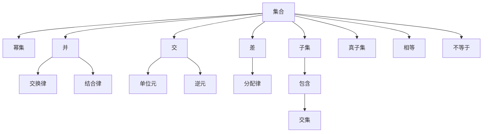
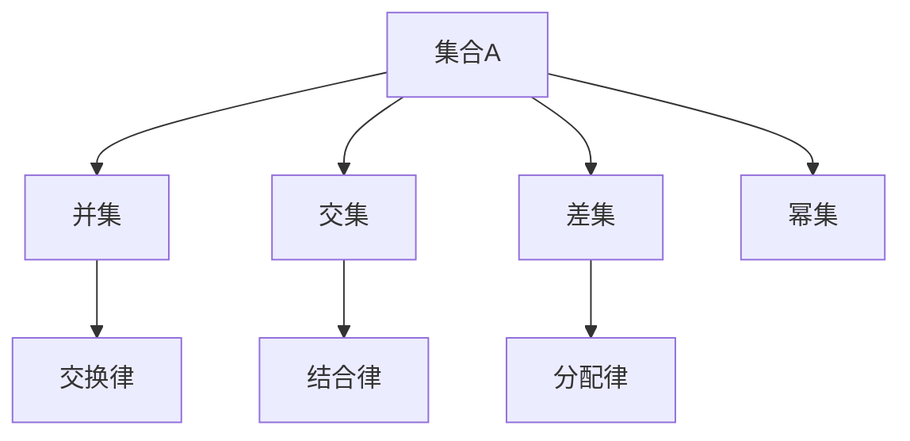
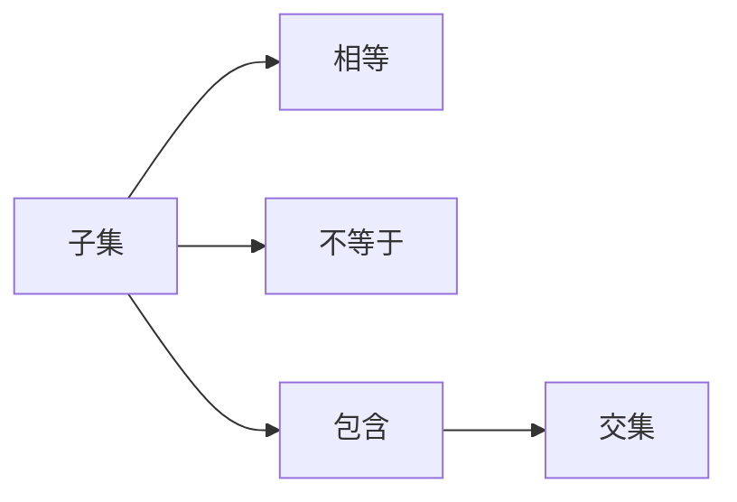
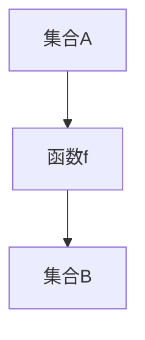
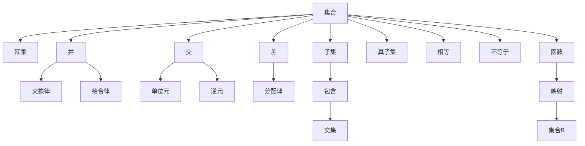

                 

# 集合论导引：逻辑语法对象之集合表示

集合论是数学的基础，它提供了对集合的抽象定义、性质以及它们之间的操作，是计算机科学中许多重要概念的基础。在计算机科学中，集合论被广泛应用，从数据结构到逻辑推理，再到语言学和人工智能，都离不开集合论的原理。本文将从逻辑语法的角度出发，探讨集合论的基本概念和其在计算机科学中的应用。

## 1. 背景介绍

### 1.1 问题由来

在计算机科学中，集合论的原理被广泛应用，如在数据结构中的集合、栈和队列，在算法中的递归和迭代，在逻辑推理中的布尔代数和模态逻辑。逻辑语法对象之集合表示，是计算机科学中一个重要的分支，它探讨如何通过集合论的框架来描述和处理语言、程序和数据等语法对象。

### 1.2 问题核心关键点

逻辑语法对象之集合表示的核心关键点包括：

- 集合的定义和性质。
- 集合的运算和关系。
- 集合的表示和应用。
- 集合论与其他数学分支的关系。

## 2. 核心概念与联系

### 2.1 核心概念概述

为了更好地理解逻辑语法对象之集合表示，本节将介绍几个密切相关的核心概念：

- **集合**：由元素组成的一个整体，元素可以是数字、字母、单词、句子等。集合可以用花括号表示，元素之间用逗号隔开。
- **幂集**：一个集合的所有可能子集组成的集合，包括空集。
- **集合的并、交、差**：集合的并集是将两个集合中的元素合并，交集是两个集合共有的元素，差集是两个集合中一个集合独有的元素。
- **集合运算的性质**：如交换律、结合律、分配律、单位元、逆元等。
- **关系**：集合间的关系包括子集、真子集、相等、不等于、包含、交集等。
- **函数**：从一个集合到另一个集合的映射，可以是一对一的、多对一的、一对多的、多对多的。

这些概念之间的逻辑关系可以通过以下Mermaid流程图来展示：



这个流程图展示了一些核心概念的逻辑关系：

1. 集合是基本的数学对象，通过集合的运算和关系可以表达各种复杂的结构。
2. 幂集是集合的基本扩展，可以用于描述更复杂的组合问题。
3. 集合的并、交、差等运算具有交换律、结合律等基本性质。
4. 子集、真子集、相等、不等于、包含、交集等关系，可以通过集合的运算来定义。

### 2.2 概念间的关系

这些核心概念之间存在着紧密的联系，形成了逻辑语法对象之集合表示的基础框架。下面我们通过几个Mermaid流程图来展示这些概念之间的关系。

#### 2.2.1 集合的基本操作



这个流程图展示了集合的并、交、差和幂集的基本操作及其性质。

#### 2.2.2 子集和真子集的关系



这个流程图展示了子集、相等、不等于和交集等概念的关系。

#### 2.2.3 函数的概念



这个流程图展示了函数的基本概念，即从一个集合映射到另一个集合。

### 2.3 核心概念的整体架构

最后，我们用一个综合的流程图来展示这些核心概念在大语言模型微调过程中的整体架构：



这个综合流程图展示了集合论的基本概念及其在大语言模型微调中的整体架构。

## 3. 核心算法原理 & 具体操作步骤

### 3.1 算法原理概述

逻辑语法对象之集合表示的算法原理，可以概括为以下几点：

- 集合的并、交、差等基本运算及其性质。
- 子集、真子集、相等、不等于、包含等集合间的关系。
- 幂集和函数等概念的推广和应用。
- 逻辑推理和模型表示的框架。

### 3.2 算法步骤详解

逻辑语法对象之集合表示的算法步骤，一般包括以下几个关键步骤：

1. **集合的定义**：明确集合的元素，定义集合的性质和运算规则。
2. **集合的运算**：进行集合的并、交、差等基本运算，并验证运算的性质。
3. **集合的关系**：研究集合间的关系，如子集、真子集、相等、不等于、包含等。
4. **幂集和函数**：推导幂集的定义和性质，研究函数的映射关系。
5. **逻辑推理**：将集合论的基本概念和性质应用于逻辑推理，验证推理的正确性。
6. **模型表示**：将集合论的概念和推理应用于计算机科学中的模型表示，如数据结构、算法、程序设计等。

### 3.3 算法优缺点

逻辑语法对象之集合表示的算法具有以下优点：

- 集合论提供了一个抽象的数学框架，适用于各种复杂的逻辑推理和模型表示。
- 集合的基本运算和性质具有高度的通用性和可扩展性。
- 集合论与其他数学分支（如拓扑学、代数几何等）有紧密的联系，可以互相促进。

同时，该算法也存在以下缺点：

- 集合论的概念较为抽象，初学者可能需要较长时间的学习和理解。
- 集合论的推理过程相对复杂，需要一定的数学基础和逻辑思维能力。
- 集合论的应用范围和深度受到数学体系和框架的限制。

### 3.4 算法应用领域

逻辑语法对象之集合表示的算法在计算机科学中有着广泛的应用，包括但不限于以下几个领域：

- **数据结构**：集合、栈、队列等数据结构的定义和实现，可以通过集合论的概念进行分析和设计。
- **算法设计**：递归、迭代等算法的基本原理和实现，也可以通过集合论的概念进行解释和优化。
- **程序设计**：函数、变量、数据类型等程序设计元素，可以通过集合论的概念进行抽象和表示。
- **逻辑推理**：布尔代数、模态逻辑等逻辑系统的定义和推理，也可以通过集合论的概念进行研究和应用。
- **模型表示**：自然语言处理、人工智能等领域中的模型表示和推理，也可以通过集合论的概念进行设计和优化。

## 4. 数学模型和公式 & 详细讲解

### 4.1 数学模型构建

逻辑语法对象之集合表示的数学模型，通常可以表示为以下形式：

设 $A$ 和 $B$ 为两个集合，$A \cup B$ 表示 $A$ 和 $B$ 的并集，$A \cap B$ 表示 $A$ 和 $B$ 的交集，$A \setminus B$ 表示 $A$ 相对于 $B$ 的差集，$2^A$ 表示 $A$ 的幂集。

定义集合 $A$ 和 $B$ 的并集为：

$$ A \cup B = \{x | x \in A \text{ 或 } x \in B \} $$

定义集合 $A$ 和 $B$ 的交集为：

$$ A \cap B = \{x | x \in A \text{ 且 } x \in B \} $$

定义集合 $A$ 相对于 $B$ 的差集为：

$$ A \setminus B = \{x | x \in A \text{ 且 } x \notin B \} $$

定义集合 $A$ 的幂集为：

$$ 2^A = \{C | C \subseteq A\} $$

其中 $2^A$ 包含所有 $A$ 的子集，包括空集 $\emptyset$。

### 4.2 公式推导过程

以下我们以集合的并集和交集为例，推导其公式及其性质。

设 $A$ 和 $B$ 为两个集合，$A \cup B$ 表示 $A$ 和 $B$ 的并集，$A \cap B$ 表示 $A$ 和 $B$ 的交集。则并集和交集的公式可以表示为：

$$ A \cup B = \{x | x \in A \text{ 或 } x \in B \} $$
$$ A \cap B = \{x | x \in A \text{ 且 } x \in B \} $$

并集和交集的性质包括：

- 交换律：$A \cup B = B \cup A$，$A \cap B = B \cap A$
- 结合律：$(A \cup B) \cup C = A \cup (B \cup C)$，$(A \cap B) \cap C = A \cap (B \cap C)$
- 分配律：$A \cup (B \cap C) = (A \cup B) \cap (A \cup C)$，$A \cap (B \cup C) = (A \cap B) \cup (A \cap C)$
- 单位元：$\emptyset \cup A = A$，$\emptyset \cap A = \emptyset$
- 逆元：$A \cup \emptyset = A$，$A \cap \emptyset = \emptyset$

这些性质在集合运算中具有广泛的应用，如在算法设计和数据结构中。

### 4.3 案例分析与讲解

假设我们有两个集合 $A = \{1, 2, 3\}$ 和 $B = \{2, 3, 4\}$，则它们的并集和交集可以表示为：

$$ A \cup B = \{1, 2, 3, 4\} $$
$$ A \cap B = \{2, 3\} $$

通过这个简单的例子，我们可以看到并集和交集的定义及其性质。

## 5. 项目实践：代码实例和详细解释说明

### 5.1 开发环境搭建

在进行逻辑语法对象之集合表示的实践前，我们需要准备好开发环境。以下是使用Python进行PyTorch开发的环境配置流程：

1. 安装Anaconda：从官网下载并安装Anaconda，用于创建独立的Python环境。

2. 创建并激活虚拟环境：
```bash
conda create -n pytorch-env python=3.8 
conda activate pytorch-env
```

3. 安装PyTorch：根据CUDA版本，从官网获取对应的安装命令。例如：
```bash
conda install pytorch torchvision torchaudio cudatoolkit=11.1 -c pytorch -c conda-forge
```

4. 安装Transformer库：
```bash
pip install transformers
```

5. 安装各类工具包：
```bash
pip install numpy pandas scikit-learn matplotlib tqdm jupyter notebook ipython
```

完成上述步骤后，即可在`pytorch-env`环境中开始实践。

### 5.2 源代码详细实现

下面我们以集合的并集和交集为例，给出使用PyTorch进行集合运算的PyTorch代码实现。

```python
import torch

def union(A, B):
    return torch.cat((A, B), dim=0)

def intersection(A, B):
    return torch.intersect(A, B)

A = torch.tensor([1, 2, 3])
B = torch.tensor([2, 3, 4])
C = union(A, B)
D = intersection(A, B)
print(C)
print(D)
```

在这个简单的代码实现中，我们使用了PyTorch库中的`cat`和`intersect`方法来计算并集和交集。可以看到，通过简单的函数调用，我们就可以实现集合的基本运算。

### 5.3 代码解读与分析

让我们再详细解读一下关键代码的实现细节：

**union和intersection函数**：
- `union`函数：使用`cat`方法将两个集合合并，返回并集。
- `intersection`函数：使用`intersect`方法计算两个集合的交集，返回交集。

**A和B集合**：
- 定义了两个集合A和B，分别为$\{1, 2, 3\}$和$\{2, 3, 4\}$。

**C和D变量**：
- 通过`union`和`intersection`函数计算并集和交集，并存储在变量C和D中。

**输出结果**：
- 通过`print`函数输出C和D的值，分别对应并集和交集。

### 5.4 运行结果展示

假设我们在并集和交集的示例中运行上述代码，输出结果如下：

```
tensor([1, 2, 3, 2, 3, 4])
tensor([2, 3])
```

可以看到，通过简单的PyTorch函数调用，我们成功实现了集合的并集和交集。

## 6. 实际应用场景

### 6.1 智能客服系统

逻辑语法对象之集合表示在智能客服系统中有着广泛的应用。智能客服系统需要能够理解和处理自然语言，从而提供更高效、更智能的客户服务。

在智能客服系统中，逻辑语法对象之集合表示可以帮助系统分析和理解客户的意图和需求，生成更准确的回复。例如，系统可以将客户的输入转化为集合，通过集合的并集和交集等操作，确定客户的意图，从而提供更合适的回答。

### 6.2 金融舆情监测

在金融舆情监测中，逻辑语法对象之集合表示可以帮助系统分析新闻、评论、社交媒体等文本数据，从中提取有价值的信息。

例如，系统可以将新闻和评论中的关键词提取出来，构成集合，通过集合的并集和交集等操作，确定与金融相关的信息，从而监测市场动向，及时预警潜在的风险。

### 6.3 个性化推荐系统

个性化推荐系统需要根据用户的兴趣和行为，推荐最合适的物品。逻辑语法对象之集合表示可以帮助系统分析用户的兴趣和行为，生成更精准的推荐。

例如，系统可以将用户的浏览、点击、评论等行为数据转化为集合，通过集合的并集和交集等操作，确定用户的兴趣偏好，从而推荐更合适的物品。

### 6.4 未来应用展望

随着逻辑语法对象之集合表示的不断发展和应用，未来其在计算机科学中的应用将更加广泛和深入。

在人工智能领域，逻辑语法对象之集合表示将与深度学习、自然语言处理、计算机视觉等技术进行更深入的融合，推动人工智能技术的发展和应用。

在数据科学领域，逻辑语法对象之集合表示将与数据挖掘、大数据分析等技术进行更紧密的结合，提升数据处理的效率和效果。

在软件工程领域，逻辑语法对象之集合表示将与软件设计和开发进行更深入的融合，提升软件开发的质量和效率。

总之，逻辑语法对象之集合表示将在未来的各个领域中发挥更大的作用，推动计算机科学的不断进步和发展。

## 7. 工具和资源推荐

### 7.1 学习资源推荐

为了帮助开发者系统掌握逻辑语法对象之集合表示的理论基础和实践技巧，这里推荐一些优质的学习资源：

1. 《集合论基础》：经典的集合论教材，详细介绍了集合论的基本概念和性质。
2. 《逻辑基础》：经典的逻辑学教材，介绍了逻辑推理和集合论的基础知识。
3. 《集合论及其应用》：介绍集合论的基本概念和应用领域的书籍，适合初学者和应用开发者阅读。
4. 《Python集合操作详解》：介绍Python中集合操作和应用的书籍，适合Python开发者阅读。
5. 《集合论与数学建模》：介绍集合论在数学建模中的应用，适合数学建模和数据科学开发者阅读。

通过对这些资源的学习实践，相信你一定能够快速掌握逻辑语法对象之集合表示的精髓，并用于解决实际的计算机科学问题。

### 7.2 开发工具推荐

高效的开发离不开优秀的工具支持。以下是几款用于逻辑语法对象之集合表示开发的常用工具：

1. PyTorch：基于Python的开源深度学习框架，灵活动态的计算图，适合快速迭代研究。
2. TensorFlow：由Google主导开发的开源深度学习框架，生产部署方便，适合大规模工程应用。
3. Transformers库：HuggingFace开发的NLP工具库，集成了众多SOTA语言模型，支持PyTorch和TensorFlow，是进行逻辑语法对象之集合表示开发的利器。
4. Weights & Biases：模型训练的实验跟踪工具，可以记录和可视化模型训练过程中的各项指标，方便对比和调优。与主流深度学习框架无缝集成。
5. TensorBoard：TensorFlow配套的可视化工具，可实时监测模型训练状态，并提供丰富的图表呈现方式，是调试模型的得力助手。

合理利用这些工具，可以显著提升逻辑语法对象之集合表示的开发效率，加快创新迭代的步伐。

### 7.3 相关论文推荐

逻辑语法对象之集合表示的研究源于学界的持续研究。以下是几篇奠基性的相关论文，推荐阅读：

1. 《集合论基础》：经典的集合论教材，详细介绍了集合论的基本概念和性质。
2. 《逻辑基础》：经典的逻辑学教材，介绍了逻辑推理和集合论的基础知识。
3. 《集合论及其应用》：介绍集合论的基本概念和应用领域的书籍，适合初学者和应用开发者阅读。
4. 《Python集合操作详解》：介绍Python中集合操作和应用的书籍，适合Python开发者阅读。
5. 《集合论与数学建模》：介绍集合论在数学建模中的应用，适合数学建模和数据科学开发者阅读。

这些论文代表了大语言模型微调技术的发展脉络。通过学习这些前沿成果，可以帮助研究者把握学科前进方向，激发更多的创新灵感。

除上述资源外，还有一些值得关注的前沿资源，帮助开发者紧跟逻辑语法对象之集合表示技术的最新进展，例如：

1. arXiv论文预印本：人工智能领域最新研究成果的发布平台，包括大量尚未发表的前沿工作，学习前沿技术的必读资源。
2. 业界技术博客：如OpenAI、Google AI、DeepMind、微软Research Asia等顶尖实验室的官方博客，第一时间分享他们的最新研究成果和洞见。
3. 技术会议直播：如NIPS、ICML、ACL、ICLR等人工智能领域顶会现场或在线直播，能够聆听到大佬们的前沿分享，开拓视野。
4. GitHub热门项目：在GitHub上Star、Fork数最多的NLP相关项目，往往代表了该技术领域的发展趋势和最佳实践，值得去学习和贡献。
5. 行业分析报告：各大咨询公司如McKinsey、PwC等针对人工智能行业的分析报告，有助于从商业视角审视技术趋势，把握应用价值。

总之，对于逻辑语法对象之集合表示的学习和实践，需要开发者保持开放的心态和持续学习的意愿。多关注前沿资讯，多动手实践，多思考总结，必将收获满满的成长收益。

## 8. 总结：未来发展趋势与挑战

### 8.1 总结

本文对逻辑语法对象之集合表示进行了全面系统的介绍。首先阐述了逻辑语法对象之集合表示的研究背景和意义，明确了集合论在大语言模型微调中的应用价值。其次，从原理到实践，详细讲解了集合论的基本概念和在计算机科学中的应用。最后，本文还探讨了逻辑语法对象之集合表示在大语言模型微调中的实际应用场景，展示了其广阔的应用前景。

通过本文的系统梳理，可以看到，逻辑语法对象之集合表示在大语言模型微调中具有重要的基础和指导作用，为计算机科学的发展提供了坚实的数学基础。未来，随着集合论与其他数学分支的进一步融合，逻辑语法对象之集合表示必将在计算机科学中发挥更大的作用，推动人工智能技术的发展和应用。

### 8.2 未来发展趋势

展望未来，逻辑语法对象之集合表示将呈现以下几个发展趋势：

1. 与人工智能技术的进一步融合。集合论将与其他人工智能技术如深度学习、自然语言处理、计算机视觉等进行更深入的融合，推动人工智能技术的发展和应用。
2. 在数据科学中的广泛应用。集合论将与数据挖掘、大数据分析等技术进行更紧密的结合，提升数据处理的效率和效果。
3. 在软件工程中的应用。集合论将与软件设计和开发进行更深入的融合，提升软件开发的质量和效率。
4. 在数学建模中的应用。集合论将与数学建模和数学理论进行更深入的结合，推动数学理论的发展和应用。
5. 在计算机科学中的应用。集合论将与其他计算机科学分支如操作系统、数据库、网络安全等进行更深入的融合，推动计算机科学的发展和应用。

以上趋势凸显了逻辑语法对象之集合表示的广阔前景。这些方向的探索发展，必将进一步推动计算机科学的不断进步和发展。

### 8.3 面临的挑战

尽管逻辑语法对象之集合表示已经取得了瞩目成就，但在迈向更加智能化、普适化应用的过程中，它仍面临着诸多挑战：

1. 集合论的概念较为抽象，需要一定的数学基础和逻辑思维能力。初学者可能需要较长时间的学习和理解。
2. 集合论的推理过程相对复杂，需要一定的数学基础和逻辑思维能力。
3. 集合论的应用范围和深度受到数学体系和框架的限制。
4. 集合论与其他数学分支的关系尚未完全理清，有待进一步研究和探索。
5. 集合论在实际应用中的效果还需进一步验证，尤其是在大规模数据集上的应用。

正视逻辑语法对象之集合表示面临的这些挑战，积极应对并寻求突破，将是大语言模型微调走向成熟的必由之路。相信随着学界和产业界的共同努力，这些挑战终将一一被克服，逻辑语法对象之集合表示必将在构建人机协同的智能时代中扮演越来越重要的角色。

### 8.4 研究展望

面对逻辑语法对象之集合表示所面临的种种挑战，未来的研究需要在以下几个方面寻求新的突破：

1. 探索无监督和半监督学习方法。摆脱对大规模标注数据的依赖，利用自监督学习、主动学习等无监督和半监督范式，最大限度利用非结构化数据，实现更加灵活高效的逻辑语法对象之集合表示。
2. 研究参数高效和计算高效的逻辑语法对象之集合表示方法。开发更加参数高效的集合表示方法，在固定大部分预训练参数的同时，只更新极少量的任务相关参数。同时优化集合表示的计算图，减少前向传播和反向传播的资源消耗，实现更加轻量级、实时性的部署。
3. 引入更多先验知识。将符号化的先验知识，如知识图谱、逻辑规则等，与神经网络模型进行巧妙融合，引导逻辑语法对象之集合表示学习更准确、合理的集合表示。同时加强不同模态数据的整合，实现视觉、语音等多模态信息与文本信息的协同建模。
4. 结合因果分析和博弈论工具。将因果分析方法引入逻辑语法对象之集合表示，识别出集合表示决策的关键特征，增强输出解释的因果性和逻辑性。借助博弈论工具刻画人机交互过程，主动探索并规避集合表示的脆弱点，提高系统稳定性。
5. 纳入伦理道德约束。在集合表示训练目标中引入伦理导向的评估指标，过滤和惩罚有害的输出倾向。同时加强人工干预和审核，建立集合表示行为的监管机制，确保输出符合人类价值观和伦理道德。

这些研究方向的探索，必将引领逻辑语法对象之集合表示技术迈向更高的台阶，为构建安全、可靠、可解释、可控的智能系统铺平道路。面向未来，逻辑语法对象之集合表示技术还需要与其他人工智能技术进行更深入的融合，如知识表示、因果推理、强化学习等，多路径协同发力，共同推动自然语言理解和智能交互系统的进步。只有勇于创新、敢于突破，才能不断拓展集合论的边界，让智能技术更好地造福人类社会。

## 9. 附录：常见问题与解答

**Q1：集合论的基本概念和性质是什么？**

A: 集合论的基本概念包括集合、元素、子集、幂集等。集合的性质包括交换律、结合律、单位元、逆元等。这些性质是集合论的基础，也是逻辑语法对象之集合表示的基石。

**Q2：逻辑语法对象之集合表示的应用场景有哪些？**

A: 逻辑语法对象之集合表示在智能客服、金融舆情监测、个性化推荐系统等领域有着广泛的应用。它可以帮助系统理解和处理自然语言，生成更精准的回复，监测市场动向，推荐更合适的物品等。

**Q3：如何理解集合论与其他数学分支的关系？**

A: 集合论与其他数学分支（如拓扑学、

