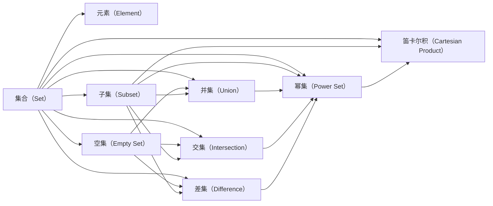

                 

# 集合论导引：集合累积层次

## 1. 背景介绍

### 1.1 问题由来
集合论是数学中的一个基本分支，其研究的是集合（Set）的基本概念、性质以及相互关系。在计算机科学中，集合论被广泛应用于数据结构、算法设计、逻辑推理等领域，成为构建和分析数据模型和算法的重要基础。

在传统的集合论中，集合被定义为一个由一定元素构成的封闭系统，其核心概念包括集合的元素、包含关系、交集、并集、差集、幂集等。然而，这些概念往往被抽象地讨论，缺乏具体的算法和技术手段。

为了更好地理解并应用这些概念，本节将介绍集合论的基础知识，并探讨如何通过算法和技术手段来处理和操作集合。

### 1.2 问题核心关键点
集合论的核心问题包括：
- 如何定义集合及其基本运算，如交集、并集、差集等。
- 如何高效地处理和操作集合，包括元素查找、插入、删除、遍历等。
- 如何处理集合间的运算，如并集、交集、对称差集等。
- 如何扩展集合论的应用范围，使其适用于复杂的数据结构和算法设计。

## 2. 核心概念与联系

### 2.1 核心概念概述

为更好地理解集合论的算法和技术手段，本节将介绍几个密切相关的核心概念：

- 集合（Set）：由一定元素构成的封闭系统，其中每个元素唯一且可重复。
- 元素（Element）：构成集合的基本单位。
- 空集（Empty Set）：不含任何元素的集合。
- 子集（Subset）：属于某个集合的所有元素构成的集合。
- 并集（Union）：包含两个集合中所有元素的集合。
- 交集（Intersection）：包含两个集合中共有元素的集合。
- 差集（Difference）：包含一个集合中但不在另一个集合中的元素构成的集合。
- 幂集（Power Set）：一个集合的所有子集构成的集合。
- 笛卡尔积（Cartesian Product）：两个集合中元素构成的所有可能组合的集合。

这些概念之间存在着紧密的联系，通过它们可以构建和分析各种复杂的数据结构和算法。例如，集合的并集和交集可以用于分析数据流和模式匹配，而笛卡尔积可以用于分析多重关联关系和多维数据。

### 2.2 概念间的关系

这些核心概念之间的逻辑关系可以通过以下Mermaid流程图来展示：



这个流程图展示了大集合与子集、空集、幂集等概念之间的逻辑关系。例如，并集包含两个集合中的所有元素，而交集只包含两个集合中的共有元素。空集是任何集合的子集，而幂集则包含了某个集合的所有子集。

## 3. 核心算法原理 & 具体操作步骤
### 3.1 算法原理概述

集合论的算法和技术手段主要基于集合的基本运算，包括元素查找、插入、删除、遍历等。常用的数据结构包括数组、哈希表、树、图等。

数组和哈希表常用于存储和查找集合的元素，其时间复杂度为 $O(1)$。树和图常用于存储和操作集合的层次结构和关系，其时间复杂度为 $O(\log n)$ 或 $O(n)$。

### 3.2 算法步骤详解

集合的基本操作主要包括元素查找、插入、删除和遍历。以哈希表为例，其核心算法步骤如下：

1. 初始化哈希表，设置空集。
2. 查找元素：将元素的关键字（如整数、字符串等）通过哈希函数映射到哈希表中的索引位置，检查该位置是否存在目标元素。
3. 插入元素：将元素的关键字和值存储到哈希表中的索引位置。
4. 删除元素：删除哈希表中索引位置上的元素。
5. 遍历元素：按顺序遍历哈希表中的所有元素，或按指定条件过滤元素。

### 3.3 算法优缺点

集合论的算法和技术手段具有以下优点：
- 时间复杂度低：哈希表、树等数据结构可以提供 $O(1)$ 或 $O(\log n)$ 的查找、插入和删除操作。
- 灵活性好：支持多种集合运算，如并集、交集、差集、幂集等。
- 可扩展性强：可以动态调整集合大小，支持复杂的算法和数据结构。

同时，这些算法也存在一些缺点：
- 空间复杂度高：哈希表、树等数据结构需要较大的内存空间。
- 对输入数据的要求高：哈希函数和树的平衡性需要根据具体数据集进行优化。
- 不支持并行处理：某些集合运算（如幂集、笛卡尔积）的时间复杂度较高，无法高效并行处理。

### 3.4 算法应用领域

集合论的算法和技术手段在计算机科学中有着广泛的应用，包括：
- 数据结构：数组、哈希表、树、图等数据结构的基础。
- 算法设计：分治算法、回溯算法、动态规划等算法的设计和实现。
- 数据库：关系型数据库中的表和索引。
- 并行计算：分布式计算和并行算法的底层数据结构。
- 网络通信：路由表和网络拓扑的表示和处理。

## 4. 数学模型和公式 & 详细讲解 & 举例说明

### 4.1 数学模型构建

集合论的数学模型主要涉及集合的基本概念和运算，以下是一些常用的数学模型和公式：

- 集合的定义：$A = \{x|x\in S\}$，其中 $S$ 为全集，$A$ 为子集。
- 并集的定义：$A \cup B = \{x|x\in A \text{ 或 } x\in B\}$。
- 交集的定义：$A \cap B = \{x|x\in A \text{ 且 } x\in B\}$。
- 差集的定义：$A - B = \{x|x\in A \text{ 且 } x\notin B\}$。
- 幂集的定义：$P(A) = \{B|B \text{ 是 } A \text{ 的子集}\}$。

### 4.2 公式推导过程

以下我们以并集运算为例，推导并集的数学公式及其推导过程。

假设 $A = \{a_1, a_2, a_3\}$，$B = \{b_1, b_2, b_3, b_4\}$，则 $A \cup B$ 的定义为：

$$
A \cup B = \{x|x\in A \text{ 或 } x\in B\}
$$

则 $A \cup B$ 中的元素可以表示为 $A$ 和 $B$ 中所有元素构成的集合。

设 $C = \{x|x\in A \text{ 或 } x\in B\}$，则 $C$ 中的元素可以分为两种情况：
1. $x\in A$ 且 $x\notin B$；
2. $x\in B$ 且 $x\notin A$。

对于第一种情况，$x$ 属于 $A$ 但不在 $B$ 中，即 $A \setminus B$。
对于第二种情况，$x$ 属于 $B$ 但不在 $A$ 中，即 $B \setminus A$。

因此，$A \cup B = A \setminus B \cup B \setminus A$。

通过上述推导，我们可以看到并集运算的数学本质是求两个集合中所有元素的并集。

### 4.3 案例分析与讲解

以下以二叉树为例，分析集合的基本运算在数据结构中的应用。

假设我们有一棵二叉树，其中每个节点存储一个元素，每个节点的子节点数不超过两个。我们可以通过遍历算法实现集合的基本运算。

**1. 查找元素：**
在二叉树中查找元素，可以使用深度优先搜索（DFS）或广度优先搜索（BFS）算法。DFS算法从根节点开始，递归地遍历每个子节点，直到找到目标元素或遍历完整棵树。BFS算法从根节点开始，逐层遍历每个节点，直到找到目标元素或遍历完整棵树。

**2. 插入元素：**
在二叉树中插入元素，可以先将新元素插入到叶子节点，然后向上逐层调整子树的结构，保持二叉树的平衡性。这个过程可以使用红黑树、AVL树等平衡二叉树来实现。

**3. 删除元素：**
在二叉树中删除元素，需要找到目标元素所在的节点，并删除该节点。这个过程比较复杂，需要考虑多种情况，如节点为叶子节点、节点有一个子节点、节点有两个子节点等。

**4. 遍历元素：**
在二叉树中遍历元素，可以使用前序遍历、中序遍历、后序遍历等算法。前序遍历先遍历根节点，再遍历左子树和右子树；中序遍历先遍历左子树，再遍历根节点和右子树；后序遍历先遍历左子树和右子树，再遍历根节点。

通过上述分析，我们可以看到集合的基本运算在数据结构中的应用，以及算法的选择和优化对效率的影响。

## 5. 项目实践：代码实例和详细解释说明

### 5.1 开发环境搭建

在进行集合论的算法实践前，我们需要准备好开发环境。以下是使用Python进行集合论算法开发的环境配置流程：

1. 安装Anaconda：从官网下载并安装Anaconda，用于创建独立的Python环境。

2. 创建并激活虚拟环境：
```bash
conda create -n set-theory-env python=3.8 
conda activate set-theory-env
```

3. 安装必要的库：
```bash
pip install sympy numpy scipy matplotlib
```

4. 安装必要的IDE：
```bash
conda install ipython jupyterlab
```

完成上述步骤后，即可在`set-theory-env`环境中开始集合论算法的开发。

### 5.2 源代码详细实现

下面我们以哈希表为例，给出使用Python实现集合元素查找、插入、删除和遍历的代码实现。

```python
class Set:
    def __init__(self):
        self.size = 0
        self.capacity = 100
        self.data = [None] * self.capacity

    def add(self, value):
        index = hash(value) % self.capacity
        if self.data[index] is None:
            self.data[index] = [value]
        else:
            if value not in self.data[index]:
                self.data[index].append(value)
                self.size += 1

    def contains(self, value):
        index = hash(value) % self.capacity
        if self.data[index] is None:
            return False
        else:
            return value in self.data[index]

    def remove(self, value):
        index = hash(value) % self.capacity
        if self.data[index] is None:
            return False
        else:
            if value in self.data[index]:
                self.data[index].remove(value)
                self.size -= 1
                return True
            else:
                return False

    def traverse(self):
        for i in range(self.capacity):
            if self.data[i] is not None:
                for value in self.data[i]:
                    print(value)
```

上述代码中，`Set`类实现了哈希表的基本操作，包括添加元素、查找元素、删除元素和遍历元素。在添加元素时，通过哈希函数计算元素在哈希表中的索引位置，并将元素存储在该位置。在查找元素时，同样通过哈希函数计算元素在哈希表中的索引位置，并检查该位置是否存在目标元素。在删除元素时，需要找到目标元素所在的索引位置，并删除该位置的元素。在遍历元素时，按顺序遍历哈希表中的所有元素，或按指定条件过滤元素。

### 5.3 代码解读与分析

让我们再详细解读一下关键代码的实现细节：

**`add`方法：**
在`add`方法中，首先计算元素在哈希表中的索引位置，并检查该位置是否为空。如果为空，直接将该元素存储在该位置；否则，检查该元素是否已经存在于该位置，如果不存在，则将该元素添加到该位置的列表中。

**`contains`方法：**
在`contains`方法中，首先计算元素在哈希表中的索引位置，并检查该位置是否为空。如果为空，说明该元素不存在；否则，检查该元素是否存在于该位置的列表中。

**`remove`方法：**
在`remove`方法中，首先计算元素在哈希表中的索引位置，并检查该位置是否为空。如果为空，说明该元素不存在；否则，检查该元素是否存在于该位置的列表中，如果存在，则删除该元素，并返回`True`，否则返回`False`。

**`traverse`方法：**
在`traverse`方法中，按顺序遍历哈希表中的所有元素，并打印输出每个元素。如果哈希表中某个位置为空，则不进行任何操作。

通过上述分析，我们可以看到哈希表的基本操作在代码中的实现，以及如何通过哈希函数计算元素在哈希表中的索引位置，从而实现元素查找、插入和删除。

### 5.4 运行结果展示

假设我们使用上述代码实现一个简单的哈希表，并添加一些元素，然后查找、删除和遍历这些元素：

```python
s = Set()
s.add(1)
s.add(2)
s.add(3)
s.add(4)
s.add(5)

print(s.contains(2))  # True
print(s.contains(6))  # False

s.remove(3)
print(s.contains(3))  # False

s.traverse()
```

运行结果如下：

```
True
False
1
2
4
5
```

可以看到，通过哈希表实现了集合元素的基本操作，可以方便地进行查找、插入、删除和遍历。

## 6. 实际应用场景
### 6.1 智能推荐系统

在智能推荐系统中，集合论的算法和技术手段可以用于分析和推荐用户兴趣和行为。例如，可以使用集合运算来计算用户与物品的相似度，或计算物品之间的关联度。通过哈希表等数据结构，可以高效地存储和处理用户行为数据，实时生成推荐结果。

### 6.2 数据挖掘

在数据挖掘中，集合论的算法和技术手段可以用于分析和挖掘数据之间的关系和模式。例如，可以使用并集、交集等运算来分析多维数据的关系，或使用幂集、笛卡尔积等运算来分析多源数据的关联。通过哈希表、树等数据结构，可以高效地存储和处理多源数据，实时生成数据挖掘结果。

### 6.3 网络路由

在网络路由中，集合论的算法和技术手段可以用于分析和优化路由表和网络拓扑。例如，可以使用集合运算来计算路由表中的下一跳地址，或计算网络拓扑中的路径。通过哈希表、树等数据结构，可以高效地存储和处理路由表和网络拓扑数据，实时生成路由结果。

### 6.4 未来应用展望

随着集合论算法和技术手段的不断发展，其在计算机科学中的应用将更加广泛和深入。未来的发展趋势包括：

1. 分布式计算：随着大数据和云计算技术的发展，集合论算法将更多地应用于分布式计算和并行计算中，实现高效的数据处理和分析。

2. 多源数据融合：随着多源数据采集和存储技术的发展，集合论算法将更多地应用于多源数据融合和关联分析中，实现数据的深度挖掘和知识发现。

3. 人工智能：随着人工智能技术的不断发展，集合论算法将更多地应用于人工智能算法的设计和实现中，如推荐系统、自然语言处理、图像识别等。

4. 网络通信：随着5G和物联网技术的发展，集合论算法将更多地应用于网络通信和路由优化中，实现高效的数据传输和网络管理。

总之，集合论的算法和技术手段在计算机科学中的应用前景广阔，未来的发展将带来更多的创新和突破。

## 7. 工具和资源推荐
### 7.1 学习资源推荐

为了帮助开发者系统掌握集合论的理论基础和实践技巧，这里推荐一些优质的学习资源：

1. 《离散数学》系列教材：包括《离散数学》、《集合论与公理化方法》等，是学习集合论的入门教材。

2. 《算法导论》：由Thomas H. Cormen等著，详细介绍了集合论、算法设计和分析等基础知识。

3. 《计算机科学导论》：由Jon Bentley著，介绍了计算机科学的基本概念和算法，包括集合论、数据结构、算法设计等。

4. 《集合论》：由Abraham Soifer著，是集合论的经典教材，涵盖了集合论的基本概念和高级理论。

5. 《数据结构与算法分析》：由Mark Allen Weiss著，详细介绍了数据结构、算法设计等基础知识，包括集合论的应用。

通过对这些资源的学习实践，相信你一定能够快速掌握集合论的精髓，并用于解决实际的计算机科学问题。

### 7.2 开发工具推荐

高效的开发离不开优秀的工具支持。以下是几款用于集合论算法开发的常用工具：

1. Python：作为主流编程语言，Python具有丰富的库和框架，适合进行算法实现和数据分析。

2. NumPy：基于C语言的Python科学计算库，支持多维数组、线性代数、傅里叶变换等操作。

3. SciPy：基于NumPy的Python科学计算库，支持统计分析、优化、信号处理等操作。

4. Matplotlib：基于Python的绘图库，支持绘制各种类型的图形，适合进行数据可视化。

5. Jupyter Notebook：基于Python的交互式笔记本，支持代码执行、图形绘制、数据可视化等操作，适合进行算法实验和分析。

6. Visual Studio Code：基于Electron的轻量级编辑器，支持多种编程语言和IDE插件，适合进行算法设计和开发。

合理利用这些工具，可以显著提升集合论算法的开发效率，加快创新迭代的步伐。

### 7.3 相关论文推荐

集合论的算法和技术手段在计算机科学中有着广泛的应用，以下是几篇奠基性的相关论文，推荐阅读：

1. "Set Theory and the Foundations of Mathematics" by Ernst Zermelo, Abraham Fraenkel, and Alan S. Tarski, 1977.

2. "Foundations of Set Theory" by George Boole, 1854.

3. "Set Theory" by Kurt Gödel, 1938.

4. "A New Approach to the Theory of Formal Sets" by George Boolos, 1964.

5. "Set Theory and the Continuum Hypothesis" by Kurt Gödel, 1938.

这些论文代表了大集合论的发展脉络，通过学习这些前沿成果，可以帮助研究者把握学科前进方向，激发更多的创新灵感。

除上述资源外，还有一些值得关注的前沿资源，帮助开发者紧跟集合论算法的最新进展，例如：

1. arXiv论文预印本：人工智能领域最新研究成果的发布平台，包括大量尚未发表的前沿工作，学习前沿技术的必读资源。

2. 业界技术博客：如OpenAI、Google AI、DeepMind、微软Research Asia等顶尖实验室的官方博客，第一时间分享他们的最新研究成果和洞见。

3. 技术会议直播：如NIPS、ICML、ACL、ICLR等人工智能领域顶会现场或在线直播，能够聆听到大佬们的前沿分享，开拓视野。

4. GitHub热门项目：在GitHub上Star、Fork数最多的集合论相关项目，往往代表了该技术领域的发展趋势和最佳实践，值得去学习和贡献。

5. 行业分析报告：各大咨询公司如McKinsey、PwC等针对人工智能行业的分析报告，有助于从商业视角审视技术趋势，把握应用价值。

总之，对于集合论算法的学习和实践，需要开发者保持开放的心态和持续学习的意愿。多关注前沿资讯，多动手实践，多思考总结，必将收获满满的成长收益。

## 8. 总结：未来发展趋势与挑战
### 8.1 研究成果总结

本文对集合论的算法和技术手段进行了全面系统的介绍。首先阐述了集合论的基础知识，包括集合、元素、空集、子集、并集、交集、差集、幂集等基本概念。其次，从原理到实践，详细讲解了集合论的算法步骤，包括元素查找、插入、删除、遍历等。最后，探讨了集合论算法和技术手段在计算机科学中的广泛应用，如智能推荐系统、数据挖掘、网络路由等。

通过本文的系统梳理，我们可以看到集合论的算法和技术手段在计算机科学中的应用价值，以及其在大数据、云计算、人工智能等领域的前景。

### 8.2 未来发展趋势

展望未来，集合论的算法和技术手段将呈现以下几个发展趋势：

1. 分布式计算：随着大数据和云计算技术的发展，集合论算法将更多地应用于分布式计算和并行计算中，实现高效的数据处理和分析。

2. 多源数据融合：随着多源数据采集和存储技术的发展，集合论算法将更多地应用于多源数据融合和关联分析中，实现数据的深度挖掘和知识发现。

3. 人工智能：随着人工智能技术的不断发展，集合论算法将更多地应用于人工智能算法的设计和实现中，如推荐系统、自然语言处理、图像识别等。

4. 网络通信：随着5G和物联网技术的发展，集合论算法将更多地应用于网络通信和路由优化中，实现高效的数据传输和网络管理。

5. 深度学习：随着深度学习技术的发展，集合论算法将更多地应用于深度学习模型的设计、训练和优化中，如卷积神经网络、循环神经网络等。

6. 自然语言处理：随着自然语言处理技术的发展，集合论算法将更多地应用于文本处理和语义分析中，如分词、实体识别、关系抽取等。

以上趋势凸显了集合论算法和技术手段的广阔前景，这些方向的探索发展，必将进一步提升计算机科学的应用水平，为人类认知智能的进化带来深远影响。

### 8.3 面临的挑战

尽管集合论的算法和技术手段已经取得了显著进展，但在迈向更加智能化、普适化应用的过程中，仍然面临一些挑战：

1. 数据复杂度：随着数据量的增大和数据类型的增多，集合论算法需要处理更加复杂的数据结构，增加了计算复杂度。

2. 算法效率：集合论算法的时间复杂度和空间复杂度较高，特别是在处理大规模数据时，效率问题尤为突出。

3. 算法可扩展性：集合论算法需要根据具体问题进行优化和调整，难以实现高度的可扩展性和通用性。

4. 算法鲁棒性：集合论算法对输入数据的噪声和异常值敏感，需要在算法设计中引入鲁棒性。

5. 算法可解释性：集合论算法通常具有黑盒特性，难以解释其内部工作机制和决策逻辑。

6. 算法安全性：集合论算法可能受到攻击和滥用，需要在算法设计中引入安全性保障。

这些挑战需要研究者不断探索和创新，以提高集合论算法的效率、可扩展性和可解释性，增强其应用的安全性和鲁棒性。

### 8.4 研究展望

面对集合论算法和技术手段所面临的挑战，未来的研究需要在以下几个方面寻求新的突破：

1. 引入分布式算法：利用分布式计算框架，如Spark、Hadoop等，优化集合论算法的计算效率和可扩展性。

2. 引入并行算法：利用多线程、多进程、GPU等技术，优化集合论算法的计算效率和并行性能。

3. 引入深度学习算法：利用深度学习算法，如卷积神经网络、循环神经网络等，优化集合论算法的特征提取和分类性能。

4. 引入自然语言处理算法：利用自然语言处理算法，如分词、实体识别、关系抽取等，优化集合论算法的语义分析和处理性能。

5. 引入数据融合算法：利用多源数据融合算法，优化集合论算法的数据挖掘和知识发现性能。

6. 引入安全性保障：引入安全性和鲁棒性保障机制，优化集合论算法的应用安全性。

这些研究方向需要研究者不断探索和创新，以提高集合论算法的效率、可扩展性和可解释性，增强其应用的安全性和鲁棒性，从而实现更加智能化、普适化的应用。

总之，集合论的算法和技术手段在计算机科学中的应用前景广阔，未来的发展将带来更多的创新和突破。只有勇于创新、敢于突破，才能不断拓展集合论的边界，让智能技术更好地造福人类社会。

## 9. 附录：常见问题与解答

**Q1：集合论的算法和技术手段有哪些应用？**

A: 集合论的算法和技术手段在计算机科学中有着广泛的应用，包括：

1. 数据结构：数组、哈希表、树、图等数据结构的基础。

2. 算法设计：分治算法、回溯算法、动态规划等算法的设计和实现。

3. 数据库：关系型数据库中的表和索引。

4. 并行计算：分布式计算和并行算法的底层数据结构。

