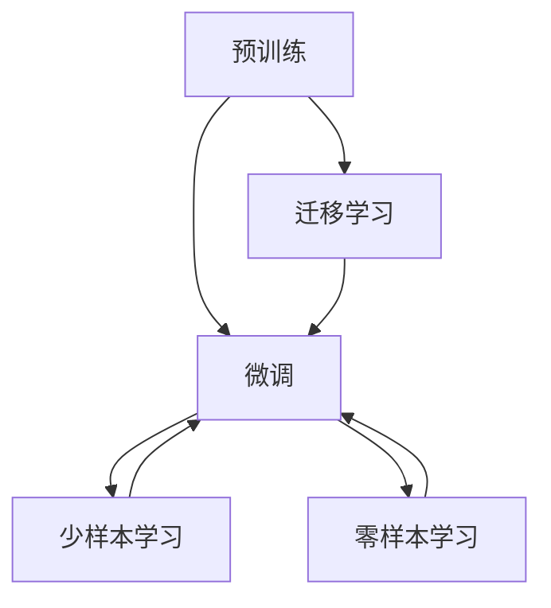

                 

# 预训练与微调的实用技巧

## 1. 背景介绍

在人工智能领域，预训练与微调已经成为深度学习模型发展的两大核心技术。预训练指的是在大规模无标签数据上，利用自监督学习任务训练基础模型，使其具备对复杂任务的高泛化能力；微调则是在预训练模型的基础上，针对特定任务进行有监督的参数调整，提升模型在该任务上的性能。本文将深入探讨预训练与微调的原理、实现技巧和实际应用，并结合当前最前沿的研究成果，提出实用的技巧和建议。

## 2. 核心概念与联系

### 2.1 核心概念概述

预训练与微调过程涉及多个关键概念，主要包括：

- **预训练（Pre-training）**：在大规模无标签数据上，利用自监督任务训练通用基础模型，如BERT、GPT-3等。
- **微调（Fine-tuning）**：在预训练模型的基础上，利用有标签数据进行任务特定参数调整，如分类任务、生成任务等。
- **迁移学习（Transfer Learning）**：将预训练模型应用于不同但相关的任务上，通过微调提升性能。
- **数据增强（Data Augmentation）**：通过数据变换提升训练集多样性，如回译、回文转换等。
- **对抗训练（Adversarial Training）**：引入对抗样本，提高模型鲁棒性。
- **提示学习（Prompt Learning）**：通过精心设计输入文本，引导模型输出期望结果，适用于少样本或零样本学习。

这些概念相互关联，共同构成深度学习模型构建的框架。下图展示了这些核心概念之间的联系：



### 2.2 概念间的关系

预训练和微调是深度学习模型构建的两个重要阶段。预训练为模型提供了基础的表示学习，而微调则针对特定任务进行参数优化，使得模型能够更好地适应具体的应用场景。迁移学习通过在预训练和微调之间建立桥梁，进一步提升模型的泛化能力。数据增强和对抗训练则帮助模型更好地泛化到未知数据。提示学习则通过输入文本的格式化，提升了模型的零样本和少样本学习能力。这些技术共同作用，构建了深度学习模型强大的应用能力。

## 3. 核心算法原理 & 具体操作步骤

### 3.1 算法原理概述

预训练与微调的核心思想是通过大规模无标签数据训练基础模型，然后在特定任务上利用少量有标签数据进行微调，从而提升模型在该任务上的性能。预训练阶段通常采用自监督任务，如语言建模、掩码语言建模等，训练出能够捕捉语言结构的基础模型。微调阶段则通过有标签数据，针对特定任务进行参数调整，使得模型能够输出与任务相关的结果。

### 3.2 算法步骤详解

#### 3.2.1 预训练

1. **选择预训练数据集**：通常使用大规模无标签文本数据，如维基百科、新闻语料库等。
2. **选择预训练模型**：如BERT、GPT-3等，使用自监督任务（如掩码语言建模）进行预训练。
3. **训练预训练模型**：在预训练数据集上进行自监督训练，通常使用Transformer模型结构。

#### 3.2.2 微调

1. **准备有标签数据集**：针对特定任务，准备少量有标签数据。
2. **添加任务适配层**：根据任务类型，在预训练模型顶部添加相应的输出层和损失函数，如分类任务添加线性层和交叉熵损失，生成任务添加解码器。
3. **设置微调超参数**：选择合适的优化器（如AdamW），设置学习率、批大小、迭代轮数等。
4. **执行梯度训练**：利用有标签数据集进行微调，前向传播计算损失，反向传播更新参数。
5. **测试与评估**：在验证集和测试集上评估微调后的模型性能，对比预训练和微调后的效果。

### 3.3 算法优缺点

#### 3.3.1 优点

- **泛化能力**：预训练模型在通用数据上的训练，使其具备强大的泛化能力。
- **低成本**：微调过程不需要从头训练，节省了大量的计算和标注资源。
- **高效**：通过微调，模型能够快速适应特定任务，提升性能。

#### 3.3.2 缺点

- **依赖标注数据**：微调的效果很大程度上取决于标注数据的质量和数量，获取高质量标注数据的成本较高。
- **泛化能力有限**：当目标任务与预训练数据的分布差异较大时，微调的性能提升有限。
- **可能传递偏见**：预训练模型中存在的偏见可能传递到下游任务，影响模型性能。

### 3.4 算法应用领域

预训练与微调技术广泛应用于各种NLP任务，如文本分类、命名实体识别、关系抽取、问答系统、机器翻译、文本摘要等。此外，还应用于语音识别、图像识别、推荐系统等领域，极大地提升了相关任务的性能。

## 4. 数学模型和公式 & 详细讲解

### 4.1 数学模型构建

预训练与微调过程中的数学模型主要包含两部分：预训练模型的损失函数和微调模型的损失函数。

#### 4.1.1 预训练模型

假设有预训练模型 $M_{\theta}$，使用自监督任务进行训练，其损失函数定义为：

$$
\mathcal{L}_{\text{pre}} = -\frac{1}{N} \sum_{i=1}^N \mathbb{E}_{(x,y)} \left[ \ell(M_{\theta}(x), y) \right]
$$

其中 $\ell$ 为自监督任务的损失函数，$(x,y)$ 表示输入和标签，$\mathbb{E}$ 表示期望。

#### 4.1.2 微调模型

假设有微调模型 $M_{\theta_t}$，在微调数据集 $D$ 上进行训练，其损失函数定义为：

$$
\mathcal{L}_{\text{finetune}} = -\frac{1}{N} \sum_{i=1}^N \ell(M_{\theta_t}(x_i), y_i)
$$

其中 $\ell$ 为任务特定损失函数，$(x_i,y_i)$ 表示输入和标签。

### 4.2 公式推导过程

以分类任务为例，假设输入文本为 $x$，标签为 $y$，模型输出为 $M_{\theta}(x)$，则交叉熵损失函数为：

$$
\ell(M_{\theta}(x), y) = -y \log M_{\theta}(x) - (1-y) \log (1-M_{\theta}(x))
$$

将上式带入预训练模型的损失函数中，得：

$$
\mathcal{L}_{\text{pre}} = -\frac{1}{N} \sum_{i=1}^N \mathbb{E}_{(x,y)} \left[ -y \log M_{\theta}(x) - (1-y) \log (1-M_{\theta}(x)) \right]
$$

对于微调模型，其损失函数为：

$$
\mathcal{L}_{\text{finetune}} = -\frac{1}{N} \sum_{i=1}^N \ell(M_{\theta_t}(x_i), y_i)
$$

将上式带入微调模型的损失函数中，得：

$$
\mathcal{L}_{\text{finetune}} = -\frac{1}{N} \sum_{i=1}^N \ell(M_{\theta_t}(x_i), y_i) + \lambda \|\theta_t\|^2
$$

其中 $\|\theta_t\|^2$ 表示微调模型的参数 $\theta_t$ 的平方范数，$\lambda$ 为正则化系数。

### 4.3 案例分析与讲解

以命名实体识别（Named Entity Recognition, NER）为例，展示预训练与微调的具体实现。

1. **数据准备**：准备标注的NER数据集，包含输入文本和对应的标签。
2. **预训练模型**：使用BERT等预训练模型进行训练。
3. **微调模型**：在微调数据集上添加任务适配层，如线性分类器和交叉熵损失，进行微调。
4. **测试与评估**：在验证集和测试集上评估微调后的模型性能，对比预训练和微调后的效果。

## 5. 项目实践：代码实例和详细解释说明

### 5.1 开发环境搭建

1. **安装Python**：选择3.8版本以上，安装Anaconda。
2. **创建虚拟环境**：
```bash
conda create -n pytorch-env python=3.8 
conda activate pytorch-env
```
3. **安装PyTorch**：
```bash
conda install pytorch torchvision torchaudio -c pytorch
```
4. **安装HuggingFace Transformers库**：
```bash
pip install transformers
```

### 5.2 源代码详细实现

以下是一个使用PyTorch和Transformers库实现NER任务的微调示例：

```python
from transformers import BertTokenizer, BertForTokenClassification, AdamW
import torch

# 初始化分词器和模型
tokenizer = BertTokenizer.from_pretrained('bert-base-cased')
model = BertForTokenClassification.from_pretrained('bert-base-cased', num_labels=len(tag2id))

# 微调模型
device = torch.device('cuda') if torch.cuda.is_available() else torch.device('cpu')
model.to(device)

# 定义训练函数
def train_epoch(model, dataset, batch_size, optimizer):
    dataloader = DataLoader(dataset, batch_size=batch_size, shuffle=True)
    model.train()
    epoch_loss = 0
    for batch in dataloader:
        input_ids = batch['input_ids'].to(device)
        attention_mask = batch['attention_mask'].to(device)
        labels = batch['labels'].to(device)
        model.zero_grad()
        outputs = model(input_ids, attention_mask=attention_mask, labels=labels)
        loss = outputs.loss
        epoch_loss += loss.item()
        loss.backward()
        optimizer.step()
    return epoch_loss / len(dataloader)

# 训练模型
epochs = 5
batch_size = 16

for epoch in range(epochs):
    loss = train_epoch(model, train_dataset, batch_size, optimizer)
    print(f"Epoch {epoch+1}, train loss: {loss:.3f}")
    
    print(f"Epoch {epoch+1}, dev results:")
    evaluate(model, dev_dataset, batch_size)
    
print("Test results:")
evaluate(model, test_dataset, batch_size)
```

### 5.3 代码解读与分析

- **数据准备**：分词器 `BertTokenizer` 和模型 `BertForTokenClassification` 使用预训练的 `bert-base-cased` 模型，确保数据一致性。
- **微调模型**：在 GPU 上部署模型，使用 `AdamW` 优化器进行训练。
- **训练函数**：在训练集上进行梯度下降，计算损失并更新参数。
- **测试函数**：在验证集和测试集上进行评估，输出性能指标。

## 6. 实际应用场景

### 6.1 智能客服

智能客服系统利用预训练与微调技术，在无监督数据上进行预训练，使用少量有标签数据进行微调。模型可以自动理解客户意图，并给出最佳答复。

### 6.2 金融舆情监测

金融舆情监测系统通过微调预训练语言模型，实时监测市场舆论动向。模型能够快速识别和分析舆情信息，帮助金融机构及时应对负面影响。

### 6.3 个性化推荐

个性化推荐系统通过微调预训练语言模型，理解用户兴趣，生成个性化推荐内容。在处理用户行为数据时，通过微调模型学习用户语义偏好，提高推荐精度。

### 6.4 未来应用展望

预训练与微调技术将广泛应用于智慧医疗、教育、智慧城市等多个领域。未来，随着预训练模型的不断进化，微调技术也将不断提升，赋予模型更加强大的泛化能力和适应性。

## 7. 工具和资源推荐

### 7.1 学习资源推荐

- **《Transformers从原理到实践》**：深入讲解 Transformers 原理和应用。
- **CS224N《深度学习自然语言处理》**：斯坦福大学课程，涵盖 NLP 基础和前沿技术。
- **《Natural Language Processing with Transformers》**：介绍 Transformers 库的使用。
- **HuggingFace 官方文档**：提供预训练模型和微调样例代码。
- **CLUE 开源项目**：中文 NLP 任务评估基准。

### 7.2 开发工具推荐

- **PyTorch**：灵活的深度学习框架。
- **TensorFlow**：生产部署友好的深度学习框架。
- **Transformers 库**：提供多种预训练模型和微调接口。
- **Weights & Biases**：实验跟踪工具，记录和可视化训练过程。
- **TensorBoard**：可视化工具，监测模型训练状态。
- **Google Colab**：免费 GPU/TPU 资源，方便实验和分享。

### 7.3 相关论文推荐

- **Attention is All You Need**：提出 Transformer 结构，开启预训练大模型时代。
- **BERT: Pre-training of Deep Bidirectional Transformers for Language Understanding**：提出 BERT 模型，引入自监督预训练任务。
- **Language Models are Unsupervised Multitask Learners**：展示大语言模型的零样本学习能力。
- **Parameter-Efficient Transfer Learning for NLP**：提出参数高效微调方法，如 Adapter。
- **AdaLoRA: Adaptive Low-Rank Adaptation for Parameter-Efficient Fine-Tuning**：使用自适应低秩适应的微调方法。
- **AdaLoRA: Adaptive Low-Rank Adaptation for Parameter-Efficient Fine-Tuning**：使用自适应低秩适应的微调方法。

## 8. 总结：未来发展趋势与挑战

### 8.1 研究成果总结

本文详细介绍了预训练与微调的原理和实现技巧，并结合实际应用案例，展示了预训练与微调技术在 NLP 领域的广泛应用。通过预训练和微调，模型在各种 NLP 任务上取得了显著的性能提升，推动了 NLP 技术的发展和产业化进程。

### 8.2 未来发展趋势

未来预训练与微调技术的发展趋势包括：
- **模型规模持续增大**：超大模型的出现，使得模型具备更丰富的语言表示能力。
- **微调方法日趋多样化**：引入更多的参数高效和计算高效的微调方法。
- **持续学习成为常态**：通过增量学习，模型能够不断更新和适应新数据。
- **数据增强和对抗训练**：提升模型泛化能力和鲁棒性。
- **参数高效微调**：通过冻结部分预训练参数，减少过拟合风险。
- **零样本和少样本学习**：通过提示学习，在少量有标签数据下提升模型性能。

### 8.3 面临的挑战

预训练与微调技术在应用中面临以下挑战：
- **标注成本**：获取高质量标注数据的成本较高。
- **模型鲁棒性**：面对未知数据，模型的泛化能力有限。
- **计算资源**：模型参数量大，需要高性能设备支持。
- **可解释性**：模型决策过程缺乏可解释性。
- **安全性**：模型可能学习到有害信息，产生误导性输出。

### 8.4 研究展望

未来的研究方向包括：
- **无监督和半监督微调**：利用自监督学习、主动学习等方法，减少对标注数据的依赖。
- **参数高效和计算高效微调**：开发更加参数和计算高效的微调方法。
- **因果学习和对比学习**：增强模型的因果关系和泛化能力。
- **先验知识整合**：结合符号化知识和逻辑规则，提升模型知识整合能力。
- **伦理和安全约束**：引入伦理导向的评估指标，确保模型安全性。

## 9. 附录：常见问题与解答

**Q1: 预训练和微调有什么区别？**

**A:** 预训练和微调是深度学习模型构建的两个重要阶段。预训练是在大规模无标签数据上，利用自监督任务训练基础模型；微调是在预训练模型的基础上，针对特定任务进行有监督的参数调整。预训练为模型提供了基础的表示学习，而微调则使得模型能够更好地适应特定任务。

**Q2: 如何选择合适的学习率？**

**A:** 微调的学习率一般要比预训练时小1-2个数量级。可以从1e-5开始调参，逐步减小学习率，直至收敛。也可以使用warmup策略，在开始阶段使用较小的学习率，再逐渐过渡到预设值。

**Q3: 微调过程中如何缓解过拟合问题？**

**A:** 过拟合是微调面临的主要挑战。缓解策略包括数据增强、正则化、对抗训练等。数据增强可以通过回译、回文转换等方式扩充训练集。正则化包括L2正则、Dropout等方法，避免过拟合。对抗训练引入对抗样本，提高模型鲁棒性。

**Q4: 微调模型在落地部署时需要注意哪些问题？**

**A:** 在落地部署时，需要考虑模型裁剪、量化加速、服务化封装、弹性伸缩、监控告警等问题。模型裁剪去除不必要的层和参数，减小模型尺寸。量化加速将浮点模型转为定点模型，提高计算效率。服务化封装将模型封装为标准化服务接口，便于集成调用。弹性伸缩根据请求流量动态调整资源配置。监控告警设置异常告警阈值，确保服务稳定性。

**Q5: 如何提高预训练模型的泛化能力？**

**A:** 提高预训练模型的泛化能力可以从以下几个方面入手：
- 选择合适的预训练任务，如掩码语言建模、 masked LM等。
- 使用更大规模的数据进行预训练。
- 引入更多先验知识，如知识图谱、逻辑规则等。
- 结合因果分析和博弈论工具，增强模型的因果关系和泛化能力。

**Q6: 预训练与微调技术的未来发展方向是什么？**

**A:** 预训练与微调技术的未来发展方向包括：
- 无监督和半监督微调：利用自监督学习、主动学习等方法，减少对标注数据的依赖。
- 参数高效和计算高效微调：开发更加参数和计算高效的微调方法。
- 因果学习和对比学习：增强模型的因果关系和泛化能力。
- 先验知识整合：结合符号化知识和逻辑规则，提升模型知识整合能力。
- 伦理和安全约束：引入伦理导向的评估指标，确保模型安全性。

**Q7: 预训练与微调技术在实际应用中如何优化？**

**A:** 预训练与微调技术在实际应用中需要考虑以下几个方面：
- 选择合适的预训练任务和数据集，提高模型的泛化能力。
- 引入更多的先验知识，如知识图谱、逻辑规则等，提升模型的知识整合能力。
- 结合因果分析和博弈论工具，增强模型的因果关系和泛化能力。
- 进行参数高效和计算高效微调，减少过拟合风险，提高模型效率。
- 进行伦理和安全约束，确保模型输出符合人类价值观和伦理道德。

以上内容为我们详细介绍了预训练与微调的原理、实现技巧和实际应用。预训练与微调技术在NLP领域已经取得了显著成果，未来将继续推动NLP技术的发展和应用。

