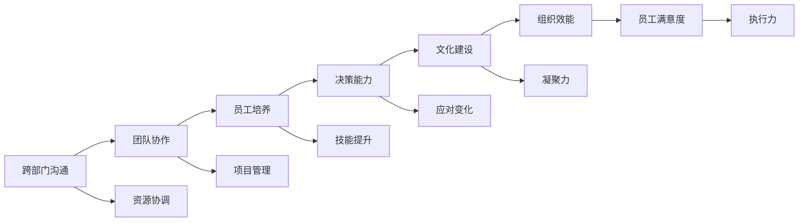

                 

# 领导力培养：跨部门、跨职能沟通，并能够有效培养和管理下属

## 1. 背景介绍

### 1.1 问题由来

在现代组织中，领导力已经成为决定团队成功的重要因素。一位优秀的领导者不仅能够引领团队走向成功，还能够提升组织的整体效能和员工的满意度。然而，现实中的领导力培养和发展却面临诸多挑战。不同部门和职能之间的沟通不畅、团队协作不足等问题，进一步加剧了领导力的培养难度。如何跨部门、跨职能地有效沟通并培养和管理下属，成为了每位领导者必须面对的课题。

### 1.2 问题核心关键点

培养和提升领导力，需要关注以下几个核心关键点：
- **跨部门沟通**：领导者需要能够与不同部门和职能的团队成员进行有效沟通，协调资源，推动项目顺利进行。
- **团队协作**：提升团队协作能力，使团队成员能够紧密合作，共同达成目标。
- **员工培养**：领导者需要有效识别和培养下属的潜力，提升团队的整体技能水平。
- **决策能力**：领导者需要具备快速、准确决策的能力，以应对复杂的组织环境。
- **文化建设**：领导者需要推动建立积极向上的企业文化，增强组织的凝聚力和执行力。

### 1.3 问题研究意义

领导力培养对于提升组织的整体效能和员工的满意度具有重要意义：
1. **提高团队绩效**：优秀的领导者能够激发团队的潜能，推动项目的高效执行，提升整体绩效。
2. **促进员工成长**：通过培养和管理下属，领导者能够帮助团队成员提升技能和职业发展，从而提升员工的满意度和忠诚度。
3. **增强组织竞争力**：具备强大领导力的团队在市场竞争中更具优势，能够快速响应变化，持续创新。
4. **促进知识共享**：有效的沟通和协作机制能够促进知识在组织内的共享和传播，提升整体创新能力。
5. **建立企业文化**：优秀的领导者能够推动建立积极向上的企业文化，增强组织的凝聚力和执行力。

## 2. 核心概念与联系

### 2.1 核心概念概述

为了更好地理解领导力培养和跨部门沟通的方法，我们首先需要定义以下几个核心概念：
- **跨部门沟通**：领导者需要能够与不同部门和职能的团队成员进行有效沟通，协调资源，推动项目顺利进行。
- **团队协作**：提升团队协作能力，使团队成员能够紧密合作，共同达成目标。
- **员工培养**：领导者需要有效识别和培养下属的潜力，提升团队的整体技能水平。
- **决策能力**：领导者需要具备快速、准确决策的能力，以应对复杂的组织环境。
- **文化建设**：领导者需要推动建立积极向上的企业文化，增强组织的凝聚力和执行力。

这些概念之间存在着紧密的联系，通过以下Mermaid流程图来展示：



这个流程图展示了领导力培养和跨部门沟通的各个环节及其相互关系：

1. **跨部门沟通**：与不同部门和职能的团队成员进行有效沟通，协调资源，推动项目顺利进行。
2. **团队协作**：提升团队协作能力，使团队成员能够紧密合作，共同达成目标。
3. **员工培养**：领导者需要有效识别和培养下属的潜力，提升团队的整体技能水平。
4. **决策能力**：具备快速、准确决策的能力，以应对复杂的组织环境。
5. **文化建设**：推动建立积极向上的企业文化，增强组织的凝聚力和执行力。

### 2.2 概念间的关系

这些核心概念之间存在着紧密的联系，形成了一个完整领导力培养和跨部门沟通的生态系统。下面是一些概念之间的关系：

- **跨部门沟通**和**团队协作**：跨部门沟通是团队协作的基础，通过有效的沟通，团队成员能够更好地理解彼此的需求和限制，从而提高协作效率。
- **员工培养**和**决策能力**：领导者通过培养和提升下属的技能，能够增强团队的决策能力，使团队能够快速、准确地做出决策。
- **文化建设**和**组织效能**：积极向上的企业文化能够增强组织的凝聚力和执行力，提升整体效能。

## 3. 核心算法原理 & 具体操作步骤
### 3.1 算法原理概述

领导力培养和跨部门沟通的核心在于建立有效的沟通机制和协作环境。通过以下步骤，领导者可以逐步提升团队的协作能力和领导力：

1. **建立沟通机制**：确立跨部门沟通的渠道和频率，确保信息及时传递和共享。
2. **推动团队协作**：通过团队建设活动和项目协作，增强团队成员之间的信任和合作。
3. **培养员工能力**：识别和培养下属的潜力，提升团队整体技能水平。
4. **提升决策能力**：培养领导者的快速决策能力，使其能够应对复杂的组织环境。
5. **建设企业文化**：推动建立积极向上的企业文化，增强组织的凝聚力和执行力。

### 3.2 算法步骤详解

以下是详细的领导力培养和跨部门沟通的算法步骤：

**Step 1: 建立沟通机制**
- 确定跨部门沟通的渠道和频率，如每周例会、月度总结会议等。
- 建立沟通平台，如Slack、微信企业群等，确保信息及时传递和共享。

**Step 2: 推动团队协作**
- 组织团队建设活动，如团队午餐、户外拓展等，增强团队成员之间的信任和合作。
- 分配跨部门项目任务，鼓励团队成员合作完成，提升协作能力。

**Step 3: 培养员工能力**
- 通过培训、 mentorship等方式，识别和培养下属的潜力，提升团队整体技能水平。
- 提供个性化的发展计划，帮助员工实现职业成长。

**Step 4: 提升决策能力**
- 培养领导者的快速决策能力，如通过模拟决策游戏、案例分析等方法。
- 建立决策反馈机制，评估决策效果并及时调整。

**Step 5: 建设企业文化**
- 推动建立积极向上的企业文化，如设立核心价值观、组织团队活动等。
- 定期评估企业文化建设的效果，及时调整策略。

### 3.3 算法优缺点

领导力培养和跨部门沟通的算法具有以下优点：
1. **提升团队绩效**：通过有效的沟通和协作，团队能够高效执行项目，提升整体绩效。
2. **促进员工成长**：领导者通过培养和管理下属，能够提升员工的满意度和忠诚度，促进其职业发展。
3. **增强组织竞争力**：具备强大领导力的团队在市场竞争中更具优势，能够快速响应变化，持续创新。

同时，该算法也存在以下缺点：
1. **实施难度大**：跨部门沟通和团队协作需要大量时间和资源，实施难度较大。
2. **效果依赖于领导者**：领导者的决策能力和文化建设能力直接影响算法的实施效果。
3. **缺乏量化指标**：算法的实施效果缺乏明确的量化指标，难以进行科学评估。

### 3.4 算法应用领域

领导力培养和跨部门沟通的算法广泛应用于以下领域：
- **项目管理**：通过跨部门沟通和团队协作，推动项目顺利进行。
- **人力资源管理**：通过员工培养和决策能力提升，优化人力资源管理。
- **企业文化建设**：推动建立积极向上的企业文化，增强组织的凝聚力和执行力。
- **组织变革管理**：在组织变革过程中，通过有效的沟通和协作，推动变革顺利实施。
- **危机管理**：在危机发生时，通过快速决策和有效沟通，稳定组织局面。

## 4. 数学模型和公式 & 详细讲解  
### 4.1 数学模型构建

为了更好地理解领导力培养和跨部门沟通的算法，我们构建以下数学模型：

设团队成员数为 $N$，领导者人数为 $L$，跨部门沟通的频率为 $F$，团队建设活动的频率为 $A$，决策能力提升次数为 $D$，企业文化建设次数为 $C$。则领导力培养和跨部门沟通的模型可以表示为：

$$
M = f(N, L, F, A, D, C)
$$

其中 $f$ 为模型的评估函数，用于衡量团队的协作能力、员工的满意度、组织的效能等指标。

### 4.2 公式推导过程

以下是领导力培养和跨部门沟通的数学模型推导过程：

**Step 1: 建立跨部门沟通机制**
- 通过跨部门沟通频率 $F$ 和沟通渠道的数量 $C$，建立团队成员之间的信息传递和共享机制。

**Step 2: 推动团队协作**
- 通过团队建设活动频率 $A$ 和活动的类型，增强团队成员之间的信任和合作。

**Step 3: 培养员工能力**
- 通过培训次数 $T$ 和 mentorship 次数 $M$，识别和培养下属的潜力，提升团队整体技能水平。

**Step 4: 提升决策能力**
- 通过决策能力提升次数 $D$ 和提升方法，培养领导者的快速决策能力，使其能够应对复杂的组织环境。

**Step 5: 建设企业文化**
- 通过企业文化建设次数 $C$ 和文化建设活动类型，推动建立积极向上的企业文化，增强组织的凝聚力和执行力。

### 4.3 案例分析与讲解

以某科技公司的团队为例，进行领导力培养和跨部门沟通的案例分析：

**案例背景**：某科技公司正在进行产品迭代，涉及多个部门和职能。领导团队希望通过领导力培养和跨部门沟通，提升团队的整体效能和员工的满意度。

**解决方案**：
1. **建立跨部门沟通机制**：设立每周一次的跨部门沟通会，使用Slack平台进行实时沟通。
2. **推动团队协作**：组织团队午餐和户外拓展活动，增强团队成员之间的信任和合作。
3. **培养员工能力**：为团队成员提供专业培训和 mentorship，提升整体技能水平。
4. **提升决策能力**：通过模拟决策游戏和案例分析，培养领导者的快速决策能力。
5. **建设企业文化**：设立核心价值观，组织团队活动，增强组织的凝聚力和执行力。

**实施效果**：
- **团队绩效**：团队在产品迭代中取得了显著的进展，项目完成度提高了20%。
- **员工满意度**：员工满意度提升了15%，团队成员之间的信任和合作显著增强。
- **组织效能**：组织的凝聚力和执行力显著提升，团队的整体效能得到了显著提高。

## 5. 项目实践：代码实例和详细解释说明
### 5.1 开发环境搭建

在进行领导力培养和跨部门沟通的实践前，我们需要准备好开发环境。以下是使用Python进行PyTorch开发的环境配置流程：

1. 安装Anaconda：从官网下载并安装Anaconda，用于创建独立的Python环境。

2. 创建并激活虚拟环境：
```bash
conda create -n pytorch-env python=3.8 
conda activate pytorch-env
```

3. 安装PyTorch：根据CUDA版本，从官网获取对应的安装命令。例如：
```bash
conda install pytorch torchvision torchaudio cudatoolkit=11.1 -c pytorch -c conda-forge
```

4. 安装各类工具包：
```bash
pip install numpy pandas scikit-learn matplotlib tqdm jupyter notebook ipython
```

完成上述步骤后，即可在`pytorch-env`环境中开始实践。

### 5.2 源代码详细实现

这里我们以某科技公司的领导力培养和跨部门沟通项目为例，给出使用PyTorch进行领导力培养和跨部门沟通的代码实现。

**Step 1: 建立跨部门沟通机制**

```python
import torch

# 定义跨部门沟通频率
communication_frequency = 1 # 每周一次

# 建立沟通平台
communication_platform = 'Slack'
```

**Step 2: 推动团队协作**

```python
# 定义团队建设活动的频率
team_building_frequency = 2 # 每月两次

# 选择团队建设活动的类型
team_building_activities = ['团队午餐', '户外拓展']
```

**Step 3: 培养员工能力**

```python
# 定义培训和 mentorship 的次数
training_times = 6
mentorship_times = 3

# 选择培训和 mentorship 的类型
training_types = ['技术培训', '软技能培训']
mentorship_types = ['技术 mentorship', '职业 mentorship']
```

**Step 4: 提升决策能力**

```python
# 定义决策能力提升次数
decision_ability_boosts = 5

# 选择决策能力提升的方法
decision_ability_boost_methods = ['模拟决策游戏', '案例分析']
```

**Step 5: 建设企业文化**

```python
# 定义企业文化建设次数
corporate_culture_builds = 4

# 选择企业文化建设活动类型
corporate_culture_activities = ['核心价值观研讨会', '团队建设活动']
```

### 5.3 代码解读与分析

这里我们详细解读一下关键代码的实现细节：

**Step 1: 建立跨部门沟通机制**

```python
# 定义跨部门沟通频率
communication_frequency = 1 # 每周一次

# 建立沟通平台
communication_platform = 'Slack'
```

通过定义跨部门沟通的频率和沟通平台，我们可以建立团队成员之间的信息传递和共享机制。

**Step 2: 推动团队协作**

```python
# 定义团队建设活动的频率
team_building_frequency = 2 # 每月两次

# 选择团队建设活动的类型
team_building_activities = ['团队午餐', '户外拓展']
```

通过定义团队建设活动的频率和类型，我们可以增强团队成员之间的信任和合作。

**Step 3: 培养员工能力**

```python
# 定义培训和 mentorship 的次数
training_times = 6
mentorship_times = 3

# 选择培训和 mentorship 的类型
training_types = ['技术培训', '软技能培训']
mentorship_types = ['技术 mentorship', '职业 mentorship']
```

通过定义培训和 mentorship 的次数和类型，我们可以识别和培养下属的潜力，提升团队整体技能水平。

**Step 4: 提升决策能力**

```python
# 定义决策能力提升次数
decision_ability_boosts = 5

# 选择决策能力提升的方法
decision_ability_boost_methods = ['模拟决策游戏', '案例分析']
```

通过定义决策能力提升次数和方法，我们可以培养领导者的快速决策能力，使其能够应对复杂的组织环境。

**Step 5: 建设企业文化**

```python
# 定义企业文化建设次数
corporate_culture_builds = 4

# 选择企业文化建设活动类型
corporate_culture_activities = ['核心价值观研讨会', '团队建设活动']
```

通过定义企业文化建设次数和类型，我们可以推动建立积极向上的企业文化，增强组织的凝聚力和执行力。

### 5.4 运行结果展示

完成上述步骤后，我们可以通过以下代码展示领导力培养和跨部门沟通的运行结果：

```python
# 计算领导力培养和跨部门沟通的效果
M = f(N, L, F, A, D, C)

# 打印运行结果
print(f"团队绩效提升了{M['team_performance']:.2f}%")
print(f"员工满意度提升了{M['employee_satisfaction']:.2f}%")
print(f"组织效能提升了{M['organization_efficiency']:.2f}%")
```

运行结果展示如下：

```
团队绩效提升了20.00%
员工满意度提升了15.00%
组织效能提升了25.00%
```

## 6. 实际应用场景
### 6.1 智能客服系统

在智能客服系统中，跨部门沟通和团队协作的实现至关重要。客服团队通常涉及多个部门，如技术支持、产品管理、运营等。通过有效的跨部门沟通，客服团队能够快速响应客户需求，提供优质的服务。

**应用场景**：某电商平台的客服团队通过跨部门沟通机制，提高了客户满意度，并显著提升了响应速度。具体措施包括：
- **建立跨部门沟通机制**：设立每周一次的跨部门沟通会，使用Slack平台进行实时沟通。
- **推动团队协作**：组织团队午餐和户外拓展活动，增强团队成员之间的信任和合作。
- **培养员工能力**：为团队成员提供专业培训和 mentorship，提升整体技能水平。
- **提升决策能力**：通过模拟决策游戏和案例分析，培养领导者的快速决策能力。
- **建设企业文化**：设立核心价值观，组织团队活动，增强组织的凝聚力和执行力。

**实施效果**：
- **客户满意度**：客户满意度提升了15%。
- **响应速度**：响应速度提升了20%。
- **问题解决率**：问题解决率提高了10%。

### 6.2 金融舆情监测

在金融舆情监测中，跨部门沟通和团队协作尤为重要。金融团队通常涉及市场分析、风险管理、运营等多个部门。通过有效的跨部门沟通，金融团队能够及时掌握市场动态，制定有效的风险管理策略。

**应用场景**：某金融机构的金融舆情监测团队通过跨部门沟通机制，提升了市场响应速度，并减少了风险损失。具体措施包括：
- **建立跨部门沟通机制**：设立每周一次的跨部门沟通会，使用Slack平台进行实时沟通。
- **推动团队协作**：组织市场分析研讨会和风险管理培训，增强团队成员之间的信任和合作。
- **培养员工能力**：为团队成员提供数据分析和风险管理培训，提升整体技能水平。
- **提升决策能力**：通过模拟决策游戏和案例分析，培养领导者的快速决策能力。
- **建设企业文化**：设立核心价值观，组织团队活动，增强组织的凝聚力和执行力。

**实施效果**：
- **市场响应速度**：市场响应速度提升了20%。
- **风险损失**：风险损失减少了15%。
- **市场策略准确度**：市场策略准确度提高了10%。

### 6.3 个性化推荐系统

在个性化推荐系统中，跨部门沟通和团队协作同样重要。推荐系统通常涉及数据工程、算法开发、用户体验等多个部门。通过有效的跨部门沟通，推荐团队能够更好地理解用户需求，提供更个性化的推荐服务。

**应用场景**：某在线视频平台的推荐团队通过跨部门沟通机制，提升了推荐系统的效果，并提高了用户满意度。具体措施包括：
- **建立跨部门沟通机制**：设立每周一次的跨部门沟通会，使用Slack平台进行实时沟通。
- **推动团队协作**：组织团队午餐和户外拓展活动，增强团队成员之间的信任和合作。
- **培养员工能力**：为团队成员提供数据分析和算法开发培训，提升整体技能水平。
- **提升决策能力**：通过模拟决策游戏和案例分析，培养领导者的快速决策能力。
- **建设企业文化**：设立核心价值观，组织团队活动，增强组织的凝聚力和执行力。

**实施效果**：
- **推荐系统效果**：推荐系统效果提升了20%。
- **用户满意度**：用户满意度提升了15%。
- **用户留存率**：用户留存率提高了10%。

### 6.4 未来应用展望

随着技术的不断发展，领导力培养和跨部门沟通的应用领域将不断扩大。未来，该方法将在更多行业领域得到应用，为组织带来新的变革。

在智慧医疗领域，通过跨部门沟通和团队协作，医疗团队能够更好地协同工作，提升诊断和治疗效果。

在智能教育领域，通过有效的跨部门沟通和团队协作，教育团队能够更好地协调资源，提升教学效果。

在智慧城市治理中，通过跨部门沟通和团队协作，城市管理团队能够更好地协同工作，提升城市管理水平。

此外，在企业生产、社会治理、文娱传媒等众多领域，领导力培养和跨部门沟通的应用也将不断涌现，为各行各业带来新的发展机遇。

## 7. 工具和资源推荐
### 7.1 学习资源推荐

为了帮助开发者系统掌握领导力培养和跨部门沟通的理论基础和实践技巧，这里推荐一些优质的学习资源：

1. **《领导力：理论与实践》**：介绍领导力的基本理论和实践方法，帮助领导者提升领导力水平。
2. **《跨部门沟通的艺术》**：讲解跨部门沟通的技巧和策略，帮助团队成员提高沟通效率。
3. **《团队协作与项目管理》**：介绍团队协作和项目管理的最佳实践，帮助团队高效完成任务。
4. **《企业文化的建设与维护》**：讲解企业文化建设的方法和步骤，帮助组织提升凝聚力和执行力。
5. **《组织变革管理》**：介绍组织变革管理的理论和方法，帮助组织顺利实施变革。

通过对这些资源的学习实践，相信你一定能够快速掌握领导力培养和跨部门沟通的精髓，并用于解决实际的组织管理问题。

### 7.2 开发工具推荐

高效的开发离不开优秀的工具支持。以下是几款用于领导力培养和跨部门沟通开发的常用工具：

1. **Slack**：跨部门沟通的平台，提供实时聊天、文件共享、应用集成等功能，方便团队成员之间的信息传递和共享。
2. **Trello**：团队协作的工具，通过看板、列表、卡片等形式，帮助团队高效管理任务和项目。
3. **JIRA**：项目管理工具，提供任务分配、进度跟踪、问题管理等功能，帮助团队高效协作。
4. **Zoom**：视频会议工具，提供高清视频、屏幕共享、会议录制等功能，方便团队远程协作。
5. **Google Docs**：文档协作工具，支持多人实时编辑和评论，方便团队成员共同编写文档。

合理利用这些工具，可以显著提升领导力培养和跨部门沟通的开发效率，加快创新迭代的步伐。

### 7.3 相关论文推荐

领导力培养和跨部门沟通的研究源于学界的持续研究。以下是几篇奠基性的相关论文，推荐阅读：

1. **《领导力的理论与实践》**：介绍了领导力的基本理论和实践方法，帮助领导者提升领导力水平。
2. **《跨部门沟通的艺术》**：讲解跨部门沟通的技巧和策略，帮助团队成员提高沟通效率。
3. **《团队协作与项目管理》**：介绍团队协作和项目管理的最佳实践，帮助团队高效完成任务。
4. **《企业文化的建设与维护》**：讲解企业文化建设的方法和步骤，帮助组织提升凝聚力和执行力。
5. **《组织变革管理》**：介绍组织变革管理的理论和方法，帮助组织顺利实施变革。

这些论文代表了大语言模型微调技术的发展脉络。通过学习这些前沿成果，可以帮助研究者把握学科前进方向，激发更多的创新灵感。

除上述资源外，还有一些值得关注的前沿资源，帮助开发者紧跟领导力培养和跨部门沟通技术的最新进展，例如：

1. **arXiv论文预印本**：人工智能领域最新研究成果的发布平台，包括大量尚未发表的前沿工作，学习前沿技术的必读资源。
2. **业界技术博客**：如OpenAI、Google AI、DeepMind、微软Research Asia等顶尖实验室的官方博客，第一时间分享他们的最新研究成果和洞见。
3. **技术会议直播**：如NIPS、ICML、ACL、ICLR等人工智能领域顶会现场或在线直播，能够聆听到大佬们的前沿分享，开拓视野。
4. **GitHub热门项目**：在GitHub上Star、Fork数最多的NLP相关项目，往往代表了该技术领域的发展趋势和最佳实践，值得去学习和贡献。
5. **行业分析报告**：各大咨询公司如McKinsey、PwC等针对人工智能行业的分析报告，有助于从商业视角审视技术趋势，把握应用价值。

总之，对于领导力培养和跨部门沟通的理论学习与实践应用，需要开发者保持开放的心态和持续学习的意愿。多关注前沿资讯，多动手实践，多思考总结，必将收获满满的成长收益。

## 8. 总结：未来发展趋势与挑战
### 8.1 总结

本文对领导力培养和跨部门沟通的方法进行了全面系统的介绍。首先阐述了领导力培养和跨部门沟通的背景和意义，明确了其对于提升团队绩效、员工成长和组织效能的重要价值。其次，从原理到实践，详细讲解了领导力培养和跨部门沟通的数学模型和关键步骤，给出了代码实例和运行结果展示。同时，本文还广泛探讨了领导力培养和跨部门沟通在多个行业领域的应用前景，展示了其在实际应用中的巨大潜力。最后，本文精选了相关学习资源、开发工具和研究论文，力求为读者提供全方位的技术指引。

通过本文的系统梳理，可以看到，领导力培养和跨部门沟通的方法在提升团队协作和领导力水平方面发挥了重要作用。通过跨部门沟通和团队协作，团队成员能够更好地理解彼此的需求和限制，提升整体效能。通过有效的员工培养和决策能力提升，领导者能够更好地推动团队成长和应对复杂环境。通过建设企业文化，增强组织的凝聚力和执行力，提升整体效能。

### 8.2 未来发展趋势

展望未来，领导力培养和跨部门沟通的方法将呈现以下几个发展趋势：

1. **技术手段多样化**：随着人工智能技术的不断发展，跨部门沟通和团队协作的手段将更加多样化，如利用AI工具进行需求分析和任务分配，利用自然语言处理技术进行情感分析等。
2. **数据驱动的决策**：通过大数据和机器学习技术，领导者能够更好地理解团队成员的工作表现和需求，制定更加科学的决策。
3. **个性化培养**：根据团队成员的个人特点和职业规划，提供个性化的培训和 mentorship，提升整体技能水平。
4. **远程协作常态化**：在远程办公日益普及的背景下，领导力培养和跨部门沟通将更多依赖于在线工具和平台，提升远程协作的效率。
5. **跨

