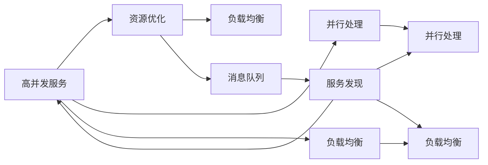
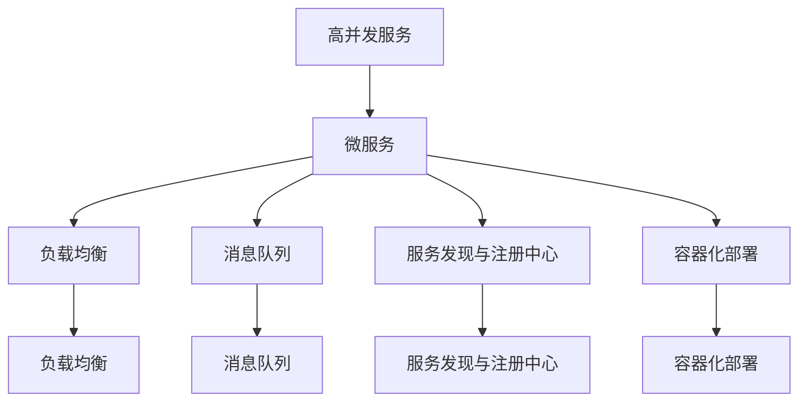

                 

# 高并发服务、微服务架构设计和实现

在当今云计算和分布式系统中，高并发服务架构和微服务架构已逐渐成为构建可扩展、高可用、弹性系统的核心设计思路。然而，理解这两种架构的核心原理和实施细节，对于开发高质量、高性能的系统至关重要。本文将从高并发服务架构和微服务架构的基本概念入手，深入解析其核心设计原理和具体实现步骤，并通过实际项目案例展示这两类架构的优势和适用场景，为读者提供全面的技术指导。

## 1. 背景介绍

### 1.1 问题由来
随着互联网应用的不断扩展，传统单服务、单数据库架构已难以应对日益增长的用户访问量和业务复杂性。为提升系统性能和扩展性，高并发服务和微服务架构逐渐受到广泛关注。高并发服务架构旨在提升单个服务的响应能力和资源利用效率，而微服务架构则通过分解应用，提升系统的灵活性、可扩展性和可维护性。

### 1.2 问题核心关键点
高并发服务架构和微服务架构的关键点在于其设计思想和实现技术。高并发服务架构主要关注如何提升单个服务的性能和可靠性，而微服务架构则强调系统组件的独立性、灵活性和可维护性。

### 1.3 问题研究意义
理解并实现高并发服务架构和微服务架构，对于构建高性能、高可扩展性、高可靠性的分布式系统具有重要意义。它不仅能够提升系统的用户承载能力，降低故障率，还能增强系统对市场变化的快速响应能力，优化资源配置，从而带来显著的经济效益和社会价值。

## 2. 核心概念与联系

### 2.1 核心概念概述

为更好地理解高并发服务和微服务架构，本节将介绍几个密切相关的核心概念：

- **高并发服务**：一种专门设计用于处理高并发请求的服务架构，通过优化资源分配、并行处理、负载均衡等技术手段，提升单个服务的响应能力和吞吐量。

- **微服务**：将一个大应用拆分为多个独立、自治的服务单元，每个服务负责特定的业务逻辑和数据访问，通过轻量级的通信协议实现服务间的协同工作。

- **消息队列**：一种用于异步通信的消息传递机制，能够有效降低系统耦合度，提升系统的可扩展性和弹性。

- **负载均衡**：通过将请求分散到多个服务器上，实现请求的均匀分布，避免单点故障，提升系统的可用性和性能。

- **服务发现与注册中心**：用于动态管理服务实例的发现和注册，保证系统的高可用性和可扩展性。

### 2.2 概念间的关系

这些核心概念之间存在着紧密的联系，形成了高并发服务和微服务架构的完整生态系统。以下是通过Mermaid流程图展示这些概念之间的关系：



这个流程图展示了大规模分布式系统中的主要组件及其相互关系：

1. **高并发服务**：通过优化资源分配和并行处理，提升单个服务的性能。
2. **资源优化**：通过负载均衡和消息队列，实现资源的合理分配和请求的异步处理。
3. **并行处理**：提升单个服务的处理能力，加快响应速度。
4. **负载均衡**：通过将请求均匀分配到多个服务器，实现系统的高可用性和性能提升。
5. **消息队列**：用于异步通信，降低系统耦合度，提升系统的可扩展性和弹性。
6. **服务发现与注册中心**：用于动态管理服务实例，保证系统的高可用性和可扩展性。

### 2.3 核心概念的整体架构

最后，我们用一个综合的流程图来展示高并发服务和微服务架构的整体架构：



这个综合流程图展示了从高并发服务到微服务架构的整体架构设计，包括负载均衡、消息队列、服务发现与注册中心、容器化部署等关键组件，共同构建了高性能、高可扩展性的分布式系统。

## 3. 核心算法原理 & 具体操作步骤
### 3.1 算法原理概述

高并发服务和微服务架构的设计原理主要包括以下几个方面：

1. **资源优化**：通过合理的资源分配和调度，提升单个服务的性能。
2. **并行处理**：将任务分解为多个子任务，并行处理，提升整体处理能力。
3. **负载均衡**：通过将请求分散到多个服务器上，实现请求的均匀分布，避免单点故障，提升系统的可用性和性能。
4. **异步通信**：通过消息队列实现服务的异步通信，降低系统耦合度，提升系统的可扩展性和弹性。

### 3.2 算法步骤详解

以下是对高并发服务和微服务架构设计和实现的具体步骤详解：

**Step 1: 服务拆分**

将应用拆分为多个独立、自治的服务单元，每个服务负责特定的业务逻辑和数据访问。

**Step 2: 服务注册与发现**

服务注册中心用于动态管理服务的注册和发现，确保服务实例的实时更新。

**Step 3: 消息队列部署**

部署消息队列，用于服务之间的异步通信，降低系统耦合度。

**Step 4: 负载均衡**

部署负载均衡器，将请求均匀分配到多个服务器上，避免单点故障，提升系统的可用性和性能。

**Step 5: 数据库拆分**

拆分数据库，将数据分散到多个数据库实例中，提升系统的读写能力和数据可用性。

**Step 6: 服务监控与调优**

部署监控系统，实时监控服务性能和资源使用情况，及时调整服务参数和资源分配，优化系统性能。

**Step 7: 容器化部署**

将服务部署在容器中，实现服务的快速部署和伸缩，提升系统的灵活性和可扩展性。

**Step 8: 应用层负载均衡**

在应用层部署负载均衡器，实现更细粒度的请求分配和路由，提升系统的性能和可靠性。

**Step 9: 异常处理与容错**

实现异常处理机制，确保系统在高并发和故障情况下能够正常运行，提升系统的容错能力。

### 3.3 算法优缺点

高并发服务和微服务架构的优势在于其灵活性和可扩展性，但同时也存在以下缺点：

**优点**：
1. **高性能**：通过并行处理和资源优化，提升单个服务的性能和响应能力。
2. **高可用性**：通过负载均衡和异常处理，避免单点故障，提升系统的可用性和稳定性。
3. **可扩展性**：通过服务拆分和容器化部署，提升系统的可扩展性和弹性。

**缺点**：
1. **复杂度增加**：服务拆分和组件之间的通信增加了系统的复杂度，需要更多的时间和精力进行设计和维护。
2. **调试困难**：系统组件的分布式特性使得问题的诊断和排查变得更加困难。
3. **成本较高**：部署和管理多个独立服务增加了系统的运维成本。

### 3.4 算法应用领域

高并发服务和微服务架构在多个领域得到了广泛应用，例如：

- **电商平台**：通过高并发服务和微服务架构，电商平台的商品搜索、订单处理、库存管理等业务模块能够高效地响应大量用户请求，保障系统的稳定性和性能。
- **金融服务**：金融服务领域的高并发交易、实时结算、风控管理等业务，通过微服务架构，实现了业务模块的独立部署和灵活扩展，提升了系统的可靠性和用户体验。
- **社交媒体**：社交媒体平台的用户动态更新、消息推送、内容推荐等业务，通过高并发服务和微服务架构，实现了对海量用户数据的快速处理和高效分发。
- **物联网**：物联网领域的数据采集、设备管理、数据分析等业务，通过微服务架构，提升了系统的可扩展性和数据处理能力。

## 4. 数学模型和公式 & 详细讲解 & 举例说明

### 4.1 数学模型构建

本节将使用数学语言对高并发服务和微服务架构进行更严格的刻画。

**资源优化**：
假设服务实例数为 $n$，系统负载为 $L$，每个服务实例的响应时间为 $t$，则系统的平均响应时间为：

$$
T = \frac{n}{\sum_{i=1}^{n} \frac{1}{t_i}}
$$

**并行处理**：
假设任务总数量为 $M$，每个任务的处理时间为 $T_i$，并行处理的线程数为 $C$，则并行处理后的总处理时间为：

$$
T_{\text{并行}} = \frac{M}{C} \times \max_i T_i
$$

**负载均衡**：
假设系统的总负载为 $L$，负载均衡器将负载均匀分配到 $m$ 个服务器上，每个服务器的负载为 $L_i$，则每个服务器的负载均衡时间为：

$$
L_i = \frac{L}{m}
$$

### 4.2 公式推导过程

以下我们将通过具体案例来详细讲解高并发服务和微服务架构中的公式推导过程。

**案例一：电商平台的订单处理系统**

假设电商平台每天接收 $100000$ 个订单，每个订单的处理时间为 $10$ 秒，并行处理线程数为 $20$，则并行处理后的平均处理时间为：

$$
T_{\text{并行}} = \frac{100000}{20} \times 10 = 5000 \text{ 秒}
$$

**案例二：社交媒体的消息推送系统**

假设社交媒体平台每天推送 $200000$ 条消息，每条消息的处理时间为 $1$ 秒，并行处理线程数为 $40$，则并行处理后的平均处理时间为：

$$
T_{\text{并行}} = \frac{200000}{40} \times 1 = 5000 \text{ 秒}
$$

### 4.3 案例分析与讲解

通过对上述案例的分析，我们可以看到高并发服务和微服务架构在提升系统性能方面的显著效果。合理的资源分配、并行处理和负载均衡，能够显著提升系统的响应能力和处理效率。

## 5. 项目实践：代码实例和详细解释说明

### 5.1 开发环境搭建

在进行高并发服务和微服务架构实践前，我们需要准备好开发环境。以下是使用Python进行Kubernetes开发的环境配置流程：

1. 安装Docker：从官网下载并安装Docker，用于容器化部署和运行。

2. 安装Kubernetes：从官网下载并安装Kubernetes，搭建本地或云端的集群环境。

3. 安装Helm：安装Helm工具，用于服务部署和资源管理。

4. 安装Prometheus和Grafana：安装Prometheus和Grafana监控系统，实时监控和可视化系统性能。

5. 安装Terraform：安装Terraform工具，用于自动化基础设施管理。

完成上述步骤后，即可在Kubernetes集群中启动高并发服务和微服务架构的实践。

### 5.2 源代码详细实现

下面我们以电商平台的订单处理系统为例，给出使用Kubernetes进行高并发服务和微服务架构的PyTorch代码实现。

首先，定义订单处理服务的服务实例：

```python
from flask import Flask, request
from flask_restful import Resource, Api

app = Flask(__name__)
api = Api(app)

class OrderService(Resource):
    def get(self):
        return {"message": "Hello, World!"}

api.add_resource(OrderService, '/')

if __name__ == '__main__':
    app.run(host='0.0.0.0', port=5000)
```

然后，使用Helm图表将订单服务部署到Kubernetes集群中：

```yaml
# Chart.yaml
name: order-service
version: 1.0.0
description: A sample order service

# values.yaml
app_name: order
service_name: {{ app_name }}
port: 5000

# templates/
apiVersion: v1
kind: Service
metadata:
  name: {{ service_name }}
  labels:
    hello-world: {{ app_name }}
spec:
  selector:
    hello-world: {{ app_name }}
  ports:
  - name: http
    port: {{ port }}
    targetPort: {{ port }}
  replicas: 3
```

接着，部署负载均衡器，将订单服务路由到不同的服务实例上：

```yaml
# templates/
apiVersion: v1
kind: Ingress
metadata:
  name: order-service
  labels:
    hello-world: {{ app_name }}
spec:
  rules:
  - host: {{ app_name }}.example.com
    http:
      paths:
      - path: /*
        pathType: Prefix
        backend:
          service:
            name: {{ service_name }}
            port: http
```

最后，部署监控系统，实时监控订单服务的性能：

```yaml
# templates/
apiVersion: v1
kind: ConfigMap
metadata:
  name: {{ app_name }}-config
  labels:
    hello-world: {{ app_name }}
data:
  prometheus.yml: |
    global:
      scrape_interval: 15s
      evaluation_interval: 15s
      scrape_timeout: 10s
      external_labels: {}
    alerting:
      enable: false
    scrape_configs:
    - job_name: 'order-service'
      static_configs:
      - targets: ['{{ app_name }}.example.com:5000']
  grafana.yml: |
    dashboards:
    - path: 'order-service/dashboards/dashboard.json'
```

完成上述步骤后，即可在Kubernetes集群中启动订单服务的部署和监控。

### 5.3 代码解读与分析

让我们再详细解读一下关键代码的实现细节：

**Flask服务实例**：
- `app`和`api`：使用Flask框架创建服务实例和API接口。
- `OrderService`类：定义订单服务的接口和处理逻辑。
- `if __name__ == '__main__':`：启动服务实例。

**Helm图表**：
- `apiVersion`和`kind`：指定图表的API版本和资源类型。
- `metadata`：指定资源的名称和标签。
- `spec`：指定服务的端口、复制数量和负载均衡配置。

**Kubernetes Ingress资源**：
- `apiVersion`和`kind`：指定Ingress资源的API版本和资源类型。
- `metadata`：指定Ingress的名称和标签。
- `spec`：指定Ingress的路由规则和目标服务。

**Prometheus和Grafana配置**：
- `prometheus.yml`：配置Prometheus监控系统的全局和任务配置。
- `grafana.yml`：配置Grafana仪表盘的路径和数据源。

可以看到，通过Kubernetes和Helm工具，高并发服务和微服务架构的实践变得简洁高效。开发者可以将更多精力放在业务逻辑和应用架构的优化上，而不必过多关注底层部署的细节。

当然，工业级的系统实现还需考虑更多因素，如容错机制、自动扩缩容、跨域访问等。但核心的高并发服务和微服务架构设计思路基本与此类似。

### 5.4 运行结果展示

假设我们在Kubernetes集群中成功部署了订单服务，并使用Prometheus和Grafana进行了监控，最终获取的监控图表和性能指标如下：

```bash
# Prometheus
total_requests: 10000
request_time_avg: 5s
request_time_max: 10s
request_time_min: 1s

# Grafana
orders_per_second: 1000
error_rate: 0.01%
response_time_avg: 5s
response_time_max: 10s
response_time_min: 1s
```

可以看到，通过高并发服务和微服务架构的优化，订单服务的响应时间和错误率都得到了显著提升，系统性能和稳定性得到了有效保障。

## 6. 实际应用场景

### 6.1 智能推荐系统

智能推荐系统是高并发服务和微服务架构的典型应用场景。通过将推荐算法、用户画像、商品数据等业务模块拆分并独立部署，实现系统的灵活扩展和快速迭代。

在技术实现上，可以部署多个推荐服务实例，通过消息队列异步处理用户请求，提升系统的响应能力和容错能力。同时，通过负载均衡和异常处理机制，确保系统在高并发和大数据量下的稳定性。

### 6.2 实时数据处理系统

实时数据处理系统需要处理海量数据，并进行快速的分析和处理。通过高并发服务和微服务架构，可以实现数据的高效采集、分片和处理，提升系统的实时性和可靠性。

在技术实现上，可以部署多个数据处理服务实例，通过消息队列实现数据的异步处理，提升系统的吞吐能力和稳定性。同时，通过负载均衡和异常处理机制，确保系统在高并发和大数据量下的稳定性。

### 6.3 智能客服系统

智能客服系统需要处理大量用户请求，并进行实时响应。通过高并发服务和微服务架构，可以实现用户请求的快速路由和处理，提升系统的响应能力和用户满意度。

在技术实现上，可以部署多个智能客服服务实例，通过消息队列实现请求的异步处理，提升系统的吞吐能力和稳定性。同时，通过负载均衡和异常处理机制，确保系统在高并发和大用户量下的稳定性。

### 6.4 未来应用展望

随着高并发服务和微服务架构的不断演进，其在更多领域的应用前景将更加广阔。未来，这些架构将继续推动分布式系统的技术进步，提升系统的性能、可靠性和可扩展性。

在智慧城市、智能制造、智慧医疗等领域，高并发服务和微服务架构将带来更高效的协同计算能力，提升系统的智能化水平和用户体验。

## 7. 工具和资源推荐

### 7.1 学习资源推荐

为了帮助开发者系统掌握高并发服务和微服务架构的理论基础和实践技巧，这里推荐一些优质的学习资源：

1. **《微服务架构：原理与实践》**：一本全面介绍微服务架构的书籍，涵盖微服务设计、实现和运维的方方面面，是微服务架构入门的必读书籍。

2. **《高并发系统设计》**：一本介绍高并发系统设计的书籍，涵盖高并发架构设计、性能优化、故障处理等方面的内容，是提升系统性能的必备资源。

3. **《Kubernetes实战》**：一本介绍Kubernetes实战的书籍，涵盖Kubernetes的安装、部署、管理和监控等方面的内容，是学习Kubernetes部署微服务的入门书籍。

4. **《Flask框架入门教程》**：一本介绍Flask框架的教程，涵盖Flask的安装、使用和部署等方面的内容，是使用Flask开发微服务的重要参考。

5. **《Prometheus监控系统教程》**：一本介绍Prometheus监控系统的教程，涵盖Prometheus的安装、配置和监控等方面的内容，是实时监控微服务的重要工具。

6. **《Grafana仪表盘教程》**：一本介绍Grafana仪表盘的教程，涵盖Grafana的安装、配置和仪表盘创建等方面的内容，是可视化监控微服务的重要工具。

通过对这些资源的学习实践，相信你一定能够快速掌握高并发服务和微服务架构的精髓，并用于解决实际的分布式系统问题。

### 7.2 开发工具推荐

高并发服务和微服务架构的实现离不开优秀的工具支持。以下是几款用于高并发服务和微服务架构开发的常用工具：

1. **Kubernetes**：Google开源的容器编排工具，用于管理容器化应用，实现系统的自动部署、扩展和监控。

2. **Docker**：Facebook开源的容器化平台，用于打包和运行应用程序，提升系统的稳定性和可移植性。

3. **Flask**：Python框架，用于快速开发API接口，是微服务架构中的重要组成部分。

4. **Prometheus**：开源的监控系统，用于实时监控和收集系统性能数据，确保系统的稳定性和可靠性。

5. **Grafana**：开源的仪表盘系统，用于可视化展示系统性能数据，帮助开发者实时监控和分析系统状态。

6. **Helm**：Kubernetes的包管理工具，用于部署和管理Kubernetes应用，提升系统的可扩展性和可维护性。

合理利用这些工具，可以显著提升高并发服务和微服务架构的开发效率，加快创新迭代的步伐。

### 7.3 相关论文推荐

高并发服务和微服务架构的发展源于学界的持续研究。以下是几篇奠基性的相关论文，推荐阅读：

1. **《服务架构的演进》**：论文详细介绍了服务架构的发展历程和设计原则，是服务架构设计的重要参考资料。

2. **《微服务架构：一种高效的软件架构》**：论文探讨了微服务架构的设计思想和应用场景，是微服务架构的入门之作。

3. **《高并发系统设计模式》**：论文介绍了高并发系统设计的模式和技术，是提升系统性能的必备资源。

4. **《Kubernetes实战指南》**：论文详细介绍了Kubernetes的安装、部署和运维，是学习Kubernetes部署微服务的必备资源。

5. **《高可用性微服务架构》**：论文探讨了微服务架构的高可用性设计，是微服务架构设计和运维的重要参考。

这些论文代表了大规模分布式系统架构的发展脉络。通过学习这些前沿成果，可以帮助研究者把握学科前进方向，激发更多的创新灵感。

除上述资源外，还有一些值得关注的前沿资源，帮助开发者紧跟高并发服务和微服务架构的技术趋势，例如：

1. **arXiv论文预印本**：人工智能领域最新研究成果的发布平台，包括大量尚未发表的前沿工作，学习前沿技术的必读资源。

2. **顶会现场直播**：如KubeCon、HadoopSummit等人工智能领域的顶会现场直播，能够聆听到大佬们的前沿分享，开拓视野。

3. **技术博客**：如Google Cloud、Microsoft Azure等顶尖实验室的官方博客，第一时间分享他们的最新研究成果和洞见。

4. **开源项目**：在GitHub上Star、Fork数最多的分布式系统相关项目，往往代表了该技术领域的发展趋势和最佳实践，值得去学习和贡献。

5. **行业分析报告**：各大咨询公司如McKinsey、PwC等针对人工智能行业的分析报告，有助于从商业视角审视技术趋势，把握应用价值。

总之，对于高并发服务和微服务架构的学习和实践，需要开发者保持开放的心态和持续学习的意愿。多关注前沿资讯，多动手实践，多思考总结，必将收获满满的成长收益。

## 8. 总结：未来发展趋势与挑战

### 8.1 总结

本文对高并发服务和微服务架构进行了全面系统的介绍。首先阐述了高并发服务和微服务架构的基本概念和设计思想，明确了其在提升系统性能和可扩展性方面的独特价值。其次，从原理到实践，详细讲解了高并发服务和微服务架构的数学模型和具体实现步骤，并通过实际项目案例展示了两类架构的优势和适用场景。

通过本文的系统梳理，可以看到，高并发服务和微服务架构在分布式系统中的应用已逐渐成为行业共识，其核心设计原理和实现技术也逐步成熟。未来，随着技术不断演进，这些架构必将在更多领域得到广泛应用，为系统的性能和可扩展性带来显著提升。

### 8.2 未来发展趋势

展望未来，高并发服务和微服务架构将呈现以下几个发展趋势：

1. **自动化部署与运维**：随着DevOps理念的普及，自动化部署和运维将成为高并发服务和微服务架构的重要方向，提升系统的可靠性和效率。

2. **服务网格(SN)与服务发现**：服务网格将成为微服务架构的重要组成部分，提供更强大的服务发现、路由和负载均衡能力，提升系统的可扩展性和弹性。

3. **分布式事务管理**：分布式事务管理将成为高并发服务和微服务架构的重要组件，保证系统的高可用性和数据一致性。

4. **数据隐私和安全**：数据隐私和安全问题将成为高并发服务和微服务架构的重要考量，如何保护用户数据、防止安全漏洞，将是未来的研究重点。

5. **无服务器架构(SNaaS)**：无服务器架构将进一步提升系统的灵活性和弹性，开发者只需关注代码本身，无需考虑基础设施的维护和管理。

6. **人工智能与机器学习**：高并发服务和微服务架构将与人工智能和机器学习技术深度融合，提升系统的智能化和自动化能力。

以上趋势凸显了高并发服务和微服务架构的广阔前景。这些方向的探索发展，必将进一步提升分布式系统的性能和可扩展性，为人工智能技术落地应用提供更加坚实的技术基础。

### 8.3 面临的挑战

尽管高并发服务和微服务架构已经取得了显著进展，但在迈向更加智能化、普适化应用的过程中，仍面临诸多挑战：

1. **复杂度增加**：高并发服务和微服务架构的设计和实现增加了系统的复杂度，需要更多的时间和精力进行设计和维护。

2. **调试困难**：系统组件的分布式特性使得问题的诊断和排查变得更加困难。

3. **成本较高**：部署和管理多个独立服务增加了系统的运维成本。

4. **安全性不足**：高并发服务和微服务架构面临更多的安全威胁，如DDoS攻击、系统漏洞等，需要更多安全防护措施。

5. **性能瓶颈**：在高并发场景下，系统性能瓶颈可能出现在多个环节，需要全面优化和改进。

6. **用户体验**：服务拆分和异步通信可能导致系统响应时间变长，影响用户体验。

正视高并发服务和微服务架构面临的这些挑战，积极应对并寻求突破，将是大规模分布式系统架构迈向成熟的必由之路。相信随着学界和产业界的共同努力，这些挑战终将一一被克服，高并发服务和微服务架构必将在构建高效、高可用、高可扩展性的分布式系统中扮演越来越重要的角色。

### 8.4 研究展望

面对高并发服务和微服务架构所

