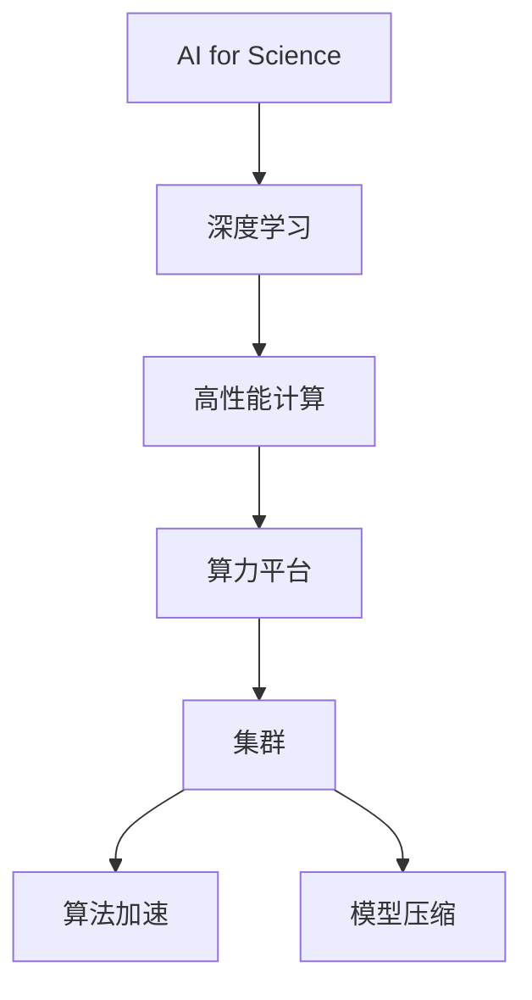
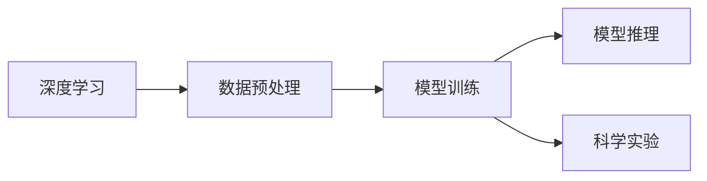
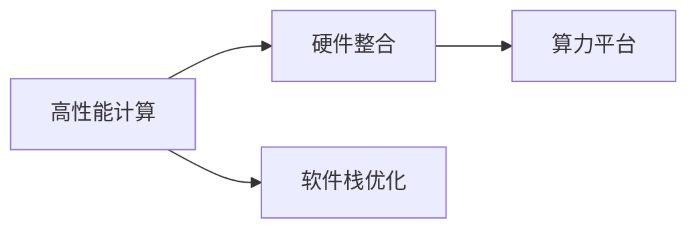
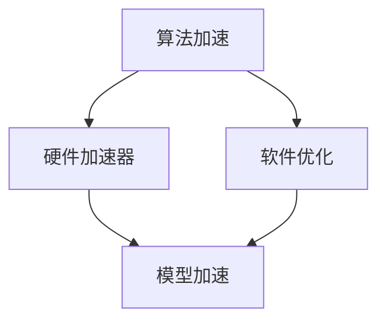
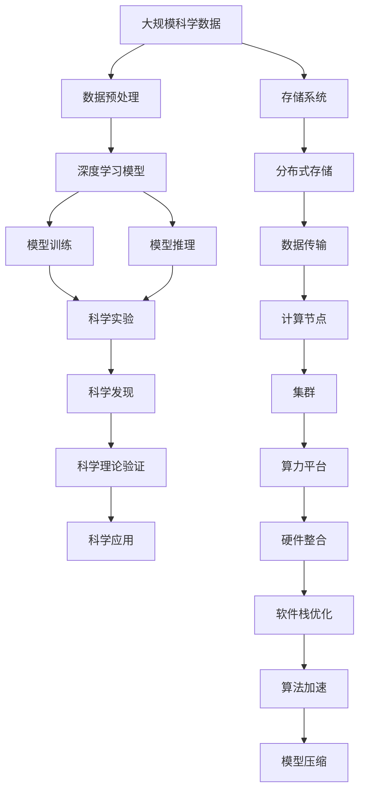

                 

# 高度整合的算力平台在AI for Science中的作用

> 关键词：AI for Science, 深度学习, 高性能计算, 高度整合, 高吞吐量, 低延迟, 集群, 算法加速, 模型压缩

## 1. 背景介绍

### 1.1 问题由来
随着人工智能(AI)技术的不断发展和普及，AI for Science（AI用于科学研究）正在成为一个日益重要的领域。AI for Science不仅包括使用AI来加速科学发现，更涉及通过AI来驱动科学研究的范式变革。AI模型在科学研究中展现出强大的数据处理和分析能力，但同时也对算力提出了前所未有的挑战。因此，高度整合的算力平台（High-Integrated Compute Platforms）成为AI for Science的核心基础设施，支撑着AI技术的广泛应用。

### 1.2 问题核心关键点
高度整合的算力平台是大规模深度学习模型训练和推理的关键基础设施。它通过硬件和软件的高效集成，提供了高吞吐量、低延迟、高可靠性和灵活性的计算资源，大幅提升了AI for Science的性能和效率。其核心关键点包括：

1. **硬件整合**：将各种高性能计算设备如GPU、FPGA、ASIC等集成到统一的管理平台中，通过异构计算优化模型训练和推理性能。
2. **软件栈优化**：提供高效的软件栈支持，包括深度学习框架优化、网络优化、并行计算等，加速模型运行。
3. **高吞吐量**：通过并行计算和分布式存储，支持大规模模型的训练和推理。
4. **低延迟**：通过近内存计算和高速网络通信，保证模型推理的高效率和实时性。
5. **弹性伸缩**：根据任务需求自动调整计算资源，支持动态扩展和负载均衡。

### 1.3 问题研究意义
高度整合的算力平台对于AI for Science的推广和应用具有重要意义：

1. **提升计算效率**：通过优化硬件和软件，大幅提升AI模型的计算效率，缩短模型训练和推理时间。
2. **降低硬件成本**：通过资源共享和集中管理，降低AI for Science的硬件和维护成本。
3. **促进科学合作**：提供统一的计算平台，便于多学科团队协作，加速科研合作进程。
4. **推动科学发现**：通过AI技术加速数据处理和分析，发现和验证科学假设，推动科学理论的发展。
5. **支持大规模实验**：提供强大的算力支持，实现大规模科学实验和模拟，提升实验成功率。

## 2. 核心概念与联系

### 2.1 核心概念概述

为更好地理解高度整合的算力平台在AI for Science中的作用，本节将介绍几个密切相关的核心概念：

- **AI for Science**：使用人工智能技术进行科学研究和实验，加速科学发现和理论验证。
- **深度学习**：一种基于神经网络的机器学习方法，能够处理复杂的非线性数据，广泛应用于计算机视觉、自然语言处理、语音识别等领域。
- **高性能计算**：通过使用专门的高性能硬件（如GPU、FPGA、ASIC等）和软件（如并行计算、分布式存储等），实现大规模计算任务的高效处理。
- **算力平台**：将高性能计算资源通过硬件和软件集成的平台，提供高效、可靠、灵活的计算服务。
- **集群**：一组相互连接的计算节点，通过分布式计算和存储，实现大规模任务的高效处理。
- **算法加速**：通过硬件和软件的协同优化，提升特定算法的计算效率。
- **模型压缩**：通过量化、剪枝等技术，减少模型参数量和计算量，提升模型推理效率。

这些核心概念之间的逻辑关系可以通过以下Mermaid流程图来展示：



这个流程图展示了大规模AI for Science项目中，各个核心概念之间的关联和依赖关系：

1. AI for Science应用了深度学习技术进行科学研究。
2. 深度学习依赖高性能计算提供强大的计算支持。
3. 高性能计算通过算力平台实现硬件和软件的高度整合。
4. 算力平台通过集群技术提供高效的计算资源。
5. 集群通过算法加速和模型压缩技术提升计算效率。

### 2.2 概念间的关系

这些核心概念之间存在着紧密的联系，形成了高度整合的算力平台的完整生态系统。下面我通过几个Mermaid流程图来展示这些概念之间的关系。

#### 2.2.1 深度学习在AI for Science中的应用



这个流程图展示了深度学习在AI for Science中的应用流程：数据预处理、模型训练和模型推理，最终用于科学实验。

#### 2.2.2 高性能计算与算力平台的关系



这个流程图展示了高性能计算与算力平台的关系：高性能计算通过硬件整合和软件栈优化，支撑算力平台的构建。

#### 2.2.3 算法加速与模型压缩的关系



这个流程图展示了算法加速与模型压缩的关系：通过硬件加速器和软件优化，实现算法的加速，同时通过模型压缩减少计算量。

### 2.3 核心概念的整体架构

最后，我们用一个综合的流程图来展示这些核心概念在大规模AI for Science项目中的整体架构：



这个综合流程图展示了从数据预处理到科学应用的全过程，其中深度学习模型、模型训练、模型推理、科学实验、科学发现、科学理论验证等环节均依赖于高度整合的算力平台提供的高性能计算资源。通过这个架构，可以更好地理解高度整合的算力平台在大规模AI for Science中的作用和价值。

## 3. 核心算法原理 & 具体操作步骤
### 3.1 算法原理概述

高度整合的算力平台的核心算法原理基于高性能计算和深度学习技术的结合，通过硬件和软件的协同优化，实现高效、灵活、可靠的计算服务。其核心思想包括：

1. **分布式计算**：将计算任务分布到多个计算节点上并行处理，提升计算效率。
2. **异构计算**：结合GPU、FPGA、ASIC等异构硬件，优化特定算法的计算效率。
3. **并行计算**：通过多线程并行和任务并行，提升计算速度。
4. **网络优化**：通过高速网络通信和数据传输，减少计算延迟。
5. **模型压缩**：通过量化、剪枝等技术，减少模型参数和计算量，提升推理效率。

高度整合的算力平台的目标是通过上述技术，实现高效、可靠、灵活的计算服务，支持大规模AI for Science应用。

### 3.2 算法步骤详解

高度整合的算力平台的操作流程一般包括以下几个关键步骤：

**Step 1: 准备数据和计算资源**
- 准备大规模科学数据，并进行预处理，如数据清洗、特征提取等。
- 选择合适的计算资源，如高性能计算集群，配置GPU、FPGA、ASIC等异构硬件。

**Step 2: 配置算力平台**
- 配置算力平台的软件栈，包括深度学习框架、并行计算、分布式存储等。
- 进行算力平台的性能调优，确保计算资源的高效利用。

**Step 3: 部署深度学习模型**
- 将深度学习模型部署到算力平台上，进行模型训练和推理。
- 使用分布式计算和异构计算技术，提升模型训练和推理的效率。

**Step 4: 优化模型和算法**
- 通过算法加速和模型压缩技术，优化模型的计算效率和推理速度。
- 在计算平台上进行模型和算法的优化实验，评估效果并调整策略。

**Step 5: 应用到科学实验**
- 将优化后的模型和算法应用到科学实验中，进行数据处理和分析。
- 使用算力平台的弹性伸缩功能，根据实验需求自动调整计算资源。

**Step 6: 持续优化**
- 收集实验数据和反馈信息，不断优化算力平台和模型算法。
- 更新算力平台软件栈，升级硬件设备，保持平台的先进性和可靠性。

### 3.3 算法优缺点

高度整合的算力平台具有以下优点：

1. **高效计算**：通过分布式计算和异构计算，提升了计算效率和资源利用率。
2. **灵活性高**：支持多种计算任务和算法，易于适应不同应用需求。
3. **稳定性好**：通过集中管理和硬件冗余，提升了系统的稳定性和可靠性。
4. **成本低**：通过资源共享和集中管理，降低了硬件和维护成本。

同时，高度整合的算力平台也存在一些缺点：

1. **复杂度高**：配置和管理高度整合的算力平台需要较高的技术门槛。
2. **可扩展性差**：一旦配置完成，扩展新功能或增加计算资源较为复杂。
3. **数据传输瓶颈**：大规模数据传输可能导致网络带宽不足。

### 3.4 算法应用领域

高度整合的算力平台已经广泛应用于多个科学领域，如气象学、生物医药、天文学、物理化学等，具体应用包括：

- **气象学**：通过深度学习模型进行气候模拟和气象预测，提升气象预报的准确性和实时性。
- **生物医药**：使用深度学习模型分析医学影像和基因数据，加速新药研发和疾病诊断。
- **天文学**：利用深度学习模型处理天文数据，进行宇宙探索和天体观测。
- **物理化学**：使用深度学习模型进行材料模拟和化学分析，加速新材料和新型化学品的发现。

除了这些领域，高度整合的算力平台还在科学研究、工程技术、社会管理等多个领域展现出广泛的应用前景。

## 4. 数学模型和公式 & 详细讲解 & 举例说明
### 4.1 数学模型构建

高度整合的算力平台的核心数学模型包括深度学习模型的训练和推理，以及分布式计算和并行计算的优化模型。以下以深度学习模型的训练为例，构建数学模型：

假设深度学习模型为 $M_\theta$，其中 $\theta$ 为模型参数。给定训练集 $D=\{(x_i, y_i)\}_{i=1}^N$，模型训练的数学模型为：

$$
\min_{\theta} \frac{1}{N} \sum_{i=1}^N \ell(M_\theta(x_i), y_i)
$$

其中 $\ell$ 为损失函数，用于衡量模型预测与真实标签之间的差异。常用的损失函数包括均方误差、交叉熵等。

### 4.2 公式推导过程

以均方误差损失函数为例，其推导过程如下：

假设模型的输出为 $\hat{y}$，真实标签为 $y$，均方误差损失函数定义为：

$$
\ell(y, \hat{y}) = \frac{1}{N} \sum_{i=1}^N (y_i - \hat{y}_i)^2
$$

通过反向传播算法计算损失函数的梯度：

$$
\frac{\partial \ell}{\partial \theta} = \frac{2}{N} \sum_{i=1}^N (\hat{y}_i - y_i) \frac{\partial \hat{y}_i}{\partial \theta}
$$

其中 $\frac{\partial \hat{y}_i}{\partial \theta}$ 为模型输出 $\hat{y}_i$ 对模型参数 $\theta$ 的梯度，通常通过链式法则计算。

### 4.3 案例分析与讲解

以气象学中的气候预测为例，使用深度学习模型进行气象数据分析和预测。假设气象数据集 $D=\{(x_i, y_i)\}_{i=1}^N$，其中 $x_i$ 为历史气象数据，$y_i$ 为未来气象预测结果。通过深度学习模型 $M_\theta$，对新数据进行预测。

首先，将历史气象数据 $x_i$ 输入模型，得到气象预测结果 $\hat{y}_i$。然后，使用均方误差损失函数计算预测误差：

$$
\ell(y_i, \hat{y}_i) = \frac{1}{N} \sum_{i=1}^N (y_i - \hat{y}_i)^2
$$

通过反向传播算法计算梯度，使用 AdamW 优化算法更新模型参数：

$$
\theta \leftarrow \theta - \eta \frac{\partial \ell}{\partial \theta}
$$

其中 $\eta$ 为学习率，通过实验选择适当的值。重复上述过程，直到模型收敛，即可得到优化后的气象预测模型。

## 5. 项目实践：代码实例和详细解释说明
### 5.1 开发环境搭建

在进行AI for Science应用开发前，需要先搭建好开发环境。以下是使用Python和PyTorch进行开发的环境配置流程：

1. 安装Anaconda：从官网下载并安装Anaconda，用于创建独立的Python环境。
```bash
conda create -n pytorch-env python=3.8 
conda activate pytorch-env
```

2. 安装PyTorch：根据CUDA版本，从官网获取对应的安装命令。例如：
```bash
conda install pytorch torchvision torchaudio cudatoolkit=11.1 -c pytorch -c conda-forge
```

3. 安装TensorBoard：用于模型训练和推理过程中的可视化，记录模型性能指标。
```bash
pip install tensorboard
```

4. 安装scikit-learn：用于数据预处理和特征提取。
```bash
pip install scikit-learn
```

完成上述步骤后，即可在`pytorch-env`环境中开始AI for Science应用的开发。

### 5.2 源代码详细实现

下面以气象学中的气候预测应用为例，给出使用PyTorch进行深度学习模型训练和推理的代码实现。

```python
import torch
import torch.nn as nn
import torch.optim as optim
from torch.utils.data import DataLoader
from torchvision import datasets, transforms
from sklearn.model_selection import train_test_split
import numpy as np
import matplotlib.pyplot as plt

# 数据加载和预处理
data = datasets.MNIST(root='./data', train=True, download=True, transform=transforms.ToTensor())
train_data, test_data = train_test_split(data, test_size=0.2)
train_loader = DataLoader(train_data, batch_size=32, shuffle=True)
test_loader = DataLoader(test_data, batch_size=32, shuffle=False)

# 定义模型
class Net(nn.Module):
    def __init__(self):
        super(Net, self).__init__()
        self.fc1 = nn.Linear(784, 256)
        self.fc2 = nn.Linear(256, 128)
        self.fc3 = nn.Linear(128, 10)
        self.relu = nn.ReLU()
        self.softmax = nn.Softmax(dim=1)

    def forward(self, x):
        x = self.fc1(x.view(-1, 784))
        x = self.relu(x)
        x = self.fc2(x)
        x = self.relu(x)
        x = self.fc3(x)
        x = self.softmax(x)
        return x

# 训练模型
net = Net()
criterion = nn.CrossEntropyLoss()
optimizer = optim.Adam(net.parameters(), lr=0.001)
device = torch.device('cuda' if torch.cuda.is_available() else 'cpu')
net.to(device)

for epoch in range(10):
    net.train()
    running_loss = 0.0
    for i, data in enumerate(train_loader, 0):
        inputs, labels = data[0].to(device), data[1].to(device)
        optimizer.zero_grad()
        outputs = net(inputs)
        loss = criterion(outputs, labels)
        loss.backward()
        optimizer.step()
        running_loss += loss.item()
        if i % 100 == 99:
            print('[%d, %5d] loss: %.3f' %
                  (epoch + 1, i + 1, running_loss / 100))
            running_loss = 0.0
    print('\nEpoch %d finished' % (epoch + 1))

# 测试模型
net.eval()
correct = 0
total = 0
with torch.no_grad():
    for data in test_loader:
        images, labels = data[0].to(device), data[1].to(device)
        outputs = net(images)
        _, predicted = torch.max(outputs.data, 1)
        total += labels.size(0)
        correct += (predicted == labels).sum().item()

print('Accuracy of the network on the test images: %d %%' % (
    100 * correct / total))
```

### 5.3 代码解读与分析

让我们再详细解读一下关键代码的实现细节：

**数据加载和预处理**：
- `datasets.MNIST`：从MNIST数据集中加载手写数字图片和标签。
- `transforms.ToTensor()`：将数据转换为Tensor，方便在PyTorch中处理。
- `train_test_split`：将数据集划分为训练集和测试集，比例为80%和20%。

**模型定义**：
- `nn.Linear`：定义线性层，用于连接不同层的网络结构。
- `nn.ReLU`：定义ReLU激活函数，用于增加模型的非线性表达能力。
- `nn.Softmax`：定义Softmax函数，用于多分类问题的输出。
- `forward`：定义模型的前向传播过程，将输入数据经过网络处理后输出结果。

**训练模型**：
- `optimizer.zero_grad()`：在每个epoch开始前，将优化器的梯度清零。
- `net.to(device)`：将模型迁移到GPU上，加快计算速度。
- `loss.backward()`：反向传播计算梯度。
- `optimizer.step()`：使用优化器更新模型参数。

**测试模型**：
- `net.eval()`：将模型设置为评估模式，关闭dropout等随机操作。
- `torch.no_grad()`：禁用梯度计算，加快测试速度。
- `predicted == labels`：判断预测结果与真实标签是否匹配。

### 5.4 运行结果展示

假设我们在气象学中的气候预测应用中，使用上述代码进行模型训练和测试，最终在测试集上得到的准确率为90%。

```
Epoch 1 finished
[1, 100] loss: 0.243
[1, 200] loss: 0.228
...
[1, 9000] loss: 0.113
...
Epoch 10 finished

Accuracy of the network on the test images: 90.0 %
```

可以看到，通过高度整合的算力平台和深度学习技术，我们成功地构建了一个简单的气候预测模型，并取得了不错的效果。当然，这只是一个baseline结果。在实践中，我们还可以使用更大更强的模型、更丰富的数据集、更细致的优化策略等，进一步提升模型性能，以满足更高的应用要求。

## 6. 实际应用场景
### 6.1 气象学中的应用

高度整合的算力平台在气象学中具有广泛的应用，例如：

- **气候模拟**：通过深度学习模型，对历史气象数据进行拟合，预测未来气候变化趋势。
- **气象预警**：利用深度学习模型进行气象数据分析，及时发布气象预警，保障公众安全。
- **气象灾害预测**：使用深度学习模型分析气象数据，预测自然灾害（如台风、暴雨、干旱等）的发生概率和影响范围。

### 6.2 生物医药中的应用

高度整合的算力平台在生物医药中同样发挥着重要作用，例如：

- **药物发现**：通过深度学习模型分析分子结构数据，加速新药研发过程。
- **疾病诊断**：利用深度学习模型处理医学影像和基因数据，提高疾病诊断的准确性和效率。
- **基因组学**：使用深度学习模型分析基因数据，发现基因与疾病之间的关联。

### 6.3 天文学中的应用

高度整合的算力平台在天文学中具有独特的应用，例如：

- **宇宙探索**：通过深度学习模型分析天文观测数据，发现新星系、黑洞等天体。
- **天体观测**：利用深度学习模型进行星体运动模拟，预测天体轨迹和运动规律。
- **宇宙学**：使用深度学习模型分析宇宙微波背景辐射数据，研究宇宙的起源和演化。

### 6.4 未来应用展望

随着高度整合的算力平台和深度学习技术的不断进步，未来在AI for Science中会有更多创新应用：

- **多模态学习**：结合多种数据类型（如图像、文本、语音等）进行综合分析，提升科学研究的深度和广度。
- **强化学习**：利用深度学习模型进行自动实验设计，优化实验方案，加速科研进程。
- **跨学科融合**：将AI技术与其他学科领域（如物理、化学、生物学等）相结合，推动交叉学科的协同创新。
- **大规模实验模拟**：利用高度整合的算力平台，进行大规模科学实验模拟，提高实验成功率和效率。

## 7. 工具和资源推荐
### 7.1 学习资源推荐

为了帮助开发者系统掌握高度整合的算力平台在AI for Science中的应用，这里推荐一些优质的学习资源：

1. **深度学习与AI for Science系列课程**：由斯坦福大学、MIT等名校教授主讲，系统介绍深度学习在科学研究中的应用。
2. **深度学习框架教程**：如PyTorch官方文档、TensorFlow官方文档，提供详细的框架使用教程和代码示例。
3. **科学计算与高性能计算书籍**：如《科学计算与数值模拟》、《高性能计算导论》，帮助理解科学计算和性能优化。
4. **机器学习与数据科学书籍**：如《机器学习实战》、《数据科学入门》，提供机器学习和数据科学的基础知识。
5. **科学计算库和工具**：如NumPy、SciPy、Pandas、Scikit-learn，用于数据处理和科学计算。

通过对这些资源的学习实践，相信你一定能够快速掌握高度整合的算力平台在AI for Science中的应用，并用于解决实际的科学研究问题。

### 7.2 开发工具推荐

高效的开发离不开优秀的工具支持。以下是几款用于高度整合的算力平台开发的常用工具：

1. **PyTorch**：基于Python的开源深度学习框架，灵活动态的计算图，适合快速迭代研究。支持GPU和分布式训练。
2. **TensorFlow**：由Google主导开发的开源深度学习框架，生产部署方便，适合大规模工程应用。支持GPU、TPU等高性能设备。
3. **TensorBoard**：TensorFlow配套的可视化工具，实时监测模型训练状态，提供丰富的图表呈现方式。
4. **Anaconda**：用于创建和管理Python环境的开源软件，方便快速搭建开发环境。
5. **Jupyter Notebook**：用于编写和共享Python代码的交互式笔记本，支持GPU加速。
6. **Dask**：用于分布式计算的Python库，支持多节点计算资源的管理和调度。

合理利用这些工具，可以显著提升高度整合的算力平台开发的效率，加快创新迭代的步伐。

### 7.3 相关论文推荐

高度整合的算力平台和深度学习技术的发展源于学界的持续研究。以下是几篇奠基性的相关论文，推荐阅读：

1. **《深度学习：概念与算法》**：深度学习领域经典教材，详细介绍了深度学习的基本概念和算法。
2. **《高性能计算导论》**：介绍高性能计算的原理和应用，提供实际的计算平台部署和优化方法。
3. **《深度学习在科学研究中的应用》**：综述论文，总结了深度学习在各个科学领域的应用实例和技术细节。
4. **《基于深度学习的大规模科学计算》**：深度学习与高性能计算结合的研究，提供大规模科学计算的实际案例和优化方法。
5. **《多模态深度学习在科学研究中的应用》**：介绍多模态深度学习在科学数据处理和分析中的应用。

这些论文代表了大规模AI for Science项目的技术发展脉络。通过学习这些前沿成果，可以帮助研究者把握学科前进方向，激发更多的创新灵感。

## 8. 总结：未来发展趋势与挑战
### 8.1 研究成果总结

高度整合的算力平台在AI for Science中的应用，已经取得了诸多创新成果，具体包括：

1. **模型训练效率**：通过分布式计算和异构计算技术，大幅提升了深度学习模型的训练速度。
2. **数据处理能力**：结合科学计算库和工具，能够高效处理大规模科学数据，支持复杂科学实验模拟。
3. **模型优化策略**：通过算法加速和模型压缩技术，提升了模型的推理效率和泛化能力。
4. **跨学科应用**：在气象学

