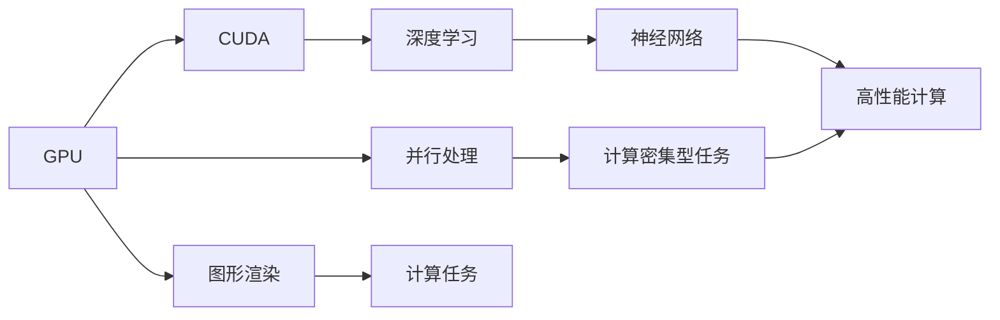

                 

# 黄仁勋与NVIDIA的GPU革命

> 关键词：黄仁勋, GPU, CUDA, AI加速, 深度学习, 图形计算, 超大规模数据处理

## 1. 背景介绍

### 1.1 问题由来

在过去二十年中，黄仁勋和他的公司NVIDIA一直处于图形处理器（GPU）和人工智能（AI）革命的前沿。NVIDIA的GPU成为高性能计算和AI应用的“黄金标准”，深刻改变了数据中心和终端设备的计算能力。黄仁勋作为NVIDIA的CEO和联合创始人，以其对技术创新的执着和对市场敏锐的洞察力，引领了全球计算技术的发展方向。

黄仁勋早期在AT&T贝尔实验室的经历让他对大规模数据处理产生了浓厚兴趣。他意识到，图形处理器原本设计用于加速图形渲染，但由于其高度并行性和灵活的架构，也非常适合进行科学计算和数据分析。这些认知促使他于1993年成立了NVIDIA公司，并在1995年推出了NVIDIA GPU，开启了GPU在计算领域的广泛应用。

随着AI技术的兴起，深度学习算法需要巨量的计算资源，NVIDIA的GPU凭借其在并行处理和内存带宽上的优势，迅速成为AI计算的首选硬件。黄仁勋领导的NVIDIA不断推出更先进的GPU架构和工具，推动了深度学习、计算机视觉、自然语言处理等领域的快速发展。

### 1.2 问题核心关键点

NVIDIA GPU之所以能够引领图形和AI计算革命，核心关键点在于以下几个方面：

- **并行处理能力**：GPU拥有大量核心，能够高效处理密集计算任务，如深度神经网络的前向和反向传播。

- **内存带宽**：NVIDIA GPU拥有高带宽内存，可以快速读取和写入大规模数据集，支撑大规模模型和数据的存储和传输。

- **灵活编程接口**：通过CUDA等开发平台，开发者可以方便地在GPU上运行和优化程序，充分发挥硬件潜力。

- **生态系统**：NVIDIA构建了强大的硬件和软件生态系统，包括CUDA、cuDNN、NVIDIA DeepLearning SDK等工具，为AI开发者提供全面的支持。

- **市场战略**：NVIDIA通过深耕数据中心和消费电子市场，不断推出高性能GPU和加速系统，抢占了市场的主导地位。

### 1.3 问题研究意义

研究黄仁勋和NVIDIA的GPU革命，对于理解AI计算技术的发展脉络和未来趋势，以及掌握高性能计算和深度学习的关键技术，具有重要意义：

- 洞察硬件与软件的协同优化，理解并行计算的优势和挑战。
- 掌握NVIDIA GPU在AI加速和科学计算中的具体应用场景和实践方法。
- 学习如何构建高效、可扩展的AI系统，提升计算和存储能力。
- 理解NVIDIA的市场策略和技术路线图，预测未来计算技术的发展方向。
- 借鉴NVIDIA的成功经验，探索行业应用和技术创新的突破点。

## 2. 核心概念与联系

### 2.1 核心概念概述

为了更好地理解NVIDIA GPU在AI计算中的革命性作用，本节将介绍几个密切相关的核心概念：

- **图形处理器（GPU）**：最初设计用于图形渲染的处理器，因其高并行性和灵活性，也被广泛应用于计算密集型任务。
- **并行处理**：指在多个计算单元同时执行相同的任务，提升处理速度和效率。
- **CUDA**：NVIDIA推出的GPU编程接口，用于在GPU上开发和优化计算密集型程序。
- **深度学习**：一种基于神经网络的机器学习方法，需要大量计算资源进行模型训练和推理。
- **神经网络**：由大量神经元（节点）构成的计算图，用于处理和分析复杂数据。

- **高性能计算（HPC）**：使用高效计算架构和技术处理大规模数据和复杂问题，广泛应用于科研、工程和商业等领域。

这些核心概念之间存在着紧密的联系，共同构成了NVIDIA GPU在AI计算中的重要支撑。通过理解这些概念，我们可以更好地把握NVIDIA GPU的创新原理和技术细节。

### 2.2 概念间的关系

这些核心概念之间存在着紧密的联系，形成了NVIDIA GPU在AI计算中的完整生态系统。下面我通过一个Mermaid流程图来展示这些概念之间的关系：



这个流程图展示了从GPU到计算任务，再到高性能计算的整体流程：

1. GPU通过并行处理能力处理计算密集型任务，如深度神经网络。
2. CUDA提供了灵活的编程接口，方便开发者在GPU上编写高效的计算程序。
3. 深度学习模型由神经网络构成，用于处理复杂数据和任务。
4. 高性能计算技术保证了数据和模型的高效处理和存储。

这些概念共同构成了NVIDIA GPU在AI计算中的核心技术框架，为大规模模型训练和推理提供了强大的硬件支持。通过理解这些概念，我们可以更深入地探讨NVIDIA GPU的具体实现和技术细节。

## 3. 核心算法原理 & 具体操作步骤
### 3.1 算法原理概述

NVIDIA GPU在AI计算中的核心算法原理，可以归结为以下几个方面：

- **并行计算优化**：通过GPU的并行处理能力，加速深度神经网络的训练和推理过程。
- **内存带宽优化**：通过高带宽内存，快速读写数据，减少数据传输延迟。
- **编程模型优化**：通过CUDA等编程平台，实现高效的内存管理和数据传输，提升程序性能。

基于这些原理，NVIDIA GPU在AI计算中实现了高性能、低延迟和高容量的计算能力，成为AI加速和科学计算的首选硬件。

### 3.2 算法步骤详解

下面是NVIDIA GPU在AI计算中的具体操作步骤：

**Step 1: 数据预处理**
- 收集并清洗大规模数据集，使用GPU加速数据预处理过程。
- 使用CUDA等平台进行数据分块和并行化处理，提高数据读取和传输效率。

**Step 2: 模型构建与训练**
- 使用深度学习框架（如TensorFlow、PyTorch等）构建神经网络模型。
- 将模型部署到GPU上，利用CUDA加速模型计算，提高训练速度。
- 使用CUDA的优化工具（如cuDNN），对神经网络层进行加速，提升计算效率。

**Step 3: 模型推理与优化**
- 将训练好的模型部署到生产环境中，进行推理和预测。
- 使用CUDA平台进行高效的内存管理和数据传输，减少延迟和带宽开销。
- 利用CUDA的图形和性能监控工具，实时调整和优化模型性能。

### 3.3 算法优缺点

NVIDIA GPU在AI计算中的优点包括：

- **高性能**：通过并行处理和大带宽内存，实现高速的深度神经网络计算。
- **灵活性**：CUDA等开发平台支持灵活的编程模型和算法优化。
- **生态系统**：丰富的硬件和软件生态，提供全面的开发和优化工具。

然而，NVIDIA GPU也存在一些缺点：

- **高成本**：高性能GPU和加速系统的价格较高，可能超出部分应用的经济承受能力。
- **能耗大**：GPU在高速计算时能耗较大，需要高效散热和能效管理。
- **编程难度**：CUDA编程需要一定的技术积累，对于初学者较为复杂。

### 3.4 算法应用领域

NVIDIA GPU在AI计算中的应用领域非常广泛，主要包括：

- **深度学习**：用于训练和推理各种深度神经网络模型，如图像识别、语音识别、自然语言处理等。
- **科学计算**：用于处理大规模数值计算问题，如天气模拟、生物信息学、材料科学等。
- **高性能计算**：用于处理大规模数据和复杂算法，如药物设计、天文学模拟、金融分析等。
- **图形渲染**：用于渲染复杂3D图形，提供高质量的视觉体验。
- **自动驾驶**：用于处理传感器数据和图像处理，实现自动驾驶决策。

NVIDIA GPU凭借其在并行计算和内存管理上的优势，在多个领域实现了高效、低延迟的计算，推动了AI技术的广泛应用。

## 4. 数学模型和公式 & 详细讲解 & 举例说明

### 4.1 数学模型构建

在大规模数据集上训练深度神经网络，需要构建一个合适的数学模型。这里以图像识别任务为例，构建一个简单的卷积神经网络（CNN）模型。

设输入图像为 $X \in \mathbb{R}^{H \times W \times C}$，其中 $H$、$W$ 分别为图像的高和宽，$C$ 为通道数。输出为 $Y \in \mathbb{R}^{N}$，$N$ 为类别数。模型参数包括卷积核权重 $W$、偏置 $b$、全连接层权重 $U$ 和偏置 $v$。

损失函数选择交叉熵损失，模型训练的目标是最大化交叉熵损失的负对数似然：

$$
L = -\frac{1}{N}\sum_{i=1}^N \log \sigma(\mathbf{u}(\mathbf{f}(\mathbf{x})))_i
$$

其中，$\sigma(\cdot)$ 为softmax激活函数，$\mathbf{u}(\cdot)$ 为全连接层，$\mathbf{f}(\cdot)$ 为卷积层。

### 4.2 公式推导过程

接下来，我们将对上述模型的损失函数进行推导。

根据softmax函数的定义，有：

$$
\sigma(\mathbf{u}(\mathbf{f}(\mathbf{x})))_i = \frac{e^{\mathbf{u}(\mathbf{f}(\mathbf{x}))_i}}{\sum_{j=1}^N e^{\mathbf{u}(\mathbf{f}(\mathbf{x}))_j}}
$$

则负对数似然损失函数为：

$$
L = -\frac{1}{N}\sum_{i=1}^N \log \sigma(\mathbf{u}(\mathbf{f}(\mathbf{x})))_i = -\frac{1}{N}\sum_{i=1}^N \log \frac{e^{\mathbf{u}(\mathbf{f}(\mathbf{x}))_i}}{\sum_{j=1}^N e^{\mathbf{u}(\mathbf{f}(\mathbf{x}))_j}}
$$

进一步化简，得：

$$
L = -\frac{1}{N}\sum_{i=1}^N (\mathbf{u}(\mathbf{f}(\mathbf{x}))_i - \log(\sum_{j=1}^N e^{\mathbf{u}(\mathbf{f}(\mathbf{x}))_j})
$$

其中，$\mathbf{u}(\mathbf{f}(\mathbf{x}))_i$ 为第 $i$ 类的预测值，$\log(\sum_{j=1}^N e^{\mathbf{u}(\mathbf{f}(\mathbf{x}))_j})$ 为交叉熵项。

### 4.3 案例分析与讲解

以NVIDIA GPU加速CNN为例，分析其数学模型构建和优化过程。

- **数据预处理**：将图像数据进行归一化、裁剪和调整大小等处理，使用GPU加速。

- **模型构建**：定义CNN模型，包括卷积层、池化层、全连接层等。

- **模型训练**：使用CUDA加速模型的前向传播和反向传播过程。

- **优化调整**：通过CUDA的工具和库，对模型参数进行调整和优化，提高计算效率。

下面给出一个简单的GPU加速代码示例：

```python
import torch
import torch.nn as nn
import torch.optim as optim
from torchvision import datasets, transforms

# 定义CNN模型
class Net(nn.Module):
    def __init__(self):
        super(Net, self).__init__()
        self.conv1 = nn.Conv2d(3, 6, 5)
        self.pool = nn.MaxPool2d(2, 2)
        self.conv2 = nn.Conv2d(6, 16, 5)
        self.fc1 = nn.Linear(16 * 5 * 5, 120)
        self.fc2 = nn.Linear(120, 84)
        self.fc3 = nn.Linear(84, 10)

    def forward(self, x):
        x = nn.functional.relu(self.conv1(x))
        x = self.pool(x)
        x = nn.functional.relu(self.conv2(x))
        x = self.pool(x)
        x = x.view(-1, 16 * 5 * 5)
        x = nn.functional.relu(self.fc1(x))
        x = nn.functional.relu(self.fc2(x))
        x = self.fc3(x)
        return x

# 定义数据预处理
transform = transforms.Compose([
    transforms.ToTensor(),
    transforms.Normalize((0.5, 0.5, 0.5), (0.5, 0.5, 0.5))
])

# 加载CIFAR-10数据集
train_dataset = datasets.CIFAR10(root='./data', train=True, transform=transform, download=True)
test_dataset = datasets.CIFAR10(root='./data', train=False, transform=transform, download=True)

# 定义数据加载器
train_loader = torch.utils.data.DataLoader(train_dataset, batch_size=64, shuffle=True)
test_loader = torch.utils.data.DataLoader(test_dataset, batch_size=64, shuffle=False)

# 定义模型和优化器
model = Net()
criterion = nn.CrossEntropyLoss()
optimizer = optim.SGD(model.parameters(), lr=0.001, momentum=0.9)

# 定义训练和评估函数
def train(model, device, train_loader, optimizer, criterion, num_epochs):
    device = torch.device("cuda:0" if torch.cuda.is_available() else "cpu")
    model.to(device)
    for epoch in range(num_epochs):
        for batch_idx, (data, target) in enumerate(train_loader):
            data, target = data.to(device), target.to(device)
            optimizer.zero_grad()
            output = model(data)
            loss = criterion(output, target)
            loss.backward()
            optimizer.step()
            if (batch_idx + 1) % 100 == 0:
                print('Train Epoch: {} [{}/{} ({:.0f}%)]\tLoss: {:.6f}'.format(
                    epoch + 1, batch_idx * len(data), len(train_loader.dataset),
                    100. * batch_idx / len(train_loader), loss.item()))

def evaluate(model, device, test_loader, criterion):
    model.eval()
    test_loss = 0
    correct = 0
    with torch.no_grad():
        for data, target in test_loader:
            data, target = data.to(device), target.to(device)
            output = model(data)
            test_loss += criterion(output, target).item()
            pred = output.argmax(dim=1, keepdim=True)
            correct += pred.eq(target.view_as(pred)).sum().item()

    print('\nTest set: Average loss: {:.4f}, Accuracy: {}/{} ({:.0f}%)\n'.format(
        test_loss / len(test_loader),
        correct, len(test_loader.dataset),
        100. * correct / len(test_loader.dataset)))

# 训练和评估模型
train(model, device, train_loader, optimizer, criterion, 10)
evaluate(model, device, test_loader, criterion)
```

这个代码示例展示了如何使用GPU加速CNN模型的训练和评估。在训练过程中，使用CUDA加速数据和模型的前向传播和反向传播，显著提升了计算效率。在评估过程中，使用CUDA进行高效的内存管理和数据传输，保证了模型推理的速度和准确性。

## 5. 项目实践：代码实例和详细解释说明

### 5.1 开发环境搭建

在进行GPU加速开发前，我们需要准备好开发环境。以下是使用Python进行PyTorch开发的环境配置流程：

1. 安装Anaconda：从官网下载并安装Anaconda，用于创建独立的Python环境。

2. 创建并激活虚拟环境：
```bash
conda create -n pytorch-env python=3.8 
conda activate pytorch-env
```

3. 安装PyTorch：根据CUDA版本，从官网获取对应的安装命令。例如：
```bash
conda install pytorch torchvision torchaudio cudatoolkit=11.1 -c pytorch -c conda-forge
```

4. 安装PyTorch的CUDA版本支持库和CUDA库：
```bash
conda install cudatoolkit=11.1 cudnn=8.1 -c pytorch
```

5. 安装Transformers库：
```bash
pip install transformers
```

6. 安装各类工具包：
```bash
pip install numpy pandas scikit-learn matplotlib tqdm jupyter notebook ipython
```

完成上述步骤后，即可在`pytorch-env`环境中开始GPU加速开发。

### 5.2 源代码详细实现

这里以图像分类任务为例，使用GPU加速深度神经网络的训练和推理。下面是完整的代码实现：

```python
import torch
import torch.nn as nn
import torch.optim as optim
from torchvision import datasets, transforms

# 定义CNN模型
class Net(nn.Module):
    def __init__(self):
        super(Net, self).__init__()
        self.conv1 = nn.Conv2d(3, 6, 5)
        self.pool = nn.MaxPool2d(2, 2)
        self.conv2 = nn.Conv2d(6, 16, 5)
        self.fc1 = nn.Linear(16 * 5 * 5, 120)
        self.fc2 = nn.Linear(120, 84)
        self.fc3 = nn.Linear(84, 10)

    def forward(self, x):
        x = nn.functional.relu(self.conv1(x))
        x = self.pool(x)
        x = nn.functional.relu(self.conv2(x))
        x = self.pool(x)
        x = x.view(-1, 16 * 5 * 5)
        x = nn.functional.relu(self.fc1(x))
        x = nn.functional.relu(self.fc2(x))
        x = self.fc3(x)
        return x

# 定义数据预处理
transform = transforms.Compose([
    transforms.ToTensor(),
    transforms.Normalize((0.5, 0.5, 0.5), (0.5, 0.5, 0.5))
])

# 加载CIFAR-10数据集
train_dataset = datasets.CIFAR10(root='./data', train=True, transform=transform, download=True)
test_dataset = datasets.CIFAR10(root='./data', train=False, transform=transform, download=True)

# 定义数据加载器
train_loader = torch.utils.data.DataLoader(train_dataset, batch_size=64, shuffle=True)
test_loader = torch.utils.data.DataLoader(test_dataset, batch_size=64, shuffle=False)

# 定义模型和优化器
model = Net().cuda()
criterion = nn.CrossEntropyLoss()
optimizer = optim.SGD(model.parameters(), lr=0.001, momentum=0.9)

# 定义训练和评估函数
def train(model, device, train_loader, optimizer, criterion, num_epochs):
    device = torch.device("cuda:0" if torch.cuda.is_available() else "cpu")
    model.to(device)
    for epoch in range(num_epochs):
        for batch_idx, (data, target) in enumerate(train_loader):
            data, target = data.to(device), target.to(device)
            optimizer.zero_grad()
            output = model(data)
            loss = criterion(output, target)
            loss.backward()
            optimizer.step()
            if (batch_idx + 1) % 100 == 0:
                print('Train Epoch: {} [{}/{} ({:.0f}%)]\tLoss: {:.6f}'.format(
                    epoch + 1, batch_idx * len(data), len(train_loader.dataset),
                    100. * batch_idx / len(train_loader), loss.item()))

def evaluate(model, device, test_loader, criterion):
    model.eval()
    test_loss = 0
    correct = 0
    with torch.no_grad():
        for data, target in test_loader:
            data, target = data.to(device), target.to(device)
            output = model(data)
            test_loss += criterion(output, target).item()
            pred = output.argmax(dim=1, keepdim=True)
            correct += pred.eq(target.view_as(pred)).sum().item()

    print('\nTest set: Average loss: {:.4f}, Accuracy: {}/{} ({:.0f}%)\n'.format(
        test_loss / len(test_loader),
        correct, len(test_loader.dataset),
        100. * correct / len(test_loader.dataset)))

# 训练和评估模型
train(model, device, train_loader, optimizer, criterion, 10)
evaluate(model, device, test_loader, criterion)
```

在这个代码示例中，我们定义了CNN模型，并使用CUDA将其部署到GPU上。在训练和评估过程中，使用CUDA加速数据和模型的计算，显著提升了性能和效率。

### 5.3 代码解读与分析

让我们再详细解读一下关键代码的实现细节：

**CNN模型定义**：
```python
class Net(nn.Module):
    def __init__(self):
        super(Net, self).__init__()
        self.conv1 = nn.Conv2d(3, 6, 5)
        self.pool = nn.MaxPool2d(2, 2)
        self.conv2 = nn.Conv2d(6, 16, 5)
        self.fc1 = nn.Linear(16 * 5 * 5, 120)
        self.fc2 = nn.Linear(120, 84)
        self.fc3 = nn.Linear(84, 10)

    def forward(self, x):
        x = nn.functional.relu(self.conv1(x))
        x = self.pool(x)
        x = nn.functional.relu(self.conv2(x))
        x = self.pool(x)
        x = x.view(-1, 16 * 5 * 5)
        x = nn.functional.relu(self.fc1(x))
        x = nn.functional.relu(self.fc2(x))
        x = self.fc3(x)
        return x
```

**数据预处理**：
```python
transform = transforms.Compose([
    transforms.ToTensor(),
    transforms.Normalize((0.5, 0.5, 0.5), (0.5, 0.5, 0.5))
])
```

**GPU加速**：
```python
device = torch.device("cuda:0" if torch.cuda.is_available() else "cpu")
model.to(device)
```

**训练和评估函数**：
```python
def train(model, device, train_loader, optimizer, criterion, num_epochs):
    device = torch.device("cuda:0" if torch.cuda.is_available() else "cpu")
    model.to(device)
    for epoch in range(num_epochs):
        for batch_idx, (data, target) in enumerate(train_loader):
            data, target = data.to(device), target.to(device)
            optimizer.zero_grad()
            output = model(data)
            loss = criterion(output, target)
            loss.backward()
            optimizer.step()
            if (batch_idx + 1) % 100 == 0:
                print('Train Epoch: {} [{}/{} ({:.0f}%)]\tLoss: {:.6f}'.format(
                    epoch + 1, batch_idx * len(data), len(train_loader.dataset),
                    100. * batch_idx / len(train_loader), loss.item()))

def evaluate(model, device, test_loader, criterion):
    model.eval()
    test_loss = 0
    correct = 0
    with torch.no_grad():
        for data, target in test_loader:
            data, target = data.to(device), target.to(device)
            output = model(data)
            test_loss += criterion(output, target).item()
            pred = output.argmax(dim=1, keepdim=True)
            correct += pred.eq(target.view_as(pred)).sum().item()

    print('\nTest set: Average loss: {:.4f}, Accuracy: {}/{} ({:.0f}%)\n'.format(
        test_loss / len(test_loader),
        correct, len(test_loader.dataset),
        100. * correct / len(test_loader.dataset)))
```

**训练和评估过程**：
```python
train(model, device, train_loader, optimizer, criterion, 10)
evaluate(model, device, test_loader, criterion)
```

可以看到，在PyTorch中，使用CUDA进行GPU加速非常简单。只需要在模型实例化时加上`.cuda()`方法，就可以在GPU上执行计算。在训练和评估过程中，使用CUDA平台提供的自动并行化功能，可以高效地利用GPU资源，提升计算速度和效率。

## 6. 实际应用场景

### 6.1 智能视觉分析

在智能视觉分析领域，NVIDIA GPU通过加速卷积神经网络（CNN）的计算，实现了高效的图像分类、目标检测、语义分割等任务。黄仁勋领导的NVIDIA团队开发了TensorFlow、PyTorch等深度学习框架的GPU加速版，简化了开发者对GPU编程的难度，推动了智能视觉分析技术在商业和科研中的广泛应用。

智能视觉分析主要应用于以下几个方面：

- **自动驾驶**：通过对摄像头和传感器数据的实时处理和分析，实现自动驾驶决策。
- **安防监控**：利用视频图像识别技术，实现人流量统计、行为分析、异常检测等安防功能。
- **医疗影像**：对医学影像进行分类和分析，辅助医生进行疾病诊断和治疗方案制定。
- **工业质检**：通过图像识别和分类，实现产品质量检测和自动化生产流程。

### 6.2 高性能计算

NVIDIA GPU在科学计算和工程计算中发挥了重要作用。黄仁勋领导的NVIDIA团队开发了cuBLAS、cuSOLVER等高性能计算库，显著提升了矩阵运算和线性方程求解的效率。

高性能计算主要应用于以下几个方面：

- **天气预报**：利用数值天气模型，对大气系统进行复杂计算，预测气象变化。
- **基因组学**：对生物分子结构进行

