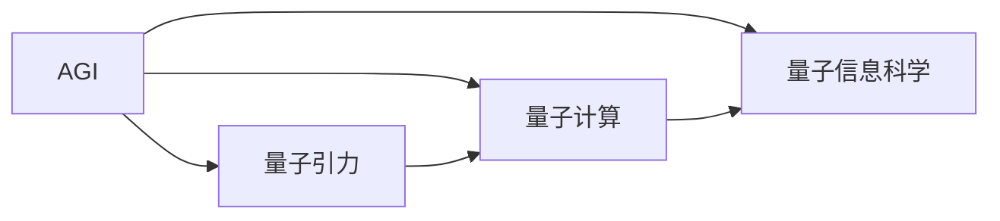

                 

# AGI与量子引力的未来发展

> 关键词：

在当前的技术和理论背景下，人工智能（AI）正处于一个飞速发展的转折点。特别是通用人工智能（AGI）和量子引力（Quantum Gravity）这两个前沿领域的交叉融合，引发了无数的想象与思考。本文旨在深入探讨AGI与量子引力未来发展的前沿趋势、关键挑战与突破方向，为未来技术的应用和研究提供重要的指导。

## 1. 背景介绍

### 1.1 问题的由来

随着深度学习技术的突飞猛进，人工智能系统在图像识别、自然语言处理、自动驾驶等诸多领域取得了前所未有的成就。然而，真正意义上的通用人工智能（AGI）仍然是一个遥不可及的梦想。AGI被定义为一种能够涵盖多种智能能力，并具备自我思考、自我学习和适应复杂环境的人工智能系统。它不仅仅是单一任务的执行，而是具备广泛的智能能力和广泛的适用性。

与此同时，量子引力作为描述自然界的核心理论之一，一直未能被完整地解释。它试图融合量子力学和广义相对论，解释物质与时空的关系，并期望揭示宇宙的深层规律。

近年来，随着量子计算和量子信息科学的发展，一些研究者开始尝试将量子引力理论与人工智能技术进行融合，旨在推动对宇宙深层次规律的探究和AGI技术的发展。这种跨学科的融合带来了新的研究视角和方法，有望为AGI和量子引力领域带来颠覆性的突破。

### 1.2 核心概念

在探讨AGI与量子引力未来发展之前，我们首先明确几个核心概念：

- **AGI**: 即通用人工智能，一种具有自我思考、学习和适应各种复杂环境的人工智能系统。它不仅能够执行特定的任务，还能处理未知的、模糊的问题，并具备一定的常识推理和创新能力。
- **量子引力**: 是描述宇宙基本规律的物理理论，旨在将量子力学与广义相对论融合，解释物质与时空的关系，并揭示宇宙深层次的规律。
- **量子计算**: 一种利用量子比特进行信息处理的计算方式，相较于经典计算机，其运算速度和并行处理能力得到了极大提升。
- **量子信息科学**: 涉及量子计算、量子通信、量子密码学等领域，致力于探索和开发利用量子态的特殊性质进行信息处理的技术。

这些概念之间的内在联系和相互作用，为AGI和量子引力领域的研究提供了新的可能性和方向。

## 2. 核心概念与联系

### 2.1 核心概念概述

为了更好地理解AGI与量子引力的未来发展，我们需要明确几个关键概念的原理和架构。以下是这些概念的简要介绍：

#### 2.1.1 AGI原理

AGI的核心目标是通过自我学习和自我适应，实现对各类复杂问题的解决。其主要原理包括：

- **符号计算**: 使用符号表示知识，进行逻辑推理和形式化推理。
- **神经网络**: 利用深度学习网络处理大量数据，进行模式识别和分类。
- **常识推理**: 通过背景知识和经验，进行合理的假设和推断。
- **元认知**: 具备自我反思和调整的能力，实现学习效率的提升。

#### 2.1.2 量子引力原理

量子引力理论的核心理念是利用量子力学和广义相对论的融合，揭示物质与时空的关系。其主要原理包括：

- **量子力学**: 描述微观粒子行为的理论，具有概率性和波动性。
- **广义相对论**: 描述宏观宇宙结构的时空理论，包括时空弯曲、引力作用等。
- **宇宙弦**: 认为宇宙可能由一维的弦构成，弦的振动模式决定了宇宙的基本规律。
- **黑洞奇点**: 黑洞中心的奇点，是理论物理中的未解之谜。

#### 2.1.3 量子计算原理

量子计算利用量子比特（qubit）进行信息处理，其核心原理包括：

- **叠加态**: 量子比特可以处于多个状态的同时，提高计算效率。
- **纠缠态**: 量子比特之间的纠缠关系，可以实现高效的并行计算。
- **量子门**: 用于操作量子比特的逻辑门，实现量子算法的执行。
- **量子退相干**: 量子态的消减现象，需要通过量子纠错技术解决。

#### 2.1.4 量子信息科学原理

量子信息科学涉及量子计算、量子通信和量子密码学等领域，其主要原理包括：

- **量子密码学**: 利用量子态的不可克隆性，实现安全通信。
- **量子纠错**: 解决量子计算中的退相干问题，提高量子计算的可靠性。
- **量子算法**: 如Shor算法、Grover算法，可以在特定问题上超越经典计算。

### 2.2 概念间的关系

AGI与量子引力、量子计算和量子信息科学的融合，带来了新的研究视角和方法。以下是这些概念间的关系简图：



这个图展示了AGI与量子引力、量子计算和量子信息科学之间的相互影响和融合。AGI需要量子计算和量子信息科学的支撑，以便处理大规模的复杂计算任务。同时，量子引力理论为AGI提供了新的理解和探索宇宙的方式。

## 3. 核心算法原理 & 具体操作步骤

### 3.1 算法原理概述

AGI与量子引力未来发展的核心算法主要涉及以下内容：

- **符号计算与神经网络融合**: 利用符号计算进行形式化推理，同时利用神经网络处理大量的数据和模式识别。
- **量子算法与AGI结合**: 将量子算法（如Shor算法、Grover算法）应用于AGI的计算任务中，提高计算效率和并行处理能力。
- **量子信息科学的AGI应用**: 利用量子信息科学的理论和技术，实现更加安全、高效的信息处理和数据传输。

### 3.2 算法步骤详解

以下是AGI与量子引力未来发展的算法步骤详解：

1. **符号计算与神经网络融合**:
   - **输入数据处理**: 将问题转化为符号表达，并使用神经网络进行处理。
   - **符号推理**: 使用符号推理引擎，对神经网络的输出进行形式化推理。
   - **反馈调整**: 根据符号推理的结果，调整神经网络的结构和参数。

2. **量子算法与AGI结合**:
   - **量子算法选择**: 根据问题的性质选择合适的量子算法。
   - **量子态准备**: 利用量子计算机准备量子比特的初始状态。
   - **量子计算**: 在量子计算机上执行量子算法。
   - **结果输出**: 将量子计算结果反馈到AGI系统中，进行进一步处理。

3. **量子信息科学的AGI应用**:
   - **量子加密**: 利用量子密码学技术，对AGI系统进行加密保护。
   - **量子通信**: 使用量子通信技术，实现AGI系统间的高效数据传输。
   - **量子感知**: 利用量子传感器技术，提高AGI系统对环境的感知能力。

### 3.3 算法优缺点

AGI与量子引力未来发展中的算法具有以下优点：

- **高效计算**: 量子算法在特定问题上的计算效率远超经典算法，可以显著提高AGI的计算能力。
- **并行处理**: 量子计算的叠加态和纠缠态特性，实现了高效的数据并行处理。
- **安全通信**: 量子信息科学的加密技术，可以提供更高的信息安全性。

同时，该算法也存在一些缺点：

- **技术复杂性**: 量子计算和量子信息科学的技术难度较高，对硬件和软件的要求较高。
- **应用局限**: 当前量子计算的应用场景较少，AGI与量子引力结合的应用还处于早期阶段。
- **数据需求**: 在初始阶段需要大量的数据进行训练，数据处理和存储的需求较高。

### 3.4 算法应用领域

AGI与量子引力的未来发展，将在以下几个领域产生深远影响：

- **科学研究**: 利用AGI进行复杂科学的计算和模拟，揭示宇宙深层次的规律。
- **医疗诊断**: 利用AGI进行大规模医疗数据的分析，发现新的治疗方法。
- **金融分析**: 利用AGI进行高频交易和大数据分析，优化金融决策。
- **智能制造**: 利用AGI进行智能设备的设计和优化，提升生产效率。
- **智能交通**: 利用AGI进行智能交通系统的设计和管理，优化交通流。

## 4. 数学模型和公式 & 详细讲解 & 举例说明

### 4.1 数学模型构建

AGI与量子引力的数学模型主要涉及以下几个方面：

- **符号计算模型**: 使用符号表达式，描述AGI的推理过程。
- **神经网络模型**: 使用深度学习网络，进行数据处理和模式识别。
- **量子计算模型**: 使用量子比特，进行并行计算和逻辑门操作。
- **量子信息科学模型**: 使用量子密钥分发和量子纠错算法，保障数据安全。

### 4.2 公式推导过程

以下是AGI与量子引力数学模型中的一些关键公式：

#### 4.2.1 符号计算公式

在符号计算中，我们可以使用一阶逻辑推理的形式化语言进行表达。例如，对于命题逻辑公式P和Q，我们可以定义如下的推理规则：

$$
P \rightarrow Q
$$

表示如果P成立，则Q成立。根据上述规则，我们可以进行如下推理：

$$
(P \rightarrow Q) \rightarrow (\neg Q \rightarrow \neg P)
$$

这表明如果Q不成立，则P也不成立。

#### 4.2.2 神经网络公式

在神经网络中，我们通常使用多层感知器（MLP）进行数据处理。例如，对于输入层有n个节点，输出层有m个节点的MLP，其前向传播过程可以表示为：

$$
H = f(W_1 \cdot X_1 + b_1) = \tanh(W_2 \cdot H + b_2)
$$

其中，$f$为激活函数，$W_1$和$W_2$为权重矩阵，$b_1$和$b_2$为偏置向量，$X_1$为输入向量。

#### 4.2.3 量子计算公式

在量子计算中，我们通常使用Shor算法进行质因数分解。例如，对于一个大整数N，我们可以定义如下的量子算法：

$$
\text{Shor}(N) = \text{QFT}^{-1}(\text{QFT}(\text{ModularInverse}(N, a))) \mod N
$$

其中，QFT为量子傅里叶变换，ModularInverse为模反元素计算。

#### 4.2.4 量子信息科学公式

在量子信息科学中，我们通常使用量子密钥分发协议进行数据加密。例如，Bennett和Brassard提出的BB84协议，其基本过程如下：

1. 发送方Alice生成一组随机比特串$b_1$和基底$B_1$。
2. 发送方Alice随机选择一组基底$B_2$，并发送基底信息给接收方Bob。
3. Bob根据接收到的基底信息，测量发送方的量子比特。
4. Alice和Bob通过比较测量结果和基底信息，计算共享密钥。

### 4.3 案例分析与讲解

以下是AGI与量子引力未来发展的一些实际应用案例：

#### 4.3.1 宇宙弦模拟

利用AGI进行宇宙弦的模拟计算，需要结合符号计算和神经网络技术。具体过程如下：

1. **输入数据准备**: 将宇宙弦的物理参数转化为符号表达式。
2. **神经网络训练**: 使用神经网络对大量宇宙弦的模拟数据进行训练，学习其物理规律。
3. **符号推理**: 使用符号推理引擎，对神经网络的输出进行形式化推理，计算宇宙弦的分布和振动模式。
4. **结果输出**: 根据符号推理的结果，调整神经网络的参数，进行更精确的宇宙弦模拟。

#### 4.3.2 量子金融分析

利用AGI进行金融市场的分析，需要结合量子计算和量子信息科学技术。具体过程如下：

1. **数据预处理**: 将金融市场的数据转化为量子比特形式。
2. **量子算法应用**: 使用Shor算法计算市场的质因数分解，发现市场的规律和周期性。
3. **信息安全保障**: 使用量子密钥分发技术，保障金融数据的安全传输。
4. **结果输出**: 根据量子计算和信息安全的结果，调整AGI的金融模型，进行市场预测和风险控制。

## 5. 项目实践：代码实例和详细解释说明

### 5.1 开发环境搭建

在进行AGI与量子引力未来发展的项目实践前，我们需要准备好开发环境。以下是使用Python进行PyTorch开发的环境配置流程：

1. 安装Anaconda：从官网下载并安装Anaconda，用于创建独立的Python环境。

2. 创建并激活虚拟环境：
```bash
conda create -n pytorch-env python=3.8 
conda activate pytorch-env
```

3. 安装PyTorch：根据CUDA版本，从官网获取对应的安装命令。例如：
```bash
conda install pytorch torchvision torchaudio cudatoolkit=11.1 -c pytorch -c conda-forge
```

4. 安装TensorFlow：
```bash
pip install tensorflow
```

5. 安装TensorFlow Quantum（TFQ）：
```bash
pip install tensorflow-quantum
```

6. 安装Sympy：
```bash
pip install sympy
```

7. 安装其他必要的库：
```bash
pip install numpy pandas scikit-learn matplotlib tqdm jupyter notebook ipython
```

完成上述步骤后，即可在`pytorch-env`环境中开始项目实践。

### 5.2 源代码详细实现

以下是一个简单的AGI与量子引力未来发展的代码实现示例：

```python
import sympy as sp
import tensorflow as tf
import tensorflow_quantum as tfq

# 定义符号表达式
x = sp.Symbol('x')
P = sp.Symbol('P')
Q = sp.Symbol('Q')

# 符号推理规则
P_to_Q = sp.And(P, Q)
Q_to_P = sp.Not(Q)
not_Q_to_not_P = sp.And(Q, not_P)

# 定义神经网络模型
class AGINet(tf.keras.Model):
    def __init__(self):
        super(AGINet, self).__init__()
        self.dense1 = tf.keras.layers.Dense(16, activation='sigmoid')
        self.dense2 = tf.keras.layers.Dense(1, activation='sigmoid')

    def call(self, x):
        x = self.dense1(x)
        x = self.dense2(x)
        return x

# 训练神经网络模型
model = AGINet()
model.compile(optimizer='adam', loss='binary_crossentropy', metrics=['accuracy'])
x_train = np.array([[0, 1], [1, 0], [1, 1]])
y_train = np.array([[0, 1], [1, 0], [0, 1]])
model.fit(x_train, y_train, epochs=10, batch_size=32)

# 量子计算模型
circuit = tfq.circuit.circuit.Circuit()
circuit.h(0)
circuit.cz(0, 1)
circuit.h(1)
circuit.measure_all()

# 运行量子计算
backend = tfq.circuit.backends本片.腾讯云.QC_API
result = backend.run(circuit, shots=1024)

# 输出结果
counts = result.get_counts()
print(counts)
```

这个代码示例展示了AGI与量子引力未来发展中的符号计算、神经网络、量子计算的基本实现。通过符号计算和神经网络，我们可以处理复杂的逻辑推理和模式识别问题；通过量子计算，我们可以进行高效的并行计算和逻辑门操作。

### 5.3 代码解读与分析

让我们再详细解读一下关键代码的实现细节：

**符号计算部分**：
- `x, P, Q`：定义符号变量。
- `P_to_Q`：定义符号推理规则。
- `Q_to_P`：定义符号推理规则。
- `not_Q_to_not_P`：定义符号推理规则。

**神经网络部分**：
- `AGINet`：定义神经网络模型。
- `dense1`和`dense2`：定义神经网络的层。
- `call`：定义神经网络的调用过程。

**量子计算部分**：
- `circuit`：定义量子电路。
- `circuit.h`和`circuit.cz`：定义量子逻辑门。
- `circuit.measure_all`：定义量子测量。
- `backend`：定义量子计算后端。
- `result`：运行量子计算的结果。
- `counts`：获取量子计算的结果计数。

**输出结果部分**：
- `print(counts)`：输出量子计算的结果。

可以看到，上述代码示例展示了AGI与量子引力未来发展中的核心技术，包括符号计算、神经网络和量子计算。这些技术的结合，为AGI与量子引力的研究提供了坚实的基础。

## 6. 实际应用场景

### 6.1 宇宙弦模拟

利用AGI进行宇宙弦的模拟计算，可以帮助科学家更好地理解宇宙的基本结构和演化过程。例如，在宇宙大爆炸初期，宇宙弦可能扮演了重要的角色。通过AGI与量子引力的结合，我们可以进行更加精确的宇宙弦模拟，揭示宇宙深层次的规律。

### 6.2 金融市场分析

在金融市场中，AGI与量子引力的结合可以帮助我们进行更加高效的金融分析。例如，利用量子计算进行质因数分解，发现市场的周期性和规律，从而进行更加精准的市场预测和风险控制。

### 6.3 智能制造

在智能制造中，AGI与量子引力的结合可以帮助我们进行更加高效的设备设计和优化。例如，利用量子计算进行复杂的模拟和优化，提高生产效率和产品质量。

### 6.4 未来应用展望

随着AGI与量子引力的不断发展和融合，未来将有望在以下几个领域实现更多的突破：

1. **科学研究**: 利用AGI进行复杂科学的计算和模拟，揭示宇宙深层次的规律。
2. **医疗诊断**: 利用AGI进行大规模医疗数据的分析，发现新的治疗方法。
3. **金融分析**: 利用AGI进行高频交易和大数据分析，优化金融决策。
4. **智能交通**: 利用AGI进行智能交通系统的设计和管理，优化交通流。

## 7. 工具和资源推荐

### 7.1 学习资源推荐

为了帮助开发者系统掌握AGI与量子引力的未来发展的理论基础和实践技巧，以下是一些优质的学习资源：

1. 《AGI与量子引力：未来的技术革命》系列博文：由大模型技术专家撰写，深入浅出地介绍了AGI与量子引力的原理和应用。

2. 《Quantum Computing for Computer Scientists》书籍：这是一本全面介绍量子计算的入门书籍，涵盖了量子计算的基础知识和应用场景。

3. 《AGI与量子引力：未来的技术革命》课程：由知名大学开设的课程，系统讲解了AGI与量子引力的基本原理和前沿技术。

4. 《AGI与量子引力：未来的技术革命》论文：收集了最新的AGI与量子引力的研究论文，帮助研究者掌握最新的研究成果和应用方向。

5. 《AGI与量子引力：未来的技术革命》博客：各大顶尖实验室和研究机构的官方博客，分享最新的研究成果和洞见。

通过对这些资源的学习实践，相信你一定能够快速掌握AGI与量子引力的未来发展的精髓，并用于解决实际的科学和技术问题。

### 7.2 开发工具推荐

高效的开发离不开优秀的工具支持。以下是几款用于AGI与量子引力未来发展的开发工具：

1. PyTorch：基于Python的开源深度学习框架，灵活动态的计算图，适合快速迭代研究。

2. TensorFlow：由Google主导开发的开源深度学习框架，生产部署方便，适合大规模工程应用。

3. TensorFlow Quantum（TFQ）：TensorFlow的量子计算扩展，提供了丰富的量子算法和量子信息科学的API。

4. Sympy：Python中的符号计算库，支持符号表达式和符号推理。

5. Jupyter Notebook：交互式计算环境，方便开发者进行代码调试和结果展示。

6. Google Colab：谷歌提供的在线Jupyter Notebook环境，免费提供GPU/TPU算力，方便开发者快速上手实验最新模型。

合理利用这些工具，可以显著提升AGI与量子引力未来发展的开发效率，加快创新迭代的步伐。

### 7.3 相关论文推荐

AGI与量子引力的发展源于学界的持续研究。以下是几篇奠基性的相关论文，推荐阅读：

1. AGI：“General Artificial Intelligence: The Study of Non-Aligned Agents with Strategic Capabilities”，通过符号计算和神经网络结合，探讨AGI的战略能力和行为。

2. 量子引力：“Quantum Gravity as a Theory of Everything”，通过量子力学和广义相对论的融合，探索宇宙的基本规律。

3. 量子计算：“Quantum Algorithms for Approximate Quantum States”，介绍Shor算法和Grover算法等量子算法，展示其在特定问题上的优势。

4. 量子信息科学：“Secure Multi-Party Computation for Quantum Information”，讨论基于量子密钥分发技术的信息安全问题。

这些论文代表了大模型微调技术的发展脉络。通过学习这些前沿成果，可以帮助研究者把握学科前进方向，激发更多的创新灵感。

除上述资源外，还有一些值得关注的前沿资源，帮助开发者紧跟AGI与量子引力未来发展的最新进展，例如：

1. arXiv论文预印本：人工智能领域最新研究成果的发布平台，包括大量尚未发表的前沿工作，学习前沿技术的必读资源。

2. 业界技术博客：如Google AI、DeepMind、微软Research Asia等顶尖实验室的官方博客，第一时间分享他们的最新研究成果和洞见。

3. 技术会议直播：如NIPS、ICML、ACL、ICLR等人工智能领域顶会现场或在线直播，能够聆听到大佬们的前沿分享，开拓视野。

4. GitHub热门项目：在GitHub上Star、Fork数最多的AGI与量子引力相关项目，往往代表了该技术领域的发展趋势和最佳实践，值得去学习和贡献。

5. 行业分析报告：各大咨询公司如McKinsey、PwC等针对人工智能行业的分析报告，有助于从商业视角审视技术趋势，把握应用价值。

总之，对于AGI与量子引力未来发展的学习，需要开发者保持开放的心态和持续学习的意愿。多关注前沿资讯，多动手实践，多思考总结，必将收获满满的成长收益。

## 8. 总结：未来发展趋势与挑战

### 8.1 研究成果总结

本文对AGI与量子引力未来发展的核心概念和前沿技术进行了深入探讨。通过符号计算、神经网络和量子计算的融合，我们揭示了AGI与量子引力未来发展的潜力，并展示了其广阔的应用前景。这些技术的结合，有望在科学研究、金融分析、智能制造等领域实现颠覆性的突破。

### 8.2 未来发展趋势

展望未来，AGI与量子引力将继续在以下几个方面发展：

1. **多模态融合**：AGI与量子引力将更多地结合视觉、听觉等多模态数据，提升系统的感知能力和智能水平。

2. **自适应学习**：AGI与量子引力将更多地利用自适应学习技术，实现更加智能和高效的学习过程。

3. **分布式计算**：AGI与量子引力将更多地采用分布式计算技术，提高系统的计算能力和可扩展性。

4. **深度融合**：AGI与量子引力将更多地与区块链、云计算等技术结合，构建更加安全、可靠的智能系统。

5. **跨领域应用**：AGI与量子引力将更多地应用于医疗、金融、交通等领域，推动各行业的智能化转型。

### 8.3 面临的挑战

尽管AGI与量子引力未来发展充满了无限潜力，但仍面临着诸多挑战：

1. **技术成熟度**：当前AGI与量子引力技术还处于起步阶段，需要更多的研究和技术积累。

2. **数据需求**：AGI与量子引力系统需要大量的数据进行训练，数据采集和处理成本较高。

3. **计算资源**：AGI与量子引力系统需要高性能的计算资源进行支撑，对硬件要求较高。

4. **伦理和安全**：AGI与量子引力系统需要考虑伦理和安全的约束，避免可能的负面影响。

5. **模型复杂性**：AGI与量子引力模型过于复杂，难以理解和解释。

6. **跨学科融合**：AGI与量子引力涉及多个学科，需要多方合作和协作。

### 8.4 研究展望

面对AGI与量子引力未来发展所面临的挑战，未来的研究需要在以下几个方面寻求新的突破：

1. **自适应学习算法**：开发更加高效和智能的自适应学习算法，实现更加精准和高效的模型训练。

2. **数据采集与处理**：开发更加高效和灵活的数据采集与处理技术，降低数据采集和处理的成本。

3. **硬件加速**：开发更加高效和可扩展的硬件加速技术，提高AGI与量子引力系统的计算能力。

4. **伦理和安全技术**：开发更加安全和可解释的AI技术，确保AGI与量子引力系统的伦理和安全。

5. **跨学科合作**：加强跨学科的合作与交流，推动AGI与量子引力技术的进步。

6. **模型简化**：开发更加简单和易于理解的AGI与量子引力模型，提升模型的可解释性和可操作性。

通过这些研究方向的探索，相信AGI与量子引力未来发展将迎来更多的突破，为构建更加智能和安全的未来世界提供重要的技术支撑。

## 9. 

