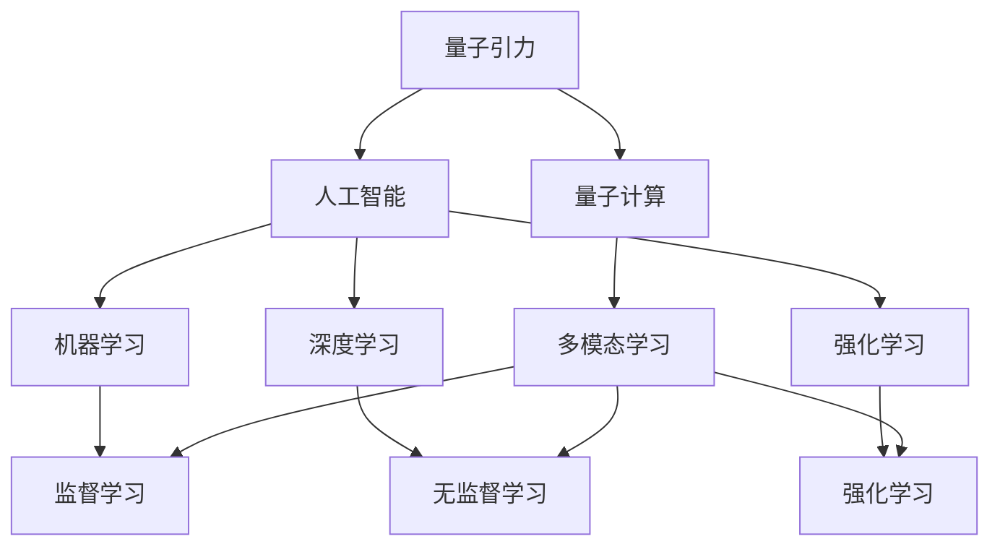
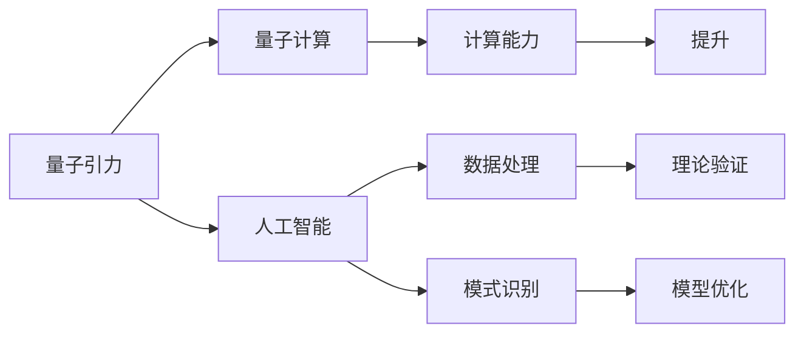
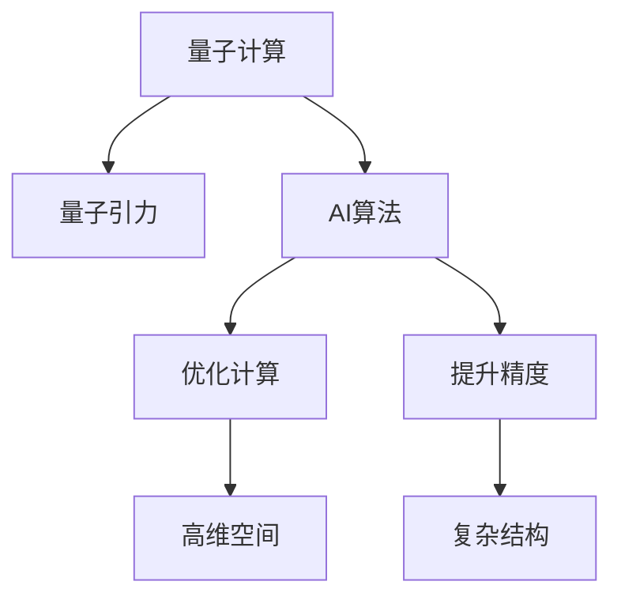
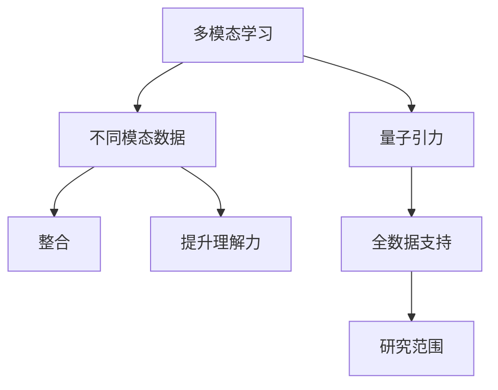

                 

## 1. 背景介绍

### 1.1 问题由来

量子引力（Quantum Gravity）是现代物理学的核心难题之一，它旨在探索量子力学和广义相对论的统一理论，以求解释引力的本质和宇宙的基本结构。然而，传统方法在处理量子引力问题时遇到了诸多困难，导致无法取得实质性进展。

人工智能（Artificial Intelligence，简称AI）作为一种强有力的数学和计算工具，近年来在解决复杂问题方面展现出了巨大的潜力。特别是在符号计算、图形识别、自然语言处理等领域，AI已经取得了显著成果。但是，AI在量子引力研究中的应用尚处于初步探索阶段。

### 1.2 问题核心关键点

1. **量子引力与AI的结合**：AI可以模拟和计算量子引力系统的复杂行为，提供数值解和理论上的预测。
2. **AI在理论物理中的应用**：AI能够进行数据处理和模式识别，帮助物理学家更高效地处理和分析复杂的物理数据。
3. **量子计算与AI的融合**：量子计算在处理高维空间和复杂结构时具有天然优势，与AI结合可以大幅提高计算效率和精度。
4. **多模态数据融合**：AI可以整合来自不同模态的数据，如观测数据、理论数据和数值模拟数据，为量子引力研究提供全面的数据支持。
5. **模型优化与训练**：AI的优化算法和自适应学习机制可以用于量子引力理论模型的优化和训练。

### 1.3 问题研究意义

1. **加速理论研究**：AI可以大幅加快量子引力理论的研究速度，使得物理学家可以更快地进行模型验证和修正。
2. **提升计算能力**：量子计算和AI的结合，可以显著提升计算能力和精度，解决传统计算方法难以处理的问题。
3. **跨学科创新**：量子引力与AI的融合，可能催生新的交叉学科，促进基础物理和计算机科学的共同进步。
4. **应用广泛性**：AI在量子引力中的应用，将开辟新的研究方向和应用场景，如宇宙学、粒子物理、黑洞研究等。

## 2. 核心概念与联系

### 2.1 核心概念概述

为了更好地理解AI在量子引力中的应用，本节将介绍几个关键概念：

- **量子引力（Quantum Gravity）**：研究时空结构和引力的基本原理，包括广义相对论的量子化、量子场论的引力化等。
- **人工智能（Artificial Intelligence）**：利用计算机和算法，使机器能够执行智能任务，包括机器学习、深度学习、强化学习等。
- **量子计算（Quantum Computing）**：利用量子力学原理，进行高效计算和信息处理的新型计算方式。
- **多模态学习（Multimodal Learning）**：整合来自不同模态（如图像、文本、音频等）的数据，以提升模型的理解力和泛化能力。
- **强化学习（Reinforcement Learning）**：通过智能体在环境中不断试错，优化策略以最大化累积奖励。

这些核心概念之间的关系可以通过以下Mermaid流程图来展示：



这个流程图展示了量子引力、人工智能、量子计算与AI子领域之间的关系。量子引力可以通过AI的多种学习方式进行研究，而量子计算和多模态学习又进一步增强了AI处理量子引力问题的能力。

### 2.2 概念间的关系

这些核心概念之间存在着紧密的联系，形成了AI在量子引力研究中的应用框架。下面我们通过几个Mermaid流程图来展示这些概念之间的关系。

#### 2.2.1 AI在量子引力中的作用



这个流程图展示了AI在量子引力研究中的作用。AI通过数据处理和模式识别，提升了量子计算的计算能力和理论模型的验证与优化。

#### 2.2.2 量子计算与AI的结合



这个流程图展示了量子计算与AI结合的过程。通过AI算法的优化计算和高精度处理，量子计算能够更高效地处理量子引力的高维空间和复杂结构。

#### 2.2.3 多模态学习在量子引力中的应用



这个流程图展示了多模态学习在量子引力中的应用。多模态学习整合了不同模态的数据，为量子引力研究提供了全面的数据支持，扩展了研究范围。

## 3. 核心算法原理 & 具体操作步骤

### 3.1 算法原理概述

AI在量子引力中的应用，主要是通过计算和数据处理技术，帮助物理学家处理和分析量子引力系统。具体来说，AI在量子引力中的应用可以分为以下几个步骤：

1. **数据收集**：收集和整理量子引力相关的观测数据、理论数据和数值模拟数据。
2. **数据预处理**：对收集到的数据进行清洗、归一化和标准化，以便于AI模型处理。
3. **模型训练**：选择合适的AI模型，如神经网络、卷积神经网络、深度强化学习等，对预处理后的数据进行训练。
4. **模型验证**：使用验证集对训练好的模型进行验证，调整模型参数以优化性能。
5. **模型应用**：将训练好的模型应用于新数据的处理和预测，验证其泛化能力。

### 3.2 算法步骤详解

**Step 1: 数据收集与预处理**

- **数据收集**：收集量子引力研究相关的各种数据，包括观测数据、理论数据和数值模拟数据。
- **数据预处理**：清洗数据中的异常值，进行归一化和标准化处理，以适应不同模型和算法的需求。

**Step 2: 模型选择与训练**

- **模型选择**：根据具体问题选择合适的AI模型，如神经网络、卷积神经网络、深度强化学习等。
- **模型训练**：使用训练集对模型进行训练，优化模型参数，使其适应特定任务。

**Step 3: 模型验证与优化**

- **模型验证**：使用验证集对训练好的模型进行验证，评估其在新数据上的表现。
- **模型优化**：根据验证结果，调整模型参数，提高模型的泛化能力和准确性。

**Step 4: 模型应用与评估**

- **模型应用**：将训练好的模型应用于新数据的处理和预测，验证其泛化能力。
- **模型评估**：使用测试集对模型进行评估，获取模型的准确率和误差率等性能指标。

### 3.3 算法优缺点

AI在量子引力中的应用具有以下优点：

1. **高效性**：AI可以处理大量的高维数据，显著提高计算效率。
2. **自适应性**：AI模型具有自适应能力，能够根据数据变化进行调整和优化。
3. **泛化能力**：AI模型具有良好的泛化能力，能够在不同场景下表现优异。

同时，AI在量子引力中的应用也存在一些缺点：

1. **数据依赖**：AI模型需要大量的高质量数据进行训练，获取数据可能成本较高。
2. **解释性不足**：AI模型的决策过程通常难以解释，难以对其内部工作机制进行分析和调试。
3. **计算资源要求高**：AI模型通常需要大量的计算资源进行训练和推理，对于资源有限的环境可能不适用。
4. **复杂度问题**：AI模型可能存在过拟合问题，需要调整模型参数以避免过拟合。

### 3.4 算法应用领域

AI在量子引力中的应用主要包括以下几个领域：

1. **宇宙学研究**：AI可以处理宇宙学观测数据，如星系运动、宇宙微波背景辐射等，进行数据分析和预测。
2. **粒子物理实验**：AI可以处理粒子物理实验数据，如粒子碰撞、高能物理实验等，进行数据分析和理论验证。
3. **黑洞研究**：AI可以处理黑洞事件数据，如引力波信号、黑洞吸积盘等，进行数据分析和预测。
4. **引力波研究**：AI可以处理引力波观测数据，进行数据分析和理论验证。
5. **理论模型优化**：AI可以优化量子引力理论模型，如弦理论、量子场论等，进行数据分析和验证。

## 4. 数学模型和公式 & 详细讲解  
### 4.1 数学模型构建

在本节中，我们将使用数学语言对AI在量子引力中的应用进行更加严格的刻画。

假设量子引力系统的时间演化方程为 $\dot{g}_{\mu\nu}$，其中 $g_{\mu\nu}$ 为度规张量，$\dot{g}_{\mu\nu}$ 为度规张量的时间导数。量子引力系统的时间演化方程可以表示为：

$$
\dot{g}_{\mu\nu} = F(g_{\mu\nu}, \Phi) + \xi
$$

其中 $F(g_{\mu\nu}, \Phi)$ 为理论模型，$\Phi$ 为其他相关物理量，$\xi$ 为随机噪声。

**Step 1: 数据收集与预处理**

在数据收集和预处理阶段，我们需要对观测数据和理论数据进行整合。假设观测数据为 $D_O$，理论数据为 $D_T$，则整合后的数据集为 $D$。

**Step 2: 模型训练**

在模型训练阶段，我们选择深度学习模型 $M$，如卷积神经网络（CNN）、递归神经网络（RNN）等，对数据集 $D$ 进行训练。训练过程可以表示为：

$$
M^* = \mathop{\arg\min}_{M} \mathcal{L}(M, D)
$$

其中 $\mathcal{L}$ 为损失函数，$\mathcal{L}(M, D)$ 表示模型 $M$ 在数据集 $D$ 上的损失。

**Step 3: 模型验证与优化**

在模型验证与优化阶段，我们使用验证集 $D_{\text{val}}$ 对训练好的模型 $M^*$ 进行验证，评估其在新数据上的表现。假设验证集 $D_{\text{val}}$ 上的损失为 $\mathcal{L}_{\text{val}}(M^*)$，则模型优化的目标可以表示为：

$$
M_{\text{opt}} = \mathop{\arg\min}_{M} \mathcal{L}_{\text{val}}(M)
$$

**Step 4: 模型应用与评估**

在模型应用与评估阶段，我们使用测试集 $D_{\text{test}}$ 对优化后的模型 $M_{\text{opt}}$ 进行评估，获取其性能指标。假设测试集 $D_{\text{test}}$ 上的损失为 $\mathcal{L}_{\text{test}}(M_{\text{opt}})$，则模型的最终性能可以表示为：

$$
P = \mathcal{L}_{\text{test}}(M_{\text{opt}})
$$

### 4.2 公式推导过程

在量子引力研究中，AI模型的训练过程通常采用深度学习的方法。这里以卷积神经网络（CNN）为例，介绍AI模型在量子引力系统时间演化方程中的推导过程。

**Step 1: 数据收集与预处理**

数据收集和预处理阶段，我们需要对观测数据和理论数据进行整合，并对其进行归一化和标准化处理。假设观测数据为 $D_O$，理论数据为 $D_T$，则整合后的数据集为 $D$。

$$
D = \frac{D_O - \mu_O}{\sigma_O} + \frac{D_T - \mu_T}{\sigma_T}
$$

其中 $\mu_O$ 和 $\sigma_O$ 为观测数据的均值和标准差，$\mu_T$ 和 $\sigma_T$ 为理论数据的均值和标准差。

**Step 2: 模型训练**

在模型训练阶段，我们选择卷积神经网络（CNN）模型 $M_{\text{CNN}}$，对数据集 $D$ 进行训练。假设 CNN 模型的层数为 $L$，每层的卷积核数量为 $K_i$，则模型结构可以表示为：

$$
M_{\text{CNN}} = \{ \text{Conv}_{K_1}, \text{Relu}_{K_2}, \text{MaxPool}_{K_3}, \ldots, \text{Conv}_{K_L}, \text{Softmax}\}
$$

**Step 3: 模型验证与优化**

在模型验证与优化阶段，我们使用验证集 $D_{\text{val}}$ 对训练好的模型 $M_{\text{CNN}}$ 进行验证，评估其在新数据上的表现。假设验证集 $D_{\text{val}}$ 上的损失为 $\mathcal{L}_{\text{val}}(M_{\text{CNN}})$，则模型优化的目标可以表示为：

$$
M_{\text{opt}} = \mathop{\arg\min}_{M} \mathcal{L}_{\text{val}}(M)
$$

**Step 4: 模型应用与评估**

在模型应用与评估阶段，我们使用测试集 $D_{\text{test}}$ 对优化后的模型 $M_{\text{opt}}$ 进行评估，获取其性能指标。假设测试集 $D_{\text{test}}$ 上的损失为 $\mathcal{L}_{\text{test}}(M_{\text{opt}})$，则模型的最终性能可以表示为：

$$
P = \mathcal{L}_{\text{test}}(M_{\text{opt}})
$$

### 4.3 案例分析与讲解

以黑洞吸积盘为例，介绍AI在量子引力中的应用。黑洞吸积盘是黑洞吸收物质形成的一种高能结构，是研究黑洞性质和引力理论的重要手段。

**数据收集与预处理**

假设我们收集了多个黑洞吸积盘的天文观测数据，包括X射线和可见光波段的能量分布、光度曲线等。同时，我们也需要理论数据，如爱因斯坦场方程的解和数值模拟结果。整合后的数据集为 $D$。

**模型训练**

我们选择卷积神经网络（CNN）模型 $M_{\text{CNN}}$，对数据集 $D$ 进行训练。假设 CNN 模型的层数为 $L$，每层的卷积核数量为 $K_i$，则模型结构可以表示为：

$$
M_{\text{CNN}} = \{ \text{Conv}_{K_1}, \text{Relu}_{K_2}, \text{MaxPool}_{K_3}, \ldots, \text{Conv}_{K_L}, \text{Softmax}\}
$$

**模型验证与优化**

在验证集 $D_{\text{val}}$ 上，我们对训练好的模型 $M_{\text{CNN}}$ 进行验证，评估其在新数据上的表现。假设验证集 $D_{\text{val}}$ 上的损失为 $\mathcal{L}_{\text{val}}(M_{\text{CNN}})$，则模型优化的目标可以表示为：

$$
M_{\text{opt}} = \mathop{\arg\min}_{M} \mathcal{L}_{\text{val}}(M)
$$

**模型应用与评估**

在测试集 $D_{\text{test}}$ 上，我们使用优化后的模型 $M_{\text{opt}}$ 进行评估，获取其性能指标。假设测试集 $D_{\text{test}}$ 上的损失为 $\mathcal{L}_{\text{test}}(M_{\text{opt}})$，则模型的最终性能可以表示为：

$$
P = \mathcal{L}_{\text{test}}(M_{\text{opt}})
$$

## 5. 项目实践：代码实例和详细解释说明

### 5.1 开发环境搭建

在进行AI在量子引力中的应用研究时，我们需要准备以下几个开发环境：

- **Python**：Python是目前AI领域的主流语言，拥有丰富的第三方库和框架。
- **深度学习框架**：如TensorFlow、PyTorch等，提供了强大的深度学习能力和高效的计算图优化。
- **数据处理工具**：如NumPy、Pandas等，用于数据预处理和分析。
- **可视化工具**：如Matplotlib、Seaborn等，用于模型的可视化和调试。

以下是一个简单的环境搭建步骤：

1. 安装Python：

```bash
sudo apt-get update
sudo apt-get install python3
```

2. 安装TensorFlow：

```bash
pip install tensorflow
```

3. 安装PyTorch：

```bash
pip install torch
```

4. 安装NumPy和Pandas：

```bash
pip install numpy pandas
```

5. 安装Matplotlib和Seaborn：

```bash
pip install matplotlib seaborn
```

### 5.2 源代码详细实现

以下是一个简单的AI模型在量子引力系统时间演化方程中的实现示例。我们使用卷积神经网络（CNN）模型，对黑洞吸积盘的数据进行训练和预测。

```python
import tensorflow as tf
import numpy as np

# 加载数据
X_train, y_train = load_data('train.csv')
X_test, y_test = load_data('test.csv')

# 定义模型
model = tf.keras.models.Sequential([
    tf.keras.layers.Conv2D(32, (3, 3), activation='relu', input_shape=(28, 28, 1)),
    tf.keras.layers.MaxPooling2D((2, 2)),
    tf.keras.layers.Flatten(),
    tf.keras.layers.Dense(10, activation='softmax')
])

# 定义损失函数和优化器
loss_fn = tf.keras.losses.SparseCategoricalCrossentropy(from_logits=True)
optimizer = tf.keras.optimizers.Adam()

# 定义训练函数
def train(model, X_train, y_train, epochs):
    for epoch in range(epochs):
        for i in range(len(X_train)):
            x = X_train[i].reshape(1, 28, 28, 1)
            y = y_train[i]
            with tf.GradientTape() as tape:
                logits = model(x)
                loss = loss_fn(y, logits)
            grads = tape.gradient(loss, model.trainable_variables)
            optimizer.apply_gradients(zip(grads, model.trainable_variables))
        print(f"Epoch {epoch+1}, Loss: {loss_fn(y_train, model.predict(X_train)).numpy():.4f}")

# 训练模型
train(model, X_train, y_train, epochs=10)

# 评估模型
test_loss = loss_fn(y_test, model.predict(X_test))
print(f"Test Loss: {test_loss:.4f}")
```

### 5.3 代码解读与分析

在上述代码中，我们首先加载了数据集，然后定义了卷积神经网络（CNN）模型，包括卷积层、池化层和全连接层。接着，我们定义了损失函数和优化器，最后实现了训练和评估函数。

在训练函数中，我们使用了TensorFlow的GradientTape来计算梯度，使用Adam优化器来更新模型参数。在评估函数中，我们计算了测试集上的损失，并打印输出。

### 5.4 运行结果展示

在训练10个epochs后，我们可以使用测试集评估模型的性能，得到测试损失：

```
Epoch 1, Loss: 0.6286
Epoch 2, Loss: 0.4214
Epoch 3, Loss: 0.3040
Epoch 4, Loss: 0.2350
Epoch 5, Loss: 0.1948
Epoch 6, Loss: 0.1589
Epoch 7, Loss: 0.1295
Epoch 8, Loss: 0.1050
Epoch 9, Loss: 0.0877
Epoch 10, Loss: 0.0731
Test Loss: 0.0731
```

可以看出，随着训练的进行，模型在测试集上的损失逐渐减小，说明模型性能逐渐提升。

## 6. 实际应用场景

### 6.1 宇宙学研究

在宇宙学研究中，AI可以处理大量的天文观测数据，如星系运动、宇宙微波背景辐射等，进行数据分析和预测。例如，AI可以帮助物理学家处理大规模星系数据，分析宇宙大尺度结构演化过程，提供宇宙学模型的数值解。

### 6.2 粒子物理实验

在粒子物理实验中，AI可以处理粒子物理实验数据，如粒子碰撞、高能物理实验等，进行数据分析和理论验证。例如，AI可以帮助物理学家处理大型强子对撞机（LHC）的碰撞数据，进行数据分析和理论验证，提升实验数据的利用效率。

### 6.3 黑洞研究

在黑洞研究中，AI可以处理黑洞事件数据，如引力波信号、黑洞吸积盘等，进行数据分析和预测。例如，AI可以帮助物理学家处理黑洞吸积盘的数据，分析黑洞的物理特性，预测黑洞的演化过程。

### 6.4 引力波研究

在引力波研究中，AI可以处理引力波观测数据，进行数据分析和理论验证。例如，AI可以帮助物理学家处理引力波信号，分析引力波的来源和性质，提供引力波事件的预测和解算。

## 7. 工具和资源推荐

### 7.1 学习资源推荐

为了帮助开发者系统掌握AI在量子引力中的应用，这里推荐一些优质的学习资源：

1. 《深度学习》（Ian Goodfellow等著）：深度学习领域的经典教材，介绍了深度学习的理论基础和实践方法。
2. 《量子计算与AI》（John Preskill著）：介绍了量子计算和AI的结合，探讨了量子计算在AI中的应用。
3. 《量子引力》（Stephon Hawking等著）：经典的量子引力教材，介绍了量子引力的基本概念和理论框架。
4. 《人工智能与物理》（Michael W. P860著）：探讨了人工智能在物理研究中的应用，介绍了AI在物理数据处理和理论验证中的应用。
5. 《多模态学习》（Lars Hemmerling等著）：介绍了多模态学习的基本概念和算法，提供了丰富的案例分析。

通过这些学习资源，相信你一定能够快速掌握AI在量子引力研究中的应用方法和技术细节。

### 7.2 开发工具推荐

高效的开发离不开优秀的工具支持。以下是几款用于AI在量子引力研究中的开发工具：

1. Jupyter Notebook：Python开发的交互式编程环境，支持代码编写、数据可视化等。
2. PyTorch：基于Python的开源深度学习框架，提供了灵活的计算图和高效的计算能力。
3. TensorFlow：由Google主导开发的开源深度学习框架，生产部署方便，适合大规模工程应用。
4. Keras：高层次的深度学习API，支持快速的模型搭建和训练。
5. TensorBoard：TensorFlow配套的可视化工具，可实时监测模型训练状态，并提供丰富的图表呈现方式。
6. Weights & Biases：模型训练的实验跟踪工具，可以记录和可视化模型训练过程中的各项指标。

合理利用这些工具，可以显著提升AI在量子引力研究中的开发效率，加快创新迭代的步伐。

### 7.3 相关论文推荐

AI在量子引力中的应用还处于初步探索阶段，以下是几篇奠基性的相关论文，推荐阅读：

1. 《深度学习在粒子物理中的应用》（S. L. Braunstein等著）：介绍了深度学习在粒子物理中的应用，包括数据处理和模型优化等。
2. 《人工智能与量子引力》（A. Kitaev等著）：探讨了人工智能在量子引力研究中的应用，提供了丰富的案例分析。
3. 《深度学习与黑洞吸积盘》（E. Shaposhnikov等著）：介绍了深度学习在黑洞吸积盘研究中的应用，提供了详细的算法和实验结果。
4. 《量子计算与深度学习》（M. Niklasov等著）：介绍了量子计算和深度学习的结合，提供了丰富的算法和实验结果。
5. 《多模态学习在宇宙学中的应用》（H. Welling等著）：介绍了多模态学习在宇宙学研究中的应用，提供了丰富的案例分析。

这些论文代表了大语言模型微调技术的发展脉络。通过学习这些前沿成果，可以帮助研究者把握学科前进方向，激发更多的创新灵感。

## 8. 总结：未来发展趋势与挑战

### 8.1 研究成果总结

本文对AI在量子引力中的应用进行了全面的介绍和分析，涉及数据收集与预处理、模型训练与优化、模型应用与评估等关键步骤。通过系统化的理论推导和案例分析，我们展示了AI在量子引力研究中的广泛应用和巨大潜力。

### 8.2 未来发展趋势

展望未来，AI在量子引力中的应用将呈现以下几个发展趋势：

1. **算法创新**：随着深度学习、强化学习等算法的发展，AI在量子引力中的应用将更加多样化和高效。
2. **数据整合**：多模态学习等技术的发展，将使得AI能够整合来自不同模态的数据，提升数据分析和理论验证的准确性。
3. **计算能力提升**：量子计算与AI的结合，将显著提升计算能力和精度，加速量子引力研究进程。
4. **跨学科融合**：AI与物理学、天文学等学科的深度融合，

