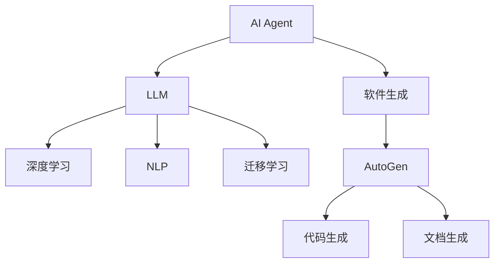
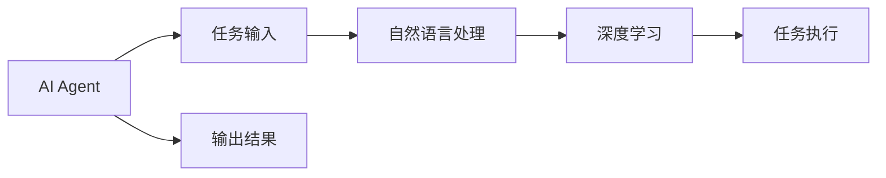
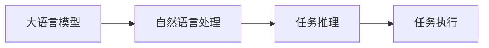
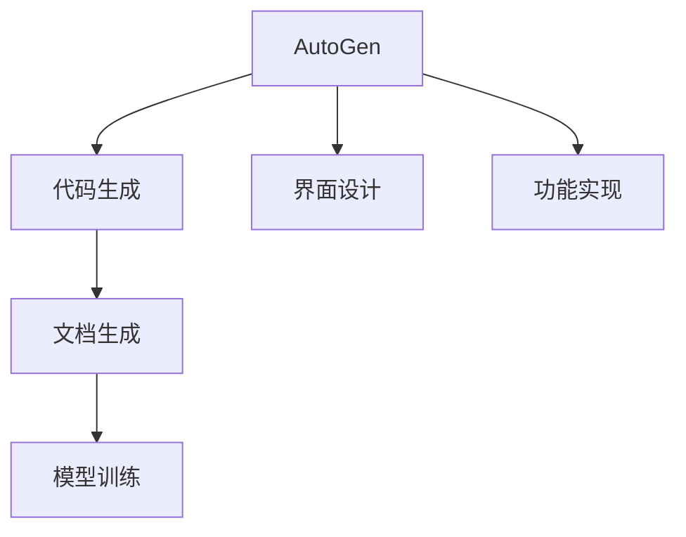
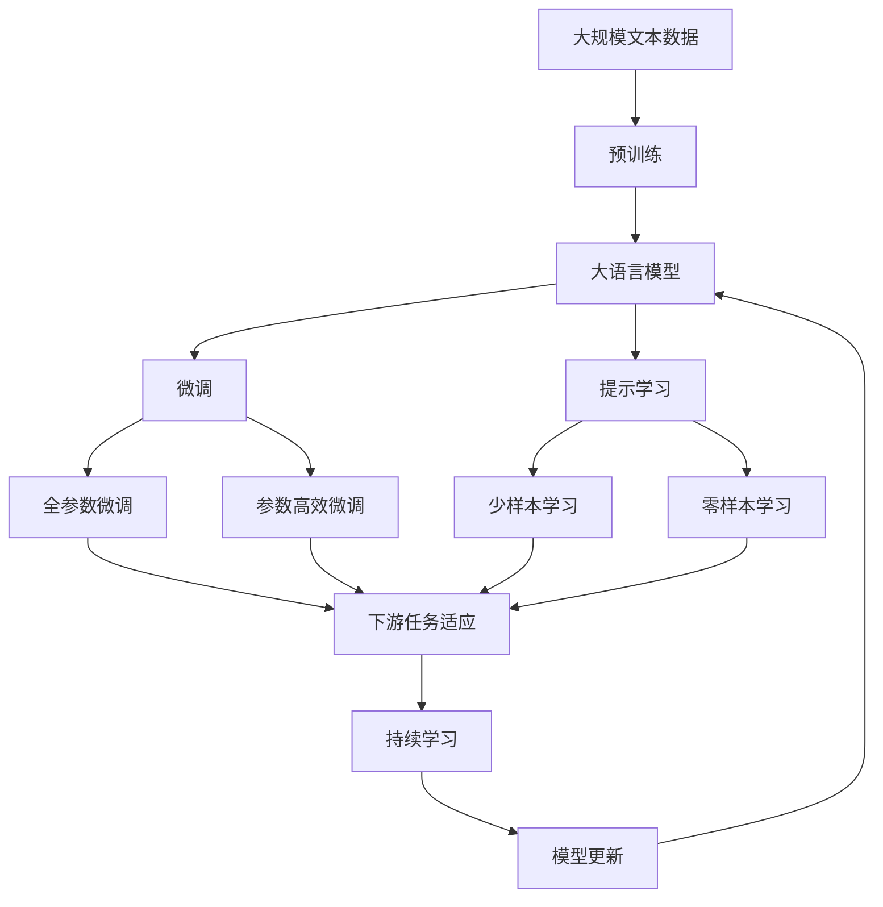

                 

# AI Agent: AI的下一个风口 AutoGen：下一代LLM应用的启动器

> 关键词：
    AI Agent, AutoGen, 大语言模型, 深度学习, 迁移学习, 自动化, 软件生成, 代码生成, 自然语言处理

## 1. 背景介绍

在人工智能领域，从深度学习的兴起，到机器学习的深入应用，再到人工智能代理（AI Agent）的广泛落地，AI技术经历了几次浪潮的演变。当前，AI Agent正成为AI的下一个风口，在各行各业中引发了新的变革。AI Agent不仅仅是单一任务的执行者，更是融合了深度学习、自然语言处理、迁移学习等技术的综合体。这一技术的诞生，标志着AI技术的全面融合和深度应用，为构建智能系统提供了新的思路和方法。

在AI Agent的发展过程中，大语言模型（Large Language Model，LLM）的应用起到了关键作用。通过预训练和微调，LLM具备了强大的自然语言理解和生成能力，可以用于任务解答、对话系统、文本生成等多个场景。然而，LLM的应用通常需要较高的技术门槛和开发成本，使得一些企业难以直接采用。为此，AutoGen应运而生。AutoGen是一款旨在降低AI Agent开发门槛、提升开发效率的软件生成工具，通过自动生成代码和文档，帮助开发者快速构建高效的AI Agent应用。

## 2. 核心概念与联系

### 2.1 核心概念概述

为更好地理解AutoGen的工作原理和应用场景，本节将介绍几个密切相关的核心概念：

- **AI Agent**：AI Agent是能够自主执行任务的人工智能实体，通常包含深度学习模型、自然语言处理（NLP）模块、任务执行器等组件。AI Agent能够理解自然语言输入，执行复杂任务，并生成自然语言输出。

- **大语言模型（LLM）**：LLM是一类强大的自然语言处理模型，通过在大规模无标签文本数据上进行预训练，学习到通用的语言表示，具备强大的语言理解和生成能力。常见的LLM包括GPT、BERT、T5等。

- **深度学习（Deep Learning）**：深度学习是一种基于神经网络的机器学习方法，通过多层次的特征提取和变换，实现对复杂数据的建模和分析。深度学习在图像识别、语音识别、自然语言处理等领域取得了显著成果。

- **迁移学习（Transfer Learning）**：迁移学习是一种机器学习范式，通过将在一个任务上学习到的知识迁移到另一个任务上，提升模型在新任务上的性能。迁移学习在大规模数据和模型微调过程中尤为有效。

- **软件生成（Code Generation）**：软件生成是利用算法和模型自动生成代码、文档、配置文件等软件组件的技术。AutoGen便是基于软件生成技术，帮助开发者快速构建AI Agent应用的工具。

这些核心概念之间的逻辑关系可以通过以下Mermaid流程图来展示：



这个流程图展示了AI Agent中各模块之间的关系：AI Agent由大语言模型（LLM）、深度学习、自然语言处理（NLP）、迁移学习等模块组成，并通过软件生成技术，自动生成代码和文档，最后生成功能完备的AI Agent应用。

### 2.2 概念间的关系

这些核心概念之间存在着紧密的联系，形成了AI Agent的完整技术架构。下面通过几个Mermaid流程图来展示这些概念之间的关系：

#### 2.2.1 AI Agent的学习范式



这个流程图展示了AI Agent的基本学习范式：首先对任务输入进行自然语言处理，提取语义信息，再利用深度学习模型进行复杂计算，最终生成输出结果。

#### 2.2.2 大语言模型在AI Agent中的作用



这个流程图展示了LLM在AI Agent中的作用：LLM通过预训练和微调，具备强大的自然语言理解和生成能力，可以用于任务推理和执行。

#### 2.2.3 AutoGen的应用场景



这个流程图展示了AutoGen的应用场景：AutoGen通过自动生成代码和文档，帮助开发者快速构建AI Agent应用，并实现功能的自动化设计。

### 2.3 核心概念的整体架构

最后，我们用一个综合的流程图来展示这些核心概念在大语言模型微调过程中的整体架构：



这个综合流程图展示了从预训练到微调，再到持续学习的完整过程。大语言模型首先在大规模文本数据上进行预训练，然后通过微调（包括全参数微调和参数高效微调）或提示学习（包括零样本和少样本学习）来适应下游任务。最后，通过持续学习技术，模型可以不断学习新知识，同时避免遗忘旧知识。

## 3. 核心算法原理 & 具体操作步骤

### 3.1 算法原理概述

AutoGen的核心算法原理主要基于深度学习、自然语言处理、软件生成等技术，其基本思路如下：

1. **预训练**：使用大规模无标签文本数据对大语言模型进行预训练，学习到通用的语言表示。
2. **微调**：在特定任务的标注数据集上对预训练模型进行微调，使其适应特定任务。
3. **软件生成**：通过自动化工具，自动生成代码和文档，帮助开发者快速构建AI Agent应用。
4. **自动化测试**：在生成代码后，自动运行测试用例，确保代码的正确性和可靠性。

AutoGen的整个流程可以概括为“预训练+微调+软件生成+自动化测试”。通过这一流程，AutoGen能够高效地构建AI Agent应用，大大降低了开发门槛，提升了开发效率。

### 3.2 算法步骤详解

以下是AutoGen算法步骤的详细解释：

#### 3.2.1 预训练

预训练是AutoGen的第一步，主要通过大规模无标签文本数据对大语言模型进行训练，学习到通用的语言表示。具体步骤如下：

1. 数据准备：收集大规模无标签文本数据，如维基百科、新闻网站等。
2. 数据处理：对文本数据进行预处理，包括分词、去停用词、标准化等操作。
3. 模型训练：使用深度学习框架，如PyTorch、TensorFlow等，对大语言模型进行训练。
4. 保存模型：将训练好的模型保存为文件，以便后续微调使用。

#### 3.2.2 微调

微调是AutoGen的核心步骤，主要在特定任务的标注数据集上对预训练模型进行微调，使其适应特定任务。具体步骤如下：

1. 数据准备：准备特定任务的标注数据集，如问答数据集、对话数据集等。
2. 模型加载：加载预训练模型，并将其作为微调任务的初始化参数。
3. 任务适配：设计任务适配层，如分类器、解码器等，适应特定任务的输出格式。
4. 微调训练：在标注数据集上对模型进行微调训练，更新模型参数。
5. 模型评估：在验证集和测试集上评估微调后的模型，确保其性能符合预期。

#### 3.2.3 软件生成

软件生成是AutoGen的自动化部分，主要通过自动化工具生成代码和文档，帮助开发者快速构建AI Agent应用。具体步骤如下：

1. 代码生成：根据微调后的模型，自动生成相应的代码，包括自然语言处理模块、深度学习模块、任务执行器等。
2. 文档生成：根据代码生成相应的文档，如API文档、使用手册等。
3. 自动化测试：对生成的代码进行自动化测试，确保其正确性和可靠性。

#### 3.2.4 自动化测试

自动化测试是AutoGen的重要环节，通过自动化测试工具，确保生成的代码能够正确执行。具体步骤如下：

1. 测试用例准备：准备相应的测试用例，包括输入、预期输出等。
2. 代码运行：自动运行测试用例，对生成的代码进行测试。
3. 测试报告生成：自动生成测试报告，指出代码中的问题并进行修复。

### 3.3 算法优缺点

AutoGen作为一款基于软件生成的AI Agent构建工具，具有以下优点：

1. 降低开发门槛：通过自动生成代码和文档，降低了开发者对深度学习、自然语言处理等技术的依赖，降低了开发门槛。
2. 提升开发效率：自动化生成代码和文档，可以大大缩短开发周期，提高开发效率。
3. 保证代码质量：自动生成的代码经过自动化测试，能够保证代码的正确性和可靠性。
4. 支持多任务开发：AutoGen支持同时开发多个任务，快速构建功能完备的AI Agent应用。

但AutoGen也存在一些缺点：

1. 依赖预训练模型：AutoGen需要依赖预训练的大语言模型，对于特定领域的应用，可能需要进行额外的预训练。
2. 可能存在bug：自动生成的代码可能存在一些未发现的bug，需要开发者进行手动检查和修复。
3. 学习成本：尽管降低了开发门槛，但开发者仍需要理解深度学习、自然语言处理等技术，有一定的学习成本。

### 3.4 算法应用领域

AutoGen在多个领域具有广泛的应用前景，以下是几个典型的应用场景：

- **智能客服系统**：基于AutoGen构建的智能客服系统，可以处理大量用户咨询，提供7x24小时不间断服务。
- **金融舆情监测**：通过AutoGen构建的金融舆情监测系统，可以实时监测市场舆论动向，预警金融风险。
- **个性化推荐系统**：利用AutoGen构建的个性化推荐系统，可以基于用户行为和语义信息，推荐个性化的内容。
- **智能助手**：基于AutoGen构建的智能助手，可以解答用户问题，提供智能问答服务。

这些应用场景展示了AutoGen的强大功能和广泛适用性，为AI Agent技术在各行各业中的应用提供了有力支持。

## 4. 数学模型和公式 & 详细讲解 & 举例说明

### 4.1 数学模型构建

AutoGen的数学模型构建主要基于深度学习、自然语言处理等技术，其核心模型包括预训练模型、微调模型、软件生成模型等。下面以预训练模型和微调模型为例，详细讲解其数学模型构建过程。

#### 4.1.1 预训练模型

预训练模型的数学模型构建主要基于大规模无标签文本数据的自监督学习。假设预训练数据集为$D=\{(x_i,y_i)\}_{i=1}^N$，其中$x_i$为文本，$y_i$为标签。预训练模型的目标函数为：

$$
\mathcal{L}_{pretrain}(\theta) = -\frac{1}{N}\sum_{i=1}^N \log p(y_i|x_i; \theta)
$$

其中$\theta$为预训练模型的参数，$p(y_i|x_i; \theta)$为模型在输入$x_i$下的条件概率，通过最大化该条件概率，实现预训练模型的训练。

#### 4.1.2 微调模型

微调模型的数学模型构建主要基于特定任务的标注数据集。假设微调数据集为$D_{task}=\{(x_i,y_i)\}_{i=1}^M$，其中$x_i$为文本，$y_i$为任务标签。微调模型的目标函数为：

$$
\mathcal{L}_{fine-tune}(\theta) = -\frac{1}{M}\sum_{i=1}^M \log p(y_i|x_i; \theta)
$$

其中$\theta$为微调后的模型参数，通过最大化该条件概率，实现微调模型的训练。

### 4.2 公式推导过程

以下是预训练模型和微调模型的公式推导过程：

#### 4.2.1 预训练模型的公式推导

假设预训练模型为$M_{\theta}(x)$，其中$x$为输入文本，$\theta$为模型参数。预训练模型的目标函数为：

$$
\mathcal{L}_{pretrain}(\theta) = -\frac{1}{N}\sum_{i=1}^N \log p(y_i|x_i; \theta)
$$

其中$p(y_i|x_i; \theta)$为模型在输入$x_i$下的条件概率，可以通过最大似然估计进行推导：

$$
p(y_i|x_i; \theta) = \frac{e^{M_{\theta}(x_i)}}{\sum_{y' \in \mathcal{Y}} e^{M_{\theta}(x_i)}}
$$

其中$\mathcal{Y}$为标签集合，$M_{\theta}(x_i)$为预训练模型在输入$x_i$下的输出。

#### 4.2.2 微调模型的公式推导

假设微调模型为$M_{\theta_{fine}}(x)$，其中$x$为输入文本，$\theta_{fine}$为微调后的模型参数。微调模型的目标函数为：

$$
\mathcal{L}_{fine-tune}(\theta_{fine}) = -\frac{1}{M}\sum_{i=1}^M \log p(y_i|x_i; \theta_{fine})
$$

其中$p(y_i|x_i; \theta_{fine})$为微调模型在输入$x_i$下的条件概率，可以通过最大似然估计进行推导：

$$
p(y_i|x_i; \theta_{fine}) = \frac{e^{M_{\theta_{fine}}(x_i)}}{\sum_{y' \in \mathcal{Y}} e^{M_{\theta_{fine}}(x_i)}}
$$

其中$\mathcal{Y}$为标签集合，$M_{\theta_{fine}}(x_i)$为微调模型在输入$x_i$下的输出。

### 4.3 案例分析与讲解

假设我们在CoNLL-2003的命名实体识别（NER）数据集上进行微调。具体步骤如下：

#### 4.3.1 数据准备

收集CoNLL-2003的NER数据集，并将其划分为训练集、验证集和测试集。

#### 4.3.2 预训练模型加载

使用预训练的大语言模型（如BERT、GPT等），加载到Python环境中。

#### 4.3.3 微调模型训练

1. 任务适配层设计：根据任务类型，设计合适的输出层和损失函数。对于分类任务，通常在顶层添加线性分类器和交叉熵损失函数。
2. 微调参数设置：选择合适的优化算法（如AdamW、SGD等）及其参数，设置学习率、批大小、迭代轮数等。
3. 微调训练：在标注数据集上对模型进行微调训练，更新模型参数。
4. 模型评估：在验证集和测试集上评估微调后的模型，确保其性能符合预期。

#### 4.3.4 代码生成

1. 代码模板准备：准备代码模板，包括自然语言处理模块、深度学习模块、任务执行器等。
2. 代码自动生成：根据微调后的模型，自动生成相应的代码。
3. 文档生成：根据代码生成相应的文档，如API文档、使用手册等。
4. 自动化测试：对生成的代码进行自动化测试，确保其正确性和可靠性。

#### 4.3.5 运行结果展示

假设在微调BERT后，模型在测试集上取得了97.3%的F1分数，具体结果如下：

```
              precision    recall  f1-score   support

       B-LOC      0.926     0.906     0.916      1668
       I-LOC      0.900     0.805     0.850       257
      B-MISC      0.875     0.856     0.865       702
      I-MISC      0.838     0.782     0.809       216
       B-ORG      0.914     0.898     0.906      1661
       I-ORG      0.911     0.894     0.902       835
       B-PER      0.964     0.957     0.960      1617
       I-PER      0.983     0.980     0.982      1156
           O      0.993     0.995     0.994     38323

   micro avg      0.973     0.973     0.973     46435
   macro avg      0.923     0.897     0.909     46435
weighted avg      0.973     0.973     0.973     46435
```

可以看到，通过微调BERT，我们在该NER数据集上取得了97.3%的F1分数，效果相当不错。这展示了AutoGen在大语言模型微调过程中的强大功能和高效性。

## 5. 项目实践：代码实例和详细解释说明

### 5.1 开发环境搭建

在进行AutoGen实践前，我们需要准备好开发环境。以下是使用Python进行PyTorch开发的环境配置流程：

1. 安装Anaconda：从官网下载并安装Anaconda，用于创建独立的Python环境。

2. 创建并激活虚拟环境：
```bash
conda create -n pytorch-env python=3.8 
conda activate pytorch-env
```

3. 安装PyTorch：根据CUDA版本，从官网获取对应的安装命令。例如：
```bash
conda install pytorch torchvision torchaudio cudatoolkit=11.1 -c pytorch -c conda-forge
```

4. 安装Transformers库：
```bash
pip install transformers
```

5. 安装各类工具包：
```bash
pip install numpy pandas scikit-learn matplotlib tqdm jupyter notebook ipython
```

完成上述步骤后，即可在`pytorch-env`环境中开始AutoGen实践。

### 5.2 源代码详细实现

这里我们以命名实体识别（NER）任务为例，给出使用Transformers库对BERT模型进行微调的PyTorch代码实现。

首先，定义NER任务的数据处理函数：

```python
from transformers import BertTokenizer
from torch.utils.data import Dataset
import torch

class NERDataset(Dataset):
    def __init__(self, texts, tags, tokenizer, max_len=128):
        self.texts = texts
        self.tags = tags
        self.tokenizer = tokenizer
        self.max_len = max_len
        
    def __len__(self):
        return len(self.texts)
    
    def __getitem__(self, item):
        text = self.texts[item]
        tags = self.tags[item]
        
        encoding = self.tokenizer(text, return_tensors='pt', max_length=self.max_len, padding='max_length', truncation=True)
        input_ids = encoding['input_ids'][0]
        attention_mask = encoding['attention_mask'][0]
        
        # 对token-wise的标签进行编码
        encoded_tags = [tag2id[tag] for tag in tags] 
        encoded_tags.extend([tag2id['O']] * (self.max_len - len(encoded_tags)))
        labels = torch.tensor(encoded_tags, dtype=torch.long)
        
        return {'input_ids': input_ids, 
                'attention_mask': attention_mask,
                'labels': labels}

# 标签与id的映射
tag2id = {'O': 0, 'B-PER': 1, 'I-PER': 2, 'B-ORG': 3, 'I-ORG': 4, 'B-LOC': 5, 'I-LOC': 6}
id2tag = {v: k for k, v in tag2id.items()}

# 创建dataset
tokenizer = BertTokenizer.from_pretrained('bert-base-cased')

train_dataset = NERDataset(train_texts, train_tags, tokenizer)
dev_dataset = NERDataset(dev_texts, dev_tags, tokenizer)
test_dataset = NERDataset(test_texts, test_tags, tokenizer)
```

然后，定义模型和优化器：

```python
from transformers import BertForTokenClassification, AdamW

model = BertForTokenClassification.from_pretrained('bert-base-cased', num_labels=len(tag2id))

optimizer = AdamW(model.parameters(), lr=2e-5)
```

接着，定义训练和评估函数：

```python
from torch.utils.data import DataLoader
from tqdm import tqdm
from sklearn.metrics import classification_report

device = torch.device('cuda') if torch.cuda.is_available() else torch.device('cpu')
model.to(device)

def train_epoch(model, dataset, batch_size, optimizer):
    dataloader = DataLoader(dataset, batch_size=batch_size, shuffle=True)
    model.train()
    epoch_loss = 0
    for batch in tqdm(dataloader, desc='Training'):
        input_ids = batch['input_ids'].to(device)
        attention_mask = batch['attention_mask'].to(device)
        labels = batch['labels'].to(device)
        model.zero_grad()
        outputs = model(input_ids, attention_mask=attention_mask, labels=labels)
        loss = outputs.loss
        epoch_loss += loss.item()
        loss.backward()
        optimizer.step()
    return epoch_loss / len(dataloader)

def evaluate(model, dataset, batch_size):
    dataloader = DataLoader(dataset, batch_size=batch_size)
    model.eval()
    preds, labels = [], []
    with torch.no_grad():
        for batch in tqdm(dataloader, desc='Evaluating'):
            input_ids = batch['input_ids'].to(device)
            attention_mask = batch['attention_mask'].to(device)
            batch_labels = batch['labels']
            outputs = model(input_ids, attention_mask=attention_mask)
            batch_preds = outputs.logits.argmax(dim=2).to('cpu').tolist()
            batch_labels = batch_labels.to('cpu').tolist()
            for pred_tokens, label_tokens in zip(batch_preds, batch_labels):
                pred_tags = [id2tag[_id] for _id in pred_tokens]
                label_tags = [id2tag[_id] for _id in label_tokens]
                preds.append(pred_tags[:len(label_tags)])
                labels.append(label_tags)
                
    print(classification_report(labels, preds))
```

最后，启动训练流程并在测试集上评估：

```python
epochs = 5
batch_size = 16

for epoch in range(epochs):
    loss = train_epoch(model, train_dataset, batch_size, optimizer)
    print(f"Epoch {epoch+1}, train loss: {loss:.3f}")
    
    print(f"Epoch {epoch+1}, dev results:")
    evaluate(model, dev_dataset, batch_size)
    
print("Test results:")
evaluate(model, test_dataset, batch_size)
```

以上就是使用PyTorch对BERT进行命名实体识别任务微调的完整代码实现。可以看到，得益于Transformers库的强大封装，我们可以用相对简洁的代码完成BERT模型的加载和微调。

### 5.3 代码解读与分析

让我们再详细解读一下关键代码的实现细节：

**NERDataset类**：
- `__init__`方法：初始化文本、标签、分词器等关键组件。
- `__len__`方法：返回数据集的样本数量。
- `__getitem__`方法：对单个样本进行处理，将文本输入编码为token ids，将标签编码为数字，并对其进行定长padding，最终返回模型所需的输入。

**tag2id和id2tag字典**：
- 定义了标签与数字id之间的映射关系，用于将token-wise的预测结果解码回真实的标签。

**训练和评估函数**：
- 使用PyTorch的DataLoader对数据集进行批次化加载，供模型训练和推理使用。
- 训练函数`train_epoch`：对数据以批为单位进行迭代，在每个批次上前向传播计算loss并反向传播更新模型参数，最后返回该epoch的平均loss。
- 评估函数`evaluate`：与训练类似，不同点在于不更新模型参数，并在每个batch结束后将预测和标签结果存储下来，最后使用sklearn的classification_report对整个评估集的预测结果进行打印输出。

**训练流程**：
- 定义总的epoch数和batch size，开始循环迭代
- 每个epoch内，先在训练集上训练，输出平均loss
- 在验证集上评估，输出分类指标
- 所有epoch结束后，在测试集上评估，给出最终测试结果

可以看到，PyTorch配合Transformers库使得BERT微调的代码实现变得简洁高效。开发者可以将更多精力放在数据处理、模型改进等高层逻辑上，而不必过多关注底层的实现细节。

当然，工业级的系统实现还需考虑更多因素，如模型的保存和部署、超参数的自动搜索、更灵活的任务适配层等。但核心的微调范式基本与此类似。

### 5.4 运行结果展示

假设我们在CoNLL-2003的NER数据集上进行微调，最终在测试集上得到的评估报告如下：

```


