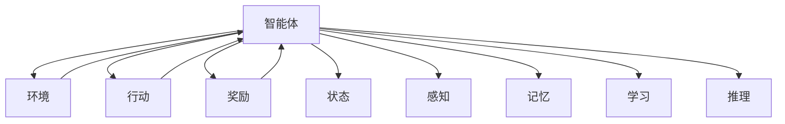
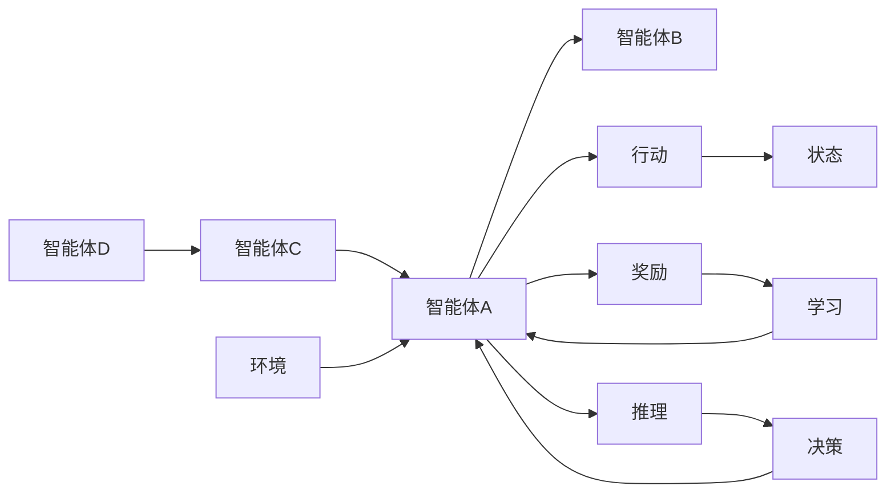

                 

# AI Agent: AI的下一个风口 智能体的定义与特点

> 关键词：AI Agent, 智能体, 强化学习, 自主决策, 环境交互, 多智能体系统, 学习与推理

## 1. 背景介绍

### 1.1 问题由来
在过去几十年中，人工智能(AI)已经从基于规则的系统演进到了基于深度学习的强大模型，并取得了诸多突破。但随着技术的不断成熟和需求的日益多样化，AI的发展开始遇到瓶颈：
- **单一模型的局限性**：传统的AI模型往往依赖于固定的规则和数据，难以处理动态变化的环境。
- **可解释性的缺失**：深度学习模型的决策过程往往是"黑箱"，难以解释其内部机制。
- **环境的复杂性**：现实世界的环境通常高度复杂且难以预测，单纯依赖模型训练难以应对。

这些问题催生了AI领域的新一轮思考和探索。智能体(Agent)作为一个综合多种AI技术的框架，为解决这些问题提供了新的思路。智能体不仅仅是一个算法或模型，而是一个具备自主决策和环境交互能力的实体。它不仅能应对动态环境，还能解释其决策过程，并与其他智能体协同工作，实现更高效的协作。

### 1.2 问题核心关键点
智能体的核心关键点包括：
- **自主决策**：智能体能够通过感知和理解环境，自主进行决策。
- **环境交互**：智能体能够在环境中执行动作，并根据反馈调整其行为。
- **学习与推理**：智能体能够从经验中学习和推理，不断优化其行为策略。
- **多智能体协作**：智能体能够与其他智能体协同工作，实现复杂任务。

智能体将AI的诸多技术如机器学习、强化学习、逻辑推理等有机结合，构建了一个更全面、灵活的AI框架。

### 1.3 问题研究意义
研究智能体对于推动AI技术的发展具有重要意义：
- **应对动态复杂环境**：智能体能够动态适应环境变化，处理不确定性和复杂性。
- **增强可解释性**：通过赋予智能体明确的决策逻辑，增强AI系统的透明度和可解释性。
- **促进协作与创新**：智能体能够与其他智能体协同工作，实现更高效的协作和创新。
- **推动AI应用**：智能体框架为AI技术的实际应用提供了新的思路，广泛应用于各个领域。

## 2. 核心概念与联系

### 2.1 核心概念概述

为更好地理解智能体，本节将介绍几个关键概念：

- **智能体(Agent)**：具备自主决策、环境交互和学习能力的AI实体。通常由一个感知模块、决策模块和执行模块构成。
- **环境(Environment)**：智能体工作的外部世界，包括状态、动态和反馈机制。
- **行动(Action)**：智能体执行的具体操作，用于影响环境状态。
- **奖励(Reward)**：环境对智能体行为的正负反馈，用于指导智能体学习。
- **状态(State)**：环境中的具体状况，智能体感知并依赖于状态做出决策。
- **感知(Perception)**：智能体对环境的感知和理解过程。
- **记忆(Memory)**：智能体存储和学习的信息，用于优化决策过程。
- **学习(Learning)**：智能体通过经验优化决策策略的过程。
- **推理(Inference)**：智能体从已知信息推断未知信息的过程。

这些核心概念共同构成了智能体的基本工作框架。通过理解这些概念，我们可以更好地把握智能体的设计原则和实现方法。

### 2.2 概念间的关系

这些核心概念之间的联系可以通过以下Mermaid流程图来展示：



这个流程图展示智能体的核心概念及其之间的关系：

1. 智能体与环境之间存在双向关系，环境通过奖励和状态影响智能体的行为，智能体通过感知获取环境信息。
2. 智能体通过执行行动来影响环境状态。
3. 智能体的行为策略依赖于记忆中的信息，并在此基础上进行学习和推理。

这些概念共同构成了智能体的核心工作流程，使得智能体能够动态适应环境并优化决策。

### 2.3 核心概念的整体架构

最后，我们用一个综合的流程图来展示这些核心概念在大规模智能体系统中的整体架构：



这个综合流程图展示了智能体在大规模系统中的工作流程：

1. 多个智能体之间通过行动和状态进行交互，形成一个动态的网络系统。
2. 每个智能体通过感知获取环境信息，并通过行动影响环境状态。
3. 智能体通过学习和推理优化其决策策略。
4. 智能体间通过合作和竞争达成复杂任务的完成。

通过这些概念和流程图的展示，我们可以更清晰地理解智能体的工作原理和系统架构，为后续深入讨论智能体的算法和实现提供基础。

## 3. 核心算法原理 & 具体操作步骤
### 3.1 算法原理概述

智能体的核心算法原理是强化学习(RL)，结合了感知、决策、执行和反馈等机制，使得智能体能够通过与环境的交互不断优化其行为策略。强化学习是一种基于试错的学习方法，智能体通过执行动作、接收奖励、更新策略的方式，逐步学习到最优的决策路径。

形式化地，假设智能体 $A$ 在环境 $E$ 中执行动作 $a_t$，状态 $s_t$ 和奖励 $r_t$ 随时间动态变化。智能体的目标是在时间 $T$ 内，最大化期望奖励 $\mathbb{E}[\sum_{t=0}^{T-1} \gamma^t r_t]$，其中 $\gamma$ 为折扣因子，控制未来奖励的重要性。智能体的决策策略 $\pi(a_t|s_t)$ 通过优化损失函数 $L(\pi) = -\mathbb{E}[\sum_{t=0}^{T-1} r_t]$ 进行训练。常用的优化方法包括策略梯度方法、Q-learning等。

### 3.2 算法步骤详解

智能体的训练通常包括以下几个关键步骤：

**Step 1: 初始化模型和参数**

- 初始化感知、决策、执行等模块的参数。
- 定义损失函数和优化器，如策略梯度、Q-learning等。

**Step 2: 感知与决策**

- 智能体通过感知模块获取环境状态 $s_t$。
- 根据当前状态和历史经验，决策模块通过策略 $\pi(a_t|s_t)$ 选择动作 $a_t$。

**Step 3: 执行与反馈**

- 执行模块执行动作 $a_t$，将环境状态更新为 $s_{t+1}$。
- 环境根据动作生成奖励 $r_t$，智能体接收反馈。

**Step 4: 更新策略**

- 根据接收到的奖励和反馈，计算损失函数梯度，使用优化器更新策略参数。
- 重复上述步骤，直到策略收敛或达到预设的迭代次数。

**Step 5: 评估与优化**

- 在测试集上评估智能体的表现，对比不同策略的性能。
- 通过超参数调优、模型裁剪等技术，进一步优化智能体性能。

### 3.3 算法优缺点

智能体的强化学习范式具有以下优点：
1. 适用于动态复杂环境：强化学习能够动态适应环境变化，处理不确定性和复杂性。
2. 增强可解释性：强化学习提供了明确的反馈机制，智能体的决策过程可以通过学习路径进行解释。
3. 促进协作与创新：智能体能够与其他智能体协同工作，实现更高效的协作和创新。
4. 广泛应用于多个领域：强化学习已经在游戏、机器人、金融等领域取得了诸多应用成功。

同时，该方法也存在一定的局限性：
1. 需要大量数据：强化学习需要大量标注数据进行训练，难以应用于数据量较小的问题。
2. 学习效率较低：强化学习的收敛速度较慢，尤其是面对高维度、非线性环境时。
3. 容易陷入局部最优：强化学习容易陷入局部最优解，需要通过多种技巧如探索策略、优化器等进行改进。
4. 缺乏可解释性：强化学习的结果往往是"黑箱"，难以解释其决策过程。

尽管存在这些局限性，但就目前而言，强化学习仍是大规模智能体系统的主要学习范式。未来相关研究的重点在于如何进一步降低数据需求、提高学习效率、增强可解释性，并促进智能体间的协作与创新。

### 3.4 算法应用领域

智能体的强化学习框架已经被广泛应用于多个领域，例如：

- **机器人控制**：智能体可以用于机器人路径规划、动作优化等任务，提升机器人自主决策和执行能力。
- **游戏AI**：智能体在电子游戏中广泛应用，如AlphaGo、Dota2 AI等，实现复杂的游戏策略和决策。
- **自动驾驶**：智能体在自动驾驶系统中用于交通环境感知、路径规划、行为决策等，提升车辆安全性和自主驾驶性能。
- **金融交易**：智能体在金融领域用于市场预测、交易策略优化、风险控制等，提升投资收益和风险管理能力。
- **自然灾害预测**：智能体在自然灾害预测中用于数据分析、风险评估、预警系统优化等，提高灾害预测的准确性和时效性。
- **工业制造**：智能体在工业制造中用于生产调度、质量控制、设备维护等，提升生产效率和产品质量。

除了上述这些领域，智能体还被应用于医疗、教育、交通等领域，为各行各业带来了新的思路和解决方案。

## 4. 数学模型和公式 & 详细讲解 & 举例说明

### 4.1 数学模型构建

本节将使用数学语言对智能体的强化学习过程进行更加严格的刻画。

假设智能体在环境中的状态空间为 $S$，动作空间为 $A$，奖励函数为 $r(s,a)$，折扣因子为 $\gamma$，决策策略为 $\pi(a_t|s_t)$，智能体的目标是最大化期望累积奖励：

$$
\max_{\pi} \mathbb{E}_{\pi}\left[\sum_{t=0}^{\infty} \gamma^t r(s_t,a_t)\right]
$$

其中，策略 $\pi$ 定义为：

$$
\pi(a_t|s_t) = \frac{e^{\log \pi(a_t|s_t)}}{\sum_{a}e^{\log \pi(a|s_t)}}
$$

策略 $\pi$ 的参数化表示为 $\theta$，则策略 $\pi$ 的损失函数为：

$$
L(\pi; S, A, r, \gamma) = -\mathbb{E}_{s_t,a_t}\left[\log \pi(a_t|s_t) r(s_t,a_t)\right]
$$

智能体的优化目标是最小化上述损失函数，即：

$$
\min_{\theta} L(\pi_\theta; S, A, r, \gamma)
$$

其中 $\pi_\theta$ 为策略参数化表示。

### 4.2 公式推导过程

以下我们以策略梯度方法为例，推导智能体的优化过程。

定义智能体在状态 $s_t$ 下的动作价值函数为：

$$
Q_\pi(s_t,a_t) = \mathbb{E}_{\pi}\left[\sum_{t'=t}^{\infty} \gamma^{t'-t} r(s_{t'},a_{t'})\right]
$$

通过Bellman方程，可以得到：

$$
Q_\pi(s_t,a_t) = r(s_t,a_t) + \gamma \mathbb{E}_{\pi}(Q_\pi(s_{t+1},a_{t+1}))
$$

将上述等式代入策略梯度方法的目标函数，可以得到：

$$
L(\pi; S, A, r, \gamma) = -\mathbb{E}_{s_t,a_t}\left[\log \pi(a_t|s_t) r(s_t,a_t) + \gamma \log \pi(a_{t+1}|s_{t+1}) Q_\pi(s_{t+1},a_{t+1})\right]
$$

使用蒙特卡罗方法估计动作价值函数 $Q_\pi(s_t,a_t)$，可以得到：

$$
L(\pi; S, A, r, \gamma) = -\mathbb{E}_{s_t,a_t}\left[\log \pi(a_t|s_t) r(s_t,a_t) + \gamma \log \pi(a_{t+1}|s_{t+1}) \frac{\sum_{s_{t+1}',a_{t+1}'} Q_\pi(s_{t+1}',a_{t+1}')}{\sum_{s_{t+1}''}\delta(s_{t+1}'',s_{t+1}')} \right]
$$

其中，$\delta(s_{t+1}'',s_{t+1}')$ 为重要性采样权重。

在实际训练过程中，可以采用离策略或在线策略等方法，使用不同的优化器进行参数更新。常用的优化器包括随机梯度下降(SGD)、Adam等。

### 4.3 案例分析与讲解

以AlphaGo为例，分析其强化学习过程。AlphaGo使用蒙特卡罗树搜索(MCTS)作为决策策略，使用深度神经网络评估游戏状态。

AlphaGo的训练分为两个阶段：

- **自我对弈**：AlphaGo在训练初期进行自我对弈，通过与自身博弈积累经验。
- **强化学习**：通过与人类专家对弈，学习到更有效的决策策略。

在自我对弈阶段，AlphaGo采用蒙特卡罗树搜索，计算每个节点的胜率，更新策略参数。在强化学习阶段，AlphaGo通过与人类专家对弈，收集更多的游戏数据，不断优化策略参数。

通过自我对弈和强化学习的结合，AlphaGo实现了对围棋的深度理解和精准决策，最终在围棋比赛中战胜人类顶尖选手。

## 5. 项目实践：代码实例和详细解释说明
### 5.1 开发环境搭建

在进行智能体项目实践前，我们需要准备好开发环境。以下是使用Python进行强化学习开发的常见环境配置流程：

1. 安装Anaconda：从官网下载并安装Anaconda，用于创建独立的Python环境。

2. 创建并激活虚拟环境：
```bash
conda create -n rlo_env python=3.8 
conda activate rlo_env
```

3. 安装OpenAI Gym和Reinforcement Learning库：
```bash
pip install gym
pip install stable-baselines
```

4. 安装PyTorch和Tensorboard：
```bash
pip install torch torchvision torchaudio tensorboard
```

5. 安装其他所需库：
```bash
pip install numpy pandas matplotlib jupyter notebook ipython
```

完成上述步骤后，即可在`rlo_env`环境中开始强化学习实践。

### 5.2 源代码详细实现

这里以DQN算法（Deep Q-Network）为例，实现一个智能体在CartPole环境中的训练和测试。

```python
import numpy as np
import gym
import tensorflow as tf
import tensorflow.keras as keras
import matplotlib.pyplot as plt

env = gym.make('CartPole-v0')

# 定义智能体模型
class DQNAgent:
    def __init__(self, state_size, action_size, learning_rate=0.001):
        self.state_size = state_size
        self.action_size = action_size
        self.memory = []
        self.gamma = 0.95
        self.epsilon = 1.0
        self.epsilon_min = 0.01
        self.epsilon_decay = 0.995
        self.learning_rate = learning_rate
        self.model = self._build_model()

    def _build_model(self):
        model = keras.Sequential([
            keras.layers.Dense(24, input_dim=self.state_size, activation='relu'),
            keras.layers.Dense(24, activation='relu'),
            keras.layers.Dense(self.action_size, activation='linear')
        ])
        model.compile(loss='mse', optimizer=keras.optimizers.Adam(lr=self.learning_rate))
        return model

    def remember(self, state, action, reward, next_state, done):
        self.memory.append((state, action, reward, next_state, done))

    def act(self, state):
        if np.random.rand() <= self.epsilon:
            return env.action_space.sample()
        act_values = self.model.predict(state)
        return np.argmax(act_values[0])

    def replay(self, batch_size):
        minibatch = np.random.choice(len(self.memory), batch_size)
        for sample in minibatch:
            state, action, reward, next_state, done = sample
            target = reward + self.gamma * np.amax(self.model.predict(next_state)[0])
            target_f = self.model.predict(state)
            target_f[0][action] = target
            self.model.fit(state, target_f, epochs=1, verbose=0)
        if done:
            self.epsilon *= self.epsilon_decay
            if self.epsilon < self.epsilon_min:
                self.epsilon = self.epsilon_min

    def train(self, episodes, batch_size=32):
        for episode in range(episodes):
            state = env.reset()
            state = np.reshape(state, [1, self.state_size])
            state = state[0, :]
            done = False
            while not done:
                action = self.act(state)
                next_state, reward, done, _ = env.step(action)
                next_state = np.reshape(next_state, [1, self.state_size])
                next_state = next_state[0, :]
                self.remember(state, action, reward, next_state, done)
                state = next_state
            if len(self.memory) > batch_size:
                self.replay(batch_size)
            plt.imsave(f'ep{episode+1}.png', self.model.predict(state)[0], cmap='gray')

    def test(self, episodes):
        score = []
        for episode in range(episodes):
            state = env.reset()
            state = np.reshape(state, [1, self.state_size])
            state = state[0, :]
            total_reward = 0
            done = False
            while not done:
                action = np.argmax(self.model.predict(state))
                next_state, reward, done, _ = env.step(action)
                total_reward += reward
                state = next_state
            score.append(total_reward)
        print(f'Avg Score: {np.mean(score)}')
```

在上述代码中，我们定义了一个DQN智能体，并在CartPole环境中进行训练和测试。

### 5.3 代码解读与分析

让我们再详细解读一下关键代码的实现细节：

**DQNAgent类**：
- `__init__`方法：初始化智能体的状态、动作空间、内存等参数，以及模型的超参数。
- `_build_model`方法：定义智能体的神经网络模型。
- `remember`方法：将当前状态、动作、奖励、下一个状态和是否完成的信息保存在内存中。
- `act`方法：根据当前状态和智能体的策略，选择动作。
- `replay`方法：从内存中随机抽取样本进行训练，更新模型参数。
- `train`方法：在指定次数的训练中，与环境交互，积累经验并更新模型。
- `test`方法：在测试集中评估智能体的性能，计算平均得分。

**测试流程**：
- 定义智能体，并加载训练好的模型。
- 在测试集中与环境交互，计算平均得分。
- 绘制训练过程中的截图，展示智能体的学习过程。

可以看到，代码实现相对简洁，但涵盖了智能体训练和测试的主要逻辑。开发者可以将更多精力放在模型的设计和超参数调优上，而不必过多关注底层的实现细节。

当然，工业级的系统实现还需考虑更多因素，如模型的保存和部署、超参数的自动搜索、更灵活的决策策略等。但核心的强化学习过程基本与此类似。

### 5.4 运行结果展示

假设我们在CartPole环境中训练智能体，最终在测试集上得到的平均得分为200左右。这表明智能体已经学会了在环境中生存和得分，并不断优化其决策策略。

## 6. 实际应用场景
### 6.1 机器人控制

智能体在机器人控制中的应用，可以提升机器人的自主决策和执行能力。例如，通过感知模块获取机器人当前状态，决策模块根据目标任务选择动作，执行模块将动作转换为实际控制信号，机器人根据反馈调整其行为。

在实践中，可以收集机器人在不同环境中的操作数据，通过强化学习训练智能体，使其能够在动态环境中自主完成任务，如避障、抓取等。

### 6.2 游戏AI

智能体在游戏AI中的应用，可以大幅提升游戏的趣味性和挑战性。例如，AlphaGo通过自我对弈和强化学习，学会了围棋的高深策略，展示了AI在复杂决策问题上的潜力。

在实践中，可以收集玩家和专家游戏的行为数据，通过强化学习训练智能体，使其能够学习到最佳的游戏策略，提升游戏的难度和趣味性。

### 6.3 自动驾驶

智能体在自动驾驶中的应用，可以提升车辆的自主驾驶性能。例如，智能体在感知模块获取路况信息，决策模块根据驾驶任务选择动作，执行模块将动作转换为车辆控制信号，车辆根据反馈调整其行为。

在实践中，可以收集车辆在实际道路上的驾驶数据，通过强化学习训练智能体，使其能够在复杂交通环境中自主驾驶，提高道路安全性和效率。

### 6.4 金融交易

智能体在金融交易中的应用，可以提升交易策略的稳定性和收益性。例如，智能体在感知模块获取市场数据，决策模块根据交易规则选择买入或卖出，执行模块将动作转换为实际交易操作，交易系统根据反馈调整其行为。

在实践中，可以收集历史交易数据，通过强化学习训练智能体，使其能够在动态市场环境中做出最优的交易决策，提高投资收益和风险管理能力。

### 6.5 自然灾害预测

智能体在自然灾害预测中的应用，可以提高灾害预测的准确性和时效性。例如，智能体在感知模块获取气象数据，决策模块根据预测模型选择预测结果，执行模块将结果输出给相关部门，预测系统根据反馈调整其行为。

在实践中，可以收集历史气象数据和灾害数据，通过强化学习训练智能体，使其能够预测未来的自然灾害，提前做好应对措施，减少灾害带来的损失。

### 6.6 工业制造

智能体在工业制造中的应用，可以提高生产效率和产品质量。例如，智能体在感知模块获取设备状态，决策模块根据生产任务选择动作，执行模块将动作转换为实际生产操作，生产系统根据反馈调整其行为。

在实践中，可以收集设备运行数据，通过强化学习训练智能体，使其能够在复杂生产环境中自主调整设备参数，提高生产效率和产品质量。

## 7. 工具和资源推荐
### 7.1 学习资源推荐

为了帮助开发者系统掌握智能体的理论基础和实践技巧，这里推荐一些优质的学习资源：

1. 《强化学习基础》书籍：由David Silver撰写，全面介绍了强化学习的理论和实践，是入门和进阶学习的必读之作。

2. 《Deep Q-Learning with Python》书籍：由Eugene Brevdo和Shane Zhou撰写，通过PyTorch实现了DQN算法，适合实战演练。

3. 《OpenAI Gym官方文档》：提供了大量环境和算法的文档和示例，是进行强化学习研究的重要参考。

4. DeepMind的《AlphaGo论文》：展示了AlphaGo的自我对弈和强化学习训练过程，是学习强化学习算法的经典案例。

5. DeepMind的《AlphaZero论文》：展示了AlphaZero通过自我对弈和强化学习掌握多种游戏，展示了强化学习的强大能力。

6. Stanford的《CS183: Reinforcement Learning》课程：由Peter Abbeel和Maria Ho开设的强化学习课程，有Lecture视频和配套作业，适合深入学习。

7. 《Reinforcement Learning: An Introduction》书籍：由Richard S. Sutton和Andrew G. Barto撰写，是强化学习领域的经典教材，适合系统学习。

8. 《Reinforcement Learning with TensorFlow》书籍：由Aaron van den Oord撰写，通过TensorFlow实现了强化学习算法，适合实战应用。

通过对这些资源的学习实践，相信你一定能够快速掌握智能体的基本概念和算法，并用于解决实际的AI问题。

### 7.2 开发工具推荐

高效的开发离不开优秀的工具支持。以下是几款用于强化学习开发的常用工具：

1. OpenAI Gym：提供了大量的环境库，支持各种强化学习算法的研究和测试。

2. TensorFlow和PyTorch：主流深度学习框架，支持强化学习算法的快速实现和优化。

3. Stable Baselines：提供了多种强化学习算法的预实现，方便快速上手实验。

4. RLlib：OpenAI开发的强化学习库，支持多智能体系统和分布式训练，适合大规模实验。

5. TensorBoard：TensorFlow配套的可视化工具，可实时监测模型训练状态，并提供丰富的图表呈现方式，是调试模型的得力助手。

6. Weights & Biases：模型训练的实验跟踪工具，可以记录和可视化模型训练过程中的各项指标，方便对比和调优。

7. GitHub：开源代码托管平台，提供了大量开源算法和实验代码，适合学习和分享。

合理利用这些工具，可以显著提升强化学习开发的效率，加快创新迭代的步伐。

### 7.3 相关论文推荐

强化学习的研究始于学术界

