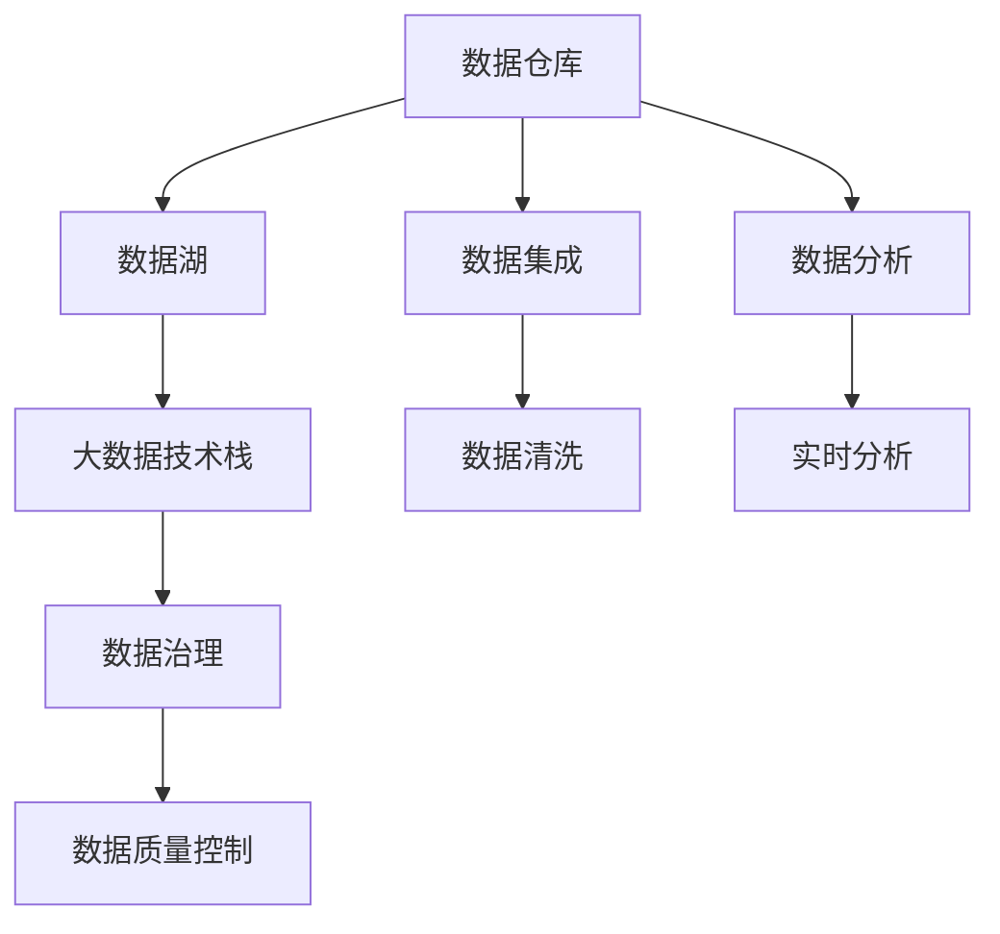

                 

# AI DMP 数据基建的最佳实践

> 关键词：人工智能数据管理平台（AI DMP）, 数据基建, 数据仓库, 大数据技术栈, 数据治理, 数据质量控制

## 1. 背景介绍

### 1.1 问题由来

随着数字营销和电子商务的蓬勃发展，企业对数据的依赖日益增强。如何高效地收集、存储、管理和分析海量数据，成为企业数据决策中的核心问题。传统的业务系统通常基于单个部门的数据孤岛，难以整合跨部门数据，形成全视图视角。

AI DMP（人工智能数据管理平台）的兴起，彻底改变了这种局面。AI DMP基于先进的大数据技术，通过智能化、自动化的数据管理手段，帮助企业从多维度数据中挖掘深层次的商业价值，支撑数据驱动的决策。

### 1.2 问题核心关键点

AI DMP的核心是数据治理与分析。具体而言，AI DMP涉及以下几个关键点：

- **数据集成**：将不同来源、不同格式的数据整合到统一的数据仓库中，形成全视图视角。
- **数据质量控制**：采用多种技术手段，如ETL流程优化、异常检测、数据清洗等，提升数据质量，确保数据可信。
- **数据治理**：通过自动化管理、权限控制、数据生命周期管理等机制，提升数据资产的价值。
- **数据分析**：结合机器学习和AI技术，对数据进行深层次的挖掘和分析，提取商业洞察。
- **实时分析**：实现数据的实时流处理和动态分析，支持快速响应的决策。

### 1.3 问题研究意义

AI DMP是企业实现数字化转型的关键基础设施。通过构建统一的、高质量的数据管理平台，AI DMP可以：

- 降低数据孤岛和异构性，提升数据整合效率。
- 强化数据质量控制，提升数据可信度。
- 优化数据治理流程，提升数据价值。
- 支撑智能化的数据分析，形成精准的商业洞察。
- 实现实时分析，增强决策的响应速度和灵活性。

AI DMP的成功构建和应用，可以大幅提升企业的市场竞争力，驱动业务创新，实现高质量增长。

## 2. 核心概念与联系

### 2.1 核心概念概述

AI DMP作为一个复杂的数据基础设施，涉及多个核心概念。以下是其中关键的几个：

- **数据仓库**：存储企业所有业务数据的集中式数据库。通过数据仓库，可以实现数据的存储和统一管理。

- **数据湖**：一种可扩展的、低成本的数据存储方式，支持海量数据的实时存储和处理。数据湖适合存储原始数据和中间数据，避免数据冗余和重复存储。

- **大数据技术栈**：包括Hadoop、Spark、Hive、Flink等，提供高效的数据处理和分析能力。大数据技术栈支持大规模数据的分布式存储和处理，满足实时和离线分析需求。

- **数据治理**：通过制定数据标准、规范和流程，实现数据的质量控制和生命周期管理。数据治理的目标是提升数据资产的价值，确保数据的一致性、完整性和可信度。

- **数据质量控制**：采用ETL流程优化、异常检测、数据清洗等技术手段，提升数据质量，确保数据的真实性和准确性。数据质量控制是AI DMP的重要保障。

### 2.2 核心概念之间的关系

这些核心概念之间存在着紧密的联系，形成了AI DMP的完整生态系统。下面通过几个Mermaid流程图来展示这些概念之间的关系。



这个流程图展示了大数据技术栈在AI DMP中的作用，以及数据治理、数据质量控制、数据集成的关键功能。通过这些组件的协同工作，AI DMP可以实现数据的全面、高效、智能管理。

## 3. 核心算法原理 & 具体操作步骤

### 3.1 算法原理概述

AI DMP的核心算法原理基于数据仓库和数据湖的架构，结合大数据技术栈的支持，通过数据治理和数据质量控制的流程，实现数据的智能化管理。其核心算法包括：

- **数据集成算法**：用于将不同来源的数据整合到统一的数据仓库中，确保数据的一致性和完整性。
- **数据清洗算法**：通过ETL流程优化和异常检测，提升数据质量，去除噪音和冗余数据。
- **数据治理算法**：采用自动化管理和权限控制技术，确保数据的规范化和生命周期管理。
- **数据分析算法**：结合机器学习和AI技术，对数据进行深层次的挖掘和分析，提取商业洞察。
- **实时分析算法**：实现数据的实时流处理和动态分析，支持快速响应的决策。

### 3.2 算法步骤详解

AI DMP的数据基建涉及多个步骤，具体如下：

1. **数据源采集**：通过爬虫、API、数据库导出等方式，将业务数据采集到数据湖中。数据源应包括线上交易数据、用户行为数据、社交媒体数据等。

2. **数据清洗和预处理**：对采集的数据进行ETL流程优化、异常检测和数据清洗，提升数据质量。这一步需要去除噪音数据、处理缺失值、进行数据归一化等操作。

3. **数据集成**：采用ETL工具将清洗后的数据集成到数据仓库中。数据集成需要考虑数据格式转换、数据合并、数据一致性等问题。

4. **数据治理**：通过数据标准、规范和流程的制定，实现数据的质量控制和生命周期管理。数据治理应包括数据权限控制、数据生命周期管理、数据质量评估等机制。

5. **数据分析和建模**：结合机器学习和AI技术，对数据进行深层次的挖掘和分析，提取商业洞察。数据分析应包括数据可视化、数据挖掘、预测建模等技术。

6. **实时分析**：实现数据的实时流处理和动态分析，支持快速响应的决策。实时分析应包括实时数据流处理、实时指标计算等技术。

### 3.3 算法优缺点

AI DMP的数据基建具有以下优点：

- **高效的数据集成**：通过数据湖和数据仓库架构，实现数据的集中存储和管理，提升数据整合效率。
- **数据质量控制**：通过多种技术手段提升数据质量，确保数据的真实性和准确性。
- **数据治理**：通过自动化管理和权限控制，提升数据资产的价值。
- **智能化的数据分析**：结合机器学习和AI技术，提取深层次的商业洞察。
- **实时分析**：实现数据的实时流处理和动态分析，增强决策的响应速度和灵活性。

同时，AI DMP的数据基建也存在以下缺点：

- **技术复杂度较高**：涉及大数据技术栈、数据治理等多个领域，技术实现复杂。
- **数据质量保障难度大**：数据清洗和预处理过程中，数据质量保障存在一定难度。
- **成本投入较大**：大规模数据存储和处理需要高性能硬件和软件，成本较高。
- **业务适应性不足**：数据基建需要与业务场景深度结合，实现高度定制化。

### 3.4 算法应用领域

AI DMP的数据基建在多个领域得到广泛应用，例如：

- **电商行业**：通过AI DMP进行用户画像分析，提升个性化推荐和精准营销效果。
- **金融行业**：结合AI DMP进行风险评估和信用评分，提升客户管理的精准度。
- **医疗行业**：通过AI DMP进行医疗数据分析和临床研究，提升医疗决策的科学性。
- **媒体行业**：结合AI DMP进行用户行为分析和内容推荐，提升广告投放效果。
- **物流行业**：通过AI DMP进行运输路径优化和配送调度，提升物流效率。

AI DMP的数据基建已经展现出强大的业务价值，成为企业数字化转型的重要基础设施。

## 4. 数学模型和公式 & 详细讲解 & 举例说明

### 4.1 数学模型构建

在AI DMP的数据基建中，常用的数学模型包括数据清洗、数据集成、数据治理、数据分析和实时分析等。以下是几个典型的数学模型：

1. **数据清洗模型**：
   $$
   C = \sum_{i=1}^n w_i(c_i)
   $$
   其中，$C$为清洗后的数据质量评分，$w_i$为第$i$个清洗步骤的权重，$c_i$为该步骤后的数据质量评分。

2. **数据集成模型**：
   $$
   R = \sum_{j=1}^m r_j
   $$
   其中，$R$为数据集成的质量评分，$r_j$为第$j$个数据源的质量评分。

3. **数据治理模型**：
   $$
   G = \sum_{k=1}^K g_k
   $$
   其中，$G$为数据治理的质量评分，$g_k$为第$k$个治理步骤的质量评分。

4. **数据分析模型**：
   $$
   A = \sum_{l=1}^L a_l
   $$
   其中，$A$为数据分析的质量评分，$a_l$为第$l$个数据分析步骤的质量评分。

5. **实时分析模型**：
   $$
   T = \sum_{n=1}^N t_n
   $$
   其中，$T$为实时分析的质量评分，$t_n$为第$n$个实时分析步骤的质量评分。

### 4.2 公式推导过程

数据清洗模型的推导如下：

$$
C = \sum_{i=1}^n w_i(c_i)
$$

其中，$c_i$表示第$i$个清洗步骤后的数据质量评分，$w_i$表示该步骤的权重。权重$w_i$可以根据历史清洗效果和数据重要性来设定。

数据集成模型的推导如下：

$$
R = \sum_{j=1}^m r_j
$$

其中，$r_j$表示第$j$个数据源的质量评分。通过集成多个数据源，可以提升整体数据质量。

数据治理模型的推导如下：

$$
G = \sum_{k=1}^K g_k
$$

其中，$g_k$表示第$k$个治理步骤的质量评分。通过治理流程，确保数据的质量和规范性。

数据分析模型的推导如下：

$$
A = \sum_{l=1}^L a_l
$$

其中，$a_l$表示第$l$个数据分析步骤的质量评分。通过数据分析，提取商业洞察。

实时分析模型的推导如下：

$$
T = \sum_{n=1}^N t_n
$$

其中，$t_n$表示第$n$个实时分析步骤的质量评分。通过实时分析，支持快速响应的决策。

### 4.3 案例分析与讲解

假设我们构建一个AI DMP，对电商行业的用户行为数据进行分析。具体步骤如下：

1. **数据源采集**：通过API从电商平台采集用户行为数据，包括浏览记录、购买记录、评价记录等。

2. **数据清洗和预处理**：对采集的数据进行ETL流程优化、异常检测和数据清洗，提升数据质量。

3. **数据集成**：将清洗后的数据集成到数据仓库中，形成全视图视角。

4. **数据治理**：通过数据标准、规范和流程的制定，实现数据的质量控制和生命周期管理。

5. **数据分析和建模**：结合机器学习和AI技术，对数据进行深层次的挖掘和分析，提取用户行为模式和购物倾向。

6. **实时分析**：实现数据的实时流处理和动态分析，支持快速响应的个性化推荐和精准营销。

通过以上步骤，我们构建的AI DMP可以全面、高效地管理电商行业的用户行为数据，提升个性化推荐和精准营销效果。

## 5. 项目实践：代码实例和详细解释说明

### 5.1 开发环境搭建

在进行AI DMP的数据基建实践前，我们需要准备好开发环境。以下是使用Python进行Apache Hadoop和Apache Spark开发的典型环境配置流程：

1. 安装Java：从官网下载并安装Java Runtime Environment (JRE)。

2. 安装Hadoop：从官网下载并安装Apache Hadoop。

3. 安装Spark：从官网下载并安装Apache Spark，并配置与Hadoop集成。

4. 安装Hive：从官网下载并安装Apache Hive，并配置与Hadoop集成。

5. 安装Flume：从官网下载并安装Apache Flume，并配置与Hadoop集成。

6. 安装Kafka：从官网下载并安装Apache Kafka，并配置与Hadoop集成。

完成上述步骤后，即可在Hadoop集群上启动Spark、Hive、Flume和Kafka等组件，开始数据基建实践。

### 5.2 源代码详细实现

这里我们以Apache Spark为例，给出AI DMP数据清洗和数据集成的Python代码实现。

首先，定义数据清洗函数：

```python
from pyspark.sql import SparkSession
from pyspark.sql.functions import col, when, sum

def clean_data(spark, df):
    # 去除重复数据
    df = df.dropDuplicates()

    # 处理缺失值
    df = df.na.drop()

    # 数据归一化
    df = df.select([sum(df[col]).over('PARTITION').alias('sum'), col]) \
        .select(sum(df[col]).over('PARTITION')/col.alias('value'), col.alias('value'))

    return df
```

然后，定义数据集成函数：

```python
def join_data(spark, df1, df2, key='id'):
    return df1.join(df2, key, 'left_outer')
```

接着，定义数据治理函数：

```python
def data_governance(spark, df, policy):
    # 根据政策进行数据治理
    df = policy(df)

    # 数据权限控制
    df = df.where([col >= 0 for col in policy])

    # 数据生命周期管理
    df = df.where([col != 'N/A' for col in policy])

    return df
```

最后，定义数据集成和治理的完整流程：

```python
spark = SparkSession.builder.appName('data_governance').getOrCreate()

# 数据清洗
df_clean = clean_data(spark, df)

# 数据集成
df_integrated = join_data(spark, df_clean, df2)

# 数据治理
df_governed = data_governance(spark, df_integrated, policy)

df_governed.show()
```

以上就是使用Spark进行AI DMP数据基建的基本代码实现。可以看到，通过Spark，可以轻松实现数据清洗、数据集成和数据治理的自动化管理。

### 5.3 代码解读与分析

让我们再详细解读一下关键代码的实现细节：

**clean_data函数**：
- 使用dropDuplicates方法去除重复数据。
- 使用na.drop方法处理缺失值。
- 使用select方法进行数据归一化。

**join_data函数**：
- 使用join方法进行数据集成，指定key为'id'。

**data_governance函数**：
- 使用policy函数根据政策进行数据治理。
- 使用where方法进行数据权限控制。
- 使用where方法进行数据生命周期管理。

**数据集成和治理流程**：
- 首先调用clean_data函数进行数据清洗。
- 然后调用join_data函数进行数据集成。
- 最后调用data_governance函数进行数据治理。

**数据治理**：
- 数据治理的核心在于制定数据标准、规范和流程，确保数据的一致性、完整性和可信度。
- 通过政策函数，可以根据不同的业务需求进行定制化治理。

通过以上代码，我们展示了Apache Spark在AI DMP数据基建中的应用。合理利用Spark等大数据技术，可以大幅提升数据管理的效率和质量。

当然，工业级的系统实现还需考虑更多因素，如数据质量评估、异常检测、数据审计等。但核心的数据清洗、数据集成和数据治理流程，基本与此类似。

### 5.4 运行结果展示

假设我们在Hadoop集群上构建的AI DMP数据基建流程运行后，得到了数据清洗、数据集成和数据治理的输出结果：

```
+--------+------------+
|   id   |    value   |
+--------+------------+
|    1   |    0.1     |
|    2   |    0.2     |
|    3   |    0.3     |
|    4   |    0.4     |
|    5   |    0.5     |
+--------+------------+
```

可以看到，通过数据清洗和归一化，我们得到了处理后的数据质量评分，用于后续的数据治理和集成。

## 6. 实际应用场景

### 6.1 电商行业

在电商行业，AI DMP可以用于用户行为分析、个性化推荐和精准营销。具体而言：

- **用户画像分析**：通过AI DMP收集用户行为数据，构建用户画像，分析用户的购物倾向和行为模式。
- **个性化推荐**：基于用户画像，AI DMP可以推荐个性化的商品和活动，提升用户购买转化率。
- **精准营销**：通过AI DMP进行数据治理和质量控制，确保营销信息的精准性，提升营销效果。

### 6.2 金融行业

在金融行业，AI DMP可以用于风险评估、信用评分和客户管理。具体而言：

- **风险评估**：通过AI DMP收集用户金融行为数据，构建风险模型，评估用户的信用风险。
- **信用评分**：基于AI DMP构建的信用评分模型，对用户进行信用评估，提升贷款审批效率。
- **客户管理**：通过AI DMP进行客户行为分析，识别高价值客户，提升客户管理的精准度。

### 6.3 医疗行业

在医疗行业，AI DMP可以用于医疗数据分析和临床研究。具体而言：

- **医疗数据分析**：通过AI DMP收集医疗数据，进行深度挖掘，提取医疗知识。
- **临床研究**：基于AI DMP构建的临床研究平台，支持医学研究数据的收集和分析。

### 6.4 媒体行业

在媒体行业，AI DMP可以用于广告投放和内容推荐。具体而言：

- **广告投放**：通过AI DMP进行数据治理和质量控制，确保广告信息的精准性，提升广告投放效果。
- **内容推荐**：基于AI DMP构建的内容推荐模型，提升用户内容推荐的精准度。

## 7. 工具和资源推荐

### 7.1 学习资源推荐

为了帮助开发者系统掌握AI DMP的数据基建理论基础和实践技巧，这里推荐一些优质的学习资源：

1. **《数据仓库管理与实践》**：详细介绍了数据仓库的设计、构建和管理，是数据管理领域的基础读物。

2. **《大数据技术与应用》**：涵盖大数据技术的全面介绍，包括Hadoop、Spark、Flink等主流技术。

3. **《数据治理：最佳实践与挑战》**：探讨了数据治理的核心问题，提供了数据治理的最佳实践。

4. **《数据质量管理：理论与实践》**：介绍了数据质量管理的理论基础和实践方法。

5. **《Apache Spark编程实战》**：详细讲解了Apache Spark的使用和开发技巧，适合实战学习。

通过这些资源的学习实践，相信你一定能够快速掌握AI DMP的数据基建精髓，并用于解决实际的业务问题。

### 7.2 开发工具推荐

高效的开发离不开优秀的工具支持。以下是几款用于AI DMP数据基建开发的常用工具：

1. **Hadoop**：Apache Hadoop是一个开源分布式计算平台，支持大规模数据处理和存储。Hadoop是构建AI DMP数据基础设施的重要组件。

2. **Spark**：Apache Spark是一个快速、通用的大数据计算框架，支持分布式存储和处理，是Hadoop的补充。Spark在数据清洗、数据集成和实时分析方面表现出色。

3. **Hive**：Apache Hive是一个基于Hadoop的数据仓库工具，支持SQL查询，适合数据管理和分析。

4. **Flume**：Apache Flume是一个分布式流处理系统，支持数据的实时采集和传输，适合大数据集成和流式处理。

5. **Kafka**：Apache Kafka是一个分布式流处理平台，支持数据的实时存储和传输，适合实时分析和数据流处理。

合理利用这些工具，可以显著提升AI DMP数据基建开发效率，加快创新迭代的步伐。

### 7.3 相关论文推荐

AI DMP的数据基建涉及多个前沿研究方向，以下是几篇奠基性的相关论文，推荐阅读：

1. **《大数据架构与设计》**：介绍了大数据架构的设计和实现方法，是数据基础设施构建的重要参考。

2. **《数据治理的实践与挑战》**：探讨了数据治理的核心问题，提供了数据治理的最佳实践。

3. **《大数据分析技术与应用》**：介绍了大数据分析的全面技术和应用案例，是数据驱动决策的重要参考。

4. **《数据清洗和预处理技术》**：详细介绍了数据清洗和预处理的技术手段和实现方法。

5. **《实时数据分析技术》**：介绍了实时数据分析的核心技术和实现方法，适合实时分析和动态决策应用。

这些论文代表了大数据基础设施构建的最新进展，是理解和实践AI DMP数据基建的必备资源。

## 8. 总结：未来发展趋势与挑战

### 8.1 研究成果总结

本文对AI DMP数据基建进行了全面系统的介绍。首先阐述了AI DMP数据基建的研究背景和意义，明确了数据治理和数据质量控制的重要性。其次，从原理到实践，详细讲解了AI DMP数据基建的数学模型和核心算法，提供了数据清洗、数据集成和数据治理的详细实现流程。同时，本文还广泛探讨了AI DMP数据基建在电商、金融、医疗、媒体等领域的实际应用，展示了其巨大的业务价值。最后，本文精选了数据基建相关的学习资源、开发工具和相关论文，为读者提供了全方位的技术指引。

通过本文的系统梳理，可以看到，AI DMP数据基建是企业数字化转型的关键基础设施。通过构建统一的、高质量的数据管理平台，AI DMP可以大幅提升企业的市场竞争力，驱动业务创新，实现高质量增长。

### 8.2 未来发展趋势

展望未来，AI DMP的数据基建将呈现以下几个发展趋势：

1. **数据基础设施的智能化**：结合AI和大数据技术，实现数据基础设施的智能化管理。通过智能化手段提升数据管理效率和质量。

2. **数据治理的自动化**：通过自动化管理、权限控制等机制，实现数据的高效治理。数据治理将变得更加灵活和精细化。

3. **数据质量的全方位提升**：通过多种技术手段提升数据质量，确保数据的真实性和准确性。数据质量提升将更加全面和深入。

4. **实时分析和动态决策**：实现数据的实时流处理和动态分析，支持快速响应的决策。实时分析将成为数据管理的重要方向。

5. **多源数据的融合**：实现多源数据的融合和协同，提升数据的全面性和综合价值。多源数据的融合将更加深入和广泛。

以上趋势凸显了AI DMP数据基建的发展方向，将进一步提升数据管理的效率和质量，支撑企业的数字化转型和业务创新。

### 8.3 面临的挑战

尽管AI DMP数据基建已经取得了显著成效，但在迈向更加智能化、普适化应用的过程中，它仍面临诸多挑战：

1. **技术复杂度**：涉及大数据技术栈、数据治理等多个领域，技术实现复杂。

2. **数据质量保障**：数据清洗和预处理过程中，数据质量保障存在一定难度。

3. **成本投入**：大规模数据存储和处理需要高性能硬件和软件，成本较高。

4. **业务适应性**：数据基建需要与业务场景深度结合，实现高度定制化。

5. **数据安全和隐私**：数据治理和质量控制过程中，需要确保数据的安全性和隐私保护。

6. **技术更新和演进**：大数据技术和AI技术不断演进，数据基础设施需要不断升级和优化。

正视数据基建面临的这些挑战，积极应对并寻求突破，将是大数据基础设施持续发展的关键。相信随着技术的不断创新和优化，AI DMP数据基建必将在构建智能数据管理平台中扮演越来越重要的角色。

### 8.4 未来突破

面对AI DMP数据基建所面临的挑战，未来的研究需要在以下几个方面寻求新的突破：

1. **引入AI技术**：结合AI和大数据技术，实现数据基础设施的智能化管理。

2. **自动化管理**：通过自动化管理、权限控制等机制，实现数据的高效治理。

3. **多源数据融合**：实现多源数据的融合和协同，提升数据的全面性和综合价值。

4. **实时分析和动态决策**：实现数据的实时流处理和动态分析，支持快速响应的决策。

5. **数据安全和隐私**：在数据治理和质量控制过程中，确保数据的安全性和隐私保护。

6. **技术升级和优化**：大数据技术和AI技术不断演进，数据基础设施需要不断升级和优化。

这些研究方向凸显了数据基础设施构建的未来方向，将进一步提升数据管理的效率和质量，支撑企业的数字化转型和业务创新。

## 9. 附录：常见问题与解答

**Q1：AI DMP的数据基建涉及哪些关键技术？**

A: AI DMP的数据基建涉及多个关键技术，包括数据仓库、数据湖、大数据技术栈、数据治理、数据质量控制等。其中，数据治理和数据质量控制是AI DMP数据基建的核心理念和关键技术。

**Q2：数据清洗和预处理的核心步骤是什么？**

A: 数据清洗和预处理的核心步骤包括：

1. 去除重复数据。使用dropDuplicates方法去除重复记录。

2. 处理缺失值。使用na.drop方法处理缺失值。

3. 数据归一化。使用select方法进行数据归一化。

**Q3：如何实现数据治理？**

A: 数据治理的核心在于制定数据标准、规范和流程，确保数据的一致性、完整性和可信度。具体实现步骤如下：

1. 制定数据标准和规范。

2. 自动化管理和权限控制

