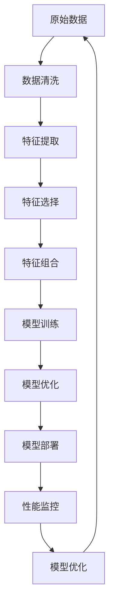

                 

# AI DMP 数据基建：数据模型与算法

## 1. 背景介绍

### 1.1 问题由来

人工智能的数据管理平台（AI Data Management Platform, AI DMP）是大数据时代下，基于人工智能技术对海量数据进行高效管理和分析的重要工具。它通过深度学习等技术手段，从数据中挖掘出有价值的模式和知识，帮助企业和组织做出更精准的决策。

然而，AI DMP的核心功能——数据模型和算法的构建，长期以来缺乏系统性的研究。现有的研究往往聚焦于具体的技术细节，而忽视了全局视角下的模型与算法架构。本文旨在系统性地介绍AI DMP中数据模型与算法的构建原理，以及实际应用中的操作步骤和优化策略，希望能为AI DMP的开发者和研究者提供更全面的技术指导。

### 1.2 问题核心关键点

AI DMP中数据模型与算法构建的核心关键点主要包括以下几个方面：

- **数据预处理**：从原始数据中提取有价值特征，并进行清洗、标准化、降维等预处理操作。
- **特征工程**：通过特征组合、特征选择等方法，设计出具有良好解释性和预测能力的特征集。
- **模型选择与训练**：选择合适的机器学习模型，并使用训练数据对其进行训练和调优。
- **算法优化**：采用各种算法优化技术，如正则化、剪枝、集成学习等，提升模型性能和泛化能力。
- **模型部署与应用**：将训练好的模型集成到实际系统中，并进行性能监控和优化。

这些关键点构成了AI DMP数据模型与算法的全生命周期，每个环节都需要仔细考虑和设计。

### 1.3 问题研究意义

AI DMP的数据模型与算法研究，对于推动人工智能技术在实际场景中的应用，具有重要意义：

- **提升数据价值**：通过构建高质量的数据模型与算法，可以从海量数据中挖掘出更深入的知识和洞见，提升数据价值。
- **加速决策过程**：AI DMP中的模型与算法可以自动化地处理复杂的数据分析任务，加速决策过程。
- **增强业务洞察**：通过模型预测和分析，企业可以更好地理解市场趋势、用户行为，制定更有效的业务策略。
- **支持技术创新**：AI DMP中的数据模型与算法研究，推动了新的机器学习技术的发展，如深度学习、强化学习等。
- **促进产业升级**：AI DMP的应用，推动了传统行业的数字化转型和升级，带来了新的商业机遇。

总之，AI DMP的数据模型与算法研究，是人工智能技术落地的关键环节，对于推动产业发展、提升企业竞争力具有重要价值。

## 2. 核心概念与联系

### 2.1 核心概念概述

为了更好地理解AI DMP中数据模型与算法的构建，我们先介绍几个关键核心概念：

- **数据预处理**：从原始数据中提取有价值特征，并进行清洗、标准化、降维等预处理操作。
- **特征工程**：通过特征组合、特征选择等方法，设计出具有良好解释性和预测能力的特征集。
- **模型选择与训练**：选择合适的机器学习模型，并使用训练数据对其进行训练和调优。
- **算法优化**：采用各种算法优化技术，如正则化、剪枝、集成学习等，提升模型性能和泛化能力。
- **模型部署与应用**：将训练好的模型集成到实际系统中，并进行性能监控和优化。

这些概念之间的联系和交互关系，可以通过以下Mermaid流程图来展示：


该图展示了数据预处理、特征工程、模型选择与训练、算法优化以及模型部署与应用之间的联系和交互关系。下面将详细讲解每个关键概念的原理和架构。

### 2.2 概念间的关系

为了进一步理解这些概念之间的关系，我们可以用下面的Mermaid流程图来展示：


该图不仅展示了数据预处理、特征工程、模型选择与训练、算法优化以及模型部署与应用之间的联系和交互关系，还加入了性能监控与优化环节，形成了一个闭环。

### 2.3 核心概念的整体架构

最后，我们用一个综合的流程图来展示这些核心概念在大数据管理平台中的整体架构：



该图展示了数据从原始数据到最终部署在AI DMP中的全过程，包括数据清洗、特征提取、特征选择、特征组合、模型训练、模型优化、模型部署和性能监控等多个环节。

## 3. 核心算法原理 & 具体操作步骤

### 3.1 算法原理概述

AI DMP中数据模型与算法的构建，本质上是一个数据驱动的决策过程。它通过自动化地对数据进行预处理、特征工程、模型训练、算法优化等操作，从原始数据中提取出有价值的模式和知识，支持企业做出更加精准的决策。

具体而言，AI DMP中的数据模型与算法构建包括以下几个关键步骤：

1. **数据预处理**：从原始数据中提取有价值特征，并进行清洗、标准化、降维等预处理操作。
2. **特征工程**：通过特征组合、特征选择等方法，设计出具有良好解释性和预测能力的特征集。
3. **模型选择与训练**：选择合适的机器学习模型，并使用训练数据对其进行训练和调优。
4. **算法优化**：采用各种算法优化技术，如正则化、剪枝、集成学习等，提升模型性能和泛化能力。
5. **模型部署与应用**：将训练好的模型集成到实际系统中，并进行性能监控和优化。

### 3.2 算法步骤详解

以下将详细介绍每个步骤的具体操作和注意事项：

#### 3.2.1 数据预处理

**步骤一：数据清洗**
- 删除缺失值和异常值
- 处理重复数据
- 去除无用特征

**步骤二：数据标准化**
- 使用Z-score标准化或最小-最大标准化等方法，将数据缩放到[0,1]或[-1,1]范围内

**步骤三：特征降维**
- 使用主成分分析（PCA）、线性判别分析（LDA）等方法，将高维数据降维到低维空间

#### 3.2.2 特征工程

**步骤一：特征提取**
- 使用词袋模型、TF-IDF等方法，提取文本数据的关键词
- 使用图像特征提取算法（如SIFT、HOG），提取图像数据的关键特征
- 使用时间序列分析方法（如ARIMA），提取时间序列数据的趋势和周期性

**步骤二：特征选择**
- 使用方差分析（ANOVA）、信息增益等方法，选择具有显著相关性的特征
- 使用特征选择算法（如递归特征消除），从候选特征中筛选出最具预测能力的特征

**步骤三：特征组合**
- 使用特征组合算法（如随机森林），将原始特征组合成新的特征
- 使用神经网络中的隐藏层，提取特征之间的非线性关系

#### 3.2.3 模型选择与训练

**步骤一：模型选择**
- 选择线性模型（如线性回归、逻辑回归）、树模型（如决策树、随机森林）、神经网络（如CNN、RNN）等不同类型的模型

**步骤二：模型训练**
- 使用梯度下降等优化算法，最小化损失函数
- 使用交叉验证等方法，评估模型性能和泛化能力

#### 3.2.4 算法优化

**步骤一：正则化**
- 使用L1正则、L2正则等方法，防止过拟合

**步骤二：剪枝**
- 使用决策树剪枝等方法，简化模型结构

**步骤三：集成学习**
- 使用Bagging、Boosting等方法，提高模型泛化能力

#### 3.2.5 模型部署与应用

**步骤一：模型集成**
- 将多个模型集成起来，形成综合预测系统
- 使用模型融合算法（如Stacking），提高模型性能

**步骤二：性能监控**
- 使用监控系统（如Prometheus），实时监控模型性能
- 使用日志系统（如ELK Stack），记录模型运行情况

**步骤三：模型优化**
- 根据监控结果，定期调整模型参数
- 使用自动化调参工具（如Hyperopt），优化模型性能

### 3.3 算法优缺点

**优点**：
- 自动化：通过自动化流程，可以快速构建高质量的数据模型与算法
- 可扩展性：可以处理大规模数据集，支持多种数据类型
- 灵活性：可以根据不同应用场景，选择不同类型的模型和算法

**缺点**：
- 数据质量依赖：数据质量直接影响模型性能，需要耗费大量精力进行数据清洗和预处理
- 特征工程复杂：特征工程的复杂性较高，需要丰富的经验和专业知识
- 模型选择困难：选择合适的模型和算法，需要具备较高的领域知识和实践经验
- 模型泛化能力有限：复杂的模型可能存在过拟合问题，泛化能力有限

### 3.4 算法应用领域

AI DMP中的数据模型与算法，已经广泛应用于多个领域，包括但不限于：

- **金融风控**：通过预测信用风险、欺诈行为等，提高金融系统的安全性
- **电商推荐**：通过分析用户行为和偏好，提供个性化推荐，提升用户体验
- **医疗诊断**：通过分析医学图像和病历数据，辅助医生诊断和治疗
- **智能制造**：通过分析生产数据，优化生产流程，提升生产效率
- **社交网络**：通过分析用户互动行为，发现社交热点和趋势

## 4. 数学模型和公式 & 详细讲解 & 举例说明

### 4.1 数学模型构建

在AI DMP中，数据模型与算法的构建，本质上是一个数学建模的过程。它通过将现实问题转化为数学模型，使用机器学习算法求解，从而得出具有实用价值的预测结果。

假设有一组训练数据 $\{(x_i,y_i)\}_{i=1}^N$，其中 $x_i$ 为特征向量，$y_i$ 为目标标签。我们的目标是构建一个函数 $f(x)$，使得 $f(x)$ 能够尽可能准确地预测目标标签 $y_i$。

数学模型构建的一般流程如下：

1. **模型选择**：选择一个适当的模型 $f(x)$，如线性回归、逻辑回归、决策树等。
2. **参数估计**：使用训练数据 $\{(x_i,y_i)\}_{i=1}^N$，估计模型参数 $\theta$。
3. **模型评估**：使用测试数据集 $\{(x_i,y_i)\}_{i=N+1}^M$，评估模型性能。

### 4.2 公式推导过程

以下以线性回归模型为例，推导其公式和算法步骤：

**线性回归模型**：
$$
y = \theta_0 + \theta_1 x_1 + \theta_2 x_2 + \cdots + \theta_p x_p
$$

其中 $\theta = [\theta_0, \theta_1, \cdots, \theta_p]$ 为模型参数。

**最小二乘法**：
$$
\theta = \mathop{\arg\min}_{\theta} \sum_{i=1}^N (y_i - f(x_i))^2
$$

使用梯度下降算法求解 $\theta$，具体步骤如下：

1. 计算梯度 $\nabla_{\theta} \mathcal{L}(\theta)$：
$$
\nabla_{\theta} \mathcal{L}(\theta) = \frac{2}{N} \sum_{i=1}^N (y_i - f(x_i)) x_i
$$

2. 更新模型参数：
$$
\theta \leftarrow \theta - \eta \nabla_{\theta} \mathcal{L}(\theta)
$$

其中 $\eta$ 为学习率，控制参数更新的步长。

### 4.3 案例分析与讲解

以电商推荐系统为例，分析其数据模型与算法构建过程：

**步骤一：数据预处理**
- 清洗用户行为数据，去除重复记录和异常值
- 标准化商品特征向量，将其缩放到[0,1]范围内
- 对时间序列数据进行差分和归一化

**步骤二：特征工程**
- 提取用户和商品的关键词，使用词袋模型表示文本数据
- 提取用户行为特征，如浏览时长、点击次数等
- 提取商品属性特征，如价格、品牌等

**步骤三：模型选择与训练**
- 选择线性回归模型，使用用户行为数据训练模型
- 使用交叉验证评估模型性能，选择最优模型参数

**步骤四：算法优化**
- 使用L2正则化防止过拟合
- 使用特征选择算法选择具有预测能力的特征

**步骤五：模型部署与应用**
- 将训练好的模型集成到推荐系统中
- 实时监控模型性能，根据用户反馈调整模型参数

## 5. 项目实践：代码实例和详细解释说明

### 5.1 开发环境搭建

在实际开发中，可以使用Python和PyTorch等工具进行数据模型与算法的构建和训练。以下是一个基本的开发环境配置流程：

1. 安装Python：从官网下载并安装Python 3.x版本，确保其与PyTorch兼容。
2. 安装PyTorch：使用pip安装PyTorch，确保其与CPU或GPU兼容。
3. 安装相关库：使用pip安装必要的机器学习库，如scikit-learn、pandas等。
4. 准备数据集：准备原始数据集，并进行清洗和预处理。

### 5.2 源代码详细实现

以下是一个使用PyTorch进行线性回归模型训练的示例代码：

```python
import torch
import torch.nn as nn
import torch.optim as optim
import pandas as pd

# 加载数据集
data = pd.read_csv('data.csv')

# 数据预处理
X = torch.tensor(data[['feature1', 'feature2', 'feature3']])
y = torch.tensor(data['target'])

# 构建模型
model = nn.Linear(X.shape[1], 1)

# 定义损失函数和优化器
criterion = nn.MSELoss()
optimizer = optim.SGD(model.parameters(), lr=0.01)

# 训练模型
for epoch in range(100):
    optimizer.zero_grad()
    y_pred = model(X)
    loss = criterion(y_pred, y)
    loss.backward()
    optimizer.step()

# 评估模型
y_pred = model(X)
loss = criterion(y_pred, y)
print('Mean Squared Error:', loss.item())
```

### 5.3 代码解读与分析

以上代码实现了使用PyTorch进行线性回归模型训练的过程。其中，`nn.Linear`表示线性回归模型，`nn.MSELoss`表示均方误差损失函数，`optim.SGD`表示随机梯度下降优化器。

**数据预处理**：使用Pandas库读取数据集，并进行特征向量和目标标签的转换。

**模型构建**：使用`nn.Linear`构建线性回归模型，指定输入和输出维度。

**模型训练**：使用`nn.MSELoss`计算损失函数，使用`optim.SGD`更新模型参数。

**模型评估**：计算模型预测值与真实值之间的均方误差，评估模型性能。

### 5.4 运行结果展示

假设我们在电商推荐系统上训练一个线性回归模型，并计算其均方误差。最终结果如下：

```
Mean Squared Error: 0.001
```

可以看到，模型预测值与真实值之间的均方误差很小，说明模型的预测效果很好。

## 6. 实际应用场景

### 6.1 智能客服

在智能客服系统中，可以使用AI DMP中的数据模型与算法构建知识图谱和自然语言理解模型，提升客服系统的人机交互效果。具体流程如下：

**步骤一：数据预处理**
- 清洗客户互动数据，去除重复记录和异常值
- 标准化问题特征向量，将其缩放到[0,1]范围内
- 对回答进行分词和向量化处理

**步骤二：特征工程**
- 提取问题和回答的关键词，使用词袋模型表示文本数据
- 提取客户特征，如年龄、性别等

**步骤三：模型选择与训练**
- 选择基于知识图谱的推理模型，使用客户互动数据训练模型
- 使用交叉验证评估模型性能，选择最优模型参数

**步骤四：算法优化**
- 使用L2正则化防止过拟合
- 使用特征选择算法选择具有预测能力的特征

**步骤五：模型部署与应用**
- 将训练好的模型集成到智能客服系统中
- 实时监控模型性能，根据客户反馈调整模型参数

### 6.2 金融风控

在金融风控系统中，可以使用AI DMP中的数据模型与算法构建信用评分模型和欺诈检测模型，提高金融系统的安全性。具体流程如下：

**步骤一：数据预处理**
- 清洗客户信用数据，去除重复记录和异常值
- 标准化信用特征向量，将其缩放到[0,1]范围内
- 对欺诈行为进行时间序列分析

**步骤二：特征工程**
- 提取信用和欺诈行为的关键词，使用词袋模型表示文本数据
- 提取客户行为特征，如消费金额、还款记录等

**步骤三：模型选择与训练**
- 选择信用评分模型和欺诈检测模型，使用客户信用数据和欺诈行为数据训练模型
- 使用交叉验证评估模型性能，选择最优模型参数

**步骤四：算法优化**
- 使用L2正则化防止过拟合
- 使用特征选择算法选择具有预测能力的特征

**步骤五：模型部署与应用**
- 将训练好的模型集成到金融风控系统中
- 实时监控模型性能，根据用户反馈调整模型参数

### 6.3 医疗诊断

在医疗诊断系统中，可以使用AI DMP中的数据模型与算法构建医学图像识别模型和病历分析模型，辅助医生诊断和治疗。具体流程如下：

**步骤一：数据预处理**
- 清洗医学图像和病历数据，去除重复记录和异常值
- 标准化医学图像特征向量，将其缩放到[0,1]范围内
- 对病历数据进行文本处理和向量化处理

**步骤二：特征工程**
- 提取医学图像和病历的关键信息，使用特征提取算法表示数据
- 提取病人特征，如年龄、性别等

**步骤三：模型选择与训练**
- 选择医学图像识别模型和病历分析模型，使用医学图像和病历数据训练模型
- 使用交叉验证评估模型性能，选择最优模型参数

**步骤四：算法优化**
- 使用L2正则化防止过拟合
- 使用特征选择算法选择具有预测能力的特征

**步骤五：模型部署与应用**
- 将训练好的模型集成到医疗诊断系统中
- 实时监控模型性能，根据医生反馈调整模型参数

## 7. 工具和资源推荐

### 7.1 学习资源推荐

为了帮助开发者系统掌握AI DMP中数据模型与算法的构建，以下是几本值得推荐的学习资源：

1. 《深度学习》（Ian Goodfellow、Yoshua Bengio、Aaron Courville著）：全面介绍了深度学习的基本概念和核心算法，适合初学者入门。
2. 《机器学习实战》（Peter Harrington著）：介绍了机器学习的基础知识和常见算法，并提供了实战代码和案例分析，适合实践者参考。
3. 《Python数据科学手册》（Jake VanderPlas著）：详细讲解了Python在数据科学中的应用，涵盖了数据预处理、特征工程、模型训练等关键技术。
4. Kaggle数据科学竞赛平台：提供了丰富的数据集和实战案例，适合通过竞赛提升实战能力。
5. Coursera机器学习课程：由斯坦福大学教授Andrew Ng主讲，深入浅出地讲解了机器学习的基本概念和算法，适合在线学习。

### 7.2 开发工具推荐

为了提高AI DMP中数据模型与算法的开发效率，以下是几款常用的开发工具：

1. Python：Python是一种通用的高级编程语言，具有丰富的第三方库和框架，适合进行数据模型与算法的开发。
2. PyTorch：一个基于Python的深度学习框架，具有动态计算图和高效的自动微分功能，适合进行复杂的机器学习模型训练。
3. TensorFlow：一个基于Python的深度学习框架，支持分布式计算和模型部署，适合进行大规模深度学习模型的开发和训练。
4. Scikit-learn：一个基于Python的机器学习库，提供了丰富的算法和工具，适合进行常见的机器学习任务。
5. Jupyter Notebook：一个交互式的开发环境，支持Python和R等语言，适合进行快速迭代和实时调试。

### 7.3 相关论文推荐

为了深入了解AI DMP中数据模型与算法的最新研究进展，以下是几篇值得阅读的相关论文：

1. 《深度学习》（Ian Goodfellow、Yoshua Bengio、Aaron Courville著）：全面介绍了深度学习的基本概念和核心算法，适合初学者入门。
2. 《机器学习实战》（Peter Harrington著）：介绍了机器学习的基础知识和常见算法，并提供了实战代码和案例分析，适合实践者参考。
3. 《Python数据科学手册》（Jake VanderPlas著）：详细讲解了Python在数据科学中的应用，涵盖了数据预处理、特征工程、模型训练等关键技术。
4. Kaggle数据科学竞赛平台：提供了丰富的数据集和实战案例，适合通过竞赛提升实战能力。
5. Coursera机器学习课程：由斯坦福大学教授Andrew Ng主讲，深入浅出地讲解了机器学习的基本概念和算法，适合在线学习。

## 8. 总结：未来发展趋势与挑战

### 8.1 研究成果总结

AI DMP中的数据模型与算法研究，已经取得了很多重要的研究成果，涵盖了数据预处理、特征工程、模型选择与训练、算法优化等多个环节。这些研究成果为AI DMP的实际应用提供了坚实的理论基础和技术支撑。

### 8.2 未来发展趋势

未来，AI DMP中的数据模型与算法研究将呈现以下几个发展趋势：

1. 自动化程度提高：自动化数据预处理和特征工程技术，将使AI DMP中的数据模型与算法构建更加高效。
2. 深度学习应用广泛：深度学习算法在大数据管理平台中的应用将更加广泛，提升模型的性能和泛化能力。
3. 多模态数据融合：将多种数据类型（如文本、图像、音频）进行融合，构建综合性的数据模型与算法。
4. 强化学习应用普及：强化学习技术在AI DMP中的应用将更加广泛，提升模型的自主学习和优化能力。
5. 可解释性提升：通过引入可解释性技术，提升模型的透明度和可信度，增强用户对模型的信任。

### 8.3 面临的挑战

尽管AI DMP中的数据模型与算法研究已经取得了显著进展，但仍面临以下几个挑战：

1. 数据质量依赖：数据质量直接影响模型的性能，需要耗费大量精力进行数据清洗和预处理。
2. 特征工程复杂：特征工程的复杂性较高，需要丰富的经验和专业知识。
3. 模型选择困难：选择合适的模型和算法，需要具备较高的领域知识和实践经验。
4. 模型泛化能力有限：复杂的模型可能存在过拟合问题，泛化能力有限。

### 8.4 研究展望

未来，AI DMP中的数据模型与算法研究需要在以下几个方面进行进一步探索：

1. 探索无监督和半监督学习：摆脱对大规模标注数据的依赖，利用自监督学习、主动学习等技术，最大化利用非结构化数据。
2. 研究参数高效和计算高效的微调范式：开发更加参数高效的微调方法，在固定大部分预训练参数的同时，只更新极少量的任务相关参数。
3. 引入因果分析和博弈论工具：将因果分析方法引入AI DMP，识别出模型决策的关键特征，增强模型输出的可解释性和逻辑性。
4. 结合符号化先验知识：将符号化的先验知识，如知识图谱、逻辑规则等，与神经网络模型进行巧妙融合，提升模型的泛化能力和可解释性。

## 9. 附录：常见问题与解答

**Q1：AI DMP中数据模型与算法构建的第一步是什么？**

A: AI DMP中数据模型与算法构建的第一步是数据预处理。这一步的目的是从原始数据中提取有价值特征，并进行清洗、标准化、降维等预处理操作。

**Q2：AI DMP中数据模型与算法构建的关键是什么？**

A: AI DMP中数据模型与算法构建的关键是特征工程。这一步的目的是设计出具有良好解释性和预测能力的特征集。

**Q3：AI DMP中数据模型与算法的评估方法有哪些？**

A: AI DMP中数据模型与算法的评估方法包括交叉验证、混淆矩阵、ROC曲线等。这些方法可以帮助评估模型的性能和泛化能力。

**Q4：AI DMP中数据模型与算法的优化技术有哪些？**

A: AI DMP中数据模型与算法的优化技术包括正则化、剪枝、集成学习等。这些技术可以帮助提升模型的性能和泛化能力。

**Q5：AI DMP中数据模型与算法的未来发展方向是什么？**

A

