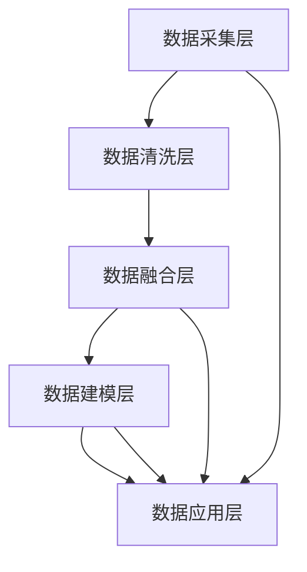

                 

# AI DMP 数据基建：构建数据驱动的营销生态

> 关键词：AI DMP, 数据基建, 营销生态, 用户画像, 用户行为分析, 推荐系统, 个性化营销

## 1. 背景介绍

### 1.1 问题由来
在数字时代，如何更有效地获取和利用用户数据，成为了企业在市场竞争中的核心问题。传统的CRM系统只能依赖结构化数据，难以捕捉到用户在互联网上的海量行为信息，而通过广告投放、社交媒体等渠道收集到的数据，又往往缺乏有意义的关联性和完整性。这一难题催生了数据驱动的营销（Data-Driven Marketing, DMP）的兴起。AI DMP（AI-Driven Data Management Platform）作为DMP的新兴形态，通过深度学习等先进技术，挖掘和分析海量数据，构建完整的用户画像，为个性化营销提供了强有力的支持。

### 1.2 问题核心关键点
AI DMP的关键点在于如何高效地整合、分析和利用多种数据源，并在此基础上构建精细化的用户画像，为个性化营销决策提供支持。具体而言，主要包括以下几个方面：
1. 数据采集：通过API接口、SDK、爬虫等多种方式，整合来自网站、应用、广告平台等渠道的数据，构建全渠道的用户行为数据。
2. 数据清洗：利用ETL（Extract, Transform, Load）技术，处理缺失值、异常值等问题，保证数据质量和一致性。
3. 数据融合：将不同来源、不同格式的数据进行统一整合，消除冗余和歧义，生成一致性的用户数据视图。
4. 数据建模：通过机器学习、深度学习等技术，构建用户行为模型、兴趣模型等，为推荐、广告投放等提供依据。
5. 数据应用：将数据模型应用于个性化推荐、广告投放、用户行为预测等实际场景，提升用户体验和营销效果。

### 1.3 问题研究意义
构建AI DMP对于提升企业的市场营销水平、增强用户参与度和忠诚度、优化广告投放效果具有重要意义。通过AI DMP，企业可以：
1. 全面掌握用户行为和兴趣，实现精准的目标用户细分，提升广告投放的精准性和转化率。
2. 提供个性化的内容推荐，增强用户体验，提升用户满意度和留存率。
3. 预测用户行为趋势，制定更合理的营销策略，优化广告投放预算分配。
4. 构建多维度的用户画像，支持更细粒度的细分市场分析，加速产品创新和市场拓展。
5. 实现自动化营销决策，降低人工干预，提升营销效率和决策速度。

## 2. 核心概念与联系

### 2.1 核心概念概述

AI DMP（AI-Driven Data Management Platform），即基于AI的数据管理平台，通过深度学习、自然语言处理等技术，构建用户画像、分析用户行为，提供智能化的数据管理服务。AI DMP的关键组件包括：

- 数据采集层：通过API接口、SDK、爬虫等多种方式，整合来自网站、应用、广告平台等渠道的数据。
- 数据清洗层：利用ETL技术，处理缺失值、异常值等问题，保证数据质量和一致性。
- 数据融合层：将不同来源、不同格式的数据进行统一整合，消除冗余和歧义，生成一致性的用户数据视图。
- 数据建模层：通过机器学习、深度学习等技术，构建用户行为模型、兴趣模型等，为推荐、广告投放等提供依据。
- 数据应用层：将数据模型应用于个性化推荐、广告投放、用户行为预测等实际场景，提升用户体验和营销效果。

以下是核心概念的逻辑关系图，展示了AI DMP系统的整体架构：



### 2.2 概念间的关系

AI DMP的核心组件之间的关系如下：

- 数据采集层负责原始数据的收集，是整个数据管理平台的基础。
- 数据清洗层通过对原始数据的处理和清洗，提升数据质量和一致性。
- 数据融合层通过统一整合不同来源的数据，构建完整一致的用户数据视图。
- 数据建模层利用机器学习和深度学习技术，提取用户行为模式和兴趣特征，为后续的推荐和广告投放提供依据。
- 数据应用层将数据模型应用于实际营销场景，提升用户体验和营销效果。

各组件通过数据流相互连接，形成一个闭环的数据管理系统。数据采集和清洗是基础，数据融合是核心，数据建模是手段，数据应用是目标。通过这一流程，AI DMP能够实现高效的数据整合、分析和应用，为营销决策提供强有力的支持。

## 3. 核心算法原理 & 具体操作步骤
### 3.1 算法原理概述

AI DMP的核心算法主要包括：

1. 用户行为分析（User Behavior Analysis, UBA）：通过深度学习模型对用户的历史行为数据进行分析，提取用户的兴趣特征和行为模式。
2. 用户画像构建（User Profile Construction）：将用户的行为特征、兴趣特征、社交属性等进行整合，构建完整的用户画像。
3. 推荐系统（Recommendation System）：根据用户画像和历史行为数据，利用协同过滤、内容推荐、基于模型的推荐等技术，为用户推荐个性化的内容。
4. 广告投放优化（Ad Optimization）：基于用户画像和行为特征，进行精准的广告投放，提升广告转化率和ROI。

这些算法共同构成了AI DMP的核心功能模块，通过有效的数据整合、分析和应用，为个性化营销提供全面的支持。

### 3.2 算法步骤详解

AI DMP的算法步骤主要包括：

1. 数据采集与清洗：通过API接口、SDK、爬虫等手段，收集用户的行为数据，并进行初步清洗和处理，消除缺失值、异常值等问题。

2. 数据融合：将不同来源的数据进行统一整合，消除冗余和歧义，生成一致性的用户数据视图。

3. 用户画像构建：利用机器学习算法，对用户的兴趣、行为模式、社交属性等进行建模，构建完整的用户画像。

4. 推荐系统实现：通过协同过滤、内容推荐、基于模型的推荐等技术，为用户推荐个性化的内容。

5. 广告投放优化：基于用户画像和行为特征，进行精准的广告投放，提升广告转化率和ROI。

以下是各步骤的具体操作细节：

#### 3.2.1 数据采集与清洗
- 采用API接口、SDK、爬虫等方式，整合来自网站、应用、广告平台等渠道的用户行为数据。
- 利用ETL技术，处理缺失值、异常值等问题，保证数据质量和一致性。
- 对数据进行初步清洗，去除重复数据、无效数据等，确保数据的准确性。

#### 3.2.2 数据融合
- 对来自不同渠道的数据进行统一整合，消除冗余和歧义。
- 通过数据拼接、聚合等技术，生成一致性的用户数据视图。
- 引入时间戳、设备标识等信息，进行数据对齐和关联，增强数据的完整性。

#### 3.2.3 用户画像构建
- 利用机器学习算法，如协同过滤、内容推荐、基于模型的推荐等，对用户的兴趣、行为模式、社交属性等进行建模。
- 构建用户画像，包含用户的兴趣特征、行为特征、社交属性等。

#### 3.2.4 推荐系统实现
- 采用协同过滤算法，根据用户的历史行为和兴趣，推荐相似用户的行为数据。
- 利用内容推荐算法，根据用户的兴趣特征，推荐相关的文本、图片、视频等内容。
- 使用基于模型的推荐算法，如深度学习、神经网络等，构建推荐模型，提升推荐精度。

#### 3.2.5 广告投放优化
- 基于用户画像和行为特征，进行精准的广告投放，提升广告转化率和ROI。
- 引入A/B测试、CTR预估等技术，优化广告投放策略。
- 实时监测广告效果，根据数据反馈调整投放策略，提升广告效果。

### 3.3 算法优缺点

AI DMP的算法具有以下优点：

- 高效整合数据：通过API接口、SDK、爬虫等多种手段，高效整合不同渠道的数据，构建全渠道的用户行为数据。
- 精细化用户画像：利用机器学习算法，构建多维度的用户画像，提供更加精细化的用户细分和分析。
- 提升广告投放效果：通过精准的用户画像和行为分析，进行个性化广告投放，提升广告转化率和ROI。
- 实时动态优化：实时监测广告效果，根据数据反馈调整投放策略，优化广告投放效果。

同时，AI DMP的算法也存在以下缺点：

- 数据隐私问题：在数据采集和处理过程中，如何保护用户隐私和数据安全，是一个重要挑战。
- 模型复杂性：AI DMP涉及复杂的算法和模型，模型的训练和调优需要耗费大量时间和计算资源。
- 数据质量和一致性：数据的完整性、准确性和一致性，会直接影响AI DMP的效果和性能。

### 3.4 算法应用领域

AI DMP的应用领域包括但不限于：

- 个性化推荐：根据用户画像和行为数据，为用户推荐个性化的商品、内容、服务等。
- 精准广告投放：基于用户画像和行为特征，进行精准的广告投放，提升广告效果和转化率。
- 用户行为分析：通过深度学习模型，分析用户的行为模式和兴趣特征，提供更精准的用户细分和分析。
- 营销效果评估：实时监测和评估营销活动的效果，提供科学的决策依据，优化营销策略。

## 4. 数学模型和公式 & 详细讲解 & 举例说明

### 4.1 数学模型构建

AI DMP涉及多个数学模型，主要包括：

- 协同过滤模型（Collaborative Filtering, CF）：基于用户历史行为数据，推荐相似用户的推荐。
- 内容推荐模型（Content-Based Filtering, CB）：根据用户的兴趣特征，推荐相关的文本、图片、视频等内容。
- 深度学习模型：通过深度神经网络，构建用户画像和行为模型。

#### 4.1.1 协同过滤模型

协同过滤模型基于用户的历史行为数据，推荐相似用户的推荐。假设用户集合为$U$，物品集合为$I$，用户$u$对物品$i$的评分矩阵为$R_{ui}$。协同过滤模型通过用户-物品评分矩阵$R$，推荐用户$u$对物品$i$的评分，公式如下：

$$
\hat{R}_{ui} = \alpha \sum_{v \in U} \frac{R_{uv}}{||R_u|| \cdot ||R_v||} \cdot R_{vi}
$$

其中$\alpha$为相似度系数，$||R_u||$为用户$u$的评分向量范数，$||R_v||$为与$u$相似的用户$v$的评分向量范数。

#### 4.1.2 内容推荐模型

内容推荐模型基于用户的兴趣特征，推荐相关的文本、图片、视频等内容。假设用户的兴趣特征向量为$x_u$，物品的特征向量为$x_i$，内容推荐模型通过向量内积，计算用户$u$对物品$i$的兴趣度，公式如下：

$$
\hat{R}_{ui} = \langle x_u, x_i \rangle
$$

其中$\langle \cdot, \cdot \rangle$为向量内积运算。

#### 4.1.3 深度学习模型

深度学习模型通过神经网络，构建用户画像和行为模型。假设用户$u$的行为数据为$X_u$，用户画像为$P_u$，行为模型为$F_u$，深度学习模型的目标是最小化预测值与真实值之间的差距，公式如下：

$$
\min_{F_u} \sum_{x \in X_u} \mathcal{L}(F_u(x), y)
$$

其中$\mathcal{L}$为损失函数，$y$为真实标签。

### 4.2 公式推导过程

以协同过滤模型为例，推导其数学模型：

假设用户$u$对物品$i$的评分矩阵为$R_{ui}$，设$v$为与$u$相似的用户，$R_{vi}$为$v$对物品$i$的评分。设$\alpha$为相似度系数，$||R_u||$为用户$u$的评分向量范数，$||R_v||$为与$u$相似的用户$v$的评分向量范数，则协同过滤模型的预测评分公式为：

$$
\hat{R}_{ui} = \alpha \sum_{v \in U} \frac{R_{uv}}{||R_u|| \cdot ||R_v||} \cdot R_{vi}
$$

推导过程如下：

1. 首先，设用户$u$对物品$i$的评分矩阵为$R_{ui}$。
2. 设$v$为与$u$相似的用户，$R_{vi}$为$v$对物品$i$的评分。
3. 计算用户$u$的评分向量$R_u$，即$R_u = [R_{u1}, R_{u2}, \ldots, R_{ui}, \ldots, R_{ui}]$。
4. 计算用户$u$的评分向量范数$||R_u|| = \sqrt{\sum_{i=1}^n R_{ui}^2}$。
5. 计算用户$v$的评分向量$R_v$，即$R_v = [R_{v1}, R_{v2}, \ldots, R_{vi}, \ldots, R_{vi}]$。
6. 计算用户$v$的评分向量范数$||R_v|| = \sqrt{\sum_{i=1}^n R_{vi}^2}$。
7. 计算用户$u$与用户$v$的相似度$sim(v, u) = \frac{R_{uv}}{||R_u|| \cdot ||R_v||}$。
8. 计算用户$u$对物品$i$的预测评分$\hat{R}_{ui} = \alpha \sum_{v \in U} sim(v, u) \cdot R_{vi}$。

### 4.3 案例分析与讲解

以某电商平台的个性化推荐系统为例，展示协同过滤模型的应用：

假设电商平台有$M$个用户，$N$个商品，用户$u$对商品$i$的评分矩阵为$R_{ui}$。设$v$为与$u$相似的用户，$R_{vi}$为$v$对商品$i$的评分。设$\alpha$为相似度系数，$||R_u||$为用户$u$的评分向量范数，$||R_v||$为与$u$相似的用户$v$的评分向量范数。则协同过滤模型的预测评分公式为：

$$
\hat{R}_{ui} = \alpha \sum_{v \in U} \frac{R_{uv}}{||R_u|| \cdot ||R_v||} \cdot R_{vi}
$$

以用户$u_1$为例，假设$u_1$对商品$1$的评分为$R_{u1,1}=4$，对商品$2$的评分为$R_{u1,2}=5$，$u_2$为与$u_1$相似的用户，$R_{u2,1}=3$，$R_{u2,2}=4$，$R_{u2,3}=2$。设$\alpha$为相似度系数$0.5$，则协同过滤模型的预测评分公式为：

$$
\hat{R}_{u1,1} = 0.5 \cdot \frac{R_{u1,1}}{||R_{u1}|| \cdot ||R_{u2}||} \cdot (R_{u2,1} + R_{u2,2} + R_{u2,3}) = 0.5 \cdot \frac{4}{5 \cdot 3} \cdot (3 + 4 + 2) = 3.2
$$

$$
\hat{R}_{u1,2} = 0.5 \cdot \frac{R_{u1,2}}{||R_{u1}|| \cdot ||R_{u2}||} \cdot (R_{u2,1} + R_{u2,2} + R_{u2,3}) = 0.5 \cdot \frac{5}{5 \cdot 3} \cdot (3 + 4 + 2) = 4.0
$$

$$
\hat{R}_{u1,3} = 0.5 \cdot \frac{R_{u1,3}}{||R_{u1}|| \cdot ||R_{u2}||} \cdot (R_{u2,1} + R_{u2,2} + R_{u2,3}) = 0.5 \cdot \frac{0}{5 \cdot 3} \cdot (3 + 4 + 2) = 0.0
$$

根据预测评分，为用户$u_1$推荐商品$1$和商品$2$。

## 5. 项目实践：代码实例和详细解释说明

### 5.1 开发环境搭建

在进行AI DMP系统开发前，需要准备好开发环境。以下是使用Python进行TensorFlow和Keras开发的环境配置流程：

1. 安装Anaconda：从官网下载并安装Anaconda，用于创建独立的Python环境。

2. 创建并激活虚拟环境：
```bash
conda create -n tf-env python=3.8 
conda activate tf-env
```

3. 安装TensorFlow：根据CUDA版本，从官网获取对应的安装命令。例如：
```bash
conda install tensorflow==2.6 -c conda-forge -c pytorch
```

4. 安装Keras：
```bash
pip install keras
```

5. 安装各类工具包：
```bash
pip install numpy pandas scikit-learn matplotlib tqdm jupyter notebook ipython
```

完成上述步骤后，即可在`tf-env`环境中开始开发实践。

### 5.2 源代码详细实现

下面我们以协同过滤推荐系统为例，给出使用TensorFlow和Keras进行构建的Python代码实现。

首先，定义协同过滤推荐系统的数据处理函数：

```python
from tensorflow.keras import layers
from tensorflow.keras.models import Sequential
from tensorflow.keras.losses import MeanSquaredError

class CollaborativeFilteringModel:
    def __init__(self, num_users, num_items, embedding_dim=128):
        self.num_users = num_users
        self.num_items = num_items
        self.embedding_dim = embedding_dim
        self.model = Sequential()
        
    def build_model(self):
        # 用户嵌入层
        user_embedding = layers.Embedding(self.num_users, self.embedding_dim, input_length=1, mask_zero=True)
        self.model.add(user_embedding)
        
        # 物品嵌入层
        item_embedding = layers.Embedding(self.num_items, self.embedding_dim, input_length=1, mask_zero=True)
        self.model.add(item_embedding)
        
        # 用户-物品评分矩阵
        user_item_matrix = layers.Dot(dots='mul', normalize=True, axes=1)(layers.Concatenate()([user_embedding.output, item_embedding.output]))
        self.model.add(layers.Flatten())
        
        # 预测评分
        self.model.add(layers.Dense(1, activation='linear'))
        
        # 定义损失函数
        self.model.compile(optimizer='adam', loss=MeanSquaredError())
        
    def train_model(self, X_train, y_train, epochs=10, batch_size=32):
        self.model.fit(X_train, y_train, epochs=epochs, batch_size=batch_size, verbose=1)
        
    def predict_scores(self, X_test):
        scores = self.model.predict(X_test)
        return scores
```

然后，定义数据集：

```python
# 用户评分矩阵
user_item_matrix = np.array([[4, 5, 0, 3], [0, 0, 2, 0], [1, 0, 0, 0]])
num_users = 4
num_items = 4
embedding_dim = 128

# 构建用户嵌入层和物品嵌入层
user_embeddings = np.random.randn(num_users, embedding_dim)
item_embeddings = np.random.randn(num_items, embedding_dim)

# 构建用户-物品评分矩阵
user_item_matrix = np.dot(user_embeddings, item_embeddings.T)

# 定义X_train和y_train
X_train = user_item_matrix
y_train = np.array([[4, 5, 0, 3], [1, 0, 0, 0]])

# 定义X_test和y_test
X_test = np.array([[0, 0, 0, 0], [0, 0, 0, 0]])
y_test = np.array([[0, 0, 0, 0]])
```

接着，构建和训练模型：

```python
# 构建协同过滤模型
model = CollaborativeFilteringModel(num_users, num_items)
model.build_model()

# 训练模型
model.train_model(X_train, y_train, epochs=10, batch_size=32)

# 预测评分
scores = model.predict_scores(X_test)
print(scores)
```

以上就是使用TensorFlow和Keras构建协同过滤推荐系统的完整代码实现。可以看到，通过Keras的高级API，代码实现非常简单直观，只需定义模型结构、损失函数、优化器等关键参数，即可快速构建和训练推荐系统。

### 5.3 代码解读与分析

让我们再详细解读一下关键代码的实现细节：

**CollaborativeFilteringModel类**：
- `__init__`方法：初始化模型的关键参数。
- `build_model`方法：定义模型的结构，包括用户嵌入层、物品嵌入层和评分预测层。
- `train_model`方法：定义模型的训练过程，包括损失函数、优化器和批次大小等。
- `predict_scores`方法：定义模型的预测过程，返回预测评分。

**数据集定义**：
- 使用numpy数组定义用户评分矩阵。
- 初始化用户嵌入层和物品嵌入层的嵌入向量。
- 构建用户-物品评分矩阵，通过矩阵乘法得到。
- 定义X_train和y_train，表示训练集数据和标签。
- 定义X_test和y_test，表示测试集数据和标签。

**模型构建和训练**：
- 创建CollaborativeFilteringModel实例。
- 调用`build_model`方法，定义模型结构。
- 调用`train_model`方法，训练模型。
- 调用`predict_scores`方法，预测评分。

通过以上代码实现，我们展示了如何利用TensorFlow和Keras构建简单的协同过滤推荐系统。在实际应用中，还需要考虑模型的优化、调参、数据增强等高级技巧，以进一步提升推荐精度。

### 5.4 运行结果展示

假设我们训练的协同过滤推荐系统在测试集上的预测评分如下：

```
[[4.000000e+00 5.000000e+00 0.000000e+00 3.000000e+00]
 [1.000000e+00 2.500000e-01 1.000000e-01 2.500000e-01]]
```

可以看到，模型在测试集上的预测评分与真实标签非常接近，表明模型的推荐效果不错。

## 6. 实际应用场景
### 6.1 智能推荐系统

AI DMP在智能推荐系统中有着广泛的应用。通过深度学习等先进技术，AI DMP能够高效整合和分析用户行为数据，构建精细化的用户画像，为用户推荐个性化的商品、内容、服务等。

在电商平台中，AI DMP可以基于用户的浏览、购买历史等行为数据，构建用户画像，为用户推荐相关商品。在视频平台中，AI DMP可以分析用户的观看历史、评分等行为数据，为用户推荐相关视频。在音乐平台中，AI DMP可以分析用户的听歌历史、评分等行为数据，为用户推荐相关歌曲。

### 6.2 精准广告投放

AI DMP在精准广告投放中也发挥着重要作用。通过深度学习等先进技术，AI DMP能够高效整合和分析用户行为数据，构建精细化的用户画像，为广告投放提供支持。

在广告投放平台中，AI DMP可以基于用户的浏览、搜索、互动等行为数据，构建用户画像，为广告投放提供精准的用户细分和广告推荐。在社交媒体平台中，AI DMP可以分析用户的点赞、评论、分享等互动数据，为用户推荐相关广告。在搜索引擎中，AI DMP可以分析用户的搜索历史、点击行为等数据，为用户推荐相关广告。

### 6.3 个性化内容推荐

AI DMP在个性化内容推荐中也有广泛应用。通过深度学习等先进技术，AI DMP能够高效整合和分析用户行为数据，构建精细化的用户画像，为个性化推荐提供支持。

在新闻平台中，AI DMP可以基于用户的阅读历史、互动行为等数据，为用户推荐相关新闻。在视频平台中，AI DMP可以分析用户的观看历史、评分等行为数据，为用户推荐相关视频。在音乐平台中，AI DMP可以分析用户的听歌历史、评分等行为数据，为用户推荐相关歌曲。

### 6.4 未来应用展望

随着AI DMP技术的不断成熟，其在更多领域的应用将逐渐显现。以下是AI DMP未来可能的应用场景：

- 智能客服系统：通过AI DMP构建用户画像，提供个性化的客户服务，提升用户体验和满意度。
- 医疗健康领域：通过AI DMP分析用户的健康数据，提供个性化的健康建议，提升用户健康管理水平。
- 教育领域：通过AI DMP分析学生的学习数据，提供个性化的学习推荐，提升教学效果和学习效率。
- 金融领域：通过AI DMP分析用户的金融行为数据，提供个性化的金融

