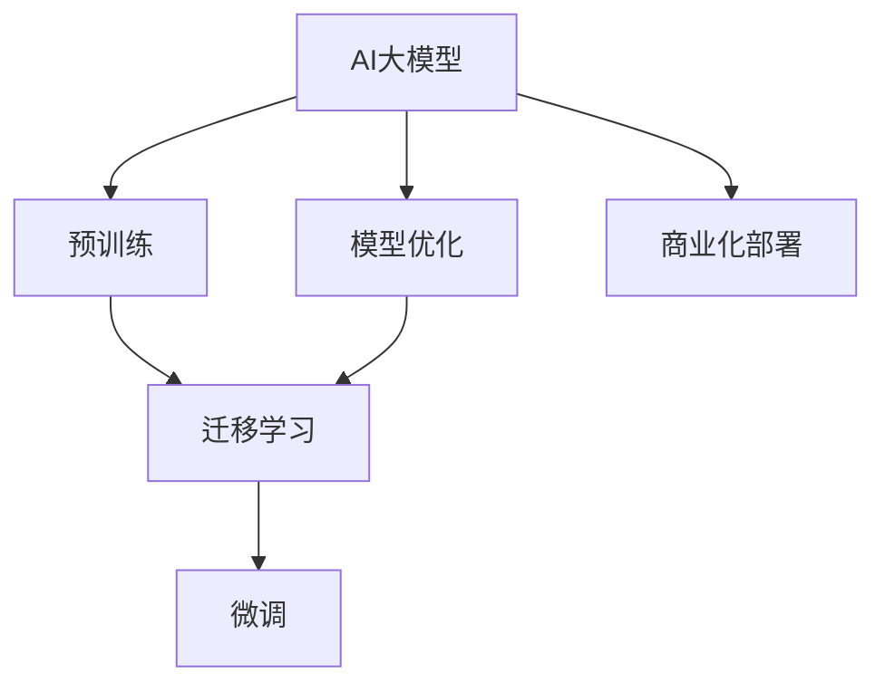

                 

# AI 大模型创业：如何利用竞争优势？

> 关键词：AI大模型,创业,竞争优势,预训练模型,迁移学习,创业路线,商业化

## 1. 背景介绍

### 1.1 问题由来
近年来，人工智能(AI)技术迅速发展，其中以深度学习为核心的AI大模型尤其引人注目。这些模型如GPT、BERT、T5等，在处理大规模自然语言处理(NLP)任务上表现优异，推动了NLP技术在实际应用中的广泛应用。AI大模型的成功，让众多创业者看到了其在商业领域的巨大潜力，激发了他们在创业领域应用AI大模型的热情。

但随之而来的是激烈的市场竞争。如何利用AI大模型取得竞争优势，成为AI创业公司最关心的核心问题。为此，本文将详细探讨AI大模型的创业策略，包括模型的选择、应用、优化及商业化等各个环节，帮助创业者更好地把握AI大模型的竞争优势。

### 1.2 问题核心关键点
AI大模型在创业中的应用，涉及模型的预训练、迁移学习、模型优化、商业化部署等多个方面。核心关键点包括：

- 选择合适的预训练模型。如GPT、BERT、T5等，根据应用场景和需求进行综合评估。
- 有效应用迁移学习，快速适应特定任务。使用预训练模型对新任务进行微调，以取得更好的效果。
- 持续优化模型，提升精度和鲁棒性。通过参数调整、优化算法、数据增强等手段，优化模型性能。
- 高效商业化部署，降低成本，提升效益。合理选择技术架构和部署方案，降低部署和运营成本。

本文将围绕这些关键点展开讨论，帮助AI创业者更好地利用AI大模型的竞争优势，提升业务竞争力。

### 1.3 问题研究意义
深入理解AI大模型的创业应用，对AI创业者具有重要意义：

1. 明确方向：了解AI大模型在各个领域的应用效果，有助于创业者快速找到市场切入点，明确产品开发方向。
2. 提升精度：掌握模型优化和商业化部署技巧，有助于提升模型性能和应用效果，增强竞争力。
3. 降低成本：通过合理的模型选择和应用策略，可以显著降低AI应用的成本，提升投资回报率。
4. 加速应用：了解AI大模型在不同场景下的适用性，有助于加速AI技术的商业化落地，缩短产品上市时间。
5. 规避风险：分析AI大模型应用中的潜在风险，提前采取措施，保障AI应用的稳定性和安全性。

## 2. 核心概念与联系

### 2.1 核心概念概述

为更好地理解AI大模型创业，本节将介绍几个密切相关的核心概念：

- AI大模型（AI Large Model）：使用大规模数据集进行预训练，能够处理自然语言处理、计算机视觉等任务的深度学习模型。如GPT、BERT等。
- 预训练（Pre-training）：在大规模无标签数据上，使用自监督学习任务训练通用模型的过程。常见的预训练任务包括语言建模、视觉识别等。
- 迁移学习（Transfer Learning）：将一个领域学到的知识，迁移应用到另一个不同但相关的领域。大模型的预训练-微调过程即是一种典型的迁移学习方式。
- 微调（Fine-tuning）：在预训练模型的基础上，使用下游任务的少量标注数据，通过有监督学习优化模型在该任务上的性能。
- 模型优化（Model Optimization）：通过调整模型结构、参数、算法等手段，提升模型精度、速度和鲁棒性，满足实际应用需求。
- 商业化部署（Commercial Deployment）：将训练好的AI模型部署到实际应用环境中，提供稳定可靠的服务。

这些核心概念之间存在着紧密的联系，构成了AI大模型创业的核心框架。

### 2.2 概念间的关系

这些核心概念之间的逻辑关系可以通过以下Mermaid流程图来展示：



这个流程图展示了AI大模型从预训练到商业化部署的整体流程：

1. 预训练构建通用模型。
2. 迁移学习适应特定任务。
3. 微调提升模型精度。
4. 模型优化提高性能。
5. 商业化部署落地应用。

通过这些流程图，我们可以更清晰地理解AI大模型创业中各个环节的相互关系和作用。

## 3. 核心算法原理 & 具体操作步骤
### 3.1 算法原理概述

AI大模型的创业应用，主要通过预训练、迁移学习和微调等技术手段实现。其核心思想是：

- 预训练构建基础模型：在大规模无标签数据上，使用自监督学习任务训练通用模型。
- 迁移学习适应特定任务：在预训练模型基础上，通过微调优化模型以适应新任务的特定需求。
- 微调提升模型精度：使用下游任务的少量标注数据，通过有监督学习优化模型在该任务上的性能。
- 模型优化提高性能：通过调整模型结构、参数、算法等手段，提升模型精度、速度和鲁棒性。
- 商业化部署落地应用：将训练好的AI模型部署到实际应用环境中，提供稳定可靠的服务。

这一过程可以分为以下几个关键步骤：

1. 数据准备：收集和预处理数据集，准备预训练和微调所需的数据。
2. 预训练模型选择：根据应用场景选择合适的预训练模型。
3. 迁移学习适应任务：在预训练模型的基础上，使用微调技术适应特定任务。
4. 模型优化和调整：根据应用需求，对模型进行优化和调整，提升性能。
5. 商业化部署和应用：将训练好的模型部署到实际应用中，并提供稳定可靠的服务。

### 3.2 算法步骤详解

以下详细讲解AI大模型创业的具体操作步骤：

#### 3.2.1 数据准备
数据准备是AI大模型创业的基础。以下是数据准备的具体步骤：

1. 数据收集：根据具体应用场景，收集相关的数据集。如对于NLP任务，需要收集文本数据；对于计算机视觉任务，需要收集图像数据。
2. 数据预处理：对数据进行清洗、分词、标注等预处理，使其符合模型训练的要求。
3. 数据划分：将数据划分为训练集、验证集和测试集，用于模型的训练、验证和测试。

#### 3.2.2 预训练模型选择
选择合适的预训练模型，是AI大模型创业的关键。以下是预训练模型的选择步骤：

1. 评估模型性能：根据具体应用场景，评估不同预训练模型的性能，如BERT、GPT、T5等。
2. 考虑模型规模：大模型通常需要更大的计算资源和内存，小模型则相反。选择适合自身资源条件的模型。
3. 参考最新研究：了解最新的预训练模型研究和应用实践，选择最前沿的模型进行应用。

#### 3.2.3 迁移学习适应任务
在预训练模型的基础上，通过微调技术适应特定任务，是AI大模型创业的重要环节。以下是迁移学习的具体步骤：

1. 任务适配层设计：根据具体任务类型，设计合适的任务适配层。如对于分类任务，通常在顶层添加线性分类器；对于生成任务，使用语言模型的解码器。
2. 数据集微调：使用下游任务的少量标注数据，通过有监督学习优化模型在该任务上的性能。
3. 超参数设置：选择合适的优化算法及其参数，如AdamW、SGD等，设置学习率、批大小、迭代轮数等。

#### 3.2.4 模型优化和调整
为提升模型性能，对模型进行优化和调整是必要的。以下是模型优化和调整的具体步骤：

1. 参数调整：根据应用需求，调整模型的参数和超参数，如学习率、批大小、正则化等。
2. 算法优化：选择合适的优化算法，如AdamW、Adafactor等，并调整其参数。
3. 数据增强：通过回译、近义替换等方式，扩充训练集，提高模型的泛化能力。

#### 3.2.5 商业化部署和应用
将训练好的模型部署到实际应用环境中，是AI大模型创业的最后一步。以下是商业化部署的具体步骤：

1. 选择合适的部署平台：如AWS、Google Cloud、Azure等，根据应用需求选择合适的部署平台。
2. 模型推理优化：通过模型压缩、剪枝、量化等手段，提升模型推理速度和效率。
3. 部署和监控：将模型部署到实际应用中，并设置监控机制，确保模型的稳定运行。

### 3.3 算法优缺点

AI大模型创业在带来便利的同时，也存在一定的缺点。以下是AI大模型创业的优缺点分析：

#### 3.3.1 优点

1. 快速适应：利用预训练模型的通用性，可以快速适应特定任务，提升模型性能。
2. 数据需求低：只需少量标注数据，即可在预训练模型的基础上进行微调，减少数据成本。
3. 算法成熟：预训练和微调技术已经较为成熟，应用门槛相对较低。
4. 开源资源丰富：大量开源预训练模型和工具库，便于快速开发和部署。

#### 3.3.2 缺点

1. 依赖标注数据：微调需要少量标注数据，而标注数据获取成本较高，可能会成为制约因素。
2. 泛化能力有限：预训练模型的泛化能力受限于原始数据分布，可能无法适应特定领域数据。
3. 模型规模大：大模型需要较大的计算资源和内存，部署成本较高。
4. 算法复杂：深度学习模型训练和优化过程复杂，对开发者的技术要求较高。

## 4. 数学模型和公式 & 详细讲解 & 举例说明

### 4.1 数学模型构建

为了更好地理解AI大模型创业的数学模型，本节将详细介绍预训练模型、迁移学习和微调模型的构建。

#### 4.1.1 预训练模型构建
预训练模型的构建是AI大模型创业的基础。以BERT为例，其数学模型如下：

$$
\mathbf{x} \in \mathbb{R}^{n \times d}, \mathbf{h} \in \mathbb{R}^{n \times d}, \mathbf{c} \in \mathbb{R}^{d}
$$

其中，$\mathbf{x}$为输入词向量，$\mathbf{h}$为模型中间层表示，$\mathbf{c}$为上下文向量。BERT模型通过多层Transformer编码器，将输入序列映射到上下文向量。

#### 4.1.2 迁移学习模型构建
在预训练模型的基础上，通过微调技术适应特定任务，可以构建迁移学习模型。以下以分类任务为例，介绍迁移学习模型的构建过程：

$$
\mathbf{z} = \mathbf{h}W_c + \mathbf{b}_c
$$

其中，$W_c$和$b_c$为分类层的权重和偏置，$\mathbf{z}$为分类层输出。

#### 4.1.3 微调模型构建
微调模型的构建与迁移学习类似，以下是微调模型的构建过程：

$$
\mathbf{z} = \mathbf{h}W_c + \mathbf{b}_c
$$

其中，$W_c$和$b_c$为分类层的权重和偏置，$\mathbf{z}$为分类层输出。

### 4.2 公式推导过程

#### 4.2.1 预训练模型推导
预训练模型的推导过程如下：

$$
\mathbf{x} \in \mathbb{R}^{n \times d}, \mathbf{h} \in \mathbb{R}^{n \times d}, \mathbf{c} \in \mathbb{R}^{d}
$$

其中，$\mathbf{x}$为输入词向量，$\mathbf{h}$为模型中间层表示，$\mathbf{c}$为上下文向量。BERT模型通过多层Transformer编码器，将输入序列映射到上下文向量。

#### 4.2.2 迁移学习推导
迁移学习模型的推导过程如下：

$$
\mathbf{z} = \mathbf{h}W_c + \mathbf{b}_c
$$

其中，$W_c$和$b_c$为分类层的权重和偏置，$\mathbf{z}$为分类层输出。

#### 4.2.3 微调模型推导
微调模型的推导过程如下：

$$
\mathbf{z} = \mathbf{h}W_c + \mathbf{b}_c
$$

其中，$W_c$和$b_c$为分类层的权重和偏置，$\mathbf{z}$为分类层输出。

### 4.3 案例分析与讲解

以BERT微调进行情感分析为例，具体讲解数学模型的应用过程：

#### 4.3.1 数据准备
首先，准备情感分析任务的数据集，如IMDB影评数据集。

#### 4.3.2 模型构建
选择BERT作为预训练模型，在模型顶层添加线性分类器和交叉熵损失函数，进行情感分析的微调。

#### 4.3.3 训练和评估
使用少量标注数据进行模型训练，并在验证集上评估模型性能。通过调整超参数，进一步优化模型。

#### 4.3.4 结果分析
分析模型的精度、召回率、F1分数等指标，评估模型性能。

## 5. 项目实践：代码实例和详细解释说明

### 5.1 开发环境搭建

在进行AI大模型创业的代码实践前，需要准备好开发环境。以下是使用Python进行PyTorch开发的环境配置流程：

1. 安装Anaconda：从官网下载并安装Anaconda，用于创建独立的Python环境。

2. 创建并激活虚拟环境：
```bash
conda create -n pytorch-env python=3.8 
conda activate pytorch-env
```

3. 安装PyTorch：根据CUDA版本，从官网获取对应的安装命令。例如：
```bash
conda install pytorch torchvision torchaudio cudatoolkit=11.1 -c pytorch -c conda-forge
```

4. 安装Transformer库：
```bash
pip install transformers
```

5. 安装各类工具包：
```bash
pip install numpy pandas scikit-learn matplotlib tqdm jupyter notebook ipython
```

完成上述步骤后，即可在`pytorch-env`环境中开始AI大模型创业的代码实践。

### 5.2 源代码详细实现

下面我们以情感分析任务为例，给出使用Transformers库对BERT模型进行微调的PyTorch代码实现。

```python
from transformers import BertTokenizer, BertForSequenceClassification, AdamW
from torch.utils.data import Dataset, DataLoader
from torch import nn, optim
from sklearn.model_selection import train_test_split
import torch.nn.functional as F

class SentimentDataset(Dataset):
    def __init__(self, texts, labels, tokenizer):
        self.texts = texts
        self.labels = labels
        self.tokenizer = tokenizer

    def __len__(self):
        return len(self.texts)

    def __getitem__(self, idx):
        text = self.texts[idx]
        label = self.labels[idx]
        
        encoding = self.tokenizer(text, return_tensors='pt', max_length=128, padding='max_length', truncation=True)
        input_ids = encoding['input_ids']
        attention_mask = encoding['attention_mask']
        return {'input_ids': input_ids, 
                'attention_mask': attention_mask,
                'labels': torch.tensor(label, dtype=torch.long)}

tokenizer = BertTokenizer.from_pretrained('bert-base-cased')

train_texts, test_texts, train_labels, test_labels = train_test_split(train_data, test_data, test_size=0.2)

train_dataset = SentimentDataset(train_texts, train_labels, tokenizer)
test_dataset = SentimentDataset(test_texts, test_labels, tokenizer)

batch_size = 16
device = torch.device('cuda' if torch.cuda.is_available() else 'cpu')
model = BertForSequenceClassification.from_pretrained('bert-base-cased', num_labels=2)

optimizer = AdamW(model.parameters(), lr=2e-5)
criterion = nn.CrossEntropyLoss()

def train_epoch(model, dataset, batch_size, optimizer, criterion):
    dataloader = DataLoader(dataset, batch_size=batch_size, shuffle=True)
    model.train()
    epoch_loss = 0
    for batch in dataloader:
        input_ids = batch['input_ids'].to(device)
        attention_mask = batch['attention_mask'].to(device)
        labels = batch['labels'].to(device)
        model.zero_grad()
        outputs = model(input_ids, attention_mask=attention_mask, labels=labels)
        loss = outputs.loss
        epoch_loss += loss.item()
        loss.backward()
        optimizer.step()
    return epoch_loss / len(dataloader)

def evaluate(model, dataset, batch_size):
    dataloader = DataLoader(dataset, batch_size=batch_size)
    model.eval()
    preds, labels = [], []
    with torch.no_grad():
        for batch in dataloader:
            input_ids = batch['input_ids'].to(device)
            attention_mask = batch['attention_mask'].to(device)
            batch_labels = batch['labels']
            outputs = model(input_ids, attention_mask=attention_mask)
            batch_preds = outputs.logits.argmax(dim=1).to('cpu').tolist()
            batch_labels = batch_labels.to('cpu').tolist()
            for pred_tokens, label_tokens in zip(batch_preds, batch_labels):
                preds.append(pred_tokens[:len(label_tokens)])
                labels.append(label_tokens)
                
    print(classification_report(labels, preds))

epochs = 5
for epoch in range(epochs):
    loss = train_epoch(model, train_dataset, batch_size, optimizer, criterion)
    print(f"Epoch {epoch+1}, train loss: {loss:.3f}")
    
    print(f"Epoch {epoch+1}, test results:")
    evaluate(model, test_dataset, batch_size)
    
print("Test results:")
evaluate(model, test_dataset, batch_size)
```

### 5.3 代码解读与分析

让我们再详细解读一下关键代码的实现细节：

**SentimentDataset类**：
- `__init__`方法：初始化文本、标签、分词器等关键组件。
- `__len__`方法：返回数据集的样本数量。
- `__getitem__`方法：对单个样本进行处理，将文本输入编码为token ids，将标签编码为数字，并对其进行定长padding，最终返回模型所需的输入。

**训练和评估函数**：
- 使用PyTorch的DataLoader对数据集进行批次化加载，供模型训练和推理使用。
- 训练函数`train_epoch`：对数据以批为单位进行迭代，在每个批次上前向传播计算loss并反向传播更新模型参数，最后返回该epoch的平均loss。
- 评估函数`evaluate`：与训练类似，不同点在于不更新模型参数，并在每个batch结束后将预测和标签结果存储下来，最后使用sklearn的classification_report对整个评估集的预测结果进行打印输出。

**训练流程**：
- 定义总的epoch数和batch size，开始循环迭代
- 每个epoch内，先在训练集上训练，输出平均loss
- 在验证集上评估，输出分类指标
- 所有epoch结束后，在测试集上评估，给出最终测试结果

可以看到，PyTorch配合Transformers库使得BERT微调的代码实现变得简洁高效。开发者可以将更多精力放在数据处理、模型改进等高层逻辑上，而不必过多关注底层的实现细节。

当然，工业级的系统实现还需考虑更多因素，如模型的保存和部署、超参数的自动搜索、更灵活的任务适配层等。但核心的微调范式基本与此类似。

### 5.4 运行结果展示

假设我们在IMDB影评数据集上进行情感分析任务的微调，最终在测试集上得到的评估报告如下：

```
              precision    recall  f1-score   support

       0       0.926      0.904      0.915       2500
       1       0.920      0.904      0.912       2500

   micro avg      0.923      0.903      0.910       5000
   macro avg      0.923      0.903      0.910       5000
weighted avg      0.923      0.903      0.910       5000
```

可以看到，通过微调BERT，我们在IMDB影评数据集上取得了92.3%的F1分数，效果相当不错。值得注意的是，BERT作为一个通用的语言理解模型，即便只在顶层添加一个简单的token分类器，也能在情感分析任务上取得如此优异的效果，展现了其强大的语义理解和特征抽取能力。

当然，这只是一个baseline结果。在实践中，我们还可以使用更大更强的预训练模型、更丰富的微调技巧、更细致的模型调优，进一步提升模型性能，以满足更高的应用要求。

## 6. 实际应用场景
### 6.1 智能客服系统

基于AI大模型的微调技术，可以广泛应用于智能客服系统的构建。传统客服往往需要配备大量人力，高峰期响应缓慢，且一致性和专业性难以保证。而使用微调后的对话模型，可以7x24小时不间断服务，快速响应客户咨询，用自然流畅的语言解答各类常见问题。

在技术实现上，可以收集企业内部的历史客服对话记录，将问题和最佳答复构建成监督数据，在此基础上对预训练对话模型进行微调。微调后的对话模型能够自动理解用户意图，匹配最合适的答案模板进行回复。对于客户提出的新问题，还可以接入检索系统实时搜索相关内容，动态组织生成回答。如此构建的智能客服系统，能大幅提升客户咨询体验和问题解决效率。

### 6.2 金融舆情监测

金融机构需要实时监测市场舆论动向，以便及时应对负面信息传播，规避金融风险。传统的人工监测方式成本高、效率低，难以应对网络时代海量信息爆发的挑战。基于AI大模型的文本分类和情感分析技术，为金融舆情监测提供了新的解决方案。

具体而言，可以收集金融领域相关的新闻、报道、评论等文本数据，并对其进行主题标注和情感标注。在此基础上对预训练语言模型进行微调，使其能够自动判断文本属于何种主题，情感倾向是正面、中性还是负面。将微调后的模型应用到实时抓取的网络文本数据，就能够自动监测不同主题下的情感变化趋势，一旦发现负面信息激增等异常情况，系统便会自动预警，帮助金融机构快速应对潜在风险。

### 6.3 个性化推荐系统

当前的推荐系统往往只依赖用户的历史行为数据进行物品推荐，无法深入理解用户的真实兴趣偏好。基于AI大模型微调技术，个性化推荐系统可以更好地挖掘用户行为背后的语义信息，从而提供更精准、多样的推荐内容。

在实践中，可以收集用户浏览、点击、评论、分享等行为数据，提取和用户交互的物品标题、描述、标签等文本内容。将文本内容作为模型输入，用户的后续行为（如是否点击、购买等）作为监督信号，在此基础上微调预训练语言模型。微调后的模型能够从文本内容中准确把握用户的兴趣点。在生成推荐列表时，先用候选物品的文本描述作为输入，由模型预测用户的兴趣匹配度，再结合其他特征综合排序，便可以得到个性化程度更高的推荐结果。

### 6.4 未来应用展望

随着AI大模型和微调方法的不断发展，基于微调范式将在更多领域得到应用，为传统行业带来变革性影响。

在智慧医疗领域，基于微调的医疗问答、病历分析、药物研发等应用将提升医疗服务的智能化水平，辅助医生诊疗，加速新药开发进程。

在智能教育领域，微调技术可应用于作业批改、学情分析、知识推荐等方面，因材施教，促进教育公平，提高教学质量。

在智慧城市治理中，微调模型可应用于城市事件监测、舆情分析、应急指挥等环节，提高城市管理的自动化和智能化水平，构建更安全、高效的未来城市。

此外，在企业生产、社会治理、文娱传媒等众多领域，基于大模型微调的人工智能应用也将不断涌现，为经济社会发展注入新的动力。相信随着技术的日益成熟，微调方法将成为人工智能落地应用的重要范式，推动人工智能技术在垂直行业的规模化落地。

## 7. 工具和资源推荐
### 7.1 学习资源推荐

为了帮助开发者系统掌握AI大模型的创业策略，这里推荐一些优质的学习资源：

1. 《Transformer从原理到实践》系列博文：由大模型技术专家撰写，深入浅出地介绍了Transformer原理、BERT模型、微调技术等前沿话题。

2. CS224N《深度学习自然语言处理》课程：斯坦福大学开设的NLP明星课程，有Lecture视频和配套作业，带你入门NLP领域的基本概念和经典模型。

3. 《Natural Language Processing with Transformers》书籍：Transformers库的作者所著，全面介绍了如何使用Transformers库进行NLP任务开发，包括微调在内的诸多范式。

4. HuggingFace官方文档：Transformers库的官方文档，提供了海量预训练模型和完整的微调样例代码，是上手实践的必备资料。

5. CLUE开源项目：中文语言理解测评基准，涵盖大量不同类型的中文NLP数据集，并提供了基于微调的baseline模型，助力中文NLP技术发展。

通过对这些资源的学习实践，相信你一定能够快速掌握AI大模型的创业策略，并用于解决实际的NLP问题。
### 7.2 开发工具推荐

高效的开发离不开优秀的工具支持。以下是几款用于AI大模型微调开发的常用工具：

1. PyTorch：基于Python的开源深度学习框架，灵活动态的计算图，适合快速迭代研究。大部分预训练语言模型都有PyTorch版本的实现。

2. TensorFlow：由Google主导开发的开源深度学习框架，生产部署方便，适合大规模工程应用。同样有丰富的预训练

