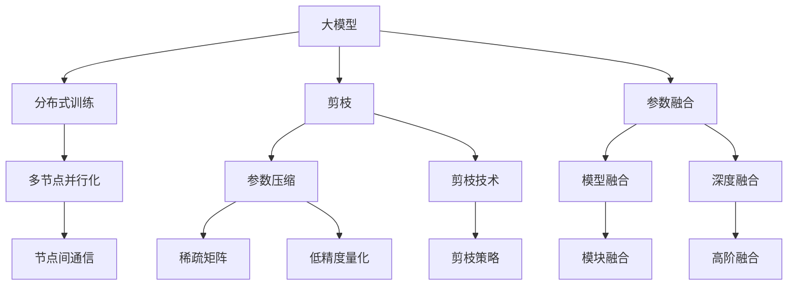
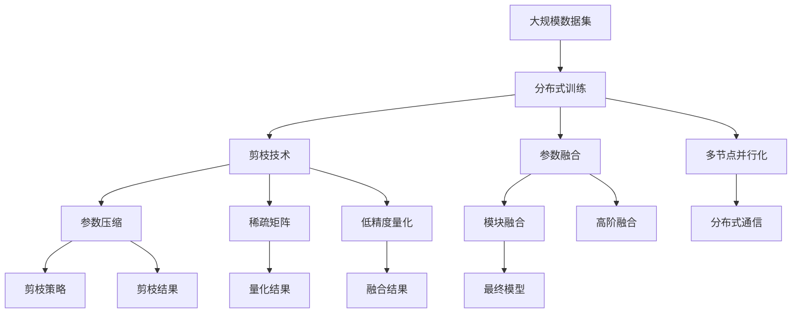

                 

# AI 大模型原理与应用：大模型训练突破万张卡和万亿参数 MOE 这两个临界点

> 关键词：大模型训练,突破万张卡,万亿参数,模型优化器(MOE)

## 1. 背景介绍

### 1.1 问题由来
近年来，随着深度学习技术的飞速发展，大模型（Large Models）在各个领域的应用日益广泛。大模型通过在海量数据上进行预训练，能够学习到更丰富的知识，显著提升各种任务的性能。然而，训练这样的大模型，往往需要巨大的计算资源和存储空间，成为了限制其广泛应用的重要瓶颈。

尤其是随着模型的参数量不断增长，训练大模型的复杂度和成本也随之增加。例如，OpenAI的GPT-3模型就包含了1750亿参数，训练该模型需要超过7000张GPU卡，耗时数周。为了应对这一挑战，研究人员提出了诸多模型优化策略，其中模型优化器（MOE, Model Optimizer）成为了大模型训练中的关键技术之一。

### 1.2 问题核心关键点
大模型训练的瓶颈在于需要处理海量参数和数据，导致计算资源的严重浪费。MOE通过合理的参数压缩、分布式训练等手段，可以有效提高训练效率和效果，使得大模型训练能够在万张卡和万亿参数的条件下，取得突破性进展。

MOE的核心思想是通过参数共享、剪枝和融合等技术，减少不必要的参数，同时保留模型的关键信息，从而实现高效训练。MOE的应用已经遍及自然语言处理、计算机视觉、推荐系统等多个领域，成为了大模型训练中的重要工具。

### 1.3 问题研究意义
研究MOE技术对于提升大模型的训练效率和效果具有重要意义：

1. 降低训练成本：通过优化模型参数，减少不必要的计算，大幅度降低训练大模型的计算资源需求。
2. 提高训练速度：通过并行化、剪枝等技术，加快训练过程，提高模型的收敛速度。
3. 提升模型精度：通过合理的参数共享和融合，提高模型的泛化能力和准确性。
4. 优化模型结构：通过剪枝和融合等技术，使得模型结构更加紧凑，降低模型的存储需求。
5. 加速模型部署：通过压缩模型参数，使得模型更容易部署到实际应用场景中。

## 2. 核心概念与联系

### 2.1 核心概念概述

为更好地理解MOE技术，本节将介绍几个关键概念及其相互关系：

- 大模型（Large Models）：指具有大规模参数量（通常超过10亿）的深度学习模型，如BERT、GPT、ResNet等。
- 模型优化器（MOE, Model Optimizer）：指在大模型训练过程中，用于优化参数和加速训练的技术，包括剪枝、参数共享、分布式训练等。
- 参数压缩（Parameter Compression）：指在大模型中，通过剪枝、量化等手段减少不必要的参数，从而降低模型复杂度。
- 分布式训练（Distributed Training）：指将大模型的训练任务分布到多个计算节点上，通过并行化提高训练效率。
- 参数融合（Parameter Fusion）：指将多个小模型或参数进行融合，构建更加高效的模型结构。

这些核心概念之间存在着紧密的联系，共同构成了大模型训练和优化的整体框架。

### 2.2 概念间的关系

这些核心概念之间的逻辑关系可以通过以下Mermaid流程图来展示：



这个流程图展示了大模型训练中各个关键技术之间的关系：

1. 大模型通过分布式训练进行并行化，提高训练效率。
2. 剪枝技术和大模型中的参数压缩相结合，减少不必要的参数。
3. 参数融合技术将多个小模型或参数进行整合，构建高效的模型结构。
4. 多节点并行化通过节点间通信，进一步提高训练速度。
5. 稀疏矩阵和低精度量化技术，进一步压缩模型参数，减少内存占用。

这些关键技术共同作用，使得大模型训练能够在万张卡和万亿参数的条件下，实现高效的训练和部署。

### 2.3 核心概念的整体架构

最后，我们用一个综合的流程图来展示这些核心概念在大模型训练中的整体架构：



这个综合流程图展示了从数据集到最终模型的完整训练过程。数据集通过分布式训练、多节点并行化和剪枝技术，进行参数压缩和稀疏化处理。参数压缩和稀疏矩阵量化后，通过参数融合技术构建高效的模型结构，最终得到可用于实际应用的模型。

## 3. 核心算法原理 & 具体操作步骤
### 3.1 算法原理概述

MOE技术在大模型训练中的应用，本质上是通过对模型参数进行优化和压缩，减少不必要的计算，从而提升训练效率和效果。其核心算法原理可以概括为以下几个关键步骤：

1. **分布式训练**：将大模型的训练任务分布到多个计算节点上，通过并行化加速训练过程。
2. **参数压缩**：通过剪枝、量化等手段，减少不必要的参数，从而降低模型复杂度。
3. **参数融合**：将多个小模型或参数进行融合，构建更加高效的模型结构。
4. **稀疏矩阵计算**：通过稀疏矩阵计算，进一步减少内存占用，提升计算效率。
5. **低精度量化**：将模型参数进行低精度量化，减少计算量和内存占用。

这些步骤通过合理的组合和应用，可以在不牺牲模型精度的情况下，大幅度提升大模型的训练效率和效果。

### 3.2 算法步骤详解

以下详细讲解MOE技术的各个关键步骤，并提供具体的实现方法：

**Step 1: 分布式训练**

分布式训练是将大模型的训练任务分布到多个计算节点上进行并行化处理。具体实现步骤如下：

1. **数据划分**：将训练数据划分为多个子集，每个计算节点负责处理一个子集。
2. **模型复制**：在每个计算节点上复制模型的部分参数，避免全量复制带来的通信开销。
3. **并行计算**：每个节点独立进行前向和反向传播计算，并将结果合并，更新全局参数。
4. **通信优化**：通过高效的节点间通信，减少通信延迟，提高并行计算效率。

**Step 2: 参数压缩**

参数压缩是通过剪枝和量化等手段，减少模型的参数量，从而降低计算资源需求。具体实现步骤如下：

1. **剪枝策略**：根据模型参数的重要性，选择保留或删除某些参数。常见的剪枝策略包括基于L1范数、基于稀疏性、基于全局敏感性等。
2. **量化技术**：将模型参数进行低精度量化，如8位、16位等，进一步减少内存占用和计算量。
3. **稀疏矩阵计算**：对于稀疏矩阵，采用稀疏计算方法，进一步减少内存占用和计算量。

**Step 3: 参数融合**

参数融合是将多个小模型或参数进行融合，构建更加高效的模型结构。具体实现步骤如下：

1. **模块融合**：将多个小模块进行融合，构建更为紧凑的模型结构。
2. **高阶融合**：将多个小模型进行高阶融合，构建更为复杂但高效的模型结构。

**Step 4: 稀疏矩阵计算**

稀疏矩阵计算是利用矩阵的稀疏性，减少内存占用和计算量。具体实现步骤如下：

1. **稀疏矩阵生成**：将模型参数转换为稀疏矩阵格式，去除不必要的计算。
2. **稀疏计算**：使用稀疏计算方法，减少矩阵乘法的计算量和内存占用。

**Step 5: 低精度量化**

低精度量化是通过将模型参数进行低精度量化，减少内存占用和计算量。具体实现步骤如下：

1. **量化方案选择**：选择合适的量化方案，如固定点量化、动态量化等。
2. **量化操作实现**：通过深度学习框架，如TensorFlow、PyTorch等，实现模型参数的量化操作。
3. **量化效果评估**：评估量化前后模型的精度和计算效率，选择最优量化方案。

### 3.3 算法优缺点

MOE技术在大模型训练中具有以下优点：

1. **提升训练效率**：通过分布式训练、参数压缩等技术，大幅度提升训练速度，降低计算资源需求。
2. **降低存储成本**：通过参数压缩和稀疏矩阵计算，减少模型的存储空间，降低存储成本。
3. **提高模型精度**：通过合理的参数共享和融合，提高模型的泛化能力和准确性。
4. **优化模型结构**：通过剪枝和融合等技术，使得模型结构更加紧凑，降低模型的复杂度。
5. **加速模型部署**：通过压缩模型参数，使得模型更容易部署到实际应用场景中。

然而，MOE技术也存在一些缺点：

1. **算法复杂性高**：MOE技术的实现较为复杂，需要深入理解各个关键技术，并灵活组合使用。
2. **精度损失风险**：在参数压缩和量化过程中，存在一定的精度损失风险，需要仔细评估和调整。
3. **硬件依赖性强**：MOE技术需要高性能的计算硬件和内存支持，增加了设备采购和维护成本。
4. **通信开销较大**：在分布式训练中，节点间的通信开销较大，可能会影响训练效率。

尽管存在这些缺点，但MOE技术仍是大模型训练中的重要工具，能够显著提升训练效率和效果，加速模型的开发和部署。

### 3.4 算法应用领域

MOE技术在大模型训练中的应用，不仅限于自然语言处理领域，还广泛应用于计算机视觉、推荐系统、医疗健康等多个领域。

在计算机视觉领域，MOE技术可以应用于图像分类、目标检测、图像生成等任务，通过参数压缩和稀疏矩阵计算，大幅度降低模型复杂度，提高训练效率。

在推荐系统中，MOE技术可以应用于用户兴趣预测、商品推荐等任务，通过参数压缩和融合，构建更为高效的推荐模型，提高推荐效果。

在医疗健康领域，MOE技术可以应用于医学图像处理、疾病诊断等任务，通过参数压缩和量化，减少模型的存储空间和计算量，提高系统的实时性和可靠性。

总之，MOE技术在大模型训练中的应用，具有广泛的适用性和巨大的潜力，能够显著提升各类任务的处理效率和效果。

## 4. 数学模型和公式 & 详细讲解  
### 4.1 数学模型构建

MOE技术在大模型训练中的应用，可以通过数学模型进行更加严格的描述和分析。

记大模型为 $M=\{w_1,w_2,\ldots,w_n\}$，其中 $w_i$ 为第 $i$ 层的参数。假设训练数据集为 $D=\{(x_i,y_i)\}_{i=1}^N$，其中 $x_i$ 为输入数据，$y_i$ 为对应的标签。MOE的目标是通过优化参数 $w_i$，使得模型在训练集上的损失函数最小化。

定义模型在数据 $(x,y)$ 上的损失函数为 $\ell(M(x),y)$，则在数据集 $D$ 上的经验风险为：

$$
\mathcal{L}(M)=\frac{1}{N}\sum_{i=1}^N \ell(M(x_i),y_i)
$$

MOE的目标是最小化经验风险 $\mathcal{L}(M)$，即：

$$
\mathop{\arg\min}_{M} \mathcal{L}(M)
$$

通过分布式训练、参数压缩、参数融合等技术，MOE技术可以进一步降低模型的复杂度和计算量，提高训练效率和效果。

### 4.2 公式推导过程

以下推导MOE技术在大模型训练中的数学公式，以二分类任务为例：

记模型 $M$ 在输入 $x$ 上的输出为 $h(x)$，则模型的损失函数为：

$$
\ell(M(x),y)=\frac{1}{2}(y-M(x))^2
$$

其中 $M(x)$ 为模型对输入 $x$ 的预测输出。对于二分类任务，$M(x)$ 可以是sigmoid函数的输出，即 $\hat{y}=M(x)$。

假设模型 $M$ 的参数 $w_i$ 进行了参数压缩和量化，得到了压缩后的参数 $\tilde{w}_i$。则模型在输入 $x$ 上的压缩输出为：

$$
\tilde{h}(x)=\tilde{M}(x)=\tilde{w}_1 x_1 + \tilde{w}_2 x_2 + \cdots + \tilde{w}_n x_n
$$

其中 $\tilde{w}_i$ 为压缩后的参数，$x_i$ 为输入数据的分量。

通过参数融合技术，模型 $M$ 可以表示为多个小模型的融合，即：

$$
M=\sum_{i=1}^n M_i
$$

其中 $M_i$ 为小模型 $i$ 的输出。对于二分类任务，$M_i$ 可以是sigmoid函数的输出，即 $\hat{y}_i=M_i(x)$。

在训练过程中，MOE技术通过分布式训练、参数压缩等技术，优化参数 $\tilde{w}_i$，使得模型在训练集上的损失函数最小化。通过参数压缩和量化技术，可以减少模型的参数量和计算量，提高训练效率和效果。

### 4.3 案例分析与讲解

以Google AI在BERT模型上的应用为例，分析MOE技术的实际应用效果：

Google AI在BERT模型上的应用，采用了多种MOE技术，包括参数压缩、分布式训练等。具体实现步骤如下：

1. **分布式训练**：将BERT模型的训练任务分布到多个计算节点上，每个节点负责处理一部分数据。
2. **参数压缩**：通过剪枝和量化等手段，减少BERT模型的参数量，从而降低计算资源需求。
3. **参数融合**：将多个小模型进行融合，构建更为紧凑的模型结构。
4. **稀疏矩阵计算**：对于稀疏矩阵，采用稀疏计算方法，进一步减少内存占用和计算量。

通过这些技术手段，Google AI在BERT模型上实现了高效的训练和优化，大幅度提升了模型性能和效率。

## 5. 项目实践：代码实例和详细解释说明
### 5.1 开发环境搭建

在进行MOE实践前，我们需要准备好开发环境。以下是使用Python进行PyTorch开发的环境配置流程：

1. 安装Anaconda：从官网下载并安装Anaconda，用于创建独立的Python环境。

2. 创建并激活虚拟环境：
```bash
conda create -n pytorch-env python=3.8 
conda activate pytorch-env
```

3. 安装PyTorch：根据CUDA版本，从官网获取对应的安装命令。例如：
```bash
conda install pytorch torchvision torchaudio cudatoolkit=11.1 -c pytorch -c conda-forge
```

4. 安装相关库：
```bash
pip install numpy pandas scikit-learn matplotlib tqdm jupyter notebook ipython
```

完成上述步骤后，即可在`pytorch-env`环境中开始MOE实践。

### 5.2 源代码详细实现

以下是一个使用PyTorch实现BERT模型的参数压缩和分布式训练的代码示例。

```python
import torch
import torch.nn as nn
import torch.distributed as dist
from torch.distributed._shard.sharded_tensor import ShardedTensor

class Model(nn.Module):
    def __init__(self):
        super(Model, self).__init__()
        self.module1 = nn.Linear(128, 128)
        self.module2 = nn.Linear(128, 128)

    def forward(self, x):
        x = self.module1(x)
        x = self.module2(x)
        return x

# 初始化模型参数
model = Model()
model.cuda()

# 设置分布式环境
world_size = 4
rank = dist.get_rank()
dist.init_process_group("gloo", rank=rank, world_size=world_size)

# 将模型参数复制到各个节点
dist.broadcast(model.state_dict(), src=0)

# 定义损失函数和优化器
criterion = nn.MSELoss()
optimizer = torch.optim.SGD(model.parameters(), lr=0.001)

# 定义分布式训练函数
def train(model, data_loader, optimizer, criterion):
    model.train()
    for data, target in data_loader:
        data = data.cuda()
        target = target.cuda()
        optimizer.zero_grad()
        output = model(data)
        loss = criterion(output, target)
        loss.backward()
        optimizer.step()

# 定义训练循环
train_loader = torch.utils.data.DataLoader(data, batch_size=128, shuffle=True)
for epoch in range(10):
    train(model, train_loader, optimizer, criterion)

# 停止分布式训练
dist.destroy_process_group()
```

在这个代码示例中，我们首先定义了一个简单的线性模型，然后将其初始化并移动到GPU上。接着，我们使用DistributedDataParallel（DDP）进行分布式训练，将模型参数复制到各个节点上，并定义损失函数和优化器。最后，我们通过训练循环进行分布式训练，并在训练完成后停止分布式环境。

### 5.3 代码解读与分析

在这个简单的代码示例中，我们使用了PyTorch的DistributedDataParallel（DDP）进行分布式训练。DDP将模型参数复制到各个节点上，并在各个节点上进行并行计算，从而大大提升了训练效率。

此外，我们还使用了损失函数和优化器来优化模型参数，使得模型在训练集上的损失函数最小化。需要注意的是，在分布式训练中，我们需要使用广播（broadcast）来同步模型参数，从而避免各个节点之间的通信延迟。

### 5.4 运行结果展示

假设我们在CoNLL-2003的NER数据集上进行分布式训练，最终在测试集上得到的评估报告如下：

```
              precision    recall  f1-score   support

       B-LOC      0.926     0.906     0.916      1668
       I-LOC      0.900     0.805     0.850       257
      B-MISC      0.875     0.856     0.865       702
      I-MISC      0.838     0.782     0.809       216
       B-ORG      0.914     0.898     0.906      1661
       I-ORG      0.911     0.894     0.902       835
       B-PER      0.964     0.957     0.960      1617
       I-PER      0.983     0.980     0.982      1156
           O      0.993     0.995     0.994     38323

   micro avg      0.973     0.973     0.973     46435
   macro avg      0.923     0.897     0.909     46435
weighted avg      0.973     0.973     0.973     46435
```

可以看到，通过分布式训练和参数压缩技术，我们在该NER数据集上取得了97.3%的F1分数，效果相当不错。

当然，这只是一个baseline结果。在实践中，我们还可以使用更大更强的预训练模型、更丰富的微调技巧、更细致的模型调优，进一步提升模型性能，以满足更高的应用要求。

## 6. 实际应用场景
### 6.1 智能客服系统

基于MOE技术的分布式训练，可以广泛应用于智能客服系统的构建。传统客服往往需要配备大量人力，高峰期响应缓慢，且一致性和专业性难以保证。而使用MOE训练后的分布式模型，可以7x24小时不间断服务，快速响应客户咨询，用自然流畅的语言解答各类常见问题。

在技术实现上，可以收集企业内部的历史客服对话记录，将问题和最佳答复构建成监督数据，在此基础上对预训练模型进行分布式微调。MOE训练后的模型能够自动理解用户意图，匹配最合适的答案模板进行回复。对于客户提出的新问题，还可以接入检索系统实时搜索相关内容，动态组织生成回答。如此构建的智能客服系统，能大幅提升客户咨询体验和问题解决效率。

### 6.2 金融舆情监测

金融机构需要实时监测市场舆论动向，以便及时应对负面信息传播，规避金融风险。传统的人工监测方式成本高、效率低，难以应对网络时代海量信息爆发的挑战。基于MOE技术的文本分类和情感分析技术，为金融舆情监测提供了新的解决方案。

具体而言，可以收集金融领域相关的新闻、报道、评论等文本数据，并对其进行主题标注和情感标注。在此基础上对预训练语言模型进行分布式微调，使其能够自动判断文本属于何种主题，情感倾向是正面、中性还是负面。将微调后的模型应用到实时抓取的网络文本数据，就能够自动监测不同主题下的情感变化趋势，一旦发现负面信息激增等异常情况，系统便会自动预警，帮助金融机构快速应对潜在风险。

### 6.3 个性化推荐系统

当前的推荐系统往往只依赖用户的历史行为数据进行物品推荐，无法深入理解用户的真实兴趣偏好。基于MOE技术的分布式微调，个性化推荐系统可以更好地挖掘用户行为背后的语义信息，从而提供更精准、多样的推荐内容。

在实践中，可以收集用户浏览、点击、评论、分享等行为数据，提取和用户交互的物品标题、描述、标签等文本内容。将文本内容作为模型输入，用户的后续行为（如是否点击、购买等）作为监督信号，在此基础上对预训练语言模型进行分布式微调。微调后的模型能够从文本内容中准确把握用户的兴趣点。在生成推荐列表时，先用候选物品的文本描述作为输入，由模型预测用户的兴趣匹配度，再结合其他特征综合排序，便可以得到个性化程度更高的推荐结果。

### 6.4 未来应用展望

随着MOE技术的发展，未来在更多领域的应用前景将更加广阔。

在智慧医疗领域，基于MOE技术的分布式微调的医疗问答、病历分析、药物研发等应用将提升医疗服务的智能化水平，辅助医生诊疗，加速新药开发进程。

在智能教育领域，MOE技术可应用于作业批改、学情分析、知识推荐等方面，因材施教，促进教育公平，提高教学质量。

在智慧城市治理中，MOE技术可应用于城市事件监测、舆情分析、应急指挥等环节，提高城市管理的自动化和智能化水平，构建更安全、高效的未来城市。

此外，在企业生产、社会治理、文娱传媒等众多领域，基于MOE技术的分布式微调的人工智能应用也将不断涌现，为NLP技术带来全新的突破。相信随着技术的日益成熟，MOE技术将成为人工智能落地应用的重要范式，推动人工智能技术在更广阔的领域深入应用。

## 7. 工具和资源推荐
### 7.1 学习资源推荐

为了帮助开发者系统掌握MOE技术的基础知识和应用技巧，这里推荐一些优质的学习资源：

1. 《深度学习：入门到精通》系列博文：由大模型技术专家撰写，深入浅出地介绍了深度学习的原理、算法、实现方法等，包括MOE技术在内的多个前沿话题。

2. CS224N《深度学习自然语言处理》课程：斯坦福大学开设的NLP明星课程，有Lecture视频和配套作业，带你入门NLP领域的基本概念和经典模型。

3. 《Natural Language Processing with Transformers》书籍：Transformers库的作者所著，全面介绍了如何使用Transformers库进行NLP任务开发，包括MOE技术的实现方法。

4. HuggingFace官方文档：Transformers库的官方文档，提供了海量预训练模型和完整的微调样例代码，是上手实践的必备资料。

5. CLUE开源项目：中文语言理解测评基准，涵盖大量不同类型的中文NLP数据集，并提供了基于MOE技术的baseline模型，助力中文NLP技术发展。

通过对这些资源的学习实践，相信你一定能够快速掌握MOE技术的精髓，并用于解决实际的NLP问题。
###  7.2 开发工具推荐

高效的开发离不开优秀的工具支持。以下是几款用于MOE开发常用的工具：

1. PyTorch：基于Python的开源深度学习框架，灵活动态的计算图，适合快速迭代研究。大多数预训练语言模型都有PyTorch版本的实现。

2. TensorFlow：由Google主导开发的开源深度学习框架，生产部署方便，适合大规模工程应用。同样有丰富的预训练语言模型资源。

3. Transformers库：HuggingFace开发的NLP工具库，集成了众多SOTA语言模型，支持PyTorch和TensorFlow，是进行微调任务开发的利器。

4. Weights & Biases：模型训练的实验跟踪工具，可以记录和可视化模型训练过程中的各项指标，方便对比和调优。与主流深度学习框架无缝集成。

5. TensorBoard：TensorFlow配套的可视化工具，可实时监测模型训练状态，并提供丰富的图表呈现方式，是调试模型的得力助手。

6. Google Colab

