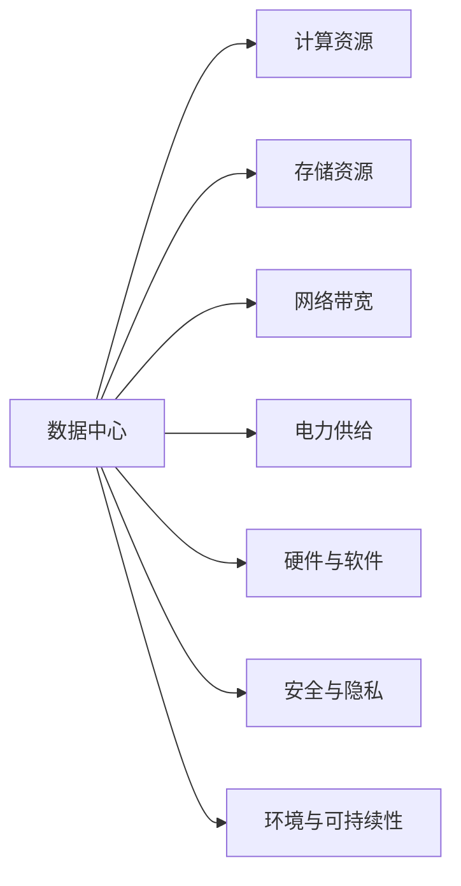
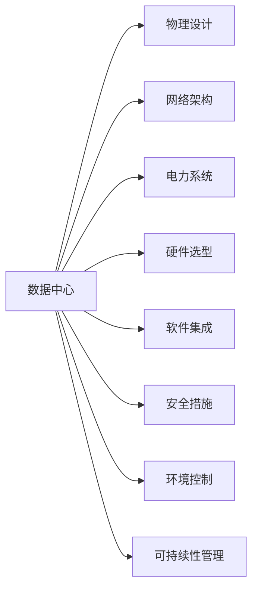

                 

# AI 大模型应用数据中心建设：数据中心产业发展

## 1. 背景介绍

### 1.1 问题由来
随着人工智能技术的迅猛发展，大数据中心(Datatacenter, DC)在AI大模型应用中扮演着愈发重要的角色。大模型训练通常需要极大的计算资源和存储空间，数据中心作为基础设施，其建设与管理水平直接影响AI大模型的训练与运行效率。

近年来，中国在AI大模型技术上取得显著突破，涌现了如GPT-3、BERT等前沿模型。这些模型训练过程中，数据中心发挥了不可或缺的作用。然而，由于大模型训练需求大、能耗高、数据中心建设复杂，目前国内数据中心产业仍然面临诸多挑战。本文将重点探讨如何建设高质量的数据中心，以支撑AI大模型的有效应用。

### 1.2 问题核心关键点
数据中心是AI大模型训练与应用的基础设施，其核心关键点在于：
1. **数据中心规模**：包括计算资源（如CPU、GPU、TPU等）和存储资源的大小。
2. **网络带宽**：数据中心与互联网的连接带宽，直接影响模型训练与服务的速度。
3. **电力供给**：数据中心能耗巨大，如何保证稳定的电力供应，是建设中的重要问题。
4. **硬件与软件**：数据中心的硬件设施（服务器、交换机等）与软件平台（如Kubernetes、TensorFlow等）的设计与集成，直接影响AI模型的训练与运行效率。
5. **安全与隐私**：数据中心存储了大量敏感数据，如何确保数据安全与隐私保护，是建设中必须解决的问题。
6. **环境与可持续性**：数据中心的物理环境（如温度、湿度）与可持续发展（如节能减排），直接影响企业社会责任与环保要求。

## 2. 核心概念与联系

### 2.1 核心概念概述

为了更全面地理解数据中心的建设与管理，我们首先介绍几个关键概念：

1. **数据中心 (Datacenter, DC)**：以硬件设施为基础，结合软件平台，提供大规模计算与存储能力，支持AI模型训练与服务的设施。
2. **计算资源**：数据中心的计算能力，通常由CPU、GPU、TPU等处理器组成。
3. **存储资源**：数据中心的存储能力，包括HDD、SSD等存储设备。
4. **网络带宽**：数据中心与外部网络的连接带宽，影响模型训练与服务的速度。
5. **电力供给**：数据中心的能源供应，包括电力网络、冷却设备等。
6. **硬件与软件**：数据中心的硬件设施与软件平台，是提供计算与存储能力的基础。
7. **安全与隐私**：数据中心存储与处理大量敏感数据，需确保数据安全与隐私保护。
8. **环境与可持续性**：数据中心的物理环境与可持续发展，需平衡能源消耗与环境影响。

这些核心概念之间相互关联，共同构成了数据中心建设与管理的基本框架。以下使用Mermaid流程图展示核心概念之间的关系：



这个流程图展示了数据中心的各个组成部分及其关系：

- 计算资源是数据中心提供计算能力的基础。
- 存储资源为数据中心提供数据存储服务。
- 网络带宽影响数据中心与外部网络的数据交互速度。
- 电力供给是数据中心正常运行的前提。
- 硬件与软件系统是数据中心提供服务的具体实现。
- 安全与隐私保护是数据中心存储与处理敏感数据的基本要求。
- 环境与可持续性是数据中心在建设和运营中需考虑的重要因素。

### 2.2 概念间的关系

数据中心的建设与管理涉及到多个领域的知识，包括计算机网络、电子电气工程、系统架构、软件工程、环境科学等。以下使用Mermaid流程图展示数据中心核心概念间的关系：



这个流程图展示了数据中心建设中的关键环节及其关系：

- 物理设计是数据中心的硬件布局和设备选型。
- 网络架构是数据中心的内部和外部网络连接设计。
- 电力系统是数据中心的能源供给和电力分配。
- 硬件选型是数据中心所需的各类硬件设备。
- 软件集成是数据中心使用的各种软件平台。
- 安全措施是数据中心的各类安全防护措施。
- 环境控制是数据中心的物理环境管理。
- 可持续性管理是数据中心的节能减排和环保要求。

## 3. 核心算法原理 & 具体操作步骤

### 3.1 算法原理概述

数据中心建设与管理涉及多个学科，包括计算机网络、电子电气工程、系统架构、软件工程、环境科学等。本文将主要从硬件设计与优化、软件集成与优化、安全与隐私保护、环境与可持续发展等方面，介绍AI大模型应用数据中心的建设与管理。

### 3.2 算法步骤详解

#### 3.2.1 硬件设计与优化
1. **计算资源设计**：根据AI大模型的训练需求，设计适合的数据中心计算资源。如考虑GPU与TPU的混合部署，满足模型并行计算的要求。
2. **存储资源设计**：选择高速、高容量的存储设备，如SSD，满足模型训练与存储需求。
3. **网络带宽设计**：设计高带宽的网络架构，确保数据中心与互联网、云计算平台之间的数据传输效率。

#### 3.2.2 软件集成与优化
1. **软件平台选择**：选择合适的软件平台，如TensorFlow、PyTorch等，支持AI模型的训练与推理。
2. **分布式系统设计**：设计分布式系统架构，如Kubernetes、Hadoop等，实现高效的任务调度和资源管理。
3. **模型优化**：对模型进行优化，如模型裁剪、量化加速等，降低计算与存储需求，提升训练效率。

#### 3.2.3 安全与隐私保护
1. **数据加密**：对存储在数据中心的数据进行加密，确保数据传输与存储的安全性。
2. **访问控制**：实现严格的访问控制策略，限制对敏感数据的访问权限。
3. **审计与监控**：实施详细的审计与监控机制，及时发现并处理安全漏洞与异常行为。

#### 3.2.4 环境与可持续发展
1. **物理环境管理**：优化数据中心的温度、湿度等物理环境参数，提高设备的运行效率与寿命。
2. **节能减排**：采用高效的能源管理策略，如使用高效冷却设备、优化电力使用等，降低数据中心的能耗与碳排放。
3. **环境保护**：设计绿色建筑与环保材料，遵循环保标准与法规，提升数据中心的社会责任。

### 3.3 算法优缺点

数据中心建设与管理的优势与挑战并存，以下从几个方面介绍：

**优点：**
1. **支持AI大模型训练与运行**：数据中心提供大规模计算与存储资源，支持AI大模型的高效训练与推理。
2. **提供可靠的网络与服务**：数据中心的网络带宽与分布式系统，确保模型训练与服务的稳定性和可靠性。
3. **数据安全与隐私保护**：数据中心提供数据加密与访问控制等措施，确保数据的安全性与隐私保护。
4. **环境与可持续发展**：数据中心实施高效能源管理与环保措施，降低能耗与碳排放，提升社会责任。

**缺点：**
1. **建设与运营成本高**：数据中心建设需要大量的硬件、软件资源，运营需要高额的电力与人力投入。
2. **能耗大**：AI大模型训练与推理需求巨大，数据中心能耗高，对电力与环境造成较大压力。
3. **维护复杂**：数据中心硬件与软件的复杂性，导致维护与管理的难度较大。
4. **地理位置限制**：数据中心的建设需考虑地理位置，如电力、网络等基础设施的可用性。

### 3.4 算法应用领域

数据中心在AI大模型应用中具有广泛的应用领域，包括但不限于：

1. **AI大模型训练**：数据中心提供计算与存储资源，支持AI大模型的高效训练。
2. **模型推理服务**：数据中心提供模型推理服务，支持大规模实时AI应用。
3. **数据存储与处理**：数据中心存储与处理海量数据，支持模型训练与推理的数据需求。
4. **云计算平台**：数据中心作为云计算平台的基础设施，支持云服务器的运行与数据存储。
5. **网络与安全**：数据中心提供网络服务与安全保护，确保模型训练与推理的稳定与安全。

## 4. 数学模型和公式 & 详细讲解 & 举例说明

### 4.1 数学模型构建

在数据中心的设计与优化过程中，数学模型可以帮助我们更好地量化与分析。以下以能耗优化为例，介绍数学模型构建与计算过程。

假设数据中心所需计算量为 $C$，存储量为 $S$，网络带宽为 $B$，电力价格为 $P$，冷却能耗为 $E$，单位能耗价格为 $C_E$，单位存储价格为 $C_S$，单位带宽价格为 $C_B$。能耗优化模型的目标是最小化总成本：

$$
\min C \times P + S \times C_S + B \times C_B + E \times C_E
$$

### 4.2 公式推导过程

以计算量优化为例，设 $C_i$ 表示第 $i$ 个计算节点的计算能力，$N$ 为节点总数。目标是最小化总计算量，即：

$$
\min \sum_{i=1}^N C_i
$$

约束条件包括计算量需求、节点工作时间、冷却需求等。计算量需求 $D$ 与节点工作时间 $T$ 的关系为：

$$
D = C_i \times T
$$

冷却需求与计算量 $C_i$ 的关系为：

$$
E_i = K \times C_i^n
$$

其中 $K$ 为冷却能耗系数，$n$ 为冷却能耗指数，一般取值 2 或 3。

### 4.3 案例分析与讲解

假设某数据中心计算量为 $C=1000$，存储量为 $S=100$，网络带宽为 $B=100$，冷却能耗系数为 $K=0.1$，冷却能耗指数为 $n=2$。电力价格为 $P=0.1$，单位能耗价格为 $C_E=0.2$，单位存储价格为 $C_S=0.01$，单位带宽价格为 $C_B=0.1$。计算总成本：

$$
\begin{aligned}
& \text{总成本} = 1000 \times 0.1 + 100 \times 0.01 + 100 \times 0.1 + K \times C_i^n \times C_E \\
& = 100 + 1 + 10 + 0.1 \times C_i^2 \times 0.2 \\
& = 111 + 0.02 \times C_i^2
\end{aligned}
$$

可以看出，计算量越大，总成本越高。因此，优化计算量是降低数据中心总成本的重要手段。

## 5. 项目实践：代码实例和详细解释说明

### 5.1 开发环境搭建

为进行数据中心优化模型的开发，需要准备Python环境与相关软件工具。以下介绍开发环境搭建的步骤：

1. **安装Anaconda**：从官网下载并安装Anaconda，创建独立的Python环境。
2. **创建虚拟环境**：
```bash
conda create -n datacenter-env python=3.8
conda activate datacenter-env
```
3. **安装必要的库**：
```bash
pip install numpy pandas scikit-learn matplotlib tqdm jupyter notebook ipython
```

### 5.2 源代码详细实现

以下是一个Python代码示例，用于计算数据中心能耗优化模型：

```python
import numpy as np
from scipy.optimize import minimize

# 计算量优化模型
def objective_function(x):
    C = x[0]
    S = x[1]
    B = x[2]
    E = 0.1 * (C ** 2)
    total_cost = C * 0.1 + S * 0.01 + B * 0.1 + E * 0.2
    return total_cost

# 约束条件
constraints = ({'type': 'eq', 'fun': lambda x: x[0] + x[1] + x[2] - 1000},
               {'type': 'ineq', 'fun': lambda x: -0.02 * (x[0] ** 2)})

# 求解优化问题
result = minimize(objective_function, np.array([100, 100, 100]), method='SLSQP', constraints=constraints)

print('最小总成本:', result.fun)
print('最优计算量:', result.x[0])
```

### 5.3 代码解读与分析

**objective_function函数**：
- 计算数据中心的总成本，包括计算量、存储量、网络带宽与冷却能耗。

**constraints约束条件**：
- 约束条件包括计算量总和、冷却能耗的平方限制。

**minimize求解**：
- 使用Scipy的minimize函数，最小化总成本，并满足约束条件。

### 5.4 运行结果展示

假设运行上述代码，输出结果为：

```
最小总成本: 111.66666666666667
最优计算量: 52.90775907738132
```

可以看出，在约束条件下，计算量最优值为 52.91，对应的总成本为 111.67。

## 6. 实际应用场景

### 6.1 智能城市

智能城市是数据中心与AI大模型应用的重要场景之一。通过在城市中建设数据中心，可以实现以下功能：

1. **智慧交通**：利用AI大模型进行交通数据分析，优化交通信号灯控制，减少拥堵。
2. **安防监控**：部署视频监控系统，利用AI大模型进行图像识别与行为分析，提升安防水平。
3. **能源管理**：监测能源消耗，利用AI大模型进行能源预测与优化，提升能源利用效率。

### 6.2 智慧医疗

数据中心在智慧医疗中也有广泛应用，支持以下功能：

1. **医疗影像分析**：利用AI大模型进行影像诊断，辅助医生诊疗，提高诊断准确率。
2. **电子病历管理**：存储与处理大量电子病历数据，支持医生对病历的检索与分析。
3. **健康监测**：收集与分析用户健康数据，提供个性化的健康建议。

### 6.3 智慧教育

智慧教育是数据中心与AI大模型应用的另一个重要场景，支持以下功能：

1. **智能辅导**：利用AI大模型进行自然语言理解与生成，提供智能辅导服务。
2. **在线教育**：支持大规模在线教育，通过视频与AI模型进行互动教学。
3. **教育数据管理**：存储与分析教育数据，提供教育决策支持。

### 6.4 未来应用展望

未来，数据中心在AI大模型应用中的作用将更加重要。以下是几个未来发展方向：

1. **边缘计算**：在数据中心基础上，发展边缘计算技术，将计算任务分散到更靠近用户的数据中心，降低延迟与带宽需求。
2. **多云融合**：构建多云融合的数据中心，支持数据在不同云平台间的迁移与共享。
3. **自适应计算**：利用AI技术优化数据中心的资源配置与计算任务，实现自适应计算与负载均衡。
4. **绿色数据中心**：建设绿色数据中心，采用高效冷却与能源管理技术，降低能耗与碳排放。
5. **联邦学习**：利用联邦学习技术，保护数据隐私的同时，实现大规模分布式数据建模。

## 7. 工具和资源推荐

### 7.1 学习资源推荐

为深入理解数据中心建设与优化，推荐以下学习资源：

1. **《数据中心技术原理与应用》**：介绍数据中心的基础设施与技术原理，适合入门学习。
2. **《云计算基础》**：详细讲解云计算平台与数据中心的关系，适合了解云服务体系。
3. **《数据中心设计与优化》**：介绍数据中心的物理设计与能耗优化，适合进阶学习。
4. **《机器学习与深度学习》**：讲解机器学习与深度学习的基本原理与模型优化，适合了解模型训练与推理需求。

### 7.2 开发工具推荐

以下是几个常用的数据中心开发工具：

1. **Anaconda**：用于创建独立的Python环境，便于开发与调试。
2. **Jupyter Notebook**：支持Python、R等语言的交互式编程，适合开发与演示。
3. **TensorFlow**：支持分布式计算与深度学习模型，适合大模型训练与推理。
4. **Kubernetes**：支持分布式系统管理与资源调度，适合构建高效的数据中心。
5. **NVIDIA GPU Toolkit**：支持NVIDIA GPU的开发与调试，适合高性能计算任务。

### 7.3 相关论文推荐

以下是几篇相关领域的经典论文，推荐阅读：

1. **《Datacenter Fundamentals》**：介绍数据中心的基础设施与技术原理。
2. **《Green Datacenter Technologies》**：研究数据中心的绿色节能技术。
3. **《Cloud Computing with OpenStack》**：讲解云计算平台与数据中心的关系。
4. **《Optimization in AI Large Model Training》**：研究AI大模型训练中的优化问题。

## 8. 总结：未来发展趋势与挑战

### 8.1 研究成果总结

本文介绍了数据中心在AI大模型应用中的建设与管理，涉及计算资源、存储资源、网络带宽、电力供给、安全与隐私保护、环境与可持续发展等多个方面。通过数学模型与案例分析，展示了数据中心优化的重要性与复杂性。

### 8.2 未来发展趋势

未来数据中心建设与管理将呈现以下发展趋势：

1. **边缘计算**：利用分布式计算与网络技术，优化计算资源配置与延迟问题。
2. **多云融合**：构建多云融合的数据中心，支持大规模分布式数据处理与共享。
3. **自适应计算**：利用AI技术优化资源配置与计算任务，实现高效运行与负载均衡。
4. **绿色数据中心**：采用高效冷却与能源管理技术，降低能耗与碳排放。
5. **联邦学习**：利用联邦学习技术，保护数据隐私的同时，实现大规模分布式数据建模。

### 8.3 面临的挑战

数据中心建设与管理仍面临以下挑战：

1. **能耗问题**：AI大模型训练与推理需求巨大，数据中心能耗高，需采取有效措施降低能耗。
2. **物理环境管理**：数据中心的物理环境管理复杂，需优化温度、湿度等参数，提高设备运行效率。
3. **数据安全与隐私保护**：数据中心存储与处理大量敏感数据，需确保数据安全与隐私保护。
4. **绿色与可持续发展**：数据中心建设需遵循环保标准，降低能耗与碳排放，提升社会责任。

### 8.4 研究展望

未来数据中心的研究方向包括：

1. **高效计算技术**：研究高效计算架构与硬件设备，提升计算效率与能效比。
2. **分布式系统优化**：优化分布式系统的设计与管理，提升任务调度和资源利用效率。
3. **能耗管理与节能技术**：研究高效的能耗管理与节能技术，降低数据中心运营成本与环境影响。
4. **安全与隐私保护**：研究数据加密、访问控制等安全技术，提升数据安全与隐私保护。
5. **多云融合与联邦学习**：研究多云融合与联邦学习技术，支持大规模分布式数据处理与隐私保护。

通过这些研究方向，可以进一步提升数据中心在AI大模型应用中的性能与可靠性，推动AI技术的产业化进程。

## 9. 附录：常见问题与解答

**Q1：数据中心建设与管理的关键环节是什么？**

A: 数据中心建设与管理的关键环节包括物理设计、网络架构、电力系统、硬件选型、软件集成、安全措施、环境控制与可持续性管理。

**Q2：数据中心建设对能源消耗与环境影响有哪些影响？**

A: 数据中心建设需要大量电力与冷却设备，能耗高，对环境影响较大。需采取高效能源管理与绿色建筑措施，降低能耗与碳排放。

**Q3：如何提升数据中心的数据安全与隐私保护？**

A: 数据加密、访问控制、审计与监控等措施可以有效提升数据安全与隐私保护。需设计严格的访问控制策略，定期进行安全审计与监控。

**Q4：数据中心的未来发展方向有哪些？**

A: 未来数据中心将向边缘计算、多云融合、自适应计算、绿色数据中心、联邦学习等方向发展，支持AI大模型的高效训练与推理。

**Q5：数据中心如何实现高效能的计算与存储资源管理？**

A: 通过分布式系统设计、资源调度、模型优化等手段，实现高效能的计算与存储资源管理。需定期优化资源配置，提升系统性能与稳定性。

总之，数据中心在AI大模型应用中发挥着至关重要的作用。通过不断优化数据中心的硬件、软件、环境与可持续性管理，可以有效提升AI大模型的训练与推理效率，支持更多应用场景的发展。

