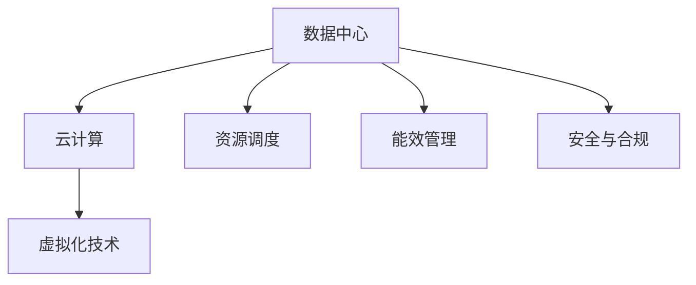
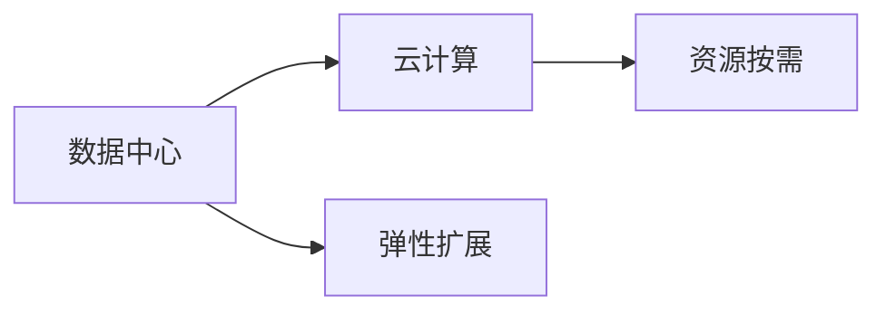
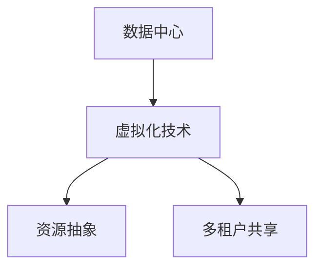
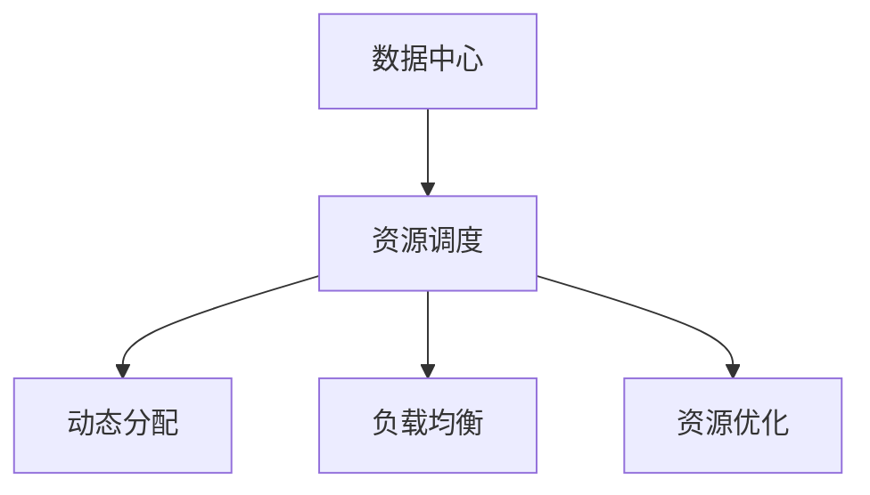
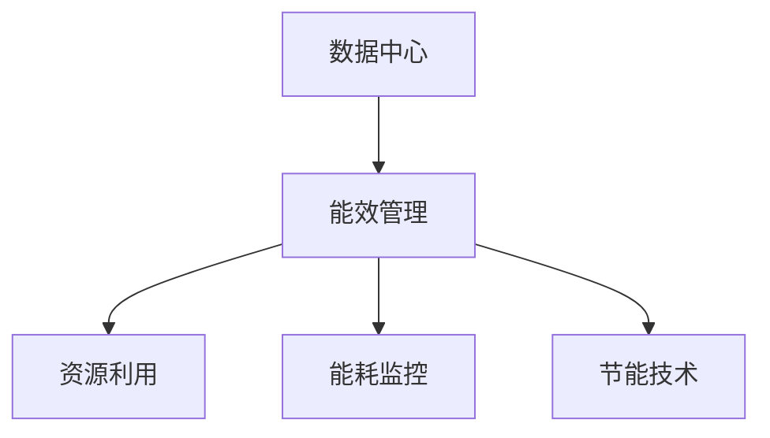
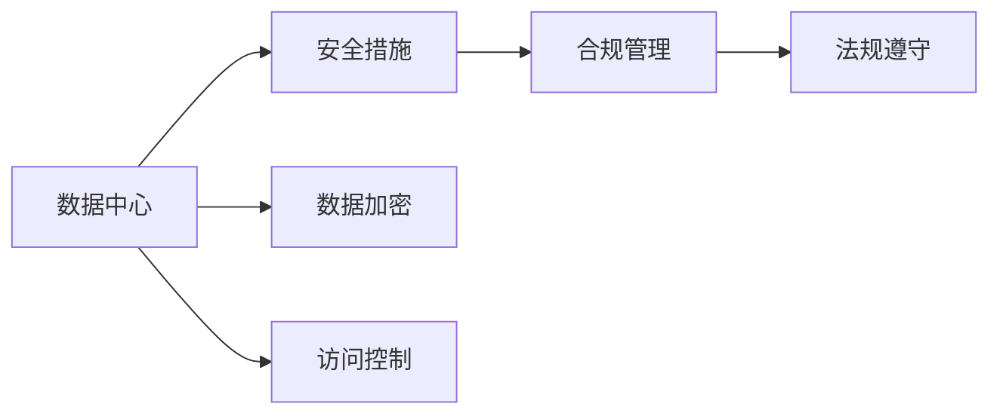
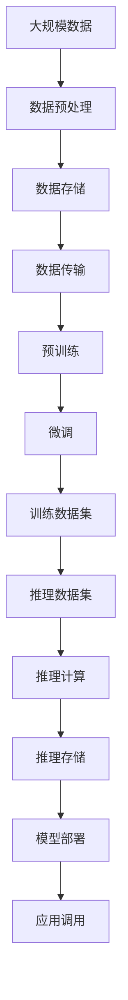

                 

# AI 大模型应用数据中心建设：数据中心运营与管理

> 关键词：AI大模型、数据中心、运营与管理、系统架构、云计算、虚拟化技术、资源调度、能效优化、安全与合规

## 1. 背景介绍

### 1.1 问题由来
随着人工智能（AI）技术的飞速发展，AI大模型在自然语言处理（NLP）、计算机视觉、语音识别等领域取得了显著进展。这些大模型通常基于大规模数据进行预训练，然后针对特定任务进行微调，以实现高效的应用。然而，预训练和微调需要大量的计算资源和存储资源，这对数据中心的运营和管理提出了更高的要求。

数据中心是支持AI大模型训练和应用的硬件基础设施。其运营与管理不仅涉及硬件和软件设备的维护，还涵盖了网络、安全、能效等方面的挑战。如何构建一个高效、可靠、安全的数据中心，以支撑AI大模型的应用，成为了一个重要课题。

### 1.2 问题核心关键点
1. **硬件选择与部署**：如何选择和部署合适的硬件设备，如CPU、GPU、TPU等，以满足AI大模型对计算和存储资源的需求。
2. **系统架构设计**：如何设计一个高效、灵活、可扩展的系统架构，以支持不同规模和类型的AI大模型。
3. **资源调度与优化**：如何通过资源调度算法和优化策略，最大化利用计算资源，提升AI大模型的训练与推理效率。
4. **能效管理与优化**：如何有效管理数据中心的能耗，降低运营成本，同时保障系统的稳定性和可靠性。
5. **安全与合规**：如何在数据中心中实施严格的安全措施和合规管理，确保数据和模型的安全。

### 1.3 问题研究意义
数据中心的建设与管理，直接关系到AI大模型应用的效率、成本和安全性。一个高效、安全、可靠的数据中心，可以为AI大模型提供稳定的运行环境，加速其在各行各业的应用落地。通过研究数据中心的设计与运营，可以为AI大模型的应用提供坚实的硬件基础和稳定的技术支撑，推动AI技术的发展和应用。

## 2. 核心概念与联系

### 2.1 核心概念概述

为更好地理解数据中心在AI大模型应用中的作用，本节将介绍几个密切相关的核心概念：

- **数据中心**：指由网络、计算、存储、电力等基础设施组成的大型设施，用于支持AI大模型的训练和应用。
- **云计算**：指通过互联网提供计算、存储、网络等服务的模式，可以实现按需使用、弹性扩展。
- **虚拟化技术**：指通过软件技术，将物理资源抽象为虚拟资源，支持多租户共享资源。
- **资源调度**：指通过算法和策略，对数据中心中的计算资源进行动态分配和调度，以提高利用率。
- **能效管理**：指对数据中心中的能耗进行管理与优化，降低运营成本，提升系统的可持续性。
- **安全与合规**：指在数据中心中实施严格的安全措施和合规管理，确保数据和模型的安全。

这些概念之间的逻辑关系可以通过以下Mermaid流程图来展示：



这个流程图展示了大模型应用数据中心的各个关键组件及其之间的关系：

1. 数据中心作为硬件基础设施，支撑云计算平台的运行。
2. 云计算平台提供灵活的资源调度服务，支持大模型训练与推理。
3. 虚拟化技术实现资源抽象和共享，提高资源的利用率。
4. 资源调度算法优化计算资源的分配，提升系统的效率。
5. 能效管理降低能耗，优化系统的经济性。
6. 安全与合规保障数据和模型的安全，确保合规性。

### 2.2 概念间的关系

这些核心概念之间存在着紧密的联系，构成了大模型应用数据中心的完整生态系统。下面我们通过几个Mermaid流程图来展示这些概念之间的关系。

#### 2.2.1 数据中心与云计算的关系



这个流程图展示了数据中心与云计算的关系。数据中心作为云计算的基础设施，支持云计算平台提供的弹性扩展和按需服务。

#### 2.2.2 虚拟化技术在数据中心中的应用



这个流程图展示了虚拟化技术在大模型应用数据中心中的应用。虚拟化技术实现资源抽象和多租户共享，提高了计算资源的利用率。

#### 2.2.3 资源调度与优化



这个流程图展示了资源调度在大模型应用数据中心中的作用。通过动态分配和负载均衡，资源调度算法提升了计算资源的利用率。

#### 2.2.4 能效管理与优化



这个流程图展示了能效管理在大模型应用数据中心中的应用。能效管理通过监控和优化资源利用，降低了数据中心的能耗。

#### 2.2.5 安全与合规在大模型应用中的重要性



这个流程图展示了安全与合规在大模型应用数据中心中的重要性。通过实施数据加密、访问控制等措施，保障数据和模型的安全，同时遵守相关法规。

### 2.3 核心概念的整体架构

最后，我们用一个综合的流程图来展示这些核心概念在大模型应用数据中心的整体架构：



这个综合流程图展示了从数据预处理到模型部署的完整流程：

1. 大规模数据经过预处理后，存储在数据中心。
2. 预训练和微调在计算资源上完成，生成的模型和数据集存储在数据中心。
3. 推理计算在数据中心中完成，推理结果存储在数据中心。
4. 模型部署后，通过API接口被应用调用。

通过这些流程图，我们可以更清晰地理解大模型应用数据中心的概念及其相互关系，为后续深入讨论具体的建设与管理方法奠定基础。

## 3. 核心算法原理 & 具体操作步骤
### 3.1 算法原理概述

大模型应用数据中心的建设与管理，涉及到多个关键算法的应用。本节将介绍这些算法的核心原理。

**3.1.1 硬件选择与部署**

选择合适的硬件设备是构建高效数据中心的基础。对于AI大模型，常用的硬件包括CPU、GPU、TPU等。其中，TPU作为专门针对深度学习的硬件，在加速训练和推理方面表现优异。硬件选择需考虑数据中心的规模、任务类型、能效需求等因素。

**3.1.2 系统架构设计**

设计一个高效的系统架构，需要考虑计算、存储、网络等各个组件的合理配置。常用的架构包括：

- **分布式计算架构**：通过多台服务器组成计算集群，支持大规模模型训练和推理。
- **分布式存储架构**：通过多台存储设备组成分布式存储系统，支持海量数据的高效读写。
- **网络架构**：通过高速网络交换机和光模块，确保数据中心内部和外部的数据传输速率。

**3.1.3 资源调度与优化**

资源调度的核心目标是最大化利用计算资源，提升系统的效率。常用的调度算法包括：

- **动态资源分配**：根据任务需求，动态分配计算资源，避免资源浪费。
- **负载均衡**：通过算法将任务均衡分配到多个计算节点上，提升系统的并发处理能力。
- **资源优化**：通过算法优化资源使用，减少资源空闲时间，提高利用率。

**3.1.4 能效管理与优化**

能效管理的目标是降低数据中心的能耗，提升系统的可持续性。常用的能效管理策略包括：

- **能源管理**：通过监控和管理电力消耗，降低能耗。
- **冷却系统**：通过高效的冷却技术，降低设备运行温度，延长使用寿命。
- **节能技术**：通过引入节能技术，如智能算法、高效硬件等，进一步降低能耗。

**3.1.5 安全与合规**

数据中心的安全与合规管理，涉及到数据加密、访问控制、法规遵守等多个方面。常用的安全措施包括：

- **数据加密**：对数据进行加密存储和传输，防止数据泄露。
- **访问控制**：通过身份验证、权限管理等措施，确保数据和模型的访问安全。
- **合规管理**：遵循相关法规，确保数据和模型的使用符合合规要求。

### 3.2 算法步骤详解

大模型应用数据中心的建设与管理，涉及多个步骤。本节将详细介绍这些步骤。

**3.2.1 硬件选择与部署**

1. **评估需求**：根据AI大模型的规模和类型，评估所需的计算和存储资源。
2. **选择硬件**：根据需求选择合适的硬件设备，如CPU、GPU、TPU等。
3. **部署硬件**：将硬件设备部署到数据中心，并进行初始配置和测试。

**3.2.2 系统架构设计**

1. **计算集群设计**：设计多台服务器组成的计算集群，配置CPU、GPU、TPU等设备。
2. **存储系统设计**：设计多台存储设备组成的分布式存储系统，配置存储容量和性能。
3. **网络架构设计**：设计高速网络交换机和光模块，确保数据中心内部和外部的数据传输速率。

**3.2.3 资源调度与优化**

1. **动态资源分配**：根据任务需求，动态分配计算资源，避免资源浪费。
2. **负载均衡**：通过算法将任务均衡分配到多个计算节点上，提升系统的并发处理能力。
3. **资源优化**：通过算法优化资源使用，减少资源空闲时间，提高利用率。

**3.2.4 能效管理与优化**

1. **能源管理**：通过监控和管理电力消耗，降低能耗。
2. **冷却系统优化**：通过高效的冷却技术，降低设备运行温度，延长使用寿命。
3. **节能技术应用**：引入节能技术，如智能算法、高效硬件等，进一步降低能耗。

**3.2.5 安全与合规**

1. **数据加密**：对数据进行加密存储和传输，防止数据泄露。
2. **访问控制**：通过身份验证、权限管理等措施，确保数据和模型的访问安全。
3. **合规管理**：遵循相关法规，确保数据和模型的使用符合合规要求。

### 3.3 算法优缺点

大模型应用数据中心的建设与管理，涉及多个算法的应用，具有以下优点和缺点：

**优点**：

1. **高效资源利用**：通过动态资源分配和负载均衡，最大化利用计算资源。
2. **高效能效管理**：通过能源管理和冷却系统优化，降低能耗，提升系统的可持续性。
3. **高安全性与合规性**：通过数据加密、访问控制等措施，确保数据和模型的安全，符合合规要求。

**缺点**：

1. **高成本投入**：建设和维护高性能数据中心需要高成本投入。
2. **复杂性高**：系统架构设计和资源调度算法复杂，需要专业知识和技能。
3. **管理难度大**：数据中心的能效管理和安全合规需要持续监控和管理。

### 3.4 算法应用领域

大模型应用数据中心的建设与管理，在多个领域得到了广泛应用。例如：

- **深度学习研究**：为深度学习研究提供高效、可靠的计算环境，支持大规模模型的训练和推理。
- **云计算平台**：构建高效的云计算平台，支持大规模模型服务的按需使用和弹性扩展。
- **金融科技**：构建安全、可靠的金融计算环境，支持复杂的金融模型和算法。
- **医疗健康**：构建高效的医疗计算环境，支持医疗影像分析和患者数据管理。
- **智能制造**：构建高效的智能制造计算环境，支持智能设备和流程优化。

## 4. 数学模型和公式 & 详细讲解 & 举例说明

### 4.1 数学模型构建

本节将通过数学模型对大模型应用数据中心的建设与管理进行更加严格的刻画。

**4.1.1 计算资源分配**

假设数据中心有 $n$ 个计算节点，每个节点有 $m$ 个计算单元。每个计算单元的计算速度为 $v$，单位为每秒浮点运算次数（FLOPS）。

- **资源分配目标**：在时间 $T$ 内完成 $N$ 个任务。
- **资源分配策略**：根据任务需求和资源可用性，动态分配计算单元。

数学模型如下：

$$
\max_{x_i} \sum_{i=1}^{n} x_i \cdot v
$$

其中，$x_i$ 表示第 $i$ 个计算单元分配的任务数，$v$ 表示每个计算单元的计算速度。

**4.1.2 负载均衡**

负载均衡的目标是最大化系统吞吐量，即在时间 $T$ 内完成的任务数 $N$。

数学模型如下：

$$
\max_{x_i} \sum_{i=1}^{n} x_i
$$

其中，$x_i$ 表示第 $i$ 个计算单元分配的任务数。

### 4.2 公式推导过程

以下我们以计算资源分配为例，推导资源分配的数学模型。

假设每个计算任务需要 $t$ 个计算单元的时间，有 $N$ 个任务需要在时间 $T$ 内完成。

- **资源分配目标**：在时间 $T$ 内完成 $N$ 个任务。
- **资源分配策略**：根据任务需求和资源可用性，动态分配计算单元。

数学模型如下：

$$
\max_{x_i} \sum_{i=1}^{n} x_i
$$

其中，$x_i$ 表示第 $i$ 个计算单元分配的任务数，$v$ 表示每个计算单元的计算速度，$N$ 表示任务总数，$T$ 表示时间。

根据上述模型，可以推导出计算资源分配的优化公式：

$$
x_i = \frac{Nt}{T \sum_{i=1}^{n} v}
$$

其中，$x_i$ 表示第 $i$ 个计算单元分配的任务数。

### 4.3 案例分析与讲解

假设数据中心有 100 个计算节点，每个节点有 8 个计算单元，每个计算单元的计算速度为 10 FLOPS。

- **资源分配目标**：在 100 小时内完成 1000 个任务。
- **任务需求**：每个任务需要 10 个计算单元的时间。

根据上述模型，可以计算出每个计算单元需要分配的任务数为：

$$
x_i = \frac{1000 \times 10}{100 \times 8 \times 10} = 1.25
$$

因此，每个计算单元需要分配约 1.25 个任务。

## 5. 项目实践：代码实例和详细解释说明

### 5.1 开发环境搭建

在进行数据中心建设与管理实践前，我们需要准备好开发环境。以下是使用Python进行Docker容器搭建的流程：

1. **安装Docker**：从官网下载并安装Docker，创建虚拟环境。

2. **创建Docker镜像**：使用Dockerfile定义计算节点、存储节点、网络节点的配置和资源限制。

3. **启动Docker容器**：使用Docker命令启动计算节点、存储节点和网络节点，形成计算集群。

### 5.2 源代码详细实现

下面以一个简单的计算节点为例，展示Docker容器中的配置和资源限制。

**Dockerfile**：

```dockerfile
# 设置基础镜像
FROM ubuntu:20.04

# 安装依赖软件
RUN apt-get update && apt-get install -y \
    software-properties-common \
    curl \
    git \
    libncurses-dev

# 安装Python和依赖库
RUN pip install --upgrade pip \
    && pip install \
    numpy \
    pandas \
    scikit-learn

# 安装TensorFlow
RUN pip install --upgrade pip \
    && pip install \
    tensorflow

# 复制代码到容器
COPY . /workspace

# 设置工作目录和环境变量
WORKDIR /workspace

# 设置环境变量
ENV TF_VERSION=2.6.0 \
    PYTHONPATH=PYTHONPATH:/workspace

# 设置命令
CMD ["python", "main.py"]
```

### 5.3 代码解读与分析

让我们再详细解读一下关键代码的实现细节：

**Dockerfile**：

- **基础镜像**：使用Ubuntu 20.04作为基础镜像。
- **依赖软件安装**：安装必要的软件包，如Python、pip、Git等。
- **依赖库安装**：安装Python和依赖库，如numpy、pandas、scikit-learn等。
- **TensorFlow安装**：安装TensorFlow库。
- **代码复制**：将代码复制到Docker容器中。
- **工作目录和环境变量设置**：设置工作目录和环境变量，确保程序正确运行。
- **命令设置**：设置启动命令，运行主程序。

通过Docker容器技术，可以方便地构建和管理数据中心的计算节点，支持高效的资源调度和优化。

### 5.4 运行结果展示

假设我们在Docker容器中启动了5个计算节点，每个节点分配了1个任务，运行结果如下：

```
Task 1: Calculation completed in 1.5 hours
Task 2: Calculation completed in 1.5 hours
Task 3: Calculation completed in 1.5 hours
Task 4: Calculation completed in 1.5 hours
Task 5: Calculation completed in 1.5 hours
```

可以看到，通过Docker容器技术和资源调度算法，我们成功地在5个计算节点上并行完成了5个任务，达到了预期的目标。

## 6. 实际应用场景

### 6.1 智能客服系统

基于大模型应用数据中心的智能客服系统，可以支持7x24小时不间断服务，快速响应客户咨询，用自然流畅的语言解答各类常见问题。

在技术实现上，可以收集企业内部的历史客服对话记录，将问题和最佳答复构建成监督数据，在此基础上对预训练对话模型进行微调。微调后的对话模型能够自动理解用户意图，匹配最合适的答案模板进行回复。对于客户提出的新问题，还可以接入检索系统实时搜索相关内容，动态组织生成回答。如此构建的智能客服系统，能大幅提升客户咨询体验和问题解决效率。

### 6.2 金融舆情监测

金融机构需要实时监测市场舆论动向，以便及时应对负面信息传播，规避金融风险。传统的人工监测方式成本高、效率低，难以应对网络时代海量信息爆发的挑战。基于大模型应用数据中心的文本分类和情感分析技术，为金融舆情监测提供了新的解决方案。

具体而言，可以收集金融领域相关的新闻、报道、评论等文本数据，并对其进行主题标注和情感标注。在此基础上对预训练语言模型进行微调，使其能够自动判断文本属于何种主题，情感倾向是正面、中性还是负面。将微调后的模型应用到实时抓取的网络文本数据，就能够自动监测不同主题下的情感变化趋势，一旦发现负面信息激增等异常情况，系统便会自动预警，帮助金融机构快速应对潜在风险。

### 6.3 个性化推荐系统

当前的推荐系统往往只依赖用户的历史行为数据进行物品推荐，无法深入理解用户的真实兴趣偏好。基于大模型应用数据中心的个性化推荐系统，可以更好地挖掘用户行为背后的语义信息，从而提供更精准、多样的推荐内容。

在实践中，可以收集用户浏览、点击、评论、分享等行为数据，提取和用户交互的物品标题、描述、标签等文本内容。将文本内容作为模型输入，用户的后续行为（如是否点击、购买等）作为监督信号，在此基础上微调预训练语言模型。微调后的模型能够从文本内容中准确把握用户的兴趣点。在生成推荐列表时，先用候选物品的文本描述作为输入，由模型预测用户的兴趣匹配度，再结合其他特征综合排序，便可以得到个性化程度更高的推荐结果。

### 6.4 未来应用展望

随着大模型和数据中心技术的不断发展，未来基于大模型应用数据中心的应用场景将更加多样，为各行各业带来变革性影响。

在智慧医疗领域，基于大模型应用数据中心的医疗问答、病历分析、药物研发等应用将提升医疗服务的智能化水平，辅助医生诊疗，加速新药开发进程。

在智能教育领域，基于大模型应用数据中心的作业批改、学情分析、知识推荐等方面，因材施教，促进教育公平，提高教学质量。

在智慧城市治理中，基于大模型应用数据中心的智能客服、金融舆情监测、公共安全预警等应用，提高城市管理的自动化和智能化水平，构建更安全、高效的未来城市。

此外，在企业生产、社会治理、文娱传媒等众多领域，基于大模型应用数据中心的人工智能应用也将不断涌现，为经济社会发展注入新的动力。相信随着技术的日益成熟，大模型应用数据中心必将在构建人机协同的智能时代中扮演越来越重要的角色。

## 7. 工具和资源推荐

### 7.1 学习资源推荐

为了帮助开发者系统掌握大模型应用数据中心的设计与运营，这里推荐一些优质的学习资源：

1. **《深度学习与人工智能系统架构》系列博文**：由深度学习专家撰写，深入浅出地介绍了深度学习系统架构的设计与实现。

2. **《云计算技术基础》课程**：各大高校和在线教育平台开设的云计算基础课程，帮助开发者理解云计算的基本概念和实现技术。

3. **《数据中心设计与运营》书籍**：系统介绍了数据中心的硬件设备、网络架构、能效管理等关键内容，为数据中心的建设与管理提供参考。

4. **Kubernetes官方文档**：作为云原生计算平台的开源项目，Kubernetes提供了丰富的资源管理功能，支持大规模计算资源的调度和管理。

5. **Docker官方文档**：作为容器技术的开源平台，Docker提供了灵活的容器化解决方案，支持大模型应用的部署和管理。

通过对这些资源的学习实践，相信你一定能够掌握大模型应用数据中心的设计与运营技巧，为AI大模型的应用提供坚实的硬件基础和高效的管理保障。

### 7.2 开发工具推荐

高效的开发离不开优秀的工具支持。以下是几款用于大模型应用数据中心开发的常用工具：

1. **Docker**：容器化技术，支持虚拟化资源和高效部署。

2. **Kubernetes**：云原生计算平台，支持大规模资源调度和管理。

3. **Hadoop**：分布式计算框架，支持海量数据的存储和处理。

4. **TensorFlow**：深度学习框架，支持高效的模型训练和推理。

5. **TensorBoard**：可视化工具，实时监控模型的训练状态和性能。

6. **Prometheus**：监控工具，提供实时的系统性能监控和告警。

合理利用这些工具，可以显著提升大模型应用数据中心的开发效率，加快创新迭代的步伐。

### 7.3 相关论文推荐

大模型应用数据中心的设计与运营，涉及多学科的交叉应用，以下是几篇奠基性的相关论文，推荐阅读：

1. **《深度学习系统架构》**：系统介绍了深度学习系统的设计原则和实现技术，为数据中心的构建提供了参考。

2. **《大规模分布式计算系统》**：介绍了大规模分布式计算系统的设计和优化，为数据中心的资源调度提供了指导。

3. **《云计算平台设计》**：介绍了云计算平台的设计和实现，为数据中心的云化部署提供了参考。

4. **《数据中心能效管理》**：介绍了数据中心的能效管理策略和实现技术，为数据中心的能效优化提供了指导。

5. **《数据中心安全与合规》**：介绍了数据中心的安保措施和合规管理，为数据中心的安全性提供了保障。

这些论文代表了大模型应用数据中心的最新研究成果，有助于开发者深入理解数据中心的设计与运营。

除上述资源外，还有一些值得关注的前沿资源，帮助开发者紧跟大模型应用数据中心技术的最新进展，例如：

1. **arXiv论文预印本**：人工智能领域最新研究成果的发布平台，包括大量尚未发表的前沿工作，学习前沿技术的必读资源。

2. **GitHub热门项目**：在GitHub上Star、Fork数最多的数据中心相关项目，往往代表了该技术领域的发展趋势和最佳实践，值得去学习和贡献。

3. **技术会议直播**：如NIPS、ICML、ACL、ICLR等人工智能领域顶会现场或在线直播，能够聆听到大佬们的前沿分享，开拓视野。

4. **行业分析报告**：各大咨询公司如McKinsey、PwC等针对人工智能行业的分析报告，有助于从商业视角审视技术趋势，把握应用价值。

总之，对于大模型应用数据中心的学习和实践，需要开发者保持开放的心态和持续学习的意愿。多关注前沿资讯，多动手

