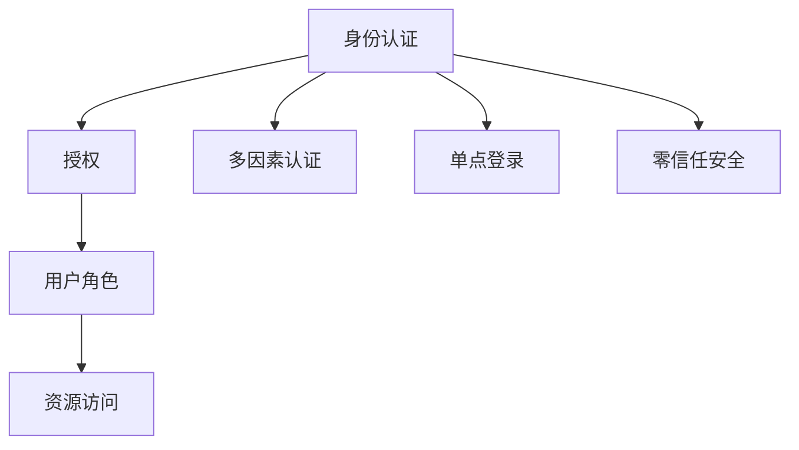
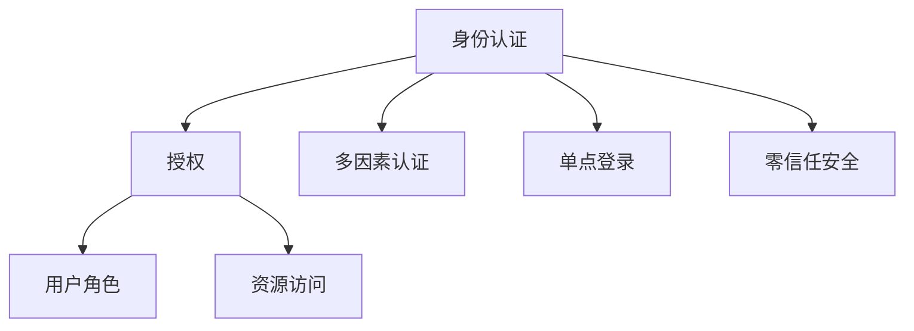

                 

# AI 大模型应用数据中心的身份认证管理

## 1. 背景介绍

在人工智能大模型应用场景中，特别是在高性能数据中心和高计算密集型应用中，身份认证管理是一个至关重要的环节。大模型的训练、推理和部署需要大量的计算资源和存储空间，这些资源通常集中部署在数据中心环境中。为了确保数据中心的安全和稳定运行，必须建立严格的身份认证机制，防止未经授权的访问和操作。

身份认证管理涉及到两个核心问题：

- 如何有效地验证用户的身份，确保其具有访问和使用资源的权限？
- 如何在确保用户身份安全的同时，提供便捷的操作体验，避免繁琐的身份验证过程？

本文将从这两个角度出发，详细介绍大模型应用数据中心的身份认证管理策略和实践，帮助读者全面理解其原理和实现细节。

## 2. 核心概念与联系

### 2.1 核心概念概述

为更好地理解大模型应用数据中心的身份认证管理，本节将介绍几个密切相关的核心概念：

- **身份认证（Authentication）**：验证用户身份的过程，确保用户的身份信息与系统记录一致，防止非法访问。
- **授权（Authorization）**：根据用户身份，决定其访问权限，限制用户对资源的操作范围。
- **用户角色（Role）**：定义用户对资源的访问权限，例如“管理员”、“数据科学家”、“模型训练师”等。
- **多因素认证（MFA）**：结合多种验证方式，提升身份认证的安全性，如密码、生物识别、短信验证等。
- **单点登录（SSO）**：用户只需登录一次，即可访问多个应用系统，避免重复登录。
- **零信任安全（Zero Trust Security）**：默认不信任任何用户和设备，通过验证和授权机制来确定访问权限，确保数据中心的安全性。

这些核心概念之间存在着紧密的联系，共同构建了数据中心身份认证管理的整体框架。以下是一个Mermaid流程图，展示了这些概念之间的关系：



该流程图展示了从身份认证到授权的过程，并通过多因素认证、单点登录和零信任安全等机制，提升了整体安全性。

### 2.2 概念间的关系

这些核心概念之间的关系可以通过以下Mermaid流程图来展示：



该流程图展示了身份认证、授权、用户角色和资源访问之间的关系。多因素认证、单点登录和零信任安全则是增强身份认证和授权安全性的重要手段。

## 3. 核心算法原理 & 具体操作步骤

### 3.1 算法原理概述

大模型应用数据中心的身份认证管理通常基于以下算法原理：

- **基于角色的访问控制（RBAC）**：定义用户对资源的访问权限，通过角色来限制用户的操作范围。例如，管理员具有全权限，数据科学家可以读取数据，模型训练师只能训练模型。
- **属性基访问控制（ABAC）**：基于用户属性（如部门、职位等）来动态分配访问权限，提高访问控制的灵活性和细粒度。例如，特定部门的数据科学家可以访问特定数据集。
- **基于多因素认证的安全策略**：通过结合多种验证方式（密码、生物识别、短信验证等），提升身份认证的安全性。例如，登录时必须输入密码，并通过生物识别设备验证身份。
- **单点登录和零信任安全**：通过单点登录，用户只需登录一次即可访问多个应用系统，避免重复登录。零信任安全则默认不信任任何用户和设备，通过验证和授权机制来确定访问权限，确保数据中心的安全性。

这些算法原理共同构成了大模型应用数据中心身份认证管理的核心框架，其目的是确保用户身份的安全性和访问权限的合理性。

### 3.2 算法步骤详解

基于角色的访问控制（RBAC）的实施步骤如下：

1. **角色定义**：定义数据中心中各个角色的职责和权限，例如管理员、数据科学家、模型训练师等。
2. **用户分配角色**：根据用户职责和权限，分配相应的角色，确保用户只能访问其职责范围内需要的资源。
3. **资源授权**：根据角色定义，配置资源（如数据集、模型、计算节点等）的访问权限，确保用户只能访问授权的资源。
4. **审计与监控**：定期审计用户操作记录，监控资源访问日志，及时发现和应对异常行为。

属性基访问控制（ABAC）的实施步骤如下：

1. **属性定义**：定义用户的属性，例如部门、职位、时间段等。
2. **规则配置**：配置基于属性的访问规则，例如特定部门的数据科学家可以访问特定数据集。
3. **访问控制**：根据用户的属性和访问规则，动态分配访问权限，确保用户只能访问授权的资源。
4. **审计与监控**：定期审计用户操作记录，监控资源访问日志，及时发现和应对异常行为。

多因素认证（MFA）的实施步骤如下：

1. **选择认证方式**：根据业务需求和安全要求，选择合适的认证方式，例如密码、生物识别、短信验证等。
2. **配置认证机制**：在身份认证系统中配置多因素认证机制，确保用户必须通过多种验证方式才能登录。
3. **审计与监控**：定期审计认证记录，监控登录行为，及时发现和应对异常登录尝试。

单点登录（SSO）的实施步骤如下：

1. **身份提供商选择**：选择合适的身份提供商，例如LDAP、OpenID Connect等。
2. **身份认证配置**：在身份提供商中配置用户身份信息，确保身份信息的准确性和一致性。
3. **应用系统集成**：将身份提供商与多个应用系统集成，确保用户只需登录一次即可访问多个系统。
4. **审计与监控**：定期审计登录记录，监控登录行为，及时发现和应对异常登录尝试。

零信任安全的实施步骤如下：

1. **默认不信任**：默认不信任任何用户和设备，所有访问请求必须经过验证和授权。
2. **验证机制**：通过多因素认证、单点登录等机制，验证用户身份，确保访问请求的有效性。
3. **授权机制**：根据用户的身份和属性，动态分配访问权限，确保用户只能访问授权的资源。
4. **审计与监控**：定期审计访问记录，监控操作行为，及时发现和应对异常行为。

### 3.3 算法优缺点

大模型应用数据中心的身份认证管理方法具有以下优点：

1. **灵活性**：通过基于角色的访问控制和属性基访问控制，可以灵活地定义和分配用户权限，适应不同的业务场景。
2. **安全性**：通过多因素认证和零信任安全，提升了身份认证和访问控制的安全性，防止未经授权的访问。
3. **便捷性**：通过单点登录和身份认证机制，提升了用户体验，减少了重复登录的操作。

然而，这些方法也存在一些缺点：

1. **复杂性**：实施基于角色的访问控制和属性基访问控制需要定义大量的角色和规则，配置复杂。
2. **性能开销**：多因素认证和零信任安全需要在每个访问请求中进行多次验证和授权，可能影响系统性能。
3. **成本高**：部署和维护身份认证管理系统需要较高的硬件和软件投入，成本较高。

### 3.4 算法应用领域

大模型应用数据中心的身份认证管理方法在以下几个领域得到了广泛应用：

1. **云计算平台**：例如AWS、Azure、Google Cloud等云服务提供商，通过身份认证管理，确保云计算资源的安全和合规。
2. **金融行业**：例如银行、证券、保险等金融机构，通过身份认证管理，保护客户数据和交易安全。
3. **医疗行业**：例如医院、诊所等医疗机构，通过身份认证管理，确保患者信息的安全和隐私保护。
4. **政府机构**：例如海关、税务、公安等政府部门，通过身份认证管理，确保政府数据的安全和合规。
5. **企业内部网络**：例如企业内部网络、邮件系统、办公系统等，通过身份认证管理，保护企业数据和资源的安全。

## 4. 数学模型和公式 & 详细讲解 & 举例说明

### 4.1 数学模型构建

在大模型应用数据中心的身份认证管理中，常用的数学模型包括：

- **访问控制矩阵**：定义用户和资源之间的访问关系，例如用户A可以访问资源X，用户B不能访问资源X。
- **属性向量**：定义用户属性，例如用户C的部门为“市场部”，职位为“数据科学家”。
- **访问规则向量**：定义基于属性的访问规则，例如“市场部”的数据科学家可以访问“销售数据”。
- **授权矩阵**：定义资源和角色之间的访问关系，例如角色“管理员”可以访问所有资源。

### 4.2 公式推导过程

假设我们有一个用户A，其属性向量为$P_A = (部门:市场部, 职位:数据科学家)$，访问规则向量为$R = (市场部:数据科学家 -> 销售数据)$，访问控制矩阵为$M$，授权矩阵为$L$。

1. **计算用户A的访问权限**：根据属性向量$P_A$和访问规则向量$R$，计算用户A的访问权限向量$P_A^{\prime}$。例如：

   $$
   P_A^{\prime} = P_A \times R = (市场部, 数据科学家) \times (市场部:数据科学家 -> 销售数据) = (市场部:数据科学家 -> 销售数据)
   $$

2. **根据访问权限向量$P_A^{\prime}$，计算用户A的访问权限集合$A$。例如：

   $$
   A = \{资源X \mid \text{用户A可以访问资源}X\} = \{销售数据\}
   $$

3. **根据授权矩阵$L$，计算用户A的实际访问权限集合$A^{\prime}$。例如：

   $$
   A^{\prime} = L \times A = L \times \{销售数据\}
   $$

其中，$L$可以通过基于角色的访问控制（RBAC）或属性基访问控制（ABAC）动态生成。

### 4.3 案例分析与讲解

假设我们有一个数据中心，需要管理不同角色的用户访问多个数据集。具体实施步骤如下：

1. **定义角色**：定义管理员、数据科学家、模型训练师等角色，并配置其访问权限。例如，管理员可以访问所有数据集，数据科学家只能访问特定数据集。
2. **定义用户属性**：定义用户的属性，例如部门、职位等。
3. **配置访问规则**：根据用户属性和角色，配置基于属性的访问规则。例如，“市场部”的数据科学家可以访问“销售数据”。
4. **动态授权**：根据访问规则和用户属性，动态生成授权矩阵$L$。
5. **审计与监控**：定期审计访问日志，监控异常行为。

## 5. 项目实践：代码实例和详细解释说明

### 5.1 开发环境搭建

为了实现大模型应用数据中心的身份认证管理，我们需要搭建一个完整的开发环境。以下是详细的搭建步骤：

1. **选择身份认证系统**：选择合适的身份认证系统，例如LDAP、OpenID Connect等。
2. **安装身份认证系统**：根据系统要求，安装相应的身份认证系统软件和数据库。例如，安装LDAP服务器和MySQL数据库。
3. **配置身份认证系统**：根据业务需求，配置身份认证系统的参数，例如用户管理、身份认证、访问控制等。
4. **集成应用系统**：将身份认证系统与多个应用系统集成，确保用户只需登录一次即可访问多个系统。

### 5.2 源代码详细实现

下面是一个基于LDAP的身份认证系统的实现示例，包含身份认证和授权功能的代码：

```python
# LDAP身份认证系统示例
from ldap3 import Server, Connection

# 建立LDAP服务器连接
server = Server("ldap://localhost:389")
conn = Connection(server, bind_dn="cn=admin,dc=example,dc=com", bind_pw="password")

# 验证用户身份
def authenticate_user(username, password):
    try:
        result = conn.bind("cn={},dc=example,dc=com".format(username), password)
        if result:
            return True
        else:
            return False
    except Exception as e:
        print("LDAP authentication failed: {}".format(e))
        return False

# 获取用户角色
def get_user_role(username):
    try:
        result = conn.search("cn={},dc=example,dc=com".format(username), ["cn", "cn=roles,dc=example,dc=com"])
        if result:
            return result[0][2]["cn"][0]
        else:
            return None
    except Exception as e:
        print("LDAP role retrieval failed: {}".format(e))
        return None

# 配置资源权限
def configure_resource_permissions(resource, role):
    try:
        conn.modify("cn={},dc=example,dc=com".format(resource), {"cn=roles,dc=example,dc=com": [{"op": "add", "values": [role]}]}
    except Exception as e:
        print("LDAP resource permission configuration failed: {}".format(e))

# 查询资源权限
def get_resource_permissions(resource):
    try:
        result = conn.search("cn={},dc=example,dc=com".format(resource), ["cn=roles,dc=example,dc=com"])
        if result:
            return result[0][2]["cn"][0]
        else:
            return None
    except Exception as e:
        print("LDAP resource permission query failed: {}".format(e))
        return None
```

### 5.3 代码解读与分析

以上是基于LDAP的身份认证系统示例代码，下面我们逐个解释关键部分的实现细节：

- **建立LDAP服务器连接**：通过`Server`类建立与LDAP服务器的连接，使用管理员账号`admin`和密码`password`进行绑定。
- **验证用户身份**：通过`bind`方法验证用户身份，返回`True`表示验证通过，`False`表示验证失败。
- **获取用户角色**：通过`search`方法获取用户角色信息，返回角色名称。
- **配置资源权限**：通过`modify`方法配置资源权限，将角色添加到资源权限列表中。
- **查询资源权限**：通过`search`方法查询资源权限，返回角色名称。

### 5.4 运行结果展示

假设我们有一个用户A，其LDAP账号为`cn=alice,dc=example,dc=com`，密码为`password`。在执行以下代码后，可以验证用户A的身份和获取其角色：

```python
# 验证用户A的身份
result = authenticate_user("alice", "password")
print(result)  # True

# 获取用户A的角色
role = get_user_role("alice")
print(role)  # "data scientist"

# 配置资源权限
configure_resource_permissions("sales_data", "data scientist")

# 查询资源权限
permissions = get_resource_permissions("sales_data")
print(permissions)  # "data scientist"
```

通过以上代码，我们可以看到，LDAP身份认证系统能够有效地验证用户身份，并获取用户角色。同时，我们还可以配置资源权限，确保用户只能访问授权的资源。

## 6. 实际应用场景

### 6.1 智能云平台

智能云平台需要管理大量的计算资源和数据资源，确保平台的安全和稳定运行。通过身份认证管理，云平台可以确保只有授权用户才能访问和管理资源，防止非法访问和操作。例如，在AWS云平台中，通过身份认证管理系统，可以管理不同角色的用户访问多个资源，确保数据和计算资源的安全。

### 6.2 金融行业

金融行业需要处理大量的客户数据和交易数据，确保数据的安全和隐私保护。通过身份认证管理，金融机构可以确保只有授权用户才能访问和管理客户数据，防止数据泄露和滥用。例如，在银行系统中，通过身份认证管理系统，可以管理不同角色的员工访问和管理客户数据，确保客户数据的安全。

### 6.3 医疗行业

医疗行业需要处理大量的患者数据和医疗记录，确保数据的安全和隐私保护。通过身份认证管理，医疗机构可以确保只有授权用户才能访问和管理患者数据，防止数据泄露和滥用。例如，在医院的电子病历系统中，通过身份认证管理系统，可以管理不同角色的医生和护士访问和管理患者数据，确保患者数据的安全。

### 6.4 政府机构

政府机构需要处理大量的公共数据和敏感信息，确保数据的安全和合规。通过身份认证管理，政府部门可以确保只有授权用户才能访问和管理数据，防止数据泄露和滥用。例如，在海关系统中，通过身份认证管理系统，可以管理不同角色的员工访问和管理货物数据，确保货物数据的安全。

### 6.5 企业内部网络

企业内部网络需要管理大量的员工和企业资源，确保网络的安全和稳定运行。通过身份认证管理，企业可以确保只有授权员工才能访问和管理企业资源，防止非法访问和操作。例如，在企业的办公系统中，通过身份认证管理系统，可以管理不同角色的员工访问和管理企业资源，确保企业资源的安全。

## 7. 工具和资源推荐

### 7.1 学习资源推荐

为了帮助开发者系统掌握大模型应用数据中心的身份认证管理技术，以下是一些优质的学习资源：

1. **《身份认证与授权：安全信息基础设施工程指南》**：该书系统介绍了身份认证和授权的基本概念、实现技术和应用场景，是学习身份认证管理的重要参考。
2. **《LDAP教程》**：该书详细介绍了LDAP身份认证系统的配置和管理，是学习LDAP身份认证的重要参考。
3. **《OpenID Connect教程》**：该书详细介绍了OpenID Connect身份认证系统的配置和管理，是学习OpenID Connect身份认证的重要参考。
4. **《零信任安全基础》**：该书详细介绍了零信任安全的基本概念和实现技术，是学习零信任安全的重要参考。
5. **《基于角色的访问控制：实现、评估与应用》**：该书详细介绍了基于角色的访问控制的实现方法和应用场景，是学习RBAC的重要参考。

通过学习这些资源，开发者可以全面掌握大模型应用数据中心的身份认证管理技术，提升开发能力和技术水平。

### 7.2 开发工具推荐

为了实现大模型应用数据中心的身份认证管理，开发者需要选择合适的开发工具。以下是几款常用的开发工具：

1. **LDAP服务器**：例如Apache Directory Studio，用于配置和管理LDAP服务器。
2. **OpenID Connect服务器**：例如Identity Server，用于配置和管理OpenID Connect服务器。
3. **零信任安全平台**：例如ZTAP（Zero Trust Access Platform），用于实现零信任安全策略。
4. **单点登录系统**：例如CAS（Central Authentication Service），用于实现单点登录功能。

合理利用这些工具，可以显著提升身份认证管理的开发效率，加快创新迭代的步伐。

### 7.3 相关论文推荐

大模型应用数据中心的身份认证管理技术的发展源于学界的持续研究。以下是几篇奠基性的相关论文，推荐阅读：

1. **《基于角色的访问控制模型》**：提出了基于角色的访问控制模型，系统介绍了RBAC的基本概念和实现方法。
2. **《LDAP协议的实现与优化》**：详细介绍了LDAP协议的实现方法和性能优化技术，是学习LDAP身份认证的重要参考。
3. **《零信任安全模型的设计与实现》**：提出了零信任安全模型的基本框架，系统介绍了零信任安全的基本概念和实现方法。
4. **《基于多因素认证的身份认证系统》**：提出了多因素认证的身份认证系统，系统介绍了多因素认证的基本概念和实现方法。

这些论文代表了大模型应用数据中心身份认证管理技术的发展脉络，通过学习这些前沿成果，可以帮助研究者把握学科前进方向，激发更多的创新灵感。

除上述资源外，还有一些值得关注的前沿资源，帮助开发者紧跟大模型应用数据中心身份认证管理的最新进展，例如：

1. **arXiv论文预印本**：人工智能领域最新研究成果的发布平台，包括大量尚未发表的前沿工作，学习前沿技术的必读资源。
2. **业界技术博客**：如AWS、Azure、Google Cloud等顶级实验室的官方博客，第一时间分享他们的最新研究成果和洞见。
3. **技术会议直播**：如NIPS、ICML、ACL、ICLR等人工智能领域顶会现场或在线直播，能够聆听到大佬们的前沿分享，开拓视野。
4. **GitHub热门项目**：在GitHub上Star、Fork数最多的AI身份认证管理相关项目，往往代表了该技术领域的发展趋势和最佳实践，值得去学习和贡献。
5. **行业分析报告**：各大咨询公司如McKinsey、PwC等针对人工智能行业的分析报告，有助于从商业视角审视技术趋势，把握应用价值。

总之，对于大模型应用数据中心身份认证管理技术的学习和实践，需要开发者保持开放的心态和持续学习的意愿。多关注前沿资讯，多动手实践，多思考总结，必将收获满满的成长收益。

## 8. 总结：未来发展趋势与挑战

### 8.1 研究成果总结

本文对大模型应用数据中心的身份认证管理进行了全面系统的介绍。首先阐述了身份认证和授权的基本概念，详细讲解了RBAC和ABAC的实施步骤，探讨了多因素认证和单点登录的机制。其次，从数学模型的角度，详细介绍了基于角色的访问控制和属性基访问控制的实现方法。最后，提供了大模型应用数据中心身份认证管理的实际应用场景和推荐的学习资源、开发工具和相关论文。

通过本文的系统梳理，可以看到，大模型应用数据中心的身份认证管理是一个复杂但至关重要的系统工程，其目的是确保用户身份的安全性和访问权限的合理性。通过系统的身份认证管理，可以防止未经授权的访问和操作，保障大模型应用数据中心的安全性和稳定性。

### 8.2 未来发展趋势

展望未来，大模型应用数据中心的身份认证管理技术将呈现以下几个发展趋势：

1. **人工智能与身份认证的融合**：未来，大模型应用数据中心的身份认证管理将更多地利用人工智能技术，如机器学习、自然语言处理等，提升身份认证的准确性和智能化水平。例如，通过自然语言处理技术，自动生成访问规则，减少人工配置的复杂性。
2. **区块链技术的引入**：未来，大模型应用数据中心的身份认证管理将引入区块链技术，提升身份认证和访问控制的透明度和可追溯性。例如，通过区块链技术，确保用户身份信息的真实性和完整性。
3. **零信任安全模型的演进**：未来，大模型应用数据中心的身份认证管理将进一步演进零信任安全模型，提升系统的鲁棒性和安全性。例如，通过零信任安全模型，默认不信任任何用户和设备，通过验证和授权机制来确定访问权限，确保数据中心的安全性。
4. **多模态身份认证的实现**：未来，大模型应用数据中心的身份认证管理将更多地利用多模态身份认证技术，提升身份认证的安全性和用户体验。例如，通过生物识别、人脸识别、声纹识别等技术，结合密码和短信验证，提升身份认证的准确性和便捷性。

这些发展趋势凸显了大模型应用数据中心身份认证管理技术的广阔前景，其未来的应用和演进将带来更多的安全性和便捷性，进一步推动人工智能技术的发展和应用。

### 8.3 面临的挑战

尽管大模型应用数据中心的身份认证管理技术已经取得了显著进展，但在迈向更加智能化、普适化应用的过程中，仍面临诸多挑战：

1. **技术复杂性**：身份认证和授权管理需要配置大量的角色和规则，配置复杂，操作繁琐。如何在简化配置的同时，保证系统的安全性，是一个重要挑战。
2. **性能开销**：多因素认证和零信任安全需要在每个访问请求中进行多次验证和授权，可能影响系统性能。如何在保证安全性的同时，提升系统的响应速度和效率，是一个重要挑战。
3. **成本高**：部署和维护身份认证管理系统需要较高的硬件和软件投入，成本较高。如何在降低成本的同时，保证系统的稳定性和安全性，是一个重要挑战。
4. **可扩展性**：随着大模型应用数据中心的规模不断扩大，身份认证和授权管理系统的可扩展性成为关键问题。如何在保证系统的可扩展性的同时，提升系统的稳定性和安全性，是一个重要挑战。
5. **安全性**：身份认证和授权管理系统的安全性是至关重要的。如何在提升系统安全性的同时，确保系统的稳定性和可用性，是一个重要挑战。

### 8.4 研究展望

面对大模型应用数据中心身份认证管理所面临的挑战，未来的研究需要在以下几个方面寻求新的突破：

1. **简化配置流程**：通过自动化配置工具和技术，减少身份认证和授权管理的配置复杂性，提升系统的便捷性和易用性。
2. **优化性能**：通过优化算法和架构，提升身份认证和授权管理系统的性能，减少验证和授权的延迟，提升用户体验。
3. **降低成本**：通过开源工具和平台，降低身份认证和授权管理系统的部署和维护成本，提升系统的可扩展性和可访问性。
4. **增强可扩展性**：通过分布式架构和微服务设计，提升身份认证和授权管理系统的可扩展性和可用性，确保系统能够应对大规模数据中心的身份认证和授权管理需求。
5. **提升安全性**：通过引入人工智能和区块链技术，提升身份认证和授权管理系统的安全性，防止数据泄露和滥用。

这些研究方向的探索，必将引领大模型应用数据中心身份认证管理技术迈向更高的台阶，为构建安全、可靠、便捷的AI应用系统铺平道路。面向未来，身份认证和授权管理技术的不断演进，将为AI应用提供更加坚实的安全保障，推动人工智能技术的广泛应用和深入发展。

## 9. 附录：常见问题与解答

**Q1：身份认证和授权管理的主要区别是什么？**

A: 身份认证主要

