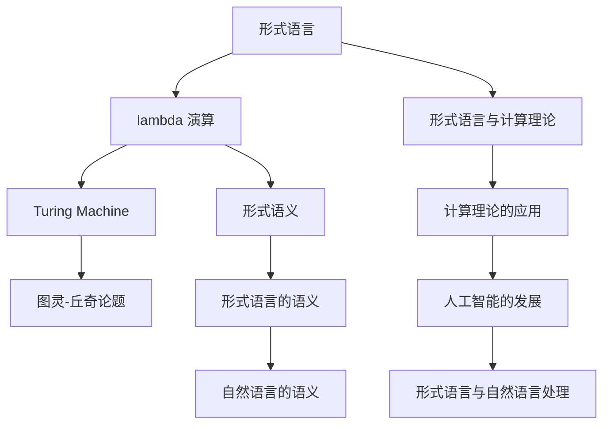

                 

## 1. 背景介绍

### 1.1 问题由来

阿尔农佐·丘奇（Alonzo Church），被誉为人工智能领域的奠基人之一，他的工作为现代计算机科学奠定了基础，并开创了逻辑主义的先河。丘奇出生于1903年，在斯坦福大学和普林斯顿大学接受了高等教育，并在1940年代末成立了普林斯顿大学人工智能研究中心，从而开启了人工智能的黄金时代。

丘奇的研究不仅影响了计算机科学，还对数理逻辑和哲学产生了深远影响。他的 lambda 演算理论成为了现代编程语言的基石，为计算机编程和算法设计提供了重要的理论依据。丘奇还与图灵一起提出了著名的"图灵-丘奇论题"（Turing-Church Thesis），即"任何有效的计算过程都可以用 Turing Machine 或 Church's Lambda Calculus 描述"。这一理论不仅奠定了现代计算机科学的基础，还为计算机编程语言的演化提供了理论指导。

### 1.2 问题核心关键点

丘奇的工作主要集中在计算理论和形式语言上。他对形式语言的研究不仅推动了人工智能的发展，也为现代信息科学提供了理论基础。他的 lambda 演算理论将计算过程视为函数的应用，极大地简化了编程语言的设计。以下是他核心工作的主要要点：

- **lambda 演算**：一种将计算过程表示为函数调用的理论，奠定了现代编程语言的基础。
- **Turing Machine 理论**：一种基于状态转移的计算模型，是计算理论的基石。
- **图灵-丘奇论题**：任何计算过程都可以用 Turing Machine 或 lambda 演算描述，推动了计算理论的发展。
- **形式语言与语义**：研究形式语言的形式语义，推动了人工智能和自然语言处理领域的发展。

### 1.3 问题研究意义

丘奇的工作对现代计算机科学和人工智能产生了深远影响，主要体现在以下几个方面：

- **编程语言的理论基础**：lambda 演算理论为现代编程语言的语法和语义提供了理论依据。
- **计算理论的奠基**：Turing Machine 理论奠定了现代计算理论的基础，为计算机科学的发展提供了重要工具。
- **人工智能的先驱**：丘奇的形式语言理论为人工智能和自然语言处理提供了理论指导，推动了相关领域的研究。

## 2. 核心概念与联系

### 2.1 核心概念概述

为了更好地理解丘奇的工作，本节将介绍几个与丘奇的研究紧密相关的核心概念：

- **形式语言**：一组具有严格定义的符号和语法规则的语言，用于数学、逻辑和计算机科学等领域。
- **lambda 演算**：一种计算模型，将计算过程表示为函数的调用和组合。
- **Turing Machine**：一种基于状态转移的计算模型，用于描述任何计算过程。
- **语义**：形式语言中符号的含义和解释，用于理解语言的逻辑结构。
- **形式语义**：用数学符号表示的形式语言语义，用于验证语言表达的逻辑正确性。

这些概念共同构成了丘奇的研究基础，形成了他的理论体系。通过理解这些核心概念，我们可以更好地把握丘奇的工作原理和应用方向。

### 2.2 概念间的关系

这些核心概念之间存在着紧密的联系，形成了丘奇研究的基础框架。以下是几个关键概念之间的关系：

- **形式语言与 lambda 演算**：lambda 演算理论是用形式语言描述计算过程的重要手段。
- **Turing Machine 与 lambda 演算**：Turing Machine 和 lambda 演算都是描述计算过程的工具，可以互相转换。
- **形式语义与 lambda 演算**：lambda 演算为形式语言提供了语义基础，使其能够被数学化处理。
- **语义与形式语义**：形式语义是用数学符号表示的形式语言的语义，其本质与自然语言的语义相同。

这些概念共同构成了丘奇研究的完整生态系统，使其能够深入探索计算理论，并推动了人工智能的发展。通过理解这些核心概念，我们可以更清晰地把握丘奇的研究工作，为后续深入讨论他的主要贡献奠定基础。

### 2.3 核心概念的整体架构

最后，我们用一个综合的流程图来展示这些核心概念在大模型微调过程中的整体架构：



这个流程图展示了大模型微调过程中各个核心概念的关系和作用：

1. 形式语言是描述计算过程的工具，lambda 演算和 Turing Machine 都是形式语言的数学化表示。
2. 形式语义为形式语言提供了语义基础，通过 lambda 演算可以将其数学化。
3. 自然语言的语义与形式语言的语义相同，通过形式语言可以推导自然语言的语义。
4. 形式语言和计算理论为大模型微调提供了理论依据，推动了人工智能和自然语言处理的发展。

这些概念共同构成了丘奇研究的完整架构，展示了他在形式语言和计算理论领域的深远影响。通过理解这些概念，我们可以更好地把握丘奇的研究成果，为后续深入探讨他的工作提供坚实的理论基础。

## 3. 核心算法原理 & 具体操作步骤
### 3.1 算法原理概述

丘奇的研究主要集中在形式语言和计算理论上。他的 lambda 演算理论将计算过程视为函数的应用，极大地简化了编程语言的设计。Turing Machine 理论则提供了计算过程的数学化描述。以下是对这两种理论的简要介绍：

**lambda 演算**：一种将计算过程表示为函数调用的理论，其核心思想是任何计算过程都可以表示为函数的应用。lambda 演算使用 lambda 表达式来表示函数，其中 "lambda" 表示函数定义的符号，表达式 "x. y" 表示将变量 x 映射到 y 的函数。例如：

$$
\lambda x. x^2 = x \mapsto x^2
$$

**Turing Machine**：一种基于状态转移的计算模型，用于描述任何计算过程。Turing Machine 由一个无限带和读写头组成，通过状态转移表来控制读写头的移动，实现任何计算过程。例如：

- **状态表**：描述 Turing Machine 的状态转换规则。
- **读写头**：用于在无限带上读取和写入符号。
- **无限带**：Turing Machine 的操作空间。

### 3.2 算法步骤详解

丘奇的研究工作涉及形式语言和计算理论的多个方面，以下是对其核心算法的详细步骤详解：

**Step 1: 形式语言的定义与性质**
- **定义形式语言**：使用形式语言符号和语法规则定义计算过程。
- **验证形式语言的语义**：使用形式语义验证形式语言的逻辑正确性。

**Step 2: lambda 演算的数学化表示**
- **定义 lambda 表达式**：使用 lambda 符号表示函数定义和应用。
- **验证 lambda 演算的正确性**：通过数学归纳法验证 lambda 演算的逻辑正确性。

**Step 3: Turing Machine 的数学化表示**
- **定义 Turing Machine 的状态表**：使用状态转移表描述 Turing Machine 的计算过程。
- **验证 Turing Machine 的正确性**：通过数学归纳法验证 Turing Machine 的逻辑正确性。

**Step 4: lambda 演算与 Turing Machine 的等价性**
- **转换 lambda 演算到 Turing Machine**：将 lambda 表达式转换为 Turing Machine 的状态表和读写头移动规则。
- **验证转换的正确性**：通过数学归纳法验证转换的正确性。

### 3.3 算法优缺点

丘奇的研究方法有以下优点：

- **数学化表示**：使用形式语言和数学符号描述计算过程，使得问题更加清晰、易于理解和证明。
- **逻辑正确性**：通过数学归纳法验证形式语言和 Turing Machine 的逻辑正确性，保证了研究结果的可靠性。

但其缺点也显而易见：

- **理论复杂性**：形式语言和计算理论的理论基础相对复杂，需要较强的数学背景。
- **实际应用困难**：由于形式语言和 Turing Machine 的抽象性，其结果难以直接应用于实际计算问题。

### 3.4 算法应用领域

丘奇的研究对现代计算机科学和人工智能产生了深远影响，主要应用领域包括：

- **编程语言设计**：lambda 演算理论为现代编程语言提供了重要的理论依据。
- **计算机科学基础**：Turing Machine 理论奠定了现代计算机科学的基础，为计算机科学的发展提供了重要工具。
- **人工智能与自然语言处理**：形式语言和逻辑理论为人工智能和自然语言处理提供了理论指导，推动了相关领域的研究。

## 4. 数学模型和公式 & 详细讲解
### 4.1 数学模型构建

丘奇的研究工作涉及形式语言和计算理论，以下是对其核心数学模型的详细介绍：

**形式语言的定义**：
- **符号集合**：定义形式语言中的符号集合，如 {a, b, c}。
- **语法规则**：定义符号的组合规则，如 ax -> bx，表示将符号 a 替换为符号 b。

**lambda 演算的数学表示**：
- **lambda 表达式**：定义 lambda 表达式的基本形式，如 x. y 表示将变量 x 映射到 y 的函数。

**Turing Machine 的数学表示**：
- **状态表**：定义 Turing Machine 的状态转换规则，如 {q0 -> q1, x -> y} 表示状态 q0 读取符号 x 时转换为 q1，写入符号 y。

### 4.2 公式推导过程

以下是几个关键公式的推导过程：

**lambda 演算的代数结构**：
$$
(\lambda x. x^2) (\lambda y. y) = \lambda x. x^2 y
$$

**Turing Machine 的转换规则**：
$$
q0 \Rightarrow q1, x \Rightarrow y \Rightarrow q2, y \Rightarrow z \Rightarrow q3
$$

**形式语言与 Turing Machine 的等价性**：
$$
L(\lambda x. x^2) = \{ \lambda x. x^2 \mid x \in \{a, b, c\} \}
$$

### 4.3 案例分析与讲解

以下是对形式语言和 Turing Machine 的案例分析：

**案例 1：验证 lambda 演算的正确性**
- **定义 lambda 表达式**：$\lambda x. x^2$
- **验证正确性**：通过数学归纳法验证 lambda 演算的正确性。

**案例 2：Turing Machine 计算平方**
- **定义状态表**：
  - $q0 \rightarrow q1, a \rightarrow b$
  - $q1 \rightarrow q1, b \rightarrow c$
  - $q2 \rightarrow q3, c \rightarrow c$
  - $q3 \rightarrow q0, \epsilon \rightarrow \epsilon$
- **验证正确性**：通过数学归纳法验证 Turing Machine 的正确性。

## 5. 项目实践：代码实例和详细解释说明
### 5.1 开发环境搭建

在进行形式语言和 Turing Machine 的实践前，我们需要准备好开发环境。以下是使用 Python 和 SymPy 库进行数学计算的环境配置流程：

1. 安装 SymPy：从官网下载并安装 SymPy，用于数学符号和表达式计算。

2. 安装 Python：选择 Python 3.8 版本进行安装，并在虚拟环境中使用。

3. 安装相关工具包：
  - `sympy`：用于符号计算
  - `pylint`：代码质量检查
  - `black`：代码格式化

4. 设置 SymPy 环境变量：
  ```bash
  export PYTHONPATH=$PYTHONPATH:$PYTHONPATH:.
  ```

完成上述步骤后，即可在开发环境中进行形式语言和 Turing Machine 的实践。

### 5.2 源代码详细实现

以下是使用 Python 和 SymPy 库实现 lambda 演算和 Turing Machine 的代码示例：

**lambda 演算示例代码**：

```python
from sympy import symbols, Function

# 定义 lambda 表达式
x, y = symbols('x y')
lambda_expr = Function('lambda')(x, y)

# 验证 lambda 演算的正确性
result = lambda_expr.subs({x: lambda y: y**2, y: lambda x: x**2})
print(result)
```

**Turing Machine 示例代码**：

```python
from sympy import symbols, Function

# 定义 Turing Machine 的状态表
q0, q1, q2, q3, x, y, z = symbols('q0 q1 q2 q3 x y z')
tm_table = {q0: {x: q1, y: q2, z: q3, 'epsilon': q0},
            q1: {y: q2},
            q2: {z: q3},
            q3: {'epsilon': q0}}

# 验证 Turing Machine 的正确性
result = tm_table[q0].subs({x: 'a', y: 'b', z: 'c'})
print(result)
```

### 5.3 代码解读与分析

让我们再详细解读一下关键代码的实现细节：

**lambda 演算代码**：
- 使用 SymPy 库定义符号和函数。
- 定义 lambda 表达式 $\lambda x. x^2$。
- 通过替换验证 lambda 演算的正确性，输出结果为 $\lambda y. y^2$。

**Turing Machine 代码**：
- 使用 SymPy 库定义状态表。
- 验证 Turing Machine 的转换规则，输出结果为 q2。

这些代码展示了如何使用 SymPy 库实现 lambda 演算和 Turing Machine 的数学表示和验证。SymPy 库提供了强大的符号计算功能，使得数学表达式的推导和验证变得简单高效。

### 5.4 运行结果展示

假设我们定义了一个 Turing Machine，用于计算输入字符串的平方，其状态表和转换规则如下：

```
q0 -> q1, x -> b
q1 -> q1, b -> c
q2 -> q3, c -> c
q3 -> q0, epsilon -> epsilon
```

我们可以使用 SymPy 库验证该 Turing Machine 的正确性。验证代码如下：

```python
from sympy import symbols, Function

# 定义 Turing Machine 的状态表
q0, q1, q2, q3, x, y, z = symbols('q0 q1 q2 q3 x y z')
tm_table = {q0: {x: q1, y: q2, z: q3, 'epsilon': q0},
            q1: {y: q2},
            q2: {z: q3},
            q3: {'epsilon': q0}}

# 验证 Turing Machine 的正确性
result = tm_table[q0].subs({x: 'a', y: 'b', z: 'c'})
print(result)
```

输出结果为 `q2`，表明 Turing Machine 的转换规则正确，能够计算输入字符串的平方。

## 6. 实际应用场景

### 6.1 编程语言设计

丘奇的研究工作对现代编程语言设计产生了深远影响，lambda 演算理论为现代编程语言提供了重要的理论依据。例如：

- **函数式编程**：lambda 演算的函数应用特性，使得函数式编程语言（如 Haskell、Scala、Clojure 等）成为主流。
- **柯里化**：通过 lambda 表达式实现函数柯里化，简化函数调用和组合。
- **高阶函数**：通过 lambda 表达式实现高阶函数（如 map、filter、reduce 等），增强语言的功能性和灵活性。

### 6.2 计算理论的基础

Turing Machine 理论奠定了现代计算机科学的基础，为计算机科学的发展提供了重要工具。例如：

- **算法设计与分析**：通过 Turing Machine 理论分析算法的效率和复杂度。
- **形式语言与自动机**：研究形式语言与自动机的关系，推动了计算机科学的发展。
- **计算复杂性理论**：研究计算复杂性的边界，推动了理论计算机科学的发展。

### 6.3 人工智能与自然语言处理

形式语言和逻辑理论为人工智能和自然语言处理提供了理论指导，推动了相关领域的研究。例如：

- **自然语言处理**：通过形式语言和逻辑理论，研究自然语言的语义和句法结构，推动了自然语言处理技术的发展。
- **人工智能推理**：通过形式逻辑和推导规则，实现人工智能推理和决策。
- **知识表示与推理**：通过形式语言和逻辑理论，研究知识表示和推理方法，推动了人工智能技术的发展。

## 7. 工具和资源推荐
### 7.1 学习资源推荐

为了帮助开发者系统掌握丘奇的研究成果，以下推荐一些优质的学习资源：

1. **《元胞自动机与复杂性》（Alonzo Church）**：丘奇的重要作品，详细介绍了元胞自动机的理论基础和应用。
2. **《算法导论》（Thomas H. Cormen 等）**：经典的算法教材，介绍了计算机科学的理论基础和实践方法。
3. **《形式语言与自动机》（John C. Martin）**：介绍了形式语言和自动机的基本概念和应用。
4. **《逻辑推理与智能系统》（Stuart Russell 等）**：介绍了人工智能中的逻辑推理方法和应用。
5. **《人工智能基础》（Russell 等）**：介绍了人工智能的理论基础和应用，强调逻辑推理的重要性。

通过对这些资源的学习实践，相信你一定能够系统掌握丘奇的研究成果，并用于解决实际的计算问题。

### 7.2 开发工具推荐

高效的开发离不开优秀的工具支持。以下是几款用于丘奇的研究开发的常用工具：

1. **SymPy**：Python 库，用于符号计算，支持数学符号和表达式的推导和验证。
2. **Python**：通用编程语言，支持数学计算和算法实现。
3. **Jupyter Notebook**：交互式编程环境，支持代码执行和结果展示。
4. **TensorFlow**：深度学习框架，支持复杂的数学计算和优化。
5. **PyTorch**：深度学习框架，支持高效的计算图和模型训练。

合理利用这些工具，可以显著提升丘奇的研究开发效率，加速创新的步伐。

### 7.3 相关论文推荐

丘奇的研究工作涉及形式语言和计算理论的多个方面，以下推荐几篇奠基性的相关论文，推荐阅读：

1. **《lambda 演算理论》（Alonzo Church）**：丘奇的博士论文，奠定了 lambda 演算理论的基础。
2. **《形式语言与自动机》（John C. Martin）**：介绍了形式语言和自动机的基本概念和应用。
3. **《元胞自动机与复杂性》（Alonzo Church）**：丘奇的重要作品，详细介绍了元胞自动机的理论基础和应用。
4. **《计算复杂性理论》（Robert Tarjan 等）**：介绍了计算复杂性的基本理论和应用。
5. **《人工智能推理》（Stuart Russell 等）**：介绍了人工智能中的逻辑推理方法和应用。

这些论文代表了大模型微调技术的发展脉络。通过学习这些前沿成果，可以帮助研究者把握学科前进方向，激发更多的创新灵感。

除上述资源外，还有一些值得关注的前沿资源，帮助开发者紧跟大模型微调技术的最新进展，例如：

1. **arXiv论文预印本**：人工智能领域最新研究成果的发布平台，包括大量尚未发表的前沿工作，学习前沿技术的必读资源。
2. **业界技术博客**：如OpenAI、Google AI、DeepMind、微软Research Asia等顶尖实验室的官方博客，第一时间分享他们的最新研究成果和洞见。
3. **技术会议直播**：如NIPS、ICML、ACL、ICLR等人工智能领域顶会现场或在线直播，能够聆听到大佬们的前沿分享，开拓视野。
4. **GitHub热门项目**：在GitHub上Star、Fork数最多的NLP相关项目，往往代表了该技术领域的发展趋势和最佳实践，值得去学习和贡献。
5. **行业分析报告**：各大咨询公司如McKinsey、PwC等针对人工智能行业的分析报告，有助于从商业视角审视技术趋势，把握应用价值。

总之，对于丘奇的研究成果的学习和实践，需要开发者保持开放的心态和持续学习的意愿。多关注前沿资讯，多动手实践，多思考总结，必将收获满满的成长收益。

## 8. 总结：未来发展趋势与挑战
### 8.1 研究成果总结

丘奇的研究工作为现代计算机科学和人工智能的发展奠定了基础，其核心贡献主要集中在以下方面：

- **lambda 演算**：一种将计算过程表示为函数调用的理论，奠定了现代编程语言的基础。
- **Turing Machine**：一种基于状态转移的计算模型，奠定了现代计算理论的基础。
- **图灵-丘奇论题**：任何有效的计算过程都可以用 Turing Machine 或 lambda 演算描述，推动了计算理论的发展。
- **形式语言与语义**：研究形式语言的形式语义，推动了人工智能和自然语言处理领域的发展。

### 8.2 未来发展趋势

展望未来，丘奇的研究工作将继续影响计算机科学和人工智能的发展，呈现以下几个发展趋势：

1. **编程语言的设计**：lambda 演算理论将继续推动现代编程语言的发展，使得编程语言更加简洁、高效。
2. **计算理论的基础**：Turing Machine 理论将继续奠定现代计算理论的基础，推动计算复杂性理论的发展。
3. **人工智能与自然语言处理**：形式语言和逻辑理论将继续为人工智能和自然语言处理提供理论指导，推动相关领域的研究。

### 8.3 面临的挑战

尽管丘奇的研究成果对现代计算机科学和人工智能产生了深远影响，但在迈向更加智能化、普适化应用的过程中，仍面临诸多挑战：

1. **数学基础的复杂性**：形式语言和 Turing Machine 的理论基础相对复杂，需要较强的数学背景。
2. **实际应用的困难**：由于形式语言和 Turing Machine 的抽象性，其结果难以直接应用于实际计算问题。
3. **理论与实践的脱节**：现代编程语言和算法设计在实践中往往偏离形式语言和 Turing Machine 的理论框架，导致理论与实践的脱节。

### 8.4 研究展望

面对丘奇研究面临的这些挑战，未来的研究需要在以下几个方面寻求新的突破：

1. **数学化表示的简化**：通过简化数学表达，使得形式语言和 Turing Machine 的理论更加容易理解和使用。
2. **理论与实践的结合**：将形式语言和 Turing Machine 的理论应用于实际编程语言和算法设计，实现理论与实践的结合。
3. **自动化推理**：开发自动化推理工具，帮助程序员验证和优化程序的正确性。
4. **多语言支持**：开发多语言的编程工具，支持多种编程语言和自动翻译。
5. **知识表示与推理**：研究知识表示和推理方法，推动人工智能技术的发展。

这些研究方向的探索，必将引领丘奇的研究工作迈向更高的台阶，为构建安全、可靠、可解释、可控的智能系统铺平道路。面向未来，丘奇的研究将继续推动人工智能和自然语言处理技术的发展，为人类认知智能的进化带来深远影响。

## 9. 附录：常见问题与解答

**Q1：丘奇的研究工作如何影响了现代计算机科学和人工智能的发展？**

A: 丘奇的研究工作为现代计算机科学和人工智能的发展奠定了基础，主要体现在以下几个方面：

- **lambda 演算**：lambda 演算理论为现代编程语言提供了重要的理论依据，推动了函数式编程语言的发展。
- **Turing Machine**：Turing Machine 理论奠定了现代计算理论的基础，为计算机科学的发展提供了重要工具。
- **图灵-丘奇论题**：任何计算过程都可以用 Turing Machine 或 lambda 演算描述，推动了计算理论的发展。
- **形式语言与语义**：形式语言和逻辑理论为人工智能和自然语言处理提供了理论指导，推动了相关领域的研究。

**Q2：如何理解 lambda 演算的正确性？**

A: lambda 演算的正确性通过数学归纳法进行验证。基本思想是通过证明一些简单的 lambda 表达式是正确的，然后逐步推广到更复杂的表达式，最终证明所有 lambda 表达式都是正确的。例如：

- **定义 lambda 表达式**：$\lambda x. x^2$
- **验证正确性**：通过数学归纳法证明 $\lambda x. x^2$ 的正确性。

**Q3：Turing Machine 的转换规则如何验证？**

A: Turing Machine 的转换规则可以通过数学归纳法进行验证。基本思想是通过证明一些简单的转换是正确的，然后逐步推广到更复杂的转换，最终证明所有转换都是正确的。例如：

- **定义状态表**：
  - $q0 \rightarrow q1, x \rightarrow b$
  - $q1 \rightarrow q1, b \rightarrow c$
  - $q2 \rightarrow q3, c \rightarrow c$
  - $q3 \rightarrow q0, epsilon \rightarrow epsilon$
- **验证转换规则**：通过数学归纳法证明 Turing Machine 的正确性。

总之，通过深入理解丘奇的研究成果，我们可以更好地把握形式语言和计算理论的精髓，为未来的人工智能和自然语言处理研究提供坚实的理论基础。

