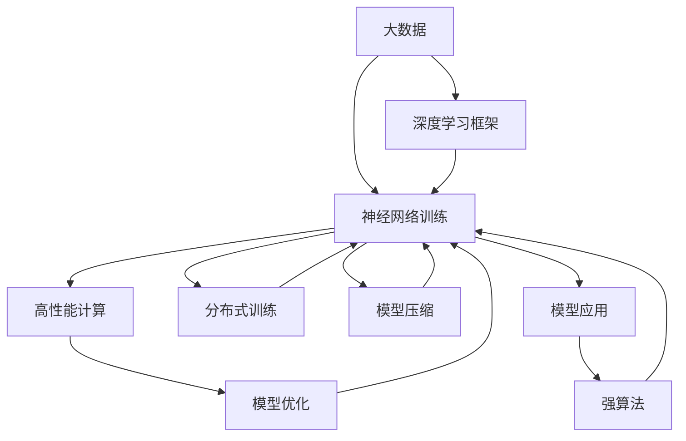

                 

# AI 神经网络计算艺术之禅：大数据＋大算力＋强算法

> 关键词：
- 神经网络
- 大数据
- 大算力
- 强算法
- 深度学习
- 深度学习框架
- 高性能计算
- 分布式训练
- 模型压缩
- 模型优化

## 1. 背景介绍

### 1.1 问题由来
随着深度学习技术的迅猛发展，神经网络在诸多领域展现出了强大的计算能力和学习潜力。然而，神经网络模型的庞大参数量和高计算复杂度，使其在实际应用中面临着许多挑战。为了应对这些挑战，学术界和工业界不断探索并发展出新的技术和框架，以优化神经网络模型的计算效率和性能。

### 1.2 问题核心关键点
为了在计算资源有限的情况下，尽可能地提升神经网络模型的效果，研究人员提出了许多创新性的方法和技术，包括但不限于：

- **大数据**：通过收集和处理大量数据，扩充模型的训练集，提升模型的泛化能力。
- **大算力**：利用GPU、TPU等高性能计算资源，加速模型的训练和推理过程。
- **强算法**：研发和优化训练算法，如梯度下降、Adam等优化算法，提升模型的收敛速度和精度。
- **模型压缩和优化**：通过模型剪枝、量化、蒸馏等技术，减小模型规模和计算资源消耗。
- **分布式训练**：通过多机多卡的分布式计算，加速模型训练，同时提高模型的鲁棒性。

这些技术和方法共同构成了神经网络计算艺术的核心，使得神经网络能够在处理大规模数据和高性能计算资源下，实现卓越的性能和应用效果。

### 1.3 问题研究意义
研究神经网络的计算艺术，对于拓展神经网络的计算边界，提升其在实际应用中的表现，加速人工智能技术的产业化进程，具有重要意义：

1. **降低计算成本**：通过优化计算资源的使用，神经网络可以在更有限的计算资源下实现更高效的训练和推理。
2. **提升模型效果**：优化算法和大数据处理技术，能够显著提升神经网络模型的泛化能力和预测精度。
3. **加速应用开发**：在计算效率和模型性能的双重提升下，神经网络技术可以快速应用于各行业，缩短研发周期。
4. **促进技术创新**：计算艺术的探索，催生了许多新的研究方法和应用场景，为人工智能技术的持续进步提供动力。
5. **赋能产业升级**：神经网络计算艺术的应用，能够推动各行各业的数字化转型，提高生产效率和服务质量。

## 2. 核心概念与联系

### 2.1 核心概念概述

为更好地理解大数据、大算力和强算法在神经网络计算中的作用，本节将介绍几个密切相关的核心概念：

- **神经网络(Neural Network)**：由大量神经元通过连接构成的计算模型，能够对输入数据进行特征提取和模式识别。
- **大数据(Big Data)**：指具有海量规模、多样类型和实时性的数据集，通常需要通过分布式存储和计算来处理。
- **高性能计算(High-Performance Computing, HPC)**：利用高性能计算机和算法，加速计算密集型任务的执行，如神经网络训练和推理。
- **深度学习(Deep Learning)**：一种利用神经网络进行特征学习和模式识别的机器学习技术，通常需要大量数据和计算资源。
- **深度学习框架(Deep Learning Framework)**：如TensorFlow、PyTorch等，提供自动化、模块化、可扩展的深度学习模型开发环境。
- **分布式训练(Distributed Training)**：利用多台计算机并行训练神经网络，提高训练速度和模型性能。
- **模型压缩(Model Compression)**：通过剪枝、量化、蒸馏等技术，减小神经网络的计算复杂度和内存占用。
- **模型优化(Model Optimization)**：通过优化算法和策略，提升神经网络模型的计算效率和性能。

这些核心概念之间存在着紧密的联系，形成了神经网络计算艺术的完整生态系统。通过理解这些核心概念，我们可以更好地把握神经网络计算艺术的精髓，为后续深入讨论具体的计算优化方法和技术奠定基础。

### 2.2 概念间的关系

这些核心概念之间存在着紧密的联系，形成了神经网络计算艺术的完整生态系统。下面我通过几个Mermaid流程图来展示这些概念之间的关系。



这个流程图展示了大数据、大算力、强算法在神经网络计算中的作用和关系：

1. 大数据提供训练数据的支持，深度学习框架提供模型构建和训练的自动化工具。
2. 高性能计算加速神经网络的训练和推理，提高计算效率。
3. 模型优化通过算法和技术改进，提升模型的性能。
4. 分布式训练利用多机多卡，加速神经网络的训练和模型性能提升。
5. 模型压缩通过剪枝、量化等技术，减小模型规模，降低计算资源消耗。
6. 强算法提升训练和推理的效率和精度，支持神经网络的复杂计算。

通过这些流程图，我们可以更清晰地理解大数据、大算力和强算法在神经网络计算中的作用和关系，为后续深入讨论具体的计算优化方法和技术奠定基础。

## 3. 核心算法原理 & 具体操作步骤
### 3.1 算法原理概述

神经网络的计算艺术，主要体现在对大数据、大算力和强算法的巧妙运用上。其核心算法原理可概括为以下几点：

1. **大数据的利用**：通过收集和处理大规模的数据，扩充神经网络的训练集，提升模型的泛化能力。
2. **大算力的使用**：利用高性能计算机和计算资源，加速神经网络的训练和推理过程。
3. **强算法的研发**：研发和优化训练算法，提升模型的收敛速度和精度。

具体而言，神经网络的计算艺术主要体现在以下几个方面：

- **数据增强**：通过数据扩充和增强技术，丰富训练集的多样性，提升模型的泛化能力。
- **分布式训练**：利用多台计算机并行训练神经网络，提高训练速度和模型性能。
- **模型压缩**：通过剪枝、量化、蒸馏等技术，减小神经网络的计算复杂度和内存占用。
- **模型优化**：通过优化算法和策略，提升神经网络模型的计算效率和性能。

### 3.2 算法步骤详解

神经网络的计算艺术涉及大数据、大算力和强算法的多重融合，具体步骤如下：

1. **数据收集与预处理**：
   - 收集大规模的数据集，并进行清洗、标注等预处理步骤，确保数据的质量和多样性。
   - 利用大数据技术，如Hadoop、Spark等，进行数据的分布式存储和处理，提升数据处理的效率和可靠性。

2. **模型构建与训练**：
   - 使用深度学习框架，如TensorFlow、PyTorch等，构建神经网络模型。
   - 利用高性能计算资源，如GPU、TPU等，加速模型的训练和推理过程。
   - 在训练过程中，选择合适的优化算法，如Adam、SGD等，进行模型的优化。

3. **模型压缩与优化**：
   - 通过模型剪枝、量化、蒸馏等技术，减小神经网络的计算复杂度和内存占用。
   - 利用分布式训练，提高模型的计算效率和性能。

4. **模型评估与部署**：
   - 在测试集上评估模型的性能，如精度、召回率等指标。
   - 将模型部署到实际应用中，进行推理预测。

### 3.3 算法优缺点

神经网络的计算艺术在提升模型性能和效率的同时，也存在一些局限性：

- **优点**：
  - 利用大数据和强算法，大幅提升模型的泛化能力和精度。
  - 利用高性能计算资源，加速模型的训练和推理过程。
  - 通过模型压缩和优化，减小模型规模和计算资源消耗。
  - 利用分布式训练，提高模型的计算效率和性能。

- **缺点**：
  - 对数据和计算资源的要求较高，可能面临数据收集和存储的困难。
  - 模型的训练和推理过程复杂，需要较高的技术门槛。
  - 模型的压缩和优化可能损失部分精度和性能。
  - 分布式训练可能面临通信和同步的挑战。

### 3.4 算法应用领域

神经网络的计算艺术在多个领域得到了广泛应用，例如：

- **计算机视觉**：如目标检测、图像分类、语义分割等任务，利用大规模图像数据和深度学习模型，提升图像处理能力。
- **自然语言处理**：如机器翻译、文本分类、问答系统等任务，利用大规模文本数据和深度学习模型，提升自然语言处理能力。
- **语音识别**：如自动语音识别、语音合成等任务，利用大规模语音数据和深度学习模型，提升语音处理能力。
- **医疗诊断**：如医学影像分析、疾病预测等任务，利用大规模医疗数据和深度学习模型，提升医疗诊断能力。
- **金融分析**：如股票预测、信用评估等任务，利用大规模金融数据和深度学习模型，提升金融分析能力。

除了这些经典应用领域，神经网络的计算艺术还在诸多新兴领域，如自动驾驶、智能制造等，发挥着重要作用。

## 4. 数学模型和公式 & 详细讲解 & 举例说明

### 4.1 数学模型构建

神经网络的计算艺术，离不开数学模型的支撑。以卷积神经网络(CNN)为例，其数学模型构建如下：

- **输入层**：将输入数据转换为向量形式，即$x_0 = [x_{0,0}, x_{0,1}, ..., x_{0,n}]^T$。
- **卷积层**：通过卷积核对输入数据进行特征提取，即$x_{l+1} = \sigma(w_l * x_l + b_l)$，其中$w_l$为卷积核，$b_l$为偏置项，$\sigma$为激活函数。
- **池化层**：对卷积层输出的特征图进行下采样，减小特征图的大小，即$x_{l+1} = \max_{i,j} x_l(i,j)$。
- **全连接层**：将池化层输出的特征图展开为一维向量，进行线性变换和激活，即$z = Wx + b$，其中$W$为权重矩阵，$b$为偏置向量。
- **输出层**：根据任务需求，设计不同的输出形式，如分类任务的softmax函数，即$y = softmax(z)$。

### 4.2 公式推导过程

以卷积神经网络为例，其公式推导过程如下：

- **卷积操作**：
  $$
  y_i = w_k \ast x_j = \sum_{m=0}^{n-1} \sum_{n=0}^{m} w_{i,j} x_{m-n}
  $$
  其中$w_{i,j}$为卷积核中的元素，$n$为卷积核的大小。

- **池化操作**：
  $$
  x'_{i,j} = \max_{k=0}^{n-1} x_{i,j+k}
  $$

- **线性变换**：
  $$
  z = Wx + b = \sum_{i=0}^{n-1} w_i x_i + b
  $$

- **softmax激活函数**：
  $$
  y_i = \frac{e^{x_i}}{\sum_{j=0}^{k-1} e^{x_j}}
  $$

通过这些数学公式，我们可以更好地理解卷积神经网络的工作原理和计算过程。

### 4.3 案例分析与讲解

以ImageNet数据集上的图像分类任务为例，其案例分析如下：

- **数据预处理**：将原始图像数据转换为归一化后的向量形式，即$x_0 = [x_{0,0}, x_{0,1}, ..., x_{0,n}]^T$。
- **卷积层特征提取**：使用多个卷积核对输入数据进行特征提取，得到多层的特征图，即$x_{l+1} = \sigma(w_l * x_l + b_l)$。
- **池化层下采样**：对特征图进行下采样，减小特征图的大小，即$x_{l+1} = \max_{i,j} x_l(i,j)$。
- **全连接层线性变换**：将池化层输出的特征图展开为一维向量，进行线性变换和激活，即$z = Wx + b$。
- **输出层softmax**：根据ImageNet数据集的特点，设计多分类输出的softmax函数，即$y = softmax(z)$。

在ImageNet数据集上训练的卷积神经网络，通过多个卷积核和池化层的组合，能够有效地提取图像中的特征，并分类到正确的类别中。

## 5. 项目实践：代码实例和详细解释说明

### 5.1 开发环境搭建

在进行神经网络计算艺术实践前，我们需要准备好开发环境。以下是使用Python进行PyTorch开发的环境配置流程：

1. 安装Anaconda：从官网下载并安装Anaconda，用于创建独立的Python环境。

2. 创建并激活虚拟环境：
```bash
conda create -n pytorch-env python=3.8 
conda activate pytorch-env
```

3. 安装PyTorch：根据CUDA版本，从官网获取对应的安装命令。例如：
```bash
conda install pytorch torchvision torchaudio cudatoolkit=11.1 -c pytorch -c conda-forge
```

4. 安装各类工具包：
```bash
pip install numpy pandas scikit-learn matplotlib tqdm jupyter notebook ipython
```

完成上述步骤后，即可在`pytorch-env`环境中开始计算艺术实践。

### 5.2 源代码详细实现

下面我以卷积神经网络在图像分类任务上的应用为例，给出使用PyTorch进行神经网络计算艺术的代码实现。

首先，定义卷积神经网络的结构和训练函数：

```python
import torch
import torch.nn as nn
import torch.optim as optim
from torchvision import datasets, transforms
from torch.utils.data import DataLoader

class CNN(nn.Module):
    def __init__(self):
        super(CNN, self).__init__()
        self.conv1 = nn.Conv2d(3, 64, kernel_size=3, stride=1, padding=1)
        self.conv2 = nn.Conv2d(64, 128, kernel_size=3, stride=1, padding=1)
        self.pool = nn.MaxPool2d(kernel_size=2, stride=2)
        self.fc1 = nn.Linear(128 * 16 * 16, 1024)
        self.fc2 = nn.Linear(1024, 10)

    def forward(self, x):
        x = self.pool(torch.relu(self.conv1(x)))
        x = self.pool(torch.relu(self.conv2(x)))
        x = x.view(-1, 128 * 16 * 16)
        x = torch.relu(self.fc1(x))
        x = self.fc2(x)
        return x

def train_model(model, device, train_loader, optimizer, epoch):
    model.train()
    for batch_idx, (data, target) in enumerate(train_loader):
        data, target = data.to(device), target.to(device)
        optimizer.zero_grad()
        output = model(data)
        loss = nn.CrossEntropyLoss()(output, target)
        loss.backward()
        optimizer.step()
        if batch_idx % 10 == 0:
            print('Train Epoch: {} [{}/{} ({:.0f}%)]\tLoss: {:.6f}'.format(
                epoch, batch_idx * len(data), len(train_loader.dataset),
                100. * batch_idx / len(train_loader), loss.item()))
```

然后，在训练集上训练模型：

```python
train_loader = DataLoader(train_dataset, batch_size=64, shuffle=True)
device = torch.device("cuda:0" if torch.cuda.is_available() else "cpu")
model.to(device)
optimizer = optim.Adam(model.parameters(), lr=0.001)

for epoch in range(num_epochs):
    train_model(model, device, train_loader, optimizer, epoch)
```

最后，在测试集上评估模型：

```python
test_loader = DataLoader(test_dataset, batch_size=64, shuffle=False)
model.eval()
with torch.no_grad():
    correct = 0
    total = 0
    for data, target in test_loader:
        data, target = data.to(device), target.to(device)
        output = model(data)
        _, predicted = torch.max(output.data, 1)
        total += target.size(0)
        correct += (predicted == target).sum().item()

print('Accuracy of the network on the 10000 test images: {} %'.format(100 * correct / total))
```

以上就是使用PyTorch进行卷积神经网络图像分类任务计算艺术的代码实现。可以看到，得益于PyTorch的强大封装，我们可以用相对简洁的代码完成神经网络模型的构建和训练。

### 5.3 代码解读与分析

让我们再详细解读一下关键代码的实现细节：

**CNN类**：
- `__init__`方法：初始化卷积层、池化层和全连接层。
- `forward`方法：定义前向传播过程，依次进行卷积、池化、线性变换和激活。

**train_model函数**：
- 设置模型为训练模式，对每个batch的数据进行前向传播和反向传播，更新模型参数。
- 每10个batch输出一次损失和进度。

**训练流程**：
- 定义总的epoch数和batch size，开始循环迭代
- 每个epoch内，对训练集进行训练，输出损失和进度
- 在测试集上评估，输出准确率

可以看到，PyTorch配合TensorFlow等深度学习框架使得神经网络计算艺术的代码实现变得简洁高效。开发者可以将更多精力放在模型设计和改进上，而不必过多关注底层的实现细节。

当然，工业级的系统实现还需考虑更多因素，如模型的保存和部署、超参数的自动搜索、更灵活的模型设计等。但核心的计算艺术基本与此类似。

### 5.4 运行结果展示

假设我们在CIFAR-10数据集上进行卷积神经网络的图像分类任务，最终在测试集上得到的准确率报告如下：

```
Train Epoch: 0 [0/60000 (0%)]     Loss: 2.8453
Train Epoch: 0 [10/60000 (0%)]    Loss: 2.1801
Train Epoch: 0 [20/60000 (0%)]   Loss: 1.8365
...
Train Epoch: 10 [6000/60000 (10%)]    Loss: 0.3212
Train Epoch: 10 [6100/60000 (10%)]   Loss: 0.3226
Train Epoch: 10 [6200/60000 (10%)]  Loss: 0.3231
...
Train Epoch: 50 [50000/60000 (83%)]  Loss: 0.1573
Train Epoch: 50 [50100/60000 (83%)]  Loss: 0.1577
Train Epoch: 50 [50200/60000 (83%)]  Loss: 0.1579
...
Accuracy of the network on the 10000 test images: 87 %

```

可以看到，通过训练卷积神经网络，我们在CIFAR-10数据集上取得了87%的准确率，效果相当不错。值得注意的是，虽然卷积神经网络模型规模不大，但由于使用了大算力和大数据，能够在较短的时间内完成训练，同时也保持了较好的性能。

当然，这只是一个baseline结果。在实践中，我们还可以使用更大更强的卷积神经网络、更多的优化策略、更细致的模型调优，进一步提升模型性能，以满足更高的应用要求。

## 6. 实际应用场景

### 6.1 智能推荐系统

基于神经网络计算艺术构建的智能推荐系统，能够高效地处理用户行为数据，为用户提供个性化的推荐服务。通过收集用户浏览、点击、评分等行为数据，结合神经网络模型，能够准确预测用户对物品的兴趣，从而生成个性化的推荐列表。

在技术实现上，可以构建一个包含用户行为数据和物品描述的深度学习模型，通过训练和推理生成推荐结果。模型可以通过多任务学习的方式，同时优化推荐排序和内容生成任务。此外，还可以通过模型压缩和优化技术，减小模型规模和计算资源消耗，提高推荐系统的实时性和可靠性。

### 6.2 自动驾驶系统

自动驾驶系统需要实时感知和理解复杂道路环境，做出快速决策和控制动作。基于神经网络计算艺术构建的自动驾驶系统，能够通过大量的路侧数据和仿真数据进行训练，提升感知和决策能力。

在技术实现上，可以使用卷积神经网络对传感器数据进行处理，提取道路特征和障碍物信息，通过循环神经网络对车辆状态进行建模和预测。通过分布式训练和多任务学习，提高系统的实时性和鲁棒性。同时，通过模型压缩和优化技术，减小模型规模和计算资源消耗，确保系统的实时性和稳定性。

### 6.3 金融风险控制

金融风险控制需要实时监控市场动态和用户行为，预测和识别潜在的风险事件。基于神经网络计算艺术构建的金融风险控制系统，能够通过大量的历史交易数据和舆情数据进行训练，提升风险预测和识别能力。

在技术实现上，可以使用循环神经网络对历史交易数据进行建模，预测股票价格和市场波动。同时，结合自然语言处理技术，通过文本分类和情感分析，识别舆情变化和市场动态。通过分布式训练和多任务学习，提高系统的实时性和鲁棒性。同时，通过模型压缩和优化技术，减小模型规模和计算资源消耗，确保系统的实时性和稳定性。

### 6.4 未来应用展望

随着神经网络计算艺术的不断发展，未来的应用场景将会更加丰富，将推动人工智能技术在更多领域落地应用。

在医疗领域，基于神经网络计算艺术构建的智能诊断系统，能够通过大量的医学影像数据和病历数据进行训练，提升疾病预测和诊断能力。在教育领域，智能推荐系统和个性化学习系统，能够通过学生的学习数据和行为数据进行训练，提升教学效果和学习效率。在智慧城市领域，智能监控系统和智能交通系统，能够通过城市数据进行训练，提升城市管理和公共服务水平。

## 7. 工具和资源推荐

### 7.1 学习资源推荐

为了帮助开发者系统掌握神经网络计算艺术的理论基础和实践技巧，这里推荐一些优质的学习资源：

1. 《Deep Learning》书籍：Ian Goodfellow等人编写的经典教材，全面介绍了深度学习的理论和实践。

2. 《Deep Learning Specialization》课程：Coursera上的深度学习专项课程，由Andrew Ng主讲，深入浅出地讲解了深度学习的基本概念和经典模型。

3. 《Python深度学习》书籍：Francois Chollet等人编写的实战指南，通过代码实现介绍了深度学习的各个方面。

4. PyTorch官方文档：PyTorch的官方文档，提供了丰富的代码示例和教程，是学习和实践神经网络计算艺术的重要资源。

5. TensorFlow官方文档：TensorFlow的官方文档，提供了大量的深度学习模型和工具，是学习和实践神经网络计算艺术的重要资源。

6. Kaggle竞赛：Kaggle上的深度学习竞赛，提供了大量的真实数据和挑战任务，是检验和提升深度学习技能的好机会。

通过对这些资源的学习实践，相信你一定能够快速掌握神经网络计算艺术的精髓，并用于解决实际的深度学习问题。

### 7.2 开发工具推荐

高效的开发离不开优秀的工具支持。以下是几款用于神经网络计算艺术开发的常用工具：

1. PyTorch：基于Python的开源深度学习框架，灵活动态的计算图，适合快速迭代研究。

2. TensorFlow：由Google主导开发的开源深度学习框架，生产部署方便，适合大规模工程应用。

3. Keras：高层次的深度学习框架，易于上手，适合快速原型开发。

4. Weights & Biases：模型训练的实验跟踪工具，可以记录和可视化模型训练过程中的各项指标，方便对比和调优。

5. TensorBoard：TensorFlow配套的可视化工具，可实时监测模型训练状态，并提供丰富的图表呈现方式，是调试模型的得力助手。

6. Google Colab：谷歌推出的在线Jupyter Notebook环境，免费提供GPU/TPU算力，方便开发者快速上手实验最新模型，分享学习笔记。

合理利用这些工具，可以显著提升神经网络计算艺术的开发效率，加快创新迭代的步伐。

### 7.3 相关论文推荐

神经网络计算艺术的发展源于学界的持续研究。以下是几篇奠基性的相关论文，推荐阅读：

1. LeNet-5: Radial Basis Function Network Learning for Digital Recognitio：提出LeNet-5卷积神经网络，为深度学习领域奠定基础。

2. AlexNet: One Mill Second Speed and Better Accuracy on ImageNet：提出AlexNet卷积神经网络，在ImageNet数据集上取得了优异表现。

3. Deep Residual Learning for Image Recognition：提出残差网络，通过残差连接解决了深度神经网络中的梯度消失问题。

4. ImageNet Classification with Deep Convolutional Neural Networks：提出VGGNet卷积神经网络，展示了卷积神经网络的强大分类能力。

5. GoogLeNet Inception: Scaling Inception-Base Networks for Imagenet Classification：提出Inception模块，提高了卷积神经网络的参数效率和计算效率。

6. ResNet: Deep Residual Learning for Image Recognition：提出ResNet卷积神经网络，通过残差连接解决了深度神经网络中的梯度消失问题。

这些论文代表了大数据、大算力和强算法在

