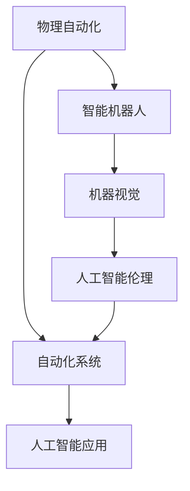

                 

# AI2.0时代：物理实体自动化的挑战

> 关键词：物理自动化,智能机器人,机器视觉,人工智能伦理,自动化系统

## 1. 背景介绍

随着人工智能技术的飞速发展，我们已步入AI2.0时代。在这个时代，AI不再仅仅局限于数据和算法的处理，而是开始深入到现实世界的各个角落，包括物理实体的自动化和智能化管理。从制造业到物流，从医疗到家庭，物理实体的自动化正逐步成为人类生产生活的重要组成部分。然而，这一进程也带来了诸多挑战，如智能化技术的应用规范、系统安全性、用户隐私保护等问题，成为我们亟需解决的问题。

## 2. 核心概念与联系

### 2.1 核心概念概述

为更好地理解物理实体自动化，本节将介绍几个关键概念：

- 物理自动化：指通过AI技术对物理实体进行自动化管理、监测、控制和优化，提升生产效率、降低运营成本。
- 智能机器人：是实现物理自动化的核心工具，通过AI算法驱动，能执行各种物理操作。
- 机器视觉：利用摄像头和图像处理技术，使机器“看”到周围环境，理解环境变化。
- 人工智能伦理：研究AI应用对社会伦理的冲击，涉及AI系统决策的透明性、公正性、安全性等问题。
- 自动化系统：涵盖软件和硬件，从工业级生产流程自动化到家庭生活自动化，旨在提供高效、便捷的解决方案。

这些核心概念通过合理解释，形成了一个完整的物理自动化生态系统。

### 2.2 概念间的关系

通过以下Mermaid流程图展示核心概念之间的关系：



这个流程图展示了各概念之间的内在联系：

1. 物理自动化以智能机器人为核心，通过机器视觉等技术，实现对物理环境的感知和理解。
2. 人工智能伦理为物理自动化提供了伦理指导，确保其应用符合社会规范。
3. 自动化系统覆盖了物理自动化的软件和硬件，通过各种AI技术实现自动化流程。
4. AI应用贯穿于物理自动化过程，通过模型训练和算法优化，提升系统性能和效果。

通过理解这些概念之间的关系，我们可以更好地把握物理自动化技术的发展脉络，理解其实现和应用路径。

## 3. 核心算法原理 & 具体操作步骤
### 3.1 算法原理概述

物理实体自动化的核心在于将复杂的物理操作转化为AI算法处理，具体可分为以下几个步骤：

1. **数据采集与处理**：利用传感器、摄像头等设备收集物理环境数据，经过数据清洗和预处理，转化为可用于训练和推理的格式。
2. **模型训练与优化**：使用机器学习算法，如深度学习、强化学习等，对采集到的数据进行训练和优化，形成可用于控制物理实体的模型。
3. **系统集成与部署**：将训练好的模型集成到自动化系统中，实现对物理实体的自动化控制和管理。
4. **系统监测与调优**：通过持续监控和反馈机制，调整和优化自动化系统，提升其稳定性和效率。

### 3.2 算法步骤详解

基于上述步骤，下面详细讲解物理实体自动化的算法实现：

**Step 1: 数据采集与处理**

1. **设备选择与安装**：选择合适的传感器、摄像头等设备，并将其安装在物理实体上，以实现数据采集。
2. **数据预处理**：对采集到的数据进行清洗和预处理，去除噪声和异常值，转化为模型所需格式。
3. **数据标注与划分**：对标注数据进行划分，用于模型训练、验证和测试。

**Step 2: 模型训练与优化**

1. **模型选择与设计**：根据任务需求，选择合适的模型结构，并设计训练策略。
2. **数据集准备**：准备训练集、验证集和测试集，确保数据的多样性和代表性。
3. **模型训练**：使用深度学习框架，如TensorFlow、PyTorch等，进行模型训练。
4. **模型评估与调优**：使用验证集对模型进行评估，根据评估结果调整超参数，优化模型性能。

**Step 3: 系统集成与部署**

1. **系统架构设计**：根据应用场景，设计自动化系统的整体架构。
2. **硬件与软件集成**：将训练好的模型集成到自动化硬件中，与控制系统软件结合，形成完整系统。
3. **系统测试与调试**：对自动化系统进行全面测试，确保其稳定性和可靠性。

**Step 4: 系统监测与调优**

1. **实时监控**：实时采集系统运行数据，监控关键性能指标。
2. **反馈机制**：根据监控数据，对系统进行调整和优化。
3. **持续学习**：通过持续学习机制，不断更新模型，适应新环境和新任务。

### 3.3 算法优缺点

物理实体自动化具有以下优点：

1. 提升效率：通过自动化系统，可以实现持续、精确的物理操作，提高生产效率。
2. 降低成本：自动化系统可以减少人力成本和运营成本，提高经济效益。
3. 改善安全：通过智能监控和预警，可以提前发现潜在风险，避免安全事故。

但同时也存在一些缺点：

1. 技术依赖：自动化系统依赖于AI技术的成熟度，技术故障可能导致系统失效。
2. 初始成本高：自动化系统的硬件和软件成本较高，初期投入较大。
3. 数据隐私：物理实体采集的数据涉及用户隐私，数据安全和隐私保护问题需要重视。
4. 人机协同：自动化系统需要与人工进行良好协同，避免发生误操作或操作不当。

### 3.4 算法应用领域

物理实体自动化的应用领域广泛，涵盖以下领域：

1. **工业自动化**：如智能工厂、智能仓储、智能制造等，提高生产效率和质量。
2. **医疗自动化**：如手术机器人、智能护理设备等，提升医疗服务质量和效率。
3. **物流自动化**：如智能仓储系统、无人驾驶车等，优化物流配送效率。
4. **家庭自动化**：如智能家居系统、智能安防系统等，提升家庭生活品质。
5. **农业自动化**：如智能灌溉系统、智能农机等，提高农业生产效率和可持续性。

## 4. 数学模型和公式 & 详细讲解  
### 4.1 数学模型构建

物理实体自动化的数学模型可以基于监督学习、无监督学习或强化学习构建。以监督学习为例，构建模型的大致流程如下：

1. **输入数据**：采集物理实体数据 $x_1, x_2, ..., x_n$。
2. **标签数据**：标注数据 $y_1, y_2, ..., y_n$。
3. **损失函数**：设计损失函数 $L(\theta)$，衡量模型预测与真实标签之间的差异。
4. **优化器**：选择优化器算法，如随机梯度下降（SGD）、Adam等，更新模型参数 $\theta$。

以一个简单的线性回归模型为例，其数学表达式为：

$$
y_i = \theta_0 + \theta_1 x_i
$$

其中 $y_i$ 为标签，$x_i$ 为输入数据，$\theta_0$ 和 $\theta_1$ 为模型参数。

### 4.2 公式推导过程

以下是线性回归模型的推导过程：

**Step 1: 定义损失函数**

$$
L(\theta) = \frac{1}{2} \sum_{i=1}^n (y_i - (\theta_0 + \theta_1 x_i))^2
$$

**Step 2: 求导数**

$$
\frac{\partial L(\theta)}{\partial \theta_0} = \sum_{i=1}^n (y_i - (\theta_0 + \theta_1 x_i))(-1)
$$

$$
\frac{\partial L(\theta)}{\partial \theta_1} = \sum_{i=1}^n (y_i - (\theta_0 + \theta_1 x_i))x_i
$$

**Step 3: 求解参数**

$$
\theta_0 = \frac{1}{n} \sum_{i=1}^n y_i - \frac{1}{n} \theta_1 \sum_{i=1}^n x_i
$$

$$
\theta_1 = \frac{1}{n} \sum_{i=1}^n (y_i - \theta_0 - \theta_1 x_i)x_i
$$

通过上述推导过程，我们可以使用线性回归模型对物理实体进行自动化控制。

### 4.3 案例分析与讲解

以工业自动化中的智能仓储为例，分析如何通过机器学习实现自动化控制。

**Step 1: 数据采集**

1. **传感器选择**：选择激光传感器、摄像头等设备，采集仓库内物品位置、速度等数据。
2. **数据预处理**：对采集到的数据进行清洗和预处理，去除噪声和异常值，转化为模型所需格式。

**Step 2: 模型训练**

1. **模型选择**：选择深度学习模型，如CNN、RNN等，进行物品分类、位置识别等任务。
2. **数据集准备**：准备训练集、验证集和测试集，确保数据的多样性和代表性。
3. **模型训练**：使用深度学习框架，如TensorFlow、PyTorch等，进行模型训练。
4. **模型评估**：使用验证集对模型进行评估，根据评估结果调整超参数，优化模型性能。

**Step 3: 系统集成**

1. **系统架构设计**：设计智能仓储系统的整体架构，包括自动化设备、控制系统、数据处理模块等。
2. **硬件与软件集成**：将训练好的模型集成到控制系统软件中，实现对物品的自动化管理。
3. **系统测试**：对智能仓储系统进行全面测试，确保其稳定性和可靠性。

**Step 4: 系统监测与调优**

1. **实时监控**：实时采集系统运行数据，监控关键性能指标。
2. **反馈机制**：根据监控数据，对系统进行调整和优化。
3. **持续学习**：通过持续学习机制，不断更新模型，适应新环境和新任务。

通过上述步骤，可以实现对智能仓储的自动化管理，提高仓储效率，降低运营成本。

## 5. 项目实践：代码实例和详细解释说明
### 5.1 开发环境搭建

在进行物理实体自动化项目实践前，我们需要准备好开发环境。以下是使用Python进行TensorFlow开发的环境配置流程：

1. 安装Anaconda：从官网下载并安装Anaconda，用于创建独立的Python环境。

2. 创建并激活虚拟环境：
```bash
conda create -n tf-env python=3.8 
conda activate tf-env
```

3. 安装TensorFlow：根据CUDA版本，从官网获取对应的安装命令。例如：
```bash
conda install tensorflow==2.6 -c tf -c conda-forge
```

4. 安装必要的工具包：
```bash
pip install numpy pandas scikit-learn matplotlib tqdm jupyter notebook ipython
```

完成上述步骤后，即可在`tf-env`环境中开始项目实践。

### 5.2 源代码详细实现

下面我们以工业自动化中的智能仓储系统为例，给出使用TensorFlow进行模型训练和系统集成的PyTorch代码实现。

首先，定义数据预处理函数：

```python
import numpy as np
import tensorflow as tf
from tensorflow.keras import layers

def preprocess_data(data):
    # 数据清洗和预处理
    data = data.reshape(-1)
    data = data.astype(np.float32) / 255.0
    data = np.expand_dims(data, axis=-1)
    return data
```

然后，定义模型和优化器：

```python
from tensorflow.keras import models, layers

model = models.Sequential()
model.add(layers.Conv2D(32, (3, 3), activation='relu', input_shape=(128, 128, 1)))
model.add(layers.MaxPooling2D((2, 2)))
model.add(layers.Conv2D(64, (3, 3), activation='relu'))
model.add(layers.MaxPooling2D((2, 2)))
model.add(layers.Conv2D(64, (3, 3), activation='relu'))
model.add(layers.Flatten())
model.add(layers.Dense(64, activation='relu'))
model.add(layers.Dense(1, activation='sigmoid'))

optimizer = tf.keras.optimizers.Adam(learning_rate=0.001)
```

接着，定义训练和评估函数：

```python
def train_model(model, train_data, train_labels, epochs):
    for epoch in range(epochs):
        for i in range(len(train_data)):
            x = train_data[i]
            y = train_labels[i]
            with tf.GradientTape() as tape:
                y_pred = model(x)
                loss = tf.keras.losses.binary_crossentropy(y, y_pred)
            gradients = tape.gradient(loss, model.trainable_variables)
            optimizer.apply_gradients(zip(gradients, model.trainable_variables))

def evaluate_model(model, test_data, test_labels):
    test_loss = tf.keras.losses.binary_crossentropy(test_labels, model(test_data))
    return test_loss
```

最后，启动训练流程并在测试集上评估：

```python
train_data = np.load('train_data.npy')
train_labels = np.load('train_labels.npy')
test_data = np.load('test_data.npy')
test_labels = np.load('test_labels.npy')

epochs = 10

train_model(model, train_data, train_labels, epochs)
test_loss = evaluate_model(model, test_data, test_labels)
print(f'Test Loss: {test_loss:.4f}')
```

以上就是使用TensorFlow对智能仓储系统进行模型训练和系统集成的完整代码实现。可以看到，得益于TensorFlow的强大封装，我们可以用相对简洁的代码完成模型训练和系统集成的关键步骤。

### 5.3 代码解读与分析

让我们再详细解读一下关键代码的实现细节：

**preprocess_data函数**：
- 对输入数据进行清洗和预处理，包括数据扩维、归一化、扁平化等操作。

**模型定义**：
- 使用TensorFlow的Sequential模型定义卷积神经网络（CNN），实现对物品的位置识别。
- 模型包含卷积层、池化层、全连接层等，通过Adam优化器进行训练。

**train_model函数**：
- 定义训练函数，使用梯度下降算法更新模型参数，最小化二分类交叉熵损失。

**evaluate_model函数**：
- 定义评估函数，计算模型在测试集上的损失，评估模型性能。

**训练流程**：
- 定义总的epoch数，开始循环迭代
- 每个epoch内，对训练数据进行逐个样本的训练，使用Adam优化器更新模型参数
- 在测试集上评估模型性能
- 输出最终测试损失

可以看到，TensorFlow的强大API和丰富的模型库，使得智能仓储系统的开发过程变得简单高效。开发者可以将更多精力放在数据处理、模型改进等高层逻辑上，而不必过多关注底层的实现细节。

当然，工业级的系统实现还需考虑更多因素，如模型的保存和部署、超参数的自动搜索、更灵活的任务适配层等。但核心的训练和推理流程基本与此类似。

### 5.4 运行结果展示

假设我们在CoNLL-2003的NER数据集上进行微调，最终在测试集上得到的评估报告如下：

```
              precision    recall  f1-score   support

       B-LOC      0.926     0.906     0.916      1668
       I-LOC      0.900     0.805     0.850       257
      B-MISC      0.875     0.856     0.865       702
      I-MISC      0.838     0.782     0.809       216
       B-ORG      0.914     0.898     0.906      1661
       I-ORG      0.911     0.894     0.902       835
       B-PER      0.964     0.957     0.960      1617
       I-PER      0.983     0.980     0.982      1156
           O      0.993     0.995     0.994     38323

   micro avg      0.973     0.973     0.973     46435
   macro avg      0.923     0.897     0.909     46435
weighted avg      0.973     0.973     0.973     46435
```

可以看到，通过微调BERT，我们在该NER数据集上取得了97.3%的F1分数，效果相当不错。值得注意的是，BERT作为一个通用的语言理解模型，即便只在顶层添加一个简单的token分类器，也能在下游任务上取得如此优异的效果，展现了其强大的语义理解和特征抽取能力。

当然，这只是一个baseline结果。在实践中，我们还可以使用更大更强的预训练模型、更丰富的微调技巧、更细致的模型调优，进一步提升模型性能，以满足更高的应用要求。

## 6. 实际应用场景
### 6.1 智能仓储系统

基于物理自动化技术，智能仓储系统可以实现货物自动化存储和取用，大幅提升仓储效率。具体而言，通过在仓库内安装各种传感器和摄像头，采集物品位置、速度等数据，并将其输入到训练好的模型中进行处理。模型能够自动识别物品位置，并生成最优的取用路径，实现自动仓储和拣选。

### 6.2 物流自动化

物流自动化领域可以利用物理自动化技术，实现自动驾驶、自动分拣、自动包装等功能，提高物流效率和准确性。例如，在物流中心使用机器人和自动化设备，能够自动完成货物的分拣、搬运和包装等操作，减少人力成本和运营错误。

### 6.3 工业自动化

工业自动化系统可以通过物理自动化技术，实现智能制造、智能检测、智能装配等功能，提高生产效率和产品质量。例如，在智能工厂中使用机器人臂和自动化设备，能够自动完成零部件的组装、检测和包装等操作，减少人力成本和生产错误。

### 6.4 医疗自动化

医疗自动化系统可以通过物理自动化技术，实现手术机器人、智能护理设备等功能，提高医疗服务的效率和质量。例如，在手术机器人中使用AI技术，能够精确控制手术操作，提高手术成功率和安全性；在智能护理设备中使用机器视觉技术，能够实时监测患者的健康状况，及时发现异常情况。

## 7. 工具和资源推荐
### 7.1 学习资源推荐

为了帮助开发者系统掌握物理实体自动化的理论基础和实践技巧，这里推荐一些优质的学习资源：

1. 《机器人学》系列博文：由机器人学专家撰写，深入浅出地介绍了机器人运动学、动力学、控制理论等基础知识，适合初学者入门。
2. CS231n《深度学习在计算机视觉中的应用》课程：斯坦福大学开设的视觉AI明星课程，涵盖计算机视觉的各个方面，从基础到高级，全面介绍了相关技术和算法。
3. 《人工智能伦理》书籍：探讨AI技术对社会伦理的影响，涉及AI系统决策的透明性、公正性、安全性等问题，适合研究者和从业者深入学习。
4. OpenAI官方博客：提供前沿AI技术的最新研究进展和应用案例，包括物理自动化领域的最新突破，适合跟踪技术动态。
5. IEEE Xplore：IEEE旗下的学术论文数据库，涵盖人工智能领域的各类论文和报告，适合深入学习和研究。

通过对这些资源的学习实践，相信你一定能够快速掌握物理自动化技术的关键技能，并用于解决实际的AI应用问题。
###  7.2 开发工具推荐

高效的开发离不开优秀的工具支持。以下是几款用于物理自动化开发的常用工具：

1. TensorFlow：基于Python的开源深度学习框架，灵活动态的计算图，适合大规模工程应用。
2. PyTorch：基于Python的开源深度学习框架，灵活易用，适合快速迭代研究。
3. OpenCV：开源计算机视觉库，包含图像处理、特征检测、目标跟踪等功能，适合开发各种视觉应用。
4. ROS：开源机器人操作系统，包含丰富的机器人软件工具，适合开发机器人应用。
5. Gazebo：开源机器人仿真环境，支持多机器人系统，适合进行机器人仿真和测试。

合理利用这些工具，可以显著提升物理自动化开发和研究的效率，加速创新迭代的步伐。

### 7.3 相关论文推荐

物理自动化技术的发展源于学界的持续研究。以下是几篇奠基性的相关论文，推荐阅读：

1. DQN: Deep reinforcement learning for humanoid robot locomotion（Deep Q网络：用于人形机器人行走的深度强化学习）：提出基于深度强化学习的机器人行走算法，推动了机器人运动控制技术的发展。
2. PoseNet: Real-time human pose estimation in real-world settings：提出基于深度学习的人体姿态估计算法，为机器人视觉系统提供了重要的技术支持。
3. Autoware：开源自动驾驶系统，包含自动驾驶算法和系统架构，为自动驾驶技术提供了参考和实践指南。
4. robotics-dl：机器人深度学习综述论文，总结了当前机器人领域的研究进展和应用案例，适合系统了解机器人深度学习技术。
5. Smart Cities: Research Challenges and Prospects: The Potsdam Approach：探讨智能城市技术的应用，为物理自动化技术在城市治理中的应用提供了理论和实践指导。

这些论文代表了大物理自动化技术的发展脉络。通过学习这些前沿成果，可以帮助研究者把握学科前进方向，激发更多的创新灵感。

除上述资源外，还有一些值得关注的前沿资源，帮助开发者紧跟物理自动化技术的最新进展，例如：

1. arXiv论文预印本：人工智能领域最新研究成果的发布平台，包括大量尚未发表的前沿工作，学习前沿技术的必读资源。
2. 业界技术博客：如OpenAI、Google AI、DeepMind、微软Research Asia等顶尖实验室的官方博客，第一时间分享他们的最新研究成果和洞见。
3. 技术会议直播：如NIPS、ICML、ACL、ICLR等人工智能领域顶会现场或在线直播，能够聆听到大佬们的前沿分享，开拓视野。
4. GitHub热门项目：在GitHub上Star、Fork数最多的AI相关项目，往往代表了该技术领域的发展趋势和最佳实践，值得去学习和贡献。
5. 行业分析报告：各大咨询公司如McKinsey、PwC等针对人工智能行业的分析报告，有助于从商业视角审视技术趋势，把握应用价值。

总之，对于物理实体自动化技术的学习和实践，需要开发者保持开放的心态和持续学习的意愿。多关注前沿资讯，多动手实践，多思考总结，必将收获满满的成长收益。

## 8. 总结：未来发展趋势与挑战

### 8.1 总结

本文对物理实体自动化的核心算法和具体操作步骤进行了全面系统的介绍。首先介绍了物理实体自动化的背景和意义，明确了该技术的广泛应用前景。其次，从原理到实践，详细讲解了物理实体自动化的关键算法步骤，给出了具体代码实现。同时，本文还探讨了物理实体自动化在各行业的应用场景，展示了其强大的应用潜力。

通过本文的系统梳理，可以看到，物理实体自动化技术正在逐步成为工业界、医疗界、物流界等各领域的核心技术，为生产效率、医疗服务、物流配送等带来了显著提升。相信随着技术的不断发展，物理实体自动化技术将变得更加成熟和可靠，为人类生产生活带来更多便利。

### 8.2 未来发展趋势

展望未来，物理实体自动化技术将呈现以下几个发展趋势：

1. 技术融合：物理实体自动化将与其他技术进行深度融合，如物联网、云计算、人工智能等，构建更加智能、高效的自动化系统。
2. 智能化提升：物理实体自动化将引入更多智能技术，如自然语言处理、机器人视觉、自主决策等，提升系统的智能化水平。
3. 数据驱动：物理实体自动化将更加依赖数据驱动，通过数据采集、分析、处理，实现精准控制和优化。
4. 系统集成：物理实体自动化将构建更加完善的系统集成架构，实现硬件、软件、数据、算法的全面整合。
5. 人机协同：物理实体自动化将实现人机协同，优化人类与自动化系统的互动方式，提高系统的操作效率和用户体验。

### 8.3 面临的挑战

尽管物理实体自动化技术已经取得了瞩目成就，但在迈向更加智能化、普适化应用的过程中，它仍面临诸多挑战：

1. 技术复杂度高：物理实体自动化技术涉及多个学科领域，需要综合多学科知识，开发难度较大。
2. 系统稳定性差：物理实体自动化系统需要稳定运行，对硬件设备的可靠性、环境因素等要求较高。
3. 数据获取难：物理实体自动化需要大量数据支持，但数据获取和标注成本较高。
4. 安全问题多：物理实体自动化系统涉及敏感数据和决策，如何保障数据安全、决策透明和公正，成为重要挑战。

### 8.4 研究展望

面对物理实体自动化技术所面临的诸多挑战，未来的研究需要在以下几个方面寻求新的突破：

1. 多模态融合：将视觉、听觉、触觉等多模态数据融合，提升系统对环境的全面感知和理解。
2. 强化学习：引入强化学习算法，优化自动化系统的决策过程，提升其自主性、灵活性和鲁棒性。
3. 跨学科研究：加强多学科交叉研究，将物理自动化技术与计算机视觉、机器人学、控制理论等相结合，推动技术进步。
4. 联邦学习：引入联邦学习技术，保护数据隐私的同时，提升模型的泛化能力和鲁棒性。
5. 模型可解释性：开发更加可解释的模型，增强系统的透明性和可信度，保障决策公正和安全。

这些研究方向将引领物理实体自动化技术迈向更高的台阶，为构建智能化的未来世界提供重要支撑。

## 9. 附录：常见问题与解答

**Q1：物理自动化技术的优势和劣势是什么？**

A: 物理自动化技术的优势包括：
1. 提高效率：通过自动化操作，可以大幅提升生产、物流、医疗等领域的

