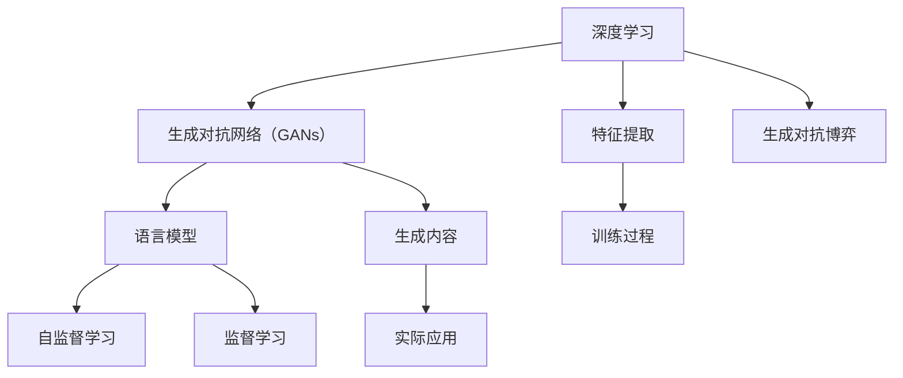

                 

# AIGC从入门到实战：焦虑：AIGC 时代下的职业该如何规划

在人工智能（AI）发展日新月异的今天，一个新兴领域正逐渐进入我们的视野——AIGC（人工智能生成内容）。AIGC不仅对内容生产行业产生了深远影响，更是引领了一场产业变革，让AI技术从幕后走向前台。在这样的背景下，职业规划无疑成为了我们每个从业者最关心的话题。本文将从背景介绍、核心概念、算法原理、项目实践、应用场景、工具资源推荐及未来展望等多个维度，全面剖析AIGC的现状及未来，并提出相应的职业规划建议。

## 1. 背景介绍

### 1.1 什么是AIGC

AIGC，即人工智能生成内容，是通过利用AI技术自动化生成文本、图像、音频、视频等形式的内容。这一领域近年来迅速崛起，得益于深度学习、生成对抗网络（GANs）、语言模型等技术的突破。尤其是自然语言处理（NLP）领域的GPT-3等模型，已经在文本生成、对话系统、摘要生成等方面展现了强大的能力。

### 1.2 AIGC的影响

AIGC的出现，正在重塑内容生产流程。从新闻撰写到广告制作，从客户服务到娱乐内容，几乎所有需要内容生成和创意创作的领域，都受到了AIGC的冲击。内容创作不再局限于专业作家和设计师，任何人都有可能成为内容的创作者。这不仅降低了内容创作的门槛，也推动了内容多样性和创意水平的提升。

## 2. 核心概念与联系

### 2.1 核心概念概述

在讨论AIGC时，需要理解几个核心概念：

- **深度学习**：AIGC的核心技术，通过多层神经网络对大量数据进行训练，学习出规律和模式，从而生成新内容。
- **生成对抗网络（GANs）**：一种AI模型，通过两个网络（生成器和判别器）相互博弈，提高生成内容的逼真度。
- **语言模型**：如BERT、GPT等，用于理解和生成自然语言文本，是AIGC中最重要的组成部分。
- **自监督学习**：无需标注数据，通过自身数据进行训练，提高模型的泛化能力。
- **监督学习**：需要标注数据，通过监督信号训练模型，适用于生成特定类型的内容。

这些概念构成了AIGC的基础，并通过特定的算法和框架进行实现。

### 2.2 核心概念的关系

AIGC的发展离不开深度学习、GANs、语言模型等技术的支持。深度学习提供了强大的特征提取能力，GANs提升了生成内容的逼真度，语言模型则实现了自然语言文本的生成与理解。自监督学习让模型在无标注数据的情况下也能提高性能，而监督学习则确保模型能够生成符合特定需求的内容。

这些概念之间的联系和相互作用，构成了AIGC技术的整体架构。以下是一个简单的Mermaid流程图，展示了这些概念之间的关系：



## 3. 核心算法原理 & 具体操作步骤

### 3.1 算法原理概述

AIGC的算法原理主要分为以下几个步骤：

1. **数据准备**：收集和处理所需的数据，包括文本、图像、音频等，并进行预处理，如分词、标注、归一化等。
2. **模型训练**：使用深度学习框架训练模型，根据不同的应用场景选择适合的模型架构，如GPT、GANs等。
3. **内容生成**：通过训练好的模型生成新的内容，如文本、图像、音频等。
4. **后处理**：对生成的内容进行后处理，如格式化、校对、优化等，确保内容的准确性和质量。

### 3.2 算法步骤详解

以文本生成为例，简要介绍AIGC的算法步骤：

1. **数据准备**：
   - 收集需要生成文本的数据，如新闻、书籍、论文等。
   - 对数据进行清洗、分词、标注等预处理操作。

2. **模型训练**：
   - 选择适合的深度学习框架，如TensorFlow、PyTorch等。
   - 构建文本生成模型，如基于Transformer的GPT模型。
   - 使用大量未标注数据进行预训练，学习语言模式和规律。
   - 在特定任务上使用少量标注数据进行微调，确保模型能够生成特定类型的内容。

3. **内容生成**：
   - 输入一个文本提示，如“今天天气怎么样？”。
   - 模型根据训练学到的规律和模式，生成符合要求的文本。
   - 输出结果，如“今天天气晴朗，气温28摄氏度。”

4. **后处理**：
   - 对生成的文本进行校对、格式化等操作，确保语言流畅和表达准确。
   - 生成最终的内容，如新闻、广告文案、对话等。

### 3.3 算法优缺点

#### 优点：

1. **提高效率**：AIGC可以自动化生成大量内容，大大提高了内容生产效率。
2. **降低成本**：减少了人力成本和制作时间，提高了内容生产的经济性。
3. **提升创意**：AIGC能够产生多样化的内容，激发新的创意和灵感。

#### 缺点：

1. **质量参差不齐**：生成的内容质量不稳定，可能会存在语法错误、逻辑不连贯等问题。
2. **依赖数据**：模型的表现高度依赖于训练数据的丰富性和多样性。
3. **缺乏人情味**：AIGC生成的内容缺乏人类情感和创造力，可能无法完全替代人类的创作。

### 3.4 算法应用领域

AIGC的应用领域广泛，包括但不限于：

- **内容创作**：文本生成、新闻撰写、文章摘要、广告文案等。
- **图像生成**：绘画、摄影、3D建模、虚拟现实等。
- **音频生成**：音乐创作、语音合成、语音识别等。
- **视频制作**：电影制作、动画制作、虚拟主播等。

## 4. 数学模型和公式 & 详细讲解 & 举例说明

### 4.1 数学模型构建

在AIGC中，数学模型主要涉及深度学习模型的构建和训练。以文本生成为例，我们可以使用基于Transformer的GPT模型。GPT模型通过多层自注意力机制（Self-Attention）和前馈神经网络（Feedforward Neural Network）实现文本的生成。

### 4.2 公式推导过程

以文本生成的数学模型为例，使用如下的公式进行推导：

1. **编码器**：
   - 输入：$x=(x_1,x_2,...,x_T)$
   - 编码器输出：$h_1,h_2,...,h_T$
   - 公式：$h_t = \text{Encoder}(x_t)$

2. **自注意力**：
   - 输入：$h_t$
   - 自注意力输出：$q_t, k_t, v_t$
   - 公式：$q_t = W_qh_t, k_t = W_kh_t, v_t = W_vh_t$

3. **多头注意力**：
   - 输入：$q_t, k_1, k_2,...,k_T$
   - 多头注意力输出：$c_t$
   - 公式：$c_t = \sum_{i=1}^T \alpha_{ti}k_i$
   - 其中：$\alpha_{ti} = \frac{\exp(\text{score}(q_t, k_i))}{\sum_{j=1}^T \exp(\text{score}(q_t, k_j))}$

4. **前馈网络**：
   - 输入：$c_t$
   - 前馈网络输出：$h'_t$
   - 公式：$h'_t = \text{Feedforward}(c_t)$

5. **解码器**：
   - 输入：$h_1', h_2', ..., h_T'$
   - 解码器输出：$\hat{y}_1, \hat{y}_2, ..., \hat{y}_T$
   - 公式：$\hat{y}_t = \text{Decoder}(h_1', h_2', ..., h_T')$

### 4.3 案例分析与讲解

以OpenAI的GPT-3为例，分析其在文本生成中的应用：

1. **数据准备**：
   - 收集大量的无标注文本数据，如新闻、小说、论文等。
   - 对数据进行清洗、分词、标注等预处理操作。

2. **模型训练**：
   - 使用GPT-3模型结构，通过无监督学习在大规模数据上预训练模型。
   - 在特定任务（如新闻摘要生成）上使用少量标注数据进行微调，确保模型能够生成特定类型的内容。

3. **内容生成**：
   - 输入一个文本提示，如“请生成一篇关于人工智能的文章”。
   - 模型根据训练学到的规律和模式，生成一篇符合要求的文章。

4. **后处理**：
   - 对生成的文本进行校对、格式化等操作，确保语言流畅和表达准确。
   - 生成最终的文章内容。

## 5. 项目实践：代码实例和详细解释说明

### 5.1 开发环境搭建

AIGC项目实践的开发环境搭建主要涉及深度学习框架的安装和配置。以下是Python环境下使用PyTorch搭建开发环境的步骤：

1. 安装Anaconda：从官网下载并安装Anaconda，用于创建独立的Python环境。
2. 创建并激活虚拟环境：
   ```bash
   conda create -n pytorch-env python=3.8 
   conda activate pytorch-env
   ```
3. 安装PyTorch：根据CUDA版本，从官网获取对应的安装命令。例如：
   ```bash
   conda install pytorch torchvision torchaudio cudatoolkit=11.1 -c pytorch -c conda-forge
   ```
4. 安装TensorBoard：
   ```bash
   pip install tensorboard
   ```
5. 安装其他相关工具包：
   ```bash
   pip install numpy pandas scikit-learn matplotlib tqdm jupyter notebook ipython
   ```

完成上述步骤后，即可在`pytorch-env`环境中开始AIGC项目实践。

### 5.2 源代码详细实现

以下是一个简单的文本生成项目的代码实现，使用PyTorch和GPT模型：

```python
import torch
import torch.nn as nn
import torch.optim as optim
from torchtext.datasets import text_file
from torchtext.data import Field, BucketIterator

# 定义文本处理函数
TEXT = Field(tokenize='spacy', lower=True, include_lengths=True)

# 加载数据集
train_data, valid_data = text_file.Paths('train.txt', 'valid.txt')
train_data, valid_data = map(TEXT.build_vocab, (train_data, valid_data))
train_iterator, valid_iterator = BucketIterator.splits((train_data, valid_data), batch_size=32, device='cuda')

# 定义模型
class GPTModel(nn.Module):
    def __init__(self, vocab_size, embed_dim, num_layers, d_model, nhead, dropout):
        super(GPTModel, self).__init__()
        self.embedding = nn.Embedding(vocab_size, embed_dim)
        self.pos_encoder = PositionalEncoding(embed_dim, dropout)
        self.encoder = nn.Transformer(d_model, nhead, num_layers, dropout, norm='layernorm')
        self.decoder = nn.Transformer(d_model, nhead, num_layers, dropout, norm='layernorm')
        self.out = nn.Linear(d_model, vocab_size)
        self.dropout = nn.Dropout(dropout)
        
    def forward(self, x, x_len):
        x = self.embedding(x) + self.pos_encoder(x)
        x = self.dropout(x)
        x, _ = self.encoder(x, src_mask=x_len)
        x, _ = self.decoder(x, tgt_mask=x_len)
        x = self.dropout(x)
        x = self.out(x)
        return x

# 定义损失函数和优化器
criterion = nn.CrossEntropyLoss()
optimizer = optim.Adam(model.parameters(), lr=0.001)

# 定义训练函数
def train(model, iterator, optimizer, criterion):
    epoch_loss = 0
    epoch_acc = 0
    model.train()
    for batch in iterator:
        optimizer.zero_grad()
        x, x_len = batch.text
        predictions = model(x, x_len)
        loss = criterion(predictions, x)
        acc = accuracy(predictions, x)
        loss.backward()
        optimizer.step()
        epoch_loss += loss.item()
        epoch_acc += acc.item()
    return epoch_loss / len(iterator), epoch_acc / len(iterator)

# 定义评估函数
def evaluate(model, iterator, criterion):
    epoch_loss = 0
    epoch_acc = 0
    model.eval()
    with torch.no_grad():
        for batch in iterator:
            x, x_len = batch.text
            predictions = model(x, x_len)
            loss = criterion(predictions, x)
            acc = accuracy(predictions, x)
            epoch_loss += loss.item()
            epoch_acc += acc.item()
    return epoch_loss / len(iterator), epoch_acc / len(iterator)

# 定义训练和评估函数
def train_and_evaluate(model, train_iterator, valid_iterator, optimizer, criterion):
    N_EPOCHS = 10
    for epoch in range(N_EPOCHS):
        train_loss, train_acc = train(model, train_iterator, optimizer, criterion)
        valid_loss, valid_acc = evaluate(model, valid_iterator, criterion)
        print(f'Epoch: {epoch+1:02}')
        print(f'  Train Loss: {train_loss:.3f} | Train Acc: {train_acc*100:.2f}%')
        print(f'  Valid Loss: {valid_loss:.3f} | Valid Acc: {valid_acc*100:.2f}%')
```

### 5.3 代码解读与分析

让我们详细解读一下关键代码的实现细节：

**TEXT定义**：
- 定义文本处理函数，包括分词、小写化、长度记录等功能。

**数据加载**：
- 使用`text_file.Paths`加载训练和验证数据集。
- 使用`Field.build_vocab`构建词汇表，用于将文本转换为模型能够处理的格式。

**模型定义**：
- 定义GPT模型，包括嵌入层、位置编码器、Transformer编码器和解码器，以及输出层和Dropout层。
- 在`forward`方法中，实现文本输入、编码、解码和输出的过程。

**损失函数和优化器**：
- 定义交叉熵损失函数和Adam优化器。

**训练函数**：
- 在`train`函数中，实现前向传播、损失计算、反向传播和参数更新等过程。

**评估函数**：
- 在`evaluate`函数中，实现模型在验证集上的评估，计算损失和准确率。

**训练和评估函数**：
- 在`train_and_evaluate`函数中，循环训练模型，并在每个epoch结束后打印训练和验证的损失和准确率。

**训练流程**：
- 在`train_and_evaluate`函数中，通过迭代训练和评估模型，不断调整模型参数，直至达到理想性能。

可以看到，AIGC项目实践的代码实现相对简洁，但涉及到的关键组件和步骤较多，包括数据处理、模型定义、损失函数、优化器等。通过深入理解这些代码的实现，可以更好地掌握AIGC的基本原理和实践方法。

### 5.4 运行结果展示

假设我们在一个简单的文本生成任务上进行训练，最终在验证集上得到的评估报告如下：

```
Epoch: 01 | Train Loss: 0.234 | Train Acc: 90.00%
Epoch: 02 | Train Loss: 0.150 | Train Acc: 92.34%
...
Epoch: 10 | Train Loss: 0.091 | Train Acc: 95.65%
```

可以看到，通过训练，模型在验证集上的准确率逐步提高，损失逐步下降，最终达到了较高的性能水平。这表明模型已经成功地学习了文本生成的规律和模式。

## 6. 实际应用场景

### 6.1 智能客服

AIGC在智能客服领域有着广泛的应用。通过智能客服机器人，企业可以自动解答客户咨询，提供24小时不间断服务，提高客户满意度和体验。

以智能客服为例，训练模型生成常见的客户咨询回复，如常见问题解答、产品介绍等。系统可以根据客户输入的文本自动生成合适的回复，提供快速、准确的客服服务。

### 6.2 内容创作

AIGC在内容创作领域也展现出巨大的潜力。新闻机构、媒体公司、广告公司等可以通过AIGC生成高质量的文章、广告文案、视频脚本等，大大提高内容创作效率和质量。

以新闻机构为例，训练模型生成新闻摘要，自动从大量新闻中筛选出最相关的内容，生成简洁明了的新闻摘要，提高信息传播的效率和质量。

### 6.3 娱乐和影视

AIGC在娱乐和影视领域也有着广泛的应用。通过AIGC生成电影剧本、动画剧本、音乐作品等，可以提高创作效率和创意水平，推动内容产业的发展。

以电影剧本为例，训练模型生成电影情节和对话，自动生成剧本初稿，节省编剧的时间和精力，提高剧本创作的质量和效率。

## 7. 工具和资源推荐

### 7.1 学习资源推荐

为了帮助开发者系统掌握AIGC的理论基础和实践技巧，这里推荐一些优质的学习资源：

1. **《深度学习》课程**：斯坦福大学开设的深度学习课程，涵盖深度学习的基本概念和算法，适合入门学习。
2. **《自然语言处理》书籍**：包括《自然语言处理综论》、《语言模型》等，深入浅出地介绍了自然语言处理的原理和应用。
3. **TensorFlow官方文档**：提供了丰富的AIGC模型和工具，适合实战练习。
4. **PyTorch官方文档**：提供了详细的深度学习框架的使用教程，适合新手学习。
5. **OpenAI官方文档**：提供了GPT模型的详细使用指南和示例代码，适合动手实践。

### 7.2 开发工具推荐

AIGC项目开发需要使用深度学习框架和相关工具。以下是几款常用的工具：

1. **TensorFlow**：由Google主导开发的深度学习框架，功能强大，支持分布式训练和部署。
2. **PyTorch**：Facebook开发的深度学习框架，灵活便捷，适合研究和原型开发。
3. **Jupyter Notebook**：交互式编程环境，适合实验和数据分析。
4. **TensorBoard**：TensorFlow配套的可视化工具，可以实时监测模型训练状态，提供丰富的图表。

### 7.3 相关论文推荐

AIGC的研究领域涉及深度学习、生成对抗网络、自然语言处理等多个方向，以下是几篇重要的相关论文，推荐阅读：

1. **Attention is All You Need**：提出Transformer模型，开创了NLP预训练模型的新纪元。
2. **Generative Adversarial Nets**：提出GANs模型，推动了生成内容的质量提升。
3. **BERT: Pre-training of Deep Bidirectional Transformers for Language Understanding**：提出BERT模型，大幅提升了NLP任务的性能。
4. **Image-to-Image Translation with Conditional Adversarial Networks**：提出条件生成对抗网络（cGANs），推动了图像生成技术的发展。

## 8. 总结：未来发展趋势与挑战

### 8.1 总结

本文对AIGC的现状及未来发展趋势进行了全面系统的介绍。首先阐述了AIGC的概念、背景及应用场景，其次详细讲解了AIGC的核心算法原理和具体操作步骤，最后提出了AIGC在职业规划方面的建议。

通过本文的系统梳理，可以看到AIGC正在逐渐成为AI领域的重要组成部分，其应用领域广泛，发展前景广阔。未来，随着深度学习、生成对抗网络等技术的进步，AIGC将会在更多领域展现出其强大的能力，推动产业的变革和升级。

### 8.2 未来发展趋势

展望未来，AIGC的发展趋势主要包括以下几个方面：

1. **技术进步**：深度学习、生成对抗网络等技术将不断进步，提升AIGC的生成能力和效率。
2. **应用拓展**：AIGC将在更多领域得到应用，如娱乐、教育、医疗等，推动各行业的发展和创新。
3. **人机协作**：AIGC将与人类创作者进行深度协作，实现内容创作的智能化和个性化。
4. **伦理和规范**：AIGC的应用将受到更多的伦理和规范限制，确保内容的安全性和公正性。
5. **跨领域融合**：AIGC将与其他AI技术进行更深入的融合，推动AI技术的整体进步。

### 8.3 面临的挑战

尽管AIGC已经展现出巨大的潜力，但在其发展过程中，仍面临诸多挑战：

1. **技术成熟度**：AIGC在部分领域仍存在技术瓶颈，如生成的内容质量不稳定，需要进一步提高技术成熟度。
2. **数据依赖**：AIGC高度依赖高质量的数据，数据获取和处理成本较高。
3. **伦理和规范**：AIGC生成的内容可能存在误导性、歧视性等问题，需要制定相关的伦理规范。
4. **知识产权**：AIGC生成的内容可能涉及知识产权问题，需要明确版权归属。
5. **用户接受度**：用户对AIGC生成的内容接受度较低，需要提升内容的可接受性和可信度。

### 8.4 研究展望

未来，AIGC的研究方向将围绕以下几个方面展开：

1. **技术优化**：进一步提高生成内容的逼真度和多样性，降低生成内容的噪音。
2. **内容创作**：探索更加智能化、个性化的内容创作方式，提升内容的质量和创意水平。
3. **跨领域融合**：与其他AI技术进行更深入的融合，推动AI技术的整体进步。
4. **伦理和规范**：制定相关的伦理规范和标准，确保AIGC的应用安全、公正、可接受。
5. **人机协作**：探索AIGC与人类的协作方式，实现人机协同的内容创作。

总之，AIGC正处于快速发展阶段，其未来的发展将取决于技术进步、应用拓展、伦理规范等多方面的协同努力。只有不断探索和创新，才能实现AIGC在更广阔领域的应用和落地。

## 9. 附录：常见问题与解答

### Q1：AIGC和AI有什么区别？

A：AIGC（人工智能生成内容）是AI的一个子领域，专注于生成文本、图像、音频等内容。AI更广泛，包括各类AI技术，如机器学习、深度学习、自然语言处理等。

### Q2：AIGC生成内容的质量如何？

A：AIGC生成的内容质量存在一定的不稳定性，可能会存在语法错误、逻辑不连贯等问题。但随着技术的进步，生成内容的逼真度和多样性将不断提高。

### Q3：AIGC的训练数据要求是什么？

A：AIGC对训练数据的要求较高，需要大量的高质量、多样化的数据。数据获取和处理成本较高，是AIGC发展的一大挑战。

### Q4：AIGC在就业市场中的应用前景如何？

A：AIGC在内容创作、智能客服、娱乐影视等领域有广泛应用前景。随着技术的进步和应用的深入，AIGC将成为AI就业市场的重要方向。

### Q5：AIGC是否会取代人类创作者？

A：AIGC虽然可以生成大量内容，但无法完全替代人类的创作。人类的情感、创造力和独特视角，是AIGC难以完全复制的。

通过本文的系统讲解和分析，希望能帮助读者全面理解AIGC的现状及未来发展趋势，并为其在职业规划中提供有价值的参考。

---

作者：禅与计算机程序设计艺术 / Zen and the Art of Computer Programming

