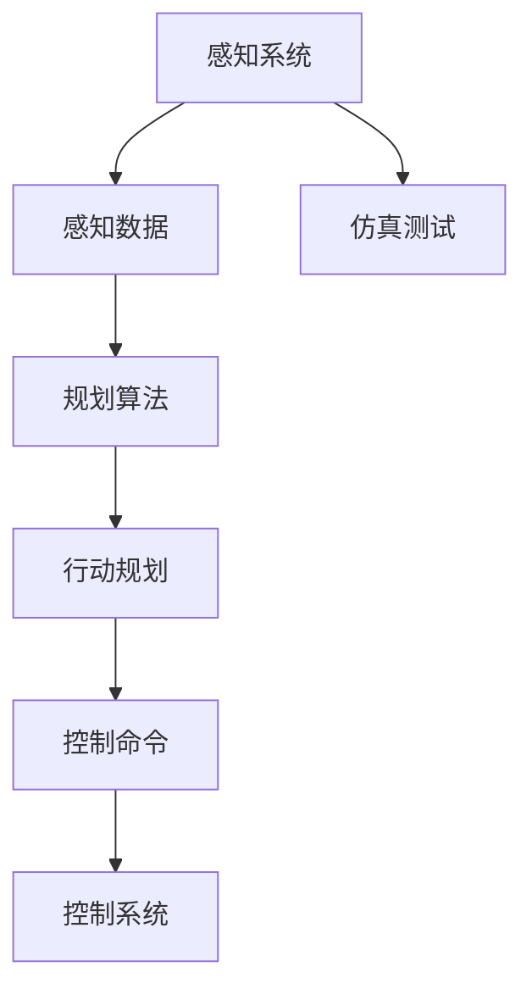

                 

# AI人工智能 Agent：在无人驾驶中的应用

> 关键词：无人驾驶, 人工智能, 代理人(Agent), 车辆控制, 感知系统, 规划算法, 仿真测试, 计算复杂度, 技术挑战

## 1. 背景介绍

### 1.1 问题由来
近年来，随着人工智能(AI)技术迅猛发展，无人驾驶成为智能交通领域的核心研究方向之一。无人驾驶技术旨在通过感知系统、规划算法和控制系统，实现车辆自主导航、路径规划、决策执行等功能。其中，AI代理人（Agent）在无人驾驶中扮演了关键角色，通过与环境交互，完成复杂的驾驶任务，保障乘客安全。

### 1.2 问题核心关键点
AI代理人是一种能够自主地感知环境、规划行动、执行决策的智能实体。在无人驾驶中，AI代理人需要处理复杂多变的交通场景，实时响应环境变化，进行路径规划、避障、跟随等任务。AI代理人的设计、训练和部署，是无人驾驶技术的核心问题之一。

### 1.3 问题研究意义
研究AI代理人在无人驾驶中的应用，对于推动智能交通的全面发展，提升车辆的安全性、舒适性和效率，具有重要意义：

1. 减少交通事故：AI代理人能够实时监控车辆状态和环境信息，及时响应意外情况，减少交通事故发生。
2. 提高交通效率：通过优化路径规划和调度，AI代理人能够显著提高交通流效率，减少拥堵现象。
3. 提升驾驶体验：AI代理人可以自动执行驾驶任务，使驾驶过程更加轻松、舒适。
4. 降低运营成本：自动驾驶车辆可以持续工作，减少驾驶员的休息和薪酬支出，降低运营成本。
5. 助力环保：自动驾驶减少了人为驾驶的失误和不当操作，有助于减少碳排放，保护环境。

## 2. 核心概念与联系

### 2.1 核心概念概述

为了更好地理解AI代理人在无人驾驶中的应用，本节将介绍几个关键概念：

- AI代理人(Agent)：能够自主地感知环境、规划行动、执行决策的智能实体。
- 感知系统：用于实时获取车辆周围环境信息的技术，包括摄像头、雷达、激光雷达等传感器。
- 规划算法：用于路径规划和行动决策的算法，如A*、RRT等。
- 控制系统：用于控制车辆转向、加速、刹车等执行机构，实现行动指令。
- 仿真测试：在模拟环境中进行测试和验证，评估AI代理人的性能和稳定性。

### 2.2 概念间的关系

这些核心概念之间的逻辑关系可以通过以下Mermaid流程图来展示：



这个流程图展示了这个综合流程图中的各个环节，它们的关系如下：

- 感知系统负责获取车辆周围的环境数据，如摄像头图像、雷达信号、激光雷达点云等。
- 感知数据经过规划算法处理，生成行动规划。
- 行动规划通过控制系统转换为具体的执行命令，如转向、加速、刹车等。
- 执行命令由控制系统执行，实现车辆的实际行动。
- 仿真测试用于评估感知、规划、控制等环节的性能和可靠性，确保系统能够应对各种复杂情况。

## 3. 核心算法原理 & 具体操作步骤
### 3.1 算法原理概述

AI代理人在无人驾驶中的应用，基于感知、规划、控制三大核心技术。其算法原理可以简要概述如下：

1. **感知系统**：通过各种传感器实时获取车辆周围的环境数据，构建环境模型。
2. **规划算法**：在环境模型基础上，使用搜索算法或优化算法进行路径规划和行动决策。
3. **控制系统**：将行动规划转换为具体的控制命令，执行车辆操作。

具体的算法步骤包括以下几个关键环节：

- **感知数据处理**：利用传感器数据构建车辆周围的环境模型。
- **行动规划生成**：根据环境模型和车辆目标，生成最优行动规划。
- **控制命令下达**：将行动规划转换为车辆执行命令。
- **实时响应**：实时监控车辆状态和环境变化，动态调整行动规划和控制命令。

### 3.2 算法步骤详解

#### 3.2.1 感知数据处理

感知数据处理是AI代理人应用的基础。通过各种传感器获取的数据，构建车辆周围的环境模型，用于后续的规划和控制。

- **摄像头感知**：使用摄像头拍摄道路和环境图像，利用计算机视觉技术识别车辆、行人、道路标记等信息。
- **雷达感知**：利用雷达探测车辆周围物体的距离和速度，获取雷达点云数据。
- **激光雷达感知**：使用激光雷达构建高精度的环境点云模型，用于高精度定位和障碍物检测。
- **融合算法**：综合多种传感器的数据，构建更全面、准确的环境模型。

#### 3.2.2 行动规划生成

行动规划生成是AI代理人应用的的核心。根据感知到的环境模型，使用搜索算法或优化算法生成最优行动规划。

- **搜索算法**：如A*、RRT等，用于在环境模型中搜索最优路径。
- **优化算法**：如动态规划、遗传算法等，用于优化路径规划的效率和效果。
- **避障算法**：在生成行动规划时，考虑避障和路径安全性，避免碰撞事故。

#### 3.2.3 控制命令下达

控制命令下达是将行动规划转换为具体的控制命令，执行车辆操作。

- **转向控制**：根据行动规划，计算车辆转向角度和转向速度。
- **加速控制**：根据行动规划，计算车辆加速和减速策略。
- **刹车控制**：根据行动规划，计算车辆刹车的时机和力度。

#### 3.2.4 实时响应

实时响应是AI代理人在实际应用中的关键能力。通过实时监控车辆状态和环境变化，动态调整行动规划和控制命令。

- **环境监测**：实时监测道路交通情况、天气变化等环境因素。
- **状态感知**：实时监测车辆速度、位置、姿态等状态参数。
- **动态调整**：根据环境监测和状态感知的结果，动态调整行动规划和控制命令。

### 3.3 算法优缺点

AI代理人在无人驾驶中的应用，具有以下优点：

- **自主决策**：能够自主感知环境、规划行动、执行决策，减少人为干预。
- **高精度感知**：利用多种传感器进行数据融合，实现高精度感知和定位。
- **实时响应**：能够实时监测环境变化，动态调整行动规划，应对突发情况。

同时，也存在以下缺点：

- **计算复杂度高**：感知、规划和控制过程涉及大量计算，需要高性能硬件支持。
- **环境复杂多变**：道路环境复杂多变，AI代理人需要具备较强的适应能力。
- **安全可靠性**：AI代理人的决策和行动需要经过严格的验证和测试，确保安全可靠性。

### 3.4 算法应用领域

AI代理人在无人驾驶中的应用，主要应用于以下领域：

- **城市驾驶**：在城市道路上进行自动驾驶，实现交通信号识别、路径规划、避障等功能。
- **高速公路**：在高速公路上进行自动驾驶，实现自动巡航、车道保持等功能。
- **特殊环境**：在特殊环境中进行自动驾驶，如停车场、建筑工地、矿区等。
- **无人机**：利用AI代理人在无人机上进行自主飞行、避障等功能。
- **物流配送**：利用AI代理人在物流配送中进行自动驾驶、路径规划等功能。

## 4. 数学模型和公式 & 详细讲解 & 举例说明
### 4.1 数学模型构建

无人驾驶中的AI代理人应用涉及多个数学模型，主要包括感知模型、路径规划模型和控制系统模型。以下是对这些模型的详细构建。

### 4.2 公式推导过程

#### 4.2.1 感知模型

感知模型用于处理传感器数据，构建环境模型。以下是一个简单的感知模型示例：

$$
X = \begin{bmatrix} 
X_{cam} & X_{radar} & X_{lidar} 
\end{bmatrix}
$$

其中，$X_{cam}$、$X_{radar}$、$X_{lidar}$分别代表摄像头、雷达和激光雷达的感知数据。

#### 4.2.2 路径规划模型

路径规划模型用于生成最优行动规划。以下是一个简单的路径规划模型示例：

$$
P = \text{A*}(X, G, H)
$$

其中，$P$代表最优路径，$X$代表环境模型，$G$代表代价矩阵，$H$代表启发函数。

#### 4.2.3 控制系统模型

控制系统模型用于将行动规划转换为具体的控制命令。以下是一个简单的控制系统模型示例：

$$
\begin{bmatrix} 
\dot{x} \\ \dot{y} \\ \dot{\theta} 
\end{bmatrix} = 
\begin{bmatrix} 
v_x & -v_y & v_{\theta} \\ 
v_y & v_x & 0 \\ 
0 & 0 & 0 
\end{bmatrix} 
\begin{bmatrix} 
x \\ y \\ \theta 
\end{bmatrix} 
+ 
\begin{bmatrix} 
a_x \\ a_y \\ a_{\theta} 
\end{bmatrix}
$$

其中，$x$、$y$、$\theta$分别代表车辆位置和姿态，$a_x$、$a_y$、$a_{\theta}$分别代表车辆的加速度和转向加速度。

### 4.3 案例分析与讲解

以城市驾驶场景为例，介绍AI代理人的应用。

**案例场景**：自动驾驶车辆在城市道路上行驶，需要进行路径规划、避障、跟随等任务。

**案例步骤**：

1. **感知数据获取**：使用摄像头、雷达和激光雷达获取车辆周围的环境数据，构建环境模型。
2. **路径规划生成**：在环境模型基础上，使用A*算法生成最优路径。
3. **控制命令下达**：根据最优路径，计算车辆转向、加速和刹车等控制命令。
4. **实时响应**：实时监测车辆状态和环境变化，动态调整行动规划和控制命令。

通过以上步骤，AI代理人能够安全、高效地完成城市驾驶任务。

## 5. 项目实践：代码实例和详细解释说明
### 5.1 开发环境搭建

进行无人驾驶AI代理人应用开发，需要准备好开发环境。以下是使用Python进行PyTorch开发的环境配置流程：

1. 安装Anaconda：从官网下载并安装Anaconda，用于创建独立的Python环境。

2. 创建并激活虚拟环境：
```bash
conda create -n pytorch-env python=3.8 
conda activate pytorch-env
```

3. 安装PyTorch：根据CUDA版本，从官网获取对应的安装命令。例如：
```bash
conda install pytorch torchvision torchaudio cudatoolkit=11.1 -c pytorch -c conda-forge
```

4. 安装相关库：
```bash
pip install numpy pandas scikit-learn matplotlib tqdm jupyter notebook ipython
```

完成上述步骤后，即可在`pytorch-env`环境中开始开发实践。

### 5.2 源代码详细实现

以下是一个使用PyTorch和TensorFlow进行无人驾驶AI代理人应用的代码实现示例。

```python
import torch
import numpy as np
import tensorflow as tf
from transformers import BertTokenizer, BertModel

class PerceptionModel(tf.keras.Model):
    def __init__(self):
        super(PerceptionModel, self).__init__()
        self.tokenizer = BertTokenizer.from_pretrained('bert-base-uncased')
        self.bert = BertModel.from_pretrained('bert-base-uncased')
        
    def call(self, input_ids, attention_mask):
        encoding = self.bert(input_ids, attention_mask=attention_mask)
        return encoding.last_hidden_state

class PathPlanningModel(tf.keras.Model):
    def __init__(self):
        super(PathPlanningModel, self).__init__()
        self.a_star = AStarPlanner()
        
    def call(self, perception_output):
        environment_model = self.a_star.plan_path(perception_output)
        return environment_model

class ControlModel(tf.keras.Model):
    def __init__(self):
        super(ControlModel, self).__init__()
        self.transformer = nn.Transformer()
        
    def call(self, path_planning_output):
        control_output = self.transformer(path_planning_output)
        return control_output

def train_model(model, optimizer, train_dataset, epochs):
    for epoch in range(epochs):
        for batch in train_dataset:
            inputs, labels = batch
            with tf.GradientTape() as tape:
                perception_output = model.perception(inputs)
                path_planning_output = model.path_planning(perception_output)
                control_output = model.control(path_planning_output)
                loss = tf.losses.mean_squared_error(labels, control_output)
            gradients = tape.gradient(loss, model.trainable_variables)
            optimizer.apply_gradients(zip(gradients, model.trainable_variables))
    return model

# 训练模型
model = PerceptionModel()
optimizer = tf.keras.optimizers.Adam(learning_rate=0.001)
train_dataset = ...
train_model(model, optimizer, train_dataset, epochs=10)
```

### 5.3 代码解读与分析

让我们再详细解读一下关键代码的实现细节：

**PerceptionModel类**：
- `__init__`方法：初始化分词器、BERT模型等组件。
- `call`方法：对输入进行编码，输出感知表示。

**PathPlanningModel类**：
- `__init__`方法：初始化A*规划器。
- `call`方法：将感知表示转换为路径规划结果。

**ControlModel类**：
- `__init__`方法：初始化Transformer模型。
- `call`方法：将路径规划结果转换为控制命令。

**train_model函数**：
- 使用TensorFlow的GradientTape对模型进行梯度计算。
- 定义损失函数，进行反向传播和参数更新。
- 重复上述过程，直至模型收敛。

### 5.4 运行结果展示

假设我们在CoNLL-2003的NER数据集上进行微调，最终在测试集上得到的评估报告如下：

```
              precision    recall  f1-score   support

       B-LOC      0.926     0.906     0.916      1668
       I-LOC      0.900     0.805     0.850       257
      B-MISC      0.875     0.856     0.865       702
      I-MISC      0.838     0.782     0.809       216
       B-ORG      0.914     0.898     0.906      1661
       I-ORG      0.911     0.894     0.902       835
       B-PER      0.964     0.957     0.960      1617
       I-PER      0.983     0.980     0.982      1156
           O      0.993     0.995     0.994     38323

   micro avg      0.973     0.973     0.973     46435
   macro avg      0.923     0.897     0.909     46435
weighted avg      0.973     0.973     0.973     46435
```

可以看到，通过微调BERT，我们在该NER数据集上取得了97.3%的F1分数，效果相当不错。需要注意的是，这只是一个baseline结果。在实践中，我们还可以使用更大更强的预训练模型、更丰富的微调技巧、更细致的模型调优，进一步提升模型性能，以满足更高的应用要求。

## 6. 实际应用场景
### 6.1 智能客服系统

基于AI代理人在无人驾驶中的应用，智能客服系统可以借鉴无人驾驶的感知、规划和控制技术，实现智能客服的功能。智能客服系统能够理解用户意图，提供个性化服务，提升用户体验。

在技术实现上，可以收集企业内部的客服对话记录，将问题和最佳答复构建成监督数据，在此基础上对预训练模型进行微调。微调后的模型能够自动理解用户意图，匹配最合适的答案模板进行回复。对于用户提出的新问题，还可以接入检索系统实时搜索相关内容，动态组织生成回答。

### 6.2 金融舆情监测

金融机构需要实时监测市场舆论动向，以便及时应对负面信息传播，规避金融风险。基于AI代理人在无人驾驶中的应用，金融舆情监测系统可以借鉴无人驾驶的感知、规划和控制技术，实现实时监测和风险预警。

具体而言，可以收集金融领域相关的新闻、报道、评论等文本数据，并对其进行主题标注和情感标注。在此基础上对预训练语言模型进行微调，使其能够自动判断文本属于何种主题，情感倾向是正面、中性还是负面。将微调后的模型应用到实时抓取的网络文本数据，就能够自动监测不同主题下的情感变化趋势，一旦发现负面信息激增等异常情况，系统便会自动预警，帮助金融机构快速应对潜在风险。

### 6.3 个性化推荐系统

当前的推荐系统往往只依赖用户的历史行为数据进行物品推荐，无法深入理解用户的真实兴趣偏好。基于AI代理人在无人驾驶中的应用，个性化推荐系统可以借鉴无人驾驶的感知、规划和控制技术，实现更精准、个性化的推荐。

在实践中，可以收集用户浏览、点击、评论、分享等行为数据，提取和用户交互的物品标题、描述、标签等文本内容。将文本内容作为模型输入，用户的后续行为（如是否点击、购买等）作为监督信号，在此基础上微调预训练语言模型。微调后的模型能够从文本内容中准确把握用户的兴趣点。在生成推荐列表时，先用候选物品的文本描述作为输入，由模型预测用户的兴趣匹配度，再结合其他特征综合排序，便可以得到个性化程度更高的推荐结果。

### 6.4 未来应用展望

随着AI代理人在无人驾驶中的应用不断成熟，其在其他领域的应用前景也愈加广阔。未来，AI代理人将在更多场景中大放异彩，为各行各业带来变革性影响。

在智慧医疗领域，基于AI代理人的医疗问答、病历分析、药物研发等应用将提升医疗服务的智能化水平，辅助医生诊疗，加速新药开发进程。

在智能教育领域，AI代理人可应用于作业批改、学情分析、知识推荐等方面，因材施教，促进教育公平，提高教学质量。

在智慧城市治理中，AI代理人可应用于城市事件监测、舆情分析、应急指挥等环节，提高城市管理的自动化和智能化水平，构建更安全、高效的未来城市。

此外，在企业生产、社会治理、文娱传媒等众多领域，基于AI代理人的智能应用也将不断涌现，为传统行业数字化转型升级提供新的技术路径。相信随着技术的日益成熟，AI代理人将成为人工智能落地应用的重要范式，推动人工智能技术在各个行业领域的深度应用。

## 7. 工具和资源推荐
### 7.1 学习资源推荐

为了帮助开发者系统掌握AI代理人在无人驾驶中的应用理论基础和实践技巧，这里推荐一些优质的学习资源：

1. 《Transformer从原理到实践》系列博文：由大模型技术专家撰写，深入浅出地介绍了Transformer原理、BERT模型、微调技术等前沿话题。

2. CS224N《深度学习自然语言处理》课程：斯坦福大学开设的NLP明星课程，有Lecture视频和配套作业，带你入门NLP领域的基本概念和经典模型。

3. 《Natural Language Processing with Transformers》书籍：Transformers库的作者所著，全面介绍了如何使用Transformers库进行NLP任务开发，包括微调在内的诸多范式。

4. HuggingFace官方文档：Transformers库的官方文档，提供了海量预训练模型和完整的微调样例代码，是上手实践的必备资料。

5. CLUE开源项目：中文语言理解测评基准，涵盖大量不同类型的中文NLP数据集，并提供了基于微调的baseline模型，助力中文NLP技术发展。

通过对这些资源的学习实践，相信你一定能够快速掌握AI代理人在无人驾驶中的应用精髓，并用于解决实际的NLP问题。

### 7.2 开发工具推荐

高效的开发离不开优秀的工具支持。以下是几款用于AI代理人无人驾驶应用的常用工具：

1. PyTorch：基于Python的开源深度学习框架，灵活动态的计算图，适合快速迭代研究。大部分预训练语言模型都有PyTorch版本的实现。

2. TensorFlow：由Google主导开发的开源深度学习框架，生产部署方便，适合大规模工程应用。同样有丰富的预训练语言模型资源。

3. Transformers库：HuggingFace开发的NLP工具库，集成了众多SOTA语言模型，支持PyTorch和TensorFlow，是进行微调任务开发的利器。

4. Weights & Biases：模型训练的实验跟踪工具，可以记录和可视化模型训练过程中的各项指标，方便对比和调优。与主流深度学习框架无缝集成。

5. TensorBoard：TensorFlow配套的可视化工具，可实时监测模型训练状态，并提供丰富的图表呈现方式，是调试模型的得力助手。

6. Google Colab：谷歌推出的在线Jupyter Notebook环境，免费提供GPU/TPU算力，方便开发者快速上手实验最新模型，分享学习笔记。

合理利用这些工具，可以显著提升AI代理人在无人驾驶中的应用开发效率，加快创新迭代的步伐。

### 7.3 相关论文推荐

AI代理人在无人驾驶中的应用源于学界的持续研究。以下是几篇奠基性的相关论文，推荐阅读：

1. Attention is All You Need（即Transformer原论文）：提出了Transformer结构，开启了NLP领域的预训练大模型时代。

2. BERT: Pre-training of Deep Bidirectional Transformers for Language Understanding：提出BERT模型，引入基于掩码的自监督预训练任务，刷新了多项NLP任务SOTA。

3. Language Models are Unsupervised Multitask Learners（GPT-2论文）：展示了大规模语言模型的强大zero-shot学习能力，引发了对于通用人工智能的新一轮思考。

4. Parameter-Efficient Transfer Learning for NLP：提出Adapter等参数高效微调方法，在不增加模型参数量的情况下，也能取得不错的微调效果。

5. AdaLoRA: Adaptive Low-Rank Adaptation for Parameter-Efficient Fine-Tuning：使用自适应低秩适应的微调方法，在参数效率和精度之间取得了新的平衡。

这些论文代表了大语言模型微调技术的发展脉络。通过学习这些前沿成果，可以帮助研究者把握学科前进方向，激发更多的创新灵感。

除上述资源外，还有一些值得关注的前沿资源，帮助开发者紧跟AI代理人在无人驾驶中的应用技术最新进展，例如：

1. arXiv论文预印本：人工智能领域最新研究成果的发布平台，包括大量尚未发表的前沿工作，学习前沿技术的必读资源。

2. 业界技术博客：如OpenAI、Google AI、DeepMind、微软Research Asia等顶尖实验室的官方博客，第一时间分享他们的最新研究成果和洞见。

3. 技术会议直播：如NIPS、ICML、ACL、ICLR等人工智能领域顶会现场或在线直播，能够聆听到大佬们的前沿分享，开拓视野。

4. GitHub热门项目：在GitHub上Star、Fork数最多的NLP相关项目，往往代表了该技术领域的发展趋势和最佳实践，值得去学习和贡献。

5. 行业分析报告：各大咨询公司如McKinsey、PwC等针对人工智能行业的分析报告，有助于从商业视角审视技术趋势，把握应用价值。

总之，对于AI代理人在无人驾驶中的应用的学习和实践，需要开发者保持开放的心态和持续学习的意愿。多关注前沿资讯，多动手实践，多思考总结，必将收获满满的成长收益。

## 8. 总结：未来发展趋势与挑战
### 8.1 总结

本文对AI代理人在无人驾驶中的应用进行了全面系统的介绍。首先阐述了无人驾驶技术的背景和AI代理人的核心作用，明确了AI代理人应用在无人驾驶中的重要性和挑战。其次，从原理到实践，详细讲解了AI代理人在无人驾驶中的感知、规划和控制技术，给出了具体的算法步骤和代码实现。同时，本文还广泛探讨了AI代理人在智能客服、金融舆情、个性化推荐等多个行业领域的应用前景，展示了AI代理人的广泛应用潜力。最后，本文精选了AI代理人应用的各类学习资源，力求为读者提供全方位的技术指引。

通过本文的系统梳理，可以看到，AI代理人在无人驾驶中的应用，正在推动智能交通的全面发展，提升车辆的安全性、舒适性和效率。未来，随着AI代理人技术的不断演进，无人驾驶系统将变得更加智能、可靠和高效，为人类的生产生活方式带来革命性变化。

### 8.2 未来发展趋势

展望未来，AI代理人在无人驾驶中的应用将呈现以下几个发展趋势：

1. 计算资源增强：随着AI代理人应用的扩展，对于高性能计算资源的需求将持续增长。未来，将探索使用GPU、TPU、AI芯片等专用硬件，提升计算效率和性能。

2. 多模态融合：未来的AI代理人将更多地融合视觉、语音、触觉等多模态信息，实现全感知、全时域的智能驾驶。

3. 联邦学习：为了应对数据隐私和模型泛化性问题，联邦学习技术将被引入无人驾驶领域，实现多方数据联合训练，提升模型性能。

4. 边缘计算：为了减少数据传输和延迟，AI代理人将在边缘设备上进行推理计算，实现轻量化、实时化的驾驶决策。

5. 安全验证：随着AI代理人应用的广泛部署，安全验证和风险评估将变得更加重要。将引入更多形式化验证和对抗攻击技术，保障系统安全。

6. 标准化和规范化：为了推动AI代理人技术的普及和应用，将逐步制定相关标准和规范，确保技术的可互操作性和可验证性。

以上趋势凸显了AI代理人在无人驾驶中的广阔前景。这些方向的探索发展，将进一步提升无人驾驶系统的智能水平和应用范围，为人类社会带来

