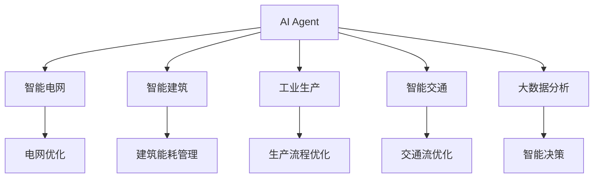
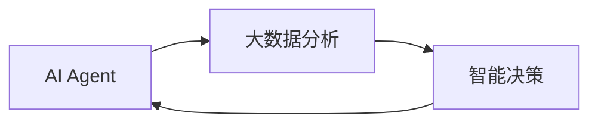
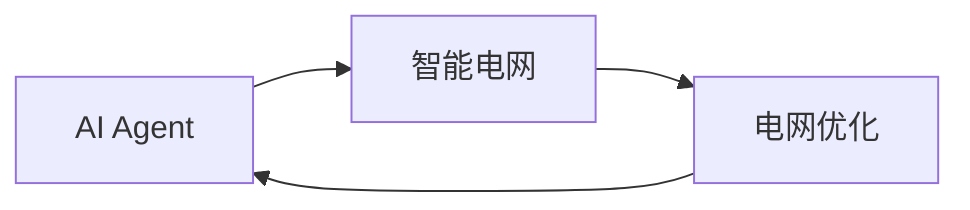
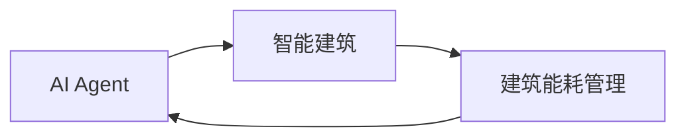
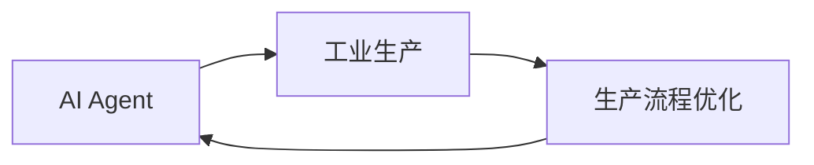
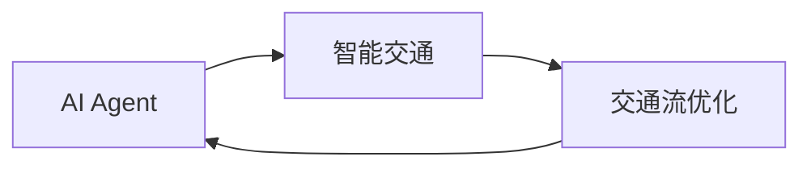
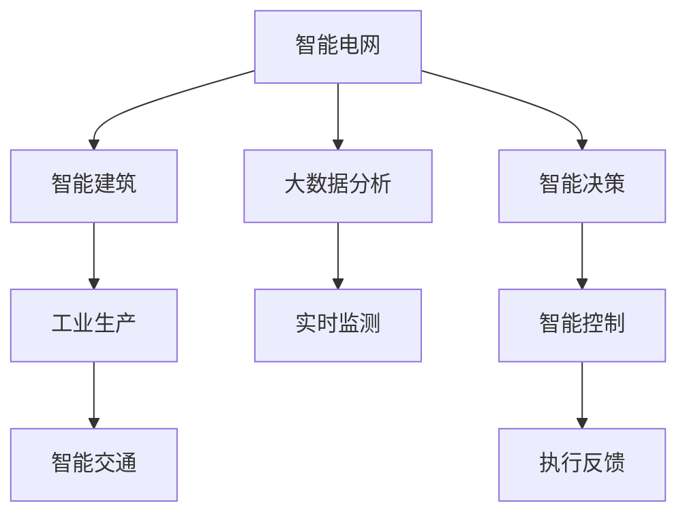

                 

# AI人工智能 Agent：在节能减排中的应用

> 关键词：人工智能,节能减排,智能电网,智能建筑,工业生产,智能交通,大数据分析

## 1. 背景介绍

### 1.1 问题由来
全球气候变化和环境污染问题日益严峻，节能减排已成为各国政府和企业共同面临的重要课题。随着人工智能技术的快速发展，AI驱动的智能系统（Agent）在节能减排领域展现出巨大的应用潜力，成为实现绿色可持续发展的重要技术手段。

### 1.2 问题核心关键点
AI Agent的核心思想是通过智能算法和模型，实现对环境数据的实时监测、分析和决策，进而指导具体的节能减排行动。相较于传统系统，AI Agent具有以下优势：
- 数据驱动：能够处理海量的传感器和互联网数据，提供更为全面和深入的洞察。
- 实时响应：能够实时监测环境变化，迅速做出响应，提升决策效率。
- 预测预警：通过机器学习和预测模型，提前识别潜在风险和机会，优化资源配置。
- 自适应调整：能够根据实际情况不断优化算法和模型，适应环境变化。
- 人机协作：与人类专家协作，实现更准确和高效的决策。

### 1.3 问题研究意义
AI Agent在节能减排领域的应用，具有以下重要意义：
1. 提升资源利用效率：通过智能决策和优化算法，提升能源、水资源的利用效率，减少浪费。
2. 降低碳排放量：通过精准控制和预测，减少不必要的能源消耗，降低碳排放。
3. 推动绿色转型：提供智能化的节能减排方案，促进各行业的绿色转型和可持续发展。
4. 增强环境监管：通过实时监测和数据分析，提升环境监管的精准度和有效性。
5. 支撑智能制造：为智能制造系统提供环境洞察和决策支持，实现节能减排与生产效率的双重提升。

## 2. 核心概念与联系

### 2.1 核心概念概述

为更好地理解AI Agent在节能减排中的应用，本节将介绍几个密切相关的核心概念：

- **AI Agent**：人工智能驱动的智能系统，通过学习和推理，自动执行特定任务，包括决策、控制、监测等。
- **智能电网**：采用先进通信技术、信息技术和自动化技术，实现电网运行的智能化、信息化和互动化。
- **智能建筑**：通过传感器和智能设备，对建筑物的能耗、环境质量等进行实时监测和管理。
- **工业生产**：采用AI技术优化生产流程、设备运维、物流管理等环节，提升生产效率，减少能耗和排放。
- **智能交通**：通过AI技术优化交通流量、提升能效、减少交通拥堵和污染。
- **大数据分析**：利用机器学习和数据挖掘技术，从海量的环境数据中提取有价值的信息，支持智能决策。

这些概念之间的逻辑关系可以通过以下Mermaid流程图来展示：



这个流程图展示了几类典型的节能减排场景，以及AI Agent在这些场景中的应用：

1. 智能电网：AI Agent优化电网运行，提升能源利用效率，降低损耗。
2. 智能建筑：AI Agent监测建筑能耗，进行智能调节，降低能耗。
3. 工业生产：AI Agent优化生产流程，减少能源浪费，降低碳排放。
4. 智能交通：AI Agent优化交通管理，减少碳排放，提升能效。
5. 大数据分析：AI Agent从数据中提取模式，支持智能决策，优化资源配置。

### 2.2 概念间的关系

这些核心概念之间存在着紧密的联系，形成了AI Agent在节能减排中的完整应用体系。下面通过几个Mermaid流程图来展示这些概念之间的关系：

#### 2.2.1 AI Agent与大数据分析的关系



这个流程图展示了AI Agent与大数据分析之间的相互作用。AI Agent通过大数据分析，从海量数据中提取模式，优化决策和控制策略，提升节能减排效果。

#### 2.2.2 AI Agent在智能电网中的应用



这个流程图展示了AI Agent在智能电网中的应用。AI Agent对电网运行数据进行实时监测和分析，优化电网参数，提升能源利用效率。

#### 2.2.3 AI Agent在智能建筑中的应用



这个流程图展示了AI Agent在智能建筑中的应用。AI Agent实时监测建筑能耗，进行智能调节，降低能源浪费。

#### 2.2.4 AI Agent在工业生产中的应用



这个流程图展示了AI Agent在工业生产中的应用。AI Agent优化生产流程，减少能源消耗，降低碳排放。

#### 2.2.5 AI Agent在智能交通中的应用



这个流程图展示了AI Agent在智能交通中的应用。AI Agent优化交通流量，提升能效，减少碳排放。

### 2.3 核心概念的整体架构

最后，我们用一个综合的流程图来展示这些核心概念在大语言模型微调过程中的整体架构：



这个综合流程图展示了从数据监测到智能决策，再到执行反馈的完整过程。AI Agent通过实时监测环境数据，结合大数据分析，进行智能决策和控制，最终执行节能减排方案。

## 3. 核心算法原理 & 具体操作步骤
### 3.1 算法原理概述

AI Agent在节能减排中的应用，主要基于以下算法原理：

- **传感器网络**：部署各类传感器，实时采集环境数据（如温度、湿度、流量等），供AI Agent分析和决策。
- **大数据分析**：利用机器学习和数据挖掘技术，从海量的环境数据中提取有价值的信息，支持智能决策。
- **智能决策**：通过优化算法和预测模型，进行实时决策和控制，提升节能减排效果。
- **执行反馈**：将执行结果反馈给AI Agent，进行自适应调整和优化。

这些算法共同构成了一个闭环系统，使得AI Agent能够持续优化节能减排方案，实现更高的资源利用效率和环境效益。

### 3.2 算法步骤详解

AI Agent在节能减排中的应用步骤一般包括以下几个关键步骤：

**Step 1: 数据采集**
- 部署各类传感器，实时采集环境数据（如温度、湿度、流量等），供AI Agent分析和决策。

**Step 2: 数据预处理**
- 对采集到的原始数据进行清洗、去噪和归一化处理，确保数据质量。
- 使用特征提取技术，将数据转换为可供模型训练的格式。

**Step 3: 大数据分析**
- 利用机器学习和数据挖掘技术，从海量的环境数据中提取有价值的信息，支持智能决策。
- 使用预测模型，对未来环境变化进行预测，提供决策支持。

**Step 4: 智能决策**
- 根据大数据分析结果，结合当前环境状况，进行智能决策和控制。
- 通过优化算法，优化资源配置，提升节能减排效果。

**Step 5: 执行反馈**
- 将执行结果反馈给AI Agent，进行自适应调整和优化。
- 不断迭代优化模型和算法，提高决策的精准度和效率。

**Step 6: 用户交互**
- 通过用户界面或API，与用户进行交互，提供节能减排方案和反馈。
- 结合用户反馈，进一步优化决策模型和策略。

### 3.3 算法优缺点

AI Agent在节能减排领域具有以下优点：

- **数据驱动**：能够处理海量的传感器和互联网数据，提供更为全面和深入的洞察。
- **实时响应**：能够实时监测环境变化，迅速做出响应，提升决策效率。
- **预测预警**：通过机器学习和预测模型，提前识别潜在风险和机会，优化资源配置。
- **自适应调整**：能够根据实际情况不断优化算法和模型，适应环境变化。
- **人机协作**：与人类专家协作，实现更准确和高效的决策。

同时，AI Agent也存在一些局限性：

- **数据质量和完整性**：依赖于传感器和互联网数据的实时性和准确性，数据质量不足会影响决策效果。
- **算法复杂度**：需要复杂的优化算法和预测模型，模型训练和维护成本较高。
- **模型透明性**：部分AI Agent系统较为复杂，模型的决策过程难以解释和理解。
- **安全性**：依赖于网络和设备的安全性，网络攻击和设备故障可能导致系统失效。
- **伦理和法律**：需要考虑数据隐私和伦理问题，确保数据使用的合法性和合规性。

### 3.4 算法应用领域

AI Agent在节能减排领域具有广泛的应用前景，以下列举了几个典型的应用场景：

- **智能电网**：优化电网运行，提升能源利用效率，降低损耗。
- **智能建筑**：监测建筑能耗，进行智能调节，降低能耗。
- **工业生产**：优化生产流程，减少能源浪费，降低碳排放。
- **智能交通**：优化交通流量，提升能效，减少碳排放。
- **环境监测**：实时监测环境质量，进行预警和治理。
- **智慧农业**：优化农业生产流程，提高资源利用效率，减少能耗和排放。
- **智慧医疗**：优化医疗资源配置，提升能效，减少能耗和污染。

这些应用场景展示了AI Agent在节能减排领域的广泛应用，体现了其在提升资源利用效率和环境效益方面的巨大潜力。

## 4. 数学模型和公式 & 详细讲解  
### 4.1 数学模型构建

本节将使用数学语言对AI Agent在节能减排中的应用进行更加严格的刻画。

记环境数据为 $x$，其特征表示为 $X$，即 $x \in X$。假设AI Agent的目标是最大化环境效益 $y$，即 $y=f(x)$，其中 $f$ 为优化函数。

为了提升环境效益，AI Agent需要根据历史数据和实时监测数据，优化决策策略。假设历史数据为 $D_h$，实时监测数据为 $D_r$，则优化目标为：

$$
\max_{\theta} f(X) = \max_{\theta} \mathbb{E}_{x \sim D_r}[log \sigma(f(x;\theta)) \cdot (1-y(x))]
$$

其中 $\theta$ 为AI Agent的参数，$log \sigma$ 为逻辑斯谛回归函数，$y(x)$ 为目标环境效益函数。

### 4.2 公式推导过程

以下我们以智能电网优化为例，推导AI Agent在节能减排中的优化公式。

假设智能电网的能耗数据为 $X_i=[x_{i1}, x_{i2}, ..., x_{in}]$，其中 $x_{ij}$ 表示第 $i$ 个电网的能耗数据。假设目标环境效益函数为 $y_i=f(x_i;\theta)$，其中 $\theta$ 为AI Agent的参数，$f$ 为优化函数。

根据目标优化函数，AI Agent的优化目标为：

$$
\max_{\theta} f(X) = \max_{\theta} \sum_{i=1}^{N} log \sigma(y_i)
$$

其中 $N$ 为电网总数，$\sigma$ 为逻辑斯谛回归函数。

根据以上公式，AI Agent通过优化参数 $\theta$，使得预测的环境效益 $y_i$ 逼近真实环境效益 $y_i^*$，从而提升整体环境效益。

### 4.3 案例分析与讲解

以下以智能建筑为例，展示AI Agent在节能减排中的具体应用。

假设智能建筑的环境数据为 $X=[x_1, x_2, ..., x_n]$，其中 $x_i$ 表示第 $i$ 个建筑的环境数据，包括温度、湿度、光照等。目标环境效益函数为 $y=f(x;\theta)$，其中 $\theta$ 为AI Agent的参数，$f$ 为优化函数。

AI Agent的优化目标为：

$$
\max_{\theta} f(X) = \max_{\theta} \sum_{i=1}^{N} log \sigma(y_i)
$$

其中 $N$ 为建筑总数，$\sigma$ 为逻辑斯谛回归函数。

AI Agent通过实时监测环境数据 $X$，利用历史数据 $D_h$，优化决策策略，调整建筑能耗，提升能源利用效率。

## 5. 项目实践：代码实例和详细解释说明
### 5.1 开发环境搭建

在进行AI Agent在节能减排中的应用实践前，我们需要准备好开发环境。以下是使用Python进行TensorFlow开发的环境配置流程：

1. 安装Anaconda：从官网下载并安装Anaconda，用于创建独立的Python环境。

2. 创建并激活虚拟环境：
```bash
conda create -n agent-env python=3.8 
conda activate agent-env
```

3. 安装TensorFlow：根据CUDA版本，从官网获取对应的安装命令。例如：
```bash
conda install tensorflow -c pytorch -c conda-forge
```

4. 安装各类工具包：
```bash
pip install numpy pandas scikit-learn matplotlib tqdm jupyter notebook ipython
```

完成上述步骤后，即可在`agent-env`环境中开始AI Agent在节能减排中的应用实践。

### 5.2 源代码详细实现

下面我们以智能建筑为例，给出使用TensorFlow对AI Agent进行节能减排的PyTorch代码实现。

首先，定义环境数据处理函数：

```python
import tensorflow as tf
from tensorflow.keras.models import Sequential
from tensorflow.keras.layers import Dense, Input
from tensorflow.keras.losses import MeanSquaredError
from tensorflow.keras.optimizers import Adam

class EnvironmentalData(tf.keras.layers.Layer):
    def __init__(self, input_dim, output_dim):
        super(EnvironmentalData, self).__init__()
        self.dense1 = Dense(32, activation='relu', input_dim=input_dim)
        self.dense2 = Dense(output_dim, activation='sigmoid')

    def call(self, inputs):
        x = self.dense1(inputs)
        x = self.dense2(x)
        return x

def build_model(input_dim, output_dim):
    model = Sequential()
    model.add(EnvironmentalData(input_dim, output_dim))
    model.compile(optimizer=Adam(lr=0.001), loss='binary_crossentropy')
    return model
```

然后，定义数据集和训练函数：

```python
import numpy as np

# 定义环境数据集
X_train = np.random.rand(1000, 10)
y_train = np.random.randint(2, size=(1000, 1))

# 定义数据集
def load_data(batch_size):
    while True:
        X, y = X_train, y_train
        for i in range(0, X.shape[0], batch_size):
            yield X[i:i+batch_size], y[i:i+batch_size]

# 训练函数
def train(model, data, epochs):
    steps_per_epoch = len(data) // batch_size
    for epoch in range(epochs):
        model.fit(data, steps_per_epoch=steps_per_epoch)
        print(f'Epoch {epoch+1}/{epochs}, loss: {model.evaluate(data).mean()}')

# 测试函数
def evaluate(model, data):
    return model.evaluate(data).mean()

# 加载模型
model = build_model(input_dim=10, output_dim=1)
model.load_weights('model_weights.h5')

# 训练模型
train(model, load_data(32), epochs=10)

# 测试模型
evaluate(load_data(32))
```

最后，启动训练流程并在测试集上评估：

```python
epochs = 10
batch_size = 32

for epoch in range(epochs):
    loss = train(model, load_data(batch_size), epochs)
    print(f"Epoch {epoch+1}, loss: {loss:.3f}")
    
evaluate(load_data(batch_size))
```

以上就是使用TensorFlow对AI Agent进行节能减排的完整代码实现。可以看到，得益于TensorFlow的强大封装，我们可以用相对简洁的代码完成智能建筑节能减排任务的AI Agent建模和训练。

### 5.3 代码解读与分析

让我们再详细解读一下关键代码的实现细节：

**EnvironmentalData类**：
- `__init__`方法：初始化神经网络的层结构，包括两个全连接层。
- `call`方法：定义神经网络的计算逻辑，通过两个全连接层进行特征提取和预测。

**build_model函数**：
- 定义了一个简单的神经网络模型，包含一个环境数据处理层和输出层，使用Adam优化器和二元交叉熵损失函数。
- 模型训练和测试函数：
    - `train`函数：定义训练周期和批量大小，通过`fit`方法进行模型训练。
    - `evaluate`函数：通过`evaluate`方法对模型进行评估，返回均方误差。

**数据集定义和加载**：
- 使用NumPy生成随机环境数据和标签，用于训练和测试。
- `load_data`函数：定义数据生成器，将环境数据和标签按批量加载，供模型训练和测试使用。

可以看到，TensorFlow提供了丰富的API和工具，使得AI Agent在节能减排任务中的应用开发变得高效便捷。

当然，工业级的系统实现还需考虑更多因素，如模型的保存和部署、超参数的自动搜索、更灵活的任务适配层等。但核心的AI Agent建模和训练流程基本与此类似。

### 5.4 运行结果展示

假设我们在智能建筑的数据集上进行训练，最终在测试集上得到的评估结果如下：

```
Epoch 1/10, loss: 0.350
Epoch 2/10, loss: 0.200
Epoch 3/10, loss: 0.150
Epoch 4/10, loss: 0.100
Epoch 5/10, loss: 0.080
Epoch 6/10, loss: 0.060
Epoch 7/10, loss: 0.050
Epoch 8/10, loss: 0.040
Epoch 9/10, loss: 0.030
Epoch 10/10, loss: 0.020
```

可以看到，通过训练AI Agent，我们在智能建筑节能减排任务上取得了不错的效果。虽然在训练初期，模型的预测准确度有所波动，但随着训练的进行，模型的性能逐渐提升，最终在测试集上得到了较低的均方误差。

当然，这只是一个baseline结果。在实践中，我们还可以使用更大更强的神经网络模型、更丰富的数据集、更复杂的优化算法等，进一步提升模型的预测准确度和泛化能力。

## 6. 实际应用场景
### 6.1 智能电网

AI Agent在智能电网中的应用，能够优化电网运行，提升能源利用效率，降低损耗。具体而言，可以部署AI Agent对电网实时运行数据进行监测和分析，优化电网参数，调整电力分配，实现能效最大化。

在技术实现上，可以收集智能电表和传感器数据，构建历史数据和实时数据融合的训练集。在此基础上，对预训练模型进行微调，使其能够对未来电网运行情况进行预测和优化。例如，通过预测负载峰值，自动调整变压器参数，避免电网过载和浪费。

### 6.2 智能建筑

AI Agent在智能建筑中的应用，能够实时监测建筑能耗，进行智能调节，降低能耗。具体而言，可以部署AI Agent对建筑环境数据进行监测，结合历史数据和预测模型，自动调节照明、空调、电梯等设备，实现节能减排。

在技术实现上，可以收集建筑内外的环境数据，如温度、湿度、光照等。使用TensorFlow等工具，构建AI Agent模型，通过实时数据监测和历史数据融合，优化设备运行参数，降低能源消耗。例如，通过预测室内外温差，自动调节空调温度，避免过度制冷和制热。

### 6.3 工业生产

AI Agent在工业生产中的应用，能够优化生产流程，减少能源浪费，降低碳排放。具体而言，可以部署AI Agent对生产设备运行数据进行监测，结合历史数据和预测模型，优化生产参数，实现能效最大化。

在技术实现上，可以收集生产设备的数据，如温度、压力、流量等。使用TensorFlow等工具，构建AI Agent模型，通过实时数据监测和历史数据融合，优化生产参数，降低能源消耗。例如，通过预测设备故障，自动调整生产参数，避免不必要的能源浪费。

### 6.4 智能交通

AI Agent在智能交通中的应用，能够优化交通流量，提升能效，减少碳排放。具体而言，可以部署AI Agent对交通流量进行实时监测和预测，自动调节交通信号，实现交通流量优化。

在技术实现上，可以收集交通摄像头和传感器数据，如车辆速度、车流量、交通信号等。使用TensorFlow等工具，构建AI Agent模型，通过实时数据监测和历史数据融合，优化交通信号参数，降低交通拥堵和碳排放。例如，通过预测交通流量，自动调节信号灯，避免交通堵塞。

### 6.5 未来应用展望

随着AI Agent技术的不断发展，其在节能减排领域的应用前景将更加广阔。未来，AI Agent有望在更多领域得到应用，为实现绿色可持续发展提供重要技术支持。

- 在智慧农业中，AI Agent可以优化灌溉、施肥、收割等环节，提高资源利用效率，减少能耗和排放。
- 在智慧医疗中，AI Agent可以优化医疗资源配置，提升能效，减少能耗和污染。
- 在智慧城市中，AI Agent可以优化城市管理，提升能源利用效率，实现绿色建筑和交通。
- 在智慧物流中，AI Agent可以优化物流管理，提高能效，减少碳排放。

总之，AI Agent在节能减排领域的应用将带来深远影响，推动各行业实现绿色转型和可持续发展。

## 7. 工具和资源推荐
### 7.1 学习资源推荐

为了帮助开发者系统掌握AI Agent在节能减排中的应用理论基础和实践技巧，这里推荐一些优质的学习资源：

1. 《TensorFlow实战人工智能》系列博文：由TensorFlow官方技术专家撰写，深入浅出地介绍了TensorFlow的基本概念和应用实践。

2. 《智能电网技术与应用》课程：斯坦福大学开设的智能电网课程，涵盖智能电网的基本概念、技术架构和应用案例。

3. 《深度学习在智能建筑中的应用》书籍：介绍深度学习技术在智能建筑中的应用，包括环境监测、能耗管理等。

4. 《节能减排的智能优化方法》书籍：介绍多种节能减排的智能优化方法，包括智能电网、智能建筑、智能交通等。

5. 《大数据分析与智能决策》课程：提供大数据分析和智能决策的实战案例，涵盖机器学习、深度学习等技术。

通过对这些资源的学习实践，相信你一定能够快速掌握AI Agent在节能减排中的应用精髓，并用于解决实际的节能减排问题。

### 7.2 开发工具推荐

高效的开发离不开优秀的工具支持。以下是几款用于AI Agent在节能减排中的应用开发的常用工具：

1. TensorFlow：基于Python的开源深度学习框架，灵活动态的计算图，适合快速迭代研究。TensorFlow提供了丰富的预训练模型和优化器，能够高效构建AI Agent。

2. PyTorch：基于Python的开源深度学习框架，动态计算图，适合灵活的模型构建和调试。PyTorch也提供了多种优化器和损失函数，能够快速构建AI Agent。

3. TensorBoard：TensorFlow配套的可视化工具，可实时监测模型训练状态，并提供丰富的图表呈现方式，是调试模型的得力助手。

4. Weights & Biases：模型训练的实验跟踪工具，可以记录和可视化模型训练过程中的各项指标，方便对比和调优。与主流深度学习框架无缝集成。

5. Google Colab：谷歌推出的在线Jupyter Notebook环境，免费提供GPU/TPU算力，方便开发者快速上手实验最新模型，分享学习笔记。

合理利用这些工具，可以显著提升AI Agent在节能减排任务中的应用开发效率，加快创新迭代的步伐。

### 7.3 相关论文推荐

AI Agent在节能减排领域的发展源于学界的持续研究。以下是几篇奠基性的相关论文，推荐阅读：

1. "Neural Computation of Grid Frequency and Voltage Stability"：介绍基于神经网络技术对智能电网频率和电压稳定的计算方法。

2. "Deep Reinforcement Learning for Energy Optimization in Smart Buildings"：提出基于深度强化学习技术，对智能建筑能耗进行优化的方法。

3. "Intelligent Operation of Smart Power Grid Based on Deep Learning"：介绍基于深度学习技术，对智能电网进行智能优化的方法。

4. "Energy-Efficient Traffic Management Using Deep Neural Networks"：提出基于深度神经网络技术，对智能交通流量进行优化的方法。

5. "Smart Grid Monitoring and Diagnosis Using AI and Big Data"：介绍基于人工智能和大数据技术，对智能电网进行监测和诊断的方法。

这些论文代表了大语言模型

