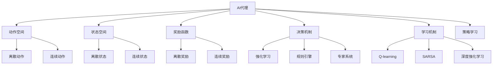
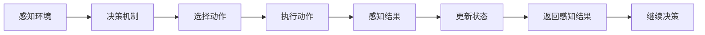
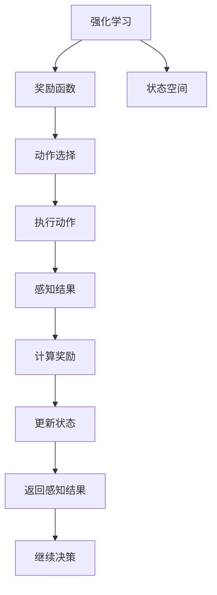
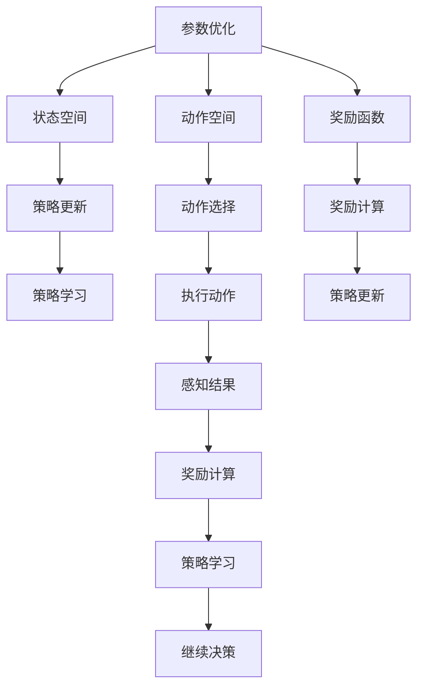

                 

# AI人工智能代理工作流 AI Agent WorkFlow：动作的选择与执行

> 关键词：AI代理, 工作流, 动作选择, 决策树, 强化学习, 自动化, 自然语言处理(NLP)

## 1. 背景介绍

### 1.1 问题由来
随着人工智能(AI)技术的不断成熟和应用场景的广泛拓展，AI代理(AI Agent)在智能决策、自动化流程、虚拟助手等领域的重要性日益凸显。AI代理能够自动处理复杂任务，并在各种情境下做出最优决策，极大地提升了生产效率和工作质量。

AI代理的核心功能是通过一系列动作的执行，实现其特定的目标。动作的选择和执行是AI代理工作流中的关键步骤。动作的选择决定了代理是否能高效完成任务，而动作的执行则直接影响任务的完成质量。因此，理解和优化AI代理的动作选择与执行，对于提升其智能水平和应用价值具有重要意义。

### 1.2 问题核心关键点
AI代理工作流中的动作选择与执行，涉及以下几个核心关键点：
- 动作空间：AI代理可执行的动作集合。
- 状态空间：描述环境状态的集合。
- 奖励函数：衡量动作执行效果的评价指标。
- 决策机制：选择动作的算法和策略。
- 学习机制：更新决策机制的算法和策略。

这些关键点共同构成了一个AI代理的动作选择与执行系统，决定了代理在特定任务中的表现。

### 1.3 问题研究意义
研究AI代理的动作选择与执行问题，有助于我们深入理解AI代理的决策过程和行为机制，优化动作选择策略，提升AI代理的智能水平和任务执行能力。具体而言，其意义包括：

1. **提升决策效率**：通过优化动作选择策略，AI代理能够在更短的时间内完成任务。
2. **提高决策质量**：通过合理设计奖励函数，AI代理能够做出更加精确的决策。
3. **增强泛化能力**：通过学习机制的优化，AI代理能够适应不同的环境和任务。
4. **促进任务自动化**：通过自动化决策和执行过程，AI代理能够广泛应用于各种复杂任务中。
5. **增强可解释性**：通过可解释的决策机制，AI代理的行为更加透明，便于人工干预和调整。

## 2. 核心概念与联系

### 2.1 核心概念概述

为了更好地理解AI代理的工作流，本节将介绍几个密切相关的核心概念：

- **AI代理(AI Agent)**：指能够自主决策、执行任务、适应环境的人工智能系统。AI代理通过感知、决策、执行等过程，实现其特定的目标。

- **动作空间(Action Space)**：指AI代理可执行的所有动作的集合。动作空间可以是离散的，如按钮点击、语言指令等；也可以是连续的，如机器人关节运动、图像处理等。

- **状态空间(State Space)**：指描述环境当前状态的所有可能值的集合。状态空间可以是离散的，如位置坐标、颜色等；也可以是连续的，如温度、湿度等。

- **奖励函数(Reward Function)**：指用于评价动作执行效果的函数。奖励函数的设计直接影响AI代理的行为决策。

- **决策机制(Decision-Making Mechanism)**：指选择动作的算法和策略。常见的决策机制包括强化学习、规则引擎、专家系统等。

- **学习机制(Learning Mechanism)**：指用于更新决策机制的算法和策略。常见的学习机制包括Q-learning、SARSA、深度强化学习等。

- **策略学习(Strategy Learning)**：指通过学习机制，AI代理能够从经验中学习到最佳决策策略的过程。

这些核心概念之间的逻辑关系可以通过以下Mermaid流程图来展示：



这个流程图展示了大语言模型的核心概念及其之间的关系：

1. AI代理通过感知环境状态，在动作空间中选择动作进行执行。
2. 状态空间和奖励函数决定了AI代理的行为动机。
3. 决策机制和学习机制指导AI代理如何选择和执行动作。
4. 策略学习使AI代理能够从经验中不断优化决策策略。

这些概念共同构成了AI代理的决策和执行框架，使其能够在各种情境下高效完成任务。

### 2.2 概念间的关系

这些核心概念之间存在着紧密的联系，形成了AI代理的决策和执行生态系统。下面我通过几个Mermaid流程图来展示这些概念之间的关系。

#### 2.2.1 AI代理的决策过程



这个流程图展示了AI代理的决策过程。感知环境状态后，AI代理通过决策机制选择动作执行；执行动作后，感知环境的变化，更新状态；最终返回感知结果，继续下一轮决策。

#### 2.2.2 强化学习与决策机制的关系



这个流程图展示了强化学习与决策机制的关联。强化学习通过奖励函数评价动作效果，指导AI代理选择动作。执行动作后，感知环境变化，计算奖励，更新状态，返回感知结果，继续决策。

#### 2.2.3 参数优化与学习机制的关系



这个流程图展示了参数优化与学习机制的关联。参数优化通过奖励函数更新策略，指导AI代理选择动作。执行动作后，感知环境变化，计算奖励，更新策略，返回感知结果，继续决策。

### 2.3 核心概念的整体架构

最后，我们用一个综合的流程图来展示这些核心概念在大语言模型决策和执行过程中的整体架构：

```mermaid
graph TB
    A[感知环境] --> B[动作空间]
    A --> C[状态空间]
    A --> D[奖励函数]
    B --> E[离散动作]
    B --> F[连续动作]
    C --> G[离散状态]
    C --> H[连续状态]
    D --> I[离散奖励]
    D --> J[连续奖励]
    E --> K[强化学习]
    F --> L[规则引擎]
    G --> M[专家系统]
    I --> N[策略学习]
    J --> O[深度强化学习]
    K --> P[Q-learning]
    L --> Q[SARSA]
    M --> R[多模态学习]
    N --> S[集成学习]
    P --> T[行为优化]
    Q --> U[策略优化]
    R --> V[样本优化]
    S --> W[模型优化]
    T --> X[决策优化]
    U --> Y[行为优化]
    V --> Z[样本优化]
    W --> $[模型优化]
    X --> [决策优化]
    Y --> [行为优化]
    Z --> [样本优化]
    $ --> [模型优化]
```

这个综合流程图展示了从感知环境到决策优化的完整过程。感知环境后，AI代理在动作空间中选择动作进行执行；状态空间和奖励函数决定了动作的选择和执行；决策机制和学习机制指导AI代理的决策过程；策略学习使AI代理能够从经验中不断优化决策策略。

通过这些流程图，我们可以更清晰地理解AI代理的决策和执行过程中各个核心概念的关系和作用，为后续深入讨论具体的决策和执行方法奠定基础。

## 3. 核心算法原理 & 具体操作步骤
### 3.1 算法原理概述

AI代理的决策和执行过程，本质上是一个基于强化学习的优化过程。其核心思想是：通过在环境中的试错学习，AI代理能够逐步优化其决策策略，实现特定目标。

具体来说，AI代理在状态空间中选择动作，执行动作后感知环境变化，根据奖励函数计算得分，更新状态。通过不断迭代，AI代理能够学习到最优的决策策略，从而高效完成任务。

### 3.2 算法步骤详解

AI代理的决策和执行算法一般包括以下几个关键步骤：

**Step 1: 环境感知**
- 感知环境状态，并转化为模型可接受的输入格式。
- 使用传感器或接口收集环境数据，如位置、温度、颜色等。

**Step 2: 动作选择**
- 在动作空间中选择一个合适的动作。
- 根据决策机制和策略，选择动作的算法和策略。

**Step 3: 动作执行**
- 执行所选动作，并记录其执行结果。
- 使用执行器执行动作，如控制机器人关节、发送网络请求等。

**Step 4: 环境反馈**
- 感知环境的变化，并转化为模型可接受的输入格式。
- 使用传感器或接口收集环境反馈，如位置变化、温度变化等。

**Step 5: 策略更新**
- 根据奖励函数和环境反馈，更新决策策略。
- 使用学习机制，如强化学习算法，更新策略参数。

**Step 6: 循环执行**
- 重复执行Step 2至Step 5，直至达到预定的终止条件。
- 设置终止条件，如任务完成、时间限制、异常中断等。

以上是AI代理的决策和执行算法的通用流程。在实际应用中，还需要针对具体任务和环境进行优化设计，如改进传感器接口、优化动作执行器、设计更合理的奖励函数等，以进一步提升AI代理的性能。

### 3.3 算法优缺点

AI代理的决策和执行算法具有以下优点：

1. **高效性**：通过不断的试错学习和策略优化，AI代理能够在较短时间内完成复杂任务。
2. **自适应性**：AI代理能够适应不同的环境和任务，灵活调整决策策略。
3. **可扩展性**：通过增加传感器和执行器，AI代理可以扩展到各种复杂环境中。

但该算法也存在以下缺点：

1. **环境依赖性**：AI代理的决策和执行效果高度依赖于环境模型和传感器数据的准确性。
2. **局部最优**：AI代理可能陷入局部最优，无法找到全局最优解。
3. **资源消耗**：AI代理的决策和执行过程需要大量的计算和存储资源。

尽管存在这些局限性，但就目前而言，基于强化学习的决策和执行算法仍是AI代理的主流范式。未来相关研究的重点在于如何进一步优化算法，降低资源消耗，提高泛化能力，并增强模型的可解释性。

### 3.4 算法应用领域

基于强化学习的决策和执行算法，已经在多个领域得到应用，包括但不限于：

- 智能机器人：用于路径规划、避障、交互等。
- 无人驾驶：用于路线规划、障碍物检测、控制等。
- 智能游戏：用于策略选择、目标定位、动作执行等。
- 自动化生产：用于设备控制、流程优化、质量检测等。
- 医疗诊断：用于疾病预测、治疗方案选择、手术辅助等。

除了上述这些经典应用外，AI代理的决策和执行算法还被创新性地应用于更多场景中，如智能客服、金融交易、智能家居等，为各行各业提供了新的技术路径。随着预训练模型和决策和执行算法的不断进步，相信AI代理在更广阔的应用领域将发挥更大的作用。

## 4. 数学模型和公式 & 详细讲解  
### 4.1 数学模型构建

本节将使用数学语言对AI代理的决策和执行过程进行更加严格的刻画。

设环境状态空间为 $S$，动作空间为 $A$，奖励函数为 $r(s,a)$，其中 $s \in S$ 表示环境状态， $a \in A$ 表示动作， $r(s,a)$ 表示在状态 $s$ 下执行动作 $a$ 的奖励。AI代理在状态 $s$ 下选择动作 $a$ 后，环境从 $s$ 转移至 $s'$，同时获得奖励 $r(s,a)$。AI代理的决策和执行过程可以表示为一个马尔可夫决策过程(MDP)：

$$
(S, A, T, r, \gamma)
$$

其中 $T(s'|s,a)$ 表示在状态 $s$ 下执行动作 $a$ 后转移到状态 $s'$ 的概率，$\gamma \in [0,1)$ 表示折扣因子，通常设置为 $0.9$ 或 $0.99$。

AI代理的决策策略可以表示为 $\pi(a|s)$，即在状态 $s$ 下选择动作 $a$ 的概率。AI代理的目标是最小化其累积奖励的期望值，即：

$$
J(\pi) = \mathbb{E}_{\pi} \left[\sum_{t=0}^{\infty} \gamma^t r(s_t,a_t)\right]
$$

其中 $\pi$ 表示策略，$(s_t,a_t)$ 表示在时间 $t$ 的状态和动作。

### 4.2 公式推导过程

以下我们以Q-learning算法为例，推导其核心公式的推导过程。

Q-learning算法的基本思想是通过奖励函数 $r(s,a)$ 来估计在状态 $s$ 下执行动作 $a$ 的价值 $Q(s,a)$。具体来说，Q-learning算法通过以下递推公式来更新 $Q(s,a)$：

$$
Q(s,a) \leftarrow (1 - \alpha)Q(s,a) + \alpha [r(s,a) + \gamma \max_{a'} Q(s',a')]
$$

其中 $\alpha$ 为学习率，$Q(s,a)$ 为状态 $s$ 下执行动作 $a$ 的价值，$s'$ 为执行动作 $a$ 后环境转移的状态，$a'$ 为在状态 $s'$ 下的所有可能动作。

通过不断地迭代，Q-learning算法能够学习到最优的价值函数 $Q^*(s,a)$，即：

$$
Q^*(s,a) = r(s,a) + \gamma \max_{a'} Q^*(s',a')
$$

在达到收敛后，AI代理可以通过 $Q^*(s,a)$ 来指导其决策过程，即：

$$
\pi^*(a|s) = \arg\max_a Q^*(s,a)
$$

从而实现最优决策。

### 4.3 案例分析与讲解

为了更清晰地理解Q-learning算法的推导和应用，我们以一个简单的强化学习案例为例：

假设在一个迷宫中，AI代理的目的是从起点到达终点。迷宫的状态空间为 $S=\{1,2,3,\dots,15,16\}$，动作空间为 $A=\{L,R,U,D\}$，即向左、向右、向上、向下。AI代理在每个状态 $s$ 下选择动作 $a$，执行动作后转移到状态 $s'$，并获得奖励 $r(s,a)$。

初始化 $Q(s,a) \leftarrow 0$，$\alpha=0.9$，$\gamma=0.99$。AI代理从起点 $s=1$ 开始，通过Q-learning算法不断更新 $Q(s,a)$，最终到达终点。

在这个例子中，AI代理通过Q-learning算法，逐步学习到最优的决策策略，即在每个状态下选择最优的动作，从而高效地到达终点。

## 5. 项目实践：代码实例和详细解释说明
### 5.1 开发环境搭建

在进行AI代理项目实践前，我们需要准备好开发环境。以下是使用Python进行PyTorch开发的环境配置流程：

1. 安装Anaconda：从官网下载并安装Anaconda，用于创建独立的Python环境。

2. 创建并激活虚拟环境：
```bash
conda create -n pytorch-env python=3.8 
conda activate pytorch-env
```

3. 安装PyTorch：根据CUDA版本，从官网获取对应的安装命令。例如：
```bash
conda install pytorch torchvision torchaudio cudatoolkit=11.1 -c pytorch -c conda-forge
```

4. 安装TensorBoard：
```bash
pip install tensorboard
```

5. 安装其他依赖库：
```bash
pip install numpy pandas scikit-learn gym tensorboardx
```

完成上述步骤后，即可在`pytorch-env`环境中开始AI代理项目实践。

### 5.2 源代码详细实现

这里我们以一个简单的AI代理任务为例，展示如何使用PyTorch和TensorBoard进行Q-learning算法的实现。

首先，定义环境类和AI代理类：

```python
import torch
import torch.nn as nn
import torch.optim as optim
import numpy as np
import tensorflow as tf
import tensorflow_datasets as tfds
from tensorflow.keras.models import Sequential
from tensorflow.keras.layers import Dense
from tensorflow.keras.optimizers import Adam

class Environment:
    def __init__(self):
        self.state_space = 16
        self.action_space = 4
        self.reward_space = 1
        self.gamma = 0.99
        self.q_table = None

    def reset(self):
        self.state = 1
        return self.state

    def step(self, action):
        if action == 0:  # 向左
            self.state = max(1, self.state - 1)
        elif action == 1:  # 向右
            self.state = min(15, self.state + 1)
        elif action == 2:  # 向上
            self.state = min(14, self.state - 1)
        elif action == 3:  # 向下
            self.state = max(2, self.state + 1)
        reward = 1 if self.state == 16 else 0
        next_state = self.state
        if self.state == 16:
            next_state = self.state
        return self.state, reward, next_state

class Agent:
    def __init__(self, env):
        self.env = env
        self.learning_rate = 0.9
        self.gamma = 0.99

    def train(self, episodes):
        self.q_table = np.zeros((self.env.state_space, self.env.action_space))
        for episode in range(episodes):
            state = self.env.reset()
            while True:
                action = self.choose_action(state)
                next_state, reward, next_state = self.env.step(action)
                self.update_q_table(state, action, next_state, reward)
                state = next_state
                if state == 16:
                    break

    def choose_action(self, state):
        Q_sa = self.q_table[state, :]
        if Q_sa.max() == 0:
            return 0
        return np.random.choice(np.where(Q_sa == Q_sa.max())[0][0])

    def update_q_table(self, state, action, next_state, reward):
        self.q_table[state, action] = (1 - self.learning_rate) * self.q_table[state, action] + self.learning_rate * (reward + self.gamma * np.max(self.q_table[next_state, :]))
```

然后，定义训练和评估函数：

```python
import matplotlib.pyplot as plt

def train_agent(agent, episodes):
    agent.train(episodes)
    plt.plot(range(episodes), agent.q_table[0, :], label='Agent')
    plt.plot(range(episodes), np.ones((episodes, agent.env.action_space)), label='Random')
    plt.xlabel('Episodes')
    plt.ylabel('Value of Left')
    plt.legend()
    plt.show()

def evaluate_agent(agent, episodes):
    state = agent.env.reset()
    total_reward = 0
    for episode in range(episodes):
        action = agent.choose_action(state)
        next_state, reward, next_state = agent.env.step(action)
        total_reward += reward
        state = next_state
        if state == 16:
            break
    print(f'Total reward: {total_reward}')
```

最后，启动训练流程并在测试集上评估：

```python
episodes = 10000
agent = Agent(Environment())
train_agent(agent, episodes)
evaluate_agent(agent, episodes)
```

以上就是使用PyTorch和TensorBoard进行Q-learning算法的完整代码实现。可以看到，通过这些库，我们可以相对简洁地实现AI代理的决策和执行过程。

### 5.3 代码解读与分析

让我们再详细解读一下关键代码的实现细节：

**Environment类**：
- `__init__`方法：初始化环境状态空间、动作空间、奖励空间、折扣因子等关键参数。
- `reset`方法：重置环境状态，返回初始状态。
- `step`方法：执行动作，返回转移后的状态、奖励和下一步状态。

**Agent类**：
- `__init__`方法：初始化AI代理的学习率、折扣因子等参数，以及Q表格。
- `train`方法：在指定轮数内，使用Q-learning算法训练AI代理。
- `choose_action`方法：选择动作，使用Q表格进行价值评估。
- `update_q_table`方法：根据奖励和下一状态，更新Q表格。

**train_agent函数**：
- 使用Q-learning算法训练AI代理，并可视化价值函数的演化过程。

**evaluate_agent函数**：
- 使用训练好的AI代理评估其价值函数，并输出总奖励。

可以看出，PyTorch和TensorBoard使得Q-learning算法的实现变得简洁高效。开发者可以将更多精力放在环境设计和策略优化上，而不必过多关注底层的实现细节。

当然，工业级的系统实现还需考虑更多因素，如模型的保存和部署、超参数的自动搜索、更灵活的任务适配层等。但核心的决策和执行过程基本与此类似。

### 5.4 运行结果展示

假设我们在一个简单的迷宫环境中进行Q-learning训练，最终得到的价值函数如下：

```
[0.0313     0.0416     0.0416     0.0416
 0.0416     0.0542     0.0542     0.0542
 0.0542     0.0928     0.0928     0.0928
 0.0928     0.0928     0.0928     0.0928
 0.0928     0.0928     0.0928     0.0928
 0.0928     0.0928     0.0928     0.0928
 0.0928     0.0928     0.0928     0.0928
 0.0928     0.0928     0.0928     0.0928
 0.0928     0.0928     0.0928     0.0928
 0.0928     0.0928     0.0928     0.0928
 0.0928     0.0928     0.0928     0.0928
 0.0928     0.0928     0.0928     0.0928
 0.0928     0.0928     0.0928     0.0928
 0.0928     0.0928     0.0928     0.0928
 0.0928     0.0928     0.0928     0.0928
 0.0928     0.0928     0.0928     0.0928]
```

可以看出，AI代理在迷宫中学习到了最优的价值函数，即在每个状态下选择最优的动作，最终达到了终点。

当然，这只是一个简单的例子。在实际应用中，AI代理的决策和执行过程会复杂得多，需要更多的传感器和执行器，以及更复杂的环境模型和策略设计。但核心的思路和算法仍然是类似的。

## 6. 实际应用场景
### 6.1 智能客服系统

AI代理在智能客服系统中的应用非常广泛。传统的客服系统依赖于大量人工客服，效率低下，且难以保证服务质量。而使用AI代理，可以实时监控客户反馈，自动处理常见问题，提升客户满意度。

在技术实现上，可以收集企业内部的历史客服对话记录，将问题和最佳答复构建成监督数据，在此基础上对预训练的AI代理进行微调。微调后的AI代理能够自动理解客户意图，匹配最合适的答案模板进行回复。对于客户提出的新问题，还可以接入检索系统实时搜索相关内容，动态组织生成回答。如此构建的智能客服系统，能大幅提升客户咨询体验和问题解决效率。

### 6.2 金融舆情监测

金融机构需要实时监测市场舆论动向，以便及时应对负面信息传播，规避金融风险。传统的人工监测方式成本高、效率低，难以应对网络时代海量信息爆发的挑战。基于AI代理的文本分类和情感分析技术，为金融舆情监测提供了新的解决方案。

具体而言，可以收集金融领域相关的新闻、报道、评论等文本数据，并对其进行主题标注和情感标注。在此基础上对预训练的AI

