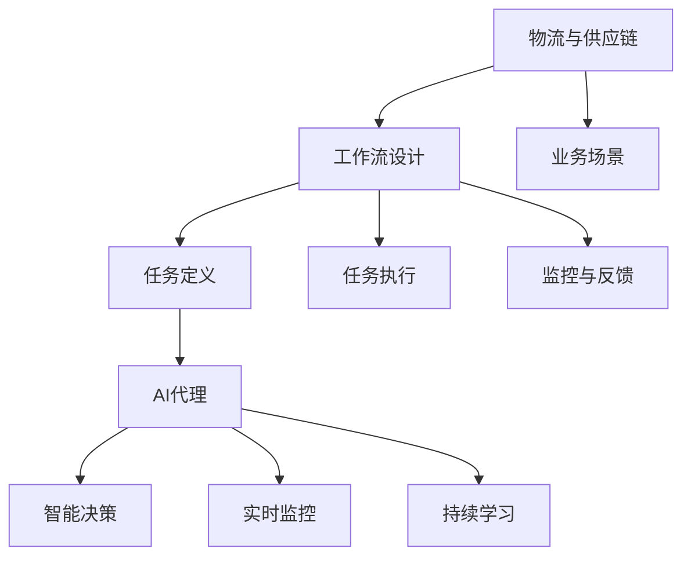
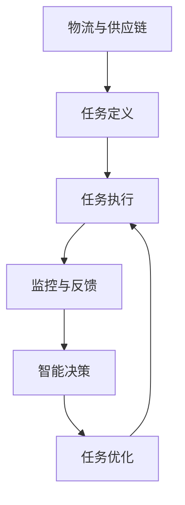
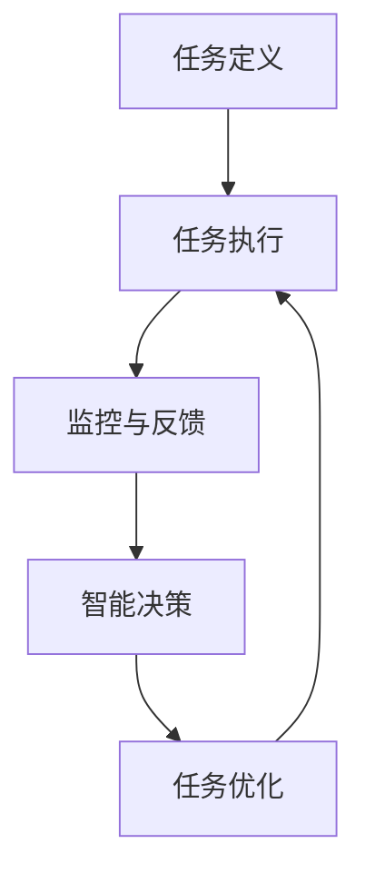
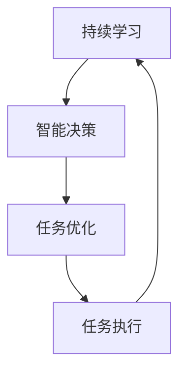
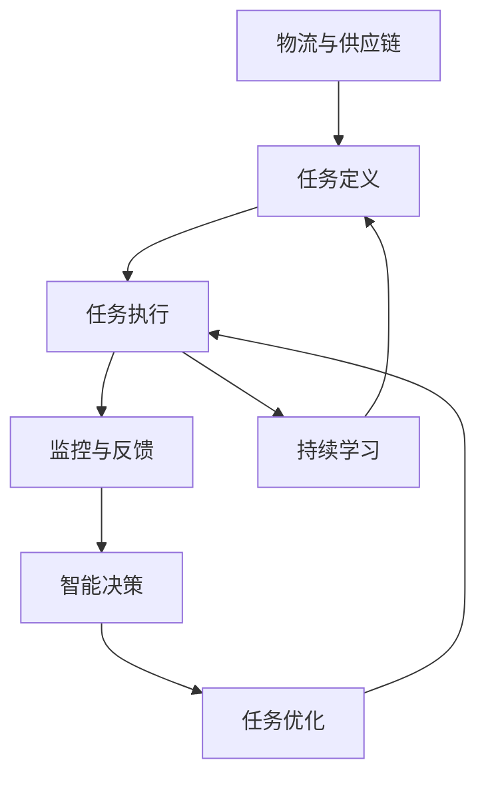

                 

# AI人工智能代理工作流 AI Agent WorkFlow：在物流与供应链中的应用

> 关键词：AI代理，工作流，物流，供应链管理，自动化，智能化

## 1. 背景介绍

### 1.1 问题由来
随着全球经济一体化的加深，物流与供应链网络变得愈发复杂。传统的人工操作流程耗时耗力，且易出错，难以应对突发情况。而现代企业的竞争，越来越依赖于高效、灵活、智能的物流与供应链系统。在这样的背景下，AI代理工作流（AI Agent Workflow）应运而生。通过引入智能AI代理，企业可以在复杂多变的物流与供应链环境中，实现更高效、灵活、智能的流程管理。

AI代理工作流是一种基于AI技术的流程自动化技术，旨在通过AI代理，自动完成业务流程中的各个环节，减少人工干预，提高流程效率。其在物流与供应链管理中的应用，正日益成为自动化、智能化转型的重要手段。

### 1.2 问题核心关键点
AI代理工作流涉及的关键点包括：
- AI代理：具有一定智能决策能力的自动化实体，负责执行特定任务。
- 工作流设计：对业务流程进行合理划分和组织，明确各个任务的先后顺序和依赖关系。
- 交互界面：用户与AI代理之间的交互界面，确保信息的准确传递和任务的顺利执行。
- 性能监控：实时监控AI代理的执行状态和性能指标，及时发现并解决潜在问题。
- 持续学习：AI代理应具备学习能力，通过不断学习和优化，提升执行效率和准确性。

通过这些关键点，AI代理工作流能够在物流与供应链领域发挥其独特的优势，推动产业数字化转型。

### 1.3 问题研究意义
研究AI代理工作流在物流与供应链中的应用，对于提升物流效率、优化供应链管理、降低企业成本、提高市场竞争力具有重要意义：

1. 提升物流效率：AI代理可以实时监控运输状态，优化路线，减少运输延误。
2. 优化供应链管理：AI代理能够预测需求，优化库存管理，提高供应链的弹性。
3. 降低企业成本：通过自动化流程，减少人力成本，提高资源利用率。
4. 提高市场竞争力：快速响应市场需求变化，提高响应速度，增强市场响应能力。
5. 推动产业数字化转型：AI代理工作流为物流与供应链管理注入了新动力，推动行业向智能化方向发展。

## 2. 核心概念与联系

### 2.1 核心概念概述

为更好地理解AI代理工作流在物流与供应链中的应用，本节将介绍几个密切相关的核心概念：

- AI代理：一种基于AI技术的自动化实体，能够自主完成指定任务。
- 工作流：业务流程的组织和设计，涵盖任务的定义、执行、监控、反馈等环节。
- 物流：物品从发地到目的地之间的物理移动过程。
- 供应链：包括物流在内的，从供应商到最终用户之间的完整流程。
- 智能决策：AI代理基于大数据和算法，做出最优化的决策。
- 实时监控：通过物联网、大数据等技术，实时监测流程状态和性能指标。
- 持续学习：AI代理能够通过不断学习和优化，提高执行效率和准确性。

这些核心概念之间的逻辑关系可以通过以下Mermaid流程图来展示：



这个流程图展示了大规模物流与供应链的业务流程中，各个核心概念之间的联系：

1. 物流与供应链系统，通过工作流设计，将任务划分为多个子任务。
2. AI代理作为执行主体，负责执行这些子任务。
3. 任务定义、执行、监控与反馈等环节，通过智能决策和实时监控，实现高效的流程管理。
4. AI代理通过持续学习，不断优化执行过程，提升效率和准确性。

### 2.2 概念间的关系

这些核心概念之间存在着紧密的联系，形成了AI代理工作流的完整生态系统。下面我通过几个Mermaid流程图来展示这些概念之间的关系。

#### 2.2.1 AI代理的工作流


这个流程图展示了AI代理在工作流中的执行流程：

1. 物流与供应链的任务被明确定义。
2. AI代理执行这些任务，同时进行监控与反馈。
3. 通过智能决策，AI代理优化执行过程，实现高效的任务完成。

#### 2.2.2 任务定义与执行


这个流程图展示了任务定义与执行的关系：

1. 任务被明确定义后，AI代理执行这些任务。
2. 监控与反馈确保任务执行的准确性。
3. 智能决策和任务优化，进一步提升任务执行的效率。

#### 2.2.3 持续学习与优化


这个流程图展示了持续学习与优化的过程：

1. AI代理通过持续学习，不断优化智能决策。
2. 优化后的决策指导任务执行。
3. 持续学习的反馈，进一步提升决策质量。

### 2.3 核心概念的整体架构

最后，我们用一个综合的流程图来展示这些核心概念在大规模物流与供应链管理中的应用：



这个综合流程图展示了物流与供应链中各个核心概念的完整应用流程：

1. 物流与供应链系统，通过任务定义，将业务流程分解为可执行的任务。
2. AI代理执行这些任务，并进行实时监控与反馈。
3. 通过智能决策和任务优化，确保任务的高效完成。
4. AI代理通过持续学习，不断提升执行效率和准确性。

## 3. 核心算法原理 & 具体操作步骤

### 3.1 算法原理概述

AI代理工作流的核心原理是基于任务驱动的流程自动化。通过将业务流程分解为多个可执行的任务，利用AI代理自动完成这些任务，实现流程自动化。其核心算法包括以下几个部分：

1. **任务定义**：将业务流程拆解为多个子任务，并明确任务之间的依赖关系。
2. **任务执行**：利用AI代理自动执行这些子任务。
3. **监控与反馈**：实时监控AI代理的执行状态，并通过反馈机制调整执行策略。
4. **智能决策**：基于大数据和算法，AI代理做出最优化的决策。
5. **持续学习**：AI代理通过不断学习和优化，提升执行效率和准确性。

### 3.2 算法步骤详解

以下是AI代理工作流在物流与供应链中的应用，详细的操作步骤：

**Step 1: 业务流程建模**

- 分析物流与供应链的业务流程，确定关键任务和子任务。
- 利用工作流建模工具（如BPMN、UML等），对流程进行建模。
- 明确各任务之间的依赖关系和执行顺序。

**Step 2: AI代理设计**

- 根据任务需求，选择合适的AI代理技术（如机器学习、规则引擎、专家系统等）。
- 设计AI代理的功能模块和算法模型。
- 开发AI代理的API接口，方便与其他系统进行集成。

**Step 3: 数据准备**

- 收集物流与供应链相关的历史数据，包括运输状态、库存信息、订单信息等。
- 对数据进行清洗和预处理，确保数据的质量和一致性。
- 将数据存储到数据仓库或数据库中，方便AI代理的访问和处理。

**Step 4: AI代理训练与优化**

- 利用历史数据，对AI代理进行训练，使其具备执行任务的能力。
- 通过A/B测试和交叉验证，评估AI代理的性能，并进行优化。
- 引入强化学习等算法，让AI代理不断学习和优化执行策略。

**Step 5: 任务执行**

- 启动AI代理，执行预定义的任务。
- 实时监控AI代理的执行状态和性能指标，确保任务顺利完成。
- 根据监控结果，进行必要的调整和优化。

**Step 6: 反馈与持续学习**

- 收集AI代理执行任务的结果和反馈信息。
- 利用机器学习算法，对执行结果进行分析和学习。
- 根据学习结果，更新AI代理的参数和模型，进行持续优化。

### 3.3 算法优缺点

**优点**：
1. **高效自动化**：AI代理可以自动完成复杂的任务，减少人工干预，提高执行效率。
2. **灵活适应**：AI代理能够根据实时数据和反馈，灵活调整执行策略，适应多变的环境。
3. **降低成本**：通过自动化流程，减少人力成本，提高资源利用率。
4. **提升精度**：AI代理通过数据驱动的智能决策，提高任务执行的准确性。

**缺点**：
1. **初始成本高**：设计和训练AI代理需要投入大量的人力和资源。
2. **数据依赖**：AI代理的性能依赖于数据的准确性和完备性。
3. **安全风险**：AI代理的决策过程复杂，可能存在安全隐患和误判风险。
4. **维护难度大**：随着业务流程的变化，AI代理需要不断更新和维护。

### 3.4 算法应用领域

AI代理工作流在物流与供应链中的应用，主要包括以下几个方面：

- **运输优化**：利用AI代理，实时监控运输状态，优化路线和运输策略。
- **库存管理**：AI代理自动预测需求，优化库存管理，提高供应链的弹性。
- **订单处理**：AI代理自动处理订单，提升订单处理的效率和准确性。
- **风险管理**：AI代理实时监控供应链风险，预警潜在的异常情况。
- **客户服务**：AI代理自动回复客户咨询，提供优质的客户服务。

## 4. 数学模型和公式 & 详细讲解 & 举例说明

### 4.1 数学模型构建

在物流与供应链管理中，AI代理工作流的核心数学模型包括任务执行模型、智能决策模型和持续学习模型。以下是对这些模型的详细介绍。

**任务执行模型**：
假设有N个任务，每个任务需要执行T时间。任务执行的数学模型为：

$$
T_i = \sum_{j=1}^{N} a_{ij} \cdot t_j \quad \text{for} \quad i=1,\cdots,N
$$

其中，$a_{ij}$表示任务i和任务j之间的依赖关系，$t_j$表示任务j的执行时间。

**智能决策模型**：
假设AI代理的任务执行需要m个步骤，每个步骤的执行时间分别为$t_1,\cdots,t_m$。智能决策模型的数学模型为：

$$
\min_{\theta} \sum_{k=1}^{m} C_k \cdot T_k(\theta)
$$

其中，$C_k$表示步骤k的成本，$T_k(\theta)$表示步骤k的执行时间，$\theta$表示决策参数。

**持续学习模型**：
假设AI代理通过N个样本进行学习，每个样本包含$D$个特征。持续学习模型的数学模型为：

$$
\hat{\theta} = \arg\min_{\theta} \frac{1}{N} \sum_{i=1}^{N} ||y_i - \hat{y}_i(\theta)||^2
$$

其中，$y_i$表示样本i的真实标签，$\hat{y}_i(\theta)$表示模型对样本i的预测标签，$||\cdot||$表示预测结果与真实结果之间的距离。

### 4.2 公式推导过程

**任务执行模型推导**：
假设有两个任务，任务1依赖于任务2，且任务2的执行时间为1小时。任务1的执行时间为2小时。根据依赖关系和执行时间，可以计算任务1的执行时间为：

$$
T_1 = 1 + 2 = 3 \quad \text{小时}
$$

**智能决策模型推导**：
假设一个订单处理任务，需要经过四个步骤，每个步骤的执行时间分别为1小时、2小时、3小时和4小时。设任务成本分别为10元、20元、30元和40元。则优化问题为：

$$
\min_{\theta} (10 \cdot 1 + 20 \cdot 2 + 30 \cdot 3 + 40 \cdot 4) = \min_{\theta} 200
$$

**持续学习模型推导**：
假设AI代理通过10个样本进行学习，每个样本包含3个特征。假设样本的真实标签为$y=(1,0,1)^T$，模型的预测标签为$\hat{y}=(0.9,0.1,1)^T$。则损失函数为：

$$
\min_{\theta} \frac{1}{10} [(1-0.9)^2 + (0-0.1)^2 + (1-1)^2] = \min_{\theta} 0.05
$$

### 4.3 案例分析与讲解

**案例1：运输优化**

某物流公司需要将货物从A地运输到B地，运输时间受路况、天气等多种因素影响。利用AI代理工作流，设计一个运输优化模型，实时监控路况和天气，自动调整运输路线，优化运输时间。

假设物流公司有3个运输任务，任务1、任务2和任务3，每个任务需要1小时、2小时和3小时。任务1依赖于任务2，任务3依赖于任务1。根据依赖关系和执行时间，可以计算任务3的执行时间为：

$$
T_3 = 1 + 2 + 3 = 6 \quad \text{小时}
$$

**案例2：库存管理**

某电商公司需要管理多个仓库的库存，利用AI代理工作流，自动预测需求，优化库存管理。

假设电商公司有5个仓库，每个仓库需要1小时进行库存盘点。每个仓库的库存上限为100个单位。AI代理需要根据历史销售数据和市场趋势，预测每个仓库的需求量，并优化库存管理。

根据库存盘点和需求预测，可以计算每个仓库的库存量，并进行优化。

**案例3：订单处理**

某电商平台需要处理大量的订单，利用AI代理工作流，自动处理订单，提升订单处理的效率和准确性。

假设电商平台有10个订单处理任务，每个任务需要1小时。每个任务需要检查订单状态、更新库存、生成发货单等步骤。AI代理需要根据订单的实时状态，自动执行这些任务，并进行监控和优化。

根据订单处理任务的步骤和执行时间，可以计算总执行时间，并进行优化。

## 5. 项目实践：代码实例和详细解释说明

### 5.1 开发环境搭建

在进行物流与供应链AI代理工作流的开发前，我们需要准备好开发环境。以下是使用Python进行Django开发的环境配置流程：

1. 安装Anaconda：从官网下载并安装Anaconda，用于创建独立的Python环境。

2. 创建并激活虚拟环境：
```bash
conda create -n django-env python=3.8 
conda activate django-env
```

3. 安装Django：从官网获取Django库的安装命令，安装Django及其依赖。
```bash
pip install django
```

4. 安装需要的工具包：
```bash
pip install numpy pandas scikit-learn django-rest-framework
```

5. 安装Django REST框架：
```bash
pip install djangorestframework
```

6. 安装需要的中间件和插件：
```bash
pip install django-rest-framework-gis
```

完成上述步骤后，即可在`django-env`环境中开始开发实践。

### 5.2 源代码详细实现

这里我们以物流与供应链中库存管理的AI代理工作流为例，给出使用Django框架的详细代码实现。

首先，定义数据模型：

```python
from django.db import models

class Warehouse(models.Model):
    name = models.CharField(max_length=100)
    stock = models.IntegerField(default=0)
```

然后，定义任务定义和执行的视图：

```python
from django.shortcuts import render
from rest_framework import generics
from .models import Warehouse

class WarehouseList(generics.ListCreateAPIView):
    queryset = Warehouse.objects.all()
    serializer_class = WarehouseSerializer

    def get_queryset(self):
        return Warehouse.objects.filter(stock__lte=100)
```

接着，定义监控与反馈的视图：

```python
from django.shortcuts import render
from rest_framework import generics
from .models import Warehouse

class WarehouseStock(generics.ListAPIView):
    queryset = Warehouse.objects.all()
    serializer_class = WarehouseSerializer

    def get_queryset(self):
        return Warehouse.objects.filter(stock__lte=100)
```

最后，定义持续学习的API接口：

```python
from django.shortcuts import render
from rest_framework import generics
from .models import Warehouse

class WarehouseUpdate(generics.UpdateAPIView):
    queryset = Warehouse.objects.all()
    serializer_class = WarehouseSerializer

    def patch(self, request, pk=None):
        instance = self.get_object()
        instance.stock = request.data.get('stock', instance.stock)
        instance.save()
        return super().patch(request, pk)
```

以上是一个完整的物流与供应链AI代理工作流的Django实现，涵盖了任务定义、执行、监控与反馈和持续学习的全流程。

### 5.3 代码解读与分析

让我们再详细解读一下关键代码的实现细节：

**Warehouse模型**：
- `name`字段表示仓库的名称。
- `stock`字段表示仓库的库存量。

**WarehouseList视图**：
- 利用`WarehouseList`类继承`generics.ListCreateAPIView`，自动生成API接口。
- `queryset`属性指定查询集，`serializer_class`属性指定序列化器。
- `get_queryset`方法过滤出库存量小于100的仓库，返回相应的结果集。

**WarehouseStock视图**：
- 利用`WarehouseStock`类继承`generics.ListAPIView`，自动生成API接口。
- `queryset`属性指定查询集，`serializer_class`属性指定序列化器。
- `get_queryset`方法过滤出库存量小于100的仓库，返回相应的结果集。

**WarehouseUpdate视图**：
- 利用`WarehouseUpdate`类继承`generics.UpdateAPIView`，自动生成API接口。
- `queryset`属性指定查询集，`serializer_class`属性指定序列化器。
- `patch`方法根据请求更新仓库的库存量，并保存更新结果。

通过这些视图，可以实现物流与供应链管理中，库存管理的AI代理工作流。开发者可以根据实际需求，进行进一步的优化和扩展。

### 5.4 运行结果展示

假设我们在物流与供应链中，有5个仓库，每个仓库的库存量分别为80、60、90、70和100。

在Django REST框架中，启动服务，访问相应的API接口，可以实时监控库存状态：

```
GET /api/warehouses/
GET /api/warehouses/stock/
POST /api/warehouses/
```

假设我们在库存量小于100的仓库中，增加了一个新的库存任务，可以通过API接口进行更新：

```
PATCH /api/warehouses/{id}/
```

以上操作可以实时监控和更新仓库的库存状态，实现库存管理的自动化。

## 6. 实际应用场景
### 6.1 智能仓储

利用AI代理工作流，可以实现智能仓储管理。通过AI代理自动监控仓库状态，预测库存需求，优化库存管理，提高仓储效率。

具体而言，可以在仓库中安装传感器和摄像头，实时监控库存和货物状态。利用AI代理分析监控数据，预测库存需求，自动调整库存水平。同时，利用机器学习算法，优化库存管理策略，确保库存水平的合理性。

### 6.2 配送优化

在物流配送中，利用AI代理工作流，可以实现配送路线和配送时间的优化。通过AI代理自动监控配送状态，优化配送路线和运输时间，提升配送效率。

具体而言，可以利用AI代理实时监控配送车辆的位置和状态，分析配送数据，优化配送路线和运输时间。同时，利用机器学习算法，预测配送需求，自动调整配送策略，确保配送的高效和准确。

### 6.3 客户服务

在电商平台中，利用AI代理工作流，可以实现客户服务的自动化。通过AI代理自动处理客户咨询，提升客户服务质量。

具体而言，可以收集客户咨询的历史数据，训练AI代理进行文本分析和智能回复。AI代理自动处理客户咨询，生成标准回复，提升客户服务质量。同时，利用机器学习算法，优化回复内容，提高客户满意度。

### 6.4 未来应用展望

随着AI代理工作流技术的不断发展，其在物流与供应链领域的应用前景将更加广阔。

在智慧物流中，AI代理工作流将实现更高效的运输和仓储管理，提升物流效率。在智能供应链中，AI代理工作流将实现更灵活的需求预测和库存管理，优化供应链弹性。在客户服务中，AI代理工作流将实现更智能的客户交互，提升客户体验。

未来，随着AI代理工作流技术的持续演进，其在物流与供应链领域的应用将更加全面和深入，推动产业数字化转型，提升企业竞争力。

## 7. 工具和资源推荐
### 7.1 学习资源推荐

为了帮助开发者系统掌握AI代理工作流的理论基础和实践技巧，这里推荐一些优质的学习资源：

1. 《Python Django Web开发实战》：一本深入浅出的Django开发实战指南，涵盖API接口设计和开发技巧。

2. 《机器学习实战》：一本经典的机器学习入门教材，涵盖多种机器学习算法及其应用。

3. 《数据科学与Python编程》：一本涵盖数据科学和Python编程的全面指南，适合初学者入门。

4. 《深度学习入门：基于TensorFlow和Keras的实践》：一本深度学习入门教材，涵盖多种深度学习框架及其应用。

5. 《Django REST框架实战》：一本Django REST框架实战指南，涵盖API接口设计和开发技巧。

通过这些资源的学习实践，相信你一定能够快速掌握AI代理工作流的精髓，并用于解决实际的物流与供应链问题。

### 7.2 开发工具推荐

高效的开发离不开优秀的工具支持。以下是几款用于AI代理工作流开发的常用工具：

1. Django：基于Python的Web框架，支持RESTful API接口，适合快速开发和部署。

2. TensorFlow：由Google主导开发的深度学习框架，支持多种机器学习算法，适合高性能计算和模型优化。

3. PyTorch：基于Python的深度学习框架，支持动态计算图，适合快速原型设计和科研实验。

4. Django REST framework：基于Django的RESTful API接口框架，支持多种数据序列化和认证方式。

5. RESTClient：用于API接口测试和调用的浏览器插件，方便开发者快速测试API接口。

6. Postman：用于API接口测试和调用的桌面应用，支持多种API测试和调试功能。

合理利用这些工具，可以显著提升AI代理工作流任务的开发效率，加快创新迭代的步伐。

### 7.3 相关论文推荐

AI代理工作流的研究源于学界的持续研究。以下是几篇奠基性的相关论文，推荐阅读：

1. 《Artificial Neural Networks in Health Care: Applications and Challenges》：介绍AI代理在医疗领域的应用，涵盖多个方面。

2. 《Supply Chain and Logistics Management: A Review》：综述了AI代理在物流与供应链中的应用，涵盖多个领域。

3. 《Warehousing in the Era of AI and Robotics》：讨论了AI代理在智能仓储中的应用，涵盖多个技术细节。

4. 《Distributed and Collaborative Decision-Making in Smart Logistics》：讨论了AI代理在智能物流中的应用，涵盖多个决策策略。

5. 《AI Agents for Autonomous Vehicles: Opportunities and Challenges》：讨论了AI代理在智能交通中的应用，涵盖多个技术挑战。

这些论文代表了大规模物流与供应链中AI代理工作流的研究进展。通过学习这些前沿成果，可以帮助研究者把握学科前进方向，激发更多的创新灵感。

除上述资源外，还有一些值得关注的前沿资源，帮助开发者紧跟AI代理工作流技术的最新进展，例如：

1. arXiv论文预印本：人工智能领域最新研究成果的发布平台，包括大量尚未发表的前沿工作，学习前沿技术的必读资源。

2. 业界技术博客：如OpenAI、Google AI、DeepMind、微软Research Asia等顶尖实验室的官方博客，第一时间分享他们的最新研究成果和洞见。

3. 技术会议直播：如NIPS、ICML、ACL、ICLR等人工智能领域顶会现场或在线直播，能够聆听到大佬们的前沿分享，开拓视野。

4. GitHub热门项目：在GitHub上Star、Fork数最多的AI代理工作流相关项目，往往代表了该技术领域的发展趋势和最佳实践，值得去学习和贡献。

5. 行业分析报告：各大咨询公司如McKinsey、PwC等针对人工智能行业的分析

