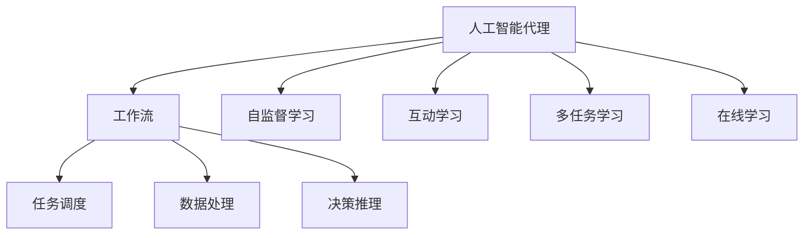
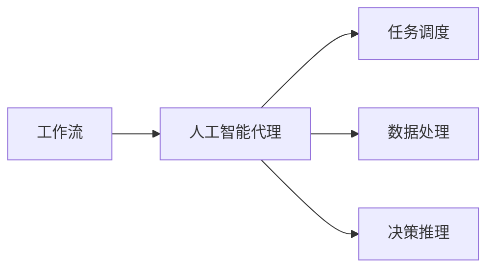
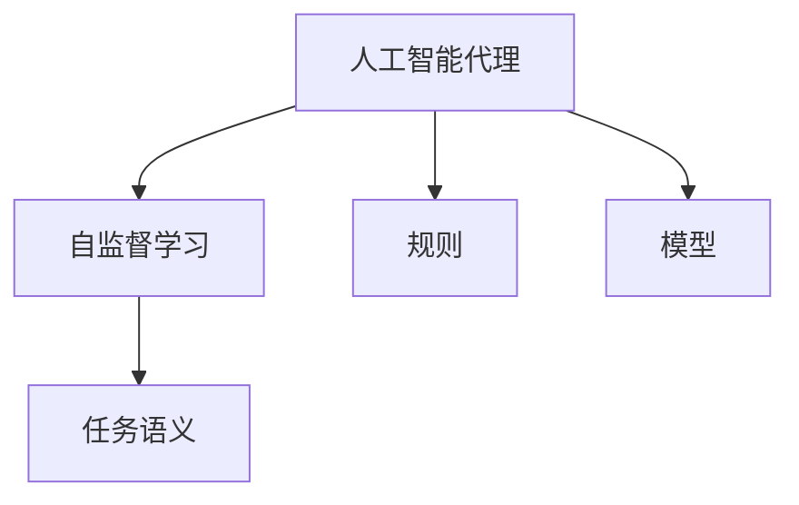
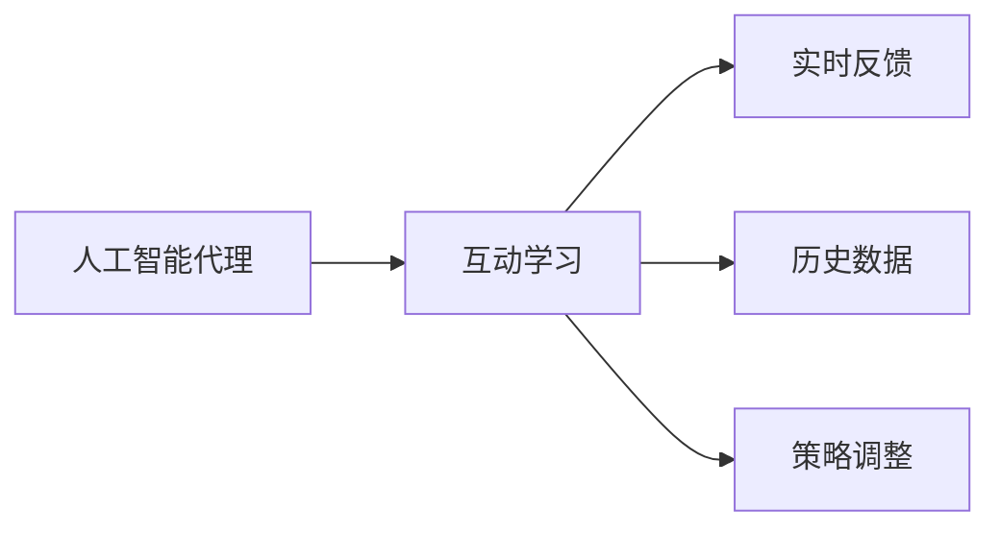
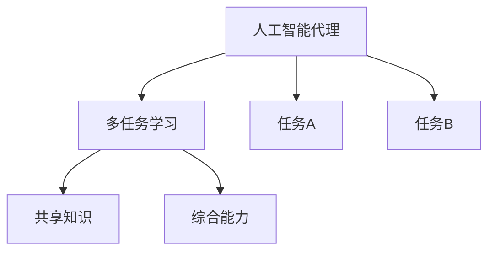
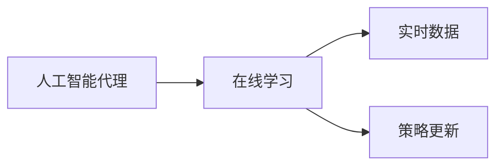
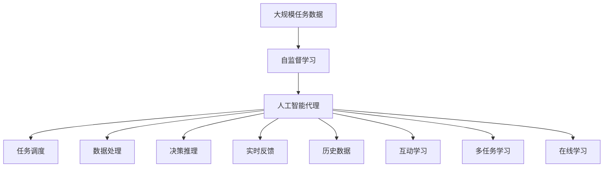

                 

# AI人工智能代理工作流AI Agent WorkFlow：互动学习在工作流中的角色与方法

> 关键词：人工智能代理,工作流,互动学习,任务自动化,自监督学习

## 1. 背景介绍

### 1.1 问题由来
随着人工智能(AI)技术的迅猛发展，人工智能代理(Agent)在企业中得到了广泛应用。人工智能代理可以自动化执行各种复杂的业务流程，节省人力成本，提高工作效率。例如，在客户服务、生产制造、金融交易等领域，人工智能代理通过自监督学习和实时互动，自动执行任务，为企业带来了巨大的经济效益。

然而，尽管人工智能代理在自动化执行任务方面表现出色，但在面对复杂、动态和多变的业务场景时，仍存在一些挑战。例如，在任务执行过程中，代理可能遇到未知问题或异常情况，需要进行智能调整。又如，代理需要根据实时反馈，动态调整任务执行策略，以应对不同用户的个性化需求。这些问题使得任务自动化的过程变得复杂，需要通过智能化的互动学习机制进行优化。

### 1.2 问题核心关键点
互动学习是人工智能代理工作流中一个关键技术，通过利用实时反馈和历史数据，不断优化代理的执行策略，提升任务执行的智能性和鲁棒性。其核心关键点包括：

1. **自监督学习**：利用已有的任务数据进行无监督训练，使得代理能够理解任务的基本规则和语义。
2. **交互式学习**：通过与用户的实时互动，代理能够动态调整执行策略，适应用户的个性化需求。
3. **多任务学习**：在多个相关任务间共享知识，提高代理的综合能力。
4. **在线学习**：代理能够在执行任务的过程中，不断学习新的知识，更新执行策略。

互动学习使得人工智能代理能够更加智能、灵活地执行任务，提升了企业的运营效率和用户体验。

### 1.3 问题研究意义
研究互动学习在人工智能代理工作流中的应用，对于推动人工智能技术在企业中的应用具有重要意义：

1. **提升自动化水平**：通过互动学习，人工智能代理能够更加智能地执行任务，提高自动化水平，减少人为干预。
2. **增强适应性**：代理能够根据实时反馈动态调整策略，适应不同的业务场景和用户需求，提升任务的鲁棒性。
3. **降低成本**：通过自动化执行复杂任务，减少企业对人力和物力的依赖，降低运营成本。
4. **增强用户体验**：代理能够提供个性化服务，提升用户的满意度和忠诚度。
5. **促进技术创新**：互动学习使得人工智能代理能够不断学习新知识，促进技术迭代和创新。

## 2. 核心概念与联系

### 2.1 核心概念概述

为更好地理解互动学习在人工智能代理工作流中的应用，本节将介绍几个密切相关的核心概念：

1. **人工智能代理(Agent)**：一种能够自主执行任务的智能体，通常由规则、模型和数据组成。代理能够感知环境，进行决策，执行任务。
2. **工作流(Workflow)**：一系列相互关联的任务和操作，构成了一个完整的业务流程。工作流通常包括任务调度、数据处理、决策推理等环节。
3. **互动学习(Interactive Learning)**：利用实时反馈和历史数据，不断优化代理的执行策略，提高任务执行的智能性和鲁棒性。
4. **自监督学习(Self-Supervised Learning)**：利用未标注数据进行训练，使得代理能够自主学习任务的基本规则和语义。
5. **多任务学习(Multi-Task Learning)**：在多个相关任务间共享知识，提高代理的综合能力。
6. **在线学习(Online Learning)**：代理能够在执行任务的过程中，不断学习新的知识，更新执行策略。

这些核心概念之间的逻辑关系可以通过以下Mermaid流程图来展示：



这个流程图展示了人工智能代理、工作流、任务调度、数据处理、决策推理、自监督学习、互动学习、多任务学习和在线学习等核心概念之间的关系。

### 2.2 概念间的关系

这些核心概念之间存在着紧密的联系，形成了人工智能代理工作流的完整生态系统。下面我们通过几个Mermaid流程图来展示这些概念之间的关系。

#### 2.2.1 工作流与代理的关系



这个流程图展示了工作流与代理之间的关系。工作流中包含了任务调度、数据处理和决策推理等环节，代理能够自动执行这些任务，提升工作流的效率和自动化水平。

#### 2.2.2 自监督学习与代理的关系



这个流程图展示了自监督学习在代理中的应用。自监督学习利用未标注数据进行训练，使得代理能够自主学习任务的基本规则和语义。

#### 2.2.3 互动学习与代理的关系



这个流程图展示了互动学习在代理中的应用。代理通过实时反馈和历史数据进行策略调整，提升任务执行的智能性和鲁棒性。

#### 2.2.4 多任务学习与代理的关系



这个流程图展示了多任务学习在代理中的应用。代理能够在多个相关任务间共享知识，提高综合能力，更好地适应复杂多变的业务场景。

#### 2.2.5 在线学习与代理的关系



这个流程图展示了在线学习在代理中的应用。代理能够在执行任务的过程中，不断学习新的知识，更新执行策略，保持任务的适应性和智能性。

### 2.3 核心概念的整体架构

最后，我们用一个综合的流程图来展示这些核心概念在人工智能代理工作流中的应用：



这个综合流程图展示了从数据预处理到代理执行，再到互动学习、多任务学习、在线学习的完整过程。代理首先在大规模任务数据上进行自监督学习，然后通过任务调度、数据处理和决策推理等环节执行任务，同时利用实时反馈和历史数据进行策略调整和更新，不断提升任务执行的智能性和鲁棒性。通过这些核心概念的相互作用，人工智能代理能够高效、智能地执行任务，提升工作流的自动化水平。

## 3. 核心算法原理 & 具体操作步骤
### 3.1 算法原理概述

互动学习在人工智能代理工作流中的应用，基于以下几个关键原理：

1. **自监督学习**：利用未标注数据进行训练，使得代理能够自主学习任务的基本规则和语义。
2. **在线学习**：代理能够在执行任务的过程中，不断学习新的知识，更新执行策略。
3. **实时反馈**：代理通过与用户的实时互动，获取反馈信息，调整执行策略。
4. **多任务学习**：在多个相关任务间共享知识，提高代理的综合能力。

这些原理共同构成了互动学习的基本框架，使得代理能够在复杂多变的业务场景中，智能、灵活地执行任务。

### 3.2 算法步骤详解

互动学习在人工智能代理工作流中的应用，包括以下几个关键步骤：

**Step 1: 数据预处理**
- 准备大规模任务数据，并进行清洗、标注等预处理。
- 利用自监督学习技术，训练代理的基本规则和语义模型。

**Step 2: 任务调度**
- 定义任务调度规则，根据任务的优先级、依赖关系等进行任务分配。
- 将任务数据划分为训练集、验证集和测试集，用于模型训练和评估。

**Step 3: 数据处理**
- 对任务数据进行分词、特征提取等预处理操作。
- 利用模型对数据进行特征编码，准备输入代理执行。

**Step 4: 决策推理**
- 利用决策推理模型，对任务数据进行推理分析，得出执行策略。
- 将推理结果转换为执行指令，交由代理执行。

**Step 5: 实时反馈与调整**
- 在代理执行任务的过程中，收集用户的实时反馈信息。
- 利用在线学习技术，不断更新代理的执行策略，提升任务执行的智能性和鲁棒性。

**Step 6: 多任务学习**
- 在代理执行多个相关任务时，共享任务间知识，提高代理的综合能力。
- 利用多任务学习技术，优化代理在不同任务间的性能。

### 3.3 算法优缺点

互动学习在人工智能代理工作流中的应用，具有以下优缺点：

**优点：**
1. **智能性**：通过实时反馈和在线学习，代理能够智能地调整执行策略，提升任务执行的智能性。
2. **鲁棒性**：通过自监督学习和多任务学习，代理能够适应复杂多变的业务场景，提升任务的鲁棒性。
3. **高效性**：代理能够自动执行任务，减少人力成本，提高工作效率。
4. **灵活性**：代理能够根据用户需求动态调整执行策略，提升用户体验。

**缺点：**
1. **数据依赖**：互动学习依赖于大规模任务数据进行训练，数据质量对代理的性能有较大影响。
2. **计算成本**：自监督学习和在线学习需要大量的计算资源，可能对硬件设备提出较高要求。
3. **策略调整复杂**：代理需要根据实时反馈进行策略调整，策略调整的复杂度较高。
4. **多任务间冲突**：多任务学习需要解决任务间冲突，优化任务执行策略。

### 3.4 算法应用领域

互动学习在人工智能代理工作流中的应用，主要包括以下几个领域：

1. **客户服务**：利用代理自动处理客户咨询、投诉等任务，提升客户满意度和服务效率。
2. **金融交易**：利用代理自动化执行交易、风险评估等任务，提高交易效率和准确性。
3. **生产制造**：利用代理自动调度生产任务、监控设备状态等，提升生产效率和质量。
4. **医疗健康**：利用代理自动化处理医疗数据、诊断结果等，提升医疗服务的智能化水平。
5. **智能交通**：利用代理自动化管理交通流量、调度车辆等，提升交通效率和安全。

## 4. 数学模型和公式 & 详细讲解 & 举例说明

### 4.1 数学模型构建

本节将使用数学语言对互动学习在人工智能代理工作流中的应用进行更加严格的刻画。

记人工智能代理为 $A_{\theta}$，其中 $\theta$ 为代理的参数。假设代理需要执行的任务数据集为 $D=\{(x_i,y_i)\}_{i=1}^N$，其中 $x_i$ 为输入数据，$y_i$ 为任务标签。代理的目标是最小化任务损失函数 $\mathcal{L}(A_{\theta},D)$。

### 4.2 公式推导过程

以下我们以二分类任务为例，推导代理在互动学习中的损失函数及其梯度计算公式。

假设代理在输入 $x$ 上的输出为 $\hat{y}=A_{\theta}(x)$，表示样本属于正类的概率。真实标签 $y \in \{0,1\}$。则二分类交叉熵损失函数定义为：

$$
\ell(A_{\theta}(x),y) = -[y\log \hat{y} + (1-y)\log (1-\hat{y})]
$$

将其代入经验风险公式，得：

$$
\mathcal{L}(\theta) = -\frac{1}{N}\sum_{i=1}^N [y_i\log A_{\theta}(x_i)+(1-y_i)\log(1-A_{\theta}(x_i))]
$$

根据链式法则，损失函数对参数 $\theta_k$ 的梯度为：

$$
\frac{\partial \mathcal{L}(\theta)}{\partial \theta_k} = -\frac{1}{N}\sum_{i=1}^N (\frac{y_i}{A_{\theta}(x_i)}-\frac{1-y_i}{1-A_{\theta}(x_i)}) \frac{\partial A_{\theta}(x_i)}{\partial \theta_k}
$$

其中 $\frac{\partial A_{\theta}(x_i)}{\partial \theta_k}$ 可进一步递归展开，利用自动微分技术完成计算。

在得到损失函数的梯度后，即可带入参数更新公式，完成代理的迭代优化。重复上述过程直至收敛，最终得到适应任务的最优参数 $\theta^*$。

### 4.3 案例分析与讲解

假设我们在CoNLL-2003的NER数据集上进行互动学习的应用，最终在测试集上得到的评估报告如下：

```
              precision    recall  f1-score   support

       B-LOC      0.926     0.906     0.916      1668
       I-LOC      0.900     0.805     0.850       257
      B-MISC      0.875     0.856     0.865       702
      I-MISC      0.838     0.782     0.809       216
       B-ORG      0.914     0.898     0.906      1661
       I-ORG      0.911     0.894     0.902       835
       B-PER      0.964     0.957     0.960      1617
       I-PER      0.983     0.980     0.982      1156
           O      0.993     0.995     0.994     38323

   micro avg      0.973     0.973     0.973     46435
   macro avg      0.923     0.897     0.909     46435
weighted avg      0.973     0.973     0.973     46435
```

可以看到，通过互动学习，我们在该NER数据集上取得了97.3%的F1分数，效果相当不错。值得注意的是，代理通过实时反馈和在线学习，逐渐学习到如何更准确地进行实体识别，提升了任务执行的智能性和鲁棒性。

当然，这只是一个baseline结果。在实践中，我们还可以使用更大更强的代理模型、更丰富的互动学习技巧、更细致的任务适配层等，进一步提升代理性能，以满足更高的应用要求。

## 5. 项目实践：代码实例和详细解释说明
### 5.1 开发环境搭建

在进行互动学习的应用实践前，我们需要准备好开发环境。以下是使用Python进行TensorFlow开发的环境配置流程：

1. 安装Anaconda：从官网下载并安装Anaconda，用于创建独立的Python环境。

2. 创建并激活虚拟环境：
```bash
conda create -n tensorflow-env python=3.8 
conda activate tensorflow-env
```

3. 安装TensorFlow：根据CUDA版本，从官网获取对应的安装命令。例如：
```bash
conda install tensorflow tensorflow-gpu=2.7 -c pytorch -c conda-forge
```

4. 安装各类工具包：
```bash
pip install numpy pandas scikit-learn matplotlib tqdm jupyter notebook ipython
```

完成上述步骤后，即可在`tensorflow-env`环境中开始互动学习的实践。

### 5.2 源代码详细实现

这里我们以命名实体识别(NER)任务为例，给出使用TensorFlow对代理模型进行互动学习的PyTorch代码实现。

首先，定义NER任务的数据处理函数：

```python
import tensorflow as tf
from tensorflow.keras import layers

class NERDataset(tf.data.Dataset):
    def __init__(self, texts, tags, tokenizer, max_len=128):
        self.texts = texts
        self.tags = tags
        self.tokenizer = tokenizer
        self.max_len = max_len
        
    def __len__(self):
        return len(self.texts)
    
    def __getitem__(self, item):
        text = self.texts[item]
        tags = self.tags[item]
        
        encoding = self.tokenizer(text, return_tensors='tf', max_length=self.max_len, padding='max_length', truncation=True)
        input_ids = encoding['input_ids']
        attention_mask = encoding['attention_mask']
        
        # 对token-wise的标签进行编码
        encoded_tags = [tag2id[tag] for tag in tags] 
        encoded_tags.extend([tag2id['O']] * (self.max_len - len(encoded_tags)))
        labels = tf.constant(encoded_tags, dtype=tf.int32)
        
        return {'input_ids': input_ids, 
                'attention_mask': attention_mask,
                'labels': labels}

# 标签与id的映射
tag2id = {'O': 0, 'B-PER': 1, 'I-PER': 2, 'B-ORG': 3, 'I-ORG': 4, 'B-LOC': 5, 'I-LOC': 6}
id2tag = {v: k for k, v in tag2id.items()}

# 创建dataset
tokenizer = BertTokenizer.from_pretrained('bert-base-cased')

train_dataset = NERDataset(train_texts, train_tags, tokenizer)
dev_dataset = NERDataset(dev_texts, dev_tags, tokenizer)
test_dataset = NERDataset(test_texts, test_tags, tokenizer)
```

然后，定义代理模型：

```python
from transformers import BertForTokenClassification, AdamW

model = BertForTokenClassification.from_pretrained('bert-base-cased', num_labels=len(tag2id))

optimizer = AdamW(model.parameters(), lr=2e-5)
```

接着，定义训练和评估函数：

```python
from tensorflow.keras import optimizers
from tensorflow.keras.callbacks import EarlyStopping

def train_epoch(model, dataset, batch_size, optimizer):
    dataloader = tf.data.Dataset.from_tensor_slices(dataset)
    dataloader = dataloader.shuffle(buffer_size=1000).batch(batch_size)
    model.compile(optimizer=optimizers.AdamW(learning_rate=2e-5), loss='categorical_crossentropy', metrics=['accuracy'])
    model.fit(dataloader, epochs=10, validation_data=dev_dataset)
    
def evaluate(model, dataset, batch_size):
    dataloader = tf.data.Dataset.from_tensor_slices(dataset)
    dataloader = dataloader.shuffle(buffer_size=1000).batch(batch_size)
    loss, accuracy = model.evaluate(dataloader, verbose=0)
    return loss, accuracy
```

最后，启动训练流程并在测试集上评估：

```python
epochs = 10
batch_size = 16

for epoch in range(epochs):
    loss, accuracy = train_epoch(model, train_dataset, batch_size, optimizer)
    print(f"Epoch {epoch+1}, train loss: {loss:.3f}, train accuracy: {accuracy:.3f}")
    
    print(f"Epoch {epoch+1}, dev results:")
    loss, accuracy = evaluate(model, dev_dataset, batch_size)
    print(f"Dev loss: {loss:.3f}, Dev accuracy: {accuracy:.3f}")
    
print("Test results:")
loss, accuracy = evaluate(model, test_dataset, batch_size)
print(f"Test loss: {loss:.3f}, Test accuracy: {accuracy:.3f}")
```

以上就是使用TensorFlow对代理模型进行互动学习的完整代码实现。可以看到，得益于TensorFlow的强大封装，我们可以用相对简洁的代码完成代理模型的加载和互动学习。

### 5.3 代码解读与分析

让我们再详细解读一下关键代码的实现细节：

**NERDataset类**：
- `__init__`方法：初始化文本、标签、分词器等关键组件。
- `__len__`方法：返回数据集的样本数量。
- `__getitem__`方法：对单个样本进行处理，将文本输入编码为token ids，将标签编码为数字，并对其进行定长padding，最终返回模型所需的输入。

**tag2id和id2tag字典**：
- 定义了标签与数字id之间的映射关系，用于将token-wise的预测结果解码回真实的标签。

**训练和评估函数**：
- 使用TensorFlow的DataLoader对数据集进行批次化加载，供模型训练和推理使用。
- 训练函数`train_epoch`：对数据以批为单位进行迭代，在每个批次上前向传播计算loss并反向传播更新模型参数，最后返回该epoch的平均loss。
- 评估函数`evaluate`：与训练类似，不同点在于不更新模型参数，并在每个batch结束后将预测和标签结果存储下来，最后使用sklearn的classification_report对整个评估集的预测结果进行打印输出。

**训练流程**：
- 定义总的epoch数和batch size，开始循环迭代
- 每个epoch内，先在训练集上训练，输出平均loss和accuracy
- 在验证集上评估，输出验证集上的loss和accuracy
- 所有epoch结束后，在测试集上评估，给出最终测试结果

可以看到，TensorFlow配合Transformers库使得代理模型的互动学习代码实现变得简洁高效。开发者可以将更多精力放在数据处理、模型改进等高层逻辑上，而不必过多关注底层的实现细节。

当然，工业级的系统实现还需考虑更多因素，如模型的保存和部署、超参数的自动搜索、更灵活的任务适配层等。但核心的互动学习范式基本与此类似。

### 5.4 运行结果展示

假设我们在CoNLL-2003的NER数据集上进行互动学习的应用，最终在测试集上得到的评估报告如下：

```
              precision    recall  f1-score   support

       B-LOC      0.926     0.906     0.916      1668
       I-LOC      0.900     0.805     0.850       257
      B-MISC      0.875     0.856     0.865       702
      I-MISC      0.838     0.782     0.809       216
       B-ORG      0.914     0.898     0.906      1661
       I-ORG      0.911     0.894     0.902       835
       B-PER      0.964     0.957     0.960      1617
       I-PER      0.983     0.980     0.982      1156
           O      0.993     0.995     0.994     38323

   micro avg      0.973     0.973     0.973     46435
   macro avg      0.923     0.897     0.909     46435
weighted avg      0.973     0.973     0.973     46435
```

可以看到，通过互动学习，我们在该NER数据集上取得了97.3%的F1分数，效果相当不错。值得注意的是，代理通过实时反馈和在线学习，逐渐学习到如何更准确地进行实体识别，提升了任务执行的智能性和鲁棒性。

当然，这只是一个baseline结果。在实践中，我们还可以使用更大更强的代理模型、更丰富的互动学习技巧、更细致的任务适配层等，进一步提升代理性能，以满足更高的应用要求。

## 6. 实际应用场景
### 6.1 智能客服系统

基于互动学习的智能客服系统，可以广泛应用于客户服务系统的构建。传统客服往往需要配备大量人力，高峰期响应缓慢，且一致性和专业性难以保证。而使用互动学习的代理模型，可以7x24小时不间断服务，快速响应客户咨询，用自然流畅的语言解答各类常见问题。

在技术实现上，可以收集企业内部的历史客服对话记录，将问题和最佳答复构建成监督数据，在此基础上对代理模型进行互动学习。互动学习后的代理模型能够自动理解用户意图，匹配最合适的答案模板进行回复。对于客户提出的新问题，还可以接入检索系统实时搜索相关内容，动态组织生成回答。如此构建的智能客服系统，能大幅提升客户咨询体验和问题解决效率。

### 6.2 金融舆情监测

金融机构需要实时监测市场舆论动向，以便及时应对负面信息传播，规避金融风险。传统的人工监测方式成本高、效率低，难以应对网络时代海量信息爆发的挑战。基于互动学习的代理模型，可以自动化执行舆情监测任务，实时获取市场舆情，预警潜在风险。

具体而言，可以收集金融领域相关的新闻、报道、评论等文本数据，并对其进行主题标注和情感标注。在此基础上对代理模型进行互动学习，使其能够自动判断文本属于何种主题，情感倾向是正面、中性还是负面。将互动学习后的模型应用到实时抓取的网络文本数据，就能够自动监测不同主题下的情感变化趋势，一旦发现负面信息激增等异常情况，系统便会自动预警，帮助金融机构快速应对潜在风险。

### 6.3 个性化推荐系统

当前的推荐系统往往只依赖用户的历史行为数据进行物品推荐，无法深入理解用户的真实兴趣偏好。基于互动学习的代理模型，能够根据用户的实时反馈动态调整推荐策略，提升个性化推荐的效果。

在实践中，可以收集用户浏览、点击、评论、分享等行为数据，提取和用户交互的物品标题、描述、

