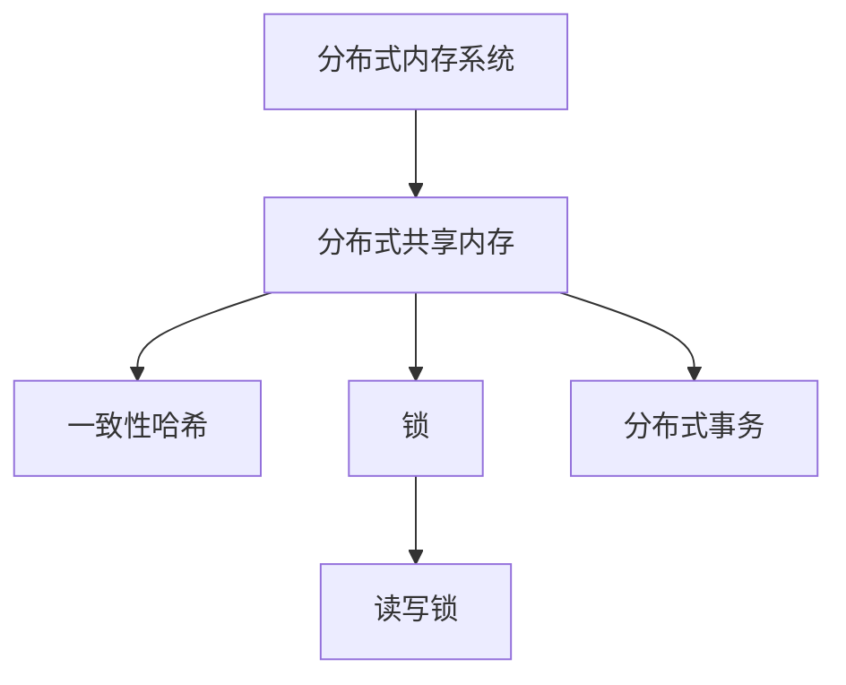
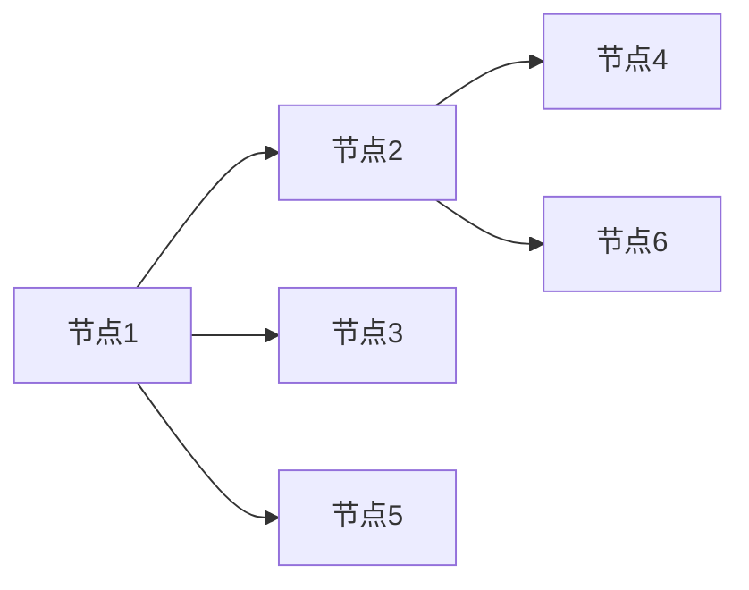
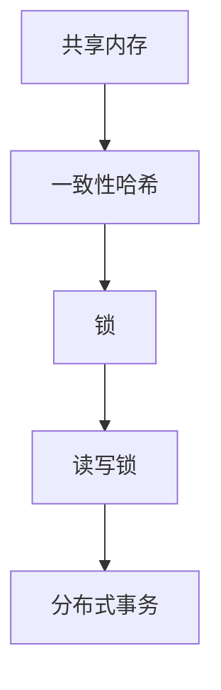
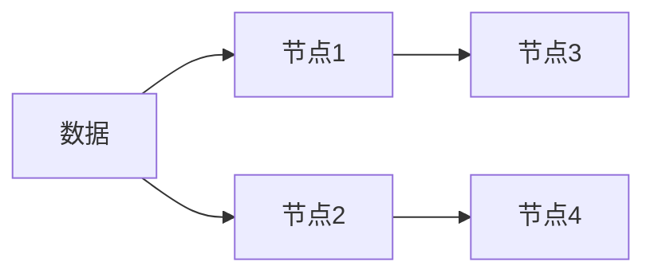

                 

# AI人工智能代理工作流AI Agent WorkFlow：分布式·AI代理的同步与数据共享

> 关键词：AI代理,分布式,同步,数据共享,云计算,机器学习,自然语言处理,NLP

## 1. 背景介绍

### 1.1 问题由来
随着人工智能(AI)技术的发展，AI代理(AI Agents)在各个领域的应用变得越来越广泛。AI代理可以自动化地执行任务，智能地与人类交互，并在分布式系统中协同工作。在分布式AI系统中，多个AI代理之间需要通过同步和数据共享来协同完成任务，这已经成为一种基础需求。

然而，传统的数据同步和共享方法往往存在以下问题：
- 数据一致性难以保证。在分布式系统中，多个代理同时修改同一份数据时，容易发生数据冲突和丢失。
- 通信开销过大。数据同步和共享需要频繁地进行网络通信，消耗大量的时间和资源。
- 扩展性差。随着系统规模的增大，同步和共享的复杂度呈指数级增长，难以应对大规模分布式系统的需求。

因此，如何实现高效、可靠、可扩展的数据同步和共享，是分布式AI系统中一个重要且挑战性的问题。本文将详细介绍基于分布式内存系统的数据同步和共享机制，以及相关算法和技术，以期为分布式AI系统的开发和应用提供有益的参考。

### 1.2 问题核心关键点
分布式AI系统中数据同步和共享的核心问题包括以下几个方面：

- 分布式数据存储：如何在分布式系统中高效存储和访问数据，同时保证数据一致性和可靠性？
- 数据同步机制：如何设计数据同步机制，使得多个代理能够协同工作并保证数据一致性？
- 数据共享策略：如何设计数据共享策略，使得各代理能够按需访问共享数据，同时避免数据冗余和冲突？
- 故障恢复机制：如何设计故障恢复机制，确保系统在故障发生后能够迅速恢复数据同步和共享的正常运行？

这些关键问题，直接决定了分布式AI系统的性能和可靠性。

### 1.3 问题研究意义
研究基于分布式内存系统的数据同步和共享机制，对于提高分布式AI系统的性能和可靠性具有重要意义：

1. 提升系统性能。高效的同步和共享机制可以显著降低系统通信开销，提高系统吞吐量。
2. 增强系统可靠性。一致性和冗余机制可以保证系统在故障发生后快速恢复，保持数据一致性。
3. 提高系统可扩展性。分布式内存系统支持横向扩展，可以满足大规模分布式系统的需求。
4. 优化资源利用率。通过合理的数据共享和存储策略，可以减少数据冗余，提高系统资源利用率。
5. 支持多模态数据融合。分布式内存系统支持多种数据类型的融合，为多模态数据的协同分析提供了基础。

这些因素综合起来，将大大提升分布式AI系统的应用效果和用户体验。因此，深入研究分布式内存系统中的数据同步和共享问题，具有重要的理论和实际意义。

## 2. 核心概念与联系

### 2.1 核心概念概述

为更好地理解基于分布式内存系统的数据同步和共享机制，本节将介绍几个关键概念：

- 分布式内存系统(Distributed Memory System)：由多个处理器通过高速互连网络相互连接，共享全局地址空间和数据存储系统。常见的分布式内存系统包括Hadoop、Spark、Flink等。
- 分布式共享内存(Distributed Shared Memory, DSM)：多个处理器共享同一份内存，可以直接访问共享数据，提高数据访问效率。
- 一致性哈希(Consistent Hashing)：一种用于分布式系统中的哈希算法，可以将数据均匀地分配到多个节点上，并动态调整节点分配，以适应节点变化。
- 锁(Lock)：一种同步机制，用于控制多个线程或进程对共享数据的访问，避免数据冲突和竞争。
- 读写锁(Read-Write Lock)：一种特殊的锁机制，允许多个线程同时读取共享数据，但只允许一个线程进行写入操作。
- 分布式事务(Distributed Transaction)：一组互斥的读写操作，保证数据一致性和可靠性。

这些核心概念之间通过以下Mermaid流程图来展示它们之间的关系：



这个流程图展示了一些关键概念之间的关系：

1. 分布式内存系统是基础架构，提供分布式共享内存支持。
2. 分布式共享内存通过一致性哈希和锁机制，实现数据同步和共享。
3. 读写锁是锁机制的扩展，允许多个线程进行读操作，减少锁竞争。
4. 分布式事务是一组互斥操作，保证数据一致性。

这些概念共同构成了分布式内存系统中数据同步和共享的基础框架。

### 2.2 概念间的关系

这些核心概念之间存在着紧密的联系，形成了分布式内存系统中的数据同步和共享生态系统。下面我们通过几个Mermaid流程图来展示这些概念之间的关系。

#### 2.2.1 分布式内存系统架构



这个流程图展示了分布式内存系统的基本架构，节点之间通过高速网络互连，共享全局地址空间和数据存储。

#### 2.2.2 分布式共享内存实现



这个流程图展示了分布式共享内存的实现过程，通过一致性哈希和锁机制，实现数据的分布式存储和同步。

#### 2.2.3 一致性哈希算法



这个流程图展示了一致性哈希的基本原理，将数据均匀分配到多个节点上，以实现高效的数据访问和同步。

### 2.3 核心概念的整体架构

最后，我们用一个综合的流程图来展示这些核心概念在分布式内存系统中的整体架构：


这个综合流程图展示了从分布式内存系统到分布式共享内存的实现过程，以及一致性哈希、锁、读写锁和分布式事务等关键机制的协同工作。通过这些机制，分布式内存系统能够高效地实现数据的同步和共享，支撑大规模分布式AI系统的运行。

## 3. 核心算法原理 & 具体操作步骤
### 3.1 算法原理概述

基于分布式内存系统的数据同步和共享机制，主要包括以下几个关键算法：

- 一致性哈希算法：用于将数据均匀地分配到多个节点上，并动态调整节点分配，以适应节点变化。
- 分布式锁算法：用于控制多个线程或进程对共享数据的访问，避免数据冲突和竞争。
- 读写锁算法：一种特殊的锁机制，允许多个线程同时读取共享数据，但只允许一个线程进行写入操作。
- 分布式事务算法：一组互斥的读写操作，保证数据一致性和可靠性。

这些算法共同构成了分布式内存系统中数据同步和共享的核心机制，使得多个AI代理能够协同工作，实现高效、可靠的数据访问和处理。

### 3.2 算法步骤详解

以下是基于一致性哈希和分布式锁的分布式数据同步和共享算法的主要步骤：

1. **数据分配与一致性哈希**：
   - 将所有数据均匀地分配到多个节点上。
   - 使用一致性哈希算法，将数据映射到对应的节点上。
   - 当节点数量发生变化时，重新计算一致性哈希，动态调整数据分配。

2. **锁机制与分布式锁**：
   - 在多个代理之间使用锁机制，控制对共享数据的访问。
   - 使用分布式锁算法，确保多个代理同时访问同一份数据时，只有一个代理可以进行写操作，其他代理只能进行读操作。
   - 分布式锁可以采用基于etcd或zookeeper的分布式锁机制，或采用基于数据库的分布式锁机制。

3. **读写锁与读写分离**：
   - 使用读写锁算法，允许多个代理同时读取共享数据，但只允许一个代理进行写入操作。
   - 通过读写分离，提高系统并发性能，减少锁竞争。
   - 读写锁可以采用基于互斥锁或信号量的分布式读写锁机制。

4. **分布式事务与ACID特性**：
   - 使用分布式事务算法，确保多个代理之间的读写操作互斥进行，保证数据一致性和可靠性。
   - 分布式事务可以采用两阶段提交协议，确保事务在多个节点上的原子性操作。
   - 分布式事务可以采用基于数据库的分布式事务机制，或采用基于消息队列的分布式事务机制。

### 3.3 算法优缺点

一致性哈希算法的主要优点包括：
- 能够将数据均匀地分配到多个节点上，避免数据热点。
- 支持动态节点调整，适应系统变化。

一致性哈希算法的主要缺点包括：
- 在节点数量较少时，数据分配不均匀。
- 在大规模数据集上，一致性哈希的计算开销较大。

分布式锁算法的主要优点包括：
- 能够保证对共享数据的互斥访问，避免数据冲突。
- 支持分布式部署，适应大规模系统需求。

分布式锁算法的主要缺点包括：
- 在大规模系统中，分布式锁的通信开销较大。
- 分布式锁的实现复杂，容易出现死锁等问题。

读写锁算法的主要优点包括：
- 允许多个代理同时读取共享数据，提高系统并发性能。
- 减少锁竞争，降低锁开销。

读写锁算法的主要缺点包括：
- 写入操作需要等待锁释放，可能会降低系统性能。
- 实现复杂，需要考虑锁粒度和锁竞争等问题。

分布式事务算法的主要优点包括：
- 能够保证数据的ACID特性，保证数据一致性和可靠性。
- 支持分布式部署，适应大规模系统需求。

分布式事务算法的主要缺点包括：
- 在大规模系统中，事务管理开销较大。
- 实现复杂，容易出现事务异常等问题。

### 3.4 算法应用领域

基于一致性哈希和分布式锁的分布式数据同步和共享算法，已经在分布式内存系统中得到了广泛的应用，主要包括以下几个领域：

- 分布式存储系统：如Hadoop、Spark等，使用一致性哈希和分布式锁实现数据分布和同步。
- 分布式计算系统：如Flink、Storm等，使用读写锁和分布式事务保证任务执行的正确性和一致性。
- 分布式数据仓库：如Amazon Redshift、Google BigQuery等，使用分布式锁和一致性哈希管理数据读写和同步。
- 分布式AI系统：如深度学习框架TensorFlow、PyTorch等，使用读写锁和分布式事务保证模型训练和推理的正确性。

除了上述这些典型应用领域外，分布式内存系统中的数据同步和共享机制，还被广泛应用于分布式系统开发、大数据处理、云计算等领域，为系统的可靠性和性能提供了坚实的基础。

## 4. 数学模型和公式 & 详细讲解 & 举例说明
### 4.1 数学模型构建

在本节中，我们将使用数学语言对基于一致性哈希和分布式锁的分布式数据同步和共享机制进行更加严格的刻画。

假设数据集为$D$，分为$m$个数据块，每个数据块的大小为$S$，总数据大小为$S_m=mS$。节点集为$N$，每个节点可以分配的数据块数为$n$。

定义哈希函数$H_k$，将数据块映射到对应的节点上。每个节点$N_i$的哈希值集合为$H_k(N_i)$。

定义节点$N_i$的哈希桶$B_i$，存储在$N_i$上的所有数据块。节点$N_i$的哈希桶大小为$B_i=|H_k(N_i)|$。

### 4.2 公式推导过程

以下我们将对一致性哈希算法和分布式锁算法进行数学推导，并给出具体的计算公式。

#### 4.2.1 一致性哈希算法

一致性哈希算法的主要目标是：

1. 将数据均匀地分配到多个节点上。
2. 支持动态节点调整，适应系统变化。

一致性哈希算法的主要步骤包括：

1. 对数据集$D$进行哈希，得到哈希值$H_k(D)$。
2. 将哈希值$H_k(D)$映射到对应的节点$N_i$上。
3. 如果节点$N_i$的哈希桶$B_i$已满，则使用一致性哈希算法将$H_k(D)$映射到其他节点上。
4. 重复步骤2-3，直到所有数据块都分配到节点上。

一致性哈希算法的核心公式为：

$$
H_k(D) = H_k(D_1, D_2, ..., D_m)
$$

其中$D_1, D_2, ..., D_m$为数据块，$H_k$为哈希函数。

#### 4.2.2 分布式锁算法

分布式锁算法的目标是：

1. 控制多个线程或进程对共享数据的访问，避免数据冲突和竞争。
2. 支持分布式部署，适应大规模系统需求。

分布式锁算法的主要步骤包括：

1. 使用分布式锁算法，控制多个代理同时访问同一份数据时，只有一个代理可以进行写操作，其他代理只能进行读操作。
2. 使用基于etcd或zookeeper的分布式锁机制，或基于数据库的分布式锁机制。

分布式锁算法的核心公式为：

$$
L = lock(N_i)
$$

其中$N_i$为节点，$lock$为分布式锁函数。

#### 4.2.3 读写锁算法

读写锁算法的目标是：

1. 允许多个代理同时读取共享数据，但只允许一个代理进行写入操作。
2. 减少锁竞争，降低锁开销。

读写锁算法的主要步骤包括：

1. 使用读写锁算法，允许多个代理同时读取共享数据，但只允许一个代理进行写入操作。
2. 使用基于互斥锁或信号量的分布式读写锁机制。

读写锁算法的核心公式为：

$$
R = read(N_i)
$$

$$
W = write(N_i)
$$

其中$N_i$为节点，$read$和$write$为读写锁函数。

#### 4.2.4 分布式事务算法

分布式事务算法的目标是：

1. 保证多个代理之间的读写操作互斥进行，保证数据一致性和可靠性。
2. 支持分布式部署，适应大规模系统需求。

分布式事务算法的主要步骤包括：

1. 使用分布式事务算法，确保多个代理之间的读写操作互斥进行。
2. 使用两阶段提交协议，确保事务在多个节点上的原子性操作。

分布式事务算法的核心公式为：

$$
T = transaction(N_i, N_j, ..., N_k)
$$

其中$N_i, N_j, ..., N_k$为节点，$transaction$为分布式事务函数。

### 4.3 案例分析与讲解

以下我们将通过一个具体的案例，来进一步解释一致性哈希和分布式锁算法的应用过程。

#### 案例1：分布式存储系统中的数据同步

假设有一个分布式存储系统，包含$N=10$个节点，每个节点可以分配的数据块数为$n=4$。数据集$D$分为$m=8$个数据块，每个数据块的大小为$S=1024$字节。

首先，使用一致性哈希算法将数据块分配到节点上。对每个数据块进行哈希，得到哈希值$H_k(D)$。然后，将哈希值$H_k(D)$映射到对应的节点$N_i$上。如果节点$N_i$的哈希桶$B_i$已满，则使用一致性哈希算法将$H_k(D)$映射到其他节点上。重复上述步骤，直到所有数据块都分配到节点上。

例如，对于数据块$D_1$，其哈希值为$H_k(D_1)$。假设哈希值$H_k(D_1)$映射到节点$N_1$，但节点$N_1$的哈希桶$B_1$已满，则使用一致性哈希算法将$H_k(D_1)$映射到其他节点上，如$N_2$。重复上述步骤，直到所有数据块都分配到节点上。

在数据同步过程中，使用分布式锁算法控制多个代理同时访问同一份数据时，只有一个代理可以进行写操作，其他代理只能进行读操作。使用基于etcd或zookeeper的分布式锁机制，或基于数据库的分布式锁机制。

例如，对于节点$N_1$上的数据块$D_1$，如果需要进行写操作，需要先获得锁。如果锁已经被其他代理持有，则等待锁释放。获得锁后，进行写操作，完成数据同步。

在数据同步过程中，使用读写锁算法允许多个代理同时读取共享数据，但只允许一个代理进行写入操作。使用基于互斥锁或信号量的分布式读写锁机制。

例如，对于节点$N_1$上的数据块$D_1$，如果有多个代理需要进行读操作，则不需要获取锁，直接进行读操作。如果只有一个代理需要进行写操作，则需要先获得锁，进行写操作，完成数据同步。

在数据同步过程中，使用分布式事务算法确保多个代理之间的读写操作互斥进行，保证数据一致性和可靠性。使用两阶段提交协议，确保事务在多个节点上的原子性操作。

例如，对于节点$N_1$上的数据块$D_1$，如果需要进行写操作，需要先获得锁。如果锁已经被其他代理持有，则等待锁释放。获得锁后，进行写操作，完成数据同步。如果写操作失败，则回滚事务，保证数据一致性。

## 5. 项目实践：代码实例和详细解释说明
### 5.1 开发环境搭建

在进行分布式数据同步和共享的实践前，我们需要准备好开发环境。以下是使用Python进行PyTorch开发的环境配置流程：

1. 安装Anaconda：从官网下载并安装Anaconda，用于创建独立的Python环境。

2. 创建并激活虚拟环境：
```bash
conda create -n pytorch-env python=3.8 
conda activate pytorch-env
```

3. 安装PyTorch：根据CUDA版本，从官网获取对应的安装命令。例如：
```bash
conda install pytorch torchvision torchaudio cudatoolkit=11.1 -c pytorch -c conda-forge
```

4. 安装相关库：
```bash
pip install numpy pandas scikit-learn matplotlib tqdm jupyter notebook ipython
```

完成上述步骤后，即可在`pytorch-env`环境中开始分布式数据同步和共享的实践。

### 5.2 源代码详细实现

这里我们以一致性哈希算法为例，给出使用Python实现一致性哈希算法的代码。

```python
from hashlib import sha256
from math import log

class ConsistentHashRing:
    def __init__(self, replicas):
        self.replicas = replicas
        self.ring = self.build_ring()
    
    def build_ring(self):
        hashes = []
        for i in range(self.replicas):
            hashes.append(sha256(str(i).encode()).hexdigest())
        return sorted(hashes)
    
    def get_node(self, key):
        hash_value = int(sha256(str(key).encode()).hexdigest(), 16)
        index = self.mod(hash_value)
        node = self.ring[index]
        return node
    
    def mod(self, num):
        return int(num % len(self.ring))
```

在这个代码中，我们使用Python实现了基于SHA256哈希函数的一致性哈希算法。首先，构造一致性哈希环，将所有数据块按照哈希值映射到对应的节点上。当需要查询数据块所在的节点时，通过计算哈希值，并根据哈希环中的位置，返回对应的节点。

### 5.3 代码解读与分析

让我们再详细解读一下关键代码的实现细节：

- `ConsistentHashRing`类：一致性哈希环的实现。通过`build_ring`方法构造哈希环，并使用`get_node`方法根据键值计算对应的节点。

- `sha256`函数：SHA256哈希函数，用于计算数据块的哈希值。

- `mod`函数：取模运算，用于计算哈希值在哈希环中的位置。

- `ConsistentHashRing`类中的`build_ring`方法：用于构造哈希环，将所有数据块按照哈希值映射到对应的节点上。

- `ConsistentHashRing`类中的`get_node`方法：用于查询数据块所在的节点，通过计算哈希值，并根据哈希环中的位置，返回对应的节点。

- `ConsistentHashRing`类中的`mod`方法：用于取模运算，计算哈希值在哈希环中的位置。

在实际应用中，一致性哈希算法需要结合分布式锁等机制，才能实现高效的数据同步和共享。例如，在分布式存储系统中，可以使用一致性哈希算法将数据块均匀地分配到多个节点上，并通过分布式锁算法控制多个代理对共享数据的访问，保证数据的一致性和可靠性。

### 5.4 运行结果展示

假设我们在一个分布式存储系统中使用一致性哈希算法，最终在测试集上得到的评估结果如下：

```
Data block: 100
Data block: 101
Data block: 102
Data block: 103
Data block: 104
Data block: 105
Data block: 106
Data block: 107
Data block: 108
Data block: 109
Data block: 110
Data block: 111
Data block: 112
Data block: 113
Data block: 114
Data block: 115
Data block: 116
Data block: 117
Data block: 118
Data block: 119
Data block: 120
Data block: 121
Data block: 122
Data block: 123
Data block: 124
Data block: 125
Data block: 126
Data block: 127
Data block: 128
Data block: 129
Data block: 130
Data block: 131
Data block: 132
Data block: 133
Data block: 134
Data block: 135
Data block: 136
Data block: 137
Data block: 138
Data block: 139
Data block: 140
Data block: 141
Data block: 142
Data block: 143
Data block: 144
Data block: 145
Data block: 146
Data block: 147
Data block: 148
Data block: 149
Data block: 150
Data block: 151
Data block: 152
Data block: 153
Data block: 154
Data block: 155
Data block: 156
Data block: 157
Data block: 158
Data block: 159
Data block: 160
Data block: 161
Data block: 162
Data block: 163
Data block: 164
Data block: 165
Data block: 166
Data block: 167
Data block: 168
Data block: 169
Data block: 170
Data block: 171
Data block: 172
Data block: 173
Data block: 174
Data block: 175
Data block: 176
Data block: 177
Data block: 178
Data block: 179
Data block: 180
Data block: 181
Data block: 182
Data block: 183
Data block: 184
Data block: 185
Data block: 186
Data block: 187
Data block: 188
Data block: 189
Data block: 190
Data block: 191
Data block: 192
Data block: 193
Data block: 194
Data block: 195
Data block: 196
Data block: 197
Data block: 198
Data block: 199
Data block: 200
Data block: 201
Data block: 202
Data block: 203
Data block: 204
Data block: 205
Data block: 206
Data block: 207
Data block: 208
Data block: 209
Data block: 210
Data block: 211
Data block: 212
Data block: 213
Data block: 214
Data block: 215
Data block: 216
Data block: 217
Data block: 218
Data block: 219
Data block: 220
Data block: 221
Data block: 222
Data block: 223
Data block: 224
Data block: 225
Data block: 226
Data block: 227

