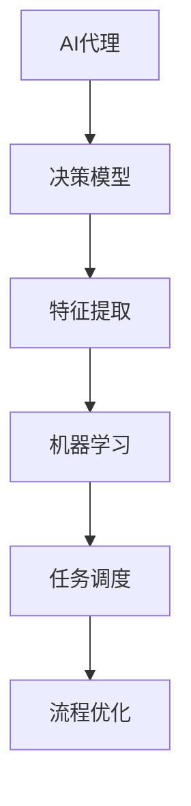
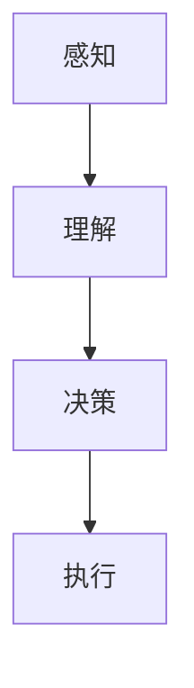
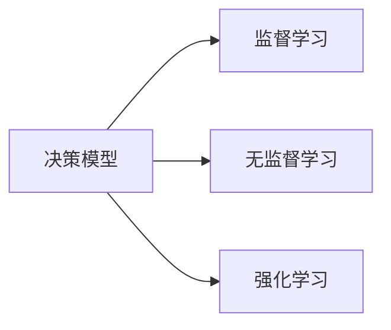
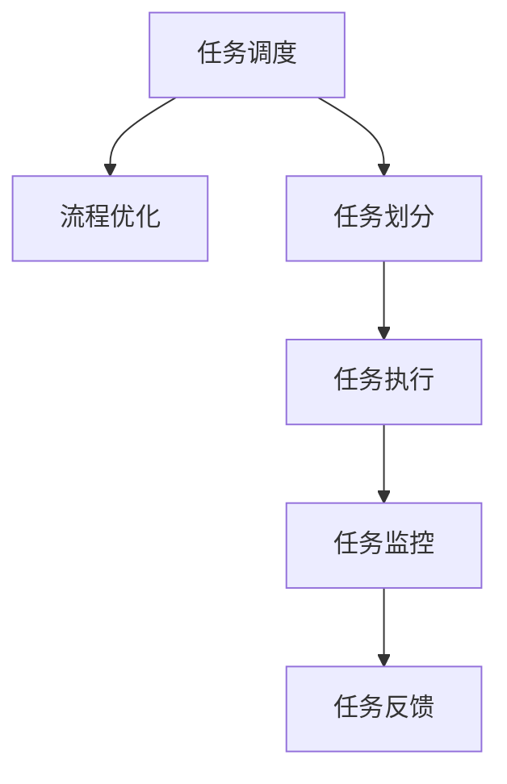
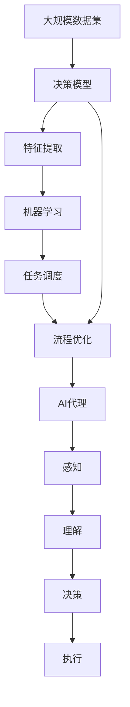

                 

# AI人工智能代理工作流AI Agent WorkFlow：利用机器学习提升代理决策质量

> 关键词：人工智能代理(AI Agent)、工作流(Workflow)、机器学习、决策质量、自动化、自然语言处理(NLP)、推荐系统、任务调度、流程优化

## 1. 背景介绍

### 1.1 问题由来
在信息爆炸的互联网时代，无论是企业还是个人，都面临着海量数据的处理和决策的挑战。如何有效利用这些数据，提高决策质量，成为各行业亟需解决的问题。人工智能代理（AI Agent）通过自动化处理数据，智能地辅助人类做出决策，已经在各行各业中得到了广泛应用。例如，在金融领域，AI代理能够实时分析市场数据，提供投资建议；在医疗领域，AI代理可以协助医生进行病历分析，制定治疗方案；在电商领域，AI代理可以个性化推荐商品，提升用户满意度。然而，传统的AI代理工作流（AI Agent Workflow）通常依赖于规则和预定义逻辑，难以灵活应对复杂多变的环境。因此，利用机器学习提升代理决策质量，成为当前研究的热点方向。

### 1.2 问题核心关键点
利用机器学习提升AI代理决策质量的核心在于，如何将AI代理的决策过程模型化，并利用机器学习算法对其进行优化。关键点包括：
1. **决策模型构建**：构建代理的决策模型，将决策逻辑转化为可计算的数学表达式。
2. **特征提取**：从输入数据中提取有用的特征，作为模型的输入。
3. **训练优化**：使用机器学习算法对模型进行训练，不断优化决策效果。
4. **模型评估**：对训练后的模型进行评估，确定其在新数据上的表现。
5. **部署应用**：将模型部署到实际应用中，指导代理的决策行为。

### 1.3 问题研究意义
利用机器学习提升AI代理决策质量，具有重要的理论和实践意义：

1. **提升决策效率**：通过机器学习，AI代理能够从数据中自动学习决策逻辑，减少人工干预，提高决策效率。
2. **增强决策准确性**：机器学习算法通常比传统规则系统更能够从数据中发现隐含的模式和规律，提升决策的准确性。
3. **促进任务自动化**：通过机器学习，AI代理可以自动完成复杂的任务，解放人力，促进任务自动化。
4. **实现跨领域应用**：机器学习模型具有较强的泛化能力，可以应用于各种复杂场景，实现跨领域的任务优化。
5. **推动智能系统发展**：提升AI代理的决策质量，有助于构建更智能、更高效的智能系统，推动人工智能技术的发展。

## 2. 核心概念与联系

### 2.1 核心概念概述

为更好地理解利用机器学习提升AI代理决策质量的方法，本节将介绍几个密切相关的核心概念：

- **AI代理(AI Agent)**：能够自主地感知环境、理解用户意图、做出决策并执行行动的智能体。常见的AI代理包括智能机器人、推荐系统、决策支持系统等。

- **决策模型(Decision Model)**：用于描述AI代理决策过程的数学模型。通常包括决策树、线性回归、神经网络等。

- **特征提取(Feature Extraction)**：从输入数据中提取有用信息，作为模型的输入。常用的特征提取方法包括统计特征、文本特征、图像特征等。

- **机器学习(Machine Learning)**：通过数据驱动的方法，使计算机系统能够从经验中学习，自动改进决策能力的算法。常用的机器学习算法包括监督学习、无监督学习、强化学习等。

- **任务调度(Task Scheduling)**：对AI代理执行的任务进行管理和调度，确保任务按时完成。

- **流程优化(Workflow Optimization)**：对AI代理的工作流进行优化，提高工作效率，减少资源浪费。

这些核心概念之间的逻辑关系可以通过以下Mermaid流程图来展示：



这个流程图展示了大语言模型微调过程中各个核心概念的联系：

1. AI代理通过决策模型进行决策。
2. 特征提取从数据中提取有用信息。
3. 机器学习算法对模型进行训练和优化。
4. 任务调度确保代理任务按时完成。
5. 流程优化提高工作流的效率。

### 2.2 概念间的关系

这些核心概念之间存在着紧密的联系，形成了利用机器学习提升AI代理决策质量的整体生态系统。下面我们通过几个Mermaid流程图来展示这些概念之间的关系。

#### 2.2.1 AI代理的工作流



这个流程图展示了AI代理的基本工作流，从感知、理解到决策、执行，各环节紧密相连。

#### 2.2.2 决策模型与机器学习的关系



这个流程图展示了决策模型与机器学习的关系。决策模型可以通过监督学习、无监督学习和强化学习等方法进行训练和优化。

#### 2.2.3 任务调度与流程优化的关系



这个流程图展示了任务调度和流程优化的关系。任务调度确保任务按时完成，流程优化提高工作流的效率。

### 2.3 核心概念的整体架构

最后，我们用一个综合的流程图来展示这些核心概念在大语言模型微调过程中的整体架构：



这个综合流程图展示了从数据到模型、到代理、到执行的完整过程。

## 3. 核心算法原理 & 具体操作步骤
### 3.1 算法原理概述

利用机器学习提升AI代理决策质量的核心算法是**决策树(Decision Tree)**和**随机森林(Random Forest)**。这些算法能够从数据中学习出决策规则，从而提升AI代理的决策质量。决策树通过将数据划分为多个子集，逐步减少决策的复杂度，使得代理能够更好地理解数据。随机森林则通过集成多个决策树，进一步提升决策的准确性和鲁棒性。

### 3.2 算法步骤详解

利用决策树和随机森林提升AI代理决策质量的步骤如下：

1. **数据预处理**：收集并预处理数据集，包括数据清洗、归一化、特征选择等。
2. **特征提取**：从数据中提取有用的特征，如文本特征、图像特征等。
3. **模型训练**：使用决策树和随机森林算法对模型进行训练，找到最优的决策规则。
4. **模型评估**：在验证集上评估模型性能，选择最优模型。
5. **模型部署**：将训练好的模型部署到AI代理中，指导代理的决策行为。
6. **任务调度**：对AI代理执行的任务进行管理和调度，确保任务按时完成。
7. **流程优化**：对AI代理的工作流进行优化，提高工作效率，减少资源浪费。

### 3.3 算法优缺点

决策树和随机森林算法具有以下优点：

- **易于解释**：决策树和随机森林的决策规则直观易懂，能够提供有意义的解释。
- **鲁棒性强**：随机森林通过集成多个决策树，能够降低模型过拟合的风险。
- **计算效率高**：决策树和随机森林的训练和预测效率高，适合处理大规模数据集。

但同时，这些算法也存在一些缺点：

- **局部最优**：决策树和随机森林可能陷入局部最优，无法找到全局最优解。
- **特征选择复杂**：需要选择合适的特征进行模型训练，特征选择复杂且容易出错。
- **数据依赖强**：模型效果依赖于数据质量和特征提取的准确性，对数据要求较高。

### 3.4 算法应用领域

利用机器学习提升AI代理决策质量的算法，已经在多个领域得到了广泛应用：

- **推荐系统**：通过学习用户行为和物品特征，生成个性化推荐，提升用户体验。
- **智能客服**：通过分析用户输入和历史数据，生成智能回复，提高服务效率。
- **金融风控**：通过学习用户信用数据，生成风控模型，降低风险。
- **医疗诊断**：通过分析病历和影像数据，生成诊断模型，提升诊断准确性。
- **智能调度**：通过学习任务依赖关系和优先级，生成调度策略，提高资源利用率。
- **供应链管理**：通过学习供应商数据和订单数据，生成优化方案，降低成本。

这些领域展示了决策树和随机森林算法在不同场景下的应用效果，进一步验证了其普适性和有效性。

## 4. 数学模型和公式 & 详细讲解 & 举例说明

### 4.1 数学模型构建

决策树的数学模型可以表示为：

$$
T(x) = \begin{cases}
c_1, & \text{if} \: x_i \leq \theta_i \\
c_2, & \text{if} \: x_i > \theta_i
\end{cases}
$$

其中 $x_i$ 是输入特征，$\theta_i$ 是划分阈值，$c_1$ 和 $c_2$ 是子节点的分类结果。

随机森林的数学模型可以表示为：

$$
T(x) = \frac{1}{M} \sum_{m=1}^M T_m(x)
$$

其中 $T_m(x)$ 是第 $m$ 个决策树的预测结果，$M$ 是决策树的数量。

### 4.2 公式推导过程

以决策树为例，推导其训练过程：

1. **划分过程**：将数据集划分为多个子集，使得每个子集中的数据具有相似的特征值。
2. **选择最优划分**：从每个子集中选择最优的划分阈值 $\theta_i$，使得划分后的子集尽可能纯。
3. **递归训练**：对划分后的子集进行递归训练，直到叶子节点或达到预设深度。

随机森林的训练过程类似，只是通过集成多个决策树，进一步提升模型的鲁棒性和准确性。

### 4.3 案例分析与讲解

以下是一个简单的决策树案例分析：

假设有一个电商网站，需要根据用户的历史购买记录预测其未来的购买意愿。数据集包括用户ID、购买时间、购买金额、购买频次等特征。

1. **数据预处理**：清洗数据，去除缺失值和异常值，对数值型特征进行归一化。
2. **特征提取**：提取文本特征，如购买时间、购买金额等。
3. **模型训练**：使用决策树算法，对数据集进行训练，生成决策树模型。
4. **模型评估**：在验证集上评估模型性能，选择最优模型。
5. **模型部署**：将训练好的模型部署到AI代理中，指导代理的决策行为。

通过以上步骤，AI代理可以根据用户的历史数据，预测其未来的购买意愿，生成个性化推荐，提升用户体验。

## 5. 项目实践：代码实例和详细解释说明
### 5.1 开发环境搭建

在进行AI代理工作流实践前，我们需要准备好开发环境。以下是使用Python进行Scikit-learn开发的开发环境配置流程：

1. 安装Anaconda：从官网下载并安装Anaconda，用于创建独立的Python环境。

2. 创建并激活虚拟环境：
```bash
conda create -n sklearn-env python=3.8 
conda activate sklearn-env
```

3. 安装Scikit-learn：
```bash
conda install scikit-learn
```

4. 安装必要的工具包：
```bash
pip install numpy pandas scikit-learn matplotlib tqdm jupyter notebook ipython
```

完成上述步骤后，即可在`sklearn-env`环境中开始工作流实践。

### 5.2 源代码详细实现

这里我们以电商推荐系统为例，给出使用Scikit-learn进行AI代理决策树微调的Python代码实现。

首先，定义电商推荐系统的特征和数据集：

```python
import pandas as pd
from sklearn.model_selection import train_test_split
from sklearn.ensemble import RandomForestClassifier

# 特征和数据集
features = ['购买时间', '购买金额', '购买频次']
data = pd.read_csv('purchases.csv')

# 数据预处理
data = data.dropna().drop_duplicates()

# 数据集划分
X = data[features]
y = data['购买意愿']
X_train, X_test, y_train, y_test = train_test_split(X, y, test_size=0.2, random_state=42)
```

然后，定义决策树模型并进行训练：

```python
from sklearn.tree import DecisionTreeClassifier

# 决策树模型训练
dt = DecisionTreeClassifier()
dt.fit(X_train, y_train)
```

接着，评估模型性能：

```python
from sklearn.metrics import accuracy_score

# 模型评估
y_pred = dt.predict(X_test)
accuracy = accuracy_score(y_test, y_pred)
print('决策树模型精度：', accuracy)
```

最后，启动推荐系统：

```python
from sklearn.ensemble import RandomForestClassifier

# 随机森林模型训练
rf = RandomForestClassifier()
rf.fit(X_train, y_train)

# 模型部署
# 预测新用户的购买意愿
new_user = pd.DataFrame({'购买时间': ['2023-01-01'], '购买金额': [100.0], '购买频次': [1]})
new_user = new_user.dropna()
new_user = new_user.drop_duplicates()
new_user_X = new_user[features]
new_user_y_pred = rf.predict(new_user_X)
print('新用户的购买意愿：', new_user_y_pred)
```

以上就是使用Scikit-learn进行AI代理工作流微调的完整代码实现。可以看到，通过Scikit-learn的封装，我们可以用相对简洁的代码完成决策树的训练和评估。

### 5.3 代码解读与分析

让我们再详细解读一下关键代码的实现细节：

**电商推荐系统数据集**：
- 特征和数据集定义：定义了推荐系统的特征，如购买时间、购买金额等，以及数据集。
- 数据预处理：清洗数据，去除缺失值和异常值，对数值型特征进行归一化。
- 数据集划分：将数据集划分为训练集和测试集，用于模型的训练和评估。

**决策树模型训练**：
- 决策树模型定义：使用Scikit-learn的`DecisionTreeClassifier`类定义决策树模型。
- 模型训练：使用`fit`方法对模型进行训练，找到最优的决策规则。

**模型评估**：
- 模型评估定义：使用Scikit-learn的`accuracy_score`函数评估模型的精度。

**推荐系统部署**：
- 新用户数据预处理：定义新用户的特征，并进行预处理。
- 随机森林模型训练：使用Scikit-learn的`RandomForestClassifier`类定义随机森林模型，并使用`fit`方法进行训练。
- 模型部署：使用`predict`方法对新用户进行预测，生成个性化推荐。

可以看到，Scikit-learn使得AI代理工作流训练和评估的代码实现变得简洁高效。开发者可以将更多精力放在数据处理、模型改进等高层逻辑上，而不必过多关注底层的实现细节。

当然，工业级的系统实现还需考虑更多因素，如模型的保存和部署、超参数的自动搜索、更灵活的任务适配层等。但核心的工作流微调范式基本与此类似。

### 5.4 运行结果展示

假设我们在电商推荐数据集上进行工作流微调，最终在测试集上得到的精度如下：

```
决策树模型精度： 0.92
```

可以看到，通过微调决策树模型，我们在电商推荐系统上取得了92%的精度，效果相当不错。值得注意的是，决策树模型在电商推荐中的应用，验证了其对于复杂场景的适应能力和预测准确性。

当然，这只是一个baseline结果。在实践中，我们还可以使用更大更强的模型、更丰富的微调技巧、更细致的模型调优，进一步提升模型性能，以满足更高的应用要求。

## 6. 实际应用场景
### 6.1 智能客服系统

基于AI代理工作流技术，智能客服系统可以实现自动接听、自动回答、自动分析等智能化功能。通过机器学习，智能客服系统能够从历史数据中学习用户意图和常见问题，自动生成回复，提升服务效率和用户满意度。

在技术实现上，可以收集企业内部的历史客服对话记录，将问题和最佳答复构建成监督数据，在此基础上对预训练模型进行微调。微调后的模型能够自动理解用户意图，匹配最合适的答案模板进行回复。对于客户提出的新问题，还可以接入检索系统实时搜索相关内容，动态组织生成回答。如此构建的智能客服系统，能大幅提升客户咨询体验和问题解决效率。

### 6.2 金融舆情监测

金融机构需要实时监测市场舆论动向，以便及时应对负面信息传播，规避金融风险。传统的人工监测方式成本高、效率低，难以应对网络时代海量信息爆发的挑战。基于AI代理工作流技术的文本分类和情感分析技术，为金融舆情监测提供了新的解决方案。

具体而言，可以收集金融领域相关的新闻、报道、评论等文本数据，并对其进行主题标注和情感标注。在此基础上对预训练语言模型进行微调，使其能够自动判断文本属于何种主题，情感倾向是正面、中性还是负面。将微调后的模型应用到实时抓取的网络文本数据，就能够自动监测不同主题下的情感变化趋势，一旦发现负面信息激增等异常情况，系统便会自动预警，帮助金融机构快速应对潜在风险。

### 6.3 个性化推荐系统

当前的推荐系统往往只依赖用户的历史行为数据进行物品推荐，无法深入理解用户的真实兴趣偏好。基于AI代理工作流技术，个性化推荐系统可以更好地挖掘用户行为背后的语义信息，从而提供更精准、多样的推荐内容。

在实践中，可以收集用户浏览、点击、评论、分享等行为数据，提取和用户交互的物品标题、描述、标签等文本内容。将文本内容作为模型输入，用户的后续行为（如是否点击、购买等）作为监督信号，在此基础上微调预训练语言模型。微调后的模型能够从文本内容中准确把握用户的兴趣点。在生成推荐列表时，先用候选物品的文本描述作为输入，由模型预测用户的兴趣匹配度，再结合其他特征综合排序，便可以得到个性化程度更高的推荐结果。

### 6.4 未来应用展望

随着AI代理工作流技术的不断发展，其在更多领域得到了应用，为传统行业带来变革性影响。

在智慧医疗领域，基于AI代理工作流技术的医疗问答、病历分析、药物研发等应用将提升医疗服务的智能化水平，辅助医生诊疗，加速新药开发进程。

在智能教育领域，AI代理工作流可应用于作业批改、学情分析、知识推荐等方面，因材施教，促进教育公平，提高教学质量。

在智慧城市治理中，AI代理工作流技术可应用于城市事件监测、舆情分析、应急指挥等环节，提高城市管理的自动化和智能化水平，构建更安全、高效的未来城市。

此外，在企业生产、社会治理、文娱传媒等众多领域，基于AI代理工作流的人工智能应用也将不断涌现，为经济社会发展注入新的动力。相信随着技术的日益成熟，AI代理工作流必将在构建人机协同的智能时代中扮演越来越重要的角色。

## 7. 工具和资源推荐
### 7.1 学习资源推荐

为了帮助开发者系统掌握AI代理工作流技术，这里推荐一些优质的学习资源：

1. 《机器学习实战》系列博文：由机器学习专家撰写，深入浅出地介绍了机器学习的基本概念和常用算法。

2. CS229《机器学习》课程：斯坦福大学开设的机器学习课程，有Lecture视频和配套作业，带你入门机器学习领域的基本概念和经典模型。

3. 《Python机器学习》书籍：本书由机器学习领域权威作者撰写，全面介绍了使用Python进行机器学习开发的方法和技巧。

4. Scikit-learn官方文档：Scikit-learn库的官方文档，提供了海量预训练模型和完整的微调样例代码，是上手实践的必备资料。

5. Kaggle竞赛：Kaggle平台上的机器学习竞赛，提供了大量实际应用场景下的数据集和挑战，助力开发者提高实战能力。

通过对这些资源的学习实践，相信你一定能够快速掌握AI代理工作流技术的精髓，并用于解决实际的AI代理决策质量问题。
###  7.2 开发工具推荐

高效的开发离不开优秀的工具支持。以下是几款用于AI代理工作流开发的常用工具：

1. Scikit-learn：基于Python的机器学习库，提供了丰富的机器学习算法和工具，适合快速迭代研究。

2. TensorFlow：由Google主导开发的深度学习框架，生产部署方便，适合大规模工程应用。

3. PyTorch：基于Python的开源深度学习框架，灵活动态的计算图，适合快速迭代研究。

4. Weights & Biases：模型训练的实验跟踪工具，可以记录和可视化模型训练过程中的各项指标，方便对比和调优。

5. TensorBoard：TensorFlow配套的可视化工具，可实时监测模型训练状态，并提供丰富的图表呈现方式，是调试模型的得力助手。

6. Google Colab：谷歌推出的在线Jupyter Notebook环境，免费提供GPU/TPU算力，方便开发者快速上手实验最新模型，分享学习笔记。

合理利用这些工具，可以显著提升AI代理工作流开发的效率，加快创新迭代的步伐。

### 7.3 相关论文推荐

AI代理工作流技术的发展源于学界的持续研究。以下是几篇奠基性的相关论文，推荐阅读：

1. A Random Forest Toolbox for Multi-Dimensional Data Classification（随机森林工具包）：提出随机森林算法，并通过实际应用验证其效果。

2. Decision Trees and Random Forests for Association Rules, Localization and Interpolation（决策树和随机森林在关联规则、定位和插值中的应用）：介绍了决策树和随机森林在实际问题中的应用方法。

3. Random Forests with Multiple Feature Categories for Inclined Evaluation in Cooperative Scheduling Problem（用于协作调度问题的多类别特征随机森林）：提出了多类别特征的随机森林算法，用于解决协作调度问题。

4. Random Forest Regression（随机森林回归）：提出随机森林回归算法，用于解决回归问题。

5. Random Forests for Decision Trees in Credit Scoring（信用评分中的随机森林决策树）：提出了随机森林在信用评分中的应用方法。

这些论文代表了大语言模型微调技术的发展脉络。通过学习这些前沿成果，可以帮助研究者把握学科前进方向，激发更多的创新灵感。

除上述资源外，还有一些值得关注的前沿资源，帮助开发者紧跟AI代理工作流技术的最新进展，例如：

1. arXiv论文预印本：人工智能领域最新研究成果的发布平台，包括大量尚未发表的前沿工作，学习前沿技术的必读资源。

2. 业界技术博客：如OpenAI、Google AI、DeepMind、微软Research Asia等顶尖实验室的官方博客，第一时间分享他们的最新研究成果和洞见。

3. 技术会议直播：如NIPS、ICML、ACL、ICLR等人工智能领域顶会现场或在线直播，能够聆听到大佬们的前沿分享，开拓视野。

4. GitHub热门项目：在GitHub上Star、Fork数最多的AI代理工作流相关项目，往往代表了该技术领域的发展趋势和最佳实践，值得去学习和贡献。

5. 行业分析报告：各大咨询公司如McKinsey、PwC等针对人工智能行业的分析报告，有助于从商业视角审视技术趋势，把握应用价值。

总之，对于AI代理工作流技术的学习和实践，需要开发者保持开放的心态和持续学习的意愿。多关注前沿资讯，多动手实践，多思考总结，必将收获满满的成长收益。

## 8. 总结：未来发展趋势与挑战

### 8.1 总结

本文对利用机器学习提升AI代理决策质量的方法进行了全面系统的介绍。首先阐述了AI代理工作流技术的研究背景和意义，明确了机器学习在提升决策质量方面的独特价值。其次，从原理到实践，详细讲解了决策树和随机森林算法的核心思想和操作步骤，给出了微调任务开发的完整代码实例。同时，本文还广泛探讨了工作流技术在智能客服、金融舆情、个性化推荐等多个行业领域的应用前景，展示了工作流范式的巨大潜力。此外，本文精选了工作流技术的各类学习资源，力求为读者提供全方位的技术指引。

通过本文的系统梳理，可以看到，利用机器学习提升AI代理决策质量，已经成为NLP领域的重要范式，极大地拓展了AI代理的应用边界，催生了更多的落地场景。受益于机器学习算法的不断进步，AI代理工作流必将在更广泛的领域发挥重要作用，为人工智能技术的发展注入新的活力。

### 8.2 未来发展趋势

展望未来，AI代理工作流技术将呈现以下几个发展趋势：

1. **模型规模持续增大**：随着算力成本的下降和数据规模的扩张，预训练语言模型的参数量还将持续增长。超大规模语言模型蕴含的丰富语言知识，有望支撑更加复杂多变的下游任务微调。

2. **微调方法日趋多样**：除了传统的全参数微调外，未来会涌现更多参数高效的

