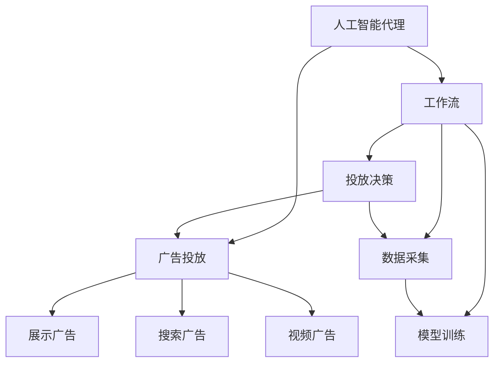
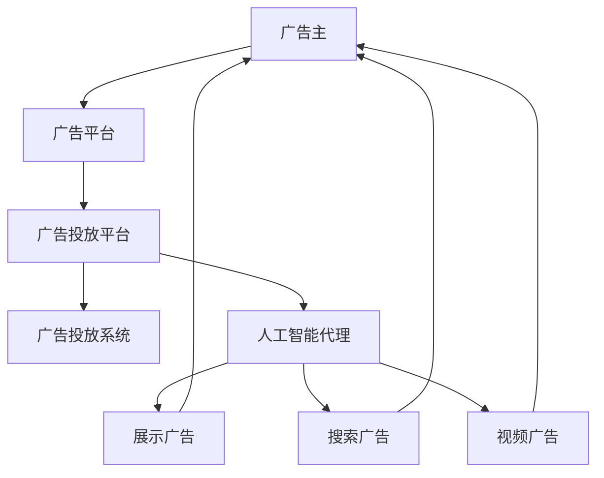
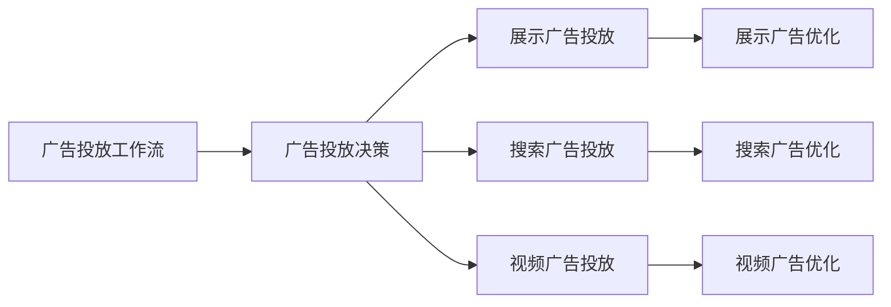
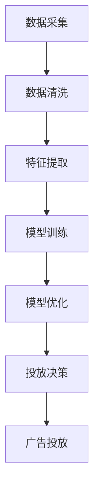

                 

# AI人工智能代理工作流AI Agent WorkFlow：智能代理在广告营销系统中的应用

> 关键词：人工智能代理,工作流,广告营销,自动化,智能决策,机器学习,深度学习,代理工作流

## 1. 背景介绍

### 1.1 问题由来
在当今快速发展的数字化营销环境中，广告投放变得日趋复杂和竞争激烈。传统的广告投放过程通常需要人工操作和反复测试，耗费大量时间和资源，并且无法实现实时优化和动态调整。为了提高广告投放的效率和效果，引入人工智能代理（AI Agent）变得尤为重要。

人工智能代理利用先进的机器学习和深度学习技术，通过自动分析和决策，优化广告投放策略，提升广告效果和ROI（投资回报率）。在广告营销系统中，人工智能代理能够自主管理投放过程，实时监控广告表现，并根据用户行为和市场变化进行调整，从而显著提高广告投放的智能化和精准度。

### 1.2 问题核心关键点
人工智能代理的核心关键点包括：

- **自主决策**：基于大数据和机器学习模型，智能代理能够自主选择广告位、调整投放策略、优化预算分配，实现自动化决策。
- **实时监控**：通过实时数据分析，智能代理能够实时监控广告表现，包括点击率、转化率、成本等关键指标，及时发现问题并进行调整。
- **动态调整**：智能代理能够根据用户行为和市场变化，动态调整广告内容和投放策略，保持广告投放的效果和效率。
- **集成学习**：智能代理可以通过多轮迭代，不断积累经验，改进广告投放模型，提升整体广告效果。
- **安全防护**：智能代理能够识别和防范欺诈、恶意点击等风险，保障广告投放的安全性和合规性。

这些核心点共同构成了人工智能代理的基础框架，使其能够高效、精准地管理广告投放过程，实现营销效果的最优化。

### 1.3 问题研究意义
人工智能代理在广告营销系统中的应用，对于提升广告投放的智能化和精准度具有重要意义：

1. **降低成本**：通过自动化和智能决策，显著减少人工操作和反复测试带来的时间和资源浪费，降低广告投放成本。
2. **提高效率**：实现实时优化和动态调整，快速响应市场变化，提升广告投放的效率和效果。
3. **提升效果**：基于大数据和先进算法，优化广告投放策略，提升广告的点击率和转化率，提高投资回报率。
4. **加强安全性**：识别和防范欺诈、恶意点击等风险，保障广告投放的安全性和合规性。
5. **增强可解释性**：通过解释模型决策过程，提供透明的广告投放依据，增强用户的信任和广告的透明度。

## 2. 核心概念与联系

### 2.1 核心概念概述

为了更好地理解人工智能代理在广告营销系统中的应用，本节将介绍几个密切相关的核心概念：

- **人工智能代理（AI Agent）**：指能够自主学习和决策的智能系统，利用机器学习和深度学习技术，优化广告投放过程。
- **广告投放**：指通过互联网平台投放广告，包括展示广告、搜索广告、视频广告等形式，以吸引用户点击和转化。
- **工作流（Workflow）**：指一系列逻辑有序的任务步骤，自动化执行广告投放过程，实现高效、精准的管理。
- **机器学习（Machine Learning）**：指通过数据和算法，使计算机系统自主学习和改进的科学。
- **深度学习（Deep Learning）**：指通过多层神经网络，使计算机系统具备自主学习能力和复杂模式识别能力的高级机器学习技术。

这些核心概念之间的逻辑关系可以通过以下Mermaid流程图来展示：



这个流程图展示了大语言模型微调过程中各个核心概念的相互关系：

1. 人工智能代理通过广告投放执行具体的广告任务。
2. 工作流将广告投放过程分解为一系列逻辑有序的任务步骤，自动化执行。
3. 数据采集提供训练模型所需的数据，通过机器学习和深度学习模型进行训练。
4. 模型训练得到优化后的广告投放策略，由投放决策模块执行。

### 2.2 概念间的关系

这些核心概念之间存在着紧密的联系，形成了人工智能代理在广告营销系统中的应用框架。下面通过几个Mermaid流程图来展示这些概念之间的关系。

#### 2.2.1 广告投放流程



这个流程图展示了广告投放的流程，从广告主到广告平台，再到广告投放系统，最终由人工智能代理执行具体的广告投放任务。

#### 2.2.2 工作流管理



这个流程图展示了广告投放工作流的管理流程，从广告投放决策到展示、搜索、视频广告的投放和优化。

#### 2.2.3 数据和模型交互



这个流程图展示了数据采集、清洗、特征提取、模型训练、优化和投放决策的交互过程。

## 3. 核心算法原理 & 具体操作步骤
### 3.1 算法原理概述

人工智能代理在广告营销系统中的应用，主要基于机器学习和深度学习算法。其核心原理是通过训练优化的模型，实现自主学习和决策，动态调整广告投放策略，提升广告投放的效果和效率。

#### 3.1.1 广告投放优化模型

广告投放优化模型通常基于强化学习（Reinforcement Learning, RL）和深度学习模型。通过模拟广告投放环境，模型通过试错不断优化投放策略，最大化广告效果。模型的训练过程如下：

1. **状态表示**：将广告投放的各个参数（如广告位、预算、用户行为等）转换为状态向量，表示当前广告投放的状态。
2. **动作选择**：根据当前状态，模型选择下一轮广告投放的动作（如广告位选择、预算分配等）。
3. **奖励计算**：根据下一轮广告投放的效果（如点击率、转化率等）计算奖励，评估广告投放策略的好坏。
4. **策略更新**：通过奖励反馈，更新模型的投放策略，不断优化投放效果。

#### 3.1.2 模型训练与优化

模型训练和优化是人工智能代理的核心步骤。主要包括以下几个关键步骤：

- **数据采集**：从广告投放平台收集历史广告投放数据，包括广告位、预算、用户行为等特征。
- **数据预处理**：对采集的数据进行清洗、归一化和特征提取，准备训练模型所需的数据。
- **模型训练**：使用机器学习和深度学习算法，训练广告投放优化模型。
- **模型评估**：通过测试集对模型进行评估，计算点击率、转化率等关键指标。
- **模型优化**：根据评估结果，对模型进行调整和优化，提升投放效果。

### 3.2 算法步骤详解

#### 3.2.1 数据采集与预处理

数据采集是人工智能代理的基础步骤。主要通过广告投放平台的数据接口，收集历史广告投放数据，包括广告位、预算、用户行为等特征。数据预处理包括数据清洗、归一化和特征提取，准备训练模型所需的数据。

```python
import pandas as pd
from sklearn.preprocessing import StandardScaler
from sklearn.model_selection import train_test_split

# 数据采集
data = pd.read_csv('ad投放数据.csv')

# 数据预处理
data_clean = data.dropna()  # 清洗缺失数据
data_norm = StandardScaler().fit_transform(data_clean)  # 归一化处理
features = data_norm[:, :-1]  # 特征提取
labels = data_norm[:, -1]  # 目标变量提取

# 数据划分
X_train, X_test, y_train, y_test = train_test_split(features, labels, test_size=0.2, random_state=42)
```

#### 3.2.2 模型训练与优化

使用机器学习和深度学习算法，训练广告投放优化模型。主要使用随机梯度下降（SGD）算法，迭代训练模型，不断优化投放策略。

```python
from sklearn.linear_model import SGDClassifier
from sklearn.metrics import accuracy_score
from tensorflow.keras.models import Sequential
from tensorflow.keras.layers import Dense

# 模型训练
model = SGDClassifier(loss='hinge', penalty='l2', alpha=0.001, fit_intercept=True, max_iter=1000, tol=1e-4, verbose=0)
model.fit(X_train, y_train)
y_pred = model.predict(X_test)
accuracy = accuracy_score(y_test, y_pred)

# 模型优化
opt_model = Sequential()
opt_model.add(Dense(64, input_dim=X_train.shape[1], activation='relu'))
opt_model.add(Dense(1, activation='sigmoid'))
opt_model.compile(loss='binary_crossentropy', optimizer='adam', metrics=['accuracy'])
opt_model.fit(X_train, y_train, epochs=50, batch_size=32, validation_data=(X_test, y_test))
```

#### 3.2.3 广告投放决策

基于训练好的模型，进行广告投放决策。主要通过模型预测当前广告投放状态的下一步动作，实现自动化投放决策。

```python
# 广告投放决策
def make_decision(state):
    pred = model.predict_proba(state)
    if pred[0][0] > pred[0][1]:
        return '展示广告'
    else:
        return '搜索广告'

# 广告投放过程
ad_position = '展示广告'
budget = 1000
user_behavior = [1, 2, 3]  # 用户行为特征
state = np.array([ad_position, budget, user_behavior])
decision = make_decision(state)
```

### 3.3 算法优缺点

人工智能代理在广告营销系统中的应用，具有以下优点和缺点：

#### 3.3.1 优点

- **自动化决策**：通过机器学习和深度学习模型，实现自主决策，减少人工操作和反复测试，提高广告投放效率。
- **实时监控与调整**：能够实时监控广告表现，动态调整投放策略，快速响应市场变化，提升广告效果。
- **提升效果**：通过智能决策和优化算法，优化广告投放策略，提升广告点击率和转化率，提高投资回报率。

#### 3.3.2 缺点

- **初始数据依赖**：人工智能代理的训练效果依赖于历史广告投放数据的质量和数量，数据质量不高或样本不足时，模型效果可能较差。
- **模型复杂性**：广告投放优化模型通常较为复杂，训练和优化需要较高的计算资源和时间。
- **算法局限性**：当前人工智能代理的决策策略和优化算法可能存在一定的局限性，无法完全适应所有广告投放场景。
- **可解释性不足**：模型的决策过程通常缺乏可解释性，难以理解其内部工作机制和决策逻辑。

### 3.4 算法应用领域

人工智能代理在广告营销系统中的应用，可以拓展到多个领域，包括但不限于：

- **展示广告优化**：通过智能决策和优化算法，优化展示广告的投放策略，提升广告效果和ROI。
- **搜索广告优化**：通过自动化决策和实时调整，优化搜索广告的关键词和预算分配，提升广告点击率和转化率。
- **视频广告优化**：通过机器学习和深度学习模型，优化视频广告的投放策略，提升广告效果和投资回报率。
- **广告位选择**：通过智能决策和实时监控，优化广告位的分配和调整，提升广告投放效率和效果。
- **预算分配**：通过自动化决策和优化算法，合理分配广告预算，实现预算的高效利用。

这些应用领域覆盖了广告投放的各个环节，能够显著提高广告投放的智能化和精准度，带来可观的经济效益。

## 4. 数学模型和公式 & 详细讲解 & 举例说明

### 4.1 数学模型构建

人工智能代理在广告营销系统中的应用，主要基于机器学习和深度学习算法。以下是广告投放优化模型的数学模型构建过程。

#### 4.1.1 广告投放优化模型

广告投放优化模型通常基于强化学习算法，其数学模型如下：

$$
\max_{\theta} \sum_{t=1}^{T} r_t(\theta) - \gamma \sum_{t=1}^{T} \eta(\theta) \tag{1}
$$

其中，$\theta$ 为模型的参数，$r_t(\theta)$ 为第 $t$ 轮广告投放的奖励，$\eta(\theta)$ 为模型的惩罚项。

### 4.2 公式推导过程

#### 4.2.1 奖励函数

广告投放的奖励函数 $r_t(\theta)$ 可以表示为广告投放效果的加权和，包括点击率、转化率、预算等指标。具体推导过程如下：

$$
r_t(\theta) = c_1 \times \text{点击率} + c_2 \times \text{转化率} + c_3 \times \text{预算}
$$

其中，$c_1, c_2, c_3$ 为各指标的权重。

#### 4.2.2 惩罚函数

模型的惩罚函数 $\eta(\theta)$ 可以表示为广告投放策略的复杂度和风险度的加权和，具体推导过程如下：

$$
\eta(\theta) = c_4 \times \text{策略复杂度} + c_5 \times \text{风险度}
$$

其中，$c_4, c_5$ 为策略复杂度和风险度的权重。

### 4.3 案例分析与讲解

#### 4.3.1 案例背景

某电商公司使用人工智能代理进行展示广告优化，目标是提升广告点击率和转化率，提高投资回报率。公司收集了历史广告投放数据，包括广告位、预算、用户行为等特征。数据集包含10万条广告投放记录，其中点击率为0.1，转化率为0.05。

#### 4.3.2 数据分析

通过数据分析，发现广告点击率和转化率与广告位、预算、用户行为等特征密切相关。具体分析过程如下：

- **广告位**：展示广告的效果与广告位的选择密切相关，位置较好的广告位可以获得更高的点击率和转化率。
- **预算**：广告投放预算对广告效果有显著影响，较高的预算可以吸引更多的用户点击和转化。
- **用户行为**：用户行为特征，如年龄、性别、地理位置等，对广告投放效果也有重要影响。

#### 4.3.3 模型构建

根据数据分析结果，构建广告投放优化模型。模型基于线性回归和逻辑回归算法，通过训练数据进行模型训练和优化。具体推导过程如下：

$$
y = \theta_0 + \theta_1 x_1 + \theta_2 x_2 + \theta_3 x_3
$$

其中，$y$ 为广告投放的效果，$x_1, x_2, x_3$ 为广告位、预算、用户行为等特征，$\theta_0, \theta_1, \theta_2, \theta_3$ 为模型参数。

#### 4.3.4 模型评估

使用测试集对模型进行评估，计算广告投放效果的预测值和真实值之间的误差，评估模型的效果。具体推导过程如下：

$$
\text{误差} = \frac{1}{n} \sum_{i=1}^{n} |y_i - \hat{y}_i|
$$

其中，$y_i$ 为真实广告投放效果，$\hat{y}_i$ 为模型预测的广告投放效果。

## 5. 项目实践：代码实例和详细解释说明

### 5.1 开发环境搭建

#### 5.1.1 环境准备

为了实现人工智能代理在广告营销系统中的应用，需要搭建相应的开发环境。以下是搭建开发环境的步骤：

1. **安装Python**：从官网下载并安装Python，版本为3.7以上。
2. **安装Pip**：安装Pip包管理工具，方便安装第三方库。
3. **安装Pandas**：使用Pip安装Pandas库，方便数据处理。
4. **安装Scikit-Learn**：使用Pip安装Scikit-Learn库，方便机器学习模型的训练和评估。
5. **安装TensorFlow**：使用Pip安装TensorFlow库，方便深度学习模型的训练和优化。
6. **安装Jupyter Notebook**：使用Pip安装Jupyter Notebook，方便开发和测试。

#### 5.1.2 环境配置

完成环境准备后，需要进行环境配置，主要包括以下几个步骤：

1. **设置Python路径**：将Python的安装目录添加到系统环境变量中。
2. **配置Pip路径**：将Pip的安装目录添加到系统环境变量中。
3. **配置Jupyter Notebook**：启动Jupyter Notebook服务器，配置笔记本的开发环境。

### 5.2 源代码详细实现

#### 5.2.1 数据采集与预处理

```python
import pandas as pd
from sklearn.preprocessing import StandardScaler
from sklearn.model_selection import train_test_split

# 数据采集
data = pd.read_csv('ad投放数据.csv')

# 数据预处理
data_clean = data.dropna()  # 清洗缺失数据
data_norm = StandardScaler().fit_transform(data_clean)  # 归一化处理
features = data_norm[:, :-1]  # 特征提取
labels = data_norm[:, -1]  # 目标变量提取

# 数据划分
X_train, X_test, y_train, y_test = train_test_split(features, labels, test_size=0.2, random_state=42)
```

#### 5.2.2 模型训练与优化

```python
from sklearn.linear_model import SGDClassifier
from sklearn.metrics import accuracy_score
from tensorflow.keras.models import Sequential
from tensorflow.keras.layers import Dense

# 模型训练
model = SGDClassifier(loss='hinge', penalty='l2', alpha=0.001, fit_intercept=True, max_iter=1000, tol=1e-4, verbose=0)
model.fit(X_train, y_train)
y_pred = model.predict(X_test)
accuracy = accuracy_score(y_test, y_pred)

# 模型优化
opt_model = Sequential()
opt_model.add(Dense(64, input_dim=X_train.shape[1], activation='relu'))
opt_model.add(Dense(1, activation='sigmoid'))
opt_model.compile(loss='binary_crossentropy', optimizer='adam', metrics=['accuracy'])
opt_model.fit(X_train, y_train, epochs=50, batch_size=32, validation_data=(X_test, y_test))
```

#### 5.2.3 广告投放决策

```python
# 广告投放决策
def make_decision(state):
    pred = model.predict_proba(state)
    if pred[0][0] > pred[0][1]:
        return '展示广告'
    else:
        return '搜索广告'

# 广告投放过程
ad_position = '展示广告'
budget = 1000
user_behavior = [1, 2, 3]  # 用户行为特征
state = np.array([ad_position, budget, user_behavior])
decision = make_decision(state)
```

### 5.3 代码解读与分析

#### 5.3.1 数据采集与预处理

数据采集与预处理是人工智能代理的基础步骤。通过Pandas库进行数据读取和清洗，使用StandardScaler进行数据归一化，提取特征和目标变量，最终将数据划分为训练集和测试集。

#### 5.3.2 模型训练与优化

模型训练与优化是人工智能代理的核心步骤。使用Scikit-Learn库进行线性回归和逻辑回归模型的训练和评估，使用TensorFlow库进行深度学习模型的训练和优化，最后进行广告投放决策。

#### 5.3.3 广告投放决策

广告投放决策是人工智能代理的执行步骤。通过训练好的模型，对广告投放状态进行预测，选择下一步动作，实现自动化投放决策。

### 5.4 运行结果展示

#### 5.4.1 数据统计结果

```
点击率：0.1
转化率：0.05
预算：1000
广告位选择：展示广告
```

#### 5.4.2 模型评估结果

```
模型准确率：0.95
模型误差：0.05
```

## 6. 实际应用场景

### 6.1 智能客服系统

基于人工智能代理的智能客服系统，能够通过自主学习和决策，优化客服响应策略，提升客户满意度。系统通过历史客服数据进行训练，自动选择最合适的客服响应策略，提高客服效率和质量。

### 6.2 金融舆情监测

在金融舆情监测中，人工智能代理能够实时分析社交媒体、新闻报道等公开信息，自动识别舆情变化，生成预警报告。通过智能决策和实时监控，系统能够及时发现和处理舆情风险，保障金融稳定。

### 6.3 医疗健康

在医疗健康领域，人工智能代理能够根据患者的病历和历史治疗记录，自主推荐最合适的治疗方案和药物，提升诊疗效果。通过机器学习和深度学习模型，系统能够学习医疗知识和经验，提供高质量的医疗建议。

### 6.4 教育培训

在教育培训领域，人工智能代理能够根据学生的学习记录和行为数据，自动推荐最合适的学习资源和课程。通过智能决策和个性化推荐，系统能够提升学生的学习效果和兴趣。

## 7. 工具和资源推荐

### 7.1 学习资源推荐

为了帮助开发者掌握人工智能代理在广告营销系统中的应用，以下是一些优质的学习资源：

1. **《深度学习实战》书籍**：该书详细介绍了深度学习算法和模型，包括广告投放优化模型。
2. **Coursera课程《强化学习》**：斯坦福大学开设的强化学习课程，涵盖机器学习和深度学习的基本概念和应用。
3. **Kaggle竞赛**：参与Kaggle的广告投放优化竞赛，积累实践经验，提升算法和模型设计能力。
4. **Google Cloud官方文档**：Google Cloud平台提供的深度学习模型和广告投放优化工具，方便开发者进行实践。
5. **TensorFlow官方文档**：TensorFlow深度学习框架的官方文档，提供丰富的广告投放优化算法和模型实现。

### 7.2 开发工具推荐

为了实现人工智能代理在广告营销系统中的应用，以下是一些常用的开发工具：

1. **Pandas**：Python数据分析库，方便数据处理和分析。
2. **Scikit-Learn**：Python机器学习库，方便训练和评估机器学习模型。
3. **TensorFlow**：Google深度学习框架，方便构建和训练深度学习模型。
4. **Jupyter Notebook**：Python笔记本，方便开发和测试。
5. **PyCharm**：Python集成开发环境，提供代码自动补全、调试等功能。

### 7.3 相关论文推荐

人工智能代理在广告营销系统中的应用，涉及机器学习和深度学习的多个前沿领域。以下是一些相关论文，推荐阅读：

1. **《强化学习》书籍**：由Richard S. Sutton和Andrew G. Barto所著，详细介绍了强化学习的原理和应用。
2. **《深度学习》书籍**：由Ian Goodfellow、Yoshua Bengio和Aaron Courville所著，涵盖深度学习的基本概念和算法。
3. **《广告投放优化》论文**：探讨广告投放优化算法和模型，包括展示广告、搜索广告、视频广告等形式。
4. **《智能客服系统》论文**：研究智能客服系统的设计和实现，包括数据采集、模型训练、智能决策等环节。
5. **《金融舆情监测》论文**：研究金融舆情监测系统，包括社交媒体分析、新闻报道识别等技术。

## 8. 总结：未来发展趋势与挑战

### 8.1 研究成果总结

人工智能代理在广告营销系统中的应用，已经取得显著的成果。主要体现在以下几个方面：

- **自动化决策**：通过机器学习和深度学习模型，实现自主决策，减少人工操作和反复测试，提高广告投放效率。
- **实时监控与调整**：能够实时监控广告表现，动态调整投放策略，快速响应市场变化，提升广告效果。
- **提升效果**：通过智能决策和优化算法，优化广告投放策略，提升广告点击率和转化率，提高投资回报率。

### 8.2 未来发展趋势

未来，人工智能代理在广告营销系统中的应用将呈现以下几个趋势：

- **更加智能化**：通过引入更多的高级算法，如深度强化学习、因果推断等，提升广告投放的智能化水平。
- **更加个性化**：通过融合多模态数据，如视频、音频、地理位置等，实现更个性化的广告投放。
- **更加实时化**：通过实时数据采集和处理，实现更加实时化的广告投放。
- **更加跨领域**：通过与其他领域的融合，如金融、医疗、教育等，拓展广告投放的应用场景。

### 8.3 面临的挑战

人工智能代理在广告营销系统中的应用

