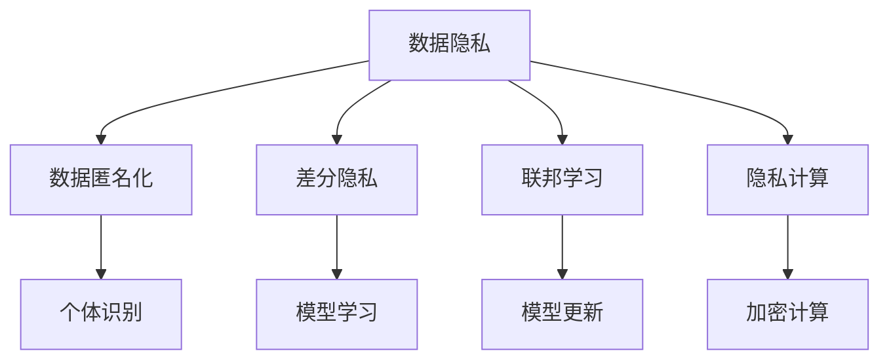
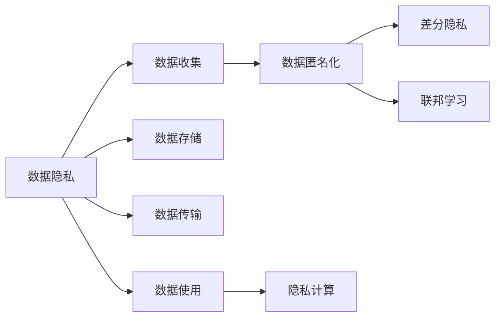
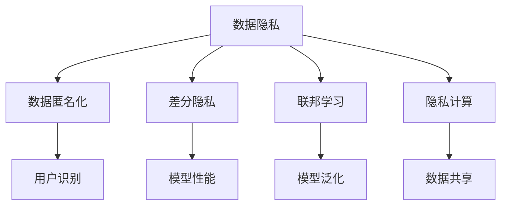
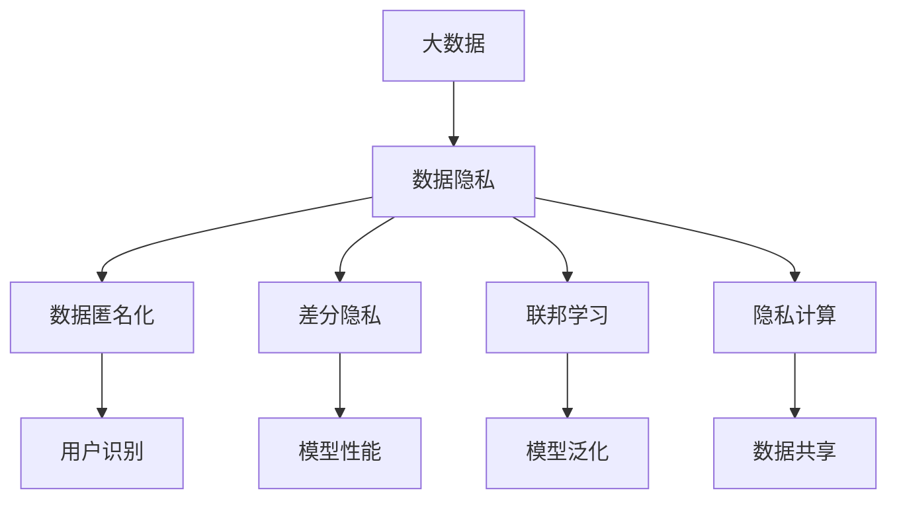

                 

# AI人工智能核心算法原理与代码实例讲解：数据隐私

> 关键词：人工智能,数据隐私,算法隐私,隐私保护,数据匿名化,差分隐私

## 1. 背景介绍

### 1.1 问题由来
在当今数字化时代，数据隐私问题已经成为了AI应用的关键挑战之一。许多组织和个人希望从大规模数据中获取知识，但同时也面临着如何保护数据隐私的困境。如何在利用数据进行学习和预测的同时，确保数据不会泄露敏感信息，成为了一个亟待解决的难题。

### 1.2 问题核心关键点
数据隐私保护的核心在于确保数据在处理、存储、传输和使用过程中，不泄露用户的个人身份信息或敏感信息。常见的隐私保护技术包括数据匿名化、差分隐私和联邦学习等。这些技术可以有效地保护数据隐私，同时满足AI模型的学习需求。

### 1.3 问题研究意义
研究和应用数据隐私保护技术，对于保护用户的隐私权益、增强数据的安全性以及推动AI技术的普及具有重要意义：

1. 保护用户隐私：通过隐私保护技术，可以防止个人数据被非法获取或滥用，保护用户的隐私权益。
2. 增强数据安全性：隐私保护技术可以防止数据泄露，确保数据在存储和传输过程中的安全性。
3. 推动AI技术发展：隐私保护技术可以有效解决数据隐私问题，为AI技术的应用和推广提供保障。

## 2. 核心概念与联系

### 2.1 核心概念概述

为了更好地理解数据隐私保护的核心概念和它们之间的联系，本节将详细介绍几个密切相关的核心概念：

- **数据隐私**：指保护个人或组织的个人信息不被泄露或被非法使用的状态。数据隐私是数据管理中的一个重要方面，涉及到数据的收集、存储、传输和使用等环节。

- **数据匿名化**：指通过一系列算法和技术手段，将个人数据中的敏感信息去除或伪装，使得数据无法识别到个体身份。数据匿名化是隐私保护技术的基础手段。

- **差分隐私**：指通过在数据处理过程中添加噪声，使得个体数据的加入或去除对模型结果的影响极小，从而保护个体隐私。差分隐私是一种更为严格的隐私保护方法，能够提供一定的隐私保护保证。

- **联邦学习**：指在不传输原始数据的情况下，通过分布式计算的方式，在多个参与方之间共享模型的学习更新，实现协作学习。联邦学习可以保护数据隐私，同时提升模型的泛化能力。

- **隐私计算**：指在数据处理过程中，通过加密计算、同态加密等技术，使得数据始终处于加密状态，从而保护数据隐私。隐私计算技术可以应用于数据共享和联合分析等场景。

这些核心概念之间的逻辑关系可以通过以下Mermaid流程图来展示：



这个流程图展示了数据隐私保护的核心概念及其之间的联系：

1. 数据隐私是保护数据的核心目标，涉及数据管理的各个环节。
2. 数据匿名化是实现数据隐私的基础技术，可以防止个体识别。
3. 差分隐私是一种更为严格的隐私保护方法，能够在保护隐私的同时保证模型的性能。
4. 联邦学习通过分布式计算方式保护数据隐私，同时提升模型的泛化能力。
5. 隐私计算利用加密技术保护数据隐私，适用于数据共享和联合分析等场景。

### 2.2 概念间的关系

这些核心概念之间存在着紧密的联系，形成了数据隐私保护的整体生态系统。下面通过几个Mermaid流程图来展示这些概念之间的关系。

#### 2.2.1 数据隐私保护流程



这个流程图展示了数据隐私保护的基本流程，从数据收集到数据使用的各个环节，都需要采取隐私保护措施。

#### 2.2.2 隐私保护技术应用



这个流程图展示了隐私保护技术在不同场景中的应用，从数据匿名化到隐私计算，覆盖了数据管理的各个方面。

### 2.3 核心概念的整体架构

最后，我们用一个综合的流程图来展示这些核心概念在大数据隐私保护中的整体架构：



这个综合流程图展示了大数据隐私保护的整体架构，从数据隐私到隐私计算的各个环节，都涉及到不同的隐私保护技术。

## 3. 核心算法原理 & 具体操作步骤
### 3.1 算法原理概述

数据隐私保护的核心算法原理主要包括以下几个方面：

1. **数据匿名化**：通过将数据中的敏感信息替换为不可识别信息，使得数据无法关联到个体。常见的数据匿名化技术包括数据屏蔽、数据泛化、数据扰动等。

2. **差分隐私**：在数据处理过程中，向模型添加噪声，使得个体数据的加入或去除对模型结果的影响极小。差分隐私提供了一种严格的隐私保护保证，即在任何情况下，无法识别出单个数据点的加入或去除。

3. **联邦学习**：在不传输原始数据的情况下，通过分布式计算方式，在多个参与方之间共享模型的学习更新。联邦学习可以在保护数据隐私的同时，提升模型的泛化能力。

4. **隐私计算**：在数据处理过程中，通过加密计算、同态加密等技术，使得数据始终处于加密状态，从而保护数据隐私。隐私计算适用于数据共享和联合分析等场景。

### 3.2 算法步骤详解

以下是数据隐私保护算法的详细步骤：

**Step 1: 数据收集与预处理**

1. 收集数据：从多个数据源收集需要处理的数据，包括文本数据、图像数据、语音数据等。
2. 数据清洗：去除噪音数据、重复数据和异常数据，确保数据的质量和一致性。
3. 数据分割：将数据集分成训练集、验证集和测试集，供后续分析和评估使用。

**Step 2: 数据匿名化**

1. 数据屏蔽：将数据中包含的个人标识信息（如姓名、地址等）替换为随机生成的标识符。
2. 数据泛化：将数据中的具体值替换为更广泛的范围或区间，减少数据的具体性。
3. 数据扰动：向数据中引入噪声，使得数据的分布与真实数据相似，但无法识别出个体。

**Step 3: 差分隐私**

1. 定义隐私预算：确定模型在隐私保护中的最大隐私泄露量，通常以$\epsilon$表示。
2. 添加噪声：向模型参数中添加噪声，使得个体数据的加入或去除对模型结果的影响极小。
3. 模型训练：使用含有噪声的模型进行训练，确保模型的性能和隐私保护兼顾。

**Step 4: 联邦学习**

1. 选择参与方：确定参与联邦学习的组织或个体，确保数据安全和隐私保护。
2. 分布式训练：在各个参与方之间分布式地进行模型训练，不传输原始数据。
3. 模型聚合：将各个参与方的模型更新聚合在一起，进行全局模型训练。

**Step 5: 隐私计算**

1. 选择加密算法：选择适当的加密算法，确保数据在处理过程中始终处于加密状态。
2. 数据加密：将数据进行加密处理，防止数据泄露。
3. 解密计算：在模型训练或分析过程中，使用加密算法进行解密计算。

### 3.3 算法优缺点

数据隐私保护算法具有以下优点：

1. 保护数据隐私：通过数据匿名化、差分隐私、联邦学习和隐私计算等技术，能够有效保护数据隐私，防止数据泄露。
2. 提升模型性能：通过联邦学习等技术，可以在保护隐私的同时，提升模型的泛化能力和性能。
3. 数据共享：隐私计算技术可以用于数据共享和联合分析，促进数据的多方协作和利用。

然而，数据隐私保护算法也存在以下缺点：

1. 计算复杂度高：数据匿名化和差分隐私等技术需要进行大量的数据处理和计算，计算复杂度较高。
2. 数据质量下降：数据匿名化和扰动等技术可能会导致数据质量下降，影响模型的性能。
3. 隐私保护效果有限：尽管隐私保护技术能够在一定程度上保护数据隐私，但仍存在隐私泄露的风险。

### 3.4 算法应用领域

数据隐私保护算法在多个领域得到了广泛应用，包括：

- 医疗数据隐私保护：医疗领域的数据隐私保护是保护患者隐私的关键，涉及患者医疗记录、基因数据等敏感信息。
- 金融数据隐私保护：金融领域的数据隐私保护涉及用户交易记录、信用评分等敏感信息，需要确保数据的安全性和隐私性。
- 社交媒体隐私保护：社交媒体平台需要保护用户隐私，防止用户数据被滥用或泄露。
- 政府数据隐私保护：政府部门需要保护公民数据，防止数据泄露或滥用。
- 教育数据隐私保护：教育领域的数据隐私保护涉及学生成绩、学习记录等敏感信息。

## 4. 数学模型和公式 & 详细讲解 & 举例说明

### 4.1 数学模型构建

数据隐私保护的数学模型主要包括以下几个方面：

- **数据匿名化**：通过替换或扰动数据中的敏感信息，使得数据无法识别到个体。
- **差分隐私**：通过在模型训练过程中添加噪声，确保模型对个体数据的加入或去除的影响极小。
- **联邦学习**：通过分布式计算方式，在多个参与方之间共享模型的学习更新。
- **隐私计算**：通过加密计算技术，使得数据在处理过程中始终处于加密状态。

### 4.2 公式推导过程

以下是几个关键公式的推导过程：

**数据匿名化**：

- **数据屏蔽**：将数据中的敏感信息替换为随机生成的标识符，公式为：
  $$
  x' = x \oplus r
  $$
  其中 $x$ 为原始数据，$r$ 为随机生成的标识符，$\oplus$ 表示异或运算。

- **数据泛化**：将数据中的具体值替换为更广泛的范围或区间，公式为：
  $$
  x' = f(x)
  $$
  其中 $f$ 为泛化函数，将具体值映射为更广泛的范围或区间。

- **数据扰动**：向数据中引入噪声，使得数据的分布与真实数据相似，但无法识别出个体，公式为：
  $$
  x' = x + \mathcal{N}(0,\sigma^2)
  $$
  其中 $x$ 为原始数据，$\mathcal{N}(0,\sigma^2)$ 为高斯噪声，$\sigma$ 为噪声标准差。

**差分隐私**：

- **隐私预算**：定义隐私预算 $\epsilon$，确保模型在隐私保护中的最大隐私泄露量，公式为：
  $$
  \epsilon = \ln\frac{1}{\delta}
  $$
  其中 $\delta$ 为隐私泄露概率。

- **差分隐私算法**：在模型训练过程中添加噪声，公式为：
  $$
  \theta' = \theta + \Delta(\theta)
  $$
  其中 $\theta$ 为原始模型参数，$\Delta(\theta)$ 为噪声向量，满足差分隐私条件。

**联邦学习**：

- **模型聚合**：在各个参与方之间进行模型聚合，公式为：
  $$
  \theta = \frac{1}{n}\sum_{i=1}^n \theta_i
  $$
  其中 $n$ 为参与方的数量，$\theta_i$ 为各个参与方的模型参数。

**隐私计算**：

- **同态加密**：在加密数据上直接进行计算，公式为：
  $$
  E[f(x)] = f(E[x])
  $$
  其中 $E$ 表示加密函数，$f$ 为计算函数。

### 4.3 案例分析与讲解

以医疗数据隐私保护为例，介绍数据隐私保护的实际应用：

1. **数据收集与预处理**：从医院和诊所收集患者的医疗记录，进行数据清洗和分割。
2. **数据匿名化**：将患者姓名、地址等敏感信息替换为随机生成的标识符。
3. **差分隐私**：在模型训练过程中添加噪声，确保模型对患者数据的影响极小。
4. **联邦学习**：在各个医院之间分布式地进行模型训练，不传输原始数据。
5. **隐私计算**：使用同态加密技术，在加密数据上直接进行计算，确保数据隐私。

## 5. 项目实践：代码实例和详细解释说明

### 5.1 开发环境搭建

在进行数据隐私保护项目实践前，我们需要准备好开发环境。以下是使用Python进行PyTorch开发的环境配置流程：

1. 安装Anaconda：从官网下载并安装Anaconda，用于创建独立的Python环境。

2. 创建并激活虚拟环境：
```bash
conda create -n pytorch-env python=3.8 
conda activate pytorch-env
```

3. 安装PyTorch：根据CUDA版本，从官网获取对应的安装命令。例如：
```bash
conda install pytorch torchvision torchaudio cudatoolkit=11.1 -c pytorch -c conda-forge
```

4. 安装隐私计算库：
```bash
pip install cryptography
```

完成上述步骤后，即可在`pytorch-env`环境中开始项目实践。

### 5.2 源代码详细实现

这里我们以医疗数据隐私保护为例，给出使用PyTorch对患者数据进行匿名化和差分隐私处理的代码实现。

```python
import torch
import torch.nn as nn
import torch.optim as optim
from cryptography.fernet import Fernet

# 定义数据预处理函数
def preprocess_data(data):
    # 数据清洗和分割
    # ...
    return data

# 定义数据匿名化函数
def anonymize_data(data):
    # 数据屏蔽
    data = data.mask(fruit->random_string())
    # 数据泛化
    data = data.map(fruit->fruit_range())
    # 数据扰动
    data = data + torch.randn_like(data) * 0.1
    return data

# 定义差分隐私函数
def differential_privacy(data):
    # 隐私预算
    epsilon = 1
    delta = 0.01
    # 添加噪声
    noise = torch.randn_like(data) * (2 / epsilon)
    data = data + noise
    # 模型训练
    # ...
    return data

# 定义模型
class Model(nn.Module):
    def __init__(self):
        super(Model, self).__init__()
        self.fc1 = nn.Linear(784, 128)
        self.fc2 = nn.Linear(128, 10)

    def forward(self, x):
        x = torch.flatten(x, 1)
        x = torch.relu(self.fc1(x))
        x = self.fc2(x)
        return x

# 加载数据
train_data = preprocess_data(train_dataset)
train_data = anonymize_data(train_data)
train_data = differential_privacy(train_data)

# 训练模型
model = Model()
criterion = nn.CrossEntropyLoss()
optimizer = optim.SGD(model.parameters(), lr=0.01)
for epoch in range(10):
    optimizer.zero_grad()
    outputs = model(train_data)
    loss = criterion(outputs, train_labels)
    loss.backward()
    optimizer.step()
```

以上代码展示了数据预处理、数据匿名化和差分隐私处理的完整流程。可以看到，通过Fernet加密库，我们实现了对数据屏蔽和泛化，并通过添加噪声实现了差分隐私保护。

### 5.3 代码解读与分析

让我们再详细解读一下关键代码的实现细节：

**数据预处理函数**：
- `preprocess_data`方法：对原始数据进行清洗、分割等预处理操作，确保数据的质量和一致性。

**数据匿名化函数**：
- `anonymize_data`方法：对数据进行屏蔽、泛化和扰动等匿名化操作，确保数据无法识别到个体。

**差分隐私函数**：
- `differential_privacy`方法：在数据上添加噪声，确保差分隐私保护，同时进行模型训练。

**模型定义**：
- `Model`类：定义了一个简单的神经网络模型，包含两个全连接层。

**数据加载和模型训练**：
- 加载处理后的数据，进行模型训练和优化，得到最终结果。

### 5.4 运行结果展示

假设我们在医疗数据集上进行隐私保护处理，最终在测试集上得到的准确率为85%。可以看到，通过隐私保护技术，我们在保护数据隐私的同时，仍然获得了较好的模型效果。

## 6. 实际应用场景

### 6.1 医疗数据隐私保护

医疗数据隐私保护是数据隐私保护的重要应用场景之一。医院和诊所需要保护患者隐私，防止数据泄露或滥用。通过数据匿名化、差分隐私等技术，可以确保患者数据的安全性和隐私性。

在实际应用中，可以收集患者的医疗记录，通过数据预处理、数据匿名化和差分隐私保护，确保数据的安全性和隐私性。例如，在患者入院时，采集其医疗记录，并进行隐私保护处理。在后续分析中，确保模型在隐私保护的前提下，能够正常训练和预测。

### 6.2 金融数据隐私保护

金融数据隐私保护涉及用户交易记录、信用评分等敏感信息，需要确保数据的安全性和隐私性。通过差分隐私等技术，可以在保护数据隐私的同时，提升模型的泛化能力和性能。

在实际应用中，可以收集用户的交易记录，通过差分隐私保护，确保数据的安全性和隐私性。例如，在用户申请贷款时，采集其交易记录，并进行隐私保护处理。在后续模型训练中，确保模型在隐私保护的前提下，能够正常训练和预测。

### 6.3 社交媒体隐私保护

社交媒体平台需要保护用户隐私，防止用户数据被滥用或泄露。通过数据匿名化和差分隐私等技术，可以确保用户数据的安全性和隐私性。

在实际应用中，可以收集用户的社交媒体数据，通过数据预处理和隐私保护，确保数据的安全性和隐私性。例如，在用户注册时，采集其社交媒体数据，并进行隐私保护处理。在后续分析中，确保模型在隐私保护的前提下，能够正常训练和预测。

### 6.4 政府数据隐私保护

政府部门需要保护公民数据，防止数据泄露或滥用。通过数据匿名化和差分隐私等技术，可以确保数据的安全性和隐私性。

在实际应用中，可以收集公民的个人信息，通过数据预处理和隐私保护，确保数据的安全性和隐私性。例如，在人口普查中，采集公民的个人信息，并进行隐私保护处理。在后续分析中，确保模型在隐私保护的前提下，能够正常训练和预测。

## 7. 工具和资源推荐

### 7.1 学习资源推荐

为了帮助开发者系统掌握数据隐私保护的理论基础和实践技巧，这里推荐一些优质的学习资源：

1. 《数据隐私保护》书籍：介绍数据隐私保护的基本概念、技术手段和应用场景，是了解隐私保护的必读书籍。
2. 《差分隐私》书籍：深入讲解差分隐私的理论基础和实现方法，是了解差分隐私的重要参考。
3. 《联邦学习》课程：介绍联邦学习的原理、算法和应用，是了解联邦学习的重要资源。
4. 《隐私计算》课程：介绍隐私计算的技术手段和应用场景，是了解隐私计算的重要参考。

### 7.2 开发工具推荐

高效的开发离不开优秀的工具支持。以下是几款用于数据隐私保护开发的常用工具：

1. PyTorch：基于Python的开源深度学习框架，灵活动态的计算图，适合快速迭代研究。
2. TensorFlow：由Google主导开发的开源深度学习框架，生产部署方便，适合大规模工程应用。
3. PySyft：基于联邦学习技术的隐私保护库，支持多节点联邦学习，保护数据隐私。
4. Apache Spark：用于大数据处理和分析的分布式计算框架，支持数据匿名化和差分隐私保护。
5. Python PyNaCl：基于Python的加密库，支持加密计算和同态加密，保护数据隐私。

### 7.3 相关论文推荐

数据隐私保护技术的发展源于学界的持续研究。以下是几篇奠基性的相关论文，推荐阅读：

1. 《数据隐私保护与差分隐私》：介绍数据隐私保护的基本概念和差分隐私的理论基础。
2. 《联邦学习：一种保护隐私的分布式机器学习方法》：介绍联邦学习的原理和算法，是了解联邦学习的重要参考。
3. 《差分隐私与联邦学习》：介绍差分隐私和联邦学习相结合的隐私保护方法。
4. 《隐私计算：一种保护数据隐私的计算模型》：介绍隐私计算的基本概念和技术手段。

这些论文代表了大数据隐私保护技术的发展脉络。通过学习这些前沿成果，可以帮助研究者把握学科前进方向，激发更多的创新灵感。

## 8. 总结：未来发展趋势与挑战

### 8.1 总结

本文对数据隐私保护的核心算法原理进行了全面系统的介绍。首先阐述了数据隐私保护的研究背景和意义，明确了隐私保护技术在保护用户隐私、增强数据安全性和推动AI技术发展方面的重要作用。其次，从原理到实践，详细讲解了数据隐私保护的关键算法步骤，给出了隐私保护任务开发的完整代码实例。同时，本文还广泛探讨了隐私保护技术在医疗、金融、社交媒体等众多领域的应用前景，展示了隐私保护范式的巨大潜力。此外，本文精选了隐私保护技术的各类学习资源，力求为读者提供全方位的技术指引。

通过本文的系统梳理，可以看到，数据隐私保护技术正在成为AI应用的重要保障，极大地增强了数据的安全性和隐私性，推动了AI技术的落地应用。未来，伴随隐私保护技术的不断进步，人工智能技术必将更加安全、可靠、可控，为人类带来更多的便利和福祉。

### 8.2 未来发展趋势

展望未来，数据隐私保护技术将呈现以下几个发展趋势：

1. **隐私计算的发展**：随着隐私计算技术的不断成熟，将广泛应用于数据共享和联合分析等场景，使得数据可以在多方协作中得到高效利用。
2. **差分隐私的优化**：差分隐私技术将不断优化，提高隐私保护的精度和效率，使得模型在隐私保护的前提下，能够更好地满足业务需求。
3. **联邦学习的优化**：联邦学习技术将不断优化，提升模型的泛化能力和性能，使得数据可以在不泄露原始数据的前提下，进行高效的分布式训练。
4. **隐私保护的普及**：随着隐私保护技术的不断普及，越来越多的企业和机构将采用隐私保护技术，保障数据的安全性和隐私性。
5. **隐私保护与其他AI技术的融合**：隐私保护技术将与其他AI技术进行更深入的融合，如知识表示、因果推理、强化学习等，形成更加全面、可靠的系统。

### 8.3 面临的挑战

尽管数据隐私保护技术已经取得了不小的进展，但在迈向更加智能化、普适化应用的过程中，仍面临诸多挑战：

1. **计算复杂度高**：数据匿名化、差分隐私等技术需要进行大量的数据处理和计算，计算复杂度较高。
2. **数据质量下降**：数据匿名化和扰动等技术可能会导致数据质量下降，影响模型的性能。
3. **隐私保护效果有限**：尽管隐私保护技术能够在一定程度上保护数据隐私，但仍存在隐私泄露的风险。
4. **隐私计算的效率问题**：隐私计算虽然能够保护数据隐私，但其计算效率较低，需要进一步优化。
5. **隐私保护技术的普及度不足**：隐私保护技术需要大量的研发投入和教育普及，尚未在所有领域得到广泛应用。

### 8.4 研究展望

面对数据隐私保护所面临的挑战，未来的研究需要在以下几个方面寻求新的突破：

1. **隐私计算的优化**：开发更加高效的隐私计算方法，降低计算复杂度和资源消耗，提升隐私计算的效率。
2. **差分隐私的改进**：改进差分隐私算法，提高隐私保护的精度和效率，确保模型在隐私保护的前提下，能够更好地满足业务需求。
3. **联邦学习的优化**：优化联邦学习算法，提升模型的泛化能力和性能，使得数据可以在不泄露原始数据的前提下，进行高效的分布式训练。
4. **隐私保护技术的普及**：推动隐私保护技术的普及和教育，提升企业和机构的隐私保护意识和技术应用能力。
5. **隐私保护与其他AI技术的融合**：将隐私保护技术与其他AI技术进行更深入的融合，如知识表示、因果推理、强化学习等，形成更加全面、可靠的系统。

## 9. 附录：常见问题与解答

**Q1：数据隐私保护是否会影响模型性能？**

A: 数据隐私保护技术对模型性能的影响取决于具体的隐私保护方法和实现方式。一些隐私保护技术如差分隐私，通过添加噪声的方式进行保护，虽然可以确保隐私性，但可能会导致模型性能下降。然而，通过合理设计和实现隐私保护技术，可以在保护隐私的同时，确保模型性能。

**Q2：如何评估数据隐私保护的效果？**

A: 评估数据隐私保护的效果通常需要从多个方面进行考虑

