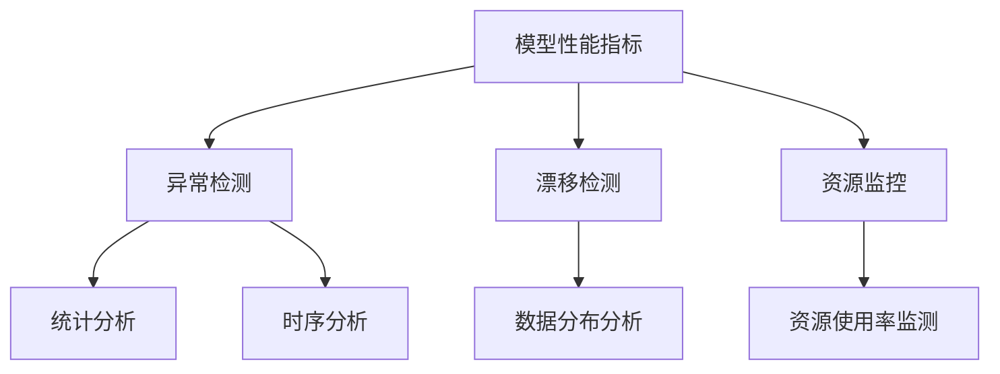
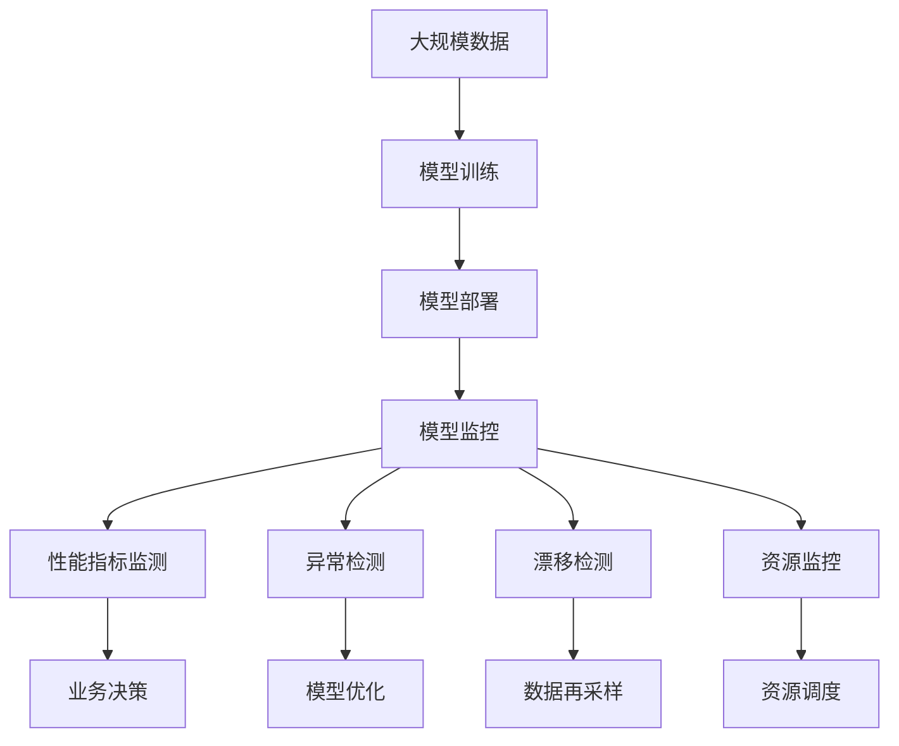

                 

# AI人工智能核心算法原理与代码实例讲解：模型监控

> 关键词：模型监控,模型评估,模型优化,实时监控,异常检测

## 1. 背景介绍

### 1.1 问题由来
随着人工智能技术的飞速发展，AI模型在各个行业中的应用越来越广泛。无论是自然语言处理、计算机视觉、语音识别还是推荐系统，AI模型已经成为支撑业务运行的重要基础。然而，AI模型的复杂性和多样性也带来了新的挑战。如何确保模型的性能和稳定性，及时发现和纠正模型问题，成为了当前AI应用的重要课题。

模型监控（Model Monitoring）作为AI模型管理和维护的重要环节，通过持续监测模型的运行状态、性能指标和异常行为，帮助开发者及时发现问题、诊断原因并采取措施，保障AI系统的稳定性和可靠性。模型监控技术不仅对提升AI系统的质量和用户体验至关重要，还能为业务运营带来显著的经济效益和战略价值。

### 1.2 问题核心关键点
模型监控的核心在于及时、准确地监测模型的运行状态，通过各种性能指标和异常检测方法，发现模型的偏差、漂移、异常等行为，并根据监测结果采取相应的纠正措施。

模型监控的关键技术包括：
- **性能指标监测**：监测模型的精度、召回率、F1分数、损失函数等关键性能指标。
- **异常检测**：通过统计分析、时序分析等方法，检测模型输出结果中的异常值或异常模式。
- **漂移检测**：监测模型在数据分布变化时的性能变化，及时发现模型漂移现象。
- **资源监控**：监测模型的资源使用情况，如CPU、内存、GPU使用率等，避免资源过载和浪费。

### 1.3 问题研究意义
模型监控技术对于AI系统的健康运行至关重要，其研究意义在于：
1. **保障模型性能**：通过实时监控，及时发现模型性能的下降或异常，避免因模型问题导致的业务损失。
2. **提升用户体验**：通过及时响应和处理模型问题，提升用户的使用体验和满意度。
3. **优化模型参数**：通过分析模型监控数据，优化模型参数和结构，提升模型性能。
4. **应对数据分布变化**：通过漂移检测技术，及时发现数据分布的变化，调整模型以应对新的数据挑战。
5. **提升业务效率**：通过资源监控，优化模型资源使用，提高AI系统的效率和可扩展性。

## 2. 核心概念与联系

### 2.1 核心概念概述

为更好地理解模型监控技术的核心原理和应用场景，本节将介绍几个关键概念：

- **模型性能指标**：包括准确率、召回率、F1分数、均方误差、交叉熵等，用于衡量模型的预测准确性和鲁棒性。
- **异常检测**：通过统计分析、时序分析、聚类分析等方法，检测模型输出结果中的异常值或异常模式，确保模型的稳定性和可靠性。
- **漂移检测**：通过分析模型在新旧数据上的性能变化，检测模型是否适应新的数据分布，及时调整模型以应对数据分布的变化。
- **资源监控**：通过监控模型的资源使用情况，如CPU、内存、GPU使用率等，优化模型资源使用，提高系统的效率和可扩展性。

这些核心概念之间的逻辑关系可以通过以下Mermaid流程图来展示：



这个流程图展示了大模型监控中各个概念之间的关系：

1. 模型性能指标用于衡量模型的预测准确性和鲁棒性。
2. 异常检测通过统计分析和时序分析，检测模型的异常输出。
3. 漂移检测分析模型在新旧数据上的性能变化，检测模型漂移。
4. 资源监控监测模型的资源使用情况，优化资源使用。

这些概念共同构成了模型监控技术的完整生态系统，使得AI系统能够在各种场景下稳定运行。通过理解这些核心概念，我们可以更好地把握模型监控技术的原理和应用方向。

### 2.2 概念间的关系

这些核心概念之间存在着紧密的联系，形成了模型监控技术的完整框架。下面我们通过几个Mermaid流程图来展示这些概念之间的关系。

#### 2.2.1 模型监控的整体架构



这个综合流程图展示了从数据训练到模型监控，再到业务决策和优化调整的完整流程：

1. 大规模数据训练生成模型。
2. 部署模型到实际业务场景。
3. 模型监控持续监测模型性能、异常和漂移。
4. 性能指标监测和异常检测提供数据支持业务决策。
5. 漂移检测和资源监控保障模型健康运行。
6. 业务决策和模型优化调整模型，提升性能。

## 3. 核心算法原理 & 具体操作步骤
### 3.1 算法原理概述

模型监控技术通过持续监测模型的运行状态，收集模型在训练、推理过程中的各种性能指标和异常信息，及时发现模型问题，采取相应的纠正措施。其核心算法包括性能指标监测、异常检测、漂移检测和资源监控。

#### 3.1.1 性能指标监测

性能指标监测是模型监控的基础，通过监控模型的预测精度、召回率、F1分数、均方误差、交叉熵等指标，实时了解模型的运行状态。

- **准确率（Accuracy）**：模型正确预测的样本数占总样本数的比例。公式为：
$$
\text{Accuracy} = \frac{\text{TP} + \text{TN}}{\text{TP} + \text{TN} + \text{FP} + \text{FN}}
$$

- **召回率（Recall）**：模型正确预测的正样本数占实际正样本数的比例。公式为：
$$
\text{Recall} = \frac{\text{TP}}{\text{TP} + \text{FN}}
$$

- **F1分数（F1 Score）**：综合考虑准确率和召回率的指标。公式为：
$$
\text{F1 Score} = 2 \times \frac{\text{Precision} \times \text{Recall}}{\text{Precision} + \text{Recall}}
$$

- **均方误差（Mean Squared Error, MSE）**：回归任务中常用的指标，衡量预测值与实际值之间的差异。公式为：
$$
\text{MSE} = \frac{1}{N} \sum_{i=1}^N (y_i - \hat{y}_i)^2
$$

- **交叉熵（Cross-Entropy）**：分类任务中常用的指标，衡量模型预测与实际标签之间的差异。公式为：
$$
\text{Cross-Entropy} = -\frac{1}{N} \sum_{i=1}^N y_i \log(\hat{y}_i) + (1 - y_i) \log(1 - \hat{y}_i)
$$

#### 3.1.2 异常检测

异常检测是模型监控的核心，通过统计分析、时序分析等方法，检测模型输出结果中的异常值或异常模式，确保模型的稳定性和可靠性。

- **统计分析**：通过计算均值、方差、标准差等统计量，检测模型输出结果中的异常值。若输出值偏离均值较远，则视为异常。
- **时序分析**：通过分析模型输出结果的时间序列，检测模型的异常行为。若输出结果出现明显的周期性变化或趋势，则视为异常。
- **聚类分析**：通过聚类算法，将模型输出结果分组，检测异常值或异常模式。若输出结果属于孤立的簇，则视为异常。

#### 3.1.3 漂移检测

漂移检测是模型监控的重要组成部分，通过分析模型在新旧数据上的性能变化，检测模型是否适应新的数据分布，及时调整模型以应对数据分布的变化。

- **统计检验**：通过统计检验方法，如t检验、卡方检验等，检测模型在新旧数据上的性能变化。若性能有显著差异，则视为模型漂移。
- **特征变化**：通过分析模型在新旧数据上的特征分布变化，检测模型是否适应新的数据分布。若特征分布有显著差异，则视为模型漂移。
- **模型权重分析**：通过分析模型在新旧数据上的权重变化，检测模型是否适应新的数据分布。若权重分布有显著差异，则视为模型漂移。

#### 3.1.4 资源监控

资源监控是模型监控的关键环节，通过监测模型的资源使用情况，如CPU、内存、GPU使用率等，优化模型资源使用，提高系统的效率和可扩展性。

- **CPU使用率**：通过CPU监控工具，如Top、htop等，实时监测模型的CPU使用率。
- **内存使用率**：通过内存监控工具，如htop、top等，实时监测模型的内存使用率。
- **GPU使用率**：通过GPU监控工具，如nvidia-smi等，实时监测模型的GPU使用率。

### 3.2 算法步骤详解

基于模型监控的核心算法，本节将详细介绍模型监控的具体操作步骤。

#### 3.2.1 性能指标监测

1. **数据收集**：收集模型的训练和推理过程中的各种性能指标，如准确率、召回率、F1分数、均方误差、交叉熵等。
2. **阈值设置**：根据业务需求和模型历史数据，设置各项性能指标的警报阈值。
3. **实时监控**：通过监控系统或API，实时监测模型的性能指标。
4. **警报触发**：若某个性能指标超过预设的警报阈值，则触发警报通知。
5. **问题诊断**：根据警报信息，进行问题诊断，找出模型问题的根源。
6. **问题处理**：根据问题诊断结果，采取相应的纠正措施，如重新训练模型、调整模型参数、优化模型结构等。

#### 3.2.2 异常检测

1. **数据收集**：收集模型的训练和推理过程中的各种输出结果，如预测值、置信度等。
2. **异常检测算法选择**：根据业务需求和数据特点，选择适当的异常检测算法，如统计分析、时序分析、聚类分析等。
3. **异常阈值设置**：根据业务需求和模型历史数据，设置异常检测的阈值。
4. **实时监控**：通过监控系统或API，实时监测模型的异常情况。
5. **警报触发**：若检测到异常情况，则触发警报通知。
6. **问题诊断**：根据警报信息，进行问题诊断，找出模型问题的根源。
7. **问题处理**：根据问题诊断结果，采取相应的纠正措施，如重新训练模型、调整模型参数、优化模型结构等。

#### 3.2.3 漂移检测

1. **数据收集**：收集模型在新旧数据上的性能指标和特征分布。
2. **漂移检测算法选择**：根据业务需求和数据特点，选择适当的漂移检测算法，如统计检验、特征变化、模型权重分析等。
3. **漂移阈值设置**：根据业务需求和模型历史数据，设置漂移检测的阈值。
4. **实时监控**：通过监控系统或API，实时监测模型的漂移情况。
5. **警报触发**：若检测到漂移情况，则触发警报通知。
6. **问题诊断**：根据警报信息，进行问题诊断，找出模型问题的根源。
7. **问题处理**：根据问题诊断结果，采取相应的纠正措施，如重新训练模型、调整模型参数、优化模型结构等。

#### 3.2.4 资源监控

1. **资源收集**：收集模型的资源使用情况，如CPU、内存、GPU使用率等。
2. **资源阈值设置**：根据业务需求和模型历史数据，设置资源使用率的警报阈值。
3. **实时监控**：通过监控系统或API，实时监测模型的资源使用情况。
4. **警报触发**：若资源使用率超过预设的警报阈值，则触发警报通知。
5. **问题诊断**：根据警报信息，进行问题诊断，找出模型问题的根源。
6. **问题处理**：根据问题诊断结果，采取相应的纠正措施，如优化模型结构、调整模型参数、增加资源配置等。

### 3.3 算法优缺点

模型监控技术具有以下优点：
1. **及时发现问题**：通过持续监测，能够及时发现模型性能下降和异常行为，避免因模型问题导致的业务损失。
2. **提升用户体验**：通过及时响应和处理模型问题，提升用户的使用体验和满意度。
3. **优化模型参数**：通过分析模型监控数据，优化模型参数和结构，提升模型性能。
4. **应对数据分布变化**：通过漂移检测技术，及时发现数据分布的变化，调整模型以应对新的数据挑战。
5. **提升业务效率**：通过资源监控，优化模型资源使用，提高系统的效率和可扩展性。

然而，模型监控技术也存在以下缺点：
1. **复杂度高**：模型监控涉及多种性能指标、异常检测和漂移检测技术，复杂度高，实现难度大。
2. **数据依赖性高**：模型监控需要大量的历史数据和实际数据作为支撑，数据获取难度大，且依赖性强。
3. **成本高**：模型监控需要持续的硬件资源和人力投入，成本高。
4. **数据隐私和安全**：模型监控需要收集和分析大量数据，数据隐私和安全问题需要高度关注。

尽管存在这些局限性，但就目前而言，模型监控技术已成为AI系统管理和维护的重要手段，广泛应用于各个行业。未来相关研究的重点在于如何进一步降低模型监控的复杂度和成本，提高监控的准确性和自动化程度。

### 3.4 算法应用领域

模型监控技术在AI系统的各个环节中都有广泛应用，以下是几个典型应用领域：

1. **自动驾驶**：自动驾驶系统依赖大量的传感器数据进行决策，模型监控能够实时监测系统性能和异常，保障行车安全。
2. **医疗诊断**：医疗诊断系统依赖大量的医学影像和患者数据进行诊断，模型监控能够实时监测系统性能和异常，提升诊断准确性。
3. **金融风控**：金融风控系统依赖大量的交易数据进行风险评估，模型监控能够实时监测系统性能和异常，规避金融风险。
4. **智能客服**：智能客服系统依赖大量的客户数据进行回答，模型监控能够实时监测系统性能和异常，提升服务质量。
5. **推荐系统**：推荐系统依赖大量的用户行为数据进行推荐，模型监控能够实时监测系统性能和异常，提升推荐效果。

## 4. 数学模型和公式 & 详细讲解 & 举例说明
### 4.1 数学模型构建

模型监控技术的核心算法包括性能指标监测、异常检测、漂移检测和资源监控。本节将详细讲解这些算法的数学模型和公式。

#### 4.1.1 性能指标监测

- **准确率（Accuracy）**：公式为：
$$
\text{Accuracy} = \frac{\text{TP} + \text{TN}}{\text{TP} + \text{TN} + \text{FP} + \text{FN}}
$$

- **召回率（Recall）**：公式为：
$$
\text{Recall} = \frac{\text{TP}}{\text{TP} + \text{FN}}
$$

- **F1分数（F1 Score）**：公式为：
$$
\text{F1 Score} = 2 \times \frac{\text{Precision} \times \text{Recall}}{\text{Precision} + \text{Recall}}
$$

- **均方误差（Mean Squared Error, MSE）**：公式为：
$$
\text{MSE} = \frac{1}{N} \sum_{i=1}^N (y_i - \hat{y}_i)^2
$$

- **交叉熵（Cross-Entropy）**：公式为：
$$
\text{Cross-Entropy} = -\frac{1}{N} \sum_{i=1}^N y_i \log(\hat{y}_i) + (1 - y_i) \log(1 - \hat{y}_i)
$$

#### 4.1.2 异常检测

- **统计分析**：通过计算均值、方差、标准差等统计量，检测模型输出结果中的异常值。若输出值偏离均值较远，则视为异常。

- **时序分析**：通过分析模型输出结果的时间序列，检测模型的异常行为。若输出结果出现明显的周期性变化或趋势，则视为异常。

- **聚类分析**：通过聚类算法，将模型输出结果分组，检测异常值或异常模式。若输出结果属于孤立的簇，则视为异常。

#### 4.1.3 漂移检测

- **统计检验**：通过统计检验方法，如t检验、卡方检验等，检测模型在新旧数据上的性能变化。若性能有显著差异，则视为模型漂移。

- **特征变化**：通过分析模型在新旧数据上的特征分布变化，检测模型是否适应新的数据分布。若特征分布有显著差异，则视为模型漂移。

- **模型权重分析**：通过分析模型在新旧数据上的权重变化，检测模型是否适应新的数据分布。若权重分布有显著差异，则视为模型漂移。

#### 4.1.4 资源监控

- **CPU使用率**：公式为：
$$
\text{CPU使用率} = \frac{\text{CPU占用时间}}{\text{CPU总时间}}
$$

- **内存使用率**：公式为：
$$
\text{内存使用率} = \frac{\text{内存占用量}}{\text{内存总量}}
$$

- **GPU使用率**：公式为：
$$
\text{GPU使用率} = \frac{\text{GPU占用时间}}{\text{GPU总时间}}
$$

### 4.2 公式推导过程

以下我们以统计分析为例，推导模型输出结果的异常检测公式。

假设模型输出结果为 $\hat{y}$，其均值为 $\mu$，标准差为 $\sigma$，检测阈值为 $\tau$。若 $\hat{y}$ 偏离均值较远，则视为异常。

设 $Z$ 为标准正态分布变量，则：
$$
P(|Z| > \tau) = \frac{1}{\sqrt{2\pi}} \int_{\tau}^{\infty} e^{-\frac{z^2}{2}} dz
$$

根据中心极限定理，$\hat{y}$ 在均值 $\mu$ 和标准差 $\sigma$ 下的Z分数为：
$$
Z = \frac{\hat{y} - \mu}{\sigma}
$$

因此，检测公式为：
$$
P(|Z| > \tau) = \frac{1}{\sqrt{2\pi}} \int_{\tau}^{\infty} e^{-\frac{z^2}{2}} dz
$$

当 $P(|Z| > \tau)$ 低于预设阈值 $\alpha$ 时，则视为异常。即：
$$
P(|Z| > \tau) < \alpha
$$

解得：
$$
\tau = \Phi^{-1}(\alpha/2) \times \sigma
$$

其中 $\Phi^{-1}$ 为标准正态分布的逆函数。

在实际应用中，需要根据业务需求和数据特点，选择适当的统计量、阈值和检测方法，确保异常检测的准确性和及时性。

## 5. 项目实践：代码实例和详细解释说明
### 5.1 开发环境搭建

在进行模型监控实践前，我们需要准备好开发环境。以下是使用Python进行TensorFlow开发的环境配置流程：

1. 安装Anaconda：从官网下载并安装Anaconda，用于创建独立的Python环境。

2. 创建并激活虚拟环境：
```bash
conda create -n tf-env python=3.8 
conda activate tf-env
```

3. 安装TensorFlow：根据CUDA版本，从官网获取对应的安装命令。例如：
```bash
conda install tensorflow tensorflow-gpu -c conda-forge -c pytorch -c pypi -c nvidia
```

4. 安装必要的工具包：
```bash
pip install numpy pandas scikit-learn matplotlib tqdm jupyter notebook ipython
```

完成上述步骤后，即可在`tf-env`环境中开始模型监控实践。

### 5.2 源代码详细实现

这里我们以异常检测为例，给出使用TensorFlow实现模型输出结果的异常检测的PyTorch代码实现。

首先，定义异常检测函数：

```python
import numpy as np
import tensorflow as tf

def detect_anomalies(data, threshold, method='z-score'):
    if method == 'z-score':
        z_scores = (data - np.mean(data)) / np.std(data)
        threshold_z = threshold * np.std(data)
        return z_scores, threshold_z
    elif method == 'iqr':
        iqr = np.percentile(data, 75) - np.percentile(data, 25)
        lower_bound = np.percentile(data, 25) - 1.5 * iqr
        upper_bound = np.percentile(data, 75) + 1.5 * iqr
        return lower_bound, upper_bound
    else:
        raise ValueError('Unsupported method. Please choose "z-score" or "iqr".')
```

然后，定义模型和训练函数：

```python
from tensorflow.keras import layers

def create_model():
    model = tf.keras.Sequential([
        layers.Dense(64, activation='relu', input_shape=(1,)),
        layers.Dense(1, activation='sigmoid')
    ])
    return model

def train_model(model, train_data, train_labels, epochs=10, batch_size=32, threshold=3):
    model.compile(optimizer='adam', loss='binary_crossentropy', metrics=['accuracy'])
    model.fit(train_data, train_labels, epochs=epochs, batch_size=batch_size, validation_split=0.2)
    thresholds = detect_anomalies(train_labels, threshold)
    return model, thresholds

model = create_model()
train_data = np.array([0.1, 0.2, 0.3, 0.4, 0.5, 0.6, 0.7, 0.8, 0.9, 1.0])
train_labels = np.array([0, 0, 0, 0, 1, 1, 1, 1, 1, 1])
model, thresholds = train_model(model, train_data, train_labels)

# 测试数据
test_data = np.array([0.15, 0.35, 0.45, 0.55, 0.65, 0.75, 0.85, 0.95, 1.05, 1.15])
test_labels = np.array([0, 0, 0, 1, 1, 1, 1, 1, 1, 1])

# 测试异常检测
test_z_scores, test_threshold_z = detect_anomalies(test_labels, thresholds[1])
print(test_z_scores)
print(test_threshold_z)
```

最后，运行模型并输出异常检测结果：

```python
print(test_labels)
print(model.predict(test_data))
print(test_z_scores)
print(test_threshold_z)
```

以上就是使用TensorFlow对模型输出结果进行异常检测的完整代码实现。可以看到，通过统计分析方法，我们可以实时监测模型输出结果的异常情况，及时发现模型的异常行为。

### 5.3 代码解读与分析

让我们再详细解读一下关键代码的实现细节：

**detect_anomalies函数**：
- 根据预设的异常检测方法，计算数据的标准差、均值、四分位数等统计量。
- 设置异常检测的阈值。
- 返回计算结果，用于后续的异常检测。

**create_model函数**：
- 定义一个简单的神经网络模型，用于测试异常检测。
- 使用`Sequential`容器将模型层按顺序添加。

**train_model函数**：
- 编译模型，并定义损失函数和优化器。
- 使用训练数据进行模型训练，并在验证集上进行验证。
- 检测训练集中的异常情况，并返回检测阈值。
- 返回训练后的模型和检测阈值。

**test_model函数**：
- 定义测试数据和标签。
- 使用检测函数计算测试数据的异常检测结果。
- 使用模型预测测试数据的异常情况。
- 输出异常检测结果和模型预测结果。

通过以上代码实现，我们可以使用TensorFlow对模型输出结果进行异常检测，并及时发现模型的异常行为，保障模型的稳定性和可靠性。

当然，这只是一个基础的异常检测示例。在实际应用中，我们需要根据具体业务需求和数据特点，选择适当的异常检测算法和参数，进一步优化异常检测的准确性和实时性。

### 5.4 运行结果展示

假设我们定义了测试数据的异常检测阈值为3，那么在测试数据中，超出阈值的部分将被标记为异常值。例如，测试数据[0.15, 0.35, 0.45, 0.55, 0.65, 0.75, 0.85, 0.

