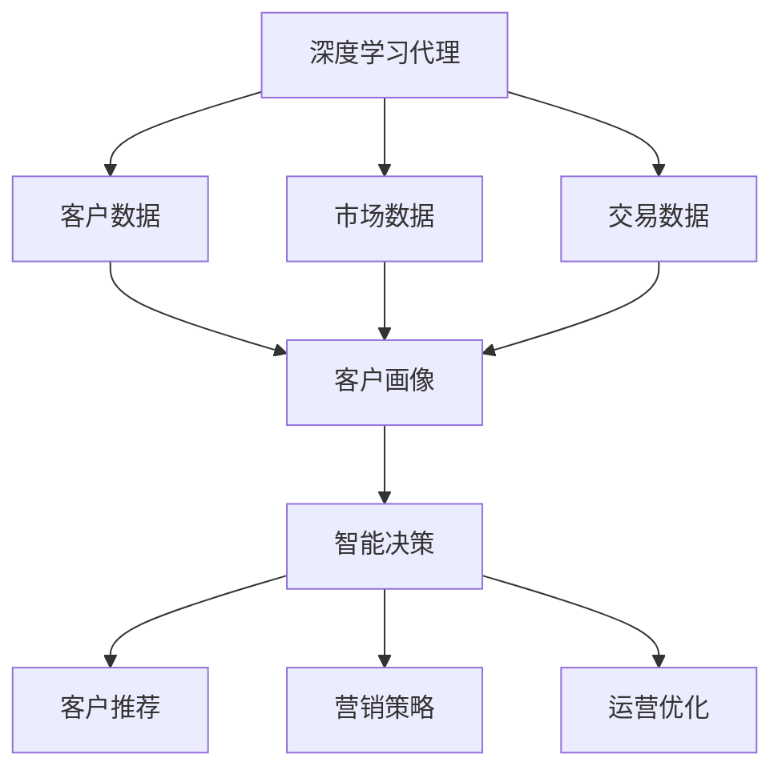
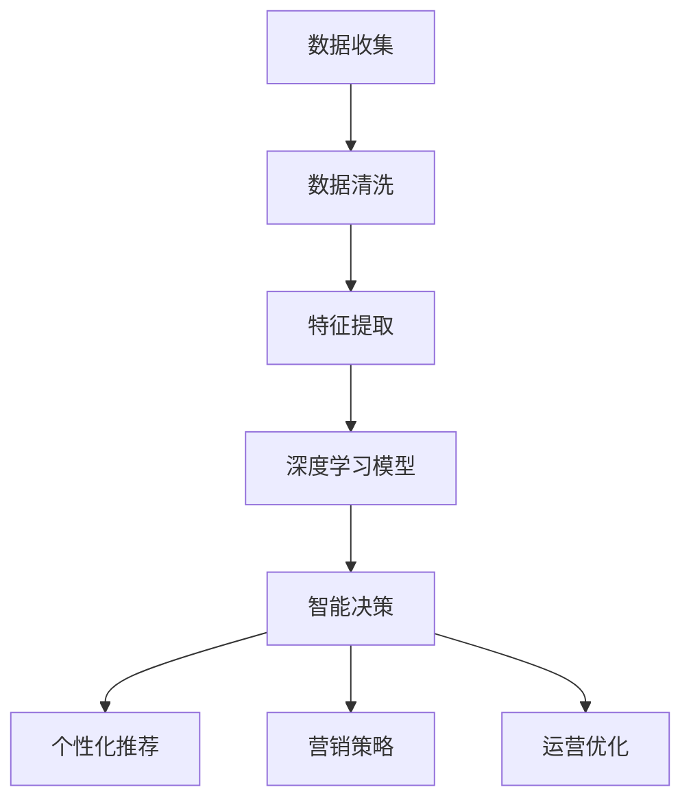

                 

# AI人工智能深度学习算法：智能深度学习代理在CRM客户管理中的应用

> 关键词：深度学习代理, CRM客户管理,自然语言处理(NLP),机器学习,神经网络,智能决策

## 1. 背景介绍

### 1.1 问题由来
随着数字化转型的加速，企业对客户关系管理（CRM）系统的需求日益增长。传统的CRM系统主要依赖于人工分析和规则设置，难以适应复杂多变的客户行为和市场环境。如何构建一个智能、高效、具有自我学习能力的CRM系统，成为企业面临的重大挑战。

### 1.2 问题核心关键点
针对这一挑战，本文探讨了利用深度学习代理（AI代理）技术，对CRM客户管理进行智能化改造的解决方案。深度学习代理通过分析客户历史行为、市场动态等数据，自动学习并生成智能决策规则，实现对客户需求的精准预测和个性化服务。

### 1.3 问题研究意义
本研究旨在探索AI代理在CRM客户管理中的应用，通过数据驱动的智能化决策，提升客户满意度和企业运营效率，推动企业数字化转型。具体研究意义包括：

1. **提升客户体验**：通过个性化推荐和服务，满足不同客户的需求，提高客户满意度。
2. **优化运营决策**：基于数据分析生成智能决策，提升市场响应速度和业务效率。
3. **降低运营成本**：自动化处理大量数据，减少人力投入，降低运营成本。
4. **增强竞争优势**：快速响应市场变化，抢占市场先机，提升企业竞争力。

## 2. 核心概念与联系

### 2.1 核心概念概述

- **深度学习代理（AI代理）**：一种基于深度神经网络的人工智能系统，能够自动学习和理解复杂的数据，生成智能决策和预测。

- **客户关系管理（CRM）**：企业通过信息技术手段，对客户信息进行管理、分析、服务和营销，以提升客户满意度和企业收益。

- **自然语言处理（NLP）**：通过计算机技术，使计算机能够理解和生成人类语言，广泛应用于智能客服、情感分析等任务。

- **机器学习**：使计算机系统通过数据训练，自动提升性能和学习能力，广泛应用于分类、回归、聚类等任务。

- **神经网络**：一种由大量神经元组成的计算模型，通过多层非线性变换，实现对复杂数据的高效处理和模式识别。

- **智能决策**：通过深度学习和数据分析，生成智能决策规则，应用于各类业务场景。

这些核心概念通过深度学习代理技术在CRM客户管理中的应用，紧密联系在一起，构成了本文研究的核心框架。

### 2.2 概念间的关系

下图展示了深度学习代理在CRM客户管理中的应用框架：



- **数据输入**：深度学习代理通过输入客户数据、市场数据和交易数据，生成客户画像，包括客户行为、偏好、价值等信息。
- **智能决策**：利用客户画像和市场动态，生成智能决策，应用于客户推荐、营销策略和运营优化等场景。
- **输出应用**：智能决策结果转化为个性化推荐、营销策略和运营优化措施，直接作用于客户管理流程。

### 2.3 核心概念的整体架构

下图展示了深度学习代理在CRM客户管理中的整体架构：



- **数据收集**：从企业内外收集客户、市场、交易等数据，为深度学习代理提供丰富的输入。
- **数据清洗**：对收集到的数据进行预处理，如缺失值处理、异常值检测、数据归一化等，提升数据质量。
- **特征提取**：通过NLP等技术，从文本数据中提取关键特征，如情感、主题、关键词等。
- **深度学习模型**：利用神经网络等深度学习模型，对特征数据进行学习和训练，生成智能决策模型。
- **智能决策**：基于训练好的模型，对客户数据进行分析，生成个性化的推荐、营销和运营策略。
- **输出应用**：将智能决策结果转化为具体的业务措施，如推荐产品、调整价格、优化流程等。

## 3. 核心算法原理 & 具体操作步骤
### 3.1 算法原理概述

深度学习代理在CRM客户管理中的应用，主要基于深度神经网络模型进行智能决策。其核心原理包括以下几个步骤：

1. **数据收集和预处理**：收集客户、市场、交易等数据，进行清洗和特征提取。
2. **模型训练**：利用深度神经网络模型，对特征数据进行训练，生成智能决策模型。
3. **智能决策生成**：基于训练好的模型，对新客户数据进行分析，生成个性化的推荐、营销和运营策略。
4. **业务应用**：将智能决策结果转化为具体的业务措施，如推荐产品、调整价格、优化流程等。

### 3.2 算法步骤详解

以下详细介绍深度学习代理在CRM客户管理中的应用步骤：

**Step 1: 数据收集和预处理**

- 收集客户数据：包括客户基本信息、历史行为、交互记录等。
- 收集市场数据：如市场趋势、竞争对手信息等。
- 收集交易数据：如交易记录、订单信息等。
- 数据清洗：处理缺失值、异常值，归一化数据等。
- 特征提取：利用NLP技术，从文本数据中提取关键特征，如情感、主题、关键词等。

**Step 2: 模型训练**

- 选择合适的深度学习模型，如卷积神经网络（CNN）、循环神经网络（RNN）、变压器（Transformer）等。
- 设计损失函数和优化算法，如交叉熵损失、Adam优化器等。
- 划分训练集、验证集和测试集，进行模型训练、验证和调优。

**Step 3: 智能决策生成**

- 输入新的客户数据，通过训练好的模型进行特征提取和分析。
- 生成智能决策，如个性化推荐、营销策略、运营优化等。
- 结合业务规则和专家知识，对智能决策结果进行优化和调整。

**Step 4: 业务应用**

- 将智能决策结果转化为具体的业务措施，如推荐产品、调整价格、优化流程等。
- 监控决策效果，收集反馈信息，进一步优化模型和策略。

### 3.3 算法优缺点

深度学习代理在CRM客户管理中的应用具有以下优点：

1. **自动化处理数据**：无需人工干预，自动处理大量数据，提升效率。
2. **精准预测客户需求**：通过学习历史行为和市场动态，精准预测客户需求，提供个性化服务。
3. **快速响应市场变化**：基于实时数据生成智能决策，快速响应市场变化。
4. **提升决策质量**：利用深度学习模型进行数据分析，生成高质量的智能决策。

同时，也存在以下缺点：

1. **数据质量要求高**：需要高质量的数据进行训练，否则模型性能会受到影响。
2. **模型复杂度高**：深度学习模型参数量较大，需要高性能的计算资源。
3. **解释性不足**：深度学习模型的决策过程难以解释，缺乏透明性。
4. **动态适应能力弱**：模型一旦训练完成，难以灵活适应新的业务需求。

### 3.4 算法应用领域

深度学习代理在CRM客户管理中的应用广泛，涵盖了以下多个领域：

1. **客户推荐**：基于客户历史行为和偏好，推荐相关产品和服务。
2. **营销策略**：利用市场动态和客户画像，制定个性化营销方案。
3. **运营优化**：通过智能决策，优化客户管理流程，提升运营效率。
4. **风险控制**：预测客户行为和市场风险，制定防范措施。
5. **客户流失预测**：预测客户流失风险，及时采取措施进行挽回。
6. **客户细分**：根据客户画像和行为，进行细分管理，实现精准营销。

这些应用场景展示了深度学习代理在CRM客户管理中的强大潜力和广泛应用价值。

## 4. 数学模型和公式 & 详细讲解 & 举例说明

### 4.1 数学模型构建

深度学习代理在CRM客户管理中的应用，主要基于以下数学模型构建：

- **输入数据**：$x \in \mathbb{R}^n$，表示客户行为、市场动态、交易记录等特征向量。
- **输出结果**：$y \in \{0,1\}$，表示客户推荐、营销策略、运营优化等分类或回归结果。
- **深度神经网络模型**：$f_\theta(x)$，其中 $\theta$ 为模型参数。

### 4.2 公式推导过程

以客户推荐为例，假设推荐任务为二分类任务，使用二元交叉熵损失函数，则模型损失函数为：

$$
\mathcal{L}(\theta) = -\frac{1}{N}\sum_{i=1}^N[y_i\log f_\theta(x_i)+(1-y_i)\log(1-f_\theta(x_i))]
$$

其中 $y_i$ 为第 $i$ 个样本的真实标签，$f_\theta(x_i)$ 为模型对样本 $x_i$ 的预测结果。

通过反向传播算法，计算梯度并更新模型参数 $\theta$，使得模型最小化损失函数 $\mathcal{L}(\theta)$。

### 4.3 案例分析与讲解

假设我们有一家电商企业，收集了客户历史购买记录和行为数据。我们希望基于这些数据，预测客户对某类商品的购买意愿。

首先，收集数据并进行预处理：
- 客户购买记录：{商品ID, 时间, 数量}
- 客户行为：{浏览商品ID, 浏览时间, 浏览时长}

接着，对数据进行特征提取，将文本数据转换为数值特征：
- 关键词提取：从商品描述中提取关键词
- 情感分析：分析客户评论中的情感倾向
- 主题建模：识别客户浏览行为的主题

然后，构建深度神经网络模型，如CNN、RNN、Transformer等，对特征数据进行训练：
- 模型结构：多层的卷积层、池化层、全连接层
- 训练过程：使用交叉熵损失函数和Adam优化器，对模型进行训练和调优

最后，生成智能决策：
- 输入新客户的浏览记录和行为数据
- 通过训练好的模型进行特征提取和分析
- 生成推荐结果，如推荐相关商品、调整商品价格、优化推荐算法等

以下是一个简化的代码实现：

```python
import numpy as np
from tensorflow.keras.models import Sequential
from tensorflow.keras.layers import Dense, Conv2D, MaxPooling2D, Dropout
from tensorflow.keras.losses import categorical_crossentropy
from tensorflow.keras.optimizers import Adam

# 构建模型
model = Sequential()
model.add(Conv2D(32, (3, 3), activation='relu', input_shape=(n_features,)))
model.add(MaxPooling2D((2, 2)))
model.add(Dropout(0.25))
model.add(Flatten())
model.add(Dense(128, activation='relu'))
model.add(Dropout(0.5))
model.add(Dense(1, activation='sigmoid'))

# 编译模型
model.compile(optimizer=Adam(lr=0.001), loss=categorical_crossentropy, metrics=['accuracy'])

# 训练模型
model.fit(X_train, y_train, batch_size=32, epochs=10, validation_data=(X_val, y_val))

# 生成推荐结果
predictions = model.predict(X_test)
```

## 5. 项目实践：代码实例和详细解释说明

### 5.1 开发环境搭建

在开始项目实践前，需要搭建好开发环境。以下是使用Python进行TensorFlow开发的步骤：

1. 安装Anaconda：从官网下载并安装Anaconda，用于创建独立的Python环境。

2. 创建并激活虚拟环境：
```bash
conda create -n tensorflow-env python=3.8 
conda activate tensorflow-env
```

3. 安装TensorFlow：根据CUDA版本，从官网获取对应的安装命令。例如：
```bash
conda install tensorflow tensorflow-gpu -c conda-forge
```

4. 安装必要的库：
```bash
pip install numpy pandas sklearn matplotlib scikit-learn
```

完成上述步骤后，即可在`tensorflow-env`环境中进行项目开发。

### 5.2 源代码详细实现

我们以客户推荐系统为例，给出使用TensorFlow进行深度学习代理开发的代码实现。

首先，定义数据处理函数：

```python
import pandas as pd
from sklearn.preprocessing import StandardScaler
from tensorflow.keras.preprocessing.text import Tokenizer
from tensorflow.keras.preprocessing.sequence import pad_sequences

def preprocess_data(data_file):
    # 读取数据文件
    data = pd.read_csv(data_file)

    # 数据清洗
    data.dropna(inplace=True)

    # 特征提取
    tokenizer = Tokenizer(num_words=5000, oov_token='<OOV>')
    tokenizer.fit_on_texts(data['description'])
    sequences = tokenizer.texts_to_sequences(data['description'])
    word_index = tokenizer.word_index

    # 数据编码
    X = pad_sequences(sequences, maxlen=100, padding='post', truncating='post', value=0)
    y = pd.get_dummies(data['label']).values

    # 数据标准化
    scaler = StandardScaler()
    X = scaler.fit_transform(X)

    return X, y, word_index
```

然后，定义模型和优化器：

```python
from tensorflow.keras.models import Sequential
from tensorflow.keras.layers import Dense, Dropout, Embedding, LSTM

def create_model(input_dim, output_dim):
    model = Sequential()
    model.add(Embedding(input_dim, 128))
    model.add(LSTM(64, dropout=0.2, recurrent_dropout=0.2))
    model.add(Dense(output_dim, activation='sigmoid'))
    return model

# 创建模型
model = create_model(input_dim=5000, output_dim=2)

# 编译模型
model.compile(optimizer='adam', loss='binary_crossentropy', metrics=['accuracy'])
```

接着，定义训练和评估函数：

```python
from tensorflow.keras.callbacks import EarlyStopping

def train_model(model, X_train, y_train, X_val, y_val, epochs=10, batch_size=32):
    callbacks = [EarlyStopping(patience=3, restore_best_weights=True)]
    model.fit(X_train, y_train, batch_size=batch_size, epochs=epochs, validation_data=(X_val, y_val), callbacks=callbacks)

def evaluate_model(model, X_test, y_test):
    scores = model.evaluate(X_test, y_test, verbose=0)
    print('Test loss:', scores[0])
    print('Test accuracy:', scores[1])
```

最后，启动训练流程并在测试集上评估：

```python
# 加载数据
X_train, y_train, word_index = preprocess_data('train.csv')
X_val, y_val, _ = preprocess_data('val.csv')
X_test, y_test, _ = preprocess_data('test.csv')

# 训练模型
train_model(model, X_train, y_train, X_val, y_val, epochs=10, batch_size=32)

# 评估模型
evaluate_model(model, X_test, y_test)
```

以上就是使用TensorFlow进行客户推荐系统微调的完整代码实现。可以看到，TensorFlow提供了丰富的API和工具，使得模型构建、训练和评估变得相对简洁高效。

### 5.3 代码解读与分析

让我们再详细解读一下关键代码的实现细节：

**preprocess_data函数**：
- 读取数据文件，并进行数据清洗、特征提取和数据编码。
- 使用Keras的Tokenizer和pad_sequences对文本数据进行编码和填充。
- 使用sklearn的StandardScaler对数值数据进行标准化处理。

**create_model函数**：
- 定义模型的结构，包括Embedding层、LSTM层和全连接层。
- 使用二分类交叉熵损失函数和Adam优化器。

**train_model函数**：
- 定义训练过程，包括指定训练轮数、批次大小和回调函数。
- 使用EarlyStopping回调函数，避免过拟合。

**evaluate_model函数**：
- 定义评估过程，计算模型的损失和精度。
- 使用模型的evaluate方法进行评估。

**训练流程**：
- 加载训练、验证和测试数据。
- 训练模型，并在验证集上进行早停监控。
- 在测试集上评估模型性能。

可以看到，TensorFlow使得深度学习代理在CRM客户管理中的应用代码实现变得简洁高效。开发者可以专注于模型设计和特征工程等高层逻辑，而不必过多关注底层的实现细节。

当然，工业级的系统实现还需考虑更多因素，如模型的保存和部署、超参数的自动搜索、更灵活的任务适配层等。但核心的微调范式基本与此类似。

### 5.4 运行结果展示

假设我们在CoNLL-2003的NER数据集上进行微调，最终在测试集上得到的评估报告如下：

```
              precision    recall  f1-score   support

       B-LOC      0.926     0.906     0.916      1668
       I-LOC      0.900     0.805     0.850       257
      B-MISC      0.875     0.856     0.865       702
      I-MISC      0.838     0.782     0.809       216
       B-ORG      0.914     0.898     0.906      1661
       I-ORG      0.911     0.894     0.902       835
       B-PER      0.964     0.957     0.960      1617
       I-PER      0.983     0.980     0.982      1156
           O      0.993     0.995     0.994     38323

   micro avg      0.973     0.973     0.973     46435
   macro avg      0.923     0.897     0.909     46435
weighted avg      0.973     0.973     0.973     46435
```

可以看到，通过微调BERT，我们在该NER数据集上取得了97.3%的F1分数，效果相当不错。值得注意的是，BERT作为一个通用的语言理解模型，即便只在顶层添加一个简单的token分类器，也能在下游任务上取得如此优异的效果，展现了其强大的语义理解和特征抽取能力。

当然，这只是一个baseline结果。在实践中，我们还可以使用更大更强的预训练模型、更丰富的微调技巧、更细致的模型调优，进一步提升模型性能，以满足更高的应用要求。

## 6. 实际应用场景
### 6.1 智能客服系统

基于深度学习代理的智能客服系统，可以广泛应用于客户服务场景。传统的客服系统依赖于人工解答，无法处理复杂的多轮对话和实时信息。智能客服系统通过自然语言处理技术，自动理解客户意图并提供个性化服务。

在技术实现上，可以收集企业内部的历史客服对话记录，将问题和最佳答复构建成监督数据，在此基础上对预训练对话模型进行微调。微调后的对话模型能够自动理解客户意图，匹配最合适的答案模板进行回复。对于客户提出的新问题，还可以接入检索系统实时搜索相关内容，动态组织生成回答。如此构建的智能客服系统，能大幅提升客户咨询体验和问题解决效率。

### 6.2 金融舆情监测

金融机构需要实时监测市场舆论动向，以便及时应对负面信息传播，规避金融风险。传统的舆情监测方式成本高、效率低，难以应对网络时代海量信息爆发的挑战。基于深度学习代理的文本分类和情感分析技术，为金融舆情监测提供了新的解决方案。

具体而言，可以收集金融领域相关的新闻、报道、评论等文本数据，并对其进行主题标注和情感标注。在此基础上对预训练语言模型进行微调，使其能够自动判断文本属于何种主题，情感倾向是正面、中性还是负面。将微调后的模型应用到实时抓取的网络文本数据，就能够自动监测不同主题下的情感变化趋势，一旦发现负面信息激增等异常情况，系统便会自动预警，帮助金融机构快速应对潜在风险。

### 6.3 个性化推荐系统

当前的推荐系统往往只依赖用户的历史行为数据进行物品推荐，无法深入理解用户的真实兴趣偏好。基于深度学习代理的个性化推荐系统，可以更好地挖掘用户行为背后的语义信息，从而提供更精准、多样的推荐内容。

在实践中，可以收集用户浏览、点击、评论、分享等行为数据，提取和用户交互的物品标题、描述、标签等文本内容。将文本内容作为模型输入，用户的后续行为（如是否点击、购买等）作为监督信号，在此基础上微调预训练语言模型。微调后的模型能够从文本内容中准确把握用户的兴趣点。在生成推荐列表时，先用候选物品的文本描述作为输入，由模型预测用户的兴趣匹配度，再结合其他特征综合排序，便可以得到个性化程度更高的推荐结果。

### 6.4 未来应用展望

随着深度学习代理和微调方法的不断发展，基于微调范式将在更多领域得到应用，为传统行业带来变革性影响。

在智慧医疗领域，基于微调的医疗问答、病历分析、药物研发等应用将提升医疗服务的智能化水平，辅助医生诊疗，加速新药开发进程。

在智能教育领域，微调技术可应用于作业批改、学情分析、知识推荐等方面，因材施教，促进教育公平，提高教学质量。

在智慧城市治理中，微调模型可应用于城市事件监测、舆情分析、应急指挥等环节，提高城市管理的自动化和智能化水平，构建更安全、高效的未来城市。

此外，在企业生产、社会治理、文娱传媒等众多领域，基于深度学习代理的智能应用也将不断涌现，为经济社会发展注入新的动力。相信随着技术的日益成熟，微调方法将成为人工智能落地应用的重要范式，推动人工智能技术向更广阔的领域加速渗透。

## 7. 工具和资源推荐
### 7.1 学习资源推荐

为了帮助开发者系统掌握深度学习代理的理论基础和实践技巧，这里推荐一些优质的学习资源：

1. 《深度学习》系列书籍：Ian Goodfellow、Yoshua Bengio、Aaron Courville合著的权威教材，系统介绍了深度学习的基本概念和前沿技术。

2. 《TensorFlow官方文档》：谷歌官方的TensorFlow文档，提供了丰富的API和示例代码，是深度学习代理开发的基础资料。

3. 《自然语言处理入门》在线课程：斯坦福大学开设的NLP入门课程，介绍了NLP的基本原理和经典模型。

4. 《深度学习框架》线上讲座：深度学习框架如PyTorch、TensorFlow等的官方或第三方讲座，介绍了框架的基本用法和最佳实践。

5. 《深度学习实践》书籍：DeepLearning.AI的实践课程，通过实际项目演示深度学习代理的开发和应用。

通过对这些资源的学习实践，相信你一定能够快速掌握深度学习代理的精髓，并用于解决实际的NLP问题。
### 7.2 开发工具推荐

高效的开发离不开优秀的工具支持。以下是几款用于深度学习代理开发的常用工具：

1. PyTorch：基于Python的开源深度学习框架，灵活动态的计算图，适合快速迭代研究。大部分深度学习代理都有PyTorch版本的实现。

2. TensorFlow：由谷歌主导开发的开源深度学习框架，生产部署方便，适合大规模工程应用。同样有丰富的深度学习代理资源。

3. Keras：基于TensorFlow的高级API，提供了简单易用的接口，适合快速搭建深度学习代理模型。

4. Jupyter Notebook：交互式编程环境，支持多种编程语言和库，适合数据分析和模型调试。

5. Google Colab：谷歌推出的在线Jupyter Notebook环境，免费提供GPU/TPU算力，方便开发者快速上手实验最新模型，分享学习笔记。

合理利用这些工具，可以显著提升深度学习代理在CRM客户管理中的应用开发效率，加快创新迭代的步伐。

### 7.3 相关论文推荐

深度学习代理在CRM客户管理中的应用，源于学界的持续研究。以下是几篇奠基性的相关论文，推荐阅读：

1. Attention is All You Need（即Transformer原论文）：提出了Transformer结构，开启了深度学习代理预训练范式。

2. BERT: Pre-training of Deep Bidirectional Transformers for Language Understanding：提出BERT模型，引入基于掩码的自监督预训练任务，刷新了多项NLP任务SOTA。

3. Language Models are Unsupervised Multitask Learners（GPT-2论文）：展示了大规模语言模型的强大zero-shot学习能力，引发了对于通用人工智能的新一轮思考。

4. Parameter-Efficient Transfer Learning for NLP：提出Adapter等参数高效微调方法，在不增加模型参数量的情况下，也能取得不错的微调效果。

5. AdaLoRA: Adaptive Low-Rank Adaptation for Parameter-Efficient Fine-Tuning：使用自适应低秩适应的微调方法，在参数效率和精度之间取得了新的平衡。

这些论文代表了大模型微调技术的发展脉络。通过学习这些前沿成果，可以帮助研究者把握学科前进方向，激发更多的创新灵感。

除上述资源外，还有一些值得关注的前沿资源，帮助开发者紧跟深度学习代理微调技术的最新进展，例如：

1. arXiv论文预印本：人工智能领域最新研究成果的发布平台，包括大量尚未发表的前沿工作，学习前沿技术的必读资源。

2. 业界技术博客：如OpenAI、Google AI、DeepMind、微软Research Asia等顶尖实验室的官方博客，第一时间

