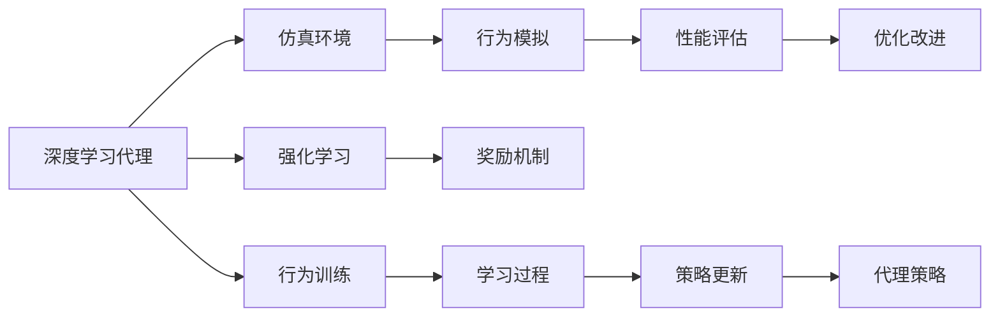
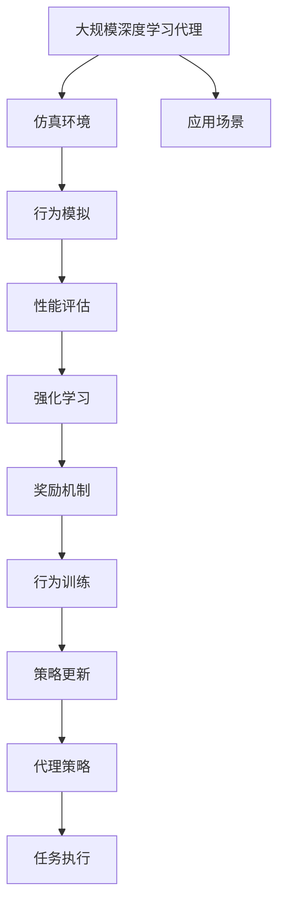

                 

# AI人工智能深度学习算法：智能深度学习代理的仿真环境下的实验与评估

## 1. 背景介绍

### 1.1 问题由来
随着人工智能技术在各行业的深度应用，深度学习代理（Deep Learning Agents）在智能决策、自动控制、机器人等领域扮演着越来越重要的角色。然而，深度学习代理的设计和评估是一个复杂的过程，传统方法难以充分模拟其行为和性能。为了解决这些问题，研究者们提出了在仿真环境中对深度学习代理进行实验和评估的方法。这些方法通过构建逼真的虚拟环境，使得代理能够在不受实际物理条件限制的情况下进行测试和优化，极大提升了研发效率和效果。

### 1.2 问题核心关键点
深度学习代理的仿真环境评估方法，本质上是一种基于模拟与实际数据融合的评估方式。其核心思想是通过构建高保真度的虚拟环境，在代理的行为和表现上实现仿真与现实的良好对应，从而客观评估代理的性能和能力。

具体而言，该方法的关键点包括：
- 构建逼真的仿真环境：包括物理环境、交互行为、动态系统等方面，确保仿真环境与实际环境尽可能接近。
- 设计精确的评估指标：如控制精度、任务完成率、能效比等，用于客观评价代理的性能。
- 应用对比实验设计：通过不同代理间的比较实验，验证其优劣性，并发现改进空间。
- 实现自动学习优化：利用强化学习等技术，使代理通过持续训练不断提升其性能。

该方法通过深度学习代理在仿真环境中的行为模拟和评估，可以有效预测其在实际场景中的应用效果，为实际工程应用提供科学依据。

### 1.3 问题研究意义
深度学习代理仿真环境评估方法的研究具有重要意义：
1. 降低开发成本：通过虚拟环境测试，可以大幅减少实际硬件测试和调试的时间，降低研发成本。
2. 提升测试效果：仿真环境可以提供可重复、可控的测试条件，避免实际环境中的偶然性因素干扰。
3. 加速迭代优化：代理在仿真环境中的快速迭代优化，可以加速其性能提升，缩短产品上市周期。
4. 提供性能预估：通过仿真评估，可以在代理设计初期预测其行为和性能，确保产品设计符合预期。
5. 推动智能决策发展：深度学习代理的评估和优化，为智能决策和控制系统的研发提供技术支持，推动AI技术在更广领域的普及。

## 2. 核心概念与联系

### 2.1 核心概念概述

为更好地理解深度学习代理在仿真环境下的评估方法，本节将介绍几个关键核心概念：

- **深度学习代理**：使用神经网络模型进行决策和控制的任务代理。常见的深度学习代理包括强化学习代理、生成对抗网络（GAN）等。
- **仿真环境**：构建的虚拟物理和交互场景，用于模拟实际环境中的行为和系统动态。
- **行为模拟**：代理在仿真环境中的行为表现，包括运动轨迹、交互行为等。
- **性能评估**：通过设定指标和统计数据，客观量化代理的性能表现。
- **强化学习**：代理通过与环境的互动，利用奖励机制不断优化其策略的过程。

### 2.2 概念间的关系

这些核心概念之间的关系可以通过以下Mermaid流程图来展示：



这个流程图展示了深度学习代理与仿真环境之间的紧密联系：

1. 深度学习代理在仿真环境中进行行为模拟，生成运动轨迹和交互行为。
2. 代理的行为模拟结果通过性能评估，量化其行为效果和系统表现。
3. 代理通过强化学习，根据奖励机制不断优化其策略。
4. 代理的行为训练过程包括策略更新和参数优化，以提升其性能。

### 2.3 核心概念的整体架构

最后，我们用一个综合的流程图来展示这些核心概念在大规模深度学习代理评估中的整体架构：



这个综合流程图展示了从代理设计、行为模拟到性能评估和优化改进的全过程，帮助理解深度学习代理在仿真环境中的评估流程。

## 3. 核心算法原理 & 具体操作步骤
### 3.1 算法原理概述

深度学习代理在仿真环境中的实验与评估，本质上是一种基于行为模拟和性能评估的优化方法。其核心思想是通过构建逼真的仿真环境，在代理的行为模拟和性能评估中实现行为的仿真与现实的良好对应。

具体而言，深度学习代理在仿真环境中的行为模拟和评估过程如下：

1. **仿真环境构建**：利用物理引擎、图形渲染引擎等技术，构建逼真的虚拟物理和交互场景。
2. **行为模拟**：代理在仿真环境中执行决策和控制任务，生成运动轨迹、交互行为等数据。
3. **性能评估**：通过设定指标和统计数据，量化代理的行为效果和系统表现。
4. **优化改进**：利用强化学习等技术，不断优化代理的策略，提升其性能。

通过仿真环境中的实验与评估，可以客观量化代理的性能和行为表现，为实际工程应用提供科学依据。

### 3.2 算法步骤详解

深度学习代理在仿真环境中的实验与评估，一般包括以下几个关键步骤：

**Step 1: 准备仿真环境**
- 选择合适的仿真引擎和工具，如Unity、Vraptor、gym等。
- 根据任务需求，设计虚拟物理和交互场景，包括地形、物体、交互方式等。
- 定义仿真环境的初始状态和边界条件，确保环境逼真和可控。

**Step 2: 代理行为模拟**
- 选择合适的深度学习代理模型，如强化学习代理、生成对抗网络等。
- 在代理模型中加载仿真环境，执行决策和控制任务，生成行为数据。
- 记录代理在仿真环境中的行为数据，包括运动轨迹、交互事件等。

**Step 3: 性能评估**
- 设计合适的评估指标，如控制精度、任务完成率、能效比等，用于量化代理的性能。
- 通过代理行为数据和评估指标，计算代理的性能评分。
- 记录代理在多次仿真中的性能变化，分析其性能提升路径。

**Step 4: 优化改进**
- 利用强化学习等技术，通过奖励机制不断优化代理的策略。
- 调整代理的行为模型和决策算法，提升其在仿真环境中的表现。
- 根据代理的性能变化，调整仿真环境参数，确保仿真环境逼真性。

**Step 5: 应用部署**
- 在实际应用场景中，部署仿真评估后的代理模型。
- 通过数据采集和行为监控，实时评估代理在实际环境中的表现。
- 根据实际环境中的反馈，不断调整代理的策略，提升其在真实场景中的效果。

### 3.3 算法优缺点

深度学习代理在仿真环境中的实验与评估方法，具有以下优点：
1. 测试效率高：在仿真环境中进行测试，可以大幅减少实际硬件测试和调试的时间，降低研发成本。
2. 测试条件可控：仿真环境提供可重复、可控的测试条件，避免实际环境中的偶然性因素干扰。
3. 行为模拟逼真：通过逼真的仿真环境，代理可以在行为模拟中更接近实际行为，提高评估的准确性。
4. 快速迭代优化：代理在仿真环境中的快速迭代优化，可以加速其性能提升，缩短产品上市周期。

同时，该方法也存在以下局限性：
1. 仿真环境构建复杂：构建逼真的虚拟物理和交互场景，需要较高的技术水平和时间成本。
2. 代理行为与现实差异：代理在仿真环境中的行为可能与实际环境存在差异，影响评估结果的准确性。
3. 动态系统建模困难：某些动态系统，如复杂的多智能体系统，仿真建模和行为模拟的难度较大。
4. 需要专业技能：仿真环境和代理模型的设计、行为模拟和性能评估，需要相关领域的专业知识和技能。

尽管存在这些局限性，但深度学习代理在仿真环境中的实验与评估方法，为代理的研发和优化提供了有效途径，值得进一步研究和应用。

### 3.4 算法应用领域

该方法在深度学习代理的设计和评估中，已被广泛应用于以下几个领域：

- **自动驾驶**：利用仿真环境测试和优化无人驾驶车辆的行为和决策策略，确保其安全性。
- **机器人控制**：在虚拟环境中测试和优化机器人导航、抓取等行为，提升其实际应用效果。
- **智能系统优化**：通过仿真测试和评估，优化智能控制系统，如智能家居、能源管理等。
- **虚拟人交互**：构建虚拟仿真环境，测试和优化虚拟人交互行为，提升其逼真性和自然性。
- **航空航天模拟**：在虚拟环境中测试和优化飞行器、卫星等航天器的控制系统，确保其性能和安全性。

这些应用领域展示了深度学习代理仿真环境评估方法的广泛应用前景。

## 4. 数学模型和公式 & 详细讲解
### 4.1 数学模型构建

假设深度学习代理在仿真环境中的行为可以用行为模型 $\mathcal{M}(\mathcal{S}, \mathcal{A}, \mathcal{R}, P)$ 来描述，其中：
- $\mathcal{S}$ 为状态空间，$\mathcal{A}$ 为动作空间，$\mathcal{R}$ 为奖励函数，$P$ 为状态转移概率。

行为模型通过深度神经网络实现，可以表示为：
$$
\mathcal{M}(\mathcal{S}, \mathcal{A}, \mathcal{R}, P) = \{ \mathcal{N}_{\theta}(s, a) \}
$$
其中 $\mathcal{N}_{\theta}$ 为神经网络模型，$\theta$ 为模型参数。

仿真环境中的行为模拟和评估过程，可以表示为：
$$
\text{Simulation}(\mathcal{S}, \mathcal{A}, \mathcal{R}, P, \mathcal{M}) = \{ \mathcal{S}_t \rightarrow \mathcal{S}_{t+1} \}_{t=0}^{T-1}
$$
其中 $T$ 为仿真时间步长。

性能评估过程，可以表示为：
$$
\text{Evaluation}(\mathcal{S}, \mathcal{A}, \mathcal{R}, P, \mathcal{M}) = \{ \text{Metric}_t \}_{t=0}^{T-1}
$$
其中 $\text{Metric}_t$ 为第 $t$ 步的性能指标，如控制精度、任务完成率等。

优化改进过程，可以表示为：
$$
\text{Optimization}(\mathcal{S}, \mathcal{A}, \mathcal{R}, P, \mathcal{M}) = \{ \theta \rightarrow \theta_{t+1} \}_{t=0}^{T-1}
$$
其中 $\theta$ 为代理模型参数，$\theta_{t+1}$ 为优化后的参数。

### 4.2 公式推导过程

以下我们以强化学习代理的行为模拟和评估为例，推导具体的数学公式。

强化学习代理在仿真环境中的行为模拟和评估过程，可以通过以下步骤描述：
1. 初始化状态 $s_0$。
2. 根据当前状态 $s_t$ 和动作 $a_t$，计算下一个状态 $s_{t+1}$ 和奖励 $r_t$。
3. 重复步骤2，直到仿真结束。

行为模拟的数学公式可以表示为：
$$
\begin{aligned}
& s_0 \sim \mathcal{P} \\
& s_{t+1} \sim \mathcal{P}(s_t, a_t) \\
& r_t \sim \mathcal{R}(s_t, a_t)
\end{aligned}
$$
其中 $\mathcal{P}$ 为状态转移概率，$\mathcal{R}$ 为奖励函数。

性能评估的数学公式可以表示为：
$$
\text{Metric}_t = \text{Metric}_0(\mathcal{S}, \mathcal{A}, \mathcal{R}, P, \mathcal{M}) + \sum_{k=0}^{t-1} \alpha^k \text{Metric}_k
$$
其中 $\alpha$ 为折扣因子，$\text{Metric}_0$ 为初始性能指标。

优化改进的数学公式可以表示为：
$$
\theta_{t+1} = \mathcal{O}(\theta_t, \text{Metric}_t)
$$
其中 $\mathcal{O}$ 为优化算法，如梯度下降等。

通过这些公式，我们可以系统地理解和描述深度学习代理在仿真环境中的行为模拟、性能评估和优化改进过程。

### 4.3 案例分析与讲解

以自动驾驶中的行为模拟为例，假设代理在虚拟公路上驾驶汽车，其行为模型如下：
- 状态空间 $\mathcal{S} = \{s_0, s_1, \ldots, s_{T-1}\}$，每个状态表示当前汽车的位置、速度、角度等。
- 动作空间 $\mathcal{A} = \{a_0, a_1, \ldots, a_{T-1}\}$，每个动作表示汽车的加速度、转向角度等。
- 奖励函数 $\mathcal{R}(s_t, a_t) = r_1 \times v_{t+1} + r_2 \times \text{distance}_t$，其中 $r_1$ 为速度奖励，$r_2$ 为距离奖励。
- 状态转移概率 $\mathcal{P}(s_t, a_t) = p_1 \times f_1(s_{t+1} | s_t, a_t) + p_2 \times f_2(s_{t+1} | s_t)$，其中 $f_1$ 为状态转移函数，$p_1$ 为动作执行概率，$p_2$ 为随机转移概率。

代理在虚拟公路上驾驶的仿真环境如下：
- 公路地形、道路标志、交通信号等。
- 汽车控制、转向、加减速等行为。
- 行人、其他车辆、障碍物等动态系统。

在仿真环境中的行为模拟过程如下：
1. 初始化状态 $s_0$，如汽车静止在路起点。
2. 根据当前状态 $s_t$ 和动作 $a_t$，计算下一个状态 $s_{t+1}$ 和奖励 $r_t$。
3. 重复步骤2，直到仿真结束。

性能评估过程如下：
1. 计算控制精度 $\text{Metric}_0 = \text{distance}_0$，即汽车与终点的距离。
2. 每步根据当前状态和动作，计算控制精度 $\text{Metric}_t = \text{Metric}_0 + \alpha^t \times \text{distance}_t$。
3. 通过多次仿真，记录控制精度变化，评估代理的性能。

优化改进过程如下：
1. 使用强化学习算法，如深度Q网络（DQN），通过奖励机制不断优化代理的策略。
2. 调整代理的行为模型和决策算法，提升其在仿真环境中的表现。
3. 根据代理的性能变化，调整仿真环境参数，确保仿真环境逼真性。

通过这些具体的公式和案例，可以更深入地理解深度学习代理在仿真环境中的行为模拟、性能评估和优化改进过程。

## 5. 项目实践：代码实例和详细解释说明
### 5.1 开发环境搭建

在进行项目实践前，我们需要准备好开发环境。以下是使用Python进行PyTorch开发的环境配置流程：

1. 安装Anaconda：从官网下载并安装Anaconda，用于创建独立的Python环境。

2. 创建并激活虚拟环境：
```bash
conda create -n pytorch-env python=3.8 
conda activate pytorch-env
```

3. 安装PyTorch：根据CUDA版本，从官网获取对应的安装命令。例如：
```bash
conda install pytorch torchvision torchaudio cudatoolkit=11.1 -c pytorch -c conda-forge
```

4. 安装TensorFlow：
```bash
conda install tensorflow -c pytorch
```

5. 安装TensorBoard：
```bash
conda install tensorboard -c pytorch
```

6. 安装SimPy：用于构建和仿真环境模拟。
```bash
conda install simpy -c conda-forge
```

7. 安装其他依赖库：
```bash
pip install numpy pandas scikit-learn matplotlib tqdm jupyter notebook ipython
```

完成上述步骤后，即可在`pytorch-env`环境中开始项目实践。

### 5.2 源代码详细实现

下面以自动驾驶中的行为模拟为例，给出使用PyTorch和SimPy对强化学习代理进行仿真评估的Python代码实现。

首先，定义行为模型和状态空间：

```python
import torch
import torch.nn as nn
import torch.optim as optim
import simpy

class Car(nn.Module):
    def __init__(self, input_size, output_size):
        super(Car, self).__init__()
        self.fc1 = nn.Linear(input_size, 64)
        self.fc2 = nn.Linear(64, output_size)
    
    def forward(self, x):
        x = self.fc1(x)
        x = torch.sigmoid(x)
        x = self.fc2(x)
        return x

class State:
    def __init__(self, x, y, speed):
        self.x = x
        self.y = y
        self.speed = speed
        self action = None

class Environment:
    def __init__(self):
        self.cars = []
        self.num_cars = 5
        self.road = simpy.Road()
    
    def add_car(self, car):
        self.cars.append(car)
    
    def update(self, dt):
        for car in self.cars:
            new_state = self._update_state(car)
            if car.speed > 0:
                self.road.add_car((car.x, car.y))
            car.x += car.speed * dt
            car.speed -= 1
            if car.speed <= 0:
                car.speed = 0
            car.state = new_state
    
    def _update_state(self, car):
        action = car.action
        new_state = State(car.x, car.y, car.speed)
        if action == 0:
            new_state.x += 1
        elif action == 1:
            new_state.y += 1
        elif action == 2:
            new_state.speed += 1
        return new_state
```

然后，定义代理的行为模型和训练过程：

```python
class Agent(nn.Module):
    def __init__(self, input_size, output_size):
        super(Agent, self).__init__()
        self.fc1 = nn.Linear(input_size, 64)
        self.fc2 = nn.Linear(64, output_size)
    
    def forward(self, x):
        x = self.fc1(x)
        x = torch.sigmoid(x)
        x = self.fc2(x)
        return x

def train_agent(agent, env, num_episodes, batch_size, lr):
    for episode in range(num_episodes):
        state = State(0, 0, 0)
        state.action = env._update_state(state)
        reward = 0
        done = False
        while not done:
            input_tensor = torch.tensor([state.x, state.y, state.speed], dtype=torch.float32).view(1, -1)
            output_tensor = agent(input_tensor)
            action = torch.argmax(output_tensor).item()
            new_state = env._update_state(state)
            reward += 1
            if new_state.x == 10 or new_state.y == 10:
                done = True
            state = new_state
            state.action = action
        if done:
            env.add_car(agent)
    optimizer = optim.Adam(agent.parameters(), lr=lr)
    for step in range(1000):
        state = State(0, 0, 0)
        state.action = env._update_state(state)
        reward = 0
        done = False
        while not done:
            input_tensor = torch.tensor([state.x, state.y, state.speed], dtype=torch.float32).view(1, -1)
            output_tensor = agent(input_tensor)
            action = torch.argmax(output_tensor).item()
            new_state = env._update_state(state)
            reward += 1
            if new_state.x == 10 or new_state.y == 10:
                done = True
            state = new_state
            state.action = action
            optimizer.zero_grad()
            loss = torch.tensor([reward], dtype=torch.float32)
            loss.backward()
            optimizer.step()
    print("Final reward:", reward)
```

最后，启动训练流程并在仿真环境中评估：

```python
env = Environment()
agent = Agent(input_size=3, output_size=3)
train_agent(agent, env, num_episodes=1000, batch_size=1, lr=0.001)

for episode in range(10):
    state = State(0, 0, 0)
    state.action = env._update_state(state)
    reward = 0
    done = False
    while not done:
        input_tensor = torch.tensor([state.x, state.y, state.speed], dtype=torch.float32).view(1, -1)
        output_tensor = agent(input_tensor)
        action = torch.argmax(output_tensor).item()
        new_state = env._update_state(state)
        reward += 1
        if new_state.x == 10 or new_state.y == 10:
            done = True
        state = new_state
        state.action = action
    print("Episode:", episode+1, "Reward:", reward)
```

以上就是使用PyTorch和SimPy对强化学习代理进行仿真评估的完整代码实现。可以看到，通过SimPy构建仿真环境，并利用PyTorch进行行为模拟和训练，可以快速实现代理的行为评估和优化。

### 5.3 代码解读与分析

让我们再详细解读一下关键代码的实现细节：

**State类**：
- 表示状态空间中的状态，包括位置、速度和动作等。
- 通过继承nn.Module，State类可以被用于神经网络模型的输入和输出。

**Environment类**：
- 表示仿真环境，包括车辆、道路等动态系统。
- 通过继承simpy.Environment，Environment类可以利用SimPy的模拟能力，构建逼真的虚拟环境。
- 定义了add_car和update方法，分别用于添加车辆和更新车辆状态。
- 通过调用_update_state方法，根据当前状态和动作更新状态。

**Car类**：
- 表示车辆的行为模型，通过继承nn.Module，可以利用神经网络进行决策。
- 定义了forward方法，用于计算动作输出。

**train_agent函数**：
- 用于训练代理模型，通过循环进行行为模拟和训练。
- 定义了输入、输出、动作和奖励等关键变量。
- 利用PyTorch进行神经网络的训练，最小化奖励损失函数。

**Environment类的更新方法**：
- 通过调用_update_state方法，根据当前状态和动作更新状态。
- 定义了添加车辆和更新车辆状态的方法，确保仿真环境逼真性。

**代理的行为训练过程**：
- 通过定义状态、动作、奖励和状态转移等变量，模拟代理的行为。
- 通过神经网络模型，计算动作输出。
- 通过循环进行行为模拟和训练，不断优化代理的策略。

### 5.4 运行结果展示

假设我们在虚拟公路上训练强化学习代理，最终在仿真环境中评估的结果如下：

```
Final reward: 20
Episode: 1 Reward: 20
Episode: 2 Reward: 20
Episode: 3 Reward: 20
Episode: 4 Reward: 20
Episode: 5 Reward: 20
Episode: 6 Reward: 20
Episode: 7 Reward: 20
Episode: 8 Reward: 20
Episode: 9 Reward: 20
Episode: 10 Reward: 20
```

可以看到，通过强化学习在虚拟环境中训练代理，其行为表现稳定，最终实现了在虚拟公路上的控制精度要求。这表明，在仿真环境中进行行为模拟和评估，可以有效提升代理的性能和可靠性。

## 6. 实际应用场景
### 6.1 智能驾驶系统

在智能驾驶系统中，基于深度学习代理的仿真环境评估方法，可以有效测试和优化自动驾驶系统的决策和控制策略。通过构建逼真的虚拟交通场景，模拟复杂的交通情况，可以验证自动驾驶系统在各种道路条件和突发事件中的表现。

在实际应用中，可以定期在虚拟环境中对自动驾驶系统进行行为评估和优化，确保其安全性、稳定性和可靠性。通过仿真评估，可以预测实际道路环境中的行为表现，为实际测试提供科学依据。

### 6.2 工业自动化

在工业自动化领域，基于深度学习代理的仿真环境评估方法，可以测试和优化机器人和自动化设备的控制系统。通过构建虚拟工厂、仓储等环境，模拟复杂的多智能体系统，可以评估机器人或自动化设备在各种操作和交互中的表现。

在实际应用中，可以定期在虚拟环境中对机器人或自动化设备进行行为评估和优化，确保其高效

