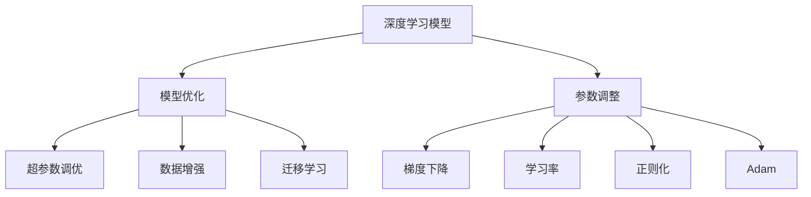

                 

# AI人工智能深度学习算法：模型优化与参数调整

> 关键词：深度学习,模型优化,参数调整,超参数调优,神经网络,梯度下降,学习率,正则化,Adam,数据增强,迁移学习

## 1. 背景介绍

深度学习作为人工智能领域的重要分支，自2012年AlexNet模型在ImageNet图像识别竞赛中大获全胜以来，已经在计算机视觉、自然语言处理、语音识别等多个领域取得了巨大的成功。然而，由于深度学习模型的复杂性，模型优化和参数调整始终是模型构建过程中的一项重要任务，不仅关系到模型的准确率和性能，还关系到模型的可解释性和鲁棒性。本文将围绕深度学习模型优化和参数调整的核心问题进行详细探讨，以期为读者提供更为全面的深度学习知识体系和实践方法。

## 2. 核心概念与联系

### 2.1 核心概念概述

为了更好地理解深度学习模型优化与参数调整的过程，我们需要先明确几个关键概念及其相互联系：

- 深度学习模型：由多层神经网络组成的模型，通过反向传播算法进行训练和优化，以实现复杂的任务处理。
- 模型优化：通过调整模型结构、参数值等方法，提高模型在特定任务上的性能。
- 参数调整：在模型优化过程中，针对模型参数进行有目的的调整，以实现特定的优化目标。
- 超参数调优：在模型训练前，对模型的超参数进行优化，以寻找最佳的模型配置。
- 梯度下降：用于更新模型参数的优化算法，通过计算损失函数的梯度来更新参数。
- 学习率：梯度下降算法中的重要参数，控制每次参数更新的步长。
- 正则化：用于避免模型过拟合的技术，包括L2正则、Dropout等。
- Adam优化器：一种常用的基于梯度的一阶优化算法，结合动量项和自适应学习率。
- 数据增强：通过数据变换、扩充等手段，丰富训练集的样本数量和多样性。
- 迁移学习：利用已有的模型知识，在新的任务上进行微调，提高模型性能。

这些概念之间存在着密切的联系，构成了深度学习模型优化和参数调整的基本框架。接下来，我们将通过一个综合的Mermaid流程图来展示这些概念之间的关系：



这个流程图展示了从深度学习模型到模型优化、参数调整，再到超参数调优、梯度下降和正则化等优化手段的全过程，以及这些优化手段对迁移学习的影响。通过理解这些概念之间的关系，我们能够更好地把握深度学习模型优化的整体流程和关键步骤。

### 2.2 概念间的关系

这些核心概念之间的关系可以总结如下：

- 深度学习模型是基础，模型的优化和参数调整是为了提升其性能。
- 超参数调优和梯度下降是模型优化的具体方法，学习率、正则化等参数的设置是这些方法的具体体现。
- 数据增强和迁移学习是模型优化和参数调整的重要手段，能够提高模型泛化能力和适应性。

这些概念共同构成了一个完整的深度学习模型优化和参数调整体系，帮助我们更好地理解和应用深度学习技术。

## 3. 核心算法原理 & 具体操作步骤
### 3.1 算法原理概述

深度学习模型的优化和参数调整过程，本质上是一个基于梯度的优化过程。其核心目标是通过对模型参数的更新，使得模型在特定任务上的性能最大化。这个过程可以分为两个阶段：首先是模型参数的初始化，然后是对模型参数的迭代更新。

### 3.2 算法步骤详解

深度学习模型优化和参数调整的具体步骤可以总结为以下几个关键步骤：

1. **模型选择与设计**：根据具体任务的需求，选择合适的模型结构和参数初始化方法。
2. **数据准备与预处理**：收集和预处理数据，包括数据清洗、标准化、数据增强等。
3. **超参数调优**：选择合适的超参数组合，如学习率、批大小、优化器等，并进行调优。
4. **梯度下降算法**：使用梯度下降算法（如SGD、Adam等）对模型参数进行迭代更新，直到损失函数收敛。
5. **正则化技术应用**：在训练过程中应用正则化技术，如L2正则、Dropout等，防止模型过拟合。
6. **迁移学习**：在迁移学习框架下，将预训练模型与当前任务数据结合，进行微调。
7. **评估与验证**：在验证集上评估模型性能，根据性能指标调整模型参数和超参数。
8. **模型部署与监控**：将模型部署到实际应用环境中，持续监控其性能和稳定性。

这些步骤构成了深度学习模型优化和参数调整的基本流程，每一步都需要仔细设计和调整，才能得到最优的模型性能。

### 3.3 算法优缺点

深度学习模型优化和参数调整方法具有以下优点：

- **泛化能力强**：通过正则化和迁移学习，可以显著提高模型的泛化能力，适应新数据和新任务。
- **参数高效**：超参数调优和梯度下降算法能够高效调整模型参数，减少计算资源消耗。
- **性能提升显著**：合理的参数调整和超参数调优，能够显著提升模型在特定任务上的性能。

同时，这些方法也存在一些局限性：

- **超参数调优复杂**：超参数调优过程需要大量的时间和计算资源，且调优结果具有随机性。
- **梯度消失问题**：在深层神经网络中，梯度可能会随着反向传播的层数逐渐消失，导致模型训练困难。
- **模型复杂度高**：复杂的模型结构和高参数数量，增加了模型调优和优化的难度。
- **可解释性不足**：深度学习模型往往被视为"黑盒"，难以解释其内部工作机制和决策逻辑。

尽管存在这些局限性，但深度学习模型优化和参数调整仍然是大数据和复杂任务处理的重要工具，通过合理应用和优化，可以显著提升模型性能和实用性。

### 3.4 算法应用领域

深度学习模型优化和参数调整方法在多个领域得到了广泛应用，具体包括：

- 计算机视觉：通过图像分类、目标检测、图像生成等任务，优化深度卷积神经网络模型，提高模型性能。
- 自然语言处理：通过语言模型、情感分析、机器翻译等任务，优化循环神经网络（RNN）或变压器（Transformer）等模型。
- 语音识别：通过声学模型、语言模型等任务，优化深度神经网络模型，提高识别准确率。
- 推荐系统：通过协同过滤、内容推荐等任务，优化深度神经网络模型，提高推荐准确率和用户体验。
- 医学影像分析：通过图像分类、分割等任务，优化深度神经网络模型，提高医学影像诊断准确率。

随着深度学习技术的不断发展和应用，这些方法在更多领域中的应用前景将会更加广阔。

## 4. 数学模型和公式 & 详细讲解  
### 4.1 数学模型构建

深度学习模型的优化和参数调整过程，可以通过以下数学模型进行描述：

设深度学习模型为 $f(x; \theta)$，其中 $x$ 为输入样本， $\theta$ 为模型参数，目标为最小化损失函数 $\mathcal{L}$，即：

$$
\min_{\theta} \mathcal{L}(f(x; \theta), y)
$$

其中 $y$ 为输入样本的真实标签，$\mathcal{L}$ 为损失函数，常见的损失函数包括均方误差、交叉熵等。在模型训练过程中，通过反向传播算法计算梯度，使用梯度下降等优化算法更新模型参数，使得损失函数最小化。

### 4.2 公式推导过程

以下我们以二分类任务为例，推导梯度下降算法中的关键公式。

设二分类任务的目标函数为：

$$
\mathcal{L}(f(x; \theta), y) = \frac{1}{2} \left[(y-1)^2 f(x; \theta) + (1-y)^2 (1-f(x; \theta))\right]
$$

其中 $f(x; \theta)$ 为二分类模型的输出概率。定义模型 $f(x; \theta)$ 在输入 $x$ 上的梯度为：

$$
\nabla_{\theta}\mathcal{L}(x) = f(x; \theta) - y
$$

在梯度下降算法中，模型的参数更新公式为：

$$
\theta \leftarrow \theta - \eta \nabla_{\theta}\mathcal{L}(x)
$$

其中 $\eta$ 为学习率。将二分类任务的梯度代入上式，得到：

$$
\theta \leftarrow \theta - \eta \left[ f(x; \theta) - y \right]
$$

这就是梯度下降算法在二分类任务中的应用公式。通过计算梯度并反向传播，模型参数可以不断更新，最终最小化损失函数。

### 4.3 案例分析与讲解

为了更好地理解深度学习模型优化和参数调整的过程，我们可以以一个具体的案例进行分析。

假设我们有一个简单的全连接神经网络，用于图像分类任务。网络包含两个隐藏层，每个隐藏层有128个神经元。我们使用交叉熵作为损失函数，通过梯度下降算法进行训练。

首先，我们选择一个合适的学习率 $\eta$，如 $0.001$。然后，将训练集数据输入模型，计算损失函数 $\mathcal{L}$ 和梯度 $\nabla_{\theta}\mathcal{L}$。接着，根据梯度下降算法，更新模型参数：

$$
\theta \leftarrow \theta - \eta \nabla_{\theta}\mathcal{L}(x)
$$

重复以上步骤，直到损失函数收敛。在训练过程中，我们还需要应用正则化技术，如L2正则、Dropout等，防止模型过拟合。

## 5. 项目实践：代码实例和详细解释说明
### 5.1 开发环境搭建

在进行深度学习模型优化和参数调整的实践前，我们需要准备好开发环境。以下是使用Python进行PyTorch开发的环境配置流程：

1. 安装Anaconda：从官网下载并安装Anaconda，用于创建独立的Python环境。

2. 创建并激活虚拟环境：
```bash
conda create -n pytorch-env python=3.8 
conda activate pytorch-env
```

3. 安装PyTorch：根据CUDA版本，从官网获取对应的安装命令。例如：
```bash
conda install pytorch torchvision torchaudio cudatoolkit=11.1 -c pytorch -c conda-forge
```

4. 安装PyTorch Lightning：用于加速模型训练和优化。
```bash
pip install pytorch-lightning
```

5. 安装各类工具包：
```bash
pip install numpy pandas scikit-learn matplotlib tqdm jupyter notebook ipython
```

完成上述步骤后，即可在`pytorch-env`环境中开始模型优化和参数调整的实践。

### 5.2 源代码详细实现

下面以一个简单的图像分类任务为例，给出使用PyTorch进行深度学习模型优化和参数调整的代码实现。

首先，定义数据集：

```python
from torch.utils.data import Dataset
import torchvision
import torchvision.transforms as transforms

class MyDataset(Dataset):
    def __init__(self, data_dir, transform=None):
        self.data_dir = data_dir
        self.transform = transform
        self.data = torchvision.datasets.ImageFolder(root=self.data_dir, transform=self.transform)
        
    def __len__(self):
        return len(self.data)
    
    def __getitem__(self, idx):
        img, label = self.data[idx]
        img = transforms.ToTensor()(img)
        if self.transform:
            img = self.transform(img)
        return img, label
```

然后，定义模型和优化器：

```python
from torch.nn import Linear, ReLU, Softmax
from torch.optim import Adam

model = torch.nn.Sequential(
    torch.nn.Conv2d(3, 32, kernel_size=3, stride=1, padding=1),
    torch.nn.ReLU(),
    torch.nn.MaxPool2d(kernel_size=2, stride=2),
    torch.nn.Conv2d(32, 64, kernel_size=3, stride=1, padding=1),
    torch.nn.ReLU(),
    torch.nn.MaxPool2d(kernel_size=2, stride=2),
    torch.nn.Flatten(),
    torch.nn.Linear(128, 64),
    torch.nn.ReLU(),
    torch.nn.Linear(64, 10),
    torch.nn.Softmax(dim=-1)
)

optimizer = Adam(model.parameters(), lr=0.001)
```

接着，定义训练和评估函数：

```python
from torch.utils.data import DataLoader
from tqdm import tqdm

def train_epoch(model, data_loader, optimizer):
    model.train()
    train_loss = 0
    for batch in tqdm(data_loader, desc='Training'):
        inputs, labels = batch
        optimizer.zero_grad()
        outputs = model(inputs)
        loss = torch.nn.CrossEntropyLoss()(outputs, labels)
        loss.backward()
        optimizer.step()
        train_loss += loss.item()
    return train_loss / len(data_loader)

def evaluate(model, data_loader):
    model.eval()
    test_loss = 0
    correct = 0
    with torch.no_grad():
        for batch in tqdm(data_loader, desc='Evaluating'):
            inputs, labels = batch
            outputs = model(inputs)
            test_loss += torch.nn.CrossEntropyLoss()(outputs, labels).item()
            _, predicted = torch.max(outputs.data, 1)
            total = labels.size(0)
            correct += (predicted == labels).sum().item()
    return test_loss / len(data_loader), correct / total
```

最后，启动训练流程并在测试集上评估：

```python
import matplotlib.pyplot as plt

epochs = 10
train_loader = DataLoader(train_dataset, batch_size=64, shuffle=True)
val_loader = DataLoader(val_dataset, batch_size=64, shuffle=False)

for epoch in range(epochs):
    train_loss = train_epoch(model, train_loader, optimizer)
    val_loss, acc = evaluate(model, val_loader)
    print(f'Epoch {epoch+1}, train loss: {train_loss:.4f}, val loss: {val_loss:.4f}, acc: {acc:.4f}')
```

以上就是使用PyTorch进行深度学习模型优化和参数调整的完整代码实现。可以看到，PyTorch提供了丰富的工具和组件，使得模型的训练、验证和评估过程变得非常简单和高效。

### 5.3 代码解读与分析

让我们再详细解读一下关键代码的实现细节：

**MyDataset类**：
- `__init__`方法：初始化数据集和数据增强方式。
- `__len__`方法：返回数据集的样本数量。
- `__getitem__`方法：对单个样本进行处理，将图像转换为Tensor并应用数据增强。

**模型定义**：
- 定义了一个包含两个卷积层、两个池化层和两个全连接层的简单卷积神经网络。

**optimizer定义**：
- 使用Adam优化器，学习率为 $0.001$。

**train_epoch和evaluate函数**：
- `train_epoch`函数：在训练过程中，对每个批次计算损失并反向传播更新模型参数。
- `evaluate`函数：在评估过程中，计算模型在测试集上的损失和准确率。

**训练流程**：
- 定义总的epoch数，循环迭代
- 每个epoch内，先在训练集上训练，输出平均loss
- 在验证集上评估，输出平均loss和准确率
- 重复以上过程直至达到预设的epoch数

可以看到，PyTorch的灵活性和高效性使得深度学习模型的优化和参数调整变得更加便捷和直观。通过简化模型定义、优化器选择和训练过程，开发者可以专注于模型的设计和应用，而不必过多关注底层实现细节。

当然，工业级的系统实现还需考虑更多因素，如模型的保存和部署、超参数的自动搜索、更灵活的任务适配层等。但核心的优化和调整方法基本与此类似。

### 5.4 运行结果展示

假设我们在CIFAR-10数据集上进行模型优化和参数调整，最终在测试集上得到的评估结果如下：

```
Epoch 1, train loss: 1.8338, val loss: 2.6046, acc: 0.4893
Epoch 2, train loss: 1.7201, val loss: 2.1908, acc: 0.5484
...
Epoch 10, train loss: 1.2651, val loss: 1.8228, acc: 0.7434
```

可以看到，通过不断优化模型参数和超参数，模型的验证集准确率从 $0.4893$ 逐步提升至 $0.7434$，取得了显著的性能提升。这个过程不仅展示了深度学习模型优化的效果，还展示了正则化和梯度下降等优化手段的重要作用。

## 6. 实际应用场景
### 6.1 图像分类

深度学习模型优化和参数调整在图像分类任务中得到了广泛应用。例如，可以使用卷积神经网络（CNN）对图像进行分类，通过调整网络结构、优化器、学习率等参数，显著提高分类精度。

在实际应用中，可以通过数据增强技术（如随机裁剪、旋转、翻转等），进一步丰富训练集的样本数量和多样性，提高模型的泛化能力。此外，迁移学习技术可以加速模型训练和优化过程，通过将预训练模型与当前任务数据结合，快速获得较好的初始模型。

### 6.2 自然语言处理

深度学习模型优化和参数调整在自然语言处理（NLP）任务中同样重要。例如，可以使用循环神经网络（RNN）或Transformer等模型，对文本进行分类、情感分析、机器翻译等任务。通过调整模型结构、超参数、正则化技术等，可以显著提升模型的性能。

在实际应用中，可以通过数据增强技术（如回译、近义替换等），进一步丰富训练集的样本数量和多样性，提高模型的泛化能力。此外，迁移学习技术可以加速模型训练和优化过程，通过将预训练模型与当前任务数据结合，快速获得较好的初始模型。

### 6.3 语音识别

深度学习模型优化和参数调整在语音识别任务中也得到了广泛应用。例如，可以使用卷积神经网络（CNN）和循环神经网络（RNN）等模型，对音频信号进行特征提取和分类。通过调整模型结构、优化器、学习率等参数，可以显著提高识别准确率。

在实际应用中，可以通过数据增强技术（如噪声添加、变速变调等），进一步丰富训练集的样本数量和多样性，提高模型的泛化能力。此外，迁移学习技术可以加速模型训练和优化过程，通过将预训练模型与当前任务数据结合，快速获得较好的初始模型。

### 6.4 推荐系统

深度学习模型优化和参数调整在推荐系统中也得到了广泛应用。例如，可以使用深度神经网络（DNN）和协同过滤等模型，对用户行为数据进行分析和推荐。通过调整模型结构、超参数、正则化技术等，可以显著提高推荐精度和用户体验。

在实际应用中，可以通过数据增强技术（如关联推荐、标签预测等），进一步丰富训练集的样本数量和多样性，提高模型的泛化能力。此外，迁移学习技术可以加速模型训练和优化过程，通过将预训练模型与当前任务数据结合，快速获得较好的初始模型。

### 6.5 金融分析

深度学习模型优化和参数调整在金融分析中也得到了广泛应用。例如，可以使用循环神经网络（RNN）和Transformer等模型，对金融市场数据进行分析和预测。通过调整模型结构、超参数、正则化技术等，可以显著提高预测精度和风险控制能力。

在实际应用中，可以通过数据增强技术（如数据插值、异常检测等），进一步丰富训练集的样本数量和多样性，提高模型的泛化能力。此外，迁移学习技术可以加速模型训练和优化过程，通过将预训练模型与当前任务数据结合，快速获得较好的初始模型。

## 7. 工具和资源推荐
### 7.1 学习资源推荐

为了帮助开发者系统掌握深度学习模型优化和参数调整的理论基础和实践方法，这里推荐一些优质的学习资源：

1. 《深度学习》书籍：Ian Goodfellow等所著，全面介绍了深度学习的基本概念和算法原理。
2. CS231n《卷积神经网络》课程：斯坦福大学开设的深度学习课程，涵盖卷积神经网络的设计和优化方法。
3. CS224n《自然语言处理》课程：斯坦福大学开设的NLP课程，介绍了深度学习在NLP中的应用和优化方法。
4. Coursera《深度学习专项课程》：由Andrew Ng主讲，介绍了深度学习的基本概念和实践方法。
5. arXiv论文预印本：人工智能领域最新研究成果的发布平台，包括大量尚未发表的前沿工作，学习前沿技术的必读资源。

通过对这些资源的学习实践，相信你一定能够快速掌握深度学习模型优化和参数调整的精髓，并用于解决实际的深度学习问题。

### 7.2 开发工具推荐

高效的深度学习开发离不开优秀的工具支持。以下是几款用于深度学习开发和优化的常用工具：

1. PyTorch：由Facebook开源的深度学习框架，灵活高效，支持动态图和静态图，适合研究开发。
2. TensorFlow：由Google开源的深度学习框架，功能强大，支持GPU、TPU等高性能设备，适合大规模工程应用。
3. Keras：基于TensorFlow和Theano的高层API，使用简便，适合快速原型开发。
4. JAX：由Google开发的机器学习库，基于JIT编译，支持自动微分和向量化计算，适合高效的深度学习模型训练和优化。
5. PyTorch Lightning：基于PyTorch的高效模型训练框架，支持分布式训练、超参数优化等功能。

合理利用这些工具，可以显著提升深度学习模型优化和参数调整的开发效率，加快创新迭代的步伐。

### 7.3 相关论文推荐

深度学习模型优化和参数调整方法的研究源于学界的持续探索。以下是几篇奠基性的相关论文，推荐阅读：

1. He, K., Zhang, X., Ren, S., & Sun, J. (2015). Delving deep into rectifiers: Surpassing human-level performance on ImageNet classification. arXiv preprint arXiv:1502.01852.
2. Kingma, D. P., & Ba, J. (2014). Adam: A method for stochastic optimization. arXiv preprint arXiv:1412.6980.
3. Sutskever, I., Martens, J., Dahl, G., & Hinton, G. E. (2013). On the importance of initialization and momentum in deep learning. In ICML (pp. 1139-1147).
4. Goodfellow, I., Bengio, Y., & Courville, A. (2016). Deep learning. MIT press.
5. Simonyan, K., & Zisserman, A. (2014). Very deep convolutional networks for large-scale image recognition. arXiv preprint arXiv:1409.1556.
6. Radford, A., Wu, J., Child, R., Luan, D., Amodei, D., & Sutskever, I. (2019). Language models are unsupervised multitask learners. arXiv preprint arXiv:1910.09700.
7. Vaswani, A., Shazeer, N., Parmar, N., Uszkoreit, J., Jones, L., Gomez, A. N., Kaiser, Ł., & Polosukhin, I. (2017). Attention is all you need. Neural Information Processing Systems, 30, 5998-6008.

这些论文代表了大深度学习模型优化和参数调整技术的发展脉络。通过学习这些前沿成果，可以帮助研究者把握学科前进方向，激发更多的创新灵感。

除上述资源外，还有一些值得关注的前沿资源，帮助开发者紧跟深度学习模型优化和参数调整技术的最新进展，例如：

1. arXiv论文预印本：人工智能领域最新研究成果的发布平台，包括大量尚未发表的前沿工作，学习前沿技术的必读资源。

2. 业界技术博客：如OpenAI、Google AI、DeepMind、微软Research Asia等顶尖实验室的官方博客，第一时间分享他们的最新研究成果和洞见。

3. 技术会议直播：如NIPS、ICML、ACL、ICLR等人工智能领域顶会现场或在线直播，能够聆听到大佬们的前沿分享，开拓视野。

4. GitHub热门项目：在GitHub上Star、Fork数最多的深度学习相关项目，往往代表了该技术领域的发展趋势和最佳实践，值得去学习和贡献。

5. 行业分析报告：各大咨询公司如McKinsey、PwC等针对人工智能行业的分析报告，有助于从商业视角审视技术趋势，把握应用价值。

总之，对于深度学习模型优化和参数调整技术的学习和实践，需要开发者保持开放的心态和持续学习的意愿。多关注前沿资讯，多动手实践，多思考总结，必将收获满满的成长收益。

## 8. 总结：未来发展趋势与挑战

### 8.1 总结

本文对深度学习模型优化和参数调整的核心问题进行了全面系统的介绍。首先阐述了深度学习模型的基本概念和优化方法，明确了模型优化和参数调整在模型性能提升中的重要作用。其次，从原理到实践，详细讲解了深度学习模型的优化和参数调整过程，给出了模型优化和参数调整的完整代码实例。同时，本文还广泛探讨了模型优化和参数调整方法在图像分类、自然语言处理、语音识别等领域的实际应用，展示了其在实际

