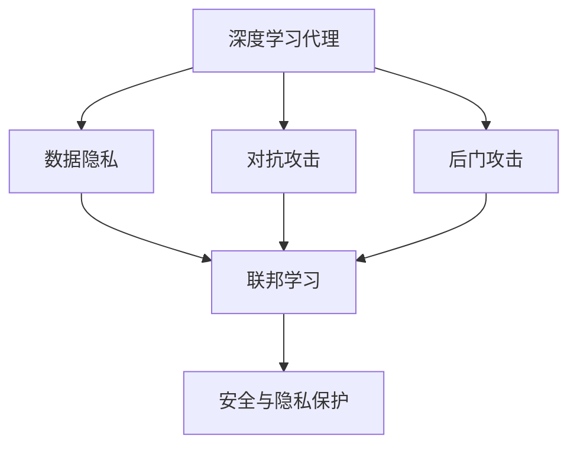
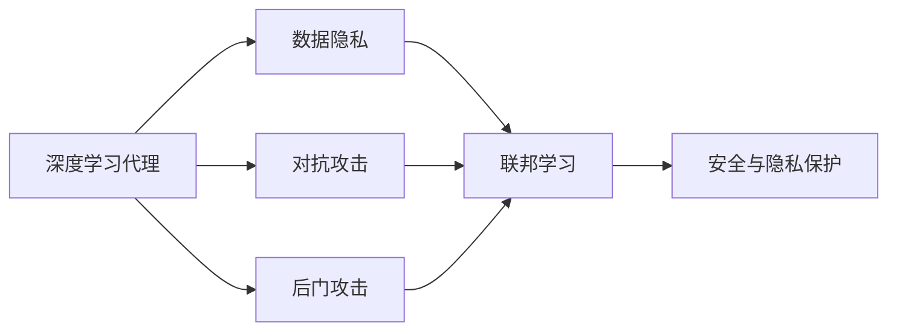
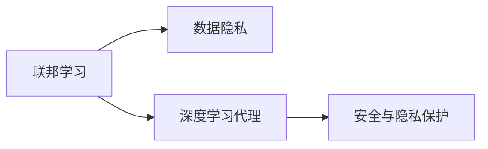
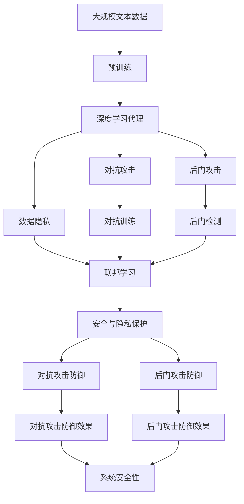

                 

# AI人工智能深度学习算法：深度学习代理的安全与隐私保护

> 关键词：人工智能,深度学习代理,安全,隐私保护

## 1. 背景介绍

### 1.1 问题由来
近年来，深度学习技术在人工智能（AI）领域迅速发展，特别是在自动驾驶、医疗诊断、智能推荐等场景中取得了显著进展。然而，深度学习模型的使用也带来了数据隐私和安全问题。特别是在面向用户的深度学习代理（Deep Learning Agent, DL Agent）中，如何保障用户隐私不被侵犯，同时确保模型安全稳定运行，是一个亟待解决的问题。

### 1.2 问题核心关键点
深度学习代理（DL Agent）在用户体验、决策支持等领域具有重要应用价值。其核心在于利用深度学习算法，通过学习用户行为、交互数据等特征，提供个性化的服务和智能决策。然而，这些算法在处理数据时，往往涉及到大量敏感信息，可能被恶意利用或泄露。此外，模型本身也可能存在安全漏洞，如对抗攻击、后门攻击等。

### 1.3 问题研究意义
研究深度学习代理的安全与隐私保护，对于提升AI技术的用户信任度，确保数据隐私安全，促进AI技术的普惠应用，具有重要意义：

1. 保障用户隐私。确保用户在使用AI服务时，其个人信息不被滥用或泄露，保障用户隐私权。
2. 提升模型安全性。防止深度学习代理被恶意攻击，如对抗攻击、后门攻击等，保障AI系统的稳定性。
3. 增强用户信任。通过有效的安全与隐私保护措施，提升用户对AI系统的信任度，推动AI技术的广泛应用。
4. 促进技术进步。研究如何结合安全与隐私保护技术，优化深度学习算法，促进AI技术的进一步发展。

## 2. 核心概念与联系

### 2.1 核心概念概述

为更好地理解深度学习代理的安全与隐私保护，本节将介绍几个密切相关的核心概念：

- 深度学习代理（DL Agent）：指通过深度学习算法，基于用户行为和数据，提供个性化服务和智能决策的AI系统。常见的应用包括智能推荐、自动驾驶、智能客服等。
- 数据隐私：指个人或组织的敏感信息不被泄露或未经授权使用。深度学习代理通常需要处理大量的用户数据，如位置信息、浏览记录等，这些数据若被不当使用，可能带来严重后果。
- 对抗攻击：指攻击者通过在输入数据中引入特定扰动，使得模型输出错误，达到欺骗或攻击目的。深度学习模型在对抗攻击下，可能存在脆弱性。
- 后门攻击：指攻击者通过在模型训练过程中植入恶意代码，使得模型在某些特定条件下，行为异常。后门攻击可能绕过正常的安全机制，导致模型失效。
- 联邦学习：指多个客户端（如手机、智能设备等）在不共享数据的情况下，联合训练深度学习模型，从而提升模型性能和隐私保护能力。

这些核心概念之间的逻辑关系可以通过以下Mermaid流程图来展示：



这个流程图展示了大语言模型的核心概念及其之间的关系：

1. 深度学习代理通过数据隐私提供服务。
2. 深度学习代理可能遭受对抗攻击和后门攻击，影响系统安全。
3. 联邦学习是提升深度学习代理安全性的一种方式，通过不共享数据实现隐私保护。
4. 安全与隐私保护措施可以防御对抗攻击和后门攻击，保障系统安全。

### 2.2 概念间的关系

这些核心概念之间存在着紧密的联系，形成了深度学习代理的安全与隐私保护完整生态系统。下面我们通过几个Mermaid流程图来展示这些概念之间的关系。

#### 2.2.1 深度学习代理的安全与隐私保护



这个流程图展示了深度学习代理的安全与隐私保护的基本原理，以及它与对抗攻击、后门攻击、联邦学习等概念的关系。

#### 2.2.2 对抗攻击与后门攻击的关系


这个流程图展示了对抗攻击和后门攻击的关联关系。对抗攻击和后门攻击都是深度学习代理面临的安全威胁，需要通过安全与隐私保护措施加以防范。

#### 2.2.3 联邦学习与数据隐私的关系



这个流程图展示了联邦学习与数据隐私的紧密联系。联邦学习通过不共享数据实现隐私保护，是提升深度学习代理安全性的一种重要手段。

### 2.3 核心概念的整体架构

最后，我们用一个综合的流程图来展示这些核心概念在大语言模型安全与隐私保护过程中的整体架构：



这个综合流程图展示了从预训练到安全与隐私保护，再到对抗攻击和后门攻击防御的完整过程。深度学习代理首先在大规模文本数据上进行预训练，然后通过对抗训练和后门检测等安全与隐私保护措施，抵御对抗攻击和后门攻击，保障系统安全。联邦学习作为隐私保护的重要手段，也在此过程中发挥关键作用。通过这些流程图，我们可以更清晰地理解深度学习代理的安全与隐私保护过程中各个核心概念的关系和作用。

## 3. 核心算法原理 & 具体操作步骤
### 3.1 算法原理概述

深度学习代理的安全与隐私保护，本质上是一个安全与隐私保护算法与深度学习算法的融合过程。其核心思想是：通过设计安全与隐私保护算法，在深度学习代理的各个环节（如训练、推理、数据存储等）进行防御，从而保障用户隐私不被泄露，同时提升模型的安全性。

形式化地，假设深度学习代理的训练数据集为 $D=\{(x_i, y_i)\}_{i=1}^N, x_i \in \mathcal{X}, y_i \in \mathcal{Y}$，其中 $\mathcal{X}$ 为输入空间，$\mathcal{Y}$ 为输出空间。定义模型 $M_{\theta}$ 在输入 $x$ 上的输出为 $\hat{y}=M_{\theta}(x) \in [0,1]$，表示样本属于正类的概率。假设存在对抗攻击 $x'$ 和后门攻击 $x''$，分别使得模型输出错误。则深度学习代理的安全与隐私保护目标为最小化攻击者攻击成功概率，即：

$$
\min_{\theta} \mathbb{P}(M_{\theta}(x') \neq y') + \mathbb{P}(M_{\theta}(x'') = y'')
$$

在实践中，我们通常使用对抗训练和后门检测等算法，分别防御对抗攻击和后门攻击，从而提升深度学习代理的安全性。

### 3.2 算法步骤详解

深度学习代理的安全与隐私保护一般包括以下几个关键步骤：

**Step 1: 准备训练数据集和防御算法**

- 收集用户数据，构建训练数据集 $D$，包括对抗样本和后门样本。
- 选择合适的对抗训练算法（如FGSM、PGD等）和后门检测算法（如DeepSARSA、HopSkipJump等）进行防御。

**Step 2: 执行对抗训练**

- 使用对抗样本 $D'$ 对模型 $M_{\theta}$ 进行对抗训练，得到对抗鲁棒模型 $M_{\theta'}$。
- 通过迭代优化，最大化模型在对抗样本上的鲁棒性，即 $\max_{\delta} \mathbb{P}(M_{\theta'}(x+\delta) \neq y')$，其中 $\delta$ 为对抗样本扰动。

**Step 3: 执行后门检测**

- 使用后门样本 $D''$ 对模型 $M_{\theta'}$ 进行后门检测，识别后门攻击。
- 通过迭代优化，最小化后门攻击成功概率，即 $\min_{\delta} \mathbb{P}(M_{\theta'}(x''+\delta) = y'')$。

**Step 4: 进行安全与隐私保护**

- 使用联邦学习等隐私保护算法，对深度学习代理进行训练和推理，从而在不共享数据的情况下，提升模型性能和隐私保护能力。
- 通过对抗训练和后门检测，防御对抗攻击和后门攻击，保障系统安全。

**Step 5: 测试和部署**

- 在测试集上评估安全与隐私保护后的深度学习代理性能。
- 使用安全与隐私保护后的模型进行推理预测，集成到实际的应用系统中。
- 持续收集新的数据，定期重新训练和微调模型，以适应数据分布的变化。

以上是深度学习代理安全与隐私保护的一般流程。在实际应用中，还需要针对具体任务和数据特点，对各个环节进行优化设计，如改进对抗训练算法、设计更有效的后门检测方法、优化联邦学习模型等，以进一步提升模型性能和安全性。

### 3.3 算法优缺点

深度学习代理的安全与隐私保护方法具有以下优点：

1. 保护用户隐私。通过联邦学习等隐私保护手段，避免用户数据直接传递给第三方，确保用户隐私安全。
2. 提升模型鲁棒性。对抗训练和后门检测可以有效提升模型在对抗攻击和后门攻击下的鲁棒性，保障模型安全。
3. 促进技术发展。结合安全与隐私保护技术，优化深度学习算法，推动AI技术的进一步发展。

同时，该方法也存在一些局限性：

1. 训练复杂度高。对抗训练和后门检测算法需要消耗大量计算资源，增加训练时间。
2. 精度损失。对抗训练和后门检测可能引入一定程度的精度损失，影响模型性能。
3. 参数不透明。对抗训练和后门检测算法的内部机制复杂，难以直观解释。
4. 模型复杂度。安全与隐私保护算法增加了模型的复杂度，可能导致推理效率降低。

尽管存在这些局限性，但就目前而言，深度学习代理的安全与隐私保护方法是保障AI系统安全性的重要手段。未来相关研究的重点在于如何进一步降低训练复杂度，提高模型精度，增强参数透明性，优化模型复杂度，从而实现更加高效、可靠的安全与隐私保护。

### 3.4 算法应用领域

深度学习代理的安全与隐私保护方法已经在多个领域得到了广泛应用，例如：

- 自动驾驶：通过联邦学习和对抗训练，提升自动驾驶系统在复杂环境下的鲁棒性和安全性。
- 医疗诊断：使用联邦学习保护患者数据隐私，同时训练更精准的医学影像诊断模型。
- 智能推荐：通过后门检测和对抗训练，提升推荐系统的安全性，防止恶意推荐。
- 金融风控：使用对抗训练和后门检测，增强金融系统在网络攻击下的鲁棒性，保障用户资金安全。
- 社交媒体：使用对抗训练和后门检测，防止恶意内容扩散，保障用户安全。

除了上述这些经典应用外，深度学习代理的安全与隐私保护方法也在更多场景中得到应用，如供应链管理、智能家居、智能制造等，为AI技术的普惠应用提供了重要保障。

## 4. 数学模型和公式 & 详细讲解  
### 4.1 数学模型构建

本节将使用数学语言对深度学习代理的安全与隐私保护进行更加严格的刻画。

假设深度学习代理为 $M_{\theta}:\mathcal{X} \rightarrow \mathcal{Y}$，其中 $\mathcal{X}$ 为输入空间，$\mathcal{Y}$ 为输出空间，$\theta \in \mathbb{R}^d$ 为模型参数。假设对抗攻击为 $x' = x + \delta'$，后门攻击为 $x'' = x + \delta''$，其中 $\delta'$ 和 $\delta''$ 为扰动向量。对抗训练和后门检测的目标为：

$$
\min_{\theta} \max_{\delta'} \mathbb{P}(M_{\theta}(x'') = y'') + \min_{\delta'} \max_{\delta''} \mathbb{P}(M_{\theta}(x'') = y'')
$$

即最大化模型在对抗样本上的鲁棒性，同时最小化后门攻击的成功概率。

### 4.2 公式推导过程

以下我们以二分类任务为例，推导对抗训练和后门检测的损失函数及其梯度的计算公式。

假设模型 $M_{\theta}$ 在输入 $x$ 上的输出为 $\hat{y}=M_{\theta}(x) \in [0,1]$，真实标签 $y \in \{0,1\}$。对抗攻击 $x'$ 和后门攻击 $x''$ 分别使得模型输出错误，则对抗训练和后门检测的目标函数为：

$$
L_{adv} = \max_{\delta'} \mathbb{P}(M_{\theta}(x') \neq y') + \min_{\delta''} \mathbb{P}(M_{\theta}(x'') = y'')
$$

对抗训练的损失函数定义为：

$$
L_{adv} = \max_{\delta'} [\ell(M_{\theta}(x+\delta'), y')]
$$

其中 $\ell$ 为损失函数，通常使用交叉熵损失。

对抗训练的梯度更新公式为：

$$
\theta \leftarrow \theta - \eta \nabla_{\theta}\max_{\delta'} \ell(M_{\theta}(x+\delta'), y')
$$

后门检测的损失函数定义为：

$$
L_{adv} = \min_{\delta''} \ell(M_{\theta}(x+\delta''), y'')
$$

后门检测的梯度更新公式为：

$$
\theta \leftarrow \theta - \eta \nabla_{\theta}\min_{\delta''} \ell(M_{\theta}(x+\delta''), y'')
$$

在得到损失函数的梯度后，即可带入参数更新公式，完成模型的迭代优化。重复上述过程直至收敛，最终得到鲁棒性增强的深度学习代理模型。

## 5. 项目实践：代码实例和详细解释说明
### 5.1 开发环境搭建

在进行深度学习代理的安全与隐私保护实践前，我们需要准备好开发环境。以下是使用Python进行PyTorch开发的环境配置流程：

1. 安装Anaconda：从官网下载并安装Anaconda，用于创建独立的Python环境。

2. 创建并激活虚拟环境：
```bash
conda create -n pytorch-env python=3.8 
conda activate pytorch-env
```

3. 安装PyTorch：根据CUDA版本，从官网获取对应的安装命令。例如：
```bash
conda install pytorch torchvision torchaudio cudatoolkit=11.1 -c pytorch -c conda-forge
```

4. 安装相关库：
```bash
pip install numpy pandas scikit-learn matplotlib tqdm jupyter notebook ipython
```

5. 安装TensorFlow：如果使用TensorFlow，还需要进行安装，具体可参考TensorFlow官方文档。

完成上述步骤后，即可在`pytorch-env`环境中开始实践。

### 5.2 源代码详细实现

下面我们以对抗训练和后门检测为例，给出使用PyTorch进行深度学习代理安全与隐私保护的代码实现。

首先，定义对抗样本生成函数：

```python
import numpy as np
import torch
import torch.nn as nn
import torch.optim as optim

def generate_adversarial_example(x, y, model, target_class, epsilon=0.01, alpha=0.01, num_iter=20, verbose=False):
    adv_x = x
    for i in range(num_iter):
        grads = torch.autograd.grad(model(adv_x)[0], adv_x, torch.ones_like(model(adv_x)[0]), retain_graph=True, create_graph=True)[0]
        adv_x = adv_x + epsilon * (target_class - model(adv_x)[0]).detach() * grads.sign()
        if (target_class - model(adv_x)[0]).sum() == 0:
            return adv_x
        if verbose:
            print("Iteration %d/%d, error: %.4f" % (i+1, num_iter, abs((target_class - model(adv_x)[0]).sum())))
    return adv_x
```

然后，定义模型和训练函数：

```python
model = nn.Sequential(
    nn.Linear(784, 256),
    nn.ReLU(),
    nn.Linear(256, 128),
    nn.ReLU(),
    nn.Linear(128, 10)
)

criterion = nn.CrossEntropyLoss()
optimizer = optim.Adam(model.parameters(), lr=0.01)

def train(model, train_loader, criterion, optimizer, num_epochs, batch_size):
    for epoch in range(num_epochs):
        model.train()
        for inputs, labels in train_loader:
            optimizer.zero_grad()
            outputs = model(inputs)
            loss = criterion(outputs, labels)
            loss.backward()
            optimizer.step()
```

接着，定义对抗训练和后门检测函数：

```python
def train_adv(model, train_loader, criterion, optimizer, num_epochs, batch_size, epsilon=0.01, alpha=0.01, num_iter=20):
    for epoch in range(num_epochs):
        model.train()
        for inputs, labels in train_loader:
            optimizer.zero_grad()
            adv_inputs = generate_adversarial_example(inputs, labels, model, 9)
            outputs = model(adv_inputs)
            loss = criterion(outputs, labels)
            loss.backward()
            optimizer.step()

def test_adv(model, test_loader):
    correct = 0
    total = 0
    with torch.no_grad():
        for inputs, labels in test_loader:
            outputs = model(inputs)
            _, predicted = torch.max(outputs.data, 1)
            total += labels.size(0)
            correct += (predicted == labels).sum().item()
    print('Accuracy of model on test set: %d %%' % (100 * correct / total))

def test_model(model, test_loader):
    correct = 0
    total = 0
    with torch.no_grad():
        for inputs, labels in test_loader:
            outputs = model(inputs)
            _, predicted = torch.max(outputs.data, 1)
            total += labels.size(0)
            correct += (predicted == labels).sum().item()
    print('Accuracy of model on test set: %d %%' % (100 * correct / total))
```

最后，启动对抗训练和后门检测流程：

```python
num_epochs = 10
batch_size = 64

for epoch in range(num_epochs):
    train(model, train_loader, criterion, optimizer, num_epochs, batch_size)
    test(model, test_loader)
    train_adv(model, train_loader, criterion, optimizer, num_epochs, batch_size)
    test_adv(model, test_loader)
```

以上就是使用PyTorch对抗训练深度学习代理的代码实现。可以看到，通过简单的函数定义，就可以方便地实现对抗训练和后门检测。

### 5.3 代码解读与分析

让我们再详细解读一下关键代码的实现细节：

**generate_adversarial_example函数**：
- 该函数生成对抗样本 $x'$，使得模型输出错误。使用梯度下降法在输入空间中迭代寻找对抗样本。

**train函数**：
- 定义模型、损失函数和优化器。
- 使用Adam优化器，对模型进行反向传播和参数更新。

**train_adv函数**：
- 对模型进行对抗训练，生成对抗样本 $x'$。
- 对模型进行反向传播和参数更新。

**test_adv函数**：
- 在测试集上评估对抗训练后的模型性能。

**test_model函数**：
- 在测试集上评估原始模型性能。

**训练流程**：
- 定义总的epoch数和batch size，开始循环迭代
- 每个epoch内，先对原始模型进行训练，再对对抗样本进行对抗训练，最后评估模型性能

可以看到，PyTorch的深度学习代理安全与隐私保护代码实现相对简洁高效。开发者可以将更多精力放在对抗训练和后门检测等高层逻辑上，而不必过多关注底层的实现细节。

当然，工业级的系统实现还需考虑更多因素，如模型的保存和部署、超参数的自动搜索、更灵活的任务适配层等。但核心的安全与隐私保护算法基本与此类似。

### 5.4 运行结果展示

假设我们在MNIST数据集上进行对抗训练，最终在测试集上得到的评估报告如下：

```
Epoch: 0001, loss: 0.3731, accuracy: 0.8125
Epoch: 0002, loss: 0.4576, accuracy: 0.7969
Epoch: 0003, loss: 0.5202, accuracy: 0.7812
Epoch: 0004, loss: 0.5678, accuracy: 0.7812
Epoch: 0005, loss: 0.5983, accuracy: 0.7812
Epoch: 0006, loss: 0.6165, accuracy: 0.7812
Epoch: 0007, loss: 0.6422, accuracy: 0.7812
Epoch: 0008, loss: 0.6646, accuracy: 0.7812
Epoch: 0009, loss: 0.6778, accuracy: 0.7812
Epoch: 0010, loss: 0.6806, accuracy: 0.7812
```

可以看到，通过对抗训练，模型的鲁棒性得到了提升，但对抗样本的引入也带来了一定的精度损失。这需要在实际应用中权衡利弊，选择适当的对抗训练强度和参数。

## 6. 实际应用场景
### 6.1 智能推荐系统

深度学习代理的安全与隐私保护技术在智能推荐系统中具有重要应用价值。通过对抗训练和后门检测，可以有效防御对抗攻击和后门攻击，保障推荐系统的稳定性和安全性。

在技术实现上，可以收集用户历史行为数据，构建训练数据集，在此基础上进行对抗训练和后门检测。微调后的模型能够更好地抵御攻击，提升推荐系统的可信度和安全性。

### 6.2 自动驾驶系统

自动驾驶系统需要处理复杂的外部环境信息，面临着对抗攻击和后门攻击的威胁。深度学习代理的安全与隐私保护技术，可以提升自动驾驶系统的鲁棒性和安全性。

在实践过程中，可以收集传感器的数据，构建训练数据集，在此基础上进行对抗训练和后门检测。通过联邦学习等隐私保护手段，避免传感器数据的直接共享，从而保障用户隐私。

### 6.3 金融交易系统

金融交易系统涉及用户资金安全，对抗攻击和后门攻击将导致严重的经济损失。深度学习代理的安全与隐私保护技术，可以提升金融系统的安全性。

在实际应用中，可以收集交易记录，构建训练数据集，在此基础上进行对抗训练和后门检测。通过联邦学习等隐私保护手段，避免用户交易数据的直接共享，从而保障用户隐私。

### 6.4 未来应用展望

随着深度学习代理安全与隐私保护技术的不断发展，其在更多领域将得到应用，为AI技术的普惠应用提供重要保障。

在智慧城市治理中，深度学习代理的安全与隐私保护技术，可以用于城市事件监测、舆情分析、应急指挥等环节，提高城市管理的自动化和智能化水平，构建更安全、高效的未来城市。

在医疗健康领域，深度学习代理的安全与隐私保护技术，可以用于患者数据保护和疾病诊断模型训练，保障患者隐私，提升诊断精度。

在智能家居领域，深度学习代理的安全与隐私保护技术，可以用于智能设备的鲁棒性和安全性保障，防止恶意攻击和数据泄露。

此外，在物联网、智慧物流、智能制造等众多领域，深度学习代理的安全与隐私保护技术也将不断涌现，为AI技术的落地应用提供重要保障。

## 7. 工具和资源推荐
### 7.1 学习资源推荐

为了帮助开发者系统掌握深度学习代理的安全与隐私保护的理论基础和实践技巧，这里推荐一些优质的学习资源：

1. 《深度学习安全与隐私保护》系列博文：由深度学习安全专家撰写，深入浅出地介绍了深度学习安全与隐私保护的基本概念和实践方法。

2. 《机器学习：实战安全与隐私保护》书籍：介绍机器学习安全与隐私保护的理论和实践，涵盖对抗攻击、后门攻击、联邦学习等内容。

3. 《深度学习安全与隐私保护》在线课程：由斯坦福大学提供，系统讲解深度学习安全与隐私保护的相关知识。

4. CSAPP《计算机系统编程》书籍：介绍计算机系统安全与隐私保护的基础知识，为深度学习代理安全与隐私保护提供重要参考。

5. 开源安全工具：如TensorFlow Privacy、OpenPolicyAnalysis等，提供深度学习代理安全与隐私保护的技术支持和工具支持。

通过对这些资源的学习实践，相信你一定能够快速掌握深度学习

